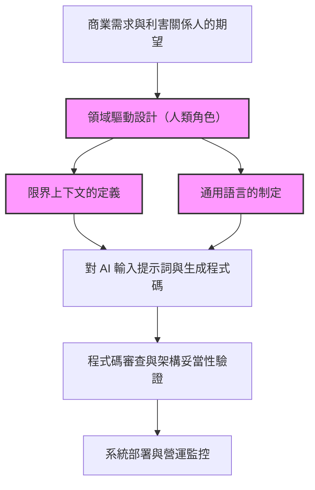
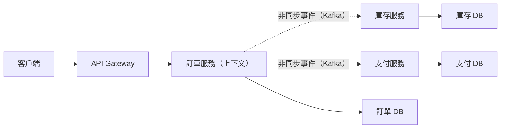
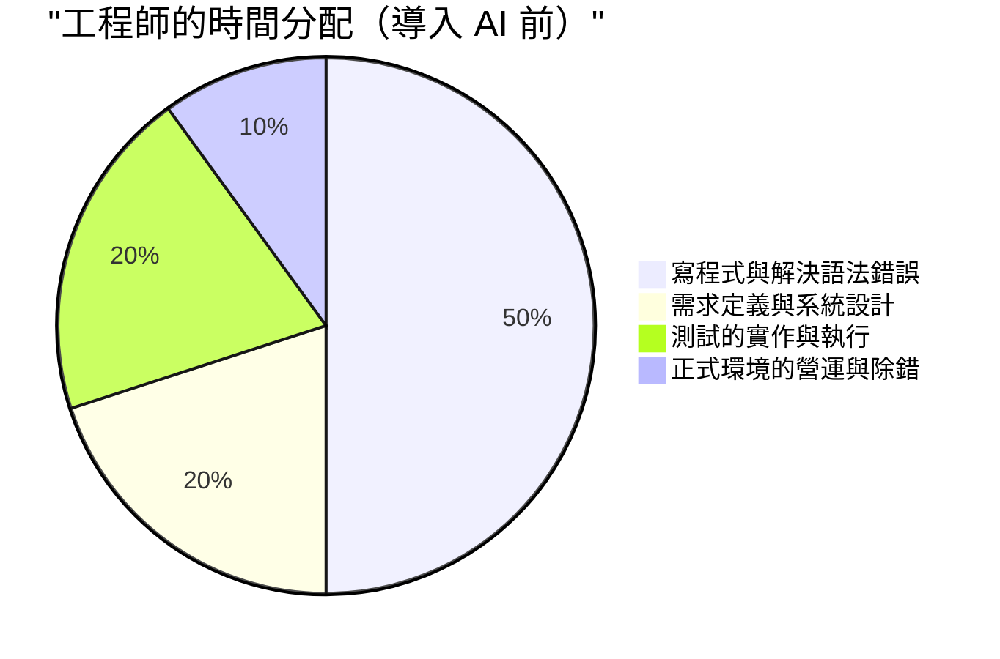
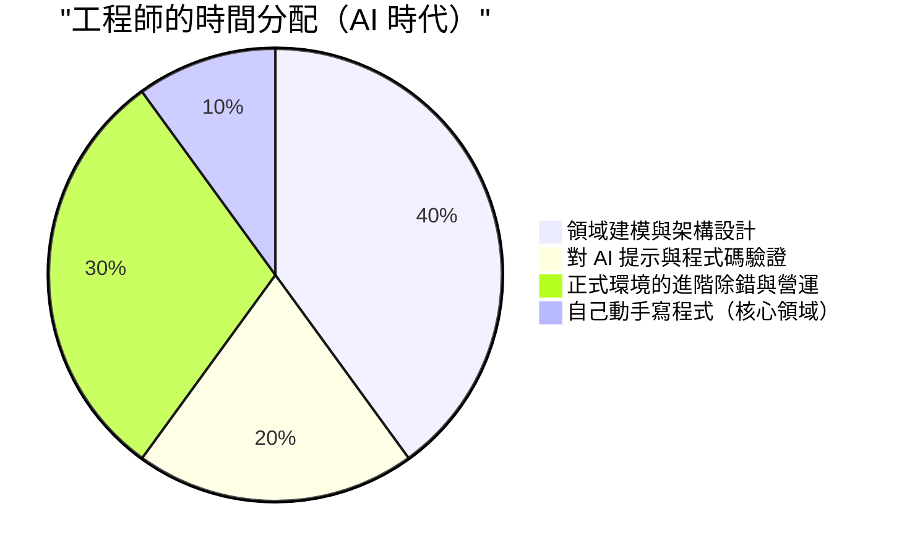

# AI 寫程式時代所需要的「人類專屬工程師技能」

近年來，隨著生成式 AI (Generative AI) 與大型語言模型 (LLM) 的飛躍性進化，軟體工程的風景發生了劇烈變化。GitHub Copilot 及各種 AI 寫程式助手的日常使用，讓「只要用自然語言下達指令，AI 就能瞬間生成程式碼」這件事，不再是未來的科幻情節，而是今日的現實。

在這樣的時代中，許多工程師會感到「自己的工作是不是會被 AI 奪走」的不安，這是很自然的。確實，像是建立典型 CRUD 應用的樣板 (Boilerplate)、實作簡單演算法，或是呼叫常見函式庫的 API 這些「單純的寫程式工作 (Typing Code)」正在快速商品化 (Commoditization)。

然而，軟體工程的本質並非「打出程式碼」。而是透過技術解決商業課題，並建構出具備可擴展性與可維護性的系統。本篇文章將針對在 AI 寫程式的時代中，價值反而會提高的「人類專屬工程師技能」，從 LLM 的技術限制、領域驅動設計 (DDD)、系統架構、以及分散式系統的除錯等觀點，進行極其詳細且具技術深度的探討。

---

## 1. 理解大型語言模型 (LLM) 的結構性限制

為了正確評估 AI 的能力，並看清人類應該在哪個領域發揮價值，首先必須從數學與架構的觀點，理解 AI（特別是 LLM）的結構性限制。

### 1.1 Transformer 架構中的運算量與上下文限制

目前大部分的 LLM 都是基於 Google 在 2017 年發表的「Transformer」架構。Transformer 的核心在於「自注意力機制 (Self-Attention Mechanism)」。自注意力機制會計算輸入序列中的每個標記 (Token) 與其他所有標記之間的關聯程度。

這個注意力機制的計算公式可以表示如下：

$$ \text{Attention}(Q, K, V) = \text{softmax}\left(\frac{QK^T}{\sqrt{d_k}}\right)V $$

這裡的 $Q$ (Query)、$K$ (Key)、$V$ (Value) 是輸入序列的線性轉換，而 $d_k$ 是鍵 (Key) 的維度數。
在這個計算中最嚴重的限制是矩陣乘法 $QK^T$ 所帶來的運算量。如果將輸入序列（標記數量）設為 $N$，則此運算量在時間與空間（記憶體）上都會以 $O(N^2)$ 的級別增加。

$$ \text{Complexity} = O(N^2 \cdot d) $$

近年來，雖然像是 FlashAttention 這種硬體層級的最佳化、Sparse Attention，甚至是 Mamba (State Space Models) 等能以線性時間 $O(N)$ 處理的替代架構研究正在進行，但要「完全理解無限的上下文，並生成整體最佳化的輸出」依然是非常困難的。

此外，即使物理上擴大了上下文視窗 (Context Window)，也會發生被稱為「Lost in the Middle（中間資訊流失）」的現象。LLM 很容易受到提示詞 (Prompt) 開頭與結尾資訊的強烈影響，而傾向於忽略配置在中間的重要需求或限制。如果讓 LLM 讀取高達數萬行的企業級系統完整原始碼，並指示它「進行最佳的重構」，最終往往會生成局部正確、但整體邏輯崩潰的程式碼，原因就在於此。

### 1.2 機率生成模型的特性與「幻覺 (Hallucination)」

LLM 的本質是一個「機率生成模型」，它會根據輸入的上下文（提示詞）與至今為止的生成結果，預測下一個出現機率最高的標記。

$$ P(w_t | w_{1:t-1}) = \text{softmax}(W \cdot h_t) $$

模型只是從龐大的訓練資料中學習「詞彙統計上的共現關係 (Co-occurrence)」，它並未理解所生成的程式碼之「語意 (Semantics)」或「執行結果對現實世界的影響」。由此產生的就是所謂的「幻覺 (Hallucination)」。
像是呼叫不存在的虛構函式庫，或是傳遞型別不符的變數等 Bug，都只不過是 LLM 生成了「文法上看起來像樣（機率較高）的標記序列」所導致的結果。

### 1.3 缺乏現實世界接地 (Grounding)

AI 缺乏能夠實際感受「物理限制」或「實際商業限制」的能力 (Grounding)。例如，「如果支付處理的延遲增加 100ms，轉換率就會下降 5%」這種商業現實，或者是「這個傳統資料庫在深夜 2 點會執行批次處理，因此那個時段的交易很容易超時 (Timeout)」這種環境特有的隱性知識，除非被明確地以文字提供，否則 AI 是無法考慮進去的。

基於這些技術與結構上的限制，我們可以看出，雖然 AI 作為「在定義明確且範圍狹窄（函式、類別、模組）的條件下高速生成程式碼的工具」非常優秀，但「從模糊的需求中設計整體系統，並使其與現實世界的限制保持一致」，依然是只有人類才能勝任的領域。

---

## 2. 人類專屬技能①：從模糊的需求中萃取「真正的課題」

軟體開發中最大的難關，並不是寫程式碼本身。
軟體工程經典名著《人月神話》的作者 Frederick Brooks 曾這麼說過：

> "The hardest single part of building a software system is deciding precisely what to build."
> （在建構軟體系統時，最困難的單一部分就是精確決定要建構什麼。）

非技術的利害關係人（管理層、業務部門、客戶），大多無法將他們真正想要的東西語言化。「希望能用 AI 做一個提升營業額的系統」、「想要一個按個按鈕就能全部自動化的畫面」，這類極度模糊又充滿矛盾的需求是日常便飯。

就算把「寫一個能提升營業額的系統的程式碼」當作提示詞輸入給 AI，它也生不出能用的系統。工程師被要求的是以下流程：

1. **深入探討領域 (Domain)**：透過對話，引導出利害關係人話語背後的「真正商業課題」。
2. **定義需求範圍 (Scope)**：權衡技術的可行性與成本 (ROI)，決定「不應該做的事情」。
3. **規格形式化**：將模糊的需求，轉換為 AI 能夠理解的明確邏輯限制（提示詞或架構設計圖）。

這種「人與人之間高度的溝通與談判」，是 AI 絕對無法取代的、具備強烈個人屬性且高價值的一項技能。

---

## 3. 人類專屬技能②：領域驅動設計 (DDD) 與建模

在釐清需求之後，將其落實為軟體結構的最強大武器就是「領域驅動設計 (Domain-Driven Design: DDD)」。當 AI 越來越能自動生成局部程式碼時，如何在整體系統中劃分「邊界」，這種 DDD 的概念就變得極為重要。

### 3.1 制定通用語言 (Ubiquitous Language)

在系統開發中，如果商業端與開發端對「詞彙的定義」有落差，AI 就會在錯誤的上下文中生成程式碼。例如「使用者 (User)」這個詞，對行銷部門來說可能指「潛在客戶 (Lead)」，而對客服部門來說可能指「已簽約的帳戶」。
人類工程師必須制定在整個專案中統一的「通用語言」，並徹底應用在程式碼的類別名稱、方法名稱，甚至給 AI 的提示詞之中。

### 3.2 限界上下文 (Bounded Context) 的設計

如果試圖用一個單一模型來表現巨大的系統，必定會崩潰。在 DDD 中，會將系統切割成有意義的邊界 (Bounded Context)。
例如，在電商網站中，「商品 (Product)」這個概念，在型錄（展示）上下文與庫存（管理）上下文中，其應有的屬性與行為是完全不同的。

由人類架構師畫出正確的限界上下文，並針對每個上下文給予 AI 獨立的提示詞與規格，AI 才能夠基於「正確的領域知識」生成程式碼。

下圖展示了 AI 時代中 DDD 的方法與角色分工。

不應該直接指示 AI「幫我做一個完整的系統」，而是將實作範圍限定在人類定義的「限界上下文」內部並委派給 AI。這將會是未來軟體開發的基本典範 (Paradigm)。

---

## 4. 人類專屬技能③：分散式系統的架構設計與擴展

現代軟體已經從運行於單一伺服器上的單體架構 (Monolith)，進化到雲端原生的微服務架構 (Microservices Architecture) 及事件驅動架構 (Event-Driven Architecture)。設計這種分散式系統，對於只能做到局部邏輯最佳化的 AI 來說，是一個非常困難的領域。

### 4.1 CAP 定理與取捨 (Trade-off) 判斷

在設計分散式系統時，工程師總是會面臨「CAP 定理」。CAP 定理是指，分散式系統在以下三個特性中，最多只能同時滿足兩個：

- **Consistency (一致性)**: 所有節點在同一時間是否能看到相同的資料
- **Availability (可用性)**: 即使部分節點發生故障，系統是否仍能持續回應
- **Partition Tolerance (分區容忍性)**: 即使發生網路分區（斷線），系統是否仍能持續運作

$$ P(\text{Availability} \cup \text{Consistency}) | \text{PartitionTolerance} $$

在實際的網路中，分區 (Partition) 是不可避免的，因此工程師必須做出與商業需求直接相關的嚴格取捨判斷，例如「這個支付系統優先考慮 Consistency，發生故障時寧可停止服務 (CP)」或是「這個社群網站的時間軸優先考慮 Availability，容許暫時的資料不一致 (AP)」。

AI 雖然能寫出「優先考慮 C 的程式碼」或「優先考慮 A 的程式碼」，但它無法自主做出「應該優先考慮哪一個」這種包含商業風險的決定。

### 4.2 非同步通訊與最終一致性 (Eventual Consistency)

當系統規模擴大時，服務間的整合會從基於 REST API 的同步通訊，轉移到使用訊息佇列 (Message Queue，如 Kafka, RabbitMQ) 的非同步通訊。此時，資料一致性就會從即時一致性變為「最終一致性 (Eventual Consistency)」。
應該在什麼時機導入 Saga 模式或 CQRS (Command Query Responsibility Segregation) 等進階架構模式？制定這些複雜的決策與描繪系統整體的藍圖，正是資深工程師的真本領。

---

## 5. 人類專屬技能④：複雜系統的除錯與疑難排解

AI 生成的程式碼越多，在正式環境中運行「沒有人能完全理解的程式碼」的風險就越高。平時或許能順利運作，但在發生故障時的疑難排解，才是考驗人類工程師真正價值的時候。

### 5.1 可觀測性 (Observability) 的設計

為了迅速解決系統故障，光是把錯誤日誌貼給 AI 是不夠的。在微服務環境中，一個請求可能會橫跨數十個服務。
工程師必須在系統中妥善嵌入「可觀測性三大支柱」：日誌 (Logs)、指標 (Metrics) 與追蹤 (Traces)。利用 OpenTelemetry 等工具，建立能透過分散式追蹤找出「是哪個服務的哪個資料庫查詢導致延遲」的基礎設施，這是人類的職責。

### 5.2 環境依賴的 Bug 與混沌工程 (Chaos Engineering)

「在本地或測試環境無法重現，只在正式環境的尖峰時段才會發生的 Bug」——例如，記憶體流失 (Memory Leak)、資料庫死結 (Deadlock)、連線池耗盡、網路封包遺失等問題，絕對無法光靠原始碼的靜態分析就能發現。

人類工程師需要盯著正式環境的指標建立假說，分析執行緒傾印 (Thread Dump) 與堆積傾印 (Heap Dump)，找出瓶頸所在。AI 無法直接敲終端機對正式伺服器的程序進行效能分析 (Profiling)（基於安全性要求，也不該被允許）。
系統越複雜，具備實體基礎設施、網路協定、作業系統核心調校等「底層知識」與「直覺假說推論能力」的工程師，其價值就越高。

---

## 6. AI 時代工程師的價值函數與時間分配

如上所述，在 AI 時代中，工程師所需具備的技能組合正在發生巨大的典範轉移。如果將其用數學公式建模，工程師創造的價值 ($V$) 可以表示如下：

$$ V = \left( \sum_{i=1}^{n} \text{DomainKnowledge}_i + \text{ArchitectureSkill} + \text{ProblemSolving} \right) \times \text{AI\_Leverage}^{\alpha} $$

傳統的「寫程式速度」和「對語法的記憶力」已經被排除在這個公式之外。取而代之的是，將深厚的領域知識、架構設計能力以及解決複雜問題的能力的「總和」，乘上善用 AI 的槓桿效應 ($\text{AI\_Leverage}^{\alpha}$)，這種結構將能產生指數級別的價值。

這種典範轉移，也明確體現在工程師日常的時間分配 (Time Allocation) 上。

在 AI 時代，工程師的角色將從「程式碼的打字員」昇華為「編排整個系統的指揮家」。正因為 AI 會寫出大量的程式碼，所以從初階到資深的所有工程師，都必須擔任「審查者 (Reviewer)」與「架構師 (Architect)」的角色，負責監控並管控該程式碼的走向是否正確、是否滿足安全需求，以及是否與系統整體架構保持一致。

---

## 7. 結語：與其抗拒進化，不如駕馭浪潮

「AI 寫程式的時代」對工程師來說不是威脅，而是歷史上最大的機會。就像過去從組合語言轉換到 C 語言，以及從手動管理記憶體指標進化到 Java 的垃圾回收機制一樣，AI 自動生成程式碼只不過是「抽象化層級又往上提升了一階」。

未來的工程師不需要再為特定程式語言的細微規格，或框架的版本更新而患得患失，而是可以將資源集中在**「商業課題是什麼」、「要如何切割資料、如何整合」、「當系統停機時該如何迅速復原」**等更為本質且更具人類高度的問題解決上。

真正的工程師，不是寫程式碼的人，而是解決問題的人。
領域建模、具可擴展性的架構設計、與利害關係人的溝通，以及複雜系統的除錯。對於持續磨練這些「人類專屬工程師技能」的人來說，AI 絕對不會是奪走工作的敵人，而是能將自身創造力與生產力擴展數十倍的最強夥伴。
