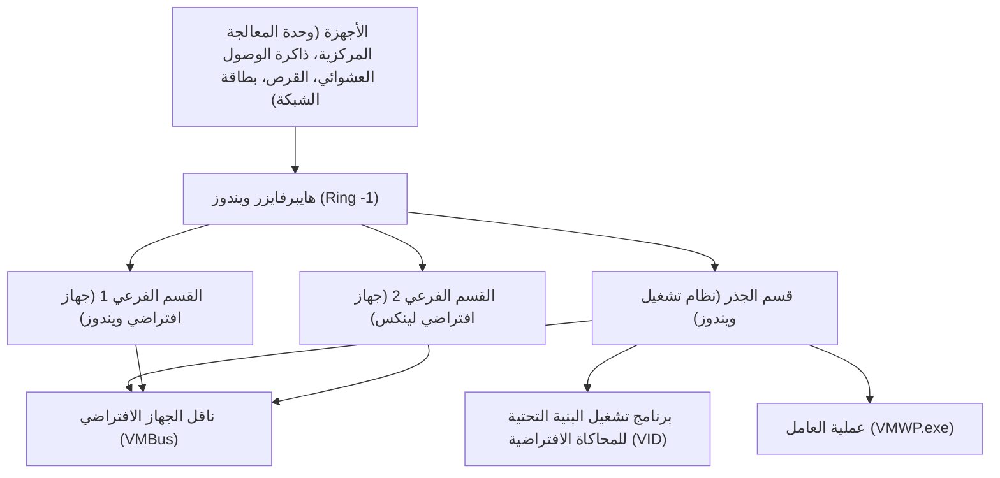

## 1. مقدمة: تطور المحاكاة الافتراضية في Windows

لقد تطورت تقنيات المحاكاة الافتراضية على منصة Windows بشكل كبير خلال العقود القليلة الماضية. في الماضي، كانت برامج الهايبرفايزر (Hypervisor) من النوع الثاني (Type 2) التابعة لجهات خارجية (مثل VMware Workstation و VirtualBox) هي السائدة، ولكن منذ أن قدمت Microsoft "Hyper-V" في Windows Server 2008، تم دمج برامج الهايبرفايزر من النوع الأول (Type 1) في أنظمة تشغيل سطح المكتب Windows 10/11.

وفي السنوات الأخيرة، أصبح "WSL2 (Windows Subsystem for Linux 2)" يحظى بأكبر قدر من الاهتمام بين المطورين. بينما كان WSL1 يعتمد على ترجمة استدعاءات النظام (System Calls)، يستخدم WSL2 "جهازاً افتراضياً خفيفاً للأدوات (Lightweight Utility VM)" يعتمد على تقنية Hyper-V، مما يوفر توافقاً كاملاً مع نظام Linux وتحسناً هائلاً في الأداء.

في هذه المقالة، سنقوم بمقارنة وشرح هاتين التقنيتين القويتين للمحاكاة الافتراضية ―― "Hyper-V" كامل الميزات، و "WSL2" المتخصص في تجربة المطورين ―― من حيث البنية، الأداء (وحدة المعالجة المركزية، الذاكرة، وإدخال/إخراج القرص (Disk I/O))، تكوين الشبكة، وأفضل حالات الاستخدام، إلى جانب تفاصيل فنية عميقة.

---

## 2. النظرية الأساسية للهايبرفايزر ومقارنة البنية (Architecture)

لفهم تقنيات المحاكاة الافتراضية، من الضروري فهم تصنيف أنواع الهايبرفايزر (مراقب الأجهزة الافتراضية: VMM).

### 2.1. الفرق بين الهايبرفايزر من النوع الأول (Type 1) والنوع الثاني (Type 2)

الهايبرفايزر عبارة عن طبقة برمجية تجرد الوصول إلى الأجهزة وتسمح لأنظمة تشغيل متعددة (أنظمة التشغيل الضيف) بالعمل في وقت واحد على جهاز مادي واحد.

*   **النوع الأول (المعدن المجرد - Bare-metal)**: يعمل مباشرة على الأجهزة. لا يوجد مفهوم لنظام التشغيل المضيف (على الرغم من أنه بالمعنى الدقيق للكلمة قد يكون هناك نظام تشغيل إدارة له امتيازات)، وله حمل زائد (Overhead) منخفض للغاية ويوفر أداءً وأماناً عاليين. أمثلة: Hyper-V و VMware ESXi و Xen.
*   **النوع الثاني (المستضاف - Hosted)**: يعمل كتطبيق على نظام التشغيل المضيف (مثل Windows أو macOS). نظراً لأن جميع عمليات الوصول إلى الأجهزة تتم عبر نظام التشغيل المضيف، فإن الحمل الزائد يكون كبيراً. أمثلة: VMware Workstation و Oracle VirtualBox.

يعد Hyper-V الخاص بـ Windows **هايبرفايزر نقياً من النوع الأول (Type 1)**. عندما تقوم بتمكين Hyper-V، فإن نظام تشغيل Windows الفعلي الذي يتفاعل معه المستخدم عادة سيعمل أيضاً داخل جهاز افتراضي خاص يسمى "قسم الجذر (Root Partition)".

### 2.2. تفاصيل بنية Hyper-V

تتبنى بنية Hyper-V تصميم الميكروكيرنل (Microkernel)، وتستند إلى وحدات عزل منطقية تسمى الأقسام (Partitions).



*   **هايبرفايزر ويندوز (Windows Hypervisor)**: يعمل بأعلى مستوى امتياز لوحدة المعالجة المركزية (Ring -1 أو VMX Root Mode)، ويكون مسؤولاً فقط عن تخصيص الذاكرة وجدولة وحدة المعالجة المركزية. لا يتضمن برامج تشغيل الأجهزة.
*   **قسم الجذر (Root Partition)**: القسم الذي يعمل فيه نظام تشغيل Windows المضيف. يمتلك جميع برامج تشغيل الأجهزة ويتحكم في الأجهزة مباشرةً. يوفر أيضاً وظائف الإدارة للأقسام الفرعية (مثل مزود WMI و VMWP.exe).
*   **القسم الفرعي (Child Partition)**: القسم الذي يعمل فيه نظام التشغيل الضيف. لا يُسمح له بالوصول المباشر إلى الأجهزة، ويرسل طلبات الإدخال/الإخراج إلى قسم الجذر (Synthetic I/O) عبر ناقل مشاركة ذاكرة منطقي يسمى "VMBus".

### 2.3. آلية عمل WSL2 وجهاز Utility VM الخفيف

يستخدم WSL2 نفس تقنية الأساس للهايبرفايزر من النوع الأول (Type 1) مثل Hyper-V، ولكنه يستخدم مجموعة فرعية تسمى "منصة الأجهزة الافتراضية (Virtual Machine Platform: VMP)" والتي تختلف عن الأجهزة الافتراضية كاملة الميزات لـ Hyper-V.

يلغي "الجهاز الافتراضي الخفيف للأدوات (Lightweight Utility VM)" المستخدم في WSL2 تماماً المحاكاة (Emulation) للأجهزة القديمة التي تمتلكها الأجهزة الافتراضية التقليدية (مثل BIOS الافتراضي واللوحة الأم الافتراضية).

```mermaid
graph TD
    A["نظام تشغيل ويندوز المضيف (مساحة المستخدم)"]
    B["نظام ملفات NTFS"]
    C["خادم بروتوكول 9P (Plan 9)"]
    D["الجهاز الافتراضي الخفيف للأدوات (نواة لينكس)"]
    E["ext4.vhdx (القرص الافتراضي)"]
    F["مساحة مستخدم لينكس (توزيعات WSL2)"]

    A --> C
    C <-->| "مشاركة الملفات عبر أنظمة التشغيل" | D
    D --> E
    D --> F
```

أكبر ميزات WSL2 هي **سرعة بدء التشغيل** و **التكامل السلس مع نظام التشغيل المضيف**. تعمل نواة Linux في أقل من ثانية، ويتم الوصول إلى نظام الملفات (NTFS) على جانب Windows عبر بروتوكول نظام ملفات الشبكة `9P` الخاص بـ Plan 9.

---

## 3. التحليل الشامل للأداء: موارد الحوسبة والإدخال/الإخراج

يتم التعبير عن أداء الجهاز الافتراضي كمجموع الأحمال الزائدة (Overheads) في كل مكون: وحدة المعالجة المركزية، الذاكرة، وإدخال/إخراج القرص (Disk I/O).

### 3.1. وحدة المعالجة المركزية وتبديل السياق (Context Switch)

يستخدم كل من Hyper-V و WSL2 المحاكاة الافتراضية المدعومة بالأجهزة (Intel VT-x / AMD-V). يتم تنفيذ تعليمات وحدة المعالجة المركزية بشكل أساسي بالسرعة الأصلية، ولكن عند تنفيذ التعليمات ذات الامتيازات أو معالجة الإدخال/الإخراج، تحدث مقاطعة تسمى "VM Exit"، ويتم تبديل السياق (Context Switch) إلى الهايبرفايزر.

يمكن التعبير عن الحمل الزائد لوحدة المعالجة المركزية $T_{overhead}$ في هذا الوقت بالنموذج الرياضي التالي:

$$ T_{overhead} = \sum_{i=1}^{N} (t_{vm\_exit} + t_{hypercall\_process} + t_{vm\_entry}) $$

حيث:
*   $N$: عدد مرات حدوث VM Exit لكل وحدة زمنية
*   $t_{vm\_exit}$: وقت الانتقال من الضيف إلى الهايبرفايزر
*   $t_{hypercall\_process}$: وقت معالجة الإدخال/الإخراج أو المقاطعات عبر VMBus
*   $t_{vm\_entry}$: وقت العودة من الهايبرفايزر إلى الضيف

نظراً لعدم وجود محاكاة (Emulation) للأجهزة القديمة في WSL2، تم تحسين $t_{hypercall\_process}$ ليكون صغيراً للغاية. لذلك، في العمليات الحسابية البحتة لوحدة المعالجة المركزية (على سبيل المثال، تجميع النواة أو استنتاج نماذج التعلم الآلي)، يقتصر تدهور الأداء على بضع نسب مئوية مقارنة ببيئة المعدن المجرد (Bare-metal).

### 3.2. آلية تخصيص الذاكرة

هناك اختلاف واضح في فلسفة التصميم بين الاثنين من حيث طرق إدارة الذاكرة.

*   **Hyper-V (الذاكرة الديناميكية)**: بناءً على طلب الذاكرة من الجهاز الافتراضي الضيف، يقوم قسم الجذر بتخصيص واستعادة الذاكرة ديناميكياً. ومع ذلك، لا يتم تحرير الذاكرة المحجوزة كذاكرة تخزين مؤقت للصفحات (Page Cache) داخل نظام التشغيل الضيف بسهولة ما لم يكن النظام تحت ضغط.
*   **WSL2 (الاستعادة الديناميكية للذاكرة)**: يمتلك WSL2 آلية خاصة به حيث يقوم بانتظام بإرجاع (Reclaim) الذاكرة التي لم يعد هناك حاجة إليها داخل جهاز Linux الافتراضي (بما في ذلك ذاكرة التخزين المؤقت) إلى مضيف Windows. في الإصدارات الأولى من WSL2، كانت هناك مشكلة حيث تستهلك ذاكرة التخزين المؤقت للصفحات في Linux ذاكرة Windows (تضخم عملية Vmmem)، ولكن تم تحسين ذلك الآن من خلال تصحيحات النواة (Kernel Patches).

### 3.3. خصائص إدخال/إخراج القرص (VHDX مقابل ext4.vhdx)

غالبًا ما يكون إدخال/إخراج القرص هو العائق (Bottleneck) الأكبر في أداء الجهاز الافتراضي.

يتم حساب زمن انتقال (Latency) الإدخال/الإخراج $L_{total}$ على النحو التالي:

$$ L_{total} = L_{guest\_fs} + L_{vmbus} + L_{host\_fs} + L_{physical\_disk} $$

**في حالة Hyper-V**:
تستخدم الأجهزة الضيفة النموذجية في Hyper-V أقراصاً افتراضية بتنسيق `VHDX`. يتم معالجة طلبات الإدخال/الإخراج الصادرة من نظام الملفات (ext4 أو NTFS) داخل نظام التشغيل الضيف عبر برنامج تشغيل تخزين الجهاز الكتلي لـ VMBus (storvsc)، ويتم التعامل معها كوصول إلى ملف VHDX على نظام NTFS في جانب Windows.

**في حالة WSL2**:
تعمل توزيعات Linux الخاصة بـ WSL2 على نظام ملفات ext4 الأصلي المبني داخل ملف `ext4.vhdx` مخصص. توفر عمليات الملفات داخل Linux (مثل داخل دليل `~`) أداءً أصلياً مشابهاً لأداء Hyper-V المذكور أعلاه.
ومع ذلك، **عند الوصول إلى ملفات على جانب Windows (مثل `/mnt/c/`) من Linux في WSL2**، أو العكس، تختلف المعالجة بشكل كبير. يتم استخدام `9P (بروتوكول نظام ملفات Plan 9)` للوصول عبر أنظمة التشغيل هذه.

$$ L_{cross\_os} = L_{9p\_client} + L_{socket\_transfer} + L_{9p\_server} + L_{ntfs} $$

نظراً لأن الوصول عبر بروتوكول 9P يترتب عليه حمل زائد كبير بسبب عملية التسلسل (Serialization)، فإن الأداء ينخفض بشكل ملحوظ (أحياناً بتأخير يزيد عن 10 أضعاف) للاستخدامات التي تقرأ وتكتب عدداً كبيراً من الملفات الصغيرة (مثال: `npm install` في مشروع Node.js أو عمليات Git الموجودة في دليل على جانب Windows).
لذلك، **القاعدة الذهبية عند استخدام WSL2 هي وضع ملفات المشروع دائماً في نظام الملفات الأصلي لنظام Linux (تحت `~/`)**.

---

## 4. هيكل الشبكة: NAT، والمفتاح الافتراضي (Default Switch)، والشبكة المدمجة (Bridged)

تعد مرونة ميزات الشبكات أحد الاختلافات الرئيسية بين Hyper-V و WSL2.

### 4.1. شبكة WSL2 (القائمة على NAT)

تم تكوين شبكة WSL2 افتراضياً لتكون شبكة "NAT (ترجمة عنوان الشبكة)" باستخدام تقنية التبديل الافتراضي (Virtual Switch) الخاصة بـ Hyper-V.
يتم تلقائياً تخصيص عنوان IP خاص (مثال: `172.20.x.x`) لجهاز Linux الافتراضي يختلف عن مضيف Windows. توجد آلية مدمجة تقوم بتوجيه الطلبات من مضيف Windows عبر `localhost` إلى الخدمات (المنافذ) التي تم تشغيلها داخل WSL2، مما يسمح للمطورين باختبار خوادم الويب وغيرها دون القلق بشأن الشبكة.

في الآونة الأخيرة، تم تقديم وضع شبكة جديد يسمى "وضع النسخ المتطابق (Mirrored Mode)" في إصدار المعاينة لـ WSL2. يهدف هذا إلى دعم IPv6 وتحسين التوافق مع اتصالات VPN (يمكن تكوينه في `.wslconfig`).

### 4.2. المفتاح الافتراضي لـ Hyper-V (Virtual Switch)

يسمح Hyper-V ببناء شبكات متقدمة على مستوى المؤسسات. من خلال "مدير المفتاح الافتراضي (Virtual Switch Manager)"، فإنه يوفر ثلاثة أوضاع رئيسية:

1.  **خارجي (External)**: يربط بطاقة الشبكة الفعلية للجهاز المضيف بالمفتاح الافتراضي، ويسمح للجهاز الافتراضي الضيف بالانضمام مباشرة إلى الشبكة المادية (اتصال جسر - Bridged). يحصل الجهاز الافتراضي على عنوان IP من خادم DHCP من نفس الشبكة الفرعية للشبكة المادية.
2.  **داخلي (Internal)**: يسمح فقط بالاتصال بين نظام التشغيل المضيف والجهاز الافتراضي، وبين الأجهزة الافتراضية وبعضها البعض. لا يمكن الوصول المباشر إلى الشبكات الخارجية.
3.  **خاص (Private)**: يسمح فقط بالاتصال بين الأجهزة الافتراضية، ويحظر حتى الاتصال بنظام التشغيل المضيف. يستخدم لبناء بيئات اختبار معزولة.

### 4.3. بناء شبكة Hyper-V المتقدمة باستخدام PowerShell

في بيئات التطوير والاختبار، إذا كنت ترغب في إنشاء شبكة NAT مخصصة للأجهزة الافتراضية، يمكنك الحصول على تحكم دقيق باستخدام PowerShell. فيما يلي مثال لبرنامج نصي يقوم بإنشاء مفتاح افتراضي داخلي وتكوين NAT عليه لتوفير وصول الأجهزة الافتراضية إلى الإنترنت.

```powershell
# 1. إنشاء مفتاح افتراضي داخلي
$SwitchName = "HyperV-NatSwitch"
New-VMSwitch -SwitchName $SwitchName -SwitchType Internal

# 2. تعيين عنوان IP لبطاقة الشبكة الافتراضية على جانب المضيف (عنوان IP الذي سيكون البوابة)
$GatewayIP = "192.168.100.1"
$NetPrefix = 24
$InterfaceAlias = "vEthernet ($SwitchName)"
New-NetIPAddress -IPAddress $GatewayIP -PrefixLength $NetPrefix -InterfaceAlias $InterfaceAlias

# 3. تكوين شبكة NAT
$NatName = "HyperV-NatNetwork"
$NatSubnet = "192.168.100.0/24"
New-NetNat -Name $NatName -InternalIPInterfaceAddressPrefix $NatSubnet

# أمر للتحقق
Get-NetNat
```

من خلال هذا التكوين، ومن خلال تعيين عنوان IP يدوياً مثل `192.168.100.x` والبوابة `192.168.100.1` لضيف Hyper-V المحدد، يمكنك بناء مقطع NAT خاص يمكنه الاتصال بالعالم الخارجي عبر المضيف.

---

## 5. حالات الاستخدام ودليل الاختيار العملي

بناءً على الاختلافات في البنية والأداء التي تمت مناقشتها حتى الآن، سنحدد في أي المواقف يجب اعتماد أي تقنية.

### 5.1. السيناريوهات التي يجب فيها اختيار WSL2

تم تصميم WSL2 خصيصاً لـ "تحسين إنتاجية المطورين". إنه مثالي للاستخدامات التالية:

*   **تطوير الويب وتطوير السحابة الأصلية (Cloud-Native)**: تطوير الحاويات باستخدام Docker Desktop (نهاية WSL2 الخلفية - Backend) أو Podman.
*   **استخدام الأدوات المخصصة لنظام Linux**: إذا كنت تستخدم بشكل يومي bash و grep و awk و sed، أو مجمعات GCC أو Clang لنظام Linux.
*   **تطبيقات واجهة المستخدم الرسومية (WSLg)**: عندما تريد تشغيل تطبيقات X11/Wayland الخاصة بـ Linux بسلاسة على سطح مكتب Windows.
*   **التعلم الآلي وتطوير الذكاء الاصطناعي**: التدريب السريع للنماذج باستخدام TensorFlow أو PyTorch مع الاستفادة من ميزة التمرير المباشر لوحدة معالجة الرسومات (GPU Passthrough) (مثل NVIDIA CUDA على WSL).

**ملاحظة**: قد تواجه قيوداً إذا كنت ترغب في تخصيص النواة بدقة، أو إذا كنت تبني خدمات معقدة تعتمد بشكل كبير على systemd (على الرغم من أن systemd مدعوم حالياً، إلا أنه قد يكون معطلاً أو مقيداً بشكل افتراضي).

### 5.2. السيناريوهات التي يجب فيها اختيار Hyper-V

يهدف Hyper-V إلى "المحاكاة الافتراضية للبنية التحتية والعزل الكامل". وهو ضروري للاستخدامات التالية:

*   **تشغيل أجهزة Windows الافتراضية**: عند تشغيل إصدارات مختلفة من Windows (مثل Windows Server أو إصدار أقدم من Windows 10) كبيئة اختبار.
*   **المحاكاة الافتراضية المتداخلة (Nested Virtualization)**: عندما تريد تشغيل أجهزة افتراضية (Hyper-V أو KVM) داخل جهاز افتراضي آخر. لا غنى عنه لبيئات التحقق الخاصة بمهندسي البنية التحتية.
*   **متطلبات الشبكة المتقدمة**: عندما تحتاج إلى التحكم الصارم في تكوين الشبكة، مثل اتصالات الجسر الخارجية (الانضمام إلى نفس الشبكة المحلية LAN)، ووضع علامات VLAN (VLAN Tagging)، وتعيين بطاقات شبكة (NICs) متعددة.
*   **اللقطات (نقاط الفحص - Checkpoints)**: القدرة على حفظ حالة الجهاز الافتراضي في نقطة زمنية معينة والتراجع (Rollback) إليها على الفور في أي وقت. مفيد للغاية للاختبارات المدمرة للبرامج أو تحليل البرامج الضارة.
*   **تخصيص الموارد الثابتة**: عندما تريد تحديد عدد أنوية وحدة المعالجة المركزية وسعة الذاكرة بدقة، وتقليل التأثير على نظام التشغيل المضيف.

---

## 6. دراسة إنتاجية الإدخال/الإخراج باستخدام النموذج الرياضي (الملحق)

كمهندس أنظمة، عند تقييم حدود أداء الإدخال/الإخراج لكليهما، من المهم أن تفهم نظرياً العلاقة بين الإنتاجية (Throughput) $S$ وحجم الكتلة (Block Size) $B$.

إنتاجية نقل البيانات $S$ هي كمية البيانات المنقولة لكل وحدة زمنية، ويمكن تمثيلها بالنموذج التالي:

$$ S(B) = \frac{B}{L_{setup} + \frac{B}{R_{max}}} $$

*   $B$: حجم الكتلة (بايت - Bytes)
*   $L_{setup}$: الكمون الثابت (Fixed Latency) المرتبط بإعداد طلب الإدخال/الإخراج وتبديل السياق
*   $R_{max}$: أقصى عرض نطاق ترددي للأجهزة في النسخ ونقل الأجهزة

في الوصول إلى الملفات عبر بروتوكول 9P في WSL2، يكون $L_{setup}$ كبيراً جداً (بسبب اتصال المآخذ (Socket) والتسلسل/إلغاء التسلسل للبروتوكول). لذلك، عندما يكون حجم الكتلة $B$ صغيراً (قراءة وكتابة كميات كبيرة من الملفات الصغيرة بحجم عدة كيلوبايتات)، يصبح تأثير $L_{setup}$ في المقام هو السائد، وتنخفض الإنتاجية $S$ بشكل كبير.
على العكس من ذلك، في الوصول إلى VHDX عبر VMBus في Hyper-V، يتم تحسين $L_{setup}$ إلى مستوى قريب من مقاطعات الأجهزة، مما يتيح الحفاظ على IOPS عالي حتى مع الكتل الصغيرة.

هذا الواقع الرياضي هو الأساس المنطقي لأفضل الممارسات القائلة: "في WSL2، يجب ألا تضع ملفات مشروعك على جانب Windows".

---

## 7. الخلاصة: تقنيتا محاكاة افتراضية تتعايشان معاً

لا يعني Hyper-V و WSL2 أن أحدهما أفضل من الآخر، بل هما **"حلان ذوا أهداف مختلفة"**.

*   **WSL2** هو "أداة التكامل الأفضل" لكسر قوقعة نظام التشغيل Windows وتقديم نظام Linux البيئي بسلاسة وسرعة إلى مستخدمي Windows. ليس من المبالغة القول إنها بيئة واجهة سطر الأوامر (CLI) المثلى للمطورين.
*   **Hyper-V** هو "هايبرفايزر متكامل" يجلب قدرات العزل والإدارة القوية المزروعة في مراكز بيانات المؤسسات إلى سطح المكتب. لا يوجد مثيل له في بناء الشبكات واختبار نظام تشغيل Windows ومحاكاة بيئات البنية التحتية.

في بيئات Windows الحديثة، لا تتنافس هاتان التقنيتان مع بعضهما البعض، بل تتعايشان بشكل جميل على نفس منصة الأجهزة الافتراضية. من خلال استخدامهما في المكان المناسب حسب الغرض، سيصبح Windows أقوى محطة عمل هندسية وأكثرها مرونة في العالم.
