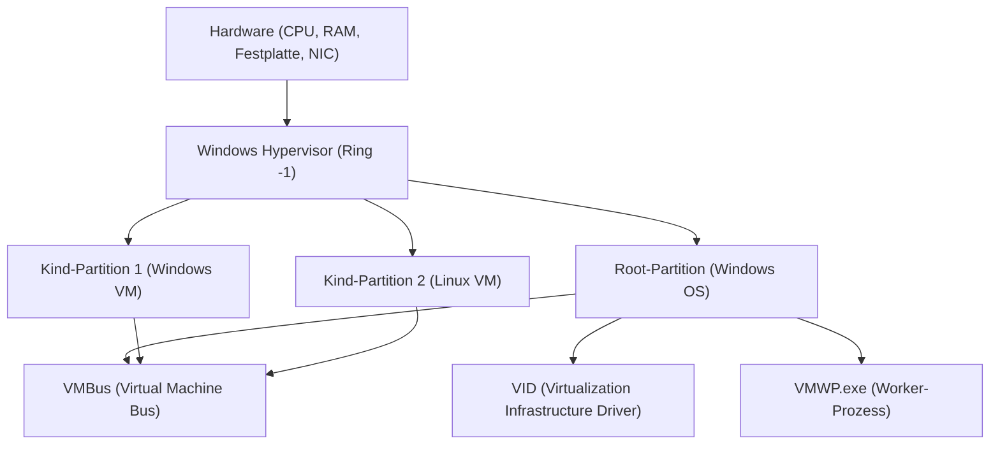

## 1. Einführung: Die Evolution der Virtualisierung unter Windows

Die Virtualisierungstechnologie auf der Windows-Plattform hat sich in den letzten Jahrzehnten dramatisch entwickelt. Früher waren Type-2-Hypervisoren von Drittanbietern (wie VMware Workstation und VirtualBox) der Mainstream, aber seit Microsoft "Hyper-V" in Windows Server 2008 eingeführt hat, sind Type-1-Hypervisoren auch in Desktop-Betriebssysteme wie Windows 10/11 integriert.

In den letzten Jahren hat "WSL2 (Windows Subsystem for Linux 2)" bei Entwicklern die meiste Aufmerksamkeit erregt. Während WSL1 auf die Übersetzung von Systemaufrufen (Translation) angewiesen war, nutzt WSL2 eine "Lightweight Utility VM", die Hyper-V-Technologie anwendet, um vollständige Linux-Kompatibilität und dramatische Leistungsverbesserungen zu erzielen.

In diesem Artikel werden wir die Architektur, Leistung (CPU, Speicher, Festplatten-I/O), Netzwerkkonfiguration und optimale Anwendungsfälle dieser beiden leistungsstarken Virtualisierungstechnologien – der voll ausgestatteten "Hyper-V" und der auf Entwicklererfahrung fokussierten "WSL2" – mit tiefgreifenden technischen Details ausführlich vergleichen und erklären.

---

## 2. Grundlegende Theorie von Hypervisoren und Architekturvergleich

Um die Virtualisierungstechnologie zu verstehen, ist die Typklassifizierung von Hypervisoren (Virtual Machine Monitors: VMM) unerlässlich.

### 2.1. Unterschiede zwischen Type-1- und Type-2-Hypervisoren

Ein Hypervisor ist eine Softwareschicht, die den Hardwarezugriff abstrahiert und es mehreren Betriebssystemen (Gastbetriebssystemen) ermöglicht, gleichzeitig auf einer einzigen physischen Maschine zu laufen.

*   **Type 1 (Bare-Metal)**: Läuft direkt auf der Hardware. Das Konzept eines Host-Betriebssystems existiert nicht (streng genommen kann es ein Management-Betriebssystem mit Privilegien geben), was einen extrem geringen Overhead aufweist und hohe Leistung sowie Sicherheit bietet. Beispiele: Hyper-V, VMware ESXi, Xen.
*   **Type 2 (Hosted)**: Läuft als Anwendung auf einem Host-Betriebssystem (wie Windows oder macOS). Alle Hardwarezugriffe laufen über das Host-Betriebssystem, was zu einem größeren Overhead führt. Beispiele: VMware Workstation, Oracle VirtualBox.

Windows Hyper-V ist ein reiner **Type-1-Hypervisor**. Wenn Hyper-V aktiviert ist, läuft das Windows-Betriebssystem, mit dem der Benutzer normalerweise interagiert, tatsächlich innerhalb einer speziellen virtuellen Maschine, die als "Root-Partition (Root Partition)" bezeichnet wird.

### 2.2. Architekturdetails von Hyper-V

Die Hyper-V-Architektur verwendet ein Microkernel-Design und basiert auf logischen Isolationseinheiten, die als Partitionen (Partitions) bezeichnet werden.



*   **Windows Hypervisor**: Läuft im am höchsten privilegierten CPU-Status (Ring -1 oder VMX Root Mode) und ist nur für die Speicherzuweisung und CPU-Planung zuständig. Er enthält keine Gerätetreiber.
*   **Root-Partition**: Die Partition, in der das Host-Windows-Betriebssystem läuft. Sie verfügt über alle Gerätetreiber und steuert die Hardware direkt. Sie bietet auch Verwaltungsfunktionen für die Kind-Partitionen (wie WMI-Provider und VMWP.exe).
*   **Kind-Partition (Child Partition)**: Die Partition, in der das Gastbetriebssystem läuft. Ein direkter Zugriff auf die Hardware ist nicht gestattet; stattdessen sendet sie über einen logischen Memory-Sharing-Bus namens "VMBus" I/O-Anfragen (Synthetic I/O) an die Root-Partition.

### 2.3. Wie WSL2 und die Lightweight Utility VM funktionieren

WSL2 nutzt die gleiche zugrundeliegende Type-1-Hypervisor-Technologie wie Hyper-V, verwendet jedoch eine Unterfunktion namens "Virtual Machine Platform (VMP)", die sich von einer voll funktionsfähigen Hyper-V-Maschine unterscheidet.

Die in WSL2 verwendete "Lightweight Utility VM" eliminiert vollständig die Legacy-Hardware-Emulation (wie virtuelles BIOS oder virtuelles Motherboard), über die herkömmliche VMs verfügen.

```mermaid
graph TD
    A["Windows Host OS (User Space)"]
    B["NTFS-Dateisystem"]
    C["9P-Protokoll-Server (Plan 9)"]
    D["Lightweight Utility VM (Linux Kernel)"]
    E["ext4.vhdx (Virtuelle Festplatte)"]
    F["Linux User Space (WSL2-Distributionen)"]

    A --> C
    C <-->| "Betriebssystemübergreifende Dateifreigabe" | D
    D --> E
    D --> F
```

Die größten Merkmale von WSL2 sind seine **Startgeschwindigkeit** und **nahtlose Integration mit dem Host-Betriebssystem**. Der Linux-Kernel bootet in weniger als ein paar Sekunden und greift über das `9P`-Netzwerkdateisystemprotokoll von Plan 9 auf das Dateisystem der Windows-Seite (NTFS) zu.

---

## 3. Gründliche Leistungsanalyse: Rechenressourcen und I/O

Die Leistung einer virtuellen Maschine drückt sich als die Summe des Overheads in CPU-, Speicher- und Festplatten-I/O-Komponenten aus.

### 3.1. CPU- und Kontextwechsel-Overhead

Sowohl Hyper-V als auch WSL2 verwenden hardwareunterstützte Virtualisierung (Intel VT-x / AMD-V). CPU-Befehle werden grundsätzlich mit nativer Geschwindigkeit ausgeführt, aber bei der Ausführung privilegierter Befehle oder der Verarbeitung von I/O tritt ein Interrupt namens "VM Exit" auf, und es erfolgt ein Kontextwechsel zum Hypervisor.

Der CPU-Overhead $T_{overhead}$ zu dieser Zeit kann durch das folgende mathematische Modell ausgedrückt werden:

$$ T_{overhead} = \sum_{i=1}^{N} (t_{vm\_exit} + t_{hypercall\_process} + t_{vm\_entry}) $$

Wobei:
*   $N$: Anzahl der VM Exits pro Zeiteinheit
*   $t_{vm\_exit}$: Übergangszeit vom Gast zum Hypervisor
*   $t_{hypercall\_process}$: Verarbeitungszeit für I/O oder Interrupts über den VMBus
*   $t_{vm\_entry}$: Rückkehrzeit vom Hypervisor zum Gast

Da WSL2 keine Legacy-Emulation aufweist, ist $t_{hypercall\_process}$ extrem gering und optimiert. Daher bleibt bei reinen CPU-Berechnungen (wie z.B. Kernel-Kompilierung oder Inferenz von Machine-Learning-Modellen) die Leistungseinbuße im Vergleich zu einer Bare-Metal-Umgebung innerhalb weniger Prozent.

### 3.2. Mechanismen der Speicherzuweisung

Es gibt einen klaren Unterschied in der Designphilosophie zwischen den beiden in Bezug auf Speicherverwaltungsmethoden.

*   **Hyper-V (Dynamic Memory)**: Die Root-Partition weist je nach Speicherbedarf der Gast-VM dynamisch Speicher zu und gibt ihn wieder frei. Allerdings wird Speicher, der als Page-Cache im Gast-Betriebssystem reserviert wurde, tendenziell nur dann freigegeben, wenn das System unter Druck steht.
*   **WSL2 (Dynamische Speicherfreigabe)**: WSL2 verfügt über einen eigenen Mechanismus zur regelmäßigen Rückgabe (Reclaim) von Speicher (einschließlich Cache), der innerhalb der Linux-VM nicht mehr benötigt wird, an den Windows-Host. In frühen Versionen von WSL2 gab es ein Problem, bei dem der Linux-Page-Cache den Windows-Speicher aufzehrte (Aufblähung des Vmmem-Prozesses), was jedoch mittlerweile durch Kernel-Patches behoben wurde.

### 3.3. Eigenschaften von Festplatten-I/O (VHDX vs ext4.vhdx)

Festplatten-I/O ist der am häufigsten auftretende Flaschenhals in der Leistung virtueller Maschinen.

Die I/O-Latenz $L_{total}$ wird wie folgt berechnet:

$$ L_{total} = L_{guest\_fs} + L_{vmbus} + L_{host\_fs} + L_{physical\_disk} $$

**Im Falle von Hyper-V**:
Typische Hyper-V-Gäste verwenden virtuelle Festplatten im `VHDX`-Format. I/O-Anfragen, die vom Dateisystem (ext4 oder NTFS) innerhalb des Gastbetriebssystems ausgegeben werden, durchlaufen den VMBus-Block-Device-Storage-Treiber (storvsc) und werden als Zugriff auf die VHDX-Datei auf dem NTFS-Dateisystem der Windows-Seite verarbeitet.

**Im Falle von WSL2**:
WSL2-Linux-Distributionen laufen auf einem nativen ext4-Dateisystem, das in einer dedizierten `ext4.vhdx`-Datei erstellt wurde. Dateioperationen innerhalb von Linux (wie im `~` Verzeichnis) bieten eine native Leistung, die der von Hyper-V oben entspricht.
Wenn Sie jedoch **von WSL2-Linux auf Dateien auf der Windows-Seite zugreifen (wie `/mnt/c/`)**, oder umgekehrt, ist der Prozess ganz anders. Dieses Cross-OS-Zugriffsverfahren nutzt das `9P (Plan 9 File System Protocol)`.

$$ L_{cross\_os} = L_{9p\_client} + L_{socket\_transfer} + L_{9p\_server} + L_{ntfs} $$

Der Zugriff über dieses 9P-Protokoll weist einen hohen Overhead für Serialisierungsverarbeitung auf, und bei Anwendungen, die eine große Anzahl kleiner Dateien lesen und schreiben (z.B. `npm install` oder Git-Operationen in einem Node.js-Projekt in einem Windows-Verzeichnis), verschlechtert sich die Leistung erheblich (manchmal mehr als die 10-fache Verzögerung).
Aus diesem Grund ist es **eine eiserne Regel bei der Verwendung von WSL2, Projektdateien immer im nativen Linux-Dateisystem (unter `~/`) abzulegen**.

---

## 4. Netzwerkstruktur: NAT, Default Switch, Bridged

Die Flexibilität der Netzwerkfunktionen ist einer der Hauptunterschiede zwischen Hyper-V und WSL2.

### 4.1. Netzwerk von WSL2 (NAT-basiert)

Standardmäßig nutzt das WSL2-Netzwerk eine "NAT (Network Address Translation)"-Konfiguration unter Verwendung der Virtual Switch-Technologie von Hyper-V.
Der Linux-VM wird automatisch eine private IP-Adresse zugewiesen (z.B. `172.20.x.x`), die sich vom Windows-Host unterscheidet. Ein Mechanismus ist integriert, der Dienste (Ports), die innerhalb von WSL2 gestartet wurden, vom Windows-Host als `localhost` weiterleitet, sodass Entwickler Webserver usw. testen können, ohne sich der Netzwerkkonfiguration bewusst sein zu müssen.

In den letzten Jahren wurde in einer Vorschauversion ein neuer Netzwerkmodus namens "Mirrored Mode" für WSL2 eingeführt. Dies verbessert die IPv6-Unterstützung und die VPN-Verbindungskompatibilität (kann in `.wslconfig` konfiguriert werden).

### 4.2. Hyper-V Virtual Switch

Hyper-V ermöglicht die Erstellung von fortgeschrittenen Netzwerken auf Enterprise-Niveau. Über den "Virtual Switch Manager" bietet es hauptsächlich drei Modi:

1.  **Extern (External)**: Bindet die physische NIC der Hostmaschine an den Virtual Switch, sodass die Gast-VM direkt an das physische Netzwerk angeschlossen wird (Bridged Connection). Die VM bezieht eine IP aus dem gleichen Subnetz wie das physische Netzwerk vom DHCP-Server.
2.  **Intern (Internal)**: Erlaubt nur die Kommunikation zwischen dem Host OS und der VM sowie zwischen VMs. Sie können nicht direkt nach außen kommunizieren.
3.  **Privat (Private)**: Erlaubt nur die Kommunikation zwischen VMs und blockiert auch die Kommunikation mit dem Host OS. Wird verwendet, um isolierte Testumgebungen zu erstellen.

### 4.3. Fortgeschrittene Hyper-V Netzwerkkonfiguration mit PowerShell

In Entwicklungs- oder Testumgebungen ermöglicht PowerShell eine detaillierte Kontrolle, wenn Sie ein benutzerdefiniertes NAT-Netzwerk für VMs erstellen möchten. Nachfolgend ein Skriptbeispiel, um einen internen Virtual Switch zu erstellen, NAT zu konfigurieren und VMs Internetzugang zu ermöglichen.

```powershell
# 1. Erstellung eines internen Virtual Switch
$SwitchName = "HyperV-NatSwitch"
New-VMSwitch -SwitchName $SwitchName -SwitchType Internal

# 2. IP-Adresse für die virtuelle Host-NIC festlegen (Gateway-IP)
$GatewayIP = "192.168.100.1"
$NetPrefix = 24
$InterfaceAlias = "vEthernet ($SwitchName)"
New-NetIPAddress -IPAddress $GatewayIP -PrefixLength $NetPrefix -InterfaceAlias $InterfaceAlias

# 3. Konfiguration des NAT-Netzwerks
$NatName = "HyperV-NatNetwork"
$NatSubnet = "192.168.100.0/24"
New-NetNat -Name $NatName -InternalIPInterfaceAddressPrefix $NatSubnet

# Befehl zur Überprüfung
Get-NetNat
```

Mit dieser Konfiguration können Sie ein eigenes NAT-Segment aufbauen, das über den Host mit der Außenwelt kommunizieren kann, indem Sie der angegebenen Hyper-V-Gastmaschine manuell eine `192.168.100.x` IP und das Gateway `192.168.100.1` zuweisen.

---

## 5. Anwendungsfälle und praktischer Leitfaden zur Auswahl

Basierend auf den bisherigen Architektur- und Leistungsunterschieden definieren wir, in welchen Situationen welche Technologie angewendet werden sollte.

### 5.1. Szenarien, in denen WSL2 gewählt werden sollte

WSL2 ist speziell zur "Steigerung der Produktivität von Entwicklern" konzipiert. Es ist ideal für folgende Zwecke:

*   **Webentwicklung und Cloud-native Entwicklung**: Containerentwicklung mit Docker Desktop (WSL2-Backend) oder Podman.
*   **Verwendung von dedizierten Linux-Tools**: Bei der täglichen Verwendung von bash, grep, awk, sed oder GCC/Clang-Compilern für Linux.
*   **GUI-Anwendungen (WSLg)**: Wenn Sie Linux-X11/Wayland-Anwendungen nahtlos auf dem Windows-Desktop ausführen möchten.
*   **Machine Learning und KI-Entwicklung**: Schnelles Training mit TensorFlow oder PyTorch unter Verwendung von GPU-Passthrough-Funktionen (NVIDIA CUDA on WSL).

**Hinweis**: Einschränkungen können auftreten, wenn Sie den Kernel stark anpassen möchten oder komplexe Dienste aufbauen, die stark von systemd abhängen (obwohl systemd derzeit unterstützt wird, ist es standardmäßig deaktiviert oder eingeschränkt).

### 5.2. Szenarien, in denen Hyper-V gewählt werden sollte

Hyper-V ist auf "Infrastrukturvirtualisierung und vollständige Isolation" ausgerichtet. Es ist unverzichtbar für folgende Zwecke:

*   **Ausführung von Windows VMs**: Zum Ausführen verschiedener Windows-Versionen (z.B. Windows Server oder ein älteres Windows 10) als Testumgebungen.
*   **Nested Virtualization (verschachtelte Virtualisierung)**: Wenn Sie eine virtuelle Maschine (Hyper-V oder KVM) innerhalb einer anderen virtuellen Maschine ausführen möchten. Unerlässlich für die Testumgebungen von Infrastruktur-Ingenieuren.
*   **Fortgeschrittene Netzwerkanforderungen**: Wenn Sie die Netzwerkkonfiguration strikt kontrollieren müssen, wie z.B. bei externen Bridged-Verbindungen (Teilnahme am selben LAN), VLAN-Tagging, Zuweisung mehrerer NICs, usw.
*   **Snapshots (Checkpoints)**: Eine Funktion, mit der Sie den Zustand einer VM zu einem bestimmten Zeitpunkt speichern und jederzeit sofort zurücksetzen können. Äußerst nützlich für destruktive Softwaretests oder Malware-Analysen.
*   **Feste Ressourcenzuweisung**: Wenn Sie die Anzahl der CPU-Kerne und die Speichermenge strikt fixieren möchten, um die Auswirkungen auf das Host OS zu minimieren.

---

## 6. Überlegungen zum I/O-Durchsatz anhand mathematischer Modelle (Anhang)

Als Systemingenieur ist es wichtig, die Beziehung zwischen Durchsatz $S$ und Blockgröße $B$ theoretisch zu verstehen, wenn man die Grenzen der I/O-Leistung beider Technologien bewertet.

Der Datentransfer-Durchsatz $S$ ist die pro Zeiteinheit übertragene Datenmenge und wird wie folgt modelliert:

$$ S(B) = \frac{B}{L_{setup} + \frac{B}{R_{max}}} $$

*   $B$: Blockgröße (Bytes)
*   $L_{setup}$: Feste Latenz im Zusammenhang mit der Einrichtung von I/O-Anfragen und dem Kontextwechsel
*   $R_{max}$: Maximale Hardware-Bandbreite bei Kopien oder Geräteübertragungen

Beim Dateizugriff über das 9P-Protokoll von WSL2 wird dieser $L_{setup}$ sehr groß (aufgrund von Socket-Kommunikation und der Serialisierung/Deserialisierung von Protokollen). Wenn die Blockgröße $B$ gering ist (Lesen und Schreiben vieler kleiner Dateien von wenigen KB), wird daher der Einfluss von $L_{setup}$ im Nenner dominant, und der Durchsatz $S$ sinkt drastisch.
Im Gegensatz dazu wird beim VHDX-Zugriff über den VMBus von Hyper-V der $L_{setup}$ auf ein Niveau nahe einem Hardware-Interrupt optimiert, sodass hohe IOPS auch bei kleinen Blöcken aufrechterhalten werden können.

Diese mathematische Realität ist die logische Grundlage für die Best Practice: "Projektdateien sollten unter WSL2 nicht auf der Windows-Seite abgelegt werden".

---

## 7. Zusammenfassung: Zwei koexistierende Virtualisierungstechnologien

Hyper-V und WSL2 sind nicht so, dass das eine besser ist als das andere, sondern **"zwei Lösungen mit unterschiedlichen Zielen"**.

*   **WSL2** ist das "beste Integrationstool", um die Hülle des Windows-Betriebssystems zu durchbrechen und das Linux-Ökosystem Windows-Benutzern nahtlos und mit hoher Geschwindigkeit zur Verfügung zu stellen. Es ist keine Übertreibung zu sagen, dass dies die ultimative CLI-Umgebung für Entwickler ist.
*   **Hyper-V** ist ein "vollwertiger Hypervisor", der die robuste Isolation und Verwaltungsfunktionen, die in Enterprise-Rechenzentren entwickelt wurden, auf den Desktop bringt. Beim Aufbau von Netzwerken, Testen von Windows-Betriebssystemen und Simulieren von Infrastrukturumgebungen ist er unübertroffen.

In der modernen Windows-Umgebung konkurrieren diese beiden Technologien nicht, sondern koexistieren harmonisch auf derselben VM-Plattform. Durch den richtigen Einsatz beider Technologien je nach Verwendungszweck wird Windows zur leistungsstärksten und flexibelsten Engineering-Workstation der Welt.
