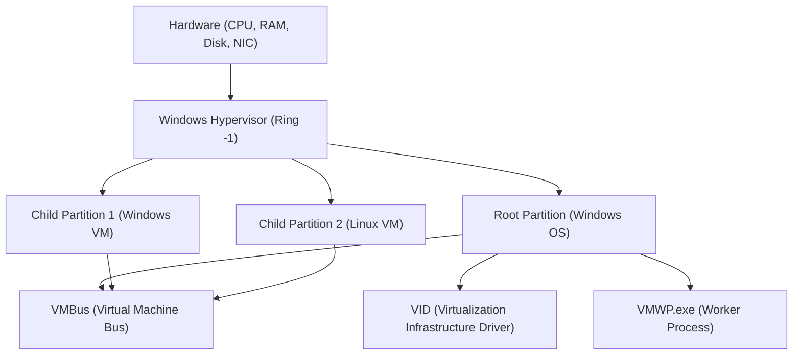

## 1. Introduction: The Evolution of Virtualization on Windows

Virtualization technology on the Windows platform has evolved dramatically over the past few decades. In the past, third-party Type 2 hypervisors (such as VMware Workstation and VirtualBox) were the mainstream. However, since Microsoft introduced "Hyper-V" in Windows Server 2008, Type 1 hypervisors have also been integrated into desktop OSs like Windows 10/11.

In recent years, the technology that has garnered the most attention among developers is "WSL2 (Windows Subsystem for Linux 2)". While WSL1 relied on system call translation, WSL2 employs a "Lightweight Utility VM" based on Hyper-V technology, achieving full Linux compatibility and a dramatic leap in performance.

In this article, we will thoroughly compare and explain the architecture, performance (CPU, memory, disk I/O), network configuration, and optimal use cases of these two powerful virtualization technologies—the full-featured "Hyper-V" and the developer-experience-focused "WSL2"—along with deep technical details.

---

## 2. Basic Theory of Hypervisors and Architecture Comparison

To understand virtualization technologies, classifying hypervisor (Virtual Machine Monitor: VMM) types is essential.

### 2.1. Differences between Type 1 and Type 2 Hypervisors

A hypervisor is a software layer that abstracts hardware access, allowing multiple OSs (guest OSs) to run simultaneously on a single physical machine.

*   **Type 1 (Bare-metal)**: Runs directly on the hardware. There is no concept of a host OS (strictly speaking, a privileged management OS may exist), offering extremely low overhead, high performance, and high security. Examples: Hyper-V, VMware ESXi, Xen.
*   **Type 2 (Hosted)**: Runs as an application on a host OS (such as Windows or macOS). Since all hardware access goes through the host OS, the overhead is larger. Examples: VMware Workstation, Oracle VirtualBox.

Windows Hyper-V is a pure **Type 1 hypervisor**. When Hyper-V is enabled, the Windows OS that the user normally operates actually starts running inside a special virtual machine called the "Root Partition".

### 2.2. Hyper-V Architecture Details

The Hyper-V architecture adopts a microkernel design and is based on logical isolation units called Partitions.



*   **Windows Hypervisor**: Runs at the most privileged level of the CPU (Ring -1 or VMX Root Mode) and is responsible only for memory allocation and CPU scheduling. It does not contain device drivers.
*   **Root Partition**: The partition where the host Windows OS runs. It possesses all device drivers and controls the hardware directly. It also provides management functions for child partitions (such as WMI providers and VMWP.exe).
*   **Child Partition**: The partition where a guest OS runs. Direct access to hardware is not permitted, and it sends I/O requests (Synthetic I/O) to the root partition via a logical memory sharing bus called "VMBus".

### 2.3. Mechanism of WSL2 and Lightweight Utility VM

Although WSL2 utilizes the same underlying Type 1 hypervisor technology as Hyper-V, it uses a subset of features called the "Virtual Machine Platform (VMP)" which differs from full-featured Hyper-V virtual machines.

The "Lightweight Utility VM" adopted in WSL2 completely eliminates the emulation of legacy hardware (such as virtual BIOS or virtual motherboards) present in traditional VMs.

```mermaid
graph TD
    A["Windows Host OS (User Space)"]
    B["NTFS File System"]
    C["9P Protocol Server (Plan 9)"]
    D["Lightweight Utility VM (Linux Kernel)"]
    E["ext4.vhdx (Virtual Disk)"]
    F["Linux User Space (WSL2 Distributions)"]

    A --> C
    C <-->| "Cross-OS File Sharing" | D
    D --> E
    D --> F
```

The greatest features of WSL2 are its **fast startup** and **seamless integration with the host OS**. The Linux kernel boots in less than a second, and it accesses the Windows file system (NTFS) via Plan 9's `9P` network file system protocol.

---

## 3. Thorough Performance Analysis: Computational Resources and I/O

Virtual machine performance is expressed as the sum of overheads across CPU, memory, and disk I/O components.

### 3.1. CPU and Context Switch Overhead

Both Hyper-V and WSL2 use hardware-assisted virtualization (Intel VT-x / AMD-V). CPU instructions are basically executed at native speed, but when privileged instructions are executed or I/O operations occur, an interrupt called "VM Exit" is triggered, resulting in a context switch to the hypervisor.

The CPU overhead $T_{overhead}$ at this time can be expressed by the following mathematical model:

$$ T_{overhead} = \sum_{i=1}^{N} (t_{vm\_exit} + t_{hypercall\_process} + t_{vm\_entry}) $$

Where:
*   $N$: Number of VM Exits occurring per unit time
*   $t_{vm\_exit}$: Transition time from the guest to the hypervisor
*   $t_{hypercall\_process}$: Processing time for I/O operations or interrupts via VMBus
*   $t_{vm\_entry}$: Return time from the hypervisor to the guest

Because WSL2 lacks legacy emulation, $t_{hypercall\_process}$ is heavily optimized and extremely small. Therefore, for pure CPU operations (such as kernel compilation or machine learning model inference), the performance degradation remains within a few percent compared to a bare-metal environment.

### 3.2. Memory Allocation Mechanisms

There are distinct differences in design philosophy between the two regarding memory management approaches.

*   **Hyper-V (Dynamic Memory)**: The root partition dynamically allocates and reclaims memory according to the memory demands of the guest VM. However, memory secured as page cache within the guest OS tends not to be released unless the system is under pressure.
*   **WSL2 (Dynamic Memory Reclaim)**: WSL2 has its own mechanism to periodically return (reclaim) memory—including caches—that is no longer needed inside the Linux VM back to the Windows host. While early WSL2 versions had an issue where Linux page caches exhausted Windows memory (bloat of the Vmmem process), this has now been improved by kernel patches.

### 3.3. Disk I/O Characteristics (VHDX vs ext4.vhdx)

Disk I/O is the component most likely to become a bottleneck in virtual machine performance.

The I/O latency $L_{total}$ is calculated as follows:

$$ L_{total} = L_{guest\_fs} + L_{vmbus} + L_{host\_fs} + L_{physical\_disk} $$

**In the case of Hyper-V**:
A typical Hyper-V guest uses a virtual disk in the `VHDX` format. I/O requests issued from the file system (ext4 or NTFS) within the guest OS pass through the VMBus block device storage driver (storvsc) and are processed as accesses to the VHDX file on NTFS on the Windows side.

**In the case of WSL2**:
WSL2's Linux distributions run on a native ext4 file system built within a dedicated `ext4.vhdx` file. File operations inside Linux (e.g., within the `~` directory) demonstrate native performance equivalent to the aforementioned Hyper-V.
However, **when accessing files on the Windows side (such as `/mnt/c/`) from WSL2's Linux**, or vice versa, the processing differs significantly. The `9P (Plan 9 File System Protocol)` is used for this cross-OS access.

$$ L_{cross\_os} = L_{9p\_client} + L_{socket\_transfer} + L_{9p\_server} + L_{ntfs} $$

Access via this 9P protocol involves significant serialization processing overhead. In scenarios involving massive read/write operations of small files (e.g., `npm install` or Git operations in a Node.js project located in a Windows directory), performance drops significantly (sometimes with more than 10 times the delay).
Therefore, **when using WSL2, the golden rule is to always place project files on the Linux native file system (under `~/`)**.

---

## 4. Network Structure: NAT, Default Switch, Bridged

Network flexibility is one of the major differences between Hyper-V and WSL2.

### 4.1. WSL2 Network (NAT-based)

By default, the WSL2 network is configured with "NAT (Network Address Translation)" using Hyper-V's virtual switch technology.
The Linux VM is automatically assigned a private IP address (e.g., `172.20.x.x`) different from the Windows host. A mechanism is built-in where access to `localhost` from the Windows host is forwarded to services (ports) running inside WSL2, allowing developers to test web servers without having to be mindful of the network.

Recently, a new network mode called "Mirrored mode" was introduced in preview versions of WSL2. This aims to improve IPv6 support and VPN connection compatibility (configurable via `.wslconfig`).

### 4.2. Hyper-V Virtual Switch

Hyper-V enables advanced, enterprise-level network construction. Through the "Virtual Switch Manager", it mainly provides three modes:

1.  **External**: Binds the host machine's physical NIC to the virtual switch, allowing the guest VM to directly join the physical network (bridge connection). The VM obtains an IP from the same subnet as the physical network via a DHCP server.
2.  **Internal**: Only allows communication between the host OS and VMs, as well as between VMs. Direct access to external networks is not possible.
3.  **Private**: Only allows communication between VMs, cutting off communication with the host OS. Used for building isolated testing environments.

### 4.3. Advanced Hyper-V Network Construction using PowerShell

In development or testing environments, when you want to build a customized NAT network for VMs, PowerShell allows for detailed control. Below is an example script to create an internal virtual switch, configure NAT on it, and provide internet access to a VM.

```powershell
# 1. Create Internal Virtual Switch
$SwitchName = "HyperV-NatSwitch"
New-VMSwitch -SwitchName $SwitchName -SwitchType Internal

# 2. Set IP address to the virtual NIC on the host side (IP that acts as a gateway)
$GatewayIP = "192.168.100.1"
$NetPrefix = 24
$InterfaceAlias = "vEthernet ($SwitchName)"
New-NetIPAddress -IPAddress $GatewayIP -PrefixLength $NetPrefix -InterfaceAlias $InterfaceAlias

# 3. Configure NAT Network
$NatName = "HyperV-NatNetwork"
$NatSubnet = "192.168.100.0/24"
New-NetNat -Name $NatName -InternalIPInterfaceAddressPrefix $NatSubnet

# Verification command
Get-NetNat
```

With this configuration, by manually setting an IP of `192.168.100.x` and a gateway of `192.168.100.1` on a designated Hyper-V guest, you can build a custom NAT segment that can communicate externally via the host.

---

## 5. Use Cases and Practical Selection Guide

Based on the differences in architecture and performance discussed so far, we define under what circumstances which technology should be adopted.

### 5.1. Scenarios for Choosing WSL2

WSL2 is specifically designed to "improve developer productivity." It is optimal for the following uses:

*   **Web Development and Cloud-Native Development**: Container development using Docker Desktop (WSL2 backend) or Podman.
*   **Using Linux-specific Tools**: When routinely using bash, grep, awk, sed, or GCC/Clang compilers meant for Linux.
*   **GUI Applications (WSLg)**: When you want to run Linux X11/Wayland applications seamlessly on the Windows desktop.
*   **Machine Learning and AI Development**: High-speed training with TensorFlow or PyTorch using GPU passthrough capabilities (NVIDIA CUDA on WSL).

**Note**: You may face restrictions if you wish to deeply customize the kernel, or build complex services heavily dependent on systemd (systemd is currently supported, but is disabled or restricted by default).

### 5.2. Scenarios for Choosing Hyper-V

Hyper-V is intended for "infrastructure virtualization and complete isolation." It is essential for the following uses:

*   **Running Windows VMs**: When running different versions of Windows (such as Windows Server or older Windows 10) as test environments.
*   **Nested Virtualization**: When you want to run a virtual machine (Hyper-V or KVM) inside another virtual machine. Indispensable for infrastructure engineers' validation environments.
*   **Advanced Network Requirements**: When network configurations must be strictly controlled, such as external bridge connections (joining the same LAN), VLAN tagging, or allocating multiple NICs.
*   **Snapshots (Checkpoints)**: The ability to save a VM's state at a specific point in time and instantly roll back to it whenever needed. Extremely useful for destructive software testing or malware analysis.
*   **Fixed Resource Allocation**: When you want to strictly fix the number of CPU cores and memory amount to minimize the impact on the host OS.

---

## 6. Consideration of I/O Throughput through Mathematical Models (Appendix)

As a system engineer, when determining the I/O performance limits of both, it is crucial to theoretically understand the relationship between throughput $S$ and block size $B$.

Data transfer throughput $S$ is the amount of data transferred per unit time, and is modeled as follows:

$$ S(B) = \frac{B}{L_{setup} + \frac{B}{R_{max}}} $$

*   $B$: Block size (Bytes)
*   $L_{setup}$: Fixed latency associated with I/O request setup and context switching
*   $R_{max}$: Hardware's maximum bandwidth for copying and device transfers

In file accesses via WSL2's 9P protocol, this $L_{setup}$ becomes extremely large (due to socket communication and protocol serialization/deserialization). Therefore, when the block size $B$ is small (massive read/write of fine files around a few KBs), the effect of $L_{setup}$ in the denominator becomes dominant, and the throughput $S$ degrades dramatically.
Conversely, in VHDX access via Hyper-V's VMBus, $L_{setup}$ is optimized to a level close to hardware interrupts, allowing it to maintain high IOPS even with small blocks.

This mathematical reality serves as the logical foundation for the best practice that "you must not place project files on the Windows side in WSL2".

---

## 7. Conclusion: Two Coexisting Virtualization Technologies

Hyper-V and WSL2 are not a matter of one being superior to the other; they are **"two solutions with different purposes"**.

*   **WSL2** is the "best integration tool" that breaks the shell of the Windows OS to seamlessly and swiftly deliver the Linux ecosystem to Windows users. It is no exaggeration to call it the ultimate CLI environment for developers.
*   **Hyper-V** is a "full-fledged hypervisor" that brings the robust isolation and management capabilities cultivated in enterprise data centers to the desktop. It is second to none in network construction, Windows OS testing, and infrastructure environment simulation.

In modern Windows environments, these two technologies do not compete on equal terms; they beautifully coexist on the same VM platform. By using the right tool for the right job depending on the purpose, Windows can truly become the most powerful and flexible engineering workstation in the world.
