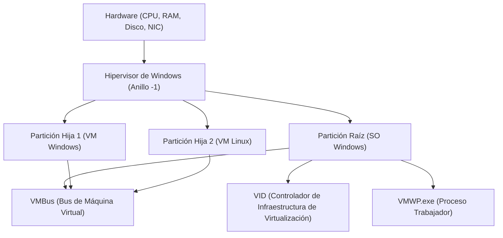

## 1. Introducción: La evolución de la virtualización en Windows

La tecnología de virtualización en la plataforma Windows ha experimentado una evolución dramática en las últimas décadas. En el pasado, los hipervisores de Tipo 2 de terceros (como VMware Workstation y VirtualBox) eran la norma, pero desde que Microsoft introdujo "Hyper-V" en Windows Server 2008, el hipervisor de Tipo 1 también se ha integrado en el sistema operativo de escritorio Windows 10/11.

En los últimos años, lo que más ha llamado la atención de los desarrolladores es "WSL2 (Windows Subsystem for Linux 2)". Mientras que WSL1 dependía de la traducción de llamadas al sistema (translation), WSL2 adopta una "Máquina Virtual de Utilidad Ligera (Lightweight Utility VM)" que aplica la tecnología de Hyper-V, logrando una compatibilidad total con Linux y una mejora espectacular en el rendimiento.

En este artículo, compararemos y explicaremos exhaustivamente estas dos potentes tecnologías de virtualización: el "Hyper-V" con todas sus funciones y el "WSL2" centrado en la experiencia del desarrollador, analizando su arquitectura, rendimiento (CPU, memoria, E/S de disco), configuración de red y los mejores casos de uso, junto con detalles técnicos profundos.

---

## 2. Teoría básica del hipervisor y comparación de arquitectura

Para comprender la tecnología de virtualización, es esencial clasificar los tipos de hipervisores (Monitores de Máquinas Virtuales: VMM).

### 2.1. Diferencias entre los hipervisores de Tipo 1 y Tipo 2

Un hipervisor es una capa de software que abstrae el acceso al hardware y permite que múltiples sistemas operativos (SO invitados) se ejecuten simultáneamente en una sola máquina física.

*   **Tipo 1 (Bare-metal)**: Se ejecuta directamente sobre el hardware. No existe el concepto de SO host (estrictamente hablando, puede existir un SO de gestión con privilegios), tiene una sobrecarga extremadamente baja y ofrece alto rendimiento y seguridad. Ejemplos: Hyper-V, VMware ESXi, Xen.
*   **Tipo 2 (Hosted)**: Se ejecuta como una aplicación sobre un SO host (como Windows o macOS). Dado que todo el acceso al hardware pasa por el SO host, la sobrecarga es mayor. Ejemplos: VMware Workstation, Oracle VirtualBox.

El Hyper-V de Windows es un **hipervisor de Tipo 1** puro. Cuando se habilita Hyper-V, de hecho, el propio sistema operativo Windows que el usuario normalmente opera también comienza a ejecutarse dentro de una máquina virtual especial llamada "Partición Raíz (Root Partition)".

### 2.2. Detalles de la arquitectura de Hyper-V

La arquitectura de Hyper-V adopta un diseño de microkernel y se basa en unidades lógicas de separación llamadas particiones (Partition).



*   **Windows Hypervisor**: Se ejecuta en el estado con mayor nivel de privilegios de la CPU (Ring -1 o VMX Root Mode) y se encarga únicamente de la asignación de memoria y la programación de la CPU. No incluye controladores de dispositivos.
*   **Root Partition**: Es la partición donde se ejecuta el SO Windows host. Posee todos los controladores de dispositivos y controla el hardware directamente. También proporciona funciones de gestión para las particiones hijas (como proveedores WMI y VMWP.exe).
*   **Child Partition**: Es la partición donde se ejecuta el SO invitado. No se permite el acceso directo al hardware, y las solicitudes de E/S se envían a la partición raíz (Synthetic I/O) a través de un bus de memoria compartida lógico llamado "VMBus".

### 2.3. WSL2 y el mecanismo de la Lightweight Utility VM

WSL2 utiliza la misma tecnología base de hipervisor de Tipo 1 que Hyper-V, pero emplea un subconjunto de características llamado "Plataforma de Máquina Virtual (Virtual Machine Platform: VMP)", que difiere de una máquina virtual Hyper-V con todas las funciones.

La "Máquina Virtual de Utilidad Ligera (Lightweight Utility VM)" adoptada en WSL2 elimina por completo la emulación de hardware heredado (como BIOS virtual o placa base virtual) que tienen las VM tradicionales.

```mermaid
graph TD
    A["SO Host Windows (Espacio de Usuario)"]
    B["Sistema de Archivos NTFS"]
    C["Servidor del Protocolo 9P (Plan 9)"]
    D["VM de Utilidad Ligera (Kernel de Linux)"]
    E["ext4.vhdx (Disco Virtual)"]
    F["Espacio de Usuario Linux (Distribuciones WSL2)"]

    A --> C
    C <-->| "Intercambio de Archivos Multi-SO" | D
    D --> E
    D --> F
```

La mayor característica de WSL2 es su **velocidad de inicio** y su **integración perfecta con el SO host**. El kernel de Linux se inicia en menos de unos pocos segundos, y accede al sistema de archivos del lado de Windows (NTFS) a través del protocolo del sistema de archivos de red `9P` de Plan 9.

---

## 3. Análisis exhaustivo del rendimiento: Recursos computacionales y E/S

El rendimiento de una máquina virtual se expresa como la suma de la sobrecarga en cada componente: CPU, memoria y E/S de disco.

### 3.1. CPU y sobrecarga de cambio de contexto

Tanto Hyper-V como WSL2 utilizan virtualización asistida por hardware (Intel VT-x / AMD-V). Las instrucciones de la CPU se ejecutan básicamente a velocidad nativa, pero al ejecutar instrucciones privilegiadas o procesar E/S, se produce una interrupción llamada "VM Exit" y se realiza un cambio de contexto hacia el hipervisor.

La sobrecarga de la CPU en este momento, $T_{overhead}$, se puede expresar mediante el siguiente modelo matemático.

$$ T_{overhead} = \sum_{i=1}^{N} (t_{vm\_exit} + t_{hypercall\_process} + t_{vm\_entry}) $$

Donde:
*   $N$: Número de ocurrencias de VM Exit por unidad de tiempo
*   $t_{vm\_exit}$: Tiempo de transición del invitado al hipervisor
*   $t_{hypercall\_process}$: Tiempo de procesamiento de E/S o interrupciones a través de VMBus
*   $t_{vm\_entry}$: Tiempo de retorno del hipervisor al invitado

En WSL2, debido a la ausencia de emulación heredada, $t_{hypercall\_process}$ está extremadamente optimizado para ser pequeño. Por lo tanto, en cálculos puros de CPU (como la compilación del kernel o la inferencia de modelos de aprendizaje automático), la degradación del rendimiento se mantiene dentro de un pequeño porcentaje en comparación con un entorno bare-metal.

### 3.2. Mecanismo de asignación de memoria

Existen diferencias claras en la filosofía de diseño en cuanto a los métodos de gestión de memoria entre ambos.

*   **Hyper-V (Memoria Dinámica)**: La partición raíz asigna y recupera memoria dinámicamente según la demanda de memoria de la VM invitada. Sin embargo, la memoria reservada como caché de páginas dentro del SO invitado tiende a no ser liberada a menos que el sistema esté bajo presión.
*   **WSL2 (Recuperación de memoria dinámica)**: WSL2 tiene su propio mecanismo que devuelve (Reclaim) periódicamente al host de Windows la memoria (incluida la caché) que ya no es necesaria dentro de la VM de Linux. En las primeras versiones de WSL2 existía el problema de que la caché de páginas de Linux consumía la memoria de Windows (inflado del proceso Vmmem), pero esto se ha mejorado actualmente mediante parches del kernel.

### 3.3. Características de E/S del disco (VHDX vs ext4.vhdx)

El cuello de botella más probable en el rendimiento de las máquinas virtuales es la E/S de disco.

La latencia de E/S $L_{total}$ se calcula de la siguiente manera:

$$ L_{total} = L_{guest\_fs} + L_{vmbus} + L_{host\_fs} + L_{physical\_disk} $$

**En el caso de Hyper-V**:
Un invitado de Hyper-V típico utiliza un disco virtual en formato `VHDX`. Las solicitudes de E/S emitidas por el sistema de archivos (ext4 o NTFS) dentro del SO invitado pasan por el controlador de almacenamiento de dispositivos de bloque de VMBus (storvsc) y se procesan como un acceso al archivo VHDX sobre el NTFS del lado de Windows.

**En el caso de WSL2**:
Las distribuciones de Linux en WSL2 se ejecutan en un sistema de archivos ext4 nativo construido dentro de un archivo `ext4.vhdx` dedicado. Las operaciones de archivos dentro de Linux (como en el directorio `~`) ofrecen un rendimiento nativo equivalente al Hyper-V mencionado anteriormente.
Sin embargo, **al acceder a archivos del lado de Windows (como `/mnt/c/`) desde el Linux de WSL2**, o viceversa, el proceso es muy diferente. Para este acceso entre sistemas operativos se utiliza `9P (Plan 9 File System Protocol)`.

$$ L_{cross\_os} = L_{9p\_client} + L_{socket\_transfer} + L_{9p\_server} + L_{ntfs} $$

El acceso a través de este protocolo 9P tiene una gran sobrecarga de procesamiento de serialización, y el rendimiento disminuye drásticamente (a veces, con un retraso 10 veces mayor o más) para tareas de lectura y escritura masivas de pequeños archivos (ej: `npm install` o operaciones de Git en un proyecto Node.js ubicado en un directorio de Windows).
Por lo tanto, **al usar WSL2, es una regla estricta ubicar siempre los archivos del proyecto en el sistema de archivos nativo de Linux (bajo `~/`)**.

---

## 4. Estructura de red: NAT, Default Switch, Bridged

La flexibilidad de las funciones de red es una de las grandes diferencias entre Hyper-V y WSL2.

### 4.1. Red de WSL2 (Basado en NAT)

La red de WSL2 está configurada de manera predeterminada como "NAT (Traducción de Direcciones de Red)" utilizando la tecnología de conmutador virtual de Hyper-V.
A la VM de Linux se le asigna automáticamente una dirección IP privada diferente a la del host de Windows (ej: `172.20.x.x`). El host de Windows tiene incorporado un mecanismo que reenvía `localhost` a los servicios (puertos) iniciados dentro de WSL2, lo que permite a los desarrolladores probar servidores web, etc., sin ser conscientes de la red.

Recientemente, se ha introducido en las versiones preliminares de WSL2 un nuevo modo de red llamado modo "Mirrored". Esto tiene como objetivo soportar IPv6 y mejorar la compatibilidad con conexiones VPN (configurable en `.wslconfig`).

### 4.2. Conmutador Virtual de Hyper-V (Virtual Switch)

Hyper-V permite la construcción de redes avanzadas a nivel empresarial. A través del "Administrador de conmutadores virtuales", ofrece principalmente tres modos:

1.  **Externo (External)**: Vincula la NIC física de la máquina host al conmutador virtual, haciendo que las VM invitadas participen directamente en la red física (conexión puente). La VM obtiene una IP de la misma subred que la red física desde el servidor DHCP.
2.  **Interno (Internal)**: Solo permite la comunicación entre el SO host y las VM, y entre las propias VM. No pueden acceder directamente a redes externas.
3.  **Privado (Private)**: Solo permite la comunicación entre las VM y bloquea la comunicación con el SO host. Se utiliza para construir entornos de prueba aislados.

### 4.3. Construcción avanzada de redes Hyper-V con PowerShell

En entornos de desarrollo o pruebas, cuando se desea construir una red NAT personalizada para las VM, el uso de PowerShell permite un control detallado. A continuación se muestra un ejemplo de un script que crea un conmutador virtual interno, configura NAT en él y proporciona acceso a Internet a la VM.

```powershell
# 1. Creación del conmutador virtual interno
$SwitchName = "HyperV-NatSwitch"
New-VMSwitch -SwitchName $SwitchName -SwitchType Internal

# 2. Configuración de la dirección IP en la NIC virtual del lado del host (IP que servirá de puerta de enlace)
$GatewayIP = "192.168.100.1"
$NetPrefix = 24
$InterfaceAlias = "vEthernet ($SwitchName)"
New-NetIPAddress -IPAddress $GatewayIP -PrefixLength $NetPrefix -InterfaceAlias $InterfaceAlias

# 3. Configuración de la red NAT
$NatName = "HyperV-NatNetwork"
$NatSubnet = "192.168.100.0/24"
New-NetNat -Name $NatName -InternalIPInterfaceAddressPrefix $NatSubnet

# Comando de verificación
Get-NetNat
```

Con esta configuración, al asignar manualmente una IP `192.168.100.x` y la puerta de enlace `192.168.100.1` al invitado de Hyper-V especificado, se puede construir un segmento NAT propio capaz de comunicarse con el exterior a través del host.

---

## 5. Casos de uso y guía de selección práctica

Con base en las diferencias de arquitectura y rendimiento discutidas hasta ahora, definimos en qué situaciones se debe adoptar cada tecnología.

### 5.1. Escenarios donde se debe elegir WSL2

WSL2 está diseñado específicamente para "mejorar la productividad de los desarrolladores". Es ideal para los siguientes usos:

*   **Desarrollo web y desarrollo cloud-native**: Desarrollo de contenedores utilizando Docker Desktop (backend WSL2) o Podman.
*   **Uso de herramientas exclusivas de Linux**: Cuando se utilizan a diario bash, grep, awk, sed, o compiladores GCC o Clang para Linux.
*   **Aplicaciones GUI (WSLg)**: Cuando se desea ejecutar aplicaciones X11/Wayland de Linux de forma transparente en el escritorio de Windows.
*   **Aprendizaje automático y desarrollo de IA**: Entrenamiento rápido de TensorFlow o PyTorch utilizando la función de paso de GPU (NVIDIA CUDA on WSL).

**Nota**: Puede haber restricciones si se desea personalizar el kernel en detalle o construir servicios complejos que dependan fuertemente de systemd (actualmente systemd es compatible, pero está deshabilitado o restringido por defecto).

### 5.2. Escenarios donde se debe elegir Hyper-V

Hyper-V tiene como objetivo "la virtualización y el aislamiento completo de la infraestructura". Es esencial para los siguientes usos:

*   **Ejecución de VMs con Windows**: Cuando se ejecutan diferentes versiones de Windows (Windows Server, Windows 10 antiguo, etc.) como entorno de prueba.
*   **Virtualización anidada (Nested Virtualization)**: Cuando se desea ejecutar otra máquina virtual (Hyper-V o KVM) dentro de una máquina virtual. Indispensable para los entornos de prueba de los ingenieros de infraestructura.
*   **Requisitos de red avanzados**: Cuando es necesario controlar estrictamente la configuración de la red, como conexiones puente externas (participación en la misma LAN), etiquetado VLAN, asignación de múltiples NIC, etc.
*   **Instantáneas (Snapshots / Checkpoints)**: Función que permite guardar el estado de una VM en un punto específico y revertirlo (rollback) instantáneamente en cualquier momento. Extremadamente útil para pruebas destructivas de software o análisis de malware.
*   **Asignación fija de recursos**: Cuando se desea fijar estrictamente el número de núcleos de CPU y la cantidad de memoria, minimizando el impacto en el SO host.

---

## 6. Discusión sobre el rendimiento de E/S mediante modelos matemáticos (Apéndice)

Como ingeniero de sistemas, al evaluar los límites de rendimiento de E/S de ambos, es importante comprender teóricamente la relación entre el rendimiento (throughput) $S$ y el tamaño del bloque $B$.

El rendimiento de transferencia de datos $S$ es la cantidad de datos transferidos por unidad de tiempo y se modela de la siguiente manera:

$$ S(B) = \frac{B}{L_{setup} + \frac{B}{R_{max}}} $$

*   $B$: Tamaño del bloque (Bytes)
*   $L_{setup}$: Latencia fija asociada a la configuración de la solicitud de E/S y al cambio de contexto
*   $R_{max}$: Ancho de banda máximo del hardware para la copia o transferencia de dispositivos

En el acceso a archivos a través del protocolo 9P de WSL2, este $L_{setup}$ es muy grande (debido a la comunicación por sockets y a la serialización/deserialización del protocolo). Por lo tanto, cuando el tamaño del bloque $B$ es pequeño (lectura y escritura masivas de archivos pequeños de unos pocos KB), el impacto de $L_{setup}$ en el denominador se vuelve dominante, y el rendimiento $S$ disminuye drásticamente.
Por el contrario, en el acceso VHDX a través de VMBus de Hyper-V, $L_{setup}$ está optimizado a un nivel cercano a la interrupción del hardware, por lo que se pueden mantener altos IOPS incluso con bloques pequeños.

Esta realidad matemática es la base lógica de la mejor práctica que establece que "en WSL2, los archivos del proyecto no deben colocarse en el lado de Windows".

---

## 7. Conclusión: Dos tecnologías de virtualización coexistentes

Hyper-V y WSL2 no son tecnologías en las que una sea superior a la otra, sino que son **"dos soluciones con propósitos diferentes"**.

*   **WSL2** rompe el caparazón del sistema operativo Windows y es la "mejor herramienta de integración" para llevar el ecosistema de Linux de forma transparente y rápida a las manos de los usuarios de Windows. No es una exageración decir que es el entorno CLI definitivo para desarrolladores.
*   **Hyper-V** es un "hipervisor a gran escala" que lleva al escritorio la sólida separación y las capacidades de gestión cultivadas en los centros de datos empresariales. No tiene igual en la construcción de redes, pruebas de sistemas operativos Windows y simulación de entornos de infraestructura.

En los entornos modernos de Windows, estas dos tecnologías no compiten en igualdad de condiciones, sino que coexisten maravillosamente en la misma plataforma de VM. Al usarlas en el lugar adecuado según el propósito, Windows se convertirá en la estación de trabajo de ingeniería más poderosa y flexible del mundo.
