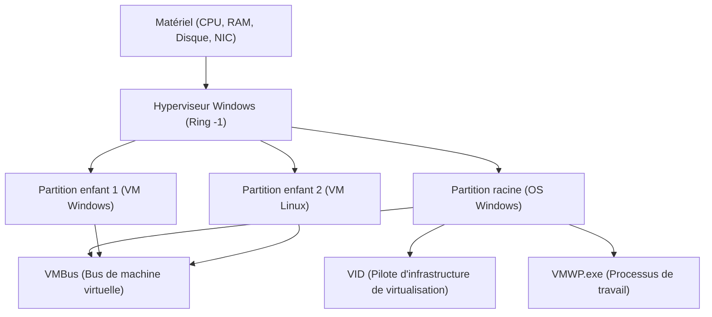

## 1. Introduction : L'évolution de la virtualisation sur Windows

La technologie de virtualisation sur la plateforme Windows a connu une évolution spectaculaire au cours des dernières décennies. Autrefois, les hyperviseurs de type 2 tiers (tels que VMware Workstation ou VirtualBox) étaient la norme, mais depuis que Microsoft a introduit "Hyper-V" avec Windows Server 2008, un hyperviseur de type 1 a également été intégré aux systèmes d'exploitation de bureau tels que Windows 10/11.

Et ces dernières années, ce qui attire le plus l'attention parmi les développeurs est "WSL2 (Windows Subsystem for Linux 2)". Alors que WSL1 s'appuyait sur la traduction des appels système, WSL2 utilise une "Lightweight Utility VM" (machine virtuelle utilitaire légère) qui applique la technologie d'Hyper-V, réalisant ainsi une compatibilité Linux complète et une amélioration spectaculaire des performances.

Dans cet article, nous comparerons et expliquerons en détail ces deux puissantes technologies de virtualisation — le "Hyper-V" complet et le "WSL2" axé sur l'expérience du développeur — en termes d'architecture, de performances (CPU, mémoire, E/S disque), de configuration réseau, et des meilleurs cas d'utilisation, avec une profondeur technique abyssale.

---

## 2. Théorie fondamentale des hyperviseurs et comparaison architecturale

Pour comprendre la technologie de virtualisation, il est essentiel de classer les hyperviseurs (Virtual Machine Monitors : VMM) par type.

### 2.1. Différences entre les hyperviseurs de type 1 et de type 2

Un hyperviseur est une couche logicielle qui abstrait l'accès au matériel et permet à plusieurs systèmes d'exploitation (OS invités) de s'exécuter simultanément sur une seule machine physique.

*   **Type 1 (Bare Metal)** : S'exécute directement sur le matériel. Il n'y a pas de concept d'OS hôte (bien qu'il puisse y avoir un OS de gestion avec des privilèges stricts), l'overhead est extrêmement faible, offrant des performances et une sécurité élevées. Exemples : Hyper-V, VMware ESXi, Xen.
*   **Type 2 (Hébergé)** : S'exécute comme une application sur l'OS hôte (Windows, macOS, etc.). Étant donné que tous les accès au matériel passent par l'OS hôte, l'overhead est important. Exemples : VMware Workstation, Oracle VirtualBox.

Le Hyper-V de Windows est un pur **hyperviseur de Type 1**. Lorsque Hyper-V est activé, l'OS Windows lui-même avec lequel l'utilisateur interagit habituellement s'exécute dans une machine virtuelle spéciale appelée "Partition racine" (Root Partition).

### 2.2. Détails architecturaux d'Hyper-V

L'architecture d'Hyper-V adopte une conception de micro-noyau et est basée sur des unités logiques d'isolation appelées partitions (Partition).



*   **Hyperviseur Windows** : S'exécute avec le niveau de privilège le plus élevé du CPU (Ring -1 ou mode VMX Root) et gère uniquement l'allocation de la mémoire et la planification du CPU. Il ne contient pas de pilotes de périphériques.
*   **Partition racine** : La partition où s'exécute l'OS Windows hôte. Elle possède tous les pilotes de périphériques et contrôle directement le matériel. Elle fournit également les fonctions de gestion (fournisseur WMI, VMWP.exe, etc.) des partitions enfants.
*   **Partition enfant** : La partition où s'exécute l'OS invité. L'accès direct au matériel n'est pas autorisé ; elle envoie des requêtes d'E/S (Synthetic I/O) à la partition racine via un bus de mémoire partagée logique appelé "VMBus".

### 2.3. Fonctionnement de WSL2 et Lightweight Utility VM

WSL2 utilise la même technologie de base d'hyperviseur de type 1 que Hyper-V, mais utilise un sous-ensemble de fonctionnalités appelé "Virtual Machine Platform (VMP)", différent d'une machine virtuelle Hyper-V complète.

La "Lightweight Utility VM" adoptée par WSL2 élimine complètement l'émulation de matériel hérité (comme les BIOS ou cartes mères virtuels) que possèdent les machines virtuelles traditionnelles.

```mermaid
graph TD
    A["OS Hôte Windows (Espace utilisateur)"]
    B["Système de fichiers NTFS"]
    C["Serveur de protocole 9P (Plan 9)"]
    D["Lightweight Utility VM (Noyau Linux)"]
    E["ext4.vhdx (Disque virtuel)"]
    F["Espace utilisateur Linux (Distributions WSL2)"]

    A --> C
    C <-->| "Partage de fichiers inter-OS" | D
    D --> E
    D --> F
```

La plus grande caractéristique de WSL2 est sa **rapidité de démarrage** et son **intégration transparente avec l'OS hôte**. Le noyau Linux démarre en moins d'une seconde, et il accède au système de fichiers (NTFS) du côté Windows via le protocole de système de fichiers réseau `9P` de Plan 9.

---

## 3. Analyse approfondie des performances : Ressources de calcul et E/S

Les performances des machines virtuelles sont représentées par la somme des overheads pour chaque composant : CPU, mémoire et E/S disque.

### 3.1. CPU et overhead de changement de contexte

Hyper-V et WSL2 utilisent tous deux la virtualisation assistée par le matériel (Intel VT-x / AMD-V). Les instructions CPU s'exécutent généralement à une vitesse native, mais lors de l'exécution d'instructions privilégiées ou d'E/S, une interruption appelée "VM Exit" se produit, entraînant un changement de contexte vers l'hyperviseur.

Cet overhead CPU $T_{overhead}$ peut être exprimé par le modèle mathématique suivant :

$$ T_{overhead} = \sum_{i=1}^{N} (t_{vm\_exit} + t_{hypercall\_process} + t_{vm\_entry}) $$

Où :
*   $N$ : Nombre d'occurrences de VM Exit par unité de temps
*   $t_{vm\_exit}$ : Temps de transition de l'invité à l'hyperviseur
*   $t_{hypercall\_process}$ : Temps de traitement des E/S ou des interruptions via VMBus
*   $t_{vm\_entry}$ : Temps de retour de l'hyperviseur à l'invité

Comme WSL2 n'a pas d'émulation héritée, $t_{hypercall\_process}$ est optimisé et extrêmement petit. Par conséquent, pour les calculs CPU purs (comme la compilation du noyau ou l'inférence de modèles d'apprentissage automatique), la dégradation des performances est de l'ordre de quelques pourcents par rapport à un environnement bare metal.

### 3.2. Mécanisme d'allocation de la mémoire

En termes de méthodes de gestion de la mémoire, il existe une nette différence de philosophie de conception entre les deux.

*   **Hyper-V (Dynamic Memory)** : La partition racine alloue et récupère dynamiquement la mémoire en fonction des besoins en mémoire de la VM invitée. Cependant, la mémoire allouée en tant que cache de page dans l'OS invité a tendance à ne pas être libérée à moins que le système ne soit sous pression.
*   **WSL2 (Récupération dynamique de mémoire)** : WSL2 dispose d'un mécanisme propriétaire qui renvoie (Reclaim) régulièrement la mémoire devenue inutile (y compris le cache) dans la VM Linux à l'hôte Windows. Les premières versions de WSL2 avaient un problème où le cache de page Linux dévorait la mémoire Windows (processus Vmmem gonflé), mais cela a maintenant été amélioré par des patchs du noyau.

### 3.3. Caractéristiques des E/S disque (VHDX vs ext4.vhdx)

Le goulot d'étranglement le plus fréquent des performances des machines virtuelles est l'E/S disque.

La latence d'E/S $L_{total}$ est calculée comme suit :

$$ L_{total} = L_{guest\_fs} + L_{vmbus} + L_{host\_fs} + L_{physical\_disk} $$

**Pour Hyper-V** :
Les invités Hyper-V typiques utilisent des disques virtuels au format `VHDX`. Les requêtes d'E/S émises par le système de fichiers (ext4 ou NTFS) dans l'OS invité traversent le pilote de stockage de périphérique bloc de VMBus (storvsc) et sont traitées comme un accès au fichier VHDX sur le NTFS côté Windows.

**Pour WSL2** :
Les distributions Linux sur WSL2 s'exécutent sur un système de fichiers ext4 natif construit à l'intérieur d'un fichier dédié `ext4.vhdx`. Les opérations de fichiers à l'intérieur de Linux (comme dans le répertoire `~`) atteignent des performances natives équivalentes à celles de l'Hyper-V ci-dessus.
Cependant, **lors de l'accès aux fichiers du côté Windows depuis le Linux de WSL2 (comme `/mnt/c/`)**, ou vice versa, le processus est très différent. Cet accès inter-OS utilise le `9P (Plan 9 File System Protocol)`.

$$ L_{cross\_os} = L_{9p\_client} + L_{socket\_transfer} + L_{9p\_server} + L_{ntfs} $$

L'accès via ce protocole 9P a un important overhead de traitement de sérialisation, et les performances chutent drastiquement (parfois avec un délai plus de 10 fois supérieur) pour les applications lisant et écrivant un grand nombre de petits fichiers (par exemple, `npm install` ou les opérations Git dans un projet Node.js situé dans un répertoire côté Windows).
C'est pourquoi la **règle d'or absolue lors de l'utilisation de WSL2 est de toujours placer les fichiers de projet dans le système de fichiers natif de Linux (sous `~/`)**.

---

## 4. Structure du réseau : NAT, Default Switch, Bridged

La flexibilité des capacités réseau est l'une des principales différences entre Hyper-V et WSL2.

### 4.1. Le réseau de WSL2 (Basé sur le NAT)

Par défaut, le réseau de WSL2 est configuré en "NAT (Network Address Translation)" en utilisant la technologie de commutateur virtuel d'Hyper-V.
Une adresse IP privée (par exemple : `172.20.x.x`) différente de celle de l'hôte Windows est automatiquement attribuée à la VM Linux. Un mécanisme est intégré pour que l'accès à `localhost` depuis l'hôte Windows soit redirigé vers les services (ports) démarrés dans WSL2, permettant aux développeurs de tester des serveurs web sans se soucier du réseau.

Récemment, un nouveau mode réseau appelé "Mirrored mode" (mode miroir) a été introduit dans les versions preview de WSL2. Cela vise à améliorer le support d'IPv6 et la compatibilité des connexions VPN (configurable via `.wslconfig`).

### 4.2. Commutateur virtuel d'Hyper-V (Virtual Switch)

Hyper-V permet la construction de réseaux avancés au niveau de l'entreprise. Via le "Gestionnaire de commutateur virtuel", il offre principalement trois modes :

1.  **Externe (External)** : Lie la carte réseau physique de la machine hôte au commutateur virtuel, permettant aux VM invitées de participer directement au réseau physique (connexion par pont). La VM obtient une IP du même sous-réseau que le réseau physique depuis un serveur DHCP.
2.  **Interne (Internal)** : N'autorise que les communications entre l'OS hôte et les VM, et entre les VM elles-mêmes. Elles ne peuvent pas accéder directement au réseau externe.
3.  **Privé (Private)** : N'autorise que les communications entre les VM, bloquant même la communication avec l'OS hôte. Utilisé pour créer des environnements de test isolés.

### 4.3. Construction de réseaux Hyper-V avancés avec PowerShell

Dans les environnements de développement et de test, si vous souhaitez construire un réseau NAT personnalisé pour les VM, PowerShell permet un contrôle détaillé. Voici un exemple de script pour créer un commutateur virtuel interne, y configurer le NAT, et fournir un accès à internet aux VM.

```powershell
# 1. Création d'un commutateur virtuel interne
$SwitchName = "HyperV-NatSwitch"
New-VMSwitch -SwitchName $SwitchName -SwitchType Internal

# 2. Configuration d'une adresse IP pour la carte réseau virtuelle côté hôte (IP servant de passerelle)
$GatewayIP = "192.168.100.1"
$NetPrefix = 24
$InterfaceAlias = "vEthernet ($SwitchName)"
New-NetIPAddress -IPAddress $GatewayIP -PrefixLength $NetPrefix -InterfaceAlias $InterfaceAlias

# 3. Configuration du réseau NAT
$NatName = "HyperV-NatNetwork"
$NatSubnet = "192.168.100.0/24"
New-NetNat -Name $NatName -InternalIPInterfaceAddressPrefix $NatSubnet

# Commande de vérification
Get-NetNat
```

Avec cette configuration, en attribuant manuellement une IP `192.168.100.x` et la passerelle `192.168.100.1` à l'invité Hyper-V spécifié, vous pouvez construire votre propre segment NAT capable de communiquer avec l'extérieur via l'hôte.

---

## 5. Cas d'utilisation et guide de sélection pratique

Sur la base des différences d'architecture et de performances discutées jusqu'à présent, nous définissons dans quelles situations chacune de ces technologies devrait être adoptée.

### 5.1. Scénarios où WSL2 doit être sélectionné

WSL2 a été conçu spécifiquement pour "l'amélioration de la productivité des développeurs". Il est idéal pour les utilisations suivantes :

*   **Développement web et cloud-native** : Développement de conteneurs utilisant Docker Desktop (backend WSL2) ou Podman.
*   **Utilisation d'outils exclusifs à Linux** : Utilisation quotidienne de bash, grep, awk, sed ou des compilateurs GCC et Clang pour Linux.
*   **Applications GUI (WSLg)** : Lorsque vous souhaitez exécuter de manière transparente des applications X11/Wayland de Linux sur le bureau Windows.
*   **Apprentissage automatique et développement d'IA** : Apprentissage rapide de TensorFlow ou PyTorch utilisant la fonction de passthrough GPU (NVIDIA CUDA sur WSL).

**Attention** : Vous pouvez rencontrer des restrictions si vous souhaitez personnaliser finement le noyau ou construire des services complexes qui dépendent fortement de systemd (actuellement, systemd est pris en charge mais désactivé par défaut ou restreint).

### 5.2. Scénarios où Hyper-V doit être sélectionné

Hyper-V a pour but "la virtualisation de l'infrastructure et une isolation complète". Il est essentiel pour les utilisations suivantes :

*   **Exécution de VM Windows** : Lors de l'exécution de différentes versions de Windows (Windows Server, anciens Windows 10, etc.) comme environnements de test.
*   **Virtualisation imbriquée (Nested Virtualization)** : Lorsque vous souhaitez exécuter une machine virtuelle (Hyper-V ou KVM) à l'intérieur d'une autre machine virtuelle. Indispensable pour les environnements de test des ingénieurs d'infrastructure.
*   **Besoins réseau avancés** : Lorsqu'il est nécessaire de contrôler strictement la configuration du réseau, comme pour les connexions par pont externes (participation au même LAN), le marquage VLAN ou l'attribution de plusieurs NIC.
*   **Instantanés (Checkpoints)** : Fonctionnalité permettant de sauvegarder l'état d'une VM à un moment donné et de revenir en arrière instantanément à tout moment. Extrêmement utile pour les tests destructifs de logiciels ou l'analyse de logiciels malveillants.
*   **Allocation fixe des ressources** : Lorsque vous souhaitez fixer strictement le nombre de cœurs CPU et la quantité de mémoire pour minimiser l'impact sur l'OS hôte.

---

## 6. Considérations sur le débit d'E/S avec un modèle mathématique (Annexe)

En tant qu'ingénieur système, lorsqu'il s'agit d'identifier les limites des performances d'E/S des deux, il est important de comprendre théoriquement la relation entre le débit $S$ et la taille de bloc $B$.

Le débit de transfert de données $S$ est la quantité de données transférées par unité de temps, modélisée comme suit :

$$ S(B) = \frac{B}{L_{setup} + \frac{B}{R_{max}}} $$

*   $B$ : Taille de bloc (Octets)
*   $L_{setup}$ : Latence fixe due à la configuration de la requête d'E/S et au changement de contexte
*   $R_{max}$ : Bande passante maximale du matériel lors de la copie ou du transfert d'appareils

Pour l'accès aux fichiers de WSL2 via le protocole 9P, ce $L_{setup}$ devient très important (en raison des communications via socket et de la sérialisation/désérialisation du protocole). Par conséquent, lorsque la taille de bloc $B$ est petite (lecture et écriture massives de petits fichiers de quelques Ko), l'impact de $L_{setup}$ dans le dénominateur devient dominant, et le débit $S$ chute considérablement.
À l'inverse, pour l'accès aux VHDX via le VMBus d'Hyper-V, $L_{setup}$ est optimisé à un niveau proche de l'interruption matérielle, de sorte qu'il peut maintenir des IOPS élevés même pour des petits blocs.

Cette réalité mathématique est le fondement logique de la bonne pratique selon laquelle "il ne faut pas placer les fichiers de projet du côté Windows avec WSL2".

---

## 7. Conclusion : Deux technologies de virtualisation qui coexistent

Ce n'est pas que l'un entre Hyper-V et WSL2 soit meilleur que l'autre, ce sont **"deux solutions avec des objectifs différents"**.

*   **WSL2** est le "meilleur outil d'intégration" pour briser la coquille de l'OS Windows et apporter l'écosystème Linux de manière transparente et rapide aux utilisateurs de Windows. Il n'est pas exagéré de dire que c'est l'environnement CLI ultime pour les développeurs.
*   **Hyper-V** est un "hyperviseur authentique" qui apporte au bureau la forte isolation et les capacités de gestion cultivées dans les centres de données d'entreprise. Il n'y a pas mieux pour la construction de réseaux, les tests du système d'exploitation Windows et la simulation d'environnements d'infrastructure.

Dans les environnements Windows modernes, ces deux technologies ne sont pas en concurrence directe, mais coexistent magnifiquement sur la même plateforme de VM. En les utilisant de manière appropriée en fonction de l'usage, Windows deviendra la station de travail d'ingénierie la plus puissante et la plus flexible au monde.
