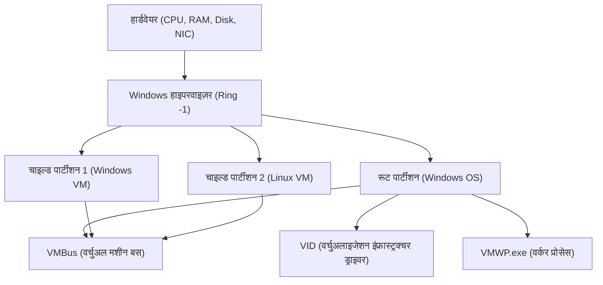

## 1. परिचय: Windows में वर्चुअलाइजेशन का विकास

Windows प्लेटफॉर्म में वर्चुअलाइजेशन तकनीक ने पिछले कुछ दशकों में नाटकीय विकास देखा है। पहले, थर्ड-पार्टी टाइप 2 हाइपरवाइज़र (जैसे VMware Workstation या VirtualBox) मुख्यधारा में थे, लेकिन जब से Microsoft ने Windows Server 2008 में "Hyper-V" पेश किया है, तब से टाइप 1 हाइपरवाइज़र को डेस्कटॉप OS जैसे Windows 10/11 में भी शामिल किया जाने लगा है।

और हाल के वर्षों में, डेवलपर्स के बीच सबसे ज्यादा ध्यान "WSL2 (Windows Subsystem for Linux 2)" पर दिया गया है। जबकि WSL1 सिस्टम कॉल ट्रांसलेशन पर निर्भर था, WSL2 ने Hyper-V की तकनीक को लागू करते हुए एक "लाइटवेट यूटिलिटी VM (Lightweight Utility VM)" अपनाया है, जिससे पूर्ण Linux संगतता और प्रदर्शन में भारी सुधार हुआ है।

इस लेख में, हम इन दो शक्तिशाली वर्चुअलाइजेशन तकनीकों - पूर्ण विशेषताओं वाले "Hyper-V" और डेवलपर अनुभव पर केंद्रित "WSL2" - के आर्किटेक्चर, प्रदर्शन (CPU, मेमोरी, डिस्क I/O), नेटवर्क कॉन्फ़िगरेशन और सर्वोत्तम उपयोग के मामलों (यूज़ केस) की गहराई से तकनीकी जानकारी के साथ पूरी तरह से तुलना और व्याख्या करेंगे।

---

## 2. हाइपरवाइज़र का बुनियादी सिद्धांत और आर्किटेक्चर की तुलना

वर्चुअलाइजेशन तकनीक को समझने के लिए हाइपरवाइज़र (वर्चुअल मशीन मॉनिटर: VMM) के प्रकार का वर्गीकरण बहुत आवश्यक है।

### 2.1. Type 1 और Type 2 हाइपरवाइज़र के बीच अंतर

हाइपरवाइज़र एक सॉफ़्टवेयर लेयर है जो हार्डवेयर एक्सेस को एब्स्ट्रेक्ट करती है और कई OS (गेस्ट OS) को एक साथ एक ही भौतिक मशीन पर चलाने की अनुमति देती है।

*   **Type 1 (बेयर-मेटल प्रकार)**: सीधे हार्डवेयर पर चलता है। इसमें होस्ट OS की कोई अवधारणा नहीं होती (हालांकि कभी-कभी विशेषाधिकार प्राप्त एक मैनेजमेंट OS हो सकता है), इसका ओवरहेड बहुत कम होता है, और यह उच्च प्रदर्शन और सुरक्षा प्रदान करता है। उदाहरण: Hyper-V, VMware ESXi, Xen।
*   **Type 2 (होस्ट प्रकार)**: होस्ट OS (जैसे Windows या macOS) के ऊपर एक एप्लिकेशन के रूप में चलता है। सभी हार्डवेयर एक्सेस होस्ट OS के माध्यम से होते हैं, जिससे ओवरहेड बढ़ जाता है। उदाहरण: VMware Workstation, Oracle VirtualBox।

Windows का Hyper-V एक पूर्ण **Type 1 हाइपरवाइज़र** है। जब आप Hyper-V को सक्षम करते हैं, तो वास्तव में जो Windows OS आप उपयोग कर रहे हैं वह भी "रूट पार्टीशन (Root Partition)" नामक एक विशेष वर्चुअल मशीन के अंदर चलने लगता है।

### 2.2. Hyper-V का आर्किटेक्चर विवरण

Hyper-V का आर्किटेक्चर एक माइक्रो-कर्नेल डिज़ाइन को अपनाता है और पार्टीशन (Partition) नामक लॉजिकल अलगाव इकाइयों पर आधारित होता है।



*   **Windows Hypervisor**: CPU के सबसे उच्च विशेषाधिकार प्राप्त स्तर (Ring -1 या VMX Root Mode) में चलता है, और केवल मेमोरी आवंटन और CPU शेड्यूलिंग को संभालता है। इसमें डिवाइस ड्राइवर शामिल नहीं होते हैं।
*   **Root Partition**: वह पार्टीशन जिसमें होस्ट Windows OS चलता है। इसमें सभी डिवाइस ड्राइवर होते हैं और यह सीधे हार्डवेयर को नियंत्रित करता है। यह चाइल्ड पार्टीशन के प्रबंधन के लिए कार्य (जैसे WMI प्रोवाइडर और VMWP.exe) भी प्रदान करता है।
*   **Child Partition**: वह पार्टीशन जिसमें गेस्ट OS चलता है। इसे सीधे हार्डवेयर तक पहुंचने की अनुमति नहीं है, और यह I/O रिक्वेस्ट (सिंथेटिक I/O) को रूट पार्टीशन में "VMBus" नामक लॉजिकल मेमोरी-शेयर्ड बस के माध्यम से भेजता है।

### 2.3. WSL2 और Lightweight Utility VM का काम करने का तरीका

WSL2 उसी Type 1 हाइपरवाइज़र बेस तकनीक का उपयोग करता है जिसका Hyper-V करता है, लेकिन यह पूर्ण-सुविधा वाले Hyper-V वर्चुअल मशीन के बजाय "वर्चुअल मशीन प्लेटफ़ॉर्म (Virtual Machine Platform: VMP)" नामक एक सबसेट सुविधा का उपयोग करता है।

WSL2 में उपयोग किए जाने वाले "लाइटवेट यूटिलिटी VM (Lightweight Utility VM)" में पारंपरिक VM के लेगेसी हार्डवेयर एमुलेशन (जैसे वर्चुअल BIOS और वर्चुअल मदरबोर्ड) को पूरी तरह से हटा दिया गया है।

```mermaid
graph TD
    A["Windows होस्ट OS (यूज़र स्पेस)"]
    B["NTFS फाइल सिस्टम"]
    C["9P प्रोटोकॉल सर्वर (Plan 9)"]
    D["लाइटवेट यूटिलिटी VM (Linux कर्नेल)"]
    E["ext4.vhdx (वर्चुअल डिस्क)"]
    F["Linux यूज़र स्पेस (WSL2 डिस्ट्रिब्यूशन)"]

    A --> C
    C <-->| "क्रॉस-OS फाइल शेयरिंग" | D
    D --> E
    D --> F
```

WSL2 की सबसे बड़ी विशेषता इसकी **स्टार्टअप गति** और **होस्ट OS के साथ निर्बाध एकीकरण** है। Linux कर्नेल कुछ सेकंड से भी कम समय में बूट हो जाता है और Plan 9 के `9P` नेटवर्क फाइल सिस्टम प्रोटोकॉल के माध्यम से Windows फ़ाइल सिस्टम (NTFS) तक पहुंचता है।

---

## 3. प्रदर्शन का संपूर्ण विश्लेषण: गणना संसाधन और I/O

वर्चुअल मशीन के प्रदर्शन को CPU, मेमोरी और डिस्क I/O घटकों में ओवरहेड के योग के रूप में दर्शाया जाता है।

### 3.1. CPU और कॉन्टेक्स्ट स्विच ओवरहेड

Hyper-V और WSL2 दोनों हार्डवेयर-असिस्टेड वर्चुअलाइजेशन (Intel VT-x / AMD-V) का उपयोग करते हैं। CPU निर्देश मूल रूप से नेटिव गति से निष्पादित होते हैं, लेकिन जब विशेषाधिकार प्राप्त निर्देश या I/O ऑपरेशन निष्पादित होते हैं, तो "VM Exit" नामक एक इंटरप्ट उत्पन्न होता है, जो हाइपरवाइज़र पर कॉन्टेक्स्ट स्विच करता है।

इस समय CPU ओवरहेड $T_{overhead}$ को निम्नलिखित गणितीय मॉडल द्वारा दर्शाया जा सकता है:

$$ T_{overhead} = \sum_{i=1}^{N} (t_{vm\_exit} + t_{hypercall\_process} + t_{vm\_entry}) $$

जहाँ:
*   $N$: प्रति यूनिट समय में VM Exit होने की संख्या
*   $t_{vm\_exit}$: गेस्ट से हाइपरवाइज़र तक का ट्रांज़िशन समय
*   $t_{hypercall\_process}$: VMBus के माध्यम से I/O प्रोसेसिंग या इंटरप्ट का प्रोसेसिंग समय
*   $t_{vm\_entry}$: हाइपरवाइज़र से गेस्ट तक वापसी का समय

चूँकि WSL2 में लेगेसी एमुलेशन नहीं है, इसलिए $t_{hypercall\_process}$ अत्यधिक अनुकूलित और बहुत छोटा है। इसलिए, शुद्ध CPU गणनाओं (जैसे कर्नेल को संकलित करना या मशीन लर्निंग मॉडल इनफेरेंस) में, बेयर-मेटल वातावरण की तुलना में प्रदर्शन में गिरावट कुछ प्रतिशत के भीतर ही रहती है।

### 3.2. मेमोरी आवंटन का तंत्र

जब मेमोरी प्रबंधन के तरीकों की बात आती है, तो दोनों के बीच स्पष्ट रूप से अलग-अलग डिज़ाइन दर्शन होते हैं।

*   **Hyper-V (Dynamic Memory)**: गेस्ट VM की मेमोरी मांग के अनुसार, रूट पार्टीशन गतिशील रूप से मेमोरी आवंटित और पुनर्प्राप्त (रीक्लेम) करता है। हालाँकि, जब तक सिस्टम में मेमोरी की कमी नধি न हो, गेस्ट OS के भीतर पेज कैशे के रूप में सुरक्षित मेमोरी आसानी से रिलीज़ नहीं होती है।
*   **WSL2 (डायनेमिक मेमोरी रिक्लेम)**: WSL2 का अपना अनूठा तंत्र है, जो नियमित रूप से अनावश्यक मेमोरी (कैशे सहित) को Linux VM के भीतर से Windows होस्ट को वापस (Reclaim) कर देता है। शुरुआती WSL2 में एक समस्या थी जहाँ Linux पेज कैशे Windows मेमोरी की खपत कर लेता था (Vmmem प्रक्रिया का फूलना), लेकिन इसे अब कर्नेल पैच के माध्यम से सुधार दिया गया है।

### 3.3. डिस्क I/O की विशेषताएं (VHDX vs ext4.vhdx)

वर्चुअल मशीन के प्रदर्शन में डिस्क I/O सबसे आसानी से बॉटलनेक (अड़चन) बन सकता है।

I/O लेटेंसी $L_{total}$ की गणना इस प्रकार की जाती है:

$$ L_{total} = L_{guest\_fs} + L_{vmbus} + L_{host\_fs} + L_{physical\_disk} $$

**Hyper-V के मामले में**:
सामान्य Hyper-V गेस्ट `VHDX` फॉर्मेट वर्चुअल डिस्क का उपयोग करते हैं। गेस्ट OS (ext4 या NTFS) के अंदर फाइल सिस्टम से जारी I/O रिक्वेस्ट VMBus के ब्लॉक डिवाइस स्टोरेज ड्राइवर (storvsc) से होकर गुजरती है और Windows पर NTFS पर VHDX फाइल तक एक्सेस के रूप में प्रोसेस होती है।

**WSL2 के मामले में**:
WSL2 के Linux डिस्ट्रिब्यूशन एक समर्पित `ext4.vhdx` फाइल के भीतर निर्मित नेटिव ext4 फाइल सिस्टम पर चलते हैं। Linux के भीतर फाइल संचालन (जैसे `~` डायरेक्टरी में) उपरोक्त Hyper-V के समान नेटिव प्रदर्शन प्रदान करते हैं।
हालाँकि, **जब WSL2 Linux से Windows साइड फाइलों (जैसे `/mnt/c/`) तक पहुँचते हैं**, या इसके विपरीत, तो प्रक्रिया काफी अलग होती है। इस क्रॉस-OS एक्सेस के लिए `9P (Plan 9 File System Protocol)` का उपयोग किया जाता है।

$$ L_{cross\_os} = L_{9p\_client} + L_{socket\_transfer} + L_{9p\_server} + L_{ntfs} $$

इस 9P प्रोटोकॉल के माध्यम से एक्सेस करने पर सीरियलाइज़ेशन का बड़ा ओवरहेड होता है, और ऐसे उपयोगों के लिए जहाँ बड़ी संख्या में छोटी फ़ाइलों को पढ़ा और लिखा जाता है (उदाहरण के लिए: Windows-साइड डायरेक्टरी में स्थित Node.js प्रोजेक्ट पर `npm install` या Git संचालन), प्रदर्शन में काफी गिरावट आती है (कभी-कभी 10 गुना से अधिक देरी)।
इसलिए, **WSL2 का उपयोग करते समय, यह सुनिश्चित करना एक मूल नियम है कि प्रोजेक्ट फाइलें Linux के नेटिव फाइल सिस्टम (जैसे `~/` के तहत) में रखी जाएँ**।

---

## 4. नेटवर्क संरचना: NAT, Default Switch, Bridged

नेटवर्क क्षमताओं का लचीलापन Hyper-V और WSL2 के बीच सबसे बड़े अंतरों में से एक है।

### 4.1. WSL2 का नेटवर्क (NAT-आधारित)

WSL2 का नेटवर्क डिफ़ॉल्ट रूप से Hyper-V की वर्चुअल स्विच तकनीक का उपयोग करके "NAT (Network Address Translation)" कॉन्फ़िगरेशन में सेट होता है।
Linux VM को स्वचालित रूप से एक निजी IP एड्रेस (जैसे: `172.20.x.x`) सौंपा जाता है जो Windows होस्ट से अलग होता है। एक बिल्ट-इन तंत्र है जो Windows होस्ट से `localhost` को WSL2 के भीतर शुरू की गई सेवाओं (पोर्ट्स) पर फॉरवर्ड करता है, जिससे डेवलपर्स नेटवर्क के बारे में चिंता किए बिना वेब सर्वर आदि का परीक्षण कर सकते हैं।

हाल के वर्षों में, WSL2 के प्रीव्यू वर्जन में "Mirrored मोड" नामक एक नया नेटवर्क मोड पेश किया गया है। इससे IPv6 के लिए सपोर्ट और VPN कनेक्शन के साथ अनुकूलता में सुधार होता है (इसे `.wslconfig` में सेट किया जा सकता है)।

### 4.2. Hyper-V का वर्चुअल स्विच (Virtual Switch)

Hyper-V उन्नत एंटरप्राइज़-स्तरीय नेटवर्क बनाने में सक्षम है। यह "वर्चुअल स्विच मैनेजर" के माध्यम से मुख्य रूप से तीन मोड प्रदान करता है:

1.  **बाहरी (External)**: होस्ट मशीन के फिजिकल NIC को वर्चुअल स्विच से बांधता है, जिससे गेस्ट VM सीधे फिजिकल नेटवर्क से जुड़ सकता है (ब्रिज कनेक्शन)। VM को DHCP सर्वर से उसी सबनेट का IP मिलता है जो फिजिकल नेटवर्क का है।
2.  **आंतरिक (Internal)**: केवल होस्ट OS और VM के बीच, और VMs के बीच संचार की अनुमति देता है। यह सीधे बाहरी नेटवर्क तक नहीं पहुंच सकता।
3.  **निजी (Private)**: केवल VMs के बीच संचार की अनुमति देता है, और होस्ट OS के साथ संचार को अवरुद्ध करता है। इसका उपयोग आइसोलेटेड (अलग-थलग) परीक्षण वातावरण बनाने के लिए किया जाता है।

### 4.3. PowerShell के साथ उन्नत Hyper-V नेटवर्क का निर्माण

डेवलपमेंट या टेस्टिंग वातावरण में, यदि आप VM के लिए एक कस्टमाइज़्ड NAT नेटवर्क बनाना चाहते हैं, तो आप PowerShell का उपयोग करके विस्तृत नियंत्रण प्राप्त कर सकते हैं। यहाँ एक स्क्रिप्ट का उदाहरण दिया गया है जो एक इंटरनल वर्चुअल स्विच बनाता है, उस पर NAT कॉन्फ़िगर करता है, और VM को इंटरनेट एक्सेस प्रदान करता है।

```powershell
# 1. इंटरनल वर्चुअल स्विच बनाना
$SwitchName = "HyperV-NatSwitch"
New-VMSwitch -SwitchName $SwitchName -SwitchType Internal

# 2. होस्ट-साइड वर्चुअल NIC पर IP एड्रेस सेट करना (IP जो गेटवे के रूप में काम करेगा)
$GatewayIP = "192.168.100.1"
$NetPrefix = 24
$InterfaceAlias = "vEthernet ($SwitchName)"
New-NetIPAddress -IPAddress $GatewayIP -PrefixLength $NetPrefix -InterfaceAlias $InterfaceAlias

# 3. NAT नेटवर्क को कॉन्फ़िगर करना
$NatName = "HyperV-NatNetwork"
$NatSubnet = "192.168.100.0/24"
New-NetNat -Name $NatName -InternalIPInterfaceAddressPrefix $NatSubnet

# वेरिफिकेशन कमांड
Get-NetNat
```

इस कॉन्फ़िगरेशन के साथ, आप निर्दिष्ट Hyper-V गेस्ट पर मैन्युअल रूप से IP `192.168.100.x` और गेटवे `192.168.100.1` सेट करके एक कस्टम NAT सेगमेंट बना सकते हैं, जो होस्ट के माध्यम से बाहरी दुनिया के साथ संवाद कर सकता है।

---

## 5. उपयोग के मामले (यूज़ केस) और व्यावहारिक चयन मार्गदर्शिका

अब तक आर्किटेक्चर और प्रदर्शन में अंतर को देखते हुए, हम परिभाषित करेंगे कि किस स्थिति में कौन सी तकनीक अपनाई जानी चाहिए।

### 5.1. परिदृश्य (सिनेरियो) जहाँ WSL2 चुना जाना चाहिए

WSL2 विशेष रूप से "डेवलपर्स की उत्पादकता में सुधार" के लिए डिज़ाइन किया गया है। यह निम्नलिखित उपयोगों के लिए आदर्श है:

*   **वेब डेवलपमेंट और क्लाउड-नेटिव डेवलपमेंट**: Docker Desktop (WSL2 बैकएंड) या Podman का उपयोग करके कंटेनर डेवलपमेंट।
*   **Linux-विशिष्ट टूल का उपयोग**: अगर आप रोज़ाना bash, grep, awk, sed, या Linux के लिए GCC और Clang कंपाइलर का उपयोग करते हैं।
*   **GUI एप्लिकेशन (WSLg)**: यदि आप Windows डेस्कटॉप पर Linux X11/Wayland एप्लिकेशन को निर्बाध (सीमलेस) रूप से चलाना चाहते हैं।
*   **मशीन लर्निंग और AI डेवलपमेंट**: GPU पास-थ्रू फीचर (NVIDIA CUDA on WSL) का उपयोग करके TensorFlow या PyTorch में तेज़ ट्रेनिंग।

**ध्यान दें**: यदि आप कर्नेल को बारीक रूप से कस्टमाइज़ करना चाहते हैं या ऐसी जटिल सेवाएँ बनाना चाहते हैं जो systemd पर बहुत अधिक निर्भर करती हैं (हालांकि systemd अब समर्थित है, डिफ़ॉल्ट रूप से यह अक्षम या सीमित हो सकता है), तो आपको प्रतिबंधों का सामना करना पड़ सकता है।

### 5.2. परिदृश्य (सिनेरियो) जहाँ Hyper-V चुना जाना चाहिए

Hyper-V का उद्देश्य "इंफ्रास्ट्रक्चर वर्चुअलाइजेशन और पूर्ण अलगाव (आइसोलेशन)" है। यह निम्नलिखित उपयोगों के लिए आवश्यक है:

*   **Windows VM चलाना**: यदि आप परीक्षण वातावरण के रूप में Windows के विभिन्न संस्करणों (जैसे Windows Server या पुराने Windows 10) को चलाना चाहते हैं।
*   **नेस्टेड वर्चुअलाइजेशन**: यदि आप वर्चुअल मशीन के अंदर एक और वर्चुअल मशीन (Hyper-V या KVM) चलाना चाहते हैं। यह इंफ्रास्ट्रक्चर इंजीनियरों के परीक्षण वातावरण के लिए अनिवार्य है।
*   **उन्नत नेटवर्क आवश्यकताएँ**: यदि नेटवर्क कॉन्फ़िगरेशन को सख्ती से नियंत्रित करना आवश्यक है, जैसे कि एक्सटर्नल ब्रिजिंग (एक ही LAN से जुड़ना), VLAN टैगिंग, या कई NIC असाइन करना।
*   **स्नैपशॉट (चेकपॉइंट्स)**: VM को किसी विशिष्ट समय की स्थिति में सहेजने और उसे तुरंत रोलबैक (वापस पलटने) की क्षमता। यह सॉफ़्टवेयर के विनाशकारी परीक्षण या मैलवेयर विश्लेषण के लिए बेहद उपयोगी है।
*   **निश्चित संसाधन आवंटन**: यदि आप CPU कोर की संख्या और मेमोरी की मात्रा को सख्ती से फिक्स करना चाहते हैं ताकि होस्ट OS पर प्रभाव कम से कम हो।

---

## 6. गणितीय मॉडल के माध्यम से I/O थ्रूपुट का अध्ययन (परिशिष्ट)

एक सिस्टम इंजीनियर के रूप में, दोनों की I/O प्रदर्शन सीमाओं का आकलन करते समय थ्रूपुट $S$ और ब्लॉक साइज़ $B$ के बीच के संबंध को सैद्धांतिक रूप से समझना महत्वपूर्ण है।

डेटा ट्रांसफर थ्रूपुट $S$, प्रति यूनिट समय में ट्रांसफर किए गए डेटा की मात्रा है, और इसे इस प्रकार मॉडल किया जा सकता है:

$$ S(B) = \frac{B}{L_{setup} + \frac{B}{R_{max}}} $$

*   $B$: ब्लॉक साइज़ (Bytes)
*   $L_{setup}$: I/O अनुरोध को सेट अप करने और कॉन्टेक्स्ट स्विच से जुड़ी निश्चित लेटेंसी
*   $R_{max}$: कॉपी या डिवाइस ट्रांसफर में हार्डवेयर की अधिकतम बैंडविड्थ

WSL2 में 9P प्रोटोकॉल के माध्यम से फाइल एक्सेस करते समय, यह $L_{setup}$ बहुत बड़ा होता है (सॉकेट संचार और प्रोटोकॉल के सीरियलाइज़ेशन/डी-सीरियलाइज़ेशन के कारण)। इसलिए, जब ब्लॉक साइज़ $B$ छोटा होता है (जैसे कुछ KB की छोटी फाइलों का बड़े पैमाने पर पढ़ना/लिखना), तो डिनॉमिनेटर (हर) में $L_{setup}$ का प्रभाव हावी हो जाता है, और थ्रूपुट $S$ में भारी गिरावट आती है।
इसके विपरीत, Hyper-V के VMBus के माध्यम से VHDX एक्सेस में, $L_{setup}$ को हार्डवेयर इंटरप्ट के स्तर के करीब अनुकूलित किया जाता है, जिससे यह छोटे ब्लॉकों के साथ भी उच्च IOPS बनाए रख सकता है।

यही गणितीय वास्तविकता उस सर्वोत्तम अभ्यास (बेस्ट प्रैक्टिस) का तार्किक आधार है कि "WSL2 में प्रोजेक्ट फाइलों को Windows साइड पर नहीं रखा जाना चाहिए"।

---

## 7. निष्कर्ष: दो सह-अस्तित्व वाली वर्चुअलाइजेशन तकनीकें

यह कहना सही नहीं होगा कि Hyper-V या WSL2 में से कोई एक दूसरे से बेहतर है; बल्कि ये **"अलग-अलग उद्देश्यों वाले दो समाधान"** हैं।

*   **WSL2** Windows OS की सीमाओं को तोड़ता है और Linux इकोसिस्टम को Windows उपयोगकर्ताओं तक निर्बाध और तेज़ी से पहुँचाने के लिए "सर्वोत्तम एकीकरण उपकरण (इंटीग्रेशन टूल)" है। इसे डेवलपर्स के लिए अंतिम CLI वातावरण कहना कोई अतिशयोक्ति नहीं होगी।
*   **Hyper-V** एक "पूर्ण-विकसित हाइपरवाइज़र" है जो एंटरप्राइज़ डेटा सेंटरों में विकसित मजबूत अलगाव (आइसोलेशन) और प्रबंधन क्षमताओं को डेस्कटॉप पर लाता है। नेटवर्क निर्माण, Windows OS परीक्षण, और इंफ्रास्ट्रक्चर वातावरण सिमुलेशन के मामले में यह बेजोड़ है।

आधुनिक Windows वातावरण में, ये दोनों तकनीकें आपस में प्रतिस्पर्धा करने के बजाय एक ही VM प्लेटफॉर्म पर खूबसूरती से सह-अस्तित्व में हैं। अपने उपयोग के आधार पर सही जगह पर सही तकनीक का उपयोग करके, Windows दुनिया में सबसे शक्तिशाली और लचीला इंजीनियरिंग वर्कस्टेशन बन जाएगा।
