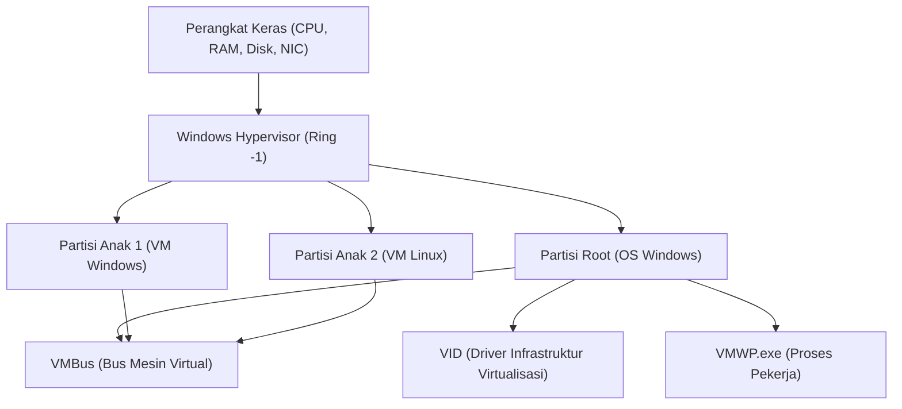

## 1. Pendahuluan: Evolusi Virtualisasi di Windows

Teknologi virtualisasi pada platform Windows telah mengalami evolusi dramatis dalam beberapa dekade terakhir. Dulu, hypervisor Type 2 dari pihak ketiga (seperti VMware Workstation atau VirtualBox) menjadi arus utama. Namun, sejak Microsoft memperkenalkan "Hyper-V" di Windows Server 2008, hypervisor Type 1 mulai terintegrasi ke dalam OS desktop seperti Windows 10/11.

Dalam beberapa tahun terakhir, yang paling menarik perhatian para pengembang adalah "WSL2 (Windows Subsystem for Linux 2)". Sementara WSL1 bergantung pada penerjemahan system call (translasi), WSL2 mengadopsi "Lightweight Utility VM" yang menerapkan teknologi Hyper-V, memberikan kompatibilitas Linux sepenuhnya serta peningkatan performa yang signifikan.

Artikel ini akan membandingkan dan menjelaskan secara mendetail dua teknologi virtualisasi kuat ini — "Hyper-V" yang berfitur lengkap dan "WSL2" yang difokuskan pada pengalaman pengembang — dari sisi arsitektur, performa (CPU, memori, I/O disk), konfigurasi jaringan, serta use case optimal beserta rincian teknis yang mendalam.

---

## 2. Teori Dasar Hypervisor dan Perbandingan Arsitektur

Untuk memahami teknologi virtualisasi, mengklasifikasikan tipe hypervisor (Virtual Machine Monitor: VMM) adalah hal yang penting.

### 2.1. Perbedaan antara Hypervisor Type 1 dan Type 2

Hypervisor adalah lapisan perangkat lunak yang mengabstraksi akses perangkat keras dan memungkinkan banyak OS (Guest OS) berjalan secara bersamaan di satu mesin fisik.

*   **Type 1 (Bare-metal)**: Berjalan langsung di atas perangkat keras. Tidak ada konsep Host OS (walaupun secara teknis mungkin ada sistem operasi manajemen yang memiliki hak istimewa), overhead-nya sangat rendah, dan menawarkan performa serta keamanan yang tinggi. Contoh: Hyper-V, VMware ESXi, Xen.
*   **Type 2 (Hosted)**: Berjalan sebagai aplikasi di atas Host OS (seperti Windows atau macOS). Karena semua akses perangkat keras harus melalui Host OS, overhead-nya menjadi lebih besar. Contoh: VMware Workstation, Oracle VirtualBox.

Hyper-V di Windows adalah **hypervisor Type 1** murni. Faktanya, ketika Anda mengaktifkan Hyper-V, OS Windows yang biasa Anda gunakan juga berjalan di dalam mesin virtual khusus yang disebut "Partisi Root" (Root Partition).

### 2.2. Detail Arsitektur Hyper-V

Arsitektur Hyper-V menggunakan desain mikro-kernel dan didasarkan pada unit pemisahan logis yang disebut Partisi (Partition).



*   **Windows Hypervisor**: Berjalan pada tingkat hak istimewa (privilege) CPU yang paling tinggi (Ring -1 atau VMX Root Mode), dan hanya menangani alokasi memori serta penjadwalan CPU. Tidak termasuk driver perangkat.
*   **Partisi Root**: Partisi tempat berjalannya Host OS Windows. Memiliki semua driver perangkat dan mengontrol perangkat keras secara langsung. Partisi ini juga menyediakan fungsionalitas manajemen untuk partisi anak (seperti WMI provider dan VMWP.exe).
*   **Partisi Anak**: Partisi tempat berjalannya Guest OS. Tidak memiliki akses langsung ke perangkat keras, dan mengirim permintaan I/O (Synthetic I/O) ke Partisi Root melalui bus memori bersama logis yang disebut "VMBus".

### 2.3. WSL2 dan Mekanisme Lightweight Utility VM

WSL2 menggunakan teknologi dasar hypervisor Type 1 yang sama dengan Hyper-V, tetapi memanfaatkan fitur subset yang disebut "Platform Mesin Virtual" (Virtual Machine Platform: VMP), yang berbeda dari mesin virtual Hyper-V berfitur lengkap.

"Lightweight Utility VM" yang digunakan di WSL2 sepenuhnya menghilangkan emulasi perangkat keras warisan (seperti BIOS virtual atau motherboard virtual) yang dimiliki oleh VM tradisional.

```mermaid
graph TD
    A["OS Host Windows (User Space)"]
    B["Sistem Berkas NTFS"]
    C["Server Protokol 9P (Plan 9)"]
    D["Lightweight Utility VM (Kernel Linux)"]
    E["ext4.vhdx (Disk Virtual)"]
    F["User Space Linux (Distribusi WSL2)"]

    A --> C
    C <-->| "Berbagi Berkas Lintas OS" | D
    D --> E
    D --> F
```

Karakteristik terbesar dari WSL2 adalah **kecepatan proses booting** dan **integrasinya yang mulus dengan Host OS**. Kernel Linux melakukan booting dalam waktu kurang dari beberapa detik, dan sistem berkas di sisi Windows (NTFS) diakses melalui protokol sistem berkas jaringan `9P` dari Plan 9.

---

## 3. Analisis Performa Mendalam: Sumber Daya Komputasi dan I/O

Performa mesin virtual direpresentasikan sebagai jumlah total overhead dari tiap komponen CPU, memori, dan I/O disk.

### 3.1. CPU dan Overhead Context Switch

Hyper-V maupun WSL2 menggunakan virtualisasi berbasis perangkat keras (Intel VT-x / AMD-V). Instruksi CPU pada dasarnya dieksekusi dengan kecepatan native, namun ketika instruksi dengan hak istimewa (privilege instructions) atau pemrosesan I/O dijalankan, terjadilah interupsi yang disebut "VM Exit", yang menyebabkan context switch ke hypervisor.

Overhead CPU $T_{overhead}$ pada saat tersebut dapat direpresentasikan dalam model matematika berikut:

$$ T_{overhead} = \sum_{i=1}^{N} (t_{vm\_exit} + t_{hypercall\_process} + t_{vm\_entry}) $$

Di mana:
*   $N$: Jumlah terjadinya VM Exit per satuan waktu
*   $t_{vm\_exit}$: Waktu transisi dari guest ke hypervisor
*   $t_{hypercall\_process}$: Waktu pemrosesan I/O atau interupsi melalui VMBus
*   $t_{vm\_entry}$: Waktu pemulihan (return) dari hypervisor ke guest

Pada WSL2, karena tidak ada emulasi legacy (warisan), $t_{hypercall\_process}$ dioptimalkan menjadi sangat kecil. Oleh karena itu, dalam komputasi murni CPU (misalnya proses kompilasi kernel atau inferensi model machine learning), penurunan performa hanya berada dalam kisaran beberapa persen jika dibandingkan dengan lingkungan bare-metal.

### 3.2. Mekanisme Alokasi Memori

Dalam hal manajemen memori, terdapat perbedaan konsep desain yang jelas di antara keduanya.

*   **Hyper-V (Dynamic Memory)**: Partisi Root akan mengalokasikan dan menarik kembali (reclaim) memori secara dinamis berdasarkan kebutuhan memori dari VM Guest. Namun, memori yang telah dialokasikan sebagai page cache di dalam Guest OS cenderung sulit untuk dibebaskan kecuali sistem sedang kekurangan memori.
*   **WSL2 (Pengembalian Memori Dinamis)**: WSL2 memiliki mekanisme unik yang secara teratur mengembalikan (reclaim) memori yang tidak lagi dibutuhkan (termasuk cache) di dalam VM Linux ke host Windows. Pada versi awal WSL2, ada masalah di mana page cache Linux menghabiskan memori Windows (pembengkakan proses Vmmem), tetapi saat ini masalah tersebut telah diperbaiki melalui patch kernel.

### 3.3. Karakteristik I/O Disk (VHDX vs ext4.vhdx)

Hal yang paling sering menjadi bottleneck pada performa mesin virtual adalah I/O disk.

Latensi I/O $L_{total}$ dihitung sebagai berikut:

$$ L_{total} = L_{guest\_fs} + L_{vmbus} + L_{host\_fs} + L_{physical\_disk} $$

**Dalam kasus Hyper-V**:
Guest Hyper-V pada umumnya menggunakan disk virtual dengan format `VHDX`. Permintaan I/O yang dikeluarkan dari sistem berkas di dalam Guest OS (ext4 atau NTFS) melewati blok driver perangkat penyimpanan VMBus (storvsc), dan diproses sebagai akses ke berkas VHDX di atas NTFS pada sisi Windows.

**Dalam kasus WSL2**:
Distribusi Linux di WSL2 berjalan pada sistem berkas native ext4 yang dibangun di dalam berkas `ext4.vhdx` khusus. Operasi berkas di dalam Linux (seperti pada direktori `~`) memberikan performa native yang setara dengan Hyper-V di atas.
Namun, **ketika mengakses berkas di sisi Windows (seperti `/mnt/c/`) dari Linux di WSL2**, atau sebaliknya, prosesnya akan jauh berbeda. Akses lintas OS ini menggunakan `9P (Plan 9 File System Protocol)`.

$$ L_{cross\_os} = L_{9p\_client} + L_{socket\_transfer} + L_{9p\_server} + L_{ntfs} $$

Akses yang melewati protokol 9P ini memiliki overhead proses serialisasi yang besar, sehingga pada penggunaan yang melibatkan banyak operasi baca/tulis berkas berukuran kecil (contoh: menjalankan `npm install` atau operasi Git pada proyek Node.js yang berada di direktori Windows), performanya akan menurun secara drastis (bahkan bisa mengakibatkan penundaan/delay lebih dari 10 kali lipat).
Oleh karena itu, **aturan utamanya ketika menggunakan WSL2 adalah selalu menempatkan berkas proyek di sistem berkas native Linux (di bawah `~/`)**.

---

## 4. Struktur Jaringan: NAT, Default Switch, Bridged

Fleksibilitas fitur jaringan merupakan salah satu perbedaan besar antara Hyper-V dan WSL2.

### 4.1. Jaringan WSL2 (Berbasis NAT)

Secara default, jaringan WSL2 dikonfigurasi menggunakan "NAT (Network Address Translation)" yang memanfaatkan teknologi virtual switch dari Hyper-V.
VM Linux secara otomatis diberikan alamat IP privat yang berbeda dari host Windows (contoh: `172.20.x.x`). Telah ada mekanisme bawaan di mana host Windows akan mem-forward permintaan `localhost` ke layanan (port) yang berjalan di dalam WSL2, sehingga pengembang bisa menguji coba server web tanpa harus memikirkan tentang jaringan.

Baru-baru ini, WSL2 memperkenalkan mode jaringan baru bernama "Mirrored Mode" dalam versi pratinjaunya. Mode ini berupaya meningkatkan dukungan untuk IPv6 dan kompatibilitas koneksi VPN (dapat dikonfigurasi melalui `.wslconfig`).

### 4.2. Virtual Switch Hyper-V (Virtual Switch)

Hyper-V mampu membangun jaringan tingkat enterprise yang canggih. Melalui "Virtual Switch Manager", utamanya disediakan 3 mode:

1.  **Eksternal (External)**: Mengikat (bind) NIC fisik dari mesin host ke virtual switch, dan memungkinkan VM Guest untuk berpartisipasi langsung di jaringan fisik (koneksi bridge). VM akan mendapatkan IP dari server DHCP di subnet yang sama dengan jaringan fisik.
2.  **Internal (Internal)**: Hanya mengizinkan komunikasi antara Host OS dan VM, serta antar VM. Tidak dapat keluar secara langsung ke jaringan eksternal.
3.  **Privat (Private)**: Hanya mengizinkan komunikasi antar VM, dan memblokir komunikasi dengan Host OS. Digunakan untuk membangun lingkungan pengujian (sandbox) yang terisolasi.

### 4.3. Konfigurasi Jaringan Hyper-V Tingkat Lanjut Menggunakan PowerShell

Di dalam lingkungan pengembangan atau pengujian, jika Anda ingin membangun jaringan NAT yang dikustomisasi khusus untuk VM, Anda dapat menggunakan PowerShell untuk kontrol yang lebih rinci. Berikut adalah contoh skrip untuk membuat switch virtual internal, mengkonfigurasi NAT di dalamnya, serta menyediakan akses internet bagi VM.

```powershell
# 1. Membuat Virtual Switch Internal
$SwitchName = "HyperV-NatSwitch"
New-VMSwitch -SwitchName $SwitchName -SwitchType Internal

# 2. Mengatur Alamat IP pada NIC virtual di sisi host (IP yang menjadi Gateway)
$GatewayIP = "192.168.100.1"
$NetPrefix = 24
$InterfaceAlias = "vEthernet ($SwitchName)"
New-NetIPAddress -IPAddress $GatewayIP -PrefixLength $NetPrefix -InterfaceAlias $InterfaceAlias

# 3. Konfigurasi jaringan NAT
$NatName = "HyperV-NatNetwork"
$NatSubnet = "192.168.100.0/24"
New-NetNat -Name $NatName -InternalIPInterfaceAddressPrefix $NatSubnet

# Perintah untuk pengecekan
Get-NetNat
```

Dengan konfigurasi ini, dengan mengatur IP secara manual (misalnya `192.168.100.x`) dan gateway `192.168.100.1` pada Guest Hyper-V yang ditentukan, Anda dapat membangun segmen NAT Anda sendiri yang mampu berkomunikasi dengan jaringan luar melalui host.

---

## 5. Use Case dan Panduan Praktis Pemilihan

Mempertimbangkan perbedaan arsitektur dan performa sejauh ini, mari kita tentukan dalam situasi seperti apa salah satu teknologi ini harus digunakan.

### 5.1. Skenario di Mana Anda Harus Memilih WSL2

WSL2 dirancang khusus untuk "meningkatkan produktivitas pengembang". WSL2 paling ideal untuk penggunaan berikut:

*   **Pengembangan Web dan Cloud-Native**: Pengembangan kontainer menggunakan Docker Desktop (backend WSL2) atau Podman.
*   **Penggunaan Perangkat/Alat Khusus Linux**: Jika Anda sehari-hari menggunakan bash, grep, awk, sed, atau kompilator GCC dan Clang yang dikhususkan untuk Linux.
*   **Aplikasi GUI (WSLg)**: Jika Anda ingin menjalankan aplikasi X11/Wayland Linux secara mulus di atas desktop Windows.
*   **Pengembangan Machine Learning dan AI**: Pembelajaran (training) TensorFlow atau PyTorch yang cepat dengan memanfaatkan fitur GPU Passthrough (NVIDIA CUDA di WSL).

**Catatan**: Jika Anda ingin mengkustomisasi kernel secara rinci atau membangun layanan kompleks yang sangat bergantung pada systemd (saat ini systemd telah didukung, namun dinonaktifkan secara default atau masih memiliki batasan), Anda mungkin akan menemui beberapa hambatan.

### 5.2. Skenario di Mana Anda Harus Memilih Hyper-V

Hyper-V ditujukan untuk "virtualisasi infrastruktur dan isolasi total". Teknologi ini mutlak diperlukan pada penggunaan berikut:

*   **Menjalankan VM Windows**: Jika Anda ingin menjalankan berbagai versi Windows (seperti Windows Server atau Windows 10 versi lama) sebagai lingkungan pengujian.
*   **Nested Virtualization (Virtualisasi Bersarang)**: Jika Anda ingin menjalankan mesin virtual lagi di dalam mesin virtual (seperti Hyper-V atau KVM). Ini sangat penting untuk lingkungan pengujian bagi engineer infrastruktur.
*   **Kebutuhan Jaringan Tingkat Lanjut**: Jika Anda perlu mengontrol konfigurasi jaringan secara ketat, seperti koneksi bridge eksternal (bergabung dengan LAN yang sama), VLAN tagging, atau alokasi multiple NIC.
*   **Snapshot (Checkpoint)**: Fitur untuk menyimpan kondisi VM pada titik waktu tertentu dan dapat me-rollback seketika kapan saja. Sangat berguna untuk pengujian perangkat lunak yang merusak (destructive testing) atau analisis malware.
*   **Alokasi Sumber Daya yang Tetap (Fixed)**: Jika Anda ingin menetapkan (fix) jumlah core CPU dan kapasitas memori secara ketat untuk meminimalkan dampaknya terhadap Host OS.

---

## 6. Pertimbangan Throughput I/O Menggunakan Model Matematis (Lampiran)

Sebagai system engineer, ketika ingin mengetahui batas performa I/O dari kedua teknologi, penting untuk memahami hubungan teoritis antara throughput $S$ dan block size $B$.

Throughput transfer data $S$ adalah jumlah data yang ditransfer per satuan waktu, dan dapat dimodelkan sebagai berikut:

$$ S(B) = \frac{B}{L_{setup} + \frac{B}{R_{max}}} $$

*   $B$: Block size (Byte)
*   $L_{setup}$: Latensi tetap yang terkait dengan pengaturan permintaan I/O dan context switch
*   $R_{max}$: Bandwidth perangkat keras maksimum dalam penyalinan atau transfer perangkat

Pada akses berkas yang melalui protokol 9P WSL2, nilai $L_{setup}$ ini menjadi sangat besar (karena komunikasi socket serta serialisasi/deserialisasi protokol). Oleh karena itu, jika block size $B$ bernilai kecil (membaca/menulis banyak file kecil berukuran sekitar beberapa KB), pengaruh dari $L_{setup}$ pada penyebut (denominator) menjadi sangat dominan, yang secara drastis akan menurunkan throughput $S$.
Sebaliknya, pada akses VHDX yang melewati VMBus di Hyper-V, karena $L_{setup}$ dioptimalkan hingga ke level yang hampir sama dengan interupsi perangkat keras, IOPS yang tinggi tetap dapat dipertahankan meskipun dengan blok berskala kecil.

Realitas matematis inilah yang menjadi dasar logika dari praktik terbaik (best practice): "Di WSL2, Anda tidak boleh meletakkan berkas proyek di sisi Windows".

---

## 7. Kesimpulan: Dua Teknologi Virtualisasi yang Hidup Berdampingan

Hyper-V dan WSL2 bukanlah masalah tentang salah satunya lebih unggul dibanding yang lain, melainkan **"dua solusi dengan tujuan yang berbeda"**.

*   **WSL2** adalah "alat integrasi terbaik" untuk mendobrak cangkang OS Windows dan membawa ekosistem Linux secara mulus dan cepat ke tangan pengguna Windows. Tidak berlebihan jika dikatakan bahwa ini adalah lingkungan CLI pamungkas untuk para pengembang.
*   **Hyper-V** adalah "hypervisor sejati" yang membawa kemampuan manajemen dan isolasi yang kuat ke dalam desktop, sebagaimana yang telah dikembangkan di pusat data enterprise (enterprise data center). Tidak ada yang menandinginya dalam hal membangun jaringan, pengujian OS Windows, maupun simulasi lingkungan infrastruktur.

Dalam lingkungan Windows modern, kedua teknologi ini tidak bersaing secara langsung, melainkan hidup berdampingan secara indah di atas platform VM yang sama. Dengan menggunakan masing-masing teknologi pada tempat yang tepat sesuai kebutuhan, Windows akan menjadi engineering workstation yang paling tangguh dan fleksibel di dunia.
