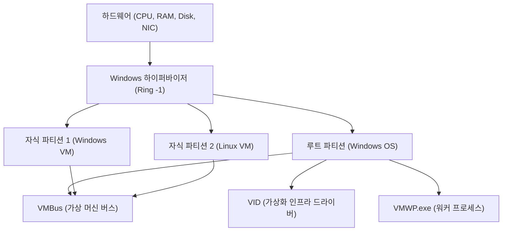

## 1. 소개: Windows에서의 가상화 진화

Windows 플랫폼에서의 가상화 기술은 최근 수십 년 동안 극적인 진화를 이루었습니다. 과거에는 서드파티 Type 2 하이퍼바이저(VMware Workstation이나 VirtualBox 등)가 주류였으나, Microsoft가 Windows Server 2008에서 'Hyper-V'를 도입한 이후 Type 1 하이퍼바이저가 데스크톱 OS인 Windows 10/11에도 내장되기 시작했습니다.

그리고 최근 개발자들 사이에서 가장 주목받고 있는 것이 'WSL2 (Windows Subsystem for Linux 2)'입니다. WSL1이 시스템 호출 변환(Translation)에 의존했던 반면, WSL2는 Hyper-V 기술을 응용한 '경량 유틸리티 VM (Lightweight Utility VM)'을 채택하여 완벽한 Linux 호환성과 비약적인 성능 향상을 실현했습니다.

본 기사에서는 이 두 가지 강력한 가상화 기술, 즉 모든 기능을 갖춘 'Hyper-V'와 개발자 경험에 특화된 'WSL2'의 아키텍처, 성능(CPU, 메모리, 디스크 I/O), 네트워크 구성, 그리고 최적의 사용 사례에 대해 깊이 있는 기술적 세부 사항과 함께 철저하게 비교 및 해설합니다.

---

## 2. 하이퍼바이저의 기초 이론과 아키텍처 비교

가상화 기술을 이해하는 데 있어 필수적인 것이 하이퍼바이저(가상 머신 모니터: VMM)의 유형 분류입니다.

### 2.1. Type 1과 Type 2 하이퍼바이저의 차이

하이퍼바이저는 하드웨어에 대한 접근을 추상화하여 여러 OS(게스트 OS)를 단일 물리적 머신 위에서 동시에 실행하게 해주는 소프트웨어 계층입니다.

*   **Type 1(베어메탈형)**: 하드웨어 위에서 직접 실행됩니다. 호스트 OS라는 개념이 존재하지 않으며(엄밀히 말해 특권을 가진 관리 OS가 존재할 수 있습니다), 오버헤드가 매우 낮고 높은 성능과 보안을 제공합니다. 예: Hyper-V, VMware ESXi, Xen.
*   **Type 2(호스트형)**: 호스트 OS(Windows나 macOS 등) 위에서 애플리케이션으로 실행됩니다. 모든 하드웨어 접근은 호스트 OS를 거치기 때문에 오버헤드가 큽니다. 예: VMware Workstation, Oracle VirtualBox.

Windows의 Hyper-V는 순수한 **Type 1 하이퍼바이저**입니다. Hyper-V를 활성화하면, 사실 평소 사용자가 조작하는 Windows OS 자체도 '루트 파티션(Root Partition)'이라 불리는 특수한 가상 머신 안에서 동작하게 됩니다.

### 2.2. Hyper-V 아키텍처 상세

Hyper-V 아키텍처는 마이크로커널 설계를 채택하고 있으며, 파티션(Partition)이라는 논리적 분리 단위를 기반으로 합니다.



*   **Windows 하이퍼바이저**: CPU의 가장 높은 특권 수준(Ring -1 또는 VMX Root Mode)에서 동작하며, 메모리 할당과 CPU 스케줄링만을 담당합니다. 디바이스 드라이버는 포함되어 있지 않습니다.
*   **루트 파티션**: 호스트 Windows OS가 동작하는 파티션입니다. 모든 디바이스 드라이버를 가지며, 하드웨어를 직접 제어합니다. 또한, 자식 파티션의 관리 기능(WMI 프로바이더나 VMWP.exe 등)을 제공합니다.
*   **자식 파티션**: 게스트 OS가 동작하는 파티션입니다. 하드웨어에 대한 직접 접근은 허용되지 않으며, 'VMBus'라는 논리적 메모리 공유 버스를 통해 루트 파티션으로 I/O 요청을 전송(Synthetic I/O)합니다.

### 2.3. WSL2와 Lightweight Utility VM의 작동 원리

WSL2는 Hyper-V와 동일한 Type 1 하이퍼바이저 기반 기술을 사용하지만, 모든 기능을 갖춘 Hyper-V 가상 머신과는 다른 '가상 머신 플랫폼(Virtual Machine Platform: VMP)'이라는 서브셋 기능을 이용합니다.

WSL2에 채택된 '경량 유틸리티 VM (Lightweight Utility VM)'은 기존 VM이 갖는 레거시 하드웨어 에뮬레이션(가상 BIOS나 가상 마더보드 등)을 완전히 배제했습니다.

```mermaid
graph TD
    A["Windows 호스트 OS (유저 스페이스)"]
    B["NTFS 파일 시스템"]
    C["9P 프로토콜 서버 (Plan 9)"]
    D["경량 유틸리티 VM (Linux 커널)"]
    E["ext4.vhdx (가상 디스크)"]
    F["Linux 유저 스페이스 (WSL2 배포판)"]

    A --> C
    C <-->| "크로스 OS 파일 공유" | D
    D --> E
    D --> F
```

WSL2의 가장 큰 특징은 **빠른 시작 속도**와 **호스트 OS와의 매끄러운 통합**입니다. 수 초 내에 Linux 커널이 부팅되며, Windows 측의 파일 시스템(NTFS)에는 Plan 9의 `9P` 네트워크 파일 시스템 프로토콜을 통해 접근합니다.

---

## 3. 성능 철저 분석: 컴퓨팅 리소스와 I/O

가상 머신의 성능은 CPU, 메모리, 그리고 디스크 I/O의 각 구성 요소에서 발생하는 오버헤드의 총합으로 나타납니다.

### 3.1. CPU와 컨텍스트 스위치 오버헤드

Hyper-V와 WSL2는 모두 하드웨어 지원 가상화(Intel VT-x / AMD-V)를 사용합니다. CPU 명령어는 기본적으로 네이티브 속도로 실행되지만, 특권 명령어를 실행하거나 I/O를 처리할 때는 'VM Exit'라 불리는 인터럽트가 발생하여 하이퍼바이저로 컨텍스트 스위치가 일어납니다.

이때의 CPU 오버헤드 $T_{overhead}$는 다음과 같은 수학적 모델로 표현할 수 있습니다.

$$ T_{overhead} = \sum_{i=1}^{N} (t_{vm\_exit} + t_{hypercall\_process} + t_{vm\_entry}) $$

여기서:
*   $N$: 단위 시간당 VM Exit 발생 횟수
*   $t_{vm\_exit}$: 게스트에서 하이퍼바이저로의 전환 시간
*   $t_{hypercall\_process}$: VMBus를 통한 I/O 처리 및 인터럽트 처리 시간
*   $t_{vm\_entry}$: 하이퍼바이저에서 게스트로의 복귀 시간

WSL2는 레거시 에뮬레이션이 없기 때문에 $t_{hypercall\_process}$가 극히 작게 최적화되어 있습니다. 따라서 순수한 CPU 연산(예: 커널 컴파일이나 머신 러닝 모델 추론)에서는 베어메탈 환경과 비교해도 수 퍼센트 이내의 성능 저하에 그칩니다.

### 3.2. 메모리 할당 메커니즘

메모리 관리 기법에 있어서 두 기술은 명확한 설계 철학의 차이를 보입니다.

*   **Hyper-V (동적 메모리)**: 게스트 VM의 메모리 수요에 따라 루트 파티션이 동적으로 메모리를 할당하고 회수합니다. 하지만 게스트 OS 내에서 페이지 캐시로 확보된 메모리는 시스템에 여유가 없는 이상 쉽게 해제되지 않는 경향이 있습니다.
*   **WSL2 (동적 메모리 회수)**: WSL2는 독자적인 방식을 가지고 있어, Linux VM 내에서 불필요해진 메모리(캐시 포함)를 정기적으로 Windows 호스트에 반환(Reclaim)합니다. 초기 WSL2에서는 Linux의 페이지 캐시가 Windows의 메모리를 모두 소진하는 문제(Vmmem 프로세스 비대화)가 있었으나, 현재는 커널 패치를 통해 개선되었습니다.

### 3.3. 디스크 I/O 특성 (VHDX vs ext4.vhdx)

가상 머신 성능에서 가장 병목 현상이 발생하기 쉬운 곳이 디스크 I/O입니다.

I/O 레이턴시 $L_{total}$은 다음과 같이 계산됩니다.

$$ L_{total} = L_{guest\_fs} + L_{vmbus} + L_{host\_fs} + L_{physical\_disk} $$

**Hyper-V의 경우**:
일반적인 Hyper-V 게스트는 `VHDX` 포맷의 가상 디스크를 사용합니다. 게스트 OS 내의 파일 시스템(ext4 또는 NTFS)에서 발생한 I/O 요청은 VMBus의 블록 디바이스 스토리지 드라이버(storvsc)를 통과하여 Windows 측 NTFS 상의 VHDX 파일에 대한 접근으로 처리됩니다.

**WSL2의 경우**:
WSL2의 Linux 배포판은 전용 `ext4.vhdx` 파일 내에 구축된 네이티브 ext4 파일 시스템 위에서 동작합니다. Linux 내에서의 파일 조작(`~` 디렉터리 등)은 위에서 언급한 Hyper-V와 동등한 네이티브 성능을 발휘합니다.
하지만, **WSL2의 Linux에서 Windows 측의 파일(`/mnt/c/` 등)에 접근할 경우**, 혹은 그 반대의 경우, 처리 방식이 크게 달라집니다. 이러한 크로스 OS 접근에는 `9P (Plan 9 File System Protocol)`가 사용됩니다.

$$ L_{cross\_os} = L_{9p\_client} + L_{socket\_transfer} + L_{9p\_server} + L_{ntfs} $$

이 9P 프로토콜을 경유한 접근은 직렬화(Serialize) 처리의 오버헤드가 커서, 작은 파일을 대량으로 읽고 쓰는 용도(예: Windows 측 디렉터리에 위치한 Node.js 프로젝트에서의 `npm install`이나 Git 조작)에서는 성능이 현저히 떨어집니다(때로는 10배 이상의 지연 발생).
그러므로, **WSL2를 사용할 때는 반드시 프로젝트 파일을 Linux의 네이티브 파일 시스템(`~/` 산하)에 배치하는 것이 철칙**입니다.

---

## 4. 네트워크 구조: NAT, Default Switch, Bridged

네트워크 기능의 유연성은 Hyper-V와 WSL2의 큰 차이 중 하나입니다.

### 4.1. WSL2의 네트워크 (NAT 기반)

WSL2의 네트워크는 기본적으로 Hyper-V의 가상 스위치 기술을 사용한 'NAT (Network Address Translation)' 구성으로 되어 있습니다.
Linux VM에는 Windows 호스트와는 다른 사설 IP 주소(예: `172.20.x.x`)가 자동으로 할당됩니다. Windows 호스트에서는 `localhost`를 통해 WSL2 내에서 실행된 서비스(포트)로 포워딩되는 구조가 내장되어 있어, 개발자는 네트워크를 의식하지 않고도 웹 서버 등을 테스트할 수 있습니다.

최근 WSL2에는 'Mirrored 모드'라는 새로운 네트워크 모드가 프리뷰 버전으로 도입되었습니다. 이를 통해 IPv6 지원 및 VPN 연결 호환성이 향상되었습니다(`.wslconfig`에서 설정 가능).

### 4.2. Hyper-V의 가상 스위치 (Virtual Switch)

Hyper-V는 엔터프라이즈 수준의 고도화된 네트워크 구축이 가능합니다. '가상 스위치 관리자'를 통해 주로 세 가지 모드를 제공합니다.

1.  **외부 (External)**: 호스트 머신의 물리적 NIC를 가상 스위치에 바인딩하여, 게스트 VM을 물리적 네트워크에 직접 참여시킵니다(브리지 연결). VM은 DHCP 서버로부터 물리 네트워크와 동일한 서브넷의 IP를 얻습니다.
2.  **내부 (Internal)**: 호스트 OS와 VM 간, 그리고 VM 간의 통신만을 허용합니다. 외부 네트워크로 직접 나갈 수는 없습니다.
3.  **프라이빗 (Private)**: VM 간의 통신만을 허용하며, 호스트 OS와의 통신도 차단합니다. 격리된 검증 환경을 구축할 때 사용됩니다.

### 4.3. PowerShell을 이용한 고급 Hyper-V 네트워크 구축

개발이나 테스트 환경에서 VM용으로 사용자 정의된 NAT 네트워크를 구축하고 싶을 경우, PowerShell을 사용하면 세밀한 제어가 가능합니다. 다음은 내부 가상 스위치를 생성하고, 여기에 NAT를 구성하여 VM에 인터넷 액세스를 제공하는 스크립트 예시입니다.

```powershell
# 1. 내부 가상 스위치 생성
$SwitchName = "HyperV-NatSwitch"
New-VMSwitch -SwitchName $SwitchName -SwitchType Internal

# 2. 호스트 측 가상 NIC에 IP 주소 설정 (게이트웨이가 될 IP)
$GatewayIP = "192.168.100.1"
$NetPrefix = 24
$InterfaceAlias = "vEthernet ($SwitchName)"
New-NetIPAddress -IPAddress $GatewayIP -PrefixLength $NetPrefix -InterfaceAlias $InterfaceAlias

# 3. NAT 네트워크 구성
$NatName = "HyperV-NatNetwork"
$NatSubnet = "192.168.100.0/24"
New-NetNat -Name $NatName -InternalIPInterfaceAddressPrefix $NatSubnet

# 확인용 명령어
Get-NetNat
```

이 구성을 통해 지정한 Hyper-V 게스트에 수동으로 `192.168.100.x`의 IP와 게이트웨이 `192.168.100.1`을 설정함으로써, 호스트를 경유해 외부와 통신 가능한 독자적인 NAT 세그먼트를 구축할 수 있습니다.

---

## 5. 사용 사례와 실전 선택 가이드

지금까지의 아키텍처와 성능 차이를 바탕으로, 어떤 상황에서 어떤 기술을 채택해야 할지 정의합니다.

### 5.1. WSL2를 선택해야 하는 시나리오

WSL2는 '개발자의 생산성 향상'에 특화되어 설계되었습니다. 다음과 같은 용도에 최적입니다.

*   **웹 개발 및 클라우드 네이티브 개발**: Docker Desktop(WSL2 백엔드)이나 Podman을 사용한 컨테이너 개발.
*   **Linux 전용 도구 사용**: bash, grep, awk, sed 또는 Linux용 GCC나 Clang 컴파일러를 일상적으로 사용하는 경우.
*   **GUI 애플리케이션 (WSLg)**: Linux의 X11/Wayland 애플리케이션을 Windows 데스크톱 위에서 매끄럽게 실행하고 싶은 경우.
*   **머신 러닝 및 AI 개발**: GPU 패스스루 기능(NVIDIA CUDA on WSL)을 이용한 TensorFlow나 PyTorch의 고속 학습.

**주의점**: 커널을 세밀하게 커스터마이즈하고 싶거나, systemd에 강하게 의존하는 복잡한 서비스(현재 systemd는 지원되지만, 기본적으로 비활성화되어 있거나 제한이 있음)를 구축할 경우에는 제약이 따를 수 있습니다.

### 5.2. Hyper-V를 선택해야 하는 시나리오

Hyper-V는 '인프라스트럭처의 가상화와 완전한 격리'를 목적으로 합니다. 다음과 같은 용도에서는 필수가 됩니다.

*   **Windows VM 실행**: 다른 버전의 Windows(Windows Server나 오래된 Windows 10 등)를 테스트 환경으로 실행하는 경우.
*   **중첩 가상화 (Nested Virtualization)**: 가상 머신 안에서 또 다른 가상 머신(Hyper-V나 KVM)을 실행하고 싶은 경우. 인프라 엔지니어의 검증 환경에 필수적입니다.
*   **고급 네트워크 요구사항**: 외부 브리지 연결(동일 LAN 참여), VLAN 태깅, 다중 NIC 할당 등 네트워크 구성을 엄격하게 제어해야 하는 경우.
*   **스냅샷 (체크포인트)**: VM의 특정 시점 상태를 저장하고 언제든 즉시 롤백할 수 있는 기능. 소프트웨어의 파괴적인 테스트나 악성코드 분석 등에 매우 유용합니다.
*   **고정 리소스 할당**: CPU 코어 수나 메모리 양을 엄격하게 고정하여 호스트 OS에 미치는 영향을 최소화하고 싶은 경우.

---

## 6. 수학적 모델을 통한 I/O 처리량 고찰 (부록)

시스템 엔지니어로서 두 기술의 I/O 성능 한계를 파악할 때, 처리량(Throughput) $S$와 블록 크기 $B$의 관계를 이론적으로 이해하는 것은 중요합니다.

데이터 전송의 처리량 $S$는 단위 시간당 데이터 전송량이며, 다음과 같이 모델링됩니다.

$$ S(B) = \frac{B}{L_{setup} + \frac{B}{R_{max}}} $$

*   $B$: 블록 크기 (Bytes)
*   $L_{setup}$: I/O 요청 설정 및 컨텍스트 스위치에 수반되는 고정 레이턴시
*   $R_{max}$: 복사나 디바이스 전송 시 하드웨어의 최대 대역폭

WSL2의 9P 프로토콜을 통한 파일 접근에서는 이 $L_{setup}$이 매우 큽니다(소켓 통신과 프로토콜의 직렬화/역직렬화 때문). 따라서 블록 크기 $B$가 작을 경우(수 KB 정도의 작은 파일에 대한 대량의 읽기/쓰기), 분모에서 $L_{setup}$의 영향이 지배적이게 되어 처리량 $S$는 극적으로 떨어집니다.
반대로 Hyper-V의 VMBus를 경유하는 VHDX 접근에서는 $L_{setup}$이 하드웨어 인터럽트에 가까운 수준까지 최적화되어 있으므로, 작은 크기의 블록에서도 높은 IOPS를 유지할 수 있습니다.

이러한 수학적 현실이 "WSL2에서는 프로젝트 파일을 Windows 측에 두면 안 된다"는 모범 사례의 논리적 근거가 됩니다.

---

## 7. 결론: 공존하는 두 가지 가상화 기술

Hyper-V와 WSL2는 어느 한쪽이 우수하다는 것이 아니라, **'목적이 다른 두 가지 솔루션'**입니다.

*   **WSL2**는 Windows라는 OS의 틀을 깨고, Linux 생태계를 매끄럽고 빠르게 Windows 사용자에게 전달하기 위한 '최고의 통합 도구'입니다. 개발자를 위한 궁극의 CLI 환경이라 해도 과언이 아닙니다.
*   **Hyper-V**는 엔터프라이즈 데이터 센터에서 축적된 강력한 격리성과 관리 기능을 데스크톱으로 가져온 '본격적인 하이퍼바이저'입니다. 네트워크 구축, Windows OS 테스트, 인프라 환경 시뮬레이션에 있어서 타의 추종을 불허합니다.

현대의 Windows 환경에서 이 두 기술은 대등하게 경쟁하는 것이 아니라, 동일한 VM 플랫폼 위에서 아름답게 공존합니다. 목적에 맞게 적재적소에 활용함으로써, Windows는 세계에서 가장 강력하고 유연한 엔지니어링 워크스테이션이 될 것입니다.
