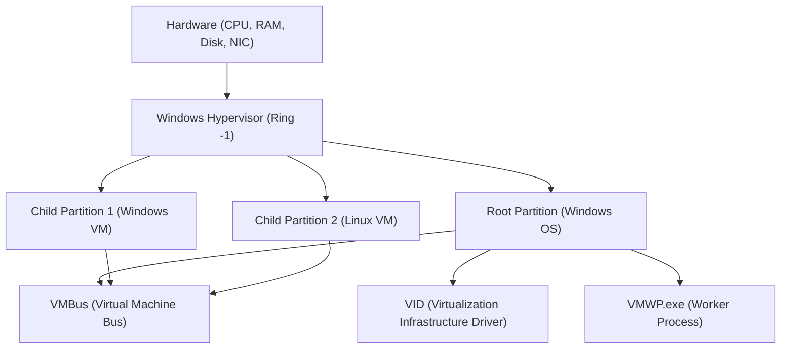

## 1. はじめに：Windowsにおける仮想化の進化

Windowsプラットフォームにおける仮想化技術は、ここ数十年で劇的な進化を遂げました。かつてはサードパーティ製のType 2ハイパーバイザ（VMware WorkstationやVirtualBoxなど）が主流でしたが、MicrosoftがWindows Server 2008で「Hyper-V」を導入して以来、Type 1ハイパーバイザがデスクトップOSであるWindows 10/11にも組み込まれるようになりました。

そして近年、開発者の間で最も注目されているのが「WSL2 (Windows Subsystem for Linux 2)」です。WSL1がシステムコールの変換（トランスレーション）に依存していたのに対し、WSL2はHyper-Vの技術を応用した「軽量ユーティリティVM (Lightweight Utility VM)」を採用し、完全なLinux互換性と飛躍的なパフォーマンス向上を実現しました。

本記事では、これら2つの強力な仮想化技術――フル機能の「Hyper-V」と、開発者体験に特化した「WSL2」――のアーキテクチャ、パフォーマンス（CPU、メモリ、ディスクI/O）、ネットワーク構成、そして最適なユースケースについて、深淵なる技術的詳細とともに徹底的に比較・解説します。

---

## 2. ハイパーバイザの基礎理論とアーキテクチャの比較

仮想化技術を理解する上で欠かせないのが、ハイパーバイザ（仮想マシンモニター: VMM）のタイプ分類です。

### 2.1. Type 1 と Type 2 ハイパーバイザの違い

ハイパーバイザは、ハードウェアへのアクセスを抽象化し、複数のOS（ゲストOS）を単一の物理マシン上で同時に実行させるソフトウェア層です。

*   **Type 1（ベアメタル型）**: ハードウェア上で直接実行されます。ホストOSという概念が存在せず（厳密には特権を持つ管理OSが存在する場合があります）、極めてオーバーヘッドが低く、高いパフォーマンスとセキュリティを提供します。例：Hyper-V, VMware ESXi, Xen。
*   **Type 2（ホスト型）**: ホストOS（WindowsやmacOSなど）上のアプリケーションとして実行されます。すべてのハードウェアアクセスはホストOSを経由するため、オーバーヘッドが大きくなります。例：VMware Workstation, Oracle VirtualBox。

WindowsのHyper-Vは、純粋な **Type 1ハイパーバイザ** です。Hyper-Vを有効にすると、実は普段ユーザーが操作しているWindows OS自体も、「ルートパーティション (Root Partition)」と呼ばれる特殊な仮想マシンの中で動作するようになります。

### 2.2. Hyper-Vのアーキテクチャ詳細

Hyper-Vのアーキテクチャは、マイクロカーネル設計を採用しており、パーティション（Partition）と呼ばれる論理的な分離単位に基づいています。



*   **Windows Hypervisor**: CPUの最も特権レベルの高い状態（Ring -1 または VMX Root Mode）で動作し、メモリの割り当てとCPUのスケジューリングのみを担当します。デバイスドライバは含まれていません。
*   **Root Partition**: ホストWindows OSが動作するパーティションです。すべてのデバイスドライバを持ち、ハードウェアを直接制御します。また、子パーティションの管理機能（WMIプロバイダやVMWP.exeなど）を提供します。
*   **Child Partition**: ゲストOSが動作するパーティションです。ハードウェアへの直接アクセスは許可されておらず、「VMBus」と呼ばれる論理的なメモリ共有バスを介して、ルートパーティションにI/Oリクエストを送信（Synthetic I/O）します。

### 2.3. WSL2とLightweight Utility VMの仕組み

WSL2は、Hyper-Vと同じType 1ハイパーバイザの基盤技術を利用していますが、フル機能のHyper-V仮想マシンとは異なる「仮想マシンプラットフォーム (Virtual Machine Platform: VMP)」と呼ばれるサブセット機能を利用しています。

WSL2で採用されている「軽量ユーティリティVM (Lightweight Utility VM)」は、従来のVMが持つレガシーハードウェアのエミュレーション（仮想BIOSや仮想マザーボードなど）を一切排除しています。

```mermaid
graph TD
    A["Windows Host OS (User Space)"]
    B["NTFS File System"]
    C["9P Protocol Server (Plan 9)"]
    D["Lightweight Utility VM (Linux Kernel)"]
    E["ext4.vhdx (Virtual Disk)"]
    F["Linux User Space (WSL2 Distributions)"]

    A --> C
    C <-->| "Cross-OS File Sharing" | D
    D --> E
    D --> F
```

WSL2の最大の特徴は、**起動の速さ**と**ホストOSとのシームレスな統合**です。数秒未満でLinuxカーネルが起動し、Windows側のファイルシステム（NTFS）にはPlan 9の `9P` ネットワークファイルシステムプロトコルを介してアクセスします。

---

## 3. パフォーマンスの徹底分析：計算資源とI/O

仮想マシンのパフォーマンスは、CPU、メモリ、およびディスクI/Oの各コンポーネントにおけるオーバーヘッドの総和として表されます。

### 3.1. CPUとコンテキストスイッチ・オーバーヘッド

Hyper-VおよびWSL2はともにハードウェア支援仮想化（Intel VT-x / AMD-V）を使用しています。CPU命令は基本的にネイティブ速度で実行されますが、特権命令の実行時やI/O処理時には「VM Exit」と呼ばれる割り込みが発生し、ハイパーバイザへコンテキストスイッチが行われます。

このときのCPUオーバーヘッド $T_{overhead}$ は、次のような数学的モデルで表現できます。

$$ T_{overhead} = \sum_{i=1}^{N} (t_{vm\_exit} + t_{hypercall\_process} + t_{vm\_entry}) $$

ここで：
*   $N$: 単位時間あたりのVM Exit発生回数
*   $t_{vm\_exit}$: ゲストからハイパーバイザへの移行時間
*   $t_{hypercall\_process}$: VMBusを介したI/O処理や割り込みの処理時間
*   $t_{vm\_entry}$: ハイパーバイザからゲストへの復帰時間

WSL2は、レガシーエミュレーションがないため $t_{hypercall\_process}$ が極めて小さく最適化されています。そのため、純粋なCPU演算（例えばカーネルのコンパイルや機械学習モデルの推論）においては、ベアメタル環境と比較しても数％以内の性能劣化に収まります。

### 3.2. メモリ割り当てのメカニズム

メモリの管理手法においては、両者に明確な設計思想の違いがあります。

*   **Hyper-V (Dynamic Memory)**: ゲストVMのメモリ需要に応じて、ルートパーティションが動的にメモリを割り当て・回収します。しかし、ゲストOS内でページキャッシュとして確保されたメモリは、システムが逼迫していない限り解放されにくい傾向があります。
*   **WSL2 (動的メモリ回収)**: WSL2は独自の仕組みを持ち、LinuxVM内で不要になったメモリ（キャッシュを含む）を、定期的にWindowsホストに返却（Reclaim）します。初期のWSL2ではLinuxのページキャッシュがWindowsのメモリを食い潰す問題（Vmmemプロセスの肥大化）がありましたが、現在はカーネルパッチにより改善されています。

### 3.3. ディスクI/Oの特性（VHDX vs ext4.vhdx）

仮想マシンのパフォーマンスにおいて最もボトルネックになりやすいのがディスクI/Oです。

I/Oのレイテンシ $L_{total}$ は以下のように計算されます。

$$ L_{total} = L_{guest\_fs} + L_{vmbus} + L_{host\_fs} + L_{physical\_disk} $$

**Hyper-Vの場合**:
一般的なHyper-Vゲストは `VHDX` フォーマットの仮想ディスクを使用します。ゲストOS内のファイルシステム（ext4やNTFS）から発行されたI/O要求は、VMBusのブロックデバイスストレージドライバ（storvsc）を通過し、Windows側のNTFS上でVHDXファイルへのアクセスとして処理されます。

**WSL2の場合**:
WSL2のLinuxディストリビューションは、専用の `ext4.vhdx` ファイル内に構築されたネイティブのext4ファイルシステム上で動作します。Linux内でのファイル操作（`~` ディレクトリ内など）は、上記のHyper-Vと同等のネイティブパフォーマンスを発揮します。
しかし、**WSL2のLinuxからWindows側のファイル（`/mnt/c/` など）にアクセスする場合**、またはその逆の場合、処理は大きく異なります。このクロスOSアクセスには `9P (Plan 9 File System Protocol)` が使用されます。

$$ L_{cross\_os} = L_{9p\_client} + L_{socket\_transfer} + L_{9p\_server} + L_{ntfs} $$

この9Pプロトコルを経由したアクセスはシリアライズ処理のオーバーヘッドが大きく、小さなファイルを大量に読み書きする用途（例：Windows側のディレクトリに置かれたNode.jsプロジェクトでの `npm install` やGit操作）では、パフォーマンスが著しく低下（時には10倍以上の遅延）します。
そのため、**WSL2を使用する際は、必ずプロジェクトファイルをLinuxのネイティブファイルシステム（`~/` 配下）に配置することが鉄則**です。

---

## 4. ネットワーク構造：NAT、Default Switch、Bridged

ネットワーク機能の柔軟性は、Hyper-VとWSL2の大きな違いの一つです。

### 4.1. WSL2のネットワーク (NATベース)

WSL2のネットワークは、デフォルトでHyper-Vの仮想スイッチテクノロジーを使用した「NAT（Network Address Translation）」構成になっています。
Linux VMには、Windowsホストとは異なるプライベートIPアドレス（例：`172.20.x.x`）が自動的に割り当てられます。Windowsホストからは `localhost` でWSL2内で起動したサービス（ポート）にフォワードされる仕組みが組み込まれており、開発者はネットワークを意識せずにWebサーバーなどをテストできます。

近年、WSL2には「Mirrored モード」という新しいネットワークモードがプレビュー版で導入されました。これにより、IPv6のサポートやVPN接続の互換性向上が図られています（`.wslconfig` にて設定可能）。

### 4.2. Hyper-Vの仮想スイッチ (Virtual Switch)

Hyper-Vは、エンタープライズレベルの高度なネットワーク構築が可能です。「仮想スイッチマネージャー」を通じて、主に3つのモードを提供します。

1.  **外部 (External)**: ホストマシンの物理NICを仮想スイッチにバインドし、ゲストVMを物理ネットワーク上に直接参加させます（ブリッジ接続）。VMはDHCPサーバーから物理ネットワークと同じサブネットのIPを取得します。
2.  **内部 (Internal)**: ホストOSとVM間、およびVM同士の通信のみを許可します。外部ネットワークには直接出られません。
3.  **プライベート (Private)**: VM同士の通信のみを許可し、ホストOSとの通信も遮断します。隔離された検証環境の構築に使用されます。

### 4.3. PowerShellによる高度なHyper-Vネットワーク構築

開発やテスト環境において、VM用にカスタマイズされたNATネットワークを構築したい場合、PowerShellを使用することで詳細な制御が可能です。以下は、内部仮想スイッチを作成し、そこにNATを構成してVMにインターネットアクセスを提供するスクリプトの例です。

```powershell
# 1. 内部仮想スイッチの作成
$SwitchName = "HyperV-NatSwitch"
New-VMSwitch -SwitchName $SwitchName -SwitchType Internal

# 2. ホスト側の仮想NICにIPアドレスを設定 (ゲートウェイとなるIP)
$GatewayIP = "192.168.100.1"
$NetPrefix = 24
$InterfaceAlias = "vEthernet ($SwitchName)"
New-NetIPAddress -IPAddress $GatewayIP -PrefixLength $NetPrefix -InterfaceAlias $InterfaceAlias

# 3. NATネットワークの構成
$NatName = "HyperV-NatNetwork"
$NatSubnet = "192.168.100.0/24"
New-NetNat -Name $NatName -InternalIPInterfaceAddressPrefix $NatSubnet

# 確認用コマンド
Get-NetNat
```

この構成により、指定したHyper-Vゲストに手動で `192.168.100.x` のIPと、ゲートウェイ `192.168.100.1` を設定することで、ホストを経由して外部と通信可能な独自のNATセグメントを構築できます。

---

## 5. ユースケースと実践的な選択ガイド

これまでのアーキテクチャやパフォーマンスの違いを踏まえ、どのような状況でどちらの技術を採用すべきかを定義します。

### 5.1. WSL2を選択すべきシナリオ

WSL2は、「開発者の生産性向上」に特化して設計されています。以下のような用途に最適です。

*   **Web開発およびクラウドネイティブ開発**: Docker Desktop（WSL2バックエンド）やPodmanを使用したコンテナ開発。
*   **Linux専用ツールの利用**: bash、grep、awk、sed、またはLinux向けのGCCやClangコンパイラを日常的に使用する場合。
*   **GUIアプリケーション (WSLg)**: LinuxのX11/WaylandアプリケーションをWindowsデスクトップ上でシームレスに動かしたい場合。
*   **機械学習とAI開発**: GPUパススルー機能（NVIDIA CUDA on WSL）を利用したTensorFlowやPyTorchの高速な学習。

**注意点**: カーネルを細かくカスタマイズしたい場合や、systemdに強く依存する複雑なサービス（現在systemdはサポートされていますが、デフォルトでは無効または制限あり）を構築する場合は制約を受けることがあります。

### 5.2. Hyper-Vを選択すべきシナリオ

Hyper-Vは、「インフラストラクチャの仮想化と完全な分離」を目的としています。以下のような用途に必須となります。

*   **Windows VMの実行**: 異なるバージョンのWindows（Windows Serverや古いWindows 10など）をテスト環境として実行する場合。
*   **ネステッド・バーチャライゼーション（入れ子仮想化）**: 仮想マシンの中でさらに仮想マシン（Hyper-VやKVM）を実行したい場合。インフラエンジニアの検証環境に不可欠です。
*   **高度なネットワーク要件**: 外部ブリッジ接続（同一LANへの参加）、VLANタギング、複数NICの割り当てなど、ネットワーク構成を厳密にコントロールする必要がある場合。
*   **スナップショット（チェックポイント）**: VMの特定時点の状態を保存し、いつでも瞬時にロールバックできる機能。ソフトウェアの破壊的なテストやマルウェア解析などに極めて有用です。
*   **固定のリソース割り当て**: CPUコア数やメモリ量を厳格に固定し、ホストOSへの影響を最小限に抑えたい場合。

---

## 6. 数理モデルによるI/Oスループットの考察 (付録)

システムエンジニアとして両者のI/O性能限界を見極める際、スループット $S$ とブロックサイズ $B$ の関係を理論的に把握することは重要です。

データ転送のスループット $S$ は、単位時間あたりのデータ転送量であり、次のようにモデル化されます。

$$ S(B) = \frac{B}{L_{setup} + \frac{B}{R_{max}}} $$

*   $B$: ブロックサイズ (Bytes)
*   $L_{setup}$: I/O要求のセットアップおよびコンテキストスイッチに伴う固定レイテンシ
*   $R_{max}$: コピーやデバイス転送におけるハードウェアの最大帯域幅

WSL2の9Pプロトコルを介したファイルアクセスでは、この $L_{setup}$ が非常に大きくなります（ソケット通信とプロトコルのシリアライズ/デシリアライズのため）。したがって、ブロックサイズ $B$ が小さい（数KB程度の細かいファイルの大量読み書き）場合、分母における $L_{setup}$ の影響が支配的となり、スループット $S$ は劇的に低下します。
逆に、Hyper-VのVMBusを経由するVHDXアクセスでは $L_{setup}$ がハードウェア割り込みに近いレベルまで最適化されているため、小規模ブロックでも高いIOPSを維持できます。

この数学的現実が、「WSL2ではプロジェクトファイルをWindows側に置いてはいけない」というベストプラクティスの論理的根拠となっています。

---

## 7. まとめ：共存する2つの仮想化技術

Hyper-VとWSL2は、どちらか一方が優れているというものではなく、**「目的が異なる2つのソリューション」**です。

*   **WSL2** は、WindowsというOSの殻を破り、Linuxのエコシステムをシームレスかつ高速にWindowsユーザーの手に届けるための「最良の統合ツール」です。開発者のための究極のCLI環境と言っても過言ではありません。
*   **Hyper-V** は、エンタープライズのデータセンターで培われた強固な分離性と管理能力をデスクトップに持ち込む「本格的なハイパーバイザ」です。ネットワークの構築、Windows OSのテスト、インフラ環境のシミュレーションにおいて右に出るものはありません。

現代のWindows環境では、これら2つの技術は互角に競合するのではなく、同じVMプラットフォーム上で美しく共存します。用途に応じて適材適所で使い分けることで、Windowsは世界で最も強力で柔軟なエンジニアリング・ワークステーションとなるでしょう。
