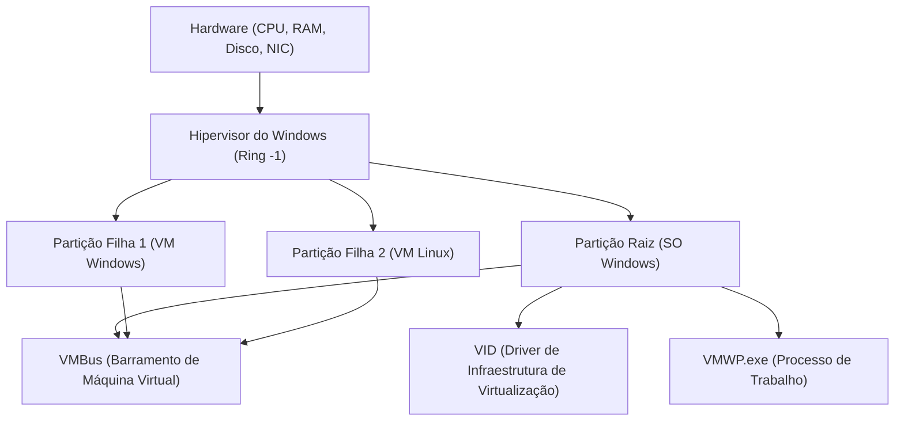

## 1. Introdução: A evolução da virtualização no Windows

A tecnologia de virtualização na plataforma Windows passou por uma evolução dramática nas últimas décadas. No passado, hipervisores Type 2 de terceiros (como VMware Workstation e VirtualBox) eram a norma, mas desde que a Microsoft introduziu o "Hyper-V" no Windows Server 2008, hipervisores Type 1 também foram incorporados em SOs desktop como o Windows 10/11.

E nos últimos anos, o que mais tem chamado a atenção dos desenvolvedores é o "WSL2 (Windows Subsystem for Linux 2)". Enquanto o WSL1 dependia da conversão de chamadas de sistema (tradução), o WSL2 adota uma "Lightweight Utility VM" (Máquina Virtual Utilitária Leve) que aplica a tecnologia do Hyper-V, alcançando total compatibilidade com o Linux e uma melhoria dramática de desempenho.

Neste artigo, vamos comparar e explicar minuciosamente essas duas poderosas tecnologias de virtualização — o "Hyper-V" completo e o "WSL2" focado na experiência do desenvolvedor — abordando suas arquiteturas, desempenho (CPU, memória, E/S de disco), configuração de rede e os melhores casos de uso, juntamente com profundos detalhes técnicos.

---

## 2. Teoria básica dos hipervisores e comparação de arquiteturas

Ao entender a tecnologia de virtualização, classificar os tipos de hipervisores (Monitores de Máquina Virtual: VMM) é essencial.

### 2.1. Diferenças entre hipervisores Type 1 e Type 2

Um hipervisor é uma camada de software que abstrai o acesso ao hardware e permite que vários sistemas operacionais (SOs convidados) sejam executados simultaneamente em uma única máquina física.

*   **Type 1 (Bare-metal)**: Executado diretamente no hardware. Não existe o conceito de um SO host (embora, estritamente falando, possa existir um SO de gerenciamento com privilégios). Tem sobrecarga extremamente baixa e oferece alto desempenho e segurança. Exemplos: Hyper-V, VMware ESXi, Xen.
*   **Type 2 (Hospedado)**: Executado como um aplicativo no SO host (como Windows ou macOS). Como todo o acesso ao hardware passa pelo SO host, a sobrecarga é maior. Exemplos: VMware Workstation, Oracle VirtualBox.

O Hyper-V do Windows é um puro **hipervisor Type 1**. Quando o Hyper-V é ativado, na verdade, o próprio SO Windows que o usuário opera normalmente passa a ser executado dentro de uma máquina virtual especial chamada "Partição Raiz (Root Partition)".

### 2.2. Detalhes da arquitetura do Hyper-V

A arquitetura do Hyper-V adota um design de microkernel e baseia-se em unidades de separação lógicas chamadas Partiçõoes (Partitions).



*   **Hipervisor do Windows (Windows Hypervisor)**: Opera no estado de nível de privilégio mais alto da CPU (Ring -1 ou VMX Root Mode) e é responsável apenas pela alocação de memória e escalonamento da CPU. Não inclui drivers de dispositivo.
*   **Partição Raiz (Root Partition)**: A partição onde o SO Windows host é executado. Ela possui todos os drivers de dispositivo e controla o hardware diretamente. Também fornece funções de gerenciamento para as partições filhas (como provedores WMI e VMWP.exe).
*   **Partição Filha (Child Partition)**: A partição onde o SO convidado é executado. O acesso direto ao hardware não é permitido e as solicitações de E/S são enviadas à partição raiz (I/O Sintético) por meio de um barramento de compartilhamento de memória lógico chamado "VMBus".

### 2.3. O mecanismo do WSL2 e da Lightweight Utility VM

O WSL2 utiliza a mesma tecnologia base de hipervisor Type 1 que o Hyper-V, mas utiliza um subconjunto de recursos chamado "Plataforma de Máquina Virtual (Virtual Machine Platform: VMP)", que é diferente de uma máquina virtual Hyper-V completa.

A "Lightweight Utility VM" (Máquina Virtual Utilitária Leve) adotada no WSL2 elimina completamente a emulação de hardware legado (como BIOS virtual ou placa-mãe virtual) encontrada em VMs tradicionais.

```mermaid
graph TD
    A["SO Host Windows (Espaço do Usuário)"]
    B["Sistema de Arquivos NTFS"]
    C["Servidor de Protocolo 9P (Plan 9)"]
    D["Lightweight Utility VM (Kernel Linux)"]
    E["ext4.vhdx (Disco Virtual)"]
    F["Espaço do Usuário Linux (Distribuições WSL2)"]

    A --> C
    C <-->| "Compartilhamento de Arquivos Cross-OS" | D
    D --> E
    D --> F
```

A maior característica do WSL2 é a **velocidade de inicialização** e a **integração perfeita com o SO host**. O kernel do Linux é inicializado em menos de alguns segundos e o sistema de arquivos do lado do Windows (NTFS) é acessado por meio do protocolo de sistema de arquivos de rede `9P` do Plan 9.

---

## 3. Análise detalhada de desempenho: Recursos computacionais e E/S

O desempenho da máquina virtual é expresso como a soma das sobrecargas em cada componente de CPU, memória e E/S de disco.

### 3.1. Sobrecarga de CPU e troca de contexto

Tanto o Hyper-V quanto o WSL2 usam virtualização assistida por hardware (Intel VT-x / AMD-V). As instruções da CPU são executadas basicamente na velocidade nativa, mas ao executar instruções privilegiadas ou processar E/S, ocorre uma interrupção chamada "VM Exit", realizando uma troca de contexto para o hipervisor.

A sobrecarga de CPU neste momento, $T_{overhead}$, pode ser expressa pelo seguinte modelo matemático:

$$ T_{overhead} = \sum_{i=1}^{N} (t_{vm\_exit} + t_{hypercall\_process} + t_{vm\_entry}) $$

Onde:
*   $N$: Número de ocorrências de VM Exit por unidade de tempo
*   $t_{vm\_exit}$: Tempo de transição do convidado para o hipervisor
*   $t_{hypercall\_process}$: Tempo de processamento de E/S ou interrupções via VMBus
*   $t_{vm\_entry}$: Tempo de retorno do hipervisor para o convidado

Como o WSL2 não possui emulação de legado, $t_{hypercall\_process}$ é otimizado para ser extremamente pequeno. Portanto, em operações de CPU puras (como compilação de kernel ou inferência de modelos de aprendizado de máquina), a degradação de desempenho fica dentro de alguns por cento em comparação com um ambiente bare-metal.

### 3.2. Mecanismos de alocação de memória

Existem diferenças claras nas filosofias de design entre os dois na abordagem de gerenciamento de memória.

*   **Hyper-V (Memória Dinâmica)**: A partição raiz aloca e recupera dinamicamente a memória de acordo com a demanda de memória da VM convidada. No entanto, a memória reservada como cache de página dentro do SO convidado tende a não ser liberada a menos que o sistema esteja sob pressão.
*   **WSL2 (Recuperação dinâmica de memória)**: O WSL2 tem seu próprio mecanismo e retorna periodicamente (Reclaim) a memória que não é mais necessária na VM Linux (incluindo o cache) para o host Windows. Nos primórdios do WSL2, havia o problema do cache de páginas do Linux consumir a memória do Windows (inchaço do processo Vmmem), mas isso foi melhorado agora com patches de kernel.

### 3.3. Características de E/S de disco (VHDX vs ext4.vhdx)

A E/S de disco é o gargalo mais provável no desempenho de uma máquina virtual.

A latência de E/S, $L_{total}$, é calculada da seguinte forma:

$$ L_{total} = L_{guest\_fs} + L_{vmbus} + L_{host\_fs} + L_{physical\_disk} $$

**No caso do Hyper-V**:
Convidados gerais do Hyper-V usam discos virtuais no formato `VHDX`. As solicitações de E/S emitidas pelo sistema de arquivos (ext4 ou NTFS) dentro do SO convidado passam pelo driver de armazenamento de dispositivo de bloco (storvsc) do VMBus e são processadas como acessos ao arquivo VHDX no NTFS do lado do Windows.

**No caso do WSL2**:
As distribuições Linux no WSL2 operam em um sistema de arquivos ext4 nativo construído dentro de um arquivo `ext4.vhdx` dedicado. Operações de arquivo dentro do Linux (como dentro do diretório `~`) apresentam desempenho nativo equivalente ao do Hyper-V acima.
No entanto, o processo é muito diferente **quando o Linux no WSL2 acessa arquivos no lado do Windows (como `/mnt/c/`)**, ou vice-versa. Para esse acesso cross-OS, o `9P (Plan 9 File System Protocol)` é usado.

$$ L_{cross\_os} = L_{9p\_client} + L_{socket\_transfer} + L_{9p\_server} + L_{ntfs} $$

O acesso através deste protocolo 9P possui uma grande sobrecarga de processamento de serialização e, para o propósito de ler e escrever um grande número de arquivos pequenos (por exemplo: um `npm install` ou operações do Git em um projeto Node.js localizado em um diretório no lado do Windows), o desempenho diminui significativamente (às vezes mais de 10 vezes mais lento).
Portanto, **ao usar o WSL2, é uma regra de ouro sempre colocar os arquivos de projeto no sistema de arquivos nativo do Linux (sob `~/`)**.

---

## 4. Estrutura de rede: NAT, Default Switch e Bridged

A flexibilidade de rede é uma das maiores diferenças entre o Hyper-V e o WSL2.

### 4.1. Rede do WSL2 (Baseada em NAT)

Por padrão, a rede do WSL2 usa uma configuração "NAT (Network Address Translation)" usando a tecnologia de comutador virtual (Virtual Switch) do Hyper-V.
A VM Linux recebe automaticamente um endereço IP privado diferente do host Windows (por exemplo: `172.20.x.x`). Está integrado um mecanismo onde o host Windows usa `localhost` para encaminhar para serviços (portas) iniciados no WSL2, permitindo que os desenvolvedores testem servidores web e outros sem precisar estar cientes da rede.

Recentemente, um novo modo de rede chamado "Mirrored mode" (Modo espelhado) foi introduzido em versões de visualização do WSL2. Isso visa melhorar o suporte IPv6 e a compatibilidade com conexões VPN (pode ser configurado em `.wslconfig`).

### 4.2. Comutador Virtual do Hyper-V (Virtual Switch)

O Hyper-V permite a construção de redes avançadas de nível corporativo. Através do "Gerenciador de Comutador Virtual", ele fornece principalmente 3 modos.

1.  **Externo (External)**: Vincula a NIC física da máquina host ao comutador virtual e permite que as VMs convidadas participem diretamente da rede física (conexão em ponte). A VM obtém um IP da mesma sub-rede da rede física através de um servidor DHCP.
2.  **Interno (Internal)**: Permite a comunicação apenas entre o SO host e a VM, e entre as VMs. Não pode acessar diretamente redes externas.
3.  **Privado (Private)**: Permite a comunicação apenas entre as VMs e bloqueia a comunicação com o SO host. Usado para construir ambientes de teste isolados.

### 4.3. Construção avançada de rede Hyper-V com PowerShell

Em ambientes de desenvolvimento ou teste, quando você deseja construir uma rede NAT personalizada para VMs, o PowerShell permite um controle detalhado. Abaixo está um exemplo de script que cria um comutador virtual interno, configura NAT nele e fornece acesso à internet para as VMs.

```powershell
# 1. Criação do comutador virtual interno
$SwitchName = "HyperV-NatSwitch"
New-VMSwitch -SwitchName $SwitchName -SwitchType Internal

# 2. Definir endereço IP na NIC virtual do host (IP que servirá como gateway)
$GatewayIP = "192.168.100.1"
$NetPrefix = 24
$InterfaceAlias = "vEthernet ($SwitchName)"
New-NetIPAddress -IPAddress $GatewayIP -PrefixLength $NetPrefix -InterfaceAlias $InterfaceAlias

# 3. Configuração da rede NAT
$NatName = "HyperV-NatNetwork"
$NatSubnet = "192.168.100.0/24"
New-NetNat -Name $NatName -InternalIPInterfaceAddressPrefix $NatSubnet

# Comando para verificação
Get-NetNat
```

Com esta configuração, ao definir manualmente um IP de `192.168.100.x` e o gateway `192.168.100.1` no convidado Hyper-V especificado, você pode construir um segmento NAT próprio capaz de se comunicar externamente através do host.

---

## 5. Casos de uso e guia prático de seleção

Com base nas diferenças em arquitetura e desempenho discutidas até o momento, vamos definir em quais situações qual tecnologia deve ser adotada.

### 5.1. Cenários onde o WSL2 deve ser selecionado

O WSL2 foi projetado especificamente para "melhorar a produtividade do desenvolvedor". É ideal para os seguintes usos:

*   **Desenvolvimento Web e nativo de nuvem**: Desenvolvimento de contêineres usando Docker Desktop (backend WSL2) ou Podman.
*   **Uso de ferramentas exclusivas do Linux**: Ao usar diariamente bash, grep, awk, sed ou compiladores GCC ou Clang para Linux.
*   **Aplicativos com GUI (WSLg)**: Quando se deseja executar aplicativos Linux X11/Wayland nativamente na área de trabalho do Windows sem problemas.
*   **Aprendizado de Máquina e Desenvolvimento de IA**: Treinamento rápido de TensorFlow ou PyTorch usando a função de repasse de GPU (NVIDIA CUDA on WSL).

**Nota**: Você pode encontrar limitações se quiser personalizar o kernel em detalhes ou construir serviços complexos que dependem fortemente do systemd (o systemd agora é suportado, mas desabilitado ou restrito por padrão).

### 5.2. Cenários onde o Hyper-V deve ser selecionado

O Hyper-V visa "virtualização e isolamento completo da infraestrutura". Ele se torna indispensável para os seguintes casos de uso:

*   **Execução de VMs Windows**: Para executar diferentes versões do Windows (Windows Server, Windows 10 mais antigo, etc.) como um ambiente de teste.
*   **Virtualização aninhada (Nested Virtualization)**: Quando se deseja executar ainda mais máquinas virtuais (Hyper-V ou KVM) dentro de uma máquina virtual. É essencial para ambientes de verificação de engenheiros de infraestrutura.
*   **Requisitos avançados de rede**: Quando se precisa controlar rigorosamente as configurações de rede, como conexões de ponte externa (participação na mesma LAN), marcação de VLAN ou alocação de várias NICs.
*   **Instantâneos (Snapshots/Checkpoints)**: A capacidade de salvar o estado de uma VM em um momento específico e reverter instantaneamente a qualquer momento. Extremamente útil para testes destrutivos de software ou análise de malware.
*   **Alocação de recursos fixos**: Quando se deseja fixar rigorosamente o número de núcleos de CPU e a quantidade de memória para minimizar o impacto no SO host.

---

## 6. Considerações sobre a taxa de transferência (throughput) de E/S por meio de modelos matemáticos (Apêndice)

Como um engenheiro de sistemas, ao avaliar os limites de desempenho de E/S de ambos, é importante entender teoricamente a relação entre a taxa de transferência $S$ e o tamanho do bloco $B$.

A taxa de transferência de transferência de dados $S$ é a quantidade de transferência de dados por unidade de tempo, e é modelada da seguinte forma:

$$ S(B) = \frac{B}{L_{setup} + \frac{B}{R_{max}}} $$

*   $B$: Tamanho do bloco (Bytes)
*   $L_{setup}$: Latência fixa associada à configuração de solicitações de E/S e à troca de contexto
*   $R_{max}$: A largura de banda máxima do hardware na cópia ou transferência de dispositivo

No acesso a arquivos por meio do protocolo 9P do WSL2, este $L_{setup}$ é muito grande (devido à comunicação de soquete e à serialização/desserialização do protocolo). Portanto, quando o tamanho do bloco $B$ é pequeno (como leitura e gravação em massa de arquivos pequenos de cerca de alguns KB), a influência do $L_{setup}$ no denominador se torna dominante, e a taxa de transferência $S$ diminui drasticamente.
Por outro lado, em acessos VHDX via VMBus do Hyper-V, como o $L_{setup}$ é otimizado para um nível próximo a interrupções de hardware, operações altas de IOPS podem ser mantidas mesmo com blocos de pequeno tamanho.

Esta realidade matemática é o fundamento lógico por trás da melhor prática de que "você não deve colocar arquivos de projeto no lado do Windows no WSL2".

---

## 7. Conclusão: Duas tecnologias de virtualização que coexistem

O Hyper-V e o WSL2 não se tratam de um ser superior ao outro; eles são **"duas soluções com propósitos diferentes"**.

*   O **WSL2** é a "melhor ferramenta de integração" para romper a casca do SO Windows e entregar o ecossistema Linux aos usuários do Windows de forma contínua e rápida. Não é exagero dizer que é o melhor ambiente CLI para desenvolvedores.
*   O **Hyper-V** é um "hipervisor completo" que traz o robusto isolamento e capacidade de gerenciamento cultivados em data centers corporativos para o desktop. Não tem rival na construção de redes, no teste de SOs Windows e na simulação de ambientes de infraestrutura.

Nos ambientes Windows modernos, essas duas tecnologias não competem uniformemente, mas coexistem lindamente na mesma plataforma de VM. Ao usá-las nos lugares certos, dependendo da finalidade, o Windows será indiscutivelmente a estação de trabalho de engenharia mais poderosa e flexível do mundo.
