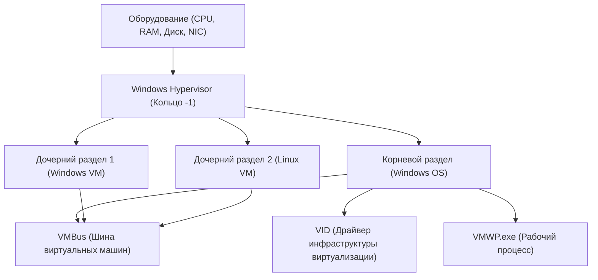

## 1. Введение: Эволюция виртуализации в Windows

Технологии виртуализации на платформе Windows претерпели кардинальные изменения за последние несколько десятилетий. Ранее доминировали гипервизоры 2-го типа от сторонних разработчиков (такие как VMware Workstation и VirtualBox), но с момента внедрения Microsoft «Hyper-V» в Windows Server 2008 гипервизоры 1-го типа стали встраиваться и в настольные ОС Windows 10/11.

В последние годы наибольшее внимание разработчиков привлекает «WSL2 (Windows Subsystem for Linux 2)». В то время как WSL1 полагалась на трансляцию системных вызовов, WSL2 использует технологию Hyper-V для создания «легковесной служебной ВМ» (Lightweight Utility VM), обеспечивая полную совместимость с Linux и значительный прирост производительности.

В этой статье мы подробно сравним и объясним с глубокими техническими деталями две мощные технологии виртуализации: полнофункциональную «Hyper-V» и ориентированную на разработчиков «WSL2», рассматривая их архитектуру, производительность (CPU, память, дисковый ввод-вывод), сетевую конфигурацию и оптимальные сценарии использования.

---

## 2. Базовая теория гипервизоров и сравнение архитектур

Для понимания технологий виртуализации необходимо разобраться в классификации типов гипервизоров (мониторов виртуальных машин, VMM).

### 2.1. Различия между гипервизорами 1-го и 2-го типа

Гипервизор — это программный слой, который абстрагирует доступ к оборудованию и позволяет нескольким операционным системам (гостевым ОС) выполняться одновременно на одной физической машине.

*   **Тип 1 (Bare-metal, автономный)**: Выполняется непосредственно на оборудовании. Концепции хост-ОС не существует (строго говоря, может существовать управляющая ОС с привилегиями), имеет крайне низкие накладные расходы и обеспечивает высокую производительность и безопасность. Примеры: Hyper-V, VMware ESXi, Xen.
*   **Тип 2 (Хостовый)**: Выполняется как приложение в хост-ОС (например, Windows или macOS). Все обращения к оборудованию проходят через хост-ОС, что увеличивает накладные расходы. Примеры: VMware Workstation, Oracle VirtualBox.

Hyper-V в Windows является чистым **гипервизором 1-го типа**. При включении Hyper-V фактически сама операционная система Windows, с которой взаимодействует пользователь, начинает работать внутри специальной виртуальной машины, называемой «корневым разделом» (Root Partition).

### 2.2. Детали архитектуры Hyper-V

Архитектура Hyper-V использует дизайн микроядра и основана на логических единицах изоляции, называемых разделами (Partitions).



*   **Windows Hypervisor**: Работает в состоянии процессора с наивысшим уровнем привилегий (Кольцо -1 или VMX Root Mode) и отвечает только за выделение памяти и планирование CPU. Он не содержит драйверов устройств.
*   **Корневой раздел (Root Partition)**: Раздел, в котором работает хост-ОС Windows. Содержит все драйверы устройств и напрямую управляет оборудованием. Также предоставляет функции управления дочерними разделами (WMI-провайдеры, VMWP.exe и др.).
*   **Дочерний раздел (Child Partition)**: Раздел, в котором работает гостевая ОС. Прямой доступ к оборудованию не разрешен, запросы на ввод-вывод (Synthetic I/O) отправляются в корневой раздел через логическую шину совместного использования памяти, называемую «VMBus».

### 2.3. WSL2 и устройство Lightweight Utility VM

WSL2 использует ту же базовую технологию гипервизора 1-го типа, что и Hyper-V, но задействует подмножество функций, называемое «Платформа виртуальных машин» (Virtual Machine Platform, VMP), которое отличается от полнофункциональных виртуальных машин Hyper-V.

«Легковесная служебная ВМ» (Lightweight Utility VM), применяемая в WSL2, полностью исключает эмуляцию устаревшего оборудования (такого как виртуальный BIOS или виртуальная материнская плата), присутствующую в традиционных ВМ.

```mermaid
graph TD
    A["Хост-ОС Windows (Пользовательское пространство)"]
    B["Файловая система NTFS"]
    C["Сервер протокола 9P (Plan 9)"]
    D["Легковесная служебная ВМ (Ядро Linux)"]
    E["ext4.vhdx (Виртуальный диск)"]
    F["Пользовательское пространство Linux (Дистрибутивы WSL2)"]

    A --> C
    C <-->| "Кросс-ОС обмен файлами" | D
    D --> E
    D --> F
```

Главная особенность WSL2 — это **скорость запуска** и **бесшовная интеграция с хост-ОС**. Ядро Linux загружается менее чем за секунду, а доступ к файловой системе Windows (NTFS) осуществляется через протокол сетевой файловой системы `9P` из Plan 9.

---

## 3. Подробный анализ производительности: Вычислительные ресурсы и ввод-вывод

Производительность виртуальной машины выражается как сумма накладных расходов в компонентах CPU, памяти и дискового ввода-вывода.

### 3.1. CPU и накладные расходы на переключение контекста

Hyper-V и WSL2 используют аппаратную виртуализацию (Intel VT-x / AMD-V). Инструкции процессора в основном выполняются с нативной скоростью, но при выполнении привилегированных инструкций или обработке ввода-вывода возникает прерывание «VM Exit», приводящее к переключению контекста на гипервизор.

Накладные расходы CPU $T_{overhead}$ в этот момент можно описать следующей математической моделью:

$$ T_{overhead} = \sum_{i=1}^{N} (t_{vm\_exit} + t_{hypercall\_process} + t_{vm\_entry}) $$

Где:
*   $N$: Количество возникновений VM Exit за единицу времени
*   $t_{vm\_exit}$: Время перехода от гостя к гипервизору
*   $t_{hypercall\_process}$: Время обработки ввода-вывода или прерываний через VMBus
*   $t_{vm\_entry}$: Время возврата от гипервизора к гостю

Поскольку в WSL2 отсутствует эмуляция устаревшего оборудования, параметр $t_{hypercall\_process}$ крайне мал и оптимизирован. Поэтому при чистых вычислениях на CPU (например, компиляция ядра или вывод моделей машинного обучения) снижение производительности по сравнению с bare-metal средой составляет в пределах нескольких процентов.

### 3.2. Механизм выделения памяти

В методах управления памятью у двух систем есть четкие различия в философии проектирования.

*   **Hyper-V (Динамическая память)**: В зависимости от потребностей гостевой ВМ в памяти корневой раздел динамически выделяет и возвращает память. Однако память, зарезервированная как страничный кэш (page cache) внутри гостевой ОС, обычно не освобождается, пока система не столкнется с нехваткой ресурсов.
*   **WSL2 (Динамическое освобождение памяти)**: WSL2 имеет собственный механизм, который регулярно возвращает (Reclaim) ненужную память (включая кэш) из ВМ Linux хосту Windows. В ранних версиях WSL2 существовала проблема, когда страничный кэш Linux съедал память Windows (разрастание процесса Vmmem), но сейчас это исправлено патчами ядра.

### 3.3. Характеристики дискового ввода-вывода (VHDX против ext4.vhdx)

Дисковый ввод-вывод чаще всего становится узким местом в производительности виртуальных машин.

Задержка ввода-вывода (Latency) $L_{total}$ рассчитывается следующим образом:

$$ L_{total} = L_{guest\_fs} + L_{vmbus} + L_{host\_fs} + L_{physical\_disk} $$

**В случае Hyper-V**:
Типичный гость Hyper-V использует виртуальный диск в формате `VHDX`. Запросы на ввод-вывод от файловой системы внутри гостевой ОС (ext4 или NTFS) проходят через драйвер блочного устройства хранилища VMBus (storvsc) и обрабатываются как доступ к файлу VHDX на NTFS на стороне Windows.

**В случае WSL2**:
Дистрибутивы Linux в WSL2 работают на нативной файловой системе ext4, созданной внутри выделенного файла `ext4.vhdx`. Файловые операции внутри Linux (например, в директории `~`) демонстрируют нативную производительность, эквивалентную Hyper-V, описанному выше.
Однако **когда осуществляется доступ из Linux в WSL2 к файлам на стороне Windows (например, `/mnt/c/`)**, или наоборот, процесс значительно отличается. Для этого кросс-ОС доступа используется `9P (Plan 9 File System Protocol)`.

$$ L_{cross\_os} = L_{9p\_client} + L_{socket\_transfer} + L_{9p\_server} + L_{ntfs} $$

Доступ через этот протокол 9P имеет высокие накладные расходы на сериализацию, поэтому производительность значительно падает (иногда в 10 и более раз) в сценариях, требующих массового чтения и записи небольших файлов (например, `npm install` или операции Git в проекте Node.js, расположенном в каталоге Windows).
Поэтому **при использовании WSL2 железное правило — всегда размещать файлы проекта в нативной файловой системе Linux (внутри `~/`)**.

---

## 4. Сетевая структура: NAT, Default Switch, Bridged

Гибкость сетевых функций — одно из главных отличий между Hyper-V и WSL2.

### 4.1. Сеть WSL2 (На базе NAT)

Сеть WSL2 по умолчанию настроена как «NAT (Network Address Translation)», используя технологию виртуальных коммутаторов Hyper-V.
ВМ Linux автоматически получает приватный IP-адрес (например, `172.20.x.x`), отличный от адреса хоста Windows. Предусмотрен встроенный механизм переадресации, благодаря которому сервисы (порты), запущенные в WSL2, доступны с хоста Windows через `localhost`, что позволяет разработчикам тестировать веб-серверы, не задумываясь о сети.

Недавно в предварительных версиях WSL2 был представлен новый сетевой режим «Mirrored» (Зеркальный). Он улучшает поддержку IPv6 и совместимость с VPN-соединениями (настраивается в `.wslconfig`).

### 4.2. Виртуальный коммутатор Hyper-V (Virtual Switch)

Hyper-V позволяет создавать сложные сети корпоративного уровня. Через «Диспетчер виртуальных коммутаторов» доступны три основных режима:

1.  **Внешняя (External)**: Привязывает физическую сетевую карту (NIC) хост-машины к виртуальному коммутатору, подключая гостевую ВМ напрямую к физической сети (мостовое соединение). ВМ получает IP-адрес от DHCP-сервера в той же подсети, что и физическая сеть.
2.  **Внутренняя (Internal)**: Разрешает связь только между хост-ОС и ВМ, а также между самими ВМ. Прямой выход во внешнюю сеть невозможен.
3.  **Частная (Private)**: Разрешает связь только между ВМ и блокирует связь с хост-ОС. Используется для создания изолированных тестовых сред.

### 4.3. Продвинутая настройка сети Hyper-V с помощью PowerShell

Если вам нужно создать кастомизированную NAT-сеть для ВМ в среде разработки или тестирования, PowerShell предоставляет детальный контроль. Ниже приведен пример скрипта для создания внутреннего виртуального коммутатора, настройки на нем NAT и предоставления ВМ доступа в Интернет.

```powershell
# 1. Создание внутреннего виртуального коммутатора
$SwitchName = "HyperV-NatSwitch"
New-VMSwitch -SwitchName $SwitchName -SwitchType Internal

# 2. Настройка IP-адреса для виртуальной NIC хоста (IP, который станет шлюзом)
$GatewayIP = "192.168.100.1"
$NetPrefix = 24
$InterfaceAlias = "vEthernet ($SwitchName)"
New-NetIPAddress -IPAddress $GatewayIP -PrefixLength $NetPrefix -InterfaceAlias $InterfaceAlias

# 3. Настройка сети NAT
$NatName = "HyperV-NatNetwork"
$NatSubnet = "192.168.100.0/24"
New-NetNat -Name $NatName -InternalIPInterfaceAddressPrefix $NatSubnet

# Команда для проверки
Get-NetNat
```

С помощью этой конфигурации вы можете создать собственный сегмент NAT, который может взаимодействовать с внешним миром через хост, вручную назначив указанному гостю Hyper-V IP-адрес `192.168.100.x` и шлюз `192.168.100.1`.

---

## 5. Варианты использования и практическое руководство по выбору

Учитывая различия в архитектуре и производительности, описанные выше, определим, в каких ситуациях следует применять каждую из технологий.

### 5.1. Сценарии, когда следует выбрать WSL2

WSL2 специально разработан для «повышения продуктивности разработчиков». Он идеально подходит для следующих целей:

*   **Веб-разработка и облачная (cloud-native) разработка**: Разработка контейнеров с использованием Docker Desktop (бэкенд WSL2) или Podman.
*   **Использование инструментов только для Linux**: Если вы повседневно используете bash, grep, awk, sed или компиляторы GCC / Clang для Linux.
*   **GUI-приложения (WSLg)**: Если вы хотите бесшовно запускать приложения X11/Wayland для Linux на рабочем столе Windows.
*   **Машинное обучение и разработка ИИ**: Быстрое обучение в TensorFlow или PyTorch с использованием функции проброса GPU (NVIDIA CUDA на WSL).

**Примечание**: Вы можете столкнуться с ограничениями, если вам нужно глубоко настроить ядро или если вы развертываете сложные сервисы, сильно зависящие от systemd (в настоящее время systemd поддерживается, но по умолчанию может быть отключен или иметь ограничения).

### 5.2. Сценарии, когда следует выбрать Hyper-V

Hyper-V предназначен для «виртуализации инфраструктуры и полной изоляции». Он обязателен для следующих задач:

*   **Запуск ВМ Windows**: При запуске различных версий Windows (например, Windows Server или старой Windows 10) в качестве среды тестирования.
*   **Вложенная виртуализация (Nested Virtualization)**: Если вам нужно запустить виртуальную машину (Hyper-V или KVM) внутри другой виртуальной машины. Это незаменимо для сред тестирования инженеров инфраструктуры.
*   **Сложные сетевые требования**: Если вам нужен строгий контроль над конфигурацией сети, например, подключение внешнего моста (подключение к той же локальной сети), тегирование VLAN или назначение нескольких NIC.
*   **Снапшоты (Контрольные точки)**: Функция сохранения состояния ВМ в определенный момент времени и возможности мгновенного отката в любой момент. Чрезвычайно полезно для разрушительного тестирования программного обеспечения или анализа вредоносных программ.
*   **Фиксированное распределение ресурсов**: Если вам нужно строго зафиксировать количество ядер CPU и объем памяти для минимизации влияния на хост-ОС.

---

## 6. Рассмотрение пропускной способности ввода-вывода с использованием математических моделей (Приложение)

Для системного инженера при оценке пределов производительности ввода-вывода обеих систем важно теоретически понимать взаимосвязь между пропускной способностью $S$ и размером блока $B$.

Пропускная способность передачи данных $S$ — это объем данных, переданных за единицу времени, которая моделируется следующим образом:

$$ S(B) = \frac{B}{L_{setup} + \frac{B}{R_{max}}} $$

*   $B$: Размер блока (Байты)
*   $L_{setup}$: Фиксированная задержка, связанная с настройкой запроса ввода-вывода и переключением контекста
*   $R_{max}$: Максимальная пропускная способность оборудования при копировании или передаче на устройство

При доступе к файлам через протокол 9P в WSL2 этот параметр $L_{setup}$ становится очень большим (из-за сокет-коммуникаций и сериализации/десериализации протокола). Таким образом, когда размер блока $B$ мал (массовое чтение/запись мелких файлов размером в несколько килобайт), влияние $L_{setup}$ в знаменателе становится доминирующим, и пропускная способность $S$ резко падает.
И наоборот, при доступе к VHDX через VMBus в Hyper-V, параметр $L_{setup}$ оптимизирован почти до уровня аппаратных прерываний, что позволяет поддерживать высокие значения IOPS даже для небольших блоков.

Эта математическая реальность является логическим обоснованием лучшей практики, которая гласит: «В WSL2 нельзя размещать файлы проекта на стороне Windows».

---

## 7. Заключение: Две сосуществующие технологии виртуализации

Hyper-V и WSL2 — это не ситуация, когда одна технология превосходит другую; это **«два решения с разными целями»**.

*   **WSL2** — это «лучший инструмент интеграции», позволяющий пробить оболочку ОС Windows и бесшовно и быстро предоставить экосистему Linux пользователям Windows. Не будет преувеличением сказать, что это идеальная CLI-среда для разработчиков.
*   **Hyper-V** — это «полноценный гипервизор», который привносит на рабочий стол надежную изоляцию и возможности управления, отточенные в корпоративных центрах обработки данных. Ему нет равных в построении сетей, тестировании ОС Windows и симуляции инфраструктурных сред.

В современных средах Windows эти две технологии не конкурируют друг с другом, а прекрасно сосуществуют на одной платформе ВМ. Используя их по назначению в зависимости от задачи, вы сделаете Windows самой мощной и гибкой инженерной рабочей станцией в мире.
