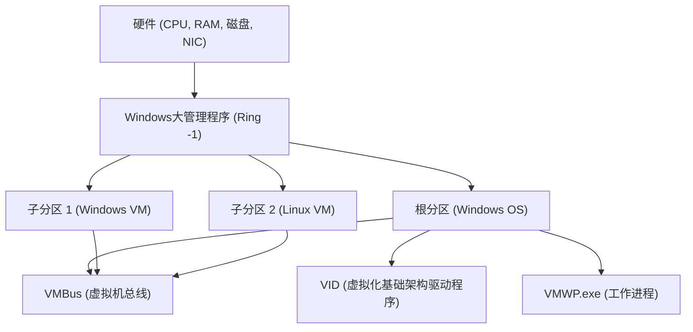

## 1. 简介：Windows中虚拟化技术的演进

Windows平台上的虚拟化技术在过去几十年里经历了戏剧性的演进。过去，第三方Type 2（宿主型）大管理程序（如VMware Workstation和VirtualBox）是主流，但自从Microsoft在Windows Server 2008中引入了“Hyper-V”以来，Type 1（裸机型）大管理程序（Hypervisor）也被整合到了桌面操作系统Windows 10/11中。

而近年来，在开发者中最受关注的便是“WSL2 (Windows Subsystem for Linux 2)”。与依赖于系统调用转换（Translation）的WSL1不同，WSL2采用了应用Hyper-V技术的“轻量级实用工具虚拟机 (Lightweight Utility VM)”，实现了完全的Linux兼容性和飞跃性的性能提升。

本文将针对这两种强大的虚拟化技术——全功能的“Hyper-V”与专为开发者体验优化的“WSL2”——它们的架构、性能（CPU、内存、磁盘I/O）、网络配置以及最佳用例，结合深层次的技术细节进行彻底的比较与解说。

---

## 2. 大管理程序（Hypervisor）的基础理论与架构比较

在理解虚拟化技术时，不可或缺的是大管理程序（虚拟机监视器：VMM）的类型分类。

### 2.1. Type 1 与 Type 2 大管理程序的区别

大管理程序是一个软件层，它抽象了对硬件的访问，使得多个操作系统（客户操作系统，Guest OS）能够在单一物理机上同时运行。

*   **Type 1（裸机型）**：直接在硬件上运行。不存在宿主操作系统（Host OS）的概念（严格来说可能会存在拥有特权的管理操作系统），开销极低，提供高阶的性能和安全性。示例：Hyper-V、VMware ESXi、Xen。
*   **Type 2（宿主型）**：作为宿主操作系统（如Windows或macOS）上的应用程序运行。由于所有的硬件访问都需要经过宿主操作系统，因此开销较大。示例：VMware Workstation、Oracle VirtualBox。

Windows的Hyper-V是纯粹的 **Type 1大管理程序**。启用Hyper-V后，实际上用户平时操作的Windows操作系统本身，也开始运行在被称为“根分区 (Root Partition)”的特殊虚拟机之中。

### 2.2. Hyper-V的架构细节

Hyper-V的架构采用了微内核设计，基于被称为分区（Partition）的逻辑隔离单位。



*   **Windows大管理程序 (Windows Hypervisor)**：在CPU最高特权级别的状态下（Ring -1 或 VMX Root Mode）运行，仅负责内存分配和CPU调度。不包含设备驱动程序。
*   **根分区 (Root Partition)**：运行宿主Windows操作系统的分区。拥有所有的设备驱动程序，并直接控制硬件。此外，还提供子分区的管理功能（如WMI提供程序和VMWP.exe等）。
*   **子分区 (Child Partition)**：运行客户操作系统的分区。不允许直接访问硬件，而是通过被称为“VMBus”的逻辑内存共享总线，将I/O请求发送到根分区（合成I/O，Synthetic I/O）。

### 2.3. WSL2与轻量级实用工具虚拟机的机制

WSL2利用了与Hyper-V相同的Type 1大管理程序的底层技术，但它使用的是不同于全功能Hyper-V虚拟机的、被称为“虚拟机平台 (Virtual Machine Platform: VMP)”的子集功能。

WSL2中采用的“轻量级实用工具虚拟机 (Lightweight Utility VM)”，完全排除了传统虚拟机所拥有的旧式硬件模拟（如虚拟BIOS和虚拟主板等）。

```mermaid
graph TD
    A["Windows宿主OS (用户空间)"]
    B["NTFS文件系统"]
    C["9P协议服务器 (Plan 9)"]
    D["轻量级实用工具虚拟机 (Linux内核)"]
    E["ext4.vhdx (虚拟磁盘)"]
    F["Linux用户空间 (WSL2发行版)"]

    A --> C
    C <-->| "跨OS文件共享" | D
    D --> E
    D --> F
```

WSL2最大的特点是**启动速度快**和**与宿主操作系统的无缝集成**。Linux内核在不到几秒的时间内启动，并通过Plan 9的 `9P` 网络文件系统协议访问Windows端的文件系统（NTFS）。

---

## 3. 性能的彻底分析：计算资源与I/O

虚拟机的性能表现为CPU、内存以及磁盘I/O等各个组件中开销的总和。

### 3.1. CPU与上下文切换开销

Hyper-V和WSL2都使用了硬件辅助虚拟化（Intel VT-x / AMD-V）。CPU指令基本上以原生速度执行，但在执行特权指令或进行I/O处理时，会发生被称为“VM Exit”的中断，并进行上下文切换至大管理程序。

此时的CPU开销 $T_{overhead}$ 可以用以下的数学模型来表示：

$$ T_{overhead} = \sum_{i=1}^{N} (t_{vm\_exit} + t_{hypercall\_process} + t_{vm\_entry}) $$

这里：
*   $N$：单位时间内VM Exit发生的次数
*   $t_{vm\_exit}$：从客户机转移到大管理程序的时间
*   $t_{hypercall\_process}$：通过VMBus的I/O处理或中断处理的时间
*   $t_{vm\_entry}$：从大管理程序返回客户机的时间

由于WSL2没有旧式硬件模拟，因此 $t_{hypercall\_process}$ 被优化得极其微小。因此，在纯粹的CPU运算（例如内核编译或机器学习模型推理）中，与裸机环境相比，性能下降可以控制在百分之几以内。

### 3.2. 内存分配机制

在内存管理方法上，两者有着明确的设计理念差异。

*   **Hyper-V (动态内存)**：根分区会根据客户虚拟机的内存需求动态地分配和回收内存。然而，在客户操作系统中作为页面缓存分配的内存，除非系统资源紧张，否则往往很难被释放。
*   **WSL2 (动态内存回收)**：WSL2拥有独特的机制，会定期将Linux虚拟机内不再需要的内存（包括缓存）返还（Reclaim）给Windows宿主机。早期的WSL2存在Linux页面缓存耗尽Windows内存的问题（Vmmem进程膨胀），但现在已经通过内核补丁得到了改善。

### 3.3. 磁盘I/O的特性（VHDX vs ext4.vhdx）

在虚拟机性能中最容易成为瓶颈的是磁盘I/O。

I/O的延迟 $L_{total}$ 按以下方式计算：

$$ L_{total} = L_{guest\_fs} + L_{vmbus} + L_{host\_fs} + L_{physical\_disk} $$

**在Hyper-V的情况下**：
一般的Hyper-V客户机使用 `VHDX` 格式的虚拟磁盘。客户操作系统内文件系统（ext4或NTFS）发出的I/O请求，穿过VMBus的块设备存储驱动程序（storvsc），在Windows端的NTFS上作为对VHDX文件的访问进行处理。

**在WSL2的情况下**：
WSL2的Linux发行版在专属的 `ext4.vhdx` 文件内构建的原生ext4文件系统上运行。Linux内的文件操作（例如 `~` 目录内）能够发挥与上述Hyper-V同等的原生性能。
但是，**当从WSL2的Linux端访问Windows端的文件（如 `/mnt/c/` 等）时**，或者反过来时，处理过程有很大的不同。这种跨操作系统的访问使用了 `9P (Plan 9 File System Protocol)`。

$$ L_{cross\_os} = L_{9p\_client} + L_{socket\_transfer} + L_{9p\_server} + L_{ntfs} $$

这种通过9P协议的访问有着巨大的序列化处理开销。在大量读写小文件的场景下（例如：位于Windows端目录的Node.js项目执行 `npm install` 或是Git操作时），性能会显著下降（有时延迟超过10倍）。
因此，**使用WSL2时，务必将项目文件放在Linux的原生文件系统（`~/` 目录下）是铁则**。

---

## 4. 网络结构：NAT、默认交换机、桥接

网络功能的灵活性是Hyper-V和WSL2的巨大区别之一。

### 4.1. WSL2的网络 (基于NAT)

WSL2的网络默认使用的是基于Hyper-V虚拟交换机技术的“NAT（网络地址转换）”配置。
Linux虚拟机将被自动分配一个与Windows宿主机不同的私有IP地址（例如：`172.20.x.x`）。系统内置了一种机制，使得可以从Windows宿主机通过 `localhost` 转发到在WSL2内启动的服务（端口），开发者在无需关注网络细节的情况下即可测试Web服务器等。

近年来，WSL2的预览版中引入了一种名为“镜像模式 (Mirrored mode)”的新网络模式。由此提升了对IPv6的支持及VPN连接的兼容性（可通过 `.wslconfig` 进行配置）。

### 4.2. Hyper-V的虚拟交换机 (Virtual Switch)

Hyper-V可以进行企业级的高级网络构建。通过“虚拟交换机管理器”，主要提供以下三种模式：

1.  **外部 (External)**：将宿主机的物理网卡（NIC）绑定到虚拟交换机，让客户虚拟机直接加入到物理网络中（桥接连接）。虚拟机从DHCP服务器获取与物理网络相同子网的IP地址。
2.  **内部 (Internal)**：仅允许宿主操作系统与虚拟机之间，以及虚拟机相互之间的通信。无法直接连接外部网络。
3.  **专用 (Private)**：仅允许虚拟机相互之间的通信，甚至阻断与宿主操作系统的通信。用于构建隔离的验证环境。

### 4.3. 通过PowerShell构建高级的Hyper-V网络

在开发或测试环境中，如果希望为虚拟机建立自定义的NAT网络，可以使用PowerShell进行更详细的控制。以下是一个创建内部虚拟交换机并在其上配置NAT以向虚拟机提供互联网访问的脚本示例。

```powershell
# 1. 创建内部虚拟交换机
$SwitchName = "HyperV-NatSwitch"
New-VMSwitch -SwitchName $SwitchName -SwitchType Internal

# 2. 在宿主机端的虚拟网卡上配置IP地址（作为网关的IP）
$GatewayIP = "192.168.100.1"
$NetPrefix = 24
$InterfaceAlias = "vEthernet ($SwitchName)"
New-NetIPAddress -IPAddress $GatewayIP -PrefixLength $NetPrefix -InterfaceAlias $InterfaceAlias

# 3. 配置NAT网络
$NatName = "HyperV-NatNetwork"
$NatSubnet = "192.168.100.0/24"
New-NetNat -Name $NatName -InternalIPInterfaceAddressPrefix $NatSubnet

# 用于验证的命令
Get-NetNat
```

通过该配置，手动将指定的Hyper-V客户机IP设置为 `192.168.100.x` 并将网关设为 `192.168.100.1`，便能构建一个可以通过宿主机与外部通信的专有NAT网段。

---

## 5. 用例与实用的选择指南

基于目前介绍的架构与性能差异，我们将明确在何种情况下应该采用哪种技术。

### 5.1. 应该选择WSL2的场景

WSL2专为“提升开发者的生产力”而设计。最适合以下用途：

*   **Web开发及云原生开发**：使用Docker Desktop（WSL2后端）或Podman的容器开发。
*   **使用Linux专用工具**：日常使用bash、grep、awk、sed，或者是面向Linux的GCC、Clang编译器时。
*   **GUI应用程序 (WSLg)**：希望在Windows桌面上无缝运行Linux的X11/Wayland应用程序时。
*   **机器学习与AI开发**：利用GPU直通功能（NVIDIA CUDA on WSL）进行TensorFlow或PyTorch的高速训练。

**注意事项**：在需要精细定制内核，或是构建严重依赖systemd的复杂服务时（目前支持systemd，但默认被禁用或有一定限制），可能会受到限制。

### 5.2. 应该选择Hyper-V的场景

Hyper-V的目的是为了实现“基础设施的虚拟化和完全隔离”。在以下用途中是必不可少的：

*   **运行Windows虚拟机**：将不同版本的Windows（如Windows Server或旧版本的Windows 10等）作为测试环境运行时。
*   **嵌套虚拟化**：希望在虚拟机中进一步运行虚拟机（如Hyper-V或KVM）时。对基础设施工程师的验证环境至关重要。
*   **高级网络需求**：需要外部桥接连接（加入同一LAN）、VLAN标记、多网卡分配等，需严格控制网络配置的场景。
*   **快照（检查点）**：保存虚拟机特定时间点状态并在任何时候即刻回滚的功能。对于破坏性软件测试或恶意软件分析非常有用。
*   **固定的资源分配**：需要严格固定CPU核心数量和内存容量，并将对宿主机操作系统的影响降至最低时。

---

## 6. 基于数学模型的I/O吞吐量分析 (附录)

作为系统工程师，在评估两者的I/O性能极限时，从理论上把握吞吐量 $S$ 与块大小 $B$ 之间的关系是非常重要的。

数据传输的吞吐量 $S$ 是单位时间内的传输数据量，可建立如下模型：

$$ S(B) = \frac{B}{L_{setup} + \frac{B}{R_{max}}} $$

*   $B$：块大小 (Bytes)
*   $L_{setup}$：I/O请求的设置以及伴随上下文切换的固定延迟
*   $R_{max}$：复制或设备传输时硬件的最大带宽

在WSL2中，通过9P协议访问文件时，该 $L_{setup}$ 会变得非常大（由于套接字通信和协议的序列化/反序列化）。因此，当块大小 $B$ 较小（大量读写几KB大小的小文件）时，分母中 $L_{setup}$ 的影响会占据主导，吞吐量 $S$ 会急剧下降。
相反，在Hyper-V中经由VMBus访问VHDX文件时，由于 $L_{setup}$ 已被优化到了接近硬件中断的级别，即使是小规模块也能维持较高的IOPS。

这一数学现实，构成了“在WSL2中绝不能把项目文件放在Windows端”这一最佳实践的逻辑基础。

---

## 7. 总结：共存的两种虚拟化技术

Hyper-V与WSL2并不存在谁优谁劣，而是**“目的截然不同的两种解决方案”**。

*   **WSL2** 打破了Windows操作系统的外壳，是将Linux生态系统无缝、高速地送到Windows用户手中的“最佳集成工具”。说它是开发者的终极CLI环境也不为过。
*   **Hyper-V** 则是将企业级数据中心积累的强大隔离性与管理能力带入桌面的“正规大管理程序”。在网络构建、Windows操作系统的测试以及基础设施环境的模拟方面，它是无出其右的选择。

在现代的Windows环境中，这两种技术并非势均力敌地相互竞争，而是能够在同一个虚拟机平台上优美地共存。根据用途因地制宜地灵活使用，Windows将会成为世界上最强大、最灵活的工程工作站。
