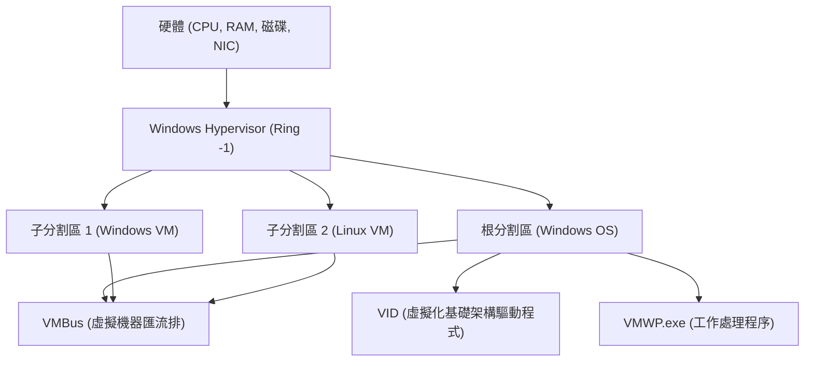

## 1. 簡介：Windows 中虛擬化的演進

在過去的幾十年裡，Windows 平台上的虛擬化技術經歷了巨大的演進。過去，第三方 Type 2 Hypervisor（例如 VMware Workstation 或 VirtualBox）曾是主流，但自從微軟在 Windows Server 2008 中引入「Hyper-V」以來，Type 1 Hypervisor 也被內建於作為桌面作業系統的 Windows 10/11 中。

近年來，在開發者中最受矚目的是「WSL2 (Windows Subsystem for Linux 2)」。有別於 WSL1 依賴系統呼叫的轉換 (translation)，WSL2 採用了應用 Hyper-V 技術的「輕量級公用程式虛擬機 (Lightweight Utility VM)」，實現了完全的 Linux 相容性與飛躍性的效能提升。

本文將針對這兩項強大的虛擬化技術——功能齊全的「Hyper-V」與專注於開發者體驗的「WSL2」，就其架構、效能（CPU、記憶體、磁碟 I/O）、網路設定，以及最適合的使用案例，伴隨深度的技術細節進行徹底的比較與解說。

---

## 2. Hypervisor 的基礎理論與架構比較

要理解虛擬化技術，不可或缺的是 Hypervisor（虛擬機器監視器: VMM）的類型分類。

### 2.1. Type 1 與 Type 2 Hypervisor 的差異

Hypervisor 是一個抽象化硬體存取，並允許多個作業系統（客體作業系統）在單一實體機器上同時執行的軟體層。

*   **Type 1（裸機型）**: 直接在硬體上執行。不存在主機作業系統的概念（嚴格來說可能存在具有特權的管理作業系統），擁有極低的額外負擔 (overhead)，提供高效能與安全性。例如：Hyper-V、VMware ESXi、Xen。
*   **Type 2（主機型）**: 作為主機作業系統（例如 Windows 或 macOS）上的應用程式執行。所有的硬體存取都必須經過主機作業系統，因此額外負擔較大。例如：VMware Workstation、Oracle VirtualBox。

Windows 的 Hyper-V 是純粹的 **Type 1 Hypervisor**。啟用 Hyper-V 後，實際上使用者平常操作的 Windows 作業系統本身，也會改在一個被稱為「根分割區 (Root Partition)」的特殊虛擬機器中運作。

### 2.2. Hyper-V 的架構細節

Hyper-V 的架構採用微核心設計，並基於被稱為分割區 (Partition) 的邏輯隔離單位。



*   **Windows Hypervisor**: 在 CPU 最高特權層級的狀態（Ring -1 或 VMX Root Mode）下運作，僅負責記憶體的分配與 CPU 的排程。不包含裝置驅動程式。
*   **根分割區 (Root Partition)**: 運作主機 Windows 作業系統的分割區。擁有所有的裝置驅動程式，並直接控制硬體。同時提供管理子分割區的功能（例如 WMI 提供者或 VMWP.exe 等）。
*   **子分割區 (Child Partition)**: 運作客體作業系統的分割區。不允許直接存取硬體，而是透過被稱為「VMBus」的邏輯記憶體共用匯流排，向根分割區傳送 I/O 請求（綜合 I/O / Synthetic I/O）。

### 2.3. WSL2 與 Lightweight Utility VM 的機制

WSL2 利用了與 Hyper-V 相同的 Type 1 Hypervisor 基礎技術，但使用的是被稱為「虛擬機器平台 (Virtual Machine Platform: VMP)」的子集功能，與全功能的 Hyper-V 虛擬機器不同。

WSL2 所採用的「輕量級公用程式虛擬機 (Lightweight Utility VM)」，完全排除了傳統 VM 所擁有的舊有硬體模擬（例如虛擬 BIOS 或虛擬主機板等）。

```mermaid
graph TD
    A["Windows 主機作業系統 (使用者空間)"]
    B["NTFS 檔案系統"]
    C["9P 協定伺服器 (Plan 9)"]
    D["輕量級公用程式虛擬機 (Linux 核心)"]
    E["ext4.vhdx (虛擬磁碟)"]
    F["Linux 使用者空間 (WSL2 發行版)"]

    A --> C
    C <-->| "跨作業系統檔案共用" | D
    D --> E
    D --> F
```

WSL2 最大的特色在於**啟動速度快**以及**與主機作業系統的無縫整合**。不到幾秒鐘內即可啟動 Linux 核心，並且透過 Plan 9 的 `9P` 網路檔案系統協定來存取 Windows 端的檔案系統 (NTFS)。

---

## 3. 效能徹底分析：運算資源與 I/O

虛擬機器的效能可以表示為 CPU、記憶體及磁碟 I/O 等各個元件的額外負擔總和。

### 3.1. CPU 與內容切換額外負擔

Hyper-V 與 WSL2 均使用了硬體輔助虛擬化 (Intel VT-x / AMD-V)。CPU 指令基本上以原生速度執行，但在執行特權指令或進行 I/O 處理時會發生稱為「VM Exit」的中斷，並向 Hypervisor 進行內容切換。

此時的 CPU 額外負擔 $T_{overhead}$ 可以用以下的數學模型來表示：

$$ T_{overhead} = \sum_{i=1}^{N} (t_{vm\_exit} + t_{hypercall\_process} + t_{vm\_entry}) $$

在此：
*   $N$: 單位時間內發生 VM Exit 的次數
*   $t_{vm\_exit}$: 從客體切換至 Hypervisor 的時間
*   $t_{hypercall\_process}$: 透過 VMBus 進行 I/O 處理或中斷的處理時間
*   $t_{vm\_entry}$: 從 Hypervisor 返回至客體的時間

WSL2 因為沒有舊有模擬，所以 $t_{hypercall\_process}$ 被極度優化並保持在極小的值。因此，在純粹的 CPU 運算（例如編譯核心或機器學習模型的推論）方面，與裸機環境相比，效能下降程度也控制在幾個百分比以內。

### 3.2. 記憶體分配的機制

在記憶體管理方法上，兩者有著明確的設計理念差異。

*   **Hyper-V (Dynamic Memory)**: 根分割區會根據客體 VM 的記憶體需求，動態地分配與回收記憶體。然而，在客體作業系統內被保留作為分頁快取的記憶體，除非系統資源緊缺，否則通常很難被釋放。
*   **WSL2 (動態記憶體回收)**: WSL2 擁有獨特的機制，會定期將 Linux VM 內不再需要的記憶體（包含快取）返還 (Reclaim) 給 Windows 主機。早期的 WSL2 曾經有 Linux 的分頁快取耗盡 Windows 記憶體的問題（Vmmem 處理程序肥大化），但目前已透過核心修補程式獲得改善。

### 3.3. 磁碟 I/O 特性（VHDX vs ext4.vhdx）

在虛擬機器效能中最容易成為瓶頸的就是磁碟 I/O。

I/O 的延遲 $L_{total}$ 的計算方式如下：

$$ L_{total} = L_{guest\_fs} + L_{vmbus} + L_{host\_fs} + L_{physical\_disk} $$

**在 Hyper-V 的情況**：
一般的 Hyper-V 客體使用 `VHDX` 格式的虛擬磁碟。從客體作業系統內的檔案系統（ext4 或 NTFS）發出的 I/O 請求，會通過 VMBus 的區塊裝置儲存驅動程式 (storvsc)，並在 Windows 端的 NTFS 上作為對 VHDX 檔案的存取來處理。

**在 WSL2 的情況**：
WSL2 的 Linux 發行版運作於建立在專用的 `ext4.vhdx` 檔案內的原生 ext4 檔案系統之上。在 Linux 內部的檔案操作（例如 `~` 目錄內），可發揮與上述 Hyper-V 同等的原生效能。
然而，**當從 WSL2 的 Linux 存取 Windows 端的檔案（如 `/mnt/c/` 等）時**，或者反向操作時，處理方式則有很大的差異。這種跨 OS 存取會使用 `9P (Plan 9 File System Protocol)`。

$$ L_{cross\_os} = L_{9p\_client} + L_{socket\_transfer} + L_{9p\_server} + L_{ntfs} $$

透過這個 9P 協定的存取，其序列化處理的額外負擔非常大，在需要大量讀寫小檔案的用途中（例如：在 Windows 端目錄下的 Node.js 專案執行 `npm install` 或 Git 操作），效能會顯著下降（有時會產生 10 倍以上的延遲）。
因此，**使用 WSL2 時，務必將專案檔案放置在 Linux 的原生檔案系統（`~/` 目錄下），這是基本鐵則**。

---

## 4. 網路結構：NAT、Default Switch、Bridged

網路功能的彈性是 Hyper-V 與 WSL2 的一大差異。

### 4.1. WSL2 的網路 (NAT 基礎)

WSL2 的網路預設為使用了 Hyper-V 虛擬交換器技術的「NAT（網路位址轉換）」架構。
Linux VM 會自動被分配與 Windows 主機不同的私有 IP 位址（例如：`172.20.x.x`）。系統內建了從 Windows 主機透過 `localhost` 轉發至 WSL2 內啟動的服務（連接埠）的機制，開發者可以在不需特別意識網路的情況下測試網頁伺服器等。

近年來，WSL2 在預覽版中引入了稱為「Mirrored 模式」的新網路模式。這提升了對 IPv6 的支援與 VPN 連線的相容性（可透過 `.wslconfig` 進行設定）。

### 4.2. Hyper-V 的虛擬交換器 (Virtual Switch)

Hyper-V 能夠建立企業級的高階網路架構。透過「虛擬交換器管理員」，主要提供 3 種模式：

1.  **外部 (External)**: 將主機機器的實體 NIC 綁定至虛擬交換器，讓客體 VM 直接加入實體網路（橋接連線）。VM 會從 DHCP 伺服器取得與實體網路相同子網路的 IP。
2.  **內部 (Internal)**: 僅允許主機作業系統與 VM 之間，以及 VM 彼此之間的通訊。無法直接連線至外部網路。
3.  **私人 (Private)**: 僅允許 VM 彼此之間的通訊，阻斷與主機作業系統的通訊。用於建立隔離的驗證環境。

### 4.3. 透過 PowerShell 建立進階的 Hyper-V 網路

在開發或測試環境中，如果想為 VM 建立自訂的 NAT 網路，可以使用 PowerShell 進行詳細的控制。以下是建立內部虛擬交換器，並在其中設定 NAT 以提供 VM 網際網路存取的指令碼範例。

```powershell
# 1. 建立內部虛擬交換器
$SwitchName = "HyperV-NatSwitch"
New-VMSwitch -SwitchName $SwitchName -SwitchType Internal

# 2. 在主機端的虛擬 NIC 設定 IP 位址 (作為閘道器的 IP)
$GatewayIP = "192.168.100.1"
$NetPrefix = 24
$InterfaceAlias = "vEthernet ($SwitchName)"
New-NetIPAddress -IPAddress $GatewayIP -PrefixLength $NetPrefix -InterfaceAlias $InterfaceAlias

# 3. 設定 NAT 網路
$NatName = "HyperV-NatNetwork"
$NatSubnet = "192.168.100.0/24"
New-NetNat -Name $NatName -InternalIPInterfaceAddressPrefix $NatSubnet

# 確認用命令
Get-NetNat
```

透過此設定，藉由手動將指定的 Hyper-V 客體設定為 `192.168.100.x` 的 IP 與閘道器 `192.168.100.1`，即可建立能經由主機與外部通訊的專屬 NAT 網段。

---

## 5. 使用案例與實用的選擇指南

根據至今為止對於架構與效能差異的了解，我們將定義在何種情況下應採用哪種技術。

### 5.1. 應選擇 WSL2 的情境

WSL2 是專為「提升開發者生產力」而設計的。最適合以下用途：

*   **網頁開發與雲端原生開發**: 使用 Docker Desktop（WSL2 後端）或 Podman 的容器開發。
*   **使用 Linux 專用工具**: 日常使用 bash、grep、awk、sed，或是 Linux 平台的 GCC 或 Clang 編譯器時。
*   **GUI 應用程式 (WSLg)**: 想在 Windows 桌面環境上無縫執行 Linux 的 X11/Wayland 應用程式時。
*   **機器學習與 AI 開發**: 利用 GPU 穿透功能（NVIDIA CUDA on WSL）來進行 TensorFlow 或 PyTorch 的高速訓練。

**注意事項**: 如果想對核心進行細微的客製化，或是要建立強烈依賴 systemd 的複雜服務（目前雖已支援 systemd，但預設為停用或受限）時，可能會受到限制。

### 5.2. 應選擇 Hyper-V 的情境

Hyper-V 的目的在於「基礎架構的虛擬化與完全隔離」。在以下用途中將是必不可少的：

*   **執行 Windows VM**: 當需要將不同版本的 Windows（如 Windows Server 或舊版 Windows 10 等）作為測試環境執行時。
*   **巢狀虛擬化 (Nested Virtualization)**: 想在虛擬機器中進一步執行虛擬機器（Hyper-V 或 KVM）時。這對於基礎設施工程師的驗證環境是不可或缺的。
*   **進階網路需求**: 需要嚴格控制網路架構時，例如外部橋接連線（加入同一個 LAN）、VLAN 標記、指派多個 NIC 等。
*   **快照（檢查點）**: 儲存 VM 在特定時間點的狀態，並能隨時瞬間還原的功能。對於軟體的破壞性測試或惡意軟體分析等非常有用。
*   **固定的資源分配**: 想嚴格固定 CPU 核心數或記憶體量，將對主機作業系統的影響降至最低時。

---

## 6. 基於數學模型的 I/O 吞吐量探討 (附錄)

身為系統工程師，在釐清兩者的 I/O 效能極限時，理論上掌握吞吐量 $S$ 與區塊大小 $B$ 的關係是很重要的。

資料傳輸的吞吐量 $S$ 為單位時間內的資料傳輸量，其模型如下：

$$ S(B) = \frac{B}{L_{setup} + \frac{B}{R_{max}}} $$

*   $B$: 區塊大小 (Bytes)
*   $L_{setup}$: 伴隨 I/O 請求的設定與內容切換而來的固定延遲
*   $R_{max}$: 複製或裝置傳輸中硬體的最大頻寬

在透過 WSL2 的 9P 協定存取檔案時，這個 $L_{setup}$ 會變得非常大（因為 Socket 通訊與協定的序列化/反序列化）。因此，當區塊大小 $B$ 較小（大量讀寫數 KB 左右的小檔案）時，分母中的 $L_{setup}$ 影響將佔主導地位，吞吐量 $S$ 會急遽下降。
相反地，透過 Hyper-V 的 VMBus 進行 VHDX 存取時，由於 $L_{setup}$ 已被最佳化至接近硬體中斷的程度，所以即使是小規模的區塊也能維持高 IOPS。

這個數學現實成為了「在 WSL2 中絕對不能將專案檔案放在 Windows 端」這項最佳實踐的邏輯依據。

---

## 7. 總結：共存的兩種虛擬化技術

Hyper-V 與 WSL2 並不是哪一方比較優秀的問題，而是**「目的不同的兩種解決方案」**。

*   **WSL2** 打破了 Windows 這個作業系統的框架，是為了將 Linux 的生態系統無縫且高速地傳遞到 Windows 使用者手中而生的「最佳整合工具」。稱其為開發者專用的終極 CLI 環境一點也不為過。
*   **Hyper-V** 則是將企業資料中心培育出的強大隔離性與管理能力帶入桌面的「正統 Hypervisor」。在網路建構、Windows 作業系統測試、基礎設施環境模擬等方面無可匹敵。

在現代的 Windows 環境中，這兩項技術並不是勢均力敵的競爭者，而是在同一個 VM 平台上完美共存。透過根據用途適材適所地運用，Windows 將會成為世界上最強大且具彈性的工程工作站吧。
