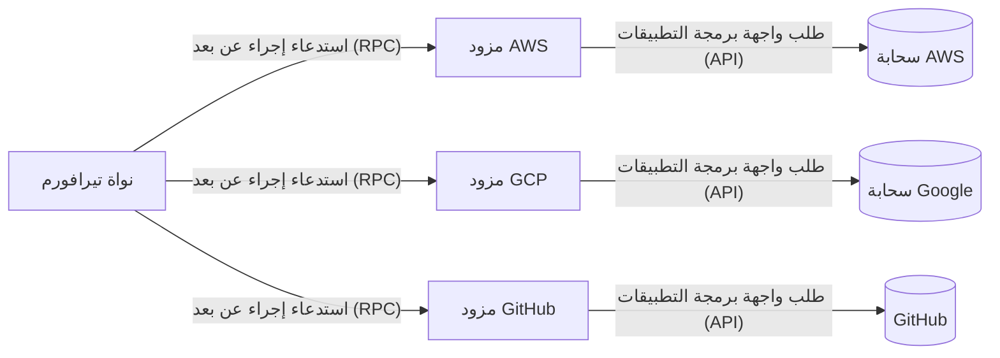
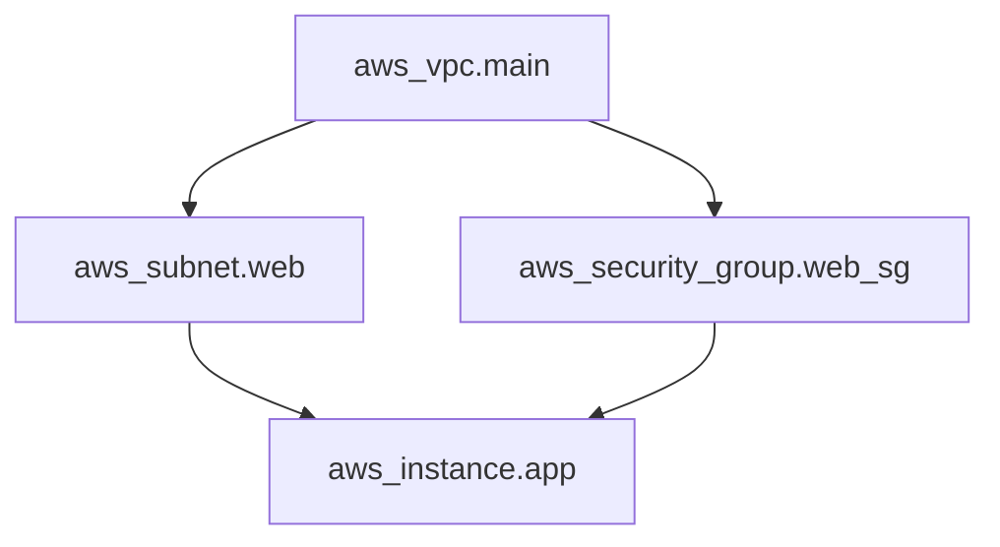
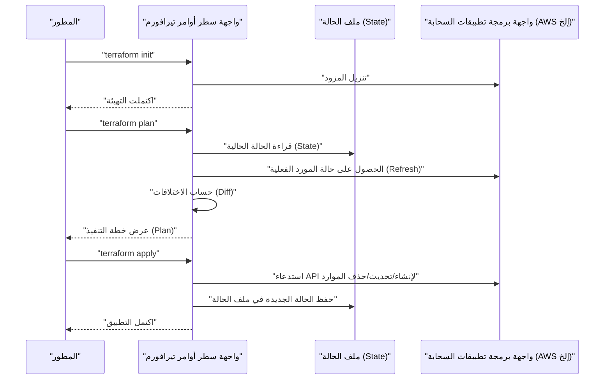
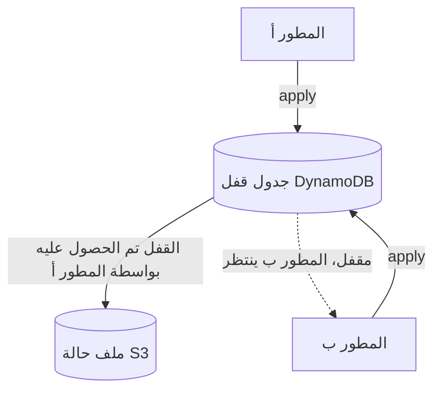
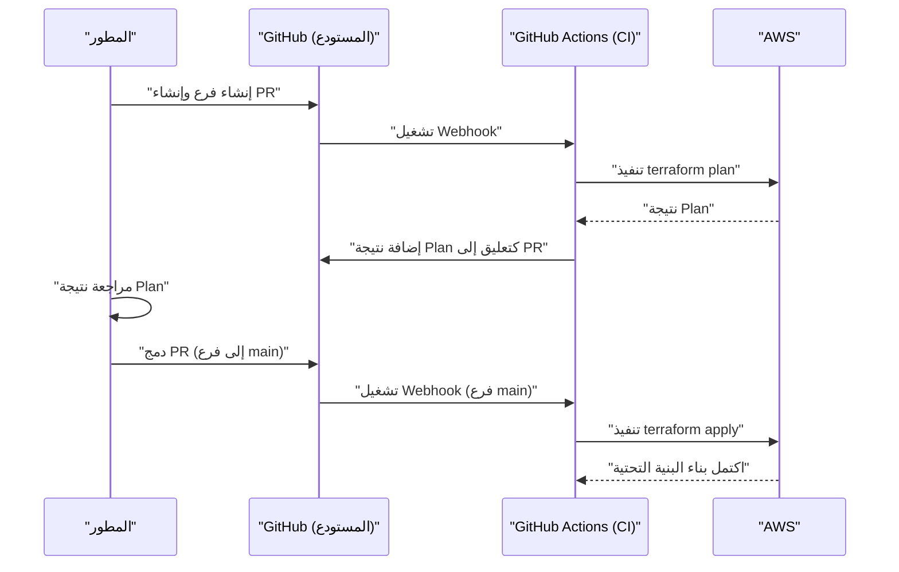

# مقدمة: تطور البنية التحتية وظهور IaC

في عالم تطوير الأنظمة، حدث تحول نموذجي منذ فترة طويلة لإدارة ليس فقط كود التطبيق، بل أيضاً البنية التحتية نفسها ككود. وهذا ما يُعرف باسم **البنية التحتية ككود (IaC)**. كان بناء الخوادم يدوياً (ما يُسمى "البناء القائم على دليل الإجراءات" أو "عمليات النقر") بيئة خصبة للأخطاء البشرية، وعانى من مشاكل قاتلة تتمثل في الافتقار إلى قابلية التوسع وإمكانية التكرار.

في هذه المقالة، سنبدأ بمفهوم IaC ونركز على **تيرافورم (Terraform)**، الذي يمكن القول إنه المعيار الفعلي (De facto standard). سنشرح بالتفصيل فلسفة "إدارة التكوين التعريفي" التي تتبناها تيرافورم، والبنية الداخلية، وآلية إدارة الحالة (State)، وأفضل الممارسات العملية.

---

# 1. ما هي البنية التحتية ككود (IaC)؟

## 1.1. النهج التقليدي وقيوده

قبل انتشار الحوسبة السحابية، أو في بيئات السحابة المبكرة، كان مهندسو البنية التحتية ينشئون الموارد يدوياً من خلال وحدات التحكم الرسومية (مثل AWS Management Console أو Azure Portal).
في حين أن هذا النهج كان بديهياً وتكلفة تعلمه منخفضة، إلا أنه كان يعاني من القيود التالية:

- **الافتقار إلى إمكانية التكرار** : خطر أن تكون أدلة الإجراءات قديمة، أو أن تختلف الإعدادات بناءً على تفسير العامل.
- **صعوبة التدقيق والتتبع** : من الصعب الاحتفاظ بسجل يوضح "من فعل ماذا، ومتى، ولماذا" تم إجراء التغيير.
- **عائق التوسع** : عند بناء مئات الخوادم، يستغرق العمل اليدوي وقتاً طويلاً جداً.

## 1.2. مزايا IaC

من خلال تحويل البنية التحتية إلى كود، يصبح من الممكن تطبيق الممارسات الممتازة المزروعة في تطوير البرمجيات على بناء البنية التحتية.

1. **إدارة الإصدارات** : باستخدام أنظمة التحكم في الإصدارات (VCS) مثل Git، يمكن إدارة سجل تغييرات البنية التحتية.
2. **عملية المراجعة** : تتيح طلبات السحب (Pull Requests) مراجعة الكود، مما يضمن الجودة قبل تطبيق التغييرات.
3. **الأتمتة والتكامل المستمر** : من خلال دمجها في خطوط أنابيب [CI/CD](https://kenji.blog/ar/p/cicd-pipeline-github-actions-best-practices/)، يمكن أتمتة الاختبار والنشر.
4. **الاتساق وقابلية التكرار (Idempotency)** : بغض النظر عن عدد مرات التشغيل، يُضمن أن تكون النتيجة (الحالة) هي نفسها دائماً.

## 1.3. الفرق بين الإجرائي (Imperative) والتعريفي (Declarative)

تنقسم أدوات IaC بشكل عام إلى نهجين: "الإجرائي" و"التعريفي".

### الإجرائي (Imperative)
يصف **"كيفية (How) بناء البنية التحتية"**. يشمل ذلك النصوص البرمجية (Bash أو Python)، أو Ansible (على الرغم من أنه تعريفي جزئياً، إلا أن له جانباً إجرائياً قوياً من حيث الوعي بترتيب تنفيذ المهام).
- مثال: "ابدأ تشغيل مثيل EC2 واحد، ثم قم بإنشاء حاوية S3، ثم احصل على عنوان IP الخاص بـ EC2."

### التعريفي (Declarative)
يصف **"ما هي الحالة النهائية المرغوبة (What)"**. يقوم النظام بمقارنة الحالة الحالية بالحالة المثالية المحددة، ويحسب التغييرات اللازمة، ويطبقها تلقائياً. **تيرافورم (Terraform)** هو ممثل نموذجي لهذا النهج.
- مثال: "يوجد مثيل EC2 واحد، وتوجد حاوية S3."

---

# 2. ما هو تيرافورم (Terraform)؟

تيرافورم هي أداة IaC مفتوحة المصدر طورتها شركة HashiCorp باستخدام لغة Go. تتيح لك تكوين وإدارة أي واجهة برمجة تطبيقات (API) ككود، بدءاً من البنية التحتية السحابية وحتى إعدادات SaaS.

## 2.1. بنية المزود (Provider)

أكبر قوة لتيرافورم تكمن في **استقلاليتها عن النظام الأساسي** و **نظام المزودين البيئي**. لا تقوم نواة تيرافورم (Terraform Core) بإنشاء الموارد مباشرة. بدلاً من ذلك، تتواصل مع واجهة برمجة التطبيقات (API) الخاصة بكل خدمة من خلال مكونات إضافية تُسمى "المزودين (Providers)".



يتيح لك ذلك إدارة خدمات مختلفة تماماً مثل AWS و Datadog و GitHub بشكل متكامل ضمن قاعدة بيانات واحدة.

## 2.2. لغة HCL (HashiCorp Configuration Language)

تتم كتابة إعدادات تيرافورم باستخدام لغة **HCL**، وهي متوافقة مع JSON ولكن يسهل على البشر قراءتها وكتابتها. فيما يلي مثال بسيط يحدد مثيل EC2 على AWS.

```hcl
provider "aws" {
  region = "ap-northeast-1"
}

resource "aws_instance" "web" {
  ami           = "ami-0c3fd0f5d33134a76"
  instance_type = "t3.micro"

  tags = {
    Name        = "WebServer"
    Environment = "Production"
  }
}
```

يصرح هذا الكود بحالة "وجود مثيل EC2 بنوع المثيل و AMI المحددين في منطقة طوكيو".

---

# 3. فلسفة إدارة التكوين التعريفي

يكمن جوهر تيرافورم في هذا النهج **التعريفي (Declarative)**. لماذا هذا النهج متفوق؟

## 3.1. الحساب التلقائي للحالة وحل التبعيات

في النصوص البرمجية الإجرائية، يجب على الإنسان أن يكتب بدقة الترتيب الذي يتم به إنشاء الموارد. على سبيل المثال، إجراء إنشاء شبكة فرعية بعد إنشاء VPC، ثم وضع EC2 في تلك الشبكة الفرعية.

في تيرافورم، تقوم نواة تيرافورم تلقائياً ببناء **رسم بياني للتبعيات (Dependency Graph)** بناءً على العلاقات المرجعية التي تظهر في الكود (على سبيل المثال، الإشارة إلى `aws_vpc.main.id` في إعدادات الشبكة الفرعية).



يتيح هذا النهج القائم على نظرية الرسوم البيانية لـ تيرافورم تحقيق ما يلي:
- **الإنشاء المتوازي** للموارد التي لا توجد بينها تبعيات (تسريع).
- إنشاء وتحديث وحذف الموارد بالترتيب الصحيح.

## 3.2. الاتساق وقابلية التكرار (Idempotency)

فائدة أخرى للنهج التعريفي هي **الاتساق وقابلية التكرار**. بغض النظر عن عدد مرات تشغيل أمر `terraform apply` لنفس الكود، فإن الحالة النهائية للبنية التحتية ستتطابق تماماً مع ما هو مكتوب في الكود. بالنسبة للموارد الموجودة بالفعل في الحالة المتوقعة، ستحدد تيرافورم أنه "لا توجد تغييرات (No changes)".

يحررك هذا من كابوس العمليات مثل "في حالة حدوث خطأ في منتصف البرنامج النصي، تحقق يدوياً من المدى الذي تم تنفيذه، وقم بتصحيح البرنامج النصي، ثم أعد تشغيله".

---

# 4. تدفق التنفيذ: Init، Plan، Apply

تنقسم العمليات الأساسية في تيرافورم بشكل أساسي إلى ثلاث مراحل. سير العمل هذا هو ما يجعل التغييرات الآمنة للبنية التحتية ممكنة.



### 1. `terraform init`
يهيئ دليل العمل. يقوم بتنزيل المكونات الإضافية للمزود المحدد ويقوم بإعداد الخلفية (مكان حفظ الحالة).

### 2. `terraform plan`
يقوم بتنفيذ تشغيل جاف (بروفة). يقارن وصف الكود بالحالة الفعلية الحالية للبنية التحتية ويخرج "ما سيتم إضافته (+) أو تغييره (~) أو حذفه (-)". في هذه المرحلة، يمكنك مراجعة ما إذا كانت هناك أية عمليات حذف لموارد غير مقصودة.

### 3. `terraform apply`
يطبق فعلياً خطة التغيير المقترحة في مرحلة `plan` على مزود السحابة.

---

# 5. إدارة الحالة: أعماق ملف الحالة (State)

مفهوم **الحالة (State)** أمر لا مفر منه عند فهم تيرافورم.

## 5.1. ما هو terraform.tfstate؟

تقوم تيرافورم بإنشاء وإدارة ملف بتنسيق JSON يُسمى `.tfstate` لتعيين الكود (الحالة المثالية) إلى البنية التحتية الواقعية.

لماذا نحتاج إلى ملف الحالة في المقام الأول؟ قد يبدو أنه من المقبول فقط الاتصال بواجهة برمجة تطبيقات السحابة والحصول على جميع الموارد في كل مرة.
الأسباب هي كما يلي:

1. **حفظ البيانات الوصفية والتبعيات** : لتخزين البيانات الوصفية الخاصة بـ تيرافورم التي لا تعيدها واجهات برمجة تطبيقات السحابة، بالإضافة إلى الرسم البياني للتبعيات وقت إنشاء المورد.
2. **الأداء** : في البنى التحتية واسعة النطاق، سيؤدي الحصول على حالة جميع الموارد عبر واجهة برمجة التطبيقات في كل مرة إلى حدوث مهلات وحدود لمعدل طلبات واجهة برمجة التطبيقات.
3. **تتبع الموارد** : إذا قمت بحذف تعريف مورد من الكود، فإن تيرافورم ستحدد "المورد الموجود في ملف الحالة ولكن ليس في الكود" وتقوم بتنفيذ إجراء الحذف. بدون الحالة، سيتم ببساطة "التخلي" عن الموارد المختفية من الكود.

## 5.2. إدارة الحالة عن بُعد والأقفال

في بيئات التطوير الجماعي، يعد الاحتفاظ بـ `terraform.tfstate` على جهاز محلي **ممارسة سيئة مطلقة (Anti-pattern)**. إذا قام عدة أشخاص بتشغيل `terraform apply` في نفس الوقت، فسوف تتعارض الحالة وتتعطل البنية التحتية.

حل هذه المشكلة هو **الحالة عن بُعد (Remote State)** و **قفل الحالة (State Locking)**.
في بيئة AWS، من المعياري استخدام حاوية S3 كوجهة حفظ للحالة، و DynamoDB لإدارة القفل.

```hcl
terraform {
  backend "s3" {
    bucket         = "my-terraform-state-bucket"
    key            = "prod/terraform.tfstate"
    region         = "ap-northeast-1"
    dynamodb_table = "terraform-state-lock"
    encrypt        = true
  }
}
```



من خلال ضبط هذا الإعداد، تتم كتابة القفل إلى DynamoDB أثناء تنفيذ "المطور أ" لأمر `apply`، ويتم حظر تنفيذ "المطور ب".

## 5.3. اكتشاف الانحراف (Drift) وتصحيحه

يُطلق على تغيير البنية التحتية خارج تيرافورم (على سبيل المثال، يدوياً من وحدة التحكم الرسومية) اسم **انحراف التكوين (Configuration Drift)**.

عند تنفيذ `plan` أو `apply`، تقوم تيرافورم أولاً بالحصول على أحدث حالة للواقع السحابي (Refresh) وتحدث ملف الحالة. ثم تقارن ذلك بالكود، مما يمكنها من اكتشاف التغييرات اليدوية و"التراجع (أو اقتراح التصحيحات)" إلى الحالة الأصلية المحددة في الكود.

---

# 6. الوحدات (Modularization) وقابلية إعادة الاستخدام

مع نمو النظام، تتضخم أيضاً قاعدة كود تيرافورم. للامتثال لمبدأ DRY (لا تكرر نفسك)، تحتوي تيرافورم على آلية تسمى **الوحدات (Modules)**.

## 6.1. أساسيات الوحدات

الوحدة النمطية (Module) عبارة عن حاوية تجمع الموارد ذات الصلة. من خلال تغليف وظيفة معينة (مثل مجموعة شبكة VPC، أو مجموعة رسومية من ECS) وتحديد المتغيرات المدخلة (Variables) والمخرجات (Outputs)، يمكنك إنشاء أجزاء قابلة لإعادة الاستخدام.

**مثال على هيكل الدليل:**
```text
.
├── environments
│   ├── prod
│   │   └── main.tf      # استدعاء الوحدة من بيئة الإنتاج
│   └── stg
│       └── main.tf      # استدعاء الوحدة من بيئة STG
└── modules
    └── vpc
        ├── main.tf      # تعريف الموارد داخل الوحدة
        ├── variables.tf # المدخلات للوحدة
        └── outputs.tf   # المخرجات من الوحدة
```

**جانب استدعاء الوحدة (`environments/prod/main.tf`):**
```hcl
module "vpc" {
  source = "../../modules/vpc"

  vpc_cidr             = "10.0.0.0/16"
  environment          = "prod"
  enable_dns_hostnames = true
}
```

من خلال تصميم الوحدات بهذه الطريقة، يمكنك بسهولة بناء نفس بنية الشبكة في بيئة STG أو بيئة التطوير ببساطة عن طريق تغيير المعلمات (المتغيرات).

---

# 7. الميزات المتقدمة لـ تيرافورم

لغة HCL في تيرافورم ليست مجرد ملف تكوين بسيط، ولكنها تحتوي أيضاً على ميزات لبناء بعض المنطق.

## 7.1. الكتل الديناميكية (dynamic block)

تُنشئ كتلاً متداخلة ديناميكياً بناءً على القوائم أو الخرائط. على سبيل المثال، هذا مفيد لإعداد قواعد مجموعات الأمان.

```hcl
resource "aws_security_group" "web" {
  name   = "web-sg"
  vpc_id = aws_vpc.main.id

  dynamic "ingress" {
    for_each = var.allowed_web_ports
    content {
      from_port   = ingress.value
      to_port     = ingress.value
      protocol    = "tcp"
      cidr_blocks = ["0.0.0.0/0"]
    }
  }
}
```

## 7.2. متى تستخدم for_each مقابل count

لإنشاء العديد من الموارد المشابهة، استخدم `count` أو `for_each`.

- **count** : يُنشئ الموارد وفقاً لعدد الأعداد الصحيحة المحدد. نظراً لأنه يعتمد على فهرس القائمة، فإذا تم حذف عنصر في المنتصف، يتحول الفهرس، وهناك خطر يتمثل في إعادة إنشاء الموارد اللاحقة أو حذفها بشكل غير مقصود.
- **for_each** : يستقبل خريطة أو مجموعة من السلاسل النصية ويُنشئ موردًا بناءً على كل مفتاح. نظراً لأنه مقاوم لتحولات الفهرس، **يُوصى باستخدام for_each** لمعالجة الموارد في حلقة.

---

# 8. التكامل مع خط أنابيب [CI/CD](https://kenji.blog/ar/p/cicd-pipeline-github-actions-best-practices/) (GitOps)

تظهر القيمة الحقيقية لـ تيرافورم عندما يتم دمجها في سير عمل GitOps. يُمنع تنفيذ أمر `apply` محلياً، وتتم أتمتة جميع التغييرات من خلال طلبات السحب (Pull Requests).



## 8.1. تغيير الأمان إلى اليسار (Shift-Left)

يجب أن تتضمن خطوط أنابيب [CI/CD](https://kenji.blog/ar/p/cicd-pipeline-github-actions-best-practices/) أدوات تحليل ثابتة لاكتشاف ثغرات البنية التحتية مبكراً.
- **tfsec** و **checkov**: تقوم هذه الأدوات بفحص المخاطر الأمنية على مستوى الكود (مثل "حاوية S3 عامة ومرئية" أو "قاعدة البيانات غير مشفرة") وتوقف عملية CI مع حدوث خطأ في حالة وجود مشكلة.

---

# 9. النهج الرياضي للنمذجة للموثوقية والتكلفة

عند تصميم البنية التحتية باستخدام IaC، من المهم تقييم التوازن بين الموثوقية (Reliability) والتكلفة.
على سبيل المثال، يمكن التعبير عن معدل تشغيل النظام في تكوين مناطق توفر متعددة (Multi-AZ) بنموذج رياضي.

لنفترض أن موثوقية مكون واحد (AZ) هي $\text{R}_1$.
إذا قمنا بوضع الموارد في منطقتي توفر (للتكرار)، وافترضنا أن النظام بأكمله قيد التشغيل إذا كانت أي منهما قيد التشغيل، فيمكن التعبير عن الموثوقية الإجمالية للنظام $\text{R}_{total}$ بالصيغة التالية:

$$
\text{R}_{total} = 1 - (1 - \text{R}_1)(1 - \text{R}_2)
$$

عند تصميم وحدات في تيرافورم، يعد توفير متغير إدخال `az_count` والسماح بالنشر التلقائي للبنية التحتية التي تفي بالمتطلبات بناءً على هذا النموذج الرياضي مهارة تصميم متقدمة مطلوبة من المهندسين المعماريين.

---

# 10. أفضل الممارسات العملية والأنماط السيئة (Anti-patterns)

## أفضل الممارسات
1. **تقسيم ملف الحالة (State)** : إذا قمت بتجميع جميع البنى التحتية في ملف حالة واحد، فسيكون نطاق التأثير واسعاً جداً وسيكون تنفيذ `plan` بطيئاً. قسّم الحالة (والأدلة) بوحدات دورات الحياة المختلفة مثل "الشبكة (VPC، إلخ)"، "قواعد البيانات"، و"التطبيقات".
2. **تثبيت الإصدارات** : تأكد من تثبيت (pinning) إصدار نواة تيرافورم وإصدار المزود (Provider). هذا يحمي البنية التحتية من التغييرات المدمرة بسبب ترقيات الإصدار.
3. **الاستفادة من مصادر البيانات (Data Sources)** : عند الإشارة إلى حالة أخرى أو موارد موجودة، لا تقم بترميزها بشكل ثابت (hardcoding)، بل استخدم كتلة `data` للحصول على القيمة ديناميكياً.

## الأنماط السيئة (Anti-patterns)
1. **الخلط مع التغييرات اليدوية** : تعديل الموارد المدارة بواسطة تيرافورم مباشرة من واجهة المستخدم الرسومية. سيؤدي هذا إلى عدم اتساق الحالة.
2. **الترميز الثابت لبيانات الاعتماد** : كتابة مفاتيح الوصول أو المفاتيح السرية مباشرة في الكود. يُرجى استخدام متغيرات البيئة أو أدوار IAM (مثل تكامل OIDC).
3. **الوحدات المعقدة جداً** : إذا حاولت منح الوحدة جميع الوظائف الممكنة، فسيصل عدد المتغيرات إلى العشرات وستنخفض قابلية القراءة بشكل كبير. ضع في اعتبارك مبدأ "وحدة واحدة تعني مسؤولية واحدة (Single Responsibility)".

---

# 11. الخلاصة

تعد **البنية التحتية ككود (IaC)** ممارسة لا غنى عنها في تطوير البرمجيات الحديثة. من بينها، أثبتت **تيرافورم (Terraform)** مكانتها كمعيار فعلي لـ IaC من خلال فلسفتها القوية المتمثلة في "إدارة التكوين التعريفي"، وتتبع الحالة المتقدم عبر State، والنظام البيئي الغني بالمزودين الذي يمتد عبر منصات متعددة.

ومع ذلك، فإن مجرد تقديم الأداة لن يسمح لك بجني أقصى فوائدها. فقط من خلال الجمع بين "أفضل الممارسات" مثل هيكلة الكود بوحدات، وبناء هيكل تطوير جماعي باستخدام الحالة عن بُعد والأقفال، وتحقيق GitOps من خلال التكامل مع [CI/CD](https://kenji.blog/ar/p/cicd-pipeline-github-actions-best-practices/)، وتغيير الأمان إلى اليسار (Shift-Left)، سيصبح من الممكن تشغيل بنية تحتية آمنة وقابلة للتوسع.

لم تعد البنية التحتية شيئاً "يتم إنشاؤه بالنقر". تماماً مثل البرمجيات، نحن في عصر يتم فيه "برمجتها واختبارها ونشرها باستمرار". نأمل أن تتقن استخدام تيرافورم لتبني بنية تحتية معمارية متينة وجميلة.
