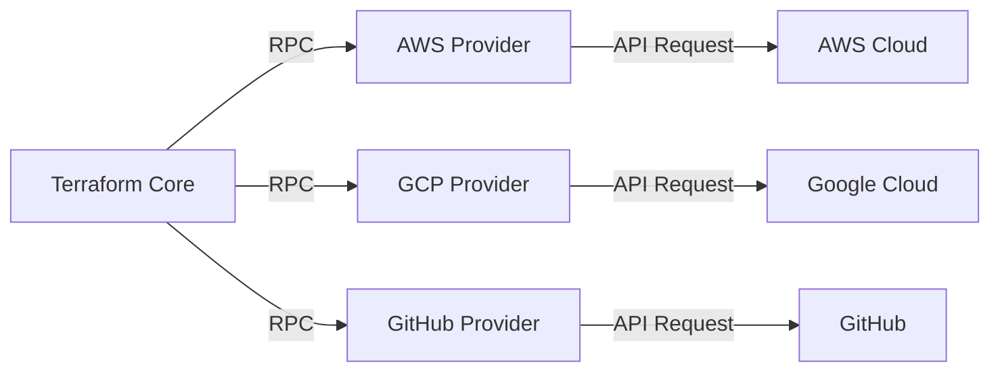
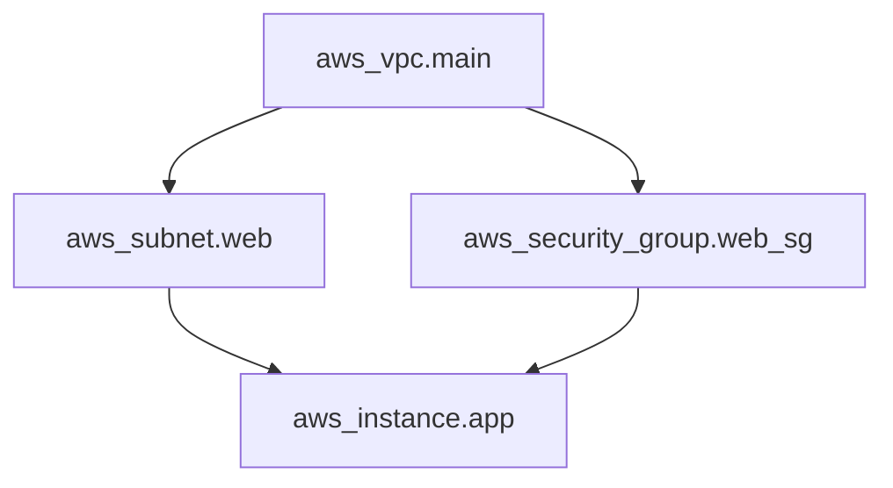
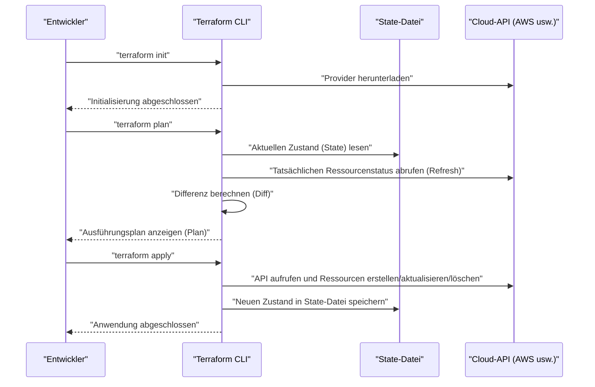
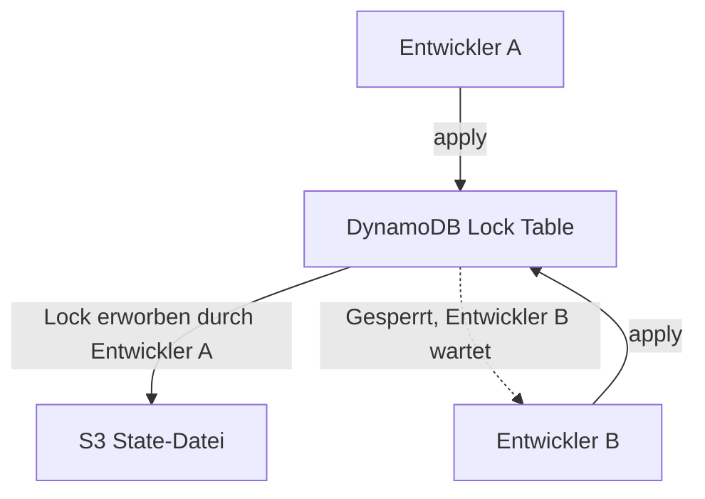
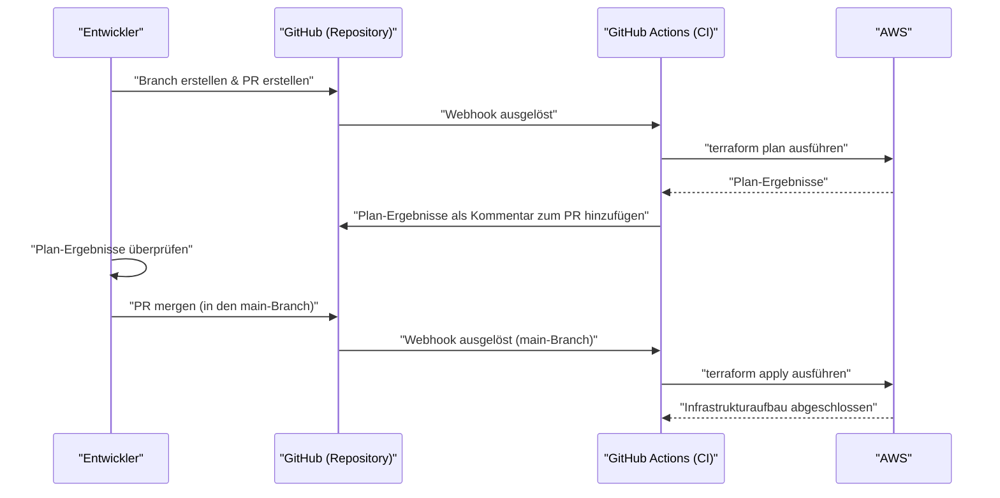

# Einführung: Die Evolution der Infrastruktur und der Aufstieg von IaC

In der Welt der Systementwicklung hat längst ein Paradigmenwechsel stattgefunden, bei dem nicht nur der Code der Anwendung, sondern auch die Infrastruktur selbst als Code verwaltet wird. Das ist **Infrastructure as Code (IaC)** . Der manuelle Aufbau von Servern (die sogenannte "handbuchbasierte Konstruktion" oder "Klick-Bedienung") war eine Brutstätte für menschliche Fehler und litt unter dem fatalen Problem mangelnder Skalierbarkeit und Reproduzierbarkeit.

In diesem Artikel beginnen wir mit dem Konzept von IaC und konzentrieren uns dann auf **Terraform** , das als De-facto-Standard gelten kann. Wir werden sehr detailliert auf die von Terraform übernommene Philosophie des "deklarativen Konfigurationsmanagements", die interne Architektur, die Mechanismen des [Zustand](https://kenji.blog/de/p/state-management-history-redux-context-recoil-zustand/)smanagements (State) und praktische Best Practices eingehen.

---

# 1. Was ist Infrastructure as Code (IaC)?

## 1.1. Traditionelle Methoden und ihre Grenzen

Vor der weiten Verbreitung von Cloud Computing oder in frühen Cloud-Umgebungen erstellten Infrastruktur-Ingenieure Ressourcen manuell über GUI-Konsolen (wie die AWS Management Console oder das Azure Portal).
Während dieser Ansatz intuitiv ist und eine geringe Lernkurve hat, wies er die folgenden Einschränkungen auf:

- **Mangelnde Reproduzierbarkeit** : Das Risiko, dass Handbücher veraltet sind oder dass Konfigurationen je nach Interpretation des Bedieners variieren.
- **Schwierigkeiten bei der Überprüfung und Nachverfolgung** : Es ist schwer als Verlauf zu speichern, "wer, wann und warum" Änderungen vorgenommen hat.
- **Grenzen der Skalierbarkeit** : Der manuelle Aufbau von Hunderten von Servern erfordert zu viel physische Zeit.

## 1.2. Vorteile von IaC

Durch die Codierung der Infrastruktur können die exzellenten Praktiken, die in der Softwareentwicklung kultiviert wurden, auf den Aufbau der Infrastruktur angewendet werden.

1. **Versionskontrolle** : Der Verlauf von Infrastrukturänderungen kann mithilfe eines VCS (Versionskontrollsystem) wie Git verwaltet werden.
2. **Review-Prozess** : Code-Reviews durch Pull Requests (PR) werden möglich, was die Qualität vor der Umsetzung sicherstellt.
3. **Automatisierung und kontinuierliche Integration** : Durch die Einbindung in eine [CI/CD](https://kenji.blog/de/p/cicd-pipeline-github-actions-best-practices/)-[Pipeline](https://kenji.blog/de/p/cicd-pipeline-github-actions-best-practices/) können Tests und Deployments automatisiert werden.
4. **Konsistenz und Idempotenz (Idempotency)** : Egal wie oft es ausgeführt wird, es wird garantiert immer das gleiche Ergebnis ([Zustand](https://kenji.blog/de/p/state-management-history-redux-context-recoil-zustand/)) erzielt.

## 1.3. Der Unterschied zwischen imperativ (Imperative) und deklarativ (Declarative)

Es gibt weitgehend zwei Ansätze für IaC-Tools: "imperativ" und "deklarativ".

### Imperativer Ansatz (Imperative)
Beschreibt, **"wie (How) die Infrastruktur erstellt wird"** . Dazu gehören Skripte (Bash oder Python) oder Ansible (teilweise deklarativ, aber stark imperativ in dem Sinne, dass es die Ausführungsreihenfolge von Aufgaben berücksichtigt).
- Beispiel: "Starte 1 EC2-Instanz, erstelle dann einen S3-Bucket und rufe die IP-Adresse der EC2 ab."

### Deklarativer Ansatz (Declarative)
Beschreibt, **"wie der endgültige Zustand (What) aussehen soll"** . Das System vergleicht den aktuellen Zustand mit dem definierten Idealzustand und berechnet und wendet automatisch die erforderlichen Änderungen an. **Terraform** ist der typische Vertreter dieses Ansatzes.
- Beispiel: "Es existiert 1 EC2-Instanz und ein S3-Bucket ist vorhanden."

---

# 2. Was ist Terraform?

Terraform ist ein Open-Source-IaC-Tool, das von HashiCorp in der Programmiersprache Go entwickelt wurde. Es ermöglicht die Konfiguration und Verwaltung aller APIs als Code, von der Cloud-Infrastruktur bis zu SaaS-Einstellungen.

## 2.1. Provider-Architektur

Die größte Stärke von Terraform liegt in seiner **Plattformunabhängigkeit** und seinem **Provider-Ökosystem** . Der Terraform-Kern (Core) erstellt Ressourcen nicht direkt. Stattdessen kommuniziert er mit der API jedes Dienstes über Plugins, die "Provider" genannt werden.



Dadurch ist es möglich, völlig unterschiedliche Dienste wie AWS, Datadog und GitHub durch eine einzige Codebasis integriert zu verwalten.

## 2.2. HCL (HashiCorp Configuration Language)

Terraform-Konfigurationen werden in **HCL** geschrieben, das JSON-kompatibel ist und dennoch für Menschen einfach zu lesen und zu schreiben ist. Unten sehen Sie ein einfaches Beispiel zur Definition einer AWS EC2-Instanz.

```hcl
provider "aws" {
  region = "ap-northeast-1"
}

resource "aws_instance" "web" {
  ami           = "ami-0c3fd0f5d33134a76"
  instance_type = "t3.micro"

  tags = {
    Name        = "WebServer"
    Environment = "Production"
  }
}
```

Dieser Code deklariert einen [Zustand](https://kenji.blog/de/p/state-management-history-redux-context-recoil-zustand/), in dem "eine EC2-Instanz mit der angegebenen AMI und dem Instanztyp in der Region Tokio existiert".

---

# 3. Die Philosophie des deklarativen Konfigurationsmanagements

Der Kern von Terraform liegt in diesem **deklarativen (Declarative)** Ansatz. Warum ist dieser Ansatz überlegen?

## 3.1. Automatische Berechnung von Zuständen und Auflösung von Abhängigkeiten

In imperativen Skripten müssen Menschen die Reihenfolge der Ressourcenerstellung genau beschreiben. Beispielsweise das Verfahren zur Erstellung eines Subnetzes nach der Erstellung einer VPC und zur Platzierung einer EC2 innerhalb dieses Subnetzes.

In Terraform erstellt der Terraform Core automatisch einen **Abhängigkeitsgraphen (Dependency Graph)** basierend auf den im Code vorkommenden Referenzbeziehungen (beispielsweise durch den Verweis auf `aws_vpc.main.id` in den Subnetzeinstellungen).



Durch diesen auf der Graphentheorie basierenden Ansatz erreicht Terraform Folgendes:
- **Parallele Erstellung** von Ressourcen ohne Abhängigkeiten (Beschleunigung).
- Erstellung, Aktualisierung und Löschung von Ressourcen in der richtigen Reihenfolge.

## 3.2. Idempotenz (Idempotency)

Ein weiterer Vorteil des deklarativen Ansatzes ist die **Idempotenz** . Egal wie oft derselbe Code mit `terraform apply` ausgeführt wird, der Endzustand der Infrastruktur entspricht genau dem im Code beschriebenen. Für Ressourcen, die sich bereits im erwarteten [Zustand](https://kenji.blog/de/p/state-management-history-redux-context-recoil-zustand/) befinden, entscheidet Terraform, "nichts zu ändern (No changes)".

Dies befreit Sie vom betrieblichen Albtraum, "manuell überprüfen zu müssen, wie weit ein Skript ausgeführt wurde, wenn in der Mitte ein Fehler auftritt, das Skript zu korrigieren und es erneut auszuführen".

---

# 4. Ausführungsablauf: Init, Plan, Apply

Die grundlegenden Operationen von Terraform sind in drei Hauptphasasen unterteilt. Dieser [Workflow](https://kenji.blog/de/p/cicd-pipeline-github-actions-best-practices/) ist es, der sichere Infrastrukturänderungen ermöglicht.



### 1. `terraform init`
Initialisiert das Arbeitsverzeichnis. Lädt die angegebenen Provider-Plugins herunter und konfiguriert das Backend (den Speicherort für den State).

### 2. `terraform plan`
Führt einen Dry-Run (Trockenlauf) durch. Vergleicht den geschriebenen Code mit dem aktuellen tatsächlichen Infrastrukturzustand und gibt aus, "was hinzugefügt (+), geändert (~) und gelöscht (-) wird". In dieser Phase überprüfen Sie, ob es unbeabsichtigte Löschungen von Ressourcen gibt.

### 3. `terraform apply`
Wendet den in `plan` vorgeschlagenen Änderungsplan tatsächlich auf den Cloud-Provider an.

---

# 5. [Zustand](https://kenji.blog/de/p/state-management-history-redux-context-recoil-zustand/)smanagement: Die Tiefen der State-Datei

Um Terraform zu verstehen, kommt man am Konzept des **Zustands (State)** nicht vorbei.

## 5.1. Was ist terraform.tfstate?

Um den Code (den Idealzustand) der realen Infrastruktur zuzuordnen, generiert und verwaltet Terraform eine Datei im JSON-Format namens `.tfstate` .

Warum ist überhaupt eine State-Datei notwendig? Es scheint, als ob man jedes Mal die Cloud-API aufrufen könnte, um alle Ressourcen abzurufen.
Die Gründe dafür sind wie folgt:

1. **Speicherung von Metadaten und Abhängigkeiten** : Um Terraform-spezifische Metadaten, die die Cloud-API nicht zurückgibt, sowie den Abhängigkeitsgraphen bei der Ressourcenerstellung zwischenzuspeichern.
2. **Leistung** : In groß angelegten Infrastrukturen führt das Abrufen des [Zustand](https://kenji.blog/de/p/state-management-history-redux-context-recoil-zustand/)s aller Ressourcen über die API jedes Mal zu Timeouts und dem Erreichen von API-Ratenlimits.
3. **Nachverfolgung von Ressourcen** : Wenn eine Ressourcendefinition aus dem Code gelöscht wird, identifiziert Terraform "Ressourcen, die in der State-Datei, aber nicht im Code existieren", und führt eine Löschaktion aus. Ohne den State würden Ressourcen, die aus dem Code verschwunden sind, einfach "aufgegeben" werden.

## 5.2. Remote State und Sperrenverwaltung (Lock Management)

In der Teamentwicklung ist es ein **absolutes Anti-Pattern** , die Datei `terraform.tfstate` auf dem lokalen Rechner abzulegen. Wenn mehrere Personen gleichzeitig `terraform apply` ausführen, kollidiert der State und die Infrastruktur wird beschädigt.

Dies wird durch **Remote State** und **State Locking** gelöst.
In einer AWS-Umgebung ist es Standard, einen S3-Bucket als Speicherort für den State und DynamoDB für die Sperrenverwaltung zu verwenden.

```hcl
terraform {
  backend "s3" {
    bucket         = "my-terraform-state-bucket"
    key            = "prod/terraform.tfstate"
    region         = "ap-northeast-1"
    dynamodb_table = "terraform-state-lock"
    encrypt        = true
  }
}
```



Mit dieser Konfiguration wird, während Entwickler A `apply` ausführt, eine Sperre in DynamoDB geschrieben und die Ausführung von Entwickler B blockiert.

## 5.3. Erkennung und Behebung von Drift

Wenn die Infrastruktur außerhalb von Terraform (z. B. manuell über die GUI-Konsole) geändert wird, wird dies als **Konfigurations-Drift (Configuration Drift)** bezeichnet.

Wenn `plan` oder `apply` ausgeführt wird, ruft Terraform zunächst den aktuellen, tatsächlichen [Zustand](https://kenji.blog/de/p/state-management-history-redux-context-recoil-zustand/) in der Cloud ab (Refresh) und aktualisiert die State-Datei. Indem es sie dann mit dem Code vergleicht, kann es manuelle Änderungen erkennen und sie in den ursprünglich im Code definierten Zustand "zurückziehen (oder Korrekturen vorschlagen)".

---

# 6. Modularisierung und Wiederverwendbarkeit

Wenn ein System wächst, bläht sich auch die Terraform-Codebasis auf. Um das DRY-Prinzip (Don't Repeat Yourself) einzuhalten, verfügt Terraform über einen Mechanismus namens **Module** .

## 6.1. Grundlagen der Module

Ein Modul ist ein [Container](https://kenji.blog/de/p/docker-container-namespace-cgroups-layers/), der zusammenhängende Ressourcen gruppiert. Indem bestimmte Funktionen (z. B. ein kompletter VPC-Netzwerksatz, ein kompletter ECS-Cluster usw.) gekapselt und Eingabevariablen (Variables) und Ausgaben (Outputs) definiert werden, können wiederverwendbare Komponenten erstellt werden.

**Beispiel für eine Verzeichnisstruktur:**
```text
.
├── environments
│   ├── prod
│   │   └── main.tf      # Ruft das Modul aus der Produktionsumgebung auf
│   └── stg
│       └── main.tf      # Ruft das Modul aus der STG-Umgebung auf
└── modules
    └── vpc
        ├── main.tf      # Ressourcendefinition im Modul
        ├── variables.tf # Eingaben für das Modul
        └── outputs.tf   # Ausgaben aus dem Modul
```

**Aufrufer des Moduls (`environments/prod/main.tf`):**
```hcl
module "vpc" {
  source = "../../modules/vpc"

  vpc_cidr             = "10.0.0.0/16"
  environment          = "prod"
  enable_dns_hostnames = true
}
```

Durch das Entwerfen von Modulen auf diese Weise kann dieselbe Netzwerkkonfiguration in STG- und Entwicklungsumgebungen einfach durch Ändern von Parametern (Variablen) aufgebaut werden.

---

# 7. Fortgeschrittene Funktionen von Terraform

Terraforms HCL ist nicht nur eine Konfigurationsdatei, sondern bietet auch Funktionen zum Aufbau einer gewissen Logik.

## 7.1. Dynamische Blöcke (dynamic block)

Generiert dynamisch verschachtelte Blöcke basierend auf Listen oder Maps. Dies ist beispielsweise für das Festlegen von Sicherheitsgruppenregeln nützlich.

```hcl
resource "aws_security_group" "web" {
  name   = "web-sg"
  vpc_id = aws_vpc.main.id

  dynamic "ingress" {
    for_each = var.allowed_web_ports
    content {
      from_port   = ingress.value
      to_port     = ingress.value
      protocol    = "tcp"
      cidr_blocks = ["0.0.0.0/0"]
    }
  }
}
```

## 7.2. Verwendung von for_each und count

Wenn Sie mehrere ähnliche Ressourcen erstellen, verwenden Sie `count` oder `for_each` .

- **count** : Erstellt die angegebene ganzzahlige Anzahl von Ressourcen. Da es vom Index der Liste abhängt, besteht die Gefahr, dass, wenn ein Element in der Mitte gelöscht wird, die Indizes verschoben werden und nachfolgende Ressourcen unbeabsichtigt neu erstellt oder gelöscht werden.
- **for_each** : Akzeptiert eine Map oder ein Set von Strings und erstellt Ressourcen basierend auf jedem Schlüssel. Da es widerstandsfähig gegen Indexverschiebungen ist, **wird die Verwendung von for_each** für das Durchlaufen von Ressourcen **empfohlen** .

---

# 8. Integration mit [CI/CD](https://kenji.blog/de/p/cicd-pipeline-github-actions-best-practices/)-[Pipeline](https://kenji.blog/de/p/cicd-pipeline-github-actions-best-practices/)s (GitOps)

Der wahre Wert von Terraform zeigt sich, wenn es in einen GitOps-[Workflow](https://kenji.blog/de/p/cicd-pipeline-github-actions-best-practices/) integriert wird. Manuelles Ausführen von `apply` auf lokalen Rechnern wird verboten, und alle Änderungen werden über Pull Requests automatisiert.



## 8.1. Security Shift-Left

[CI/CD](https://kenji.blog/de/p/cicd-pipeline-github-actions-best-practices/)-[Pipeline](https://kenji.blog/de/p/cicd-pipeline-github-actions-best-practices/)s sollten statische Analysetools integrieren, um Schwachstellen in der Infrastruktur frühzeitig zu erkennen.
- **tfsec** oder **checkov** : Scannt auf Code-Ebene nach Sicherheitsrisiken wie "S3-Bucket ist öffentlich zugänglich" oder "DB ist nicht verschlüsselt" und stoppt die CI mit einem Fehler, wenn Probleme gefunden werden.

---

# 9. Mathematischer Ansatz zur Zuverlässigkeit und Kostenmodellierung

Beim Entwurf einer Infrastruktur mit IaC ist es wichtig, das Gleichgewicht zwischen Zuverlässigkeit (Reliability) und Kosten zu bewerten.
Beispielsweise kann die Verfügbarkeit eines Systems in einer Multi-AZ-Konfiguration (Availability Zone) in einem mathematischen Modell ausgedrückt werden.

Sei die Zuverlässigkeit einer einzelnen Komponente (AZ) $R_1$ .
Wenn Ressourcen in zwei AZs (Redundanz) platziert werden und das gesamte System als betriebsbereit gilt, wenn eines von beiden betriebsbereit ist, wird die Gesamtzuverlässigkeit des Systems $R_{total}$ durch die folgende Formel ausgedrückt:

$$
R_{total} = 1 - (1 - R_1)(1 - R_2)
$$

Beim Entwerfen von Modulen in Terraform ist es eine fortgeschrittene Designfähigkeit, die von Architekten gefordert wird, eine Eingabevariable `az_count` bereitzustellen und automatisch eine Infrastruktur bereitzustellen, die die Anforderungen basierend auf diesem mathematischen Modell erfüllt.

---

# 10. Praktische Best Practices und Anti-Pattern

## Best Practices
1. **Aufteilung der State-Datei** : Wenn Sie die gesamte Infrastruktur in einer State-Datei zusammenfassen, wird der Wirkungsbereich zu groß und die Ausführung von `plan` wird langsamer. Teilen Sie den State (und die Verzeichnisse) in Einheiten mit unterschiedlichen Lebenszyklen auf, wie z. B. "Netzwerk (VPC usw.)", "Datenbank" und "Anwendung".
2. **Versionierung fixieren** : Stellen Sie sicher, dass Sie die Version des Terraform-Kerns und die Version der Provider fixieren (pinning). Dies schützt die Infrastruktur vor destruktiven Änderungen, die durch Versions-Upgrades verursacht werden.
3. **Nutzung von Datenquellen (Data Sources)** : Wenn Sie auf andere States oder vorhandene Ressourcen verweisen, verwenden Sie den `data` -Block, um Werte dynamisch abzurufen, anstatt sie hart zu codieren.

## Anti-Pattern
1. **Mischen mit manuellen Änderungen** : Das direkte Ändern von von Terraform verwalteten Ressourcen über die GUI. Dies führt zu Inkonsistenzen im State.
2. **Hardcoding von Anmeldeinformationen** : Das direkte Schreiben von Access Keys und Secret Keys in den Code. Verwenden Sie Umgebungsvariablen oder IAM-Rollen (wie [OIDC](https://kenji.blog/de/p/oauth2-oidc-authentication-authorization-difference/)-Integration).
3. **Zu komplexe Module** : Wenn Sie versuchen, ein Modul mit allen Funktionen auszustatten, wird es Dutzende von Variablen haben, und die Lesbarkeit wird erheblich abnehmen. Denken Sie daran: "Ein Modul hat eine Verantwortung (Single Responsibility)."

---

# 11. Fazit

**Infrastructure as Code** ist eine unverzichtbare Praxis in der modernen Softwareentwicklung. Unter diesen hat sich **Terraform** als De-facto-Standard für IaC etabliert, dank seiner mächtigen Philosophie des "deklarativen Konfigurationsmanagements", des erweiterten [Zustand](https://kenji.blog/de/p/state-management-history-redux-context-recoil-zustand/)s-Trackings durch State und eines plattformübergreifenden, reichhaltigen Provider-Ökosystems.

Durch die bloße Einführung des Tools können Sie jedoch nicht die maximalen Vorteile daraus ziehen. Nur durch die Kombination von "Best Practices" wie der Strukturierung des Codes durch Module, dem Aufbau eines Team-Entwicklungssystems mit Remote State und Sperren, der Realisierung von GitOps durch die Integration mit [CI/CD](https://kenji.blog/de/p/cicd-pipeline-github-actions-best-practices/) und dem Security Shift-Left kann ein sicherer und skalierbarer Infrastrukturbetrieb erreicht werden.

Infrastruktur wird nicht mehr durch "Klicken" erstellt. Wir befinden uns in einem Zeitalter, in dem sie, genau wie Software, "codiert, getestet und kontinuierlich bereitgestellt" wird. Beherrschen Sie Terraform und bauen Sie eine robuste und schöne Infrastrukturarchitektur auf.
