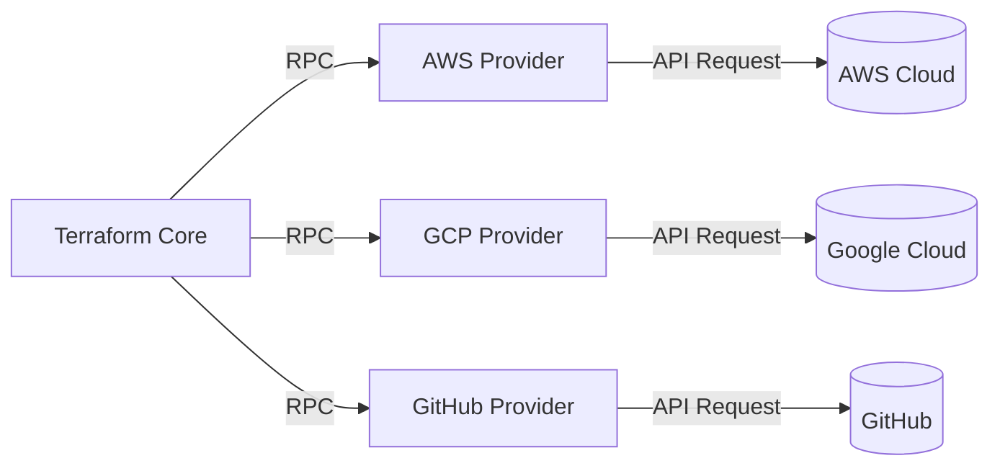
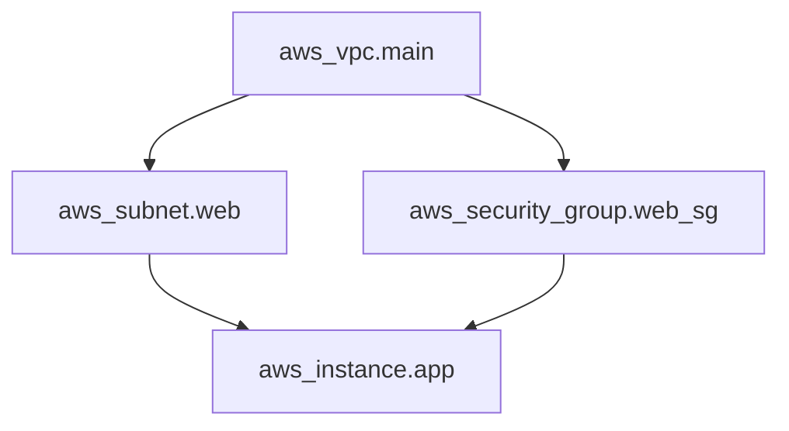
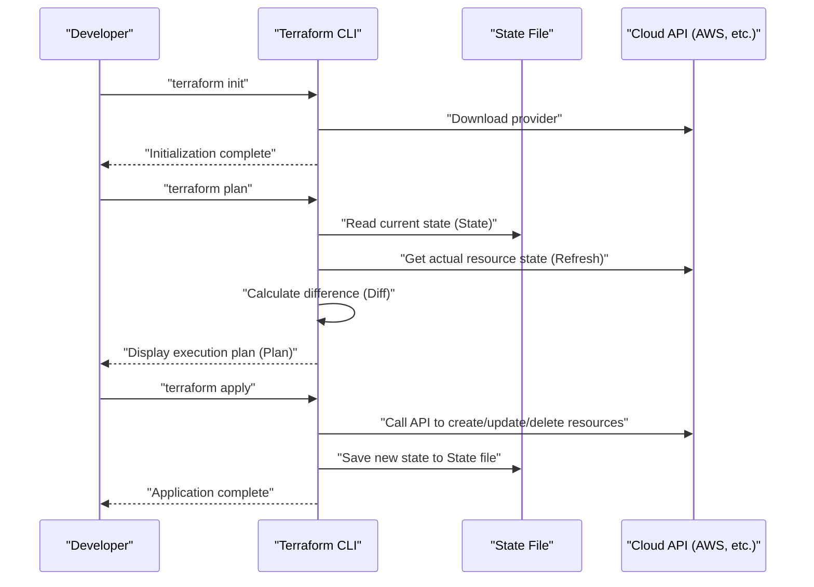
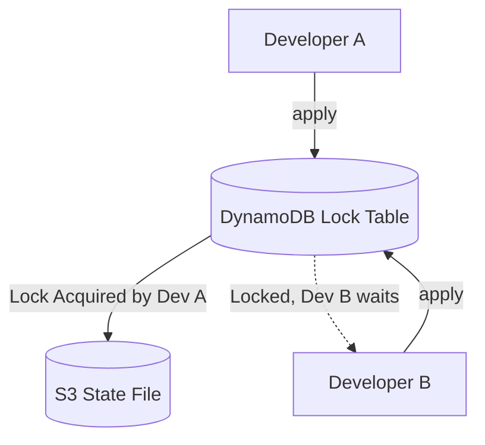
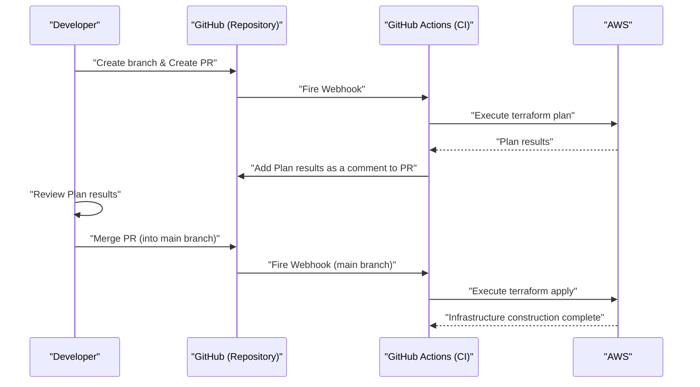

# Introduction: The Evolution of Infrastructure and the Rise of IaC

In the world of system development, a paradigm shift has occurred where not only application code but also the infrastructure itself is managed as code. This is **Infrastructure as Code (IaC)**. Manual server construction (so-called "procedure-based construction" or "click operations") has been a breeding ground for human error and has had fatal problems such as a lack of scalability and reproducibility.

This article starts with the concept of IaC and focuses on **Terraform**, which can be said to be its de facto standard. We will explain in great detail the philosophy of "declarative configuration management" adopted by Terraform, its internal architecture, the mechanism of state management (State), and practical best practices.

---

# 1. What is Infrastructure as Code (IaC)?

## 1.1. Traditional Methods and Their Limitations

Before cloud computing became widespread, or in early cloud environments, infrastructure engineers manually created resources from a GUI console (such as AWS Management Console or Azure Portal).
While this method is intuitive and has a low learning curve, it had the following limitations:

- **Lack of reproducibility**: The risk that procedures are outdated or configurations differ depending on the operator's interpretation.
- **Difficulty in auditing and tracking**: It is difficult to keep a history of "who, when, and why" changes were made.
- **Barrier to scale**: When building hundreds of servers, manual work takes too much physical time.

## 1.2. Benefits of IaC

By codifying the infrastructure, excellent practices cultivated in software development can also be applied to infrastructure construction.

1. **Version control**: You can manage the change history of the infrastructure using a VCS (Version Control System) such as Git.
2. **Review process**: Code reviews via Pull Requests (PRs) become possible, ensuring quality before making changes.
3. **Automation and Continuous Integration**: By integrating it into a [CI/CD](https://kenji.blog/en/p/cicd-pipeline-github-actions-best-practices/) pipeline, you can automate testing and deployment.
4. **[Consistency](https://kenji.blog/en/p/cap-theorem-distributed-systems-tradeoff/) and Idempotency**: It is guaranteed that no matter how many times it is executed, the result (state) will always be the same.

## 1.3. Difference Between Imperative and Declarative

IaC tools have two main approaches: "imperative" and "declarative".

### Imperative
Describes **"how to create the infrastructure"**. Scripts (Bash or Python) or Ansible (partially declarative, but has a strong imperative aspect in being conscious of the order of task execution) fall under this category.
- Example: "Launch one EC2 instance, then create an S3 bucket, and get the IP address of the EC2 instance"

### Declarative
Describes **"what the final state should be"**. The system compares the current state with the defined ideal state and automatically calculates and applies the necessary changes. **Terraform** is a typical example of this approach.
- Example: "One EC2 instance exists, and an S3 bucket exists"

---

# 2. What is Terraform?

Terraform is an open-source IaC tool developed by HashiCorp in the [Go](https://kenji.blog/en/p/programming-languages-history-paradigm-evolution/) language. It allows you to configure and manage any API as code, from cloud infrastructure to SaaS settings.

## 2.1. Provider Architecture

The greatest strength of Terraform lies in its **platform independence** and **provider ecosystem**. Terraform Core does not create resources directly. Instead, it communicates with the API of each service through a plugin called a "Provider".



This makes it possible to comprehensively manage completely different services such as AWS, Datadog, and GitHub with a single codebase.

## 2.2. HCL (HashiCorp Configuration Language)

Terraform configuration is written using **HCL**, which is JSON-compatible yet easy for humans to read and write. Below is a simple example defining an AWS EC2 instance.

```hcl
provider "aws" {
  region = "ap-northeast-1"
}

resource "aws_instance" "web" {
  ami           = "ami-0c3fd0f5d33134a76"
  instance_type = "t3.micro"

  tags = {
    Name        = "WebServer"
    Environment = "Production"
  }
}
```

This code declares the state: "An EC2 instance with the specified AMI and instance type exists in the Tokyo region."

---

# 3. The Philosophy of Declarative Configuration Management

The core of Terraform is this **declarative** approach. Why is this approach superior?

## 3.1. Automatic State Calculation and Dependency Resolution

In imperative scripts, humans must accurately describe the order in which resources are created. For example, the procedure is to create a VPC, then create a subnet, and place an EC2 instance in that subnet.

In Terraform, Terraform Core automatically builds a **Dependency [Graph](https://kenji.blog/en/p/tree-graph-data-structures-search-dfs-bfs-dijkstra/)** from reference relationships that appear in the code (for example, referring to `aws_vpc.main.id` in the subnet configuration).



With this approach based on graph theory, Terraform achieves the following:
- **Parallel creation** of resources without dependencies (speed up).
- Creation, update, and deletion of resources in the correct order.

## 3.2. Idempotency

Another benefit of the declarative approach is **idempotency**. No matter how many times you run `terraform apply` with the same code, the final state of the infrastructure perfectly matches what is written in the code. For resources that are already in the expected state, Terraform determines that there are "No changes".

This frees you from the operational nightmare of "If an error occurs in the middle of a script, manually checking how far it executed, fixing the script, and running it again".

---

# 4. Execution Flow: Init, Plan, Apply

The basic operations of Terraform are broadly divided into three phases. This workflow is what enables safe infrastructure changes.



### 1. `terraform init`
Initializes the working directory. It downloads the plugins for the specified providers and configures the backend (where the State is saved).

### 2. `terraform plan`
Performs a dry run. It compares the code description with the current actual infrastructure state and outputs "what will be added (+), changed (~), and deleted (-)". During this phase, you review to ensure there are no unintended resource deletions.

### 3. `terraform apply`
Actually applies the change plan presented in `plan` to the cloud provider.

---

# 5. [State Management](https://kenji.blog/en/p/state-management-history-redux-context-recoil-zustand/): The Depths of the State File

An unavoidable concept in understanding Terraform is **State**.

## 5.1. What is terraform.tfstate?

Terraform generates and manages a JSON-format file called `.tfstate` to map the code (ideal state) to the real infrastructure.

Why is a State file necessary? It might seem sufficient to query the cloud API and get all resources every time.
The reasons are as follows:

1. **Saving metadata and dependencies**: To cache Terraform-specific metadata that the cloud API does not return, as well as the dependency graph from when resources were created.
2. **Performance**: In a large-scale infrastructure, fetching the state of all resources via API every time would hit timeouts or API rate limits.
3. **Resource tracking**: If you delete a resource definition from the code, Terraform identifies "a resource that exists in the State file but not in the code" and executes a delete action. Without State, resources deleted from the code would simply be "abandoned".

## 5.2. Remote State and [Lock](https://kenji.blog/en/p/rdbms-transaction-acid-isolation-level-lock/) Management

In team development, placing `terraform.tfstate` on a local machine is an **absolute anti-pattern**. If multiple people run `terraform apply` at the same time, the State will conflict, and the infrastructure will be corrupted.

This is solved by **Remote State** and **State Locking**.
In an AWS environment, it is standard to use an S3 bucket to save the State and DynamoDB for lock management.

```hcl
terraform {
  backend "s3" {
    bucket         = "my-terraform-state-bucket"
    key            = "prod/terraform.tfstate"
    region         = "ap-northeast-1"
    dynamodb_table = "terraform-state-lock"
    encrypt        = true
  }
}
```



By configuring it this way, while Developer A is executing `apply`, a lock is written to DynamoDB, and Developer B's execution is blocked.

## 5.3. Detecting and Correcting Drift

When infrastructure is modified outside of Terraform (for example, manually from a GUI console), this is called **Configuration Drift**.

When Terraform executes `plan` or `apply`, it first gets the latest real state on the cloud (Refresh) and updates the State file. Since it compares this with the code, it can detect manual changes and "pull back (or propose a fix)" to the original state defined in the code.

---

# 6. Modularization and Reusability

As a system grows, the Terraform codebase also bloats. To adhere to the DRY (Don't Repeat Yourself) principle, Terraform has a mechanism called **Modules**.

## 6.1. Basics of Modules

A module is a container that groups related resources. It encapsulates a specific function (e.g., a set of VPC networks, an ECS cluster) and defines input variables (Variables) and outputs (Outputs) to create reusable components.

**Example Directory Structure:**
```text
.
├── environments
│   ├── prod
│   │   └── main.tf      # Call module from production environment
│   └── stg
│       └── main.tf      # Call module from STG environment
└── modules
    └── vpc
        ├── main.tf      # Resource definition in the module
        ├── variables.tf # Inputs to the module
        └── outputs.tf   # Outputs from the module
```

**Calling Side of the Module (`environments/prod/main.tf`):**
```hcl
module "vpc" {
  source = "../../modules/vpc"

  vpc_cidr             = "10.0.0.0/16"
  environment          = "prod"
  enable_dns_hostnames = true
}
```

By designing modules in this way, you can easily build the same network configuration in STG or development environments just by changing the parameters (variables).

---

# 7. Advanced Features of Terraform

Terraform's HCL is not just a configuration file, but also has features to construct a certain amount of logic.

## 7.1. Dynamic Blocks

Dynamically generates nested blocks based on a list or map. This is useful, for example, when configuring security group rules.

```hcl
resource "aws_security_group" "web" {
  name   = "web-sg"
  vpc_id = aws_vpc.main.id

  dynamic "ingress" {
    for_each = var.allowed_web_ports
    content {
      from_port   = ingress.value
      to_port     = ingress.value
      protocol    = "tcp"
      cidr_blocks = ["0.0.0.0/0"]
    }
  }
}
```

## 7.2. When to Use for_each vs count

When creating multiple similar resources, use `count` or `for_each`.

- **count**: Creates the specified integer number of resources. Since it relies on a list index, there is a risk that if an intermediate element is deleted, the index will shift, and subsequent resources will be unintentionally recreated or deleted.
- **for_each**: Takes a map or a set of strings and creates resources based on each key. Because it is resistant to index shifts, **using for_each is recommended** for resource loops.

---

# 8. Integration with [CI/CD](https://kenji.blog/en/p/cicd-pipeline-github-actions-best-practices/) [Pipeline](https://kenji.blog/en/p/cicd-pipeline-github-actions-best-practices/)s (GitOps)

The true value of Terraform is realized when it is integrated into a GitOps workflow. Prohibit running `apply` locally and automate all changes via Pull Requests.



## 8.1. Shifting Security Left

You should integrate static analysis tools into your [CI/CD](https://kenji.blog/en/p/cicd-pipeline-github-actions-best-practices/) pipeline to discover infrastructure vulnerabilities early.
- **tfsec** and **checkov**: Scan for security risks at the code level, such as "S3 bucket is publicly exposed" or "DB is unencrypted", and stop the CI with an error if there are issues.

---

# 9. A Mathematical Approach to Reliability and Cost Modeling

When designing infrastructure using IaC, it is important to evaluate the balance between reliability and cost.
For example, the availability of a system in a multi-AZ ([Availability](https://kenji.blog/en/p/cap-theorem-distributed-systems-tradeoff/) Zone) configuration can be represented by a mathematical model.

Let the reliability of a single component (AZ) be $R_1$.
If resources are placed in 2 AZs (redundancy), and the entire system is considered operational if either one is running, the reliability of the entire system $R_{total}$ is expressed by the following formula.

$$
R_{total} = 1 - (1 - R_1)(1 - R_2)
$$

When designing a module in Terraform, providing `az_count` as an input variable and allowing the automatic deployment of an infrastructure that meets requirements based on this mathematical model is an advanced design skill required of an architect.

---

# 10. Practical Best Practices and Anti-Patterns

## Best Practices
1. **Split State files**: If you consolidate all infrastructure into a single State file, the blast radius becomes too wide, and executing `plan` becomes slow. Split States (and directories) by units with different lifecycles, such as "Network (VPC, etc.)", "Database", and "Application".
2. **Pin versions**: Always pin the versions of the Terraform Core and Providers. This protects your infrastructure from breaking changes due to version upgrades.
3. **Utilize Data Sources**: When referencing other States or existing resources, use the `data` block to fetch values dynamically instead of hardcoding them.

## Anti-Patterns
1. **Mixing with manual changes**: Directly modifying resources managed by Terraform from a GUI. This leads to State inconsistencies.
2. **Hardcoding credentials**: Writing access keys or secret keys directly in the code. Use environment variables or IAM roles (like [OIDC](https://kenji.blog/en/p/oauth2-oidc-authentication-authorization-difference/) federation).
3. **Overly complex modules**: Trying to give a module every possible feature results in dozens of variables, significantly reducing readability. Keep in mind "One module has a single responsibility".

---

# 11. Conclusion

**Infrastructure as Code** is an essential practice in modern software development. Among these, **Terraform** has established its position as the de facto standard for IaC thanks to its powerful philosophy of "declarative configuration management", advanced state tracking via State, and a rich provider ecosystem across platforms.

However, simply introducing the tool will not allow you to fully reap its benefits. Only by combining "best practices" such as structuring code with modules, building a team development system with remote states and locks, realizing GitOps through integration with [CI/CD](https://kenji.blog/en/p/cicd-pipeline-github-actions-best-practices/), and shifting security left, can safe and scalable infrastructure operations become possible.

Infrastructure is no longer something you "click to create". Just like software, we are in an era of "coding, testing, and continuously deploying". Master Terraform and build robust and beautiful infrastructure architectures.
