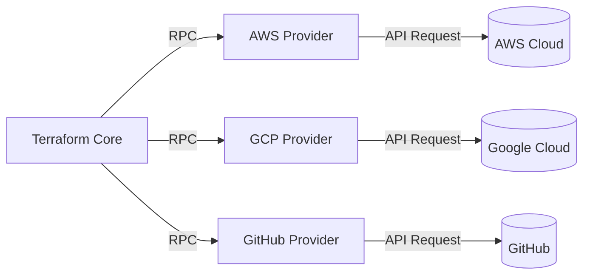
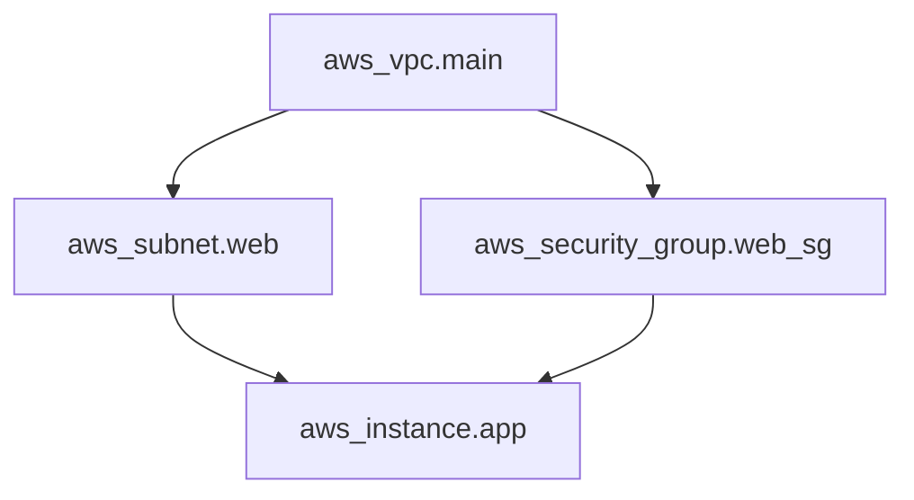
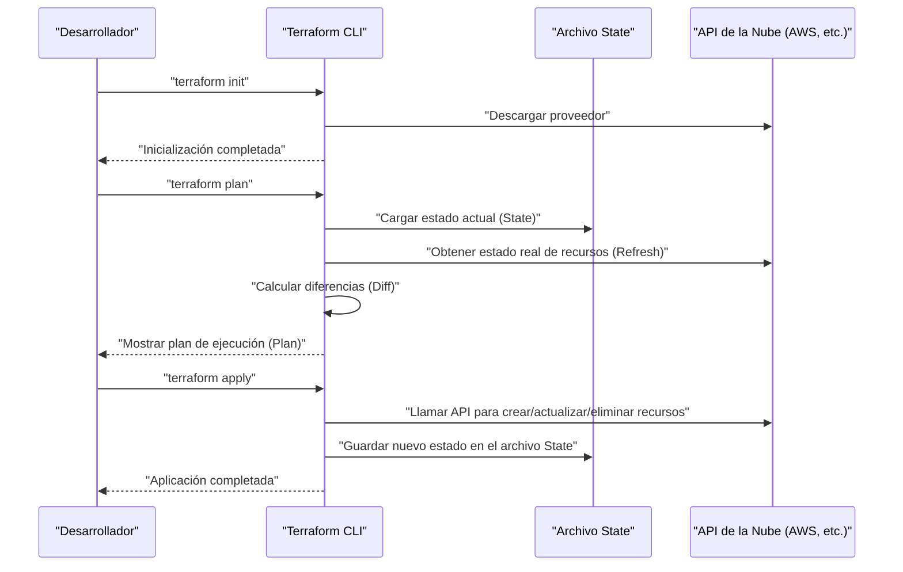
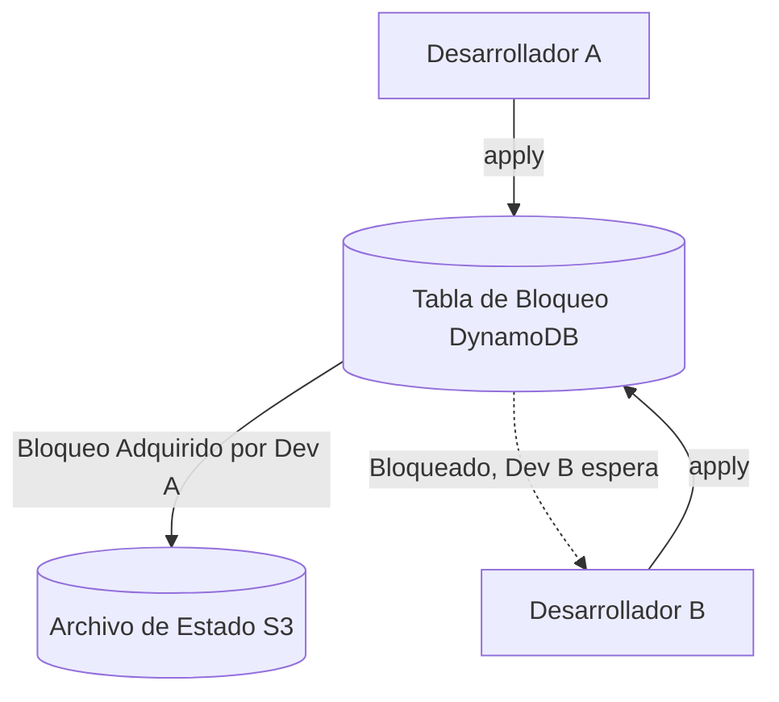
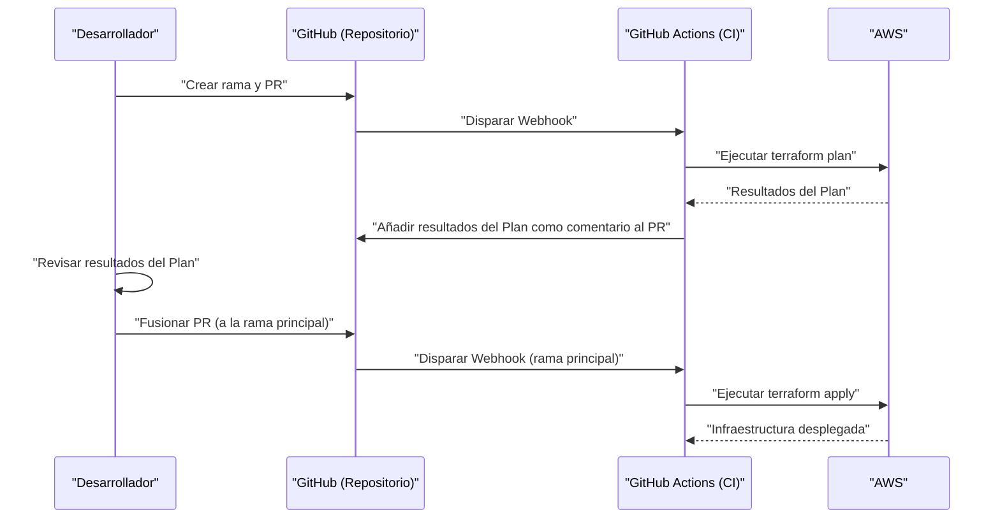

# Introducción: La evolución de la infraestructura y el auge de IaC

En el mundo del desarrollo de sistemas, hace tiempo que se produjo un cambio de paradigma para gestionar no solo el código de la aplicación, sino también la propia infraestructura como código. Eso es **Infrastructure as Code (IaC)**. La construcción manual de servidores (la llamada "construcción basada en manuales" u "operaciones de clics") era un semillero de errores humanos y tenía el problema fatal de carecer de escalabilidad y reproducibilidad.

En este artículo, comenzaremos con el concepto de IaC y nos centraremos en **Terraform** , que puede considerarse su estándar de facto. Explicaremos con gran detalle la filosofía de "gestión de configuración declarativa" adoptada por Terraform, su arquitectura interna, el mecanismo de gestión de estado (State) y las mejores prácticas.

---

# 1. ¿Qué es Infrastructure as Code (IaC)?

## 1.1. Los métodos tradicionales y sus limitaciones

Antes de la popularización del cloud computing, o en los primeros entornos en la nube, los ingenieros de infraestructura creaban recursos manualmente desde consolas GUI (como AWS Management Console o Azure Portal).
Si bien este método era intuitivo y tenía una curva de aprendizaje baja, presentaba las siguientes limitaciones:

- **Falta de reproducibilidad** : El riesgo de que los manuales estén desactualizados o de que la configuración varíe según la interpretación del operador.
- **Dificultad de auditoría y seguimiento** : Es difícil mantener un historial de "quién, cuándo y por qué" se realizaron los cambios.
- **Barrera de escalabilidad** : Al construir cientos de servidores, el trabajo manual requiere demasiado tiempo físico.

## 1.2. Beneficios de IaC

Al codificar la infraestructura, se pueden aplicar las excelentes prácticas cultivadas en el desarrollo de software a la construcción de infraestructuras.

1. **Control de versiones** : Mediante el uso de un VCS (Sistema de Control de Versiones) como Git, se puede gestionar el historial de cambios de la infraestructura.
2. **Proceso de revisión** : Permite la revisión del código a través de Pull Requests (PR), lo que garantiza la calidad antes de realizar los cambios.
3. **Automatización e Integración Continua** : Al incorporarlo en pipelines de [CI/CD](https://kenji.blog/es/p/cicd-pipeline-github-actions-best-practices/), se pueden automatizar las pruebas y despliegues.
4. **Coherencia e Idempotencia (Idempotency)** : Se garantiza que sin importar cuántas veces se ejecute, el resultado final (estado) será siempre el mismo.

## 1.3. Diferencias entre el enfoque Imperativo (Imperative) y Declarativo (Declarative)

Las herramientas de IaC se pueden dividir en dos enfoques principales: "imperativo" y "declarativo".

### Enfoque Imperativo (Imperative)
Se describe **"cómo (How) construir la infraestructura"**. Esto incluye scripts (Bash o Python) o Ansible (que es parcialmente declarativo pero fuertemente imperativo al ser consciente del orden de ejecución de las tareas).
- Ejemplo: "Lanzar 1 instancia EC2, luego crear un bucket S3 y obtener la dirección IP de la EC2."

### Enfoque Declarativo (Declarative)
Se describe **"cuál (What) debe ser el estado final deseado"**. El sistema compara el estado actual con el estado ideal definido y calcula automáticamente los cambios necesarios para aplicarlos. **Terraform** es el principal representante de este enfoque.
- Ejemplo: "Debe existir 1 instancia EC2 y un bucket S3."

---

# 2. ¿Qué es Terraform?

Terraform es una herramienta de IaC de código abierto desarrollada en Go por HashiCorp. Permite configurar y gestionar cualquier API, desde infraestructura en la nube hasta configuraciones SaaS, como código.

## 2.1. Arquitectura de Proveedores (Provider)

La mayor fortaleza de Terraform radica en su **independencia de plataforma** y su **ecosistema de proveedores**. El propio Terraform (Core) no crea recursos directamente. En su lugar, se comunica con las API de cada servicio a través de complementos llamados "Providers".



Esto permite gestionar de forma integrada servicios completamente diferentes como AWS, Datadog y GitHub en una única base de código.

## 2.2. HCL (HashiCorp Configuration Language)

La configuración de Terraform se escribe utilizando **HCL** , que es compatible con JSON pero más fácil de leer y escribir para los humanos. A continuación se muestra un ejemplo sencillo que define una instancia EC2 de AWS.

```hcl
provider "aws" {
  region = "ap-northeast-1"
}

resource "aws_instance" "web" {
  ami           = "ami-0c3fd0f5d33134a76"
  instance_type = "t3.micro"

  tags = {
    Name        = "WebServer"
    Environment = "Production"
  }
}
```

Este código declara "el estado de que existe una instancia EC2 con la AMI y el tipo de instancia especificados en la región de Tokio".

---

# 3. La Filosofía de la Gestión de Configuración Declarativa

El núcleo de Terraform reside en este enfoque **declarativo (Declarative)**. ¿Por qué es superior este enfoque?

## 3.1. Cálculo automático de estados y resolución de dependencias

En los scripts imperativos, los humanos deben escribir con precisión el orden en el que se crean los recursos. Por ejemplo, el procedimiento de crear una VPC, luego crear una subred y ubicar una EC2 dentro de esa subred.

En Terraform, a partir de las relaciones de referencia que aparecen en el código (por ejemplo, referenciar `aws_vpc.main.id` en la configuración de la subred), Terraform Core construye automáticamente un **Grafo de Dependencias (Dependency Graph)**.



Mediante este enfoque basado en la teoría de grafos, Terraform logra lo siguiente:
- **Creación en paralelo** de recursos sin dependencias (mayor velocidad).
- Creación, actualización y eliminación de recursos en el orden correcto.

## 3.2. Idempotencia (Idempotency)

Otro beneficio del enfoque declarativo es la **idempotencia**. Sin importar cuántas veces se ejecute `terraform apply` con el mismo código, el estado final de la infraestructura coincidirá exactamente con lo descrito en el código. Para los recursos que ya están en el estado esperado, Terraform determinará que "no hay cambios (No changes)".

Esto lo libera de la pesadilla operativa de "si ocurre un error a la mitad del script, comprobar manualmente hasta dónde se ejecutó, arreglar el script y volver a ejecutar".

---

# 4. Flujo de Ejecución: Init, Plan, Apply

Las operaciones básicas de Terraform se dividen en gran medida en 3 fases. Este flujo de trabajo es lo que hace posible cambios de infraestructura seguros.



### 1. `terraform init`
Inicializa el directorio de trabajo. Descarga los complementos del proveedor especificado y configura el backend (el destino donde se guarda el State).

### 2. `terraform plan`
Realiza un simulacro (Dry-Run). Compara el código escrito con el estado actual de la infraestructura y muestra "qué se agregará (+), modificará (~) y eliminará (-)". En esta fase, se revisa para asegurar que no haya eliminaciones accidentales de recursos.

### 3. `terraform apply`
Aplica el plan de cambios propuesto en `plan` directamente al proveedor de la nube.

---

# 5. Gestión de Estado: Las profundidades del archivo State

Un concepto inevitable para comprender Terraform es el **estado (State)**.

## 5.1. ¿Qué es terraform.tfstate?

Terraform genera y gestiona un archivo en formato JSON llamado `.tfstate` para mapear el código (el estado ideal) con la infraestructura real.

¿Por qué es necesario el archivo State? Podría parecer que bastaría con llamar a la API de la nube cada vez para obtener todos los recursos.
Las razones son las siguientes:

1. **Almacenamiento de metadatos y dependencias** : Para almacenar en caché los metadatos específicos de Terraform y los grafos de dependencias al crear recursos que las API de la nube no devuelven.
2. **Rendimiento** : En infraestructuras a gran escala, si se obtiene el estado de todos los recursos a través de la API en cada ocasión, puede causar tiempos de espera (timeouts) o superar los límites de la tasa de la API.
3. **Seguimiento de recursos** : Si se elimina la definición de un recurso del código, Terraform identifica el "recurso que existe en el archivo State pero no en el código" y ejecuta la acción de eliminación. Sin un State, los recursos eliminados del código simplemente quedarían "abandonados".

## 5.2. Remote State y Gestión de Bloqueos

En el desarrollo en equipo, mantener `terraform.tfstate` en la máquina local es un **antipatrón absoluto**. Si varias personas ejecutan `terraform apply` al mismo tiempo, el State entrará en conflicto y corromperá la infraestructura.

Esto se resuelve mediante **Remote State** y **State Locking**.
En un entorno de AWS, lo estándar es usar un bucket S3 como destino del State y DynamoDB para la gestión de bloqueos.

```hcl
terraform {
  backend "s3" {
    bucket         = "my-terraform-state-bucket"
    key            = "prod/terraform.tfstate"
    region         = "ap-northeast-1"
    dynamodb_table = "terraform-state-lock"
    encrypt        = true
  }
}
```



Al configurarlo de esta manera, mientras el Desarrollador A ejecuta `apply`, se escribe un bloqueo en DynamoDB y la ejecución del Desarrollador B se bloquea.

## 5.3. Detección y corrección de Desviación (Drift)

La modificación de la infraestructura fuera de Terraform (por ejemplo, manualmente desde la consola GUI) se denomina **Desviación de configuración (Configuration Drift)**.

Al ejecutar `plan` o `apply`, Terraform primero obtiene (Refresh) el estado real más reciente de la nube y actualiza el archivo State. Luego, al compararlo con el código, puede detectar los cambios manuales y "revertirlos (o proponer correcciones)" al estado original definido por el código.

---

# 6. Modularización y Reutilización

A medida que el sistema crece, también lo hace la base del código de Terraform. Para mantener el principio DRY (Don't Repeat Yourself), Terraform cuenta con un mecanismo llamado **Module (módulos)**.

## 6.1. Conceptos básicos de los módulos

Un módulo es un contenedor que agrupa recursos relacionados. Al encapsular una función específica (por ejemplo, todo un conjunto de red VPC, un clúster ECS, etc.) y definir las variables de entrada (Variables) y salidas (Outputs), se pueden crear componentes reutilizables.

**Ejemplo de estructura de directorios:**
```text
.
├── environments
│   ├── prod
│   │   └── main.tf      # Llamar al módulo desde el entorno de producción
│   └── stg
│       └── main.tf      # Llamar al módulo desde el entorno de STG
└── modules
    └── vpc
        ├── main.tf      # Definición de recursos dentro del módulo
        ├── variables.tf # Entrada al módulo
        └── outputs.tf   # Salida del módulo
```

**Llamando al módulo (`environments/prod/main.tf`):**
```hcl
module "vpc" {
  source = "../../modules/vpc"

  vpc_cidr             = "10.0.0.0/16"
  environment          = "prod"
  enable_dns_hostnames = true
}
```

Diseñando módulos de esta forma, se puede construir fácilmente la misma arquitectura de red en entornos STG o de desarrollo simplemente cambiando los parámetros (variables).

---

# 7. Funcionalidades Avanzadas de Terraform

El HCL de Terraform no es solo un archivo de configuración, sino que también incluye funciones para incorporar algo de lógica.

## 7.1. Bloques dinámicos (dynamic block)

Generan de forma dinámica bloques anidados basados en una lista o un mapa. Esto resulta muy útil, por ejemplo, para configurar las reglas de un grupo de seguridad.

```hcl
resource "aws_security_group" "web" {
  name   = "web-sg"
  vpc_id = aws_vpc.main.id

  dynamic "ingress" {
    for_each = var.allowed_web_ports
    content {
      from_port   = ingress.value
      to_port     = ingress.value
      protocol    = "tcp"
      cidr_blocks = ["0.0.0.0/0"]
    }
  }
}
```

## 7.2. Diferencia entre for_each y count

Al crear múltiples recursos similares, se usa `count` o `for_each`.

- **count** : Crea la cantidad especificada de recursos. Debido a que depende del índice de la lista, si se elimina un elemento intermedio, los índices se desplazarán y los recursos posteriores correrán el riesgo de ser recreados o eliminados sin intención.
- **for_each** : Recibe un conjunto de mapas o cadenas y crea recursos basados en cada clave. Es resistente al desplazamiento de índices, por lo que **se recomienda usar for_each** para crear recursos en bucle.

---

# 8. Integración con pipelines [CI/CD](https://kenji.blog/es/p/cicd-pipeline-github-actions-best-practices/) (GitOps)

El verdadero valor de Terraform se revela cuando se integra en los flujos de trabajo de GitOps. Se prohíbe realizar un `apply` de forma local y todos los cambios se automatizan a través de Pull Requests.



## 8.1. Desplazamiento a la izquierda en Seguridad (Shift-Left)

Debería integrar herramientas de análisis estático en el pipeline de [CI/CD](https://kenji.blog/es/p/cicd-pipeline-github-actions-best-practices/) para detectar vulnerabilidades en la infraestructura de forma temprana.
- **tfsec** o **checkov**: Escanean el código en busca de riesgos de seguridad como "Bucket S3 expuesto públicamente" o "Base de datos sin cifrar", y detienen la CI con un error si se encuentra algún problema.

---

# 9. Enfoque matemático para la Confiabilidad y Modelado de Costos

Al diseñar infraestructura usando IaC, es importante evaluar el equilibrio entre confiabilidad (Reliability) y costo.
Por ejemplo, la disponibilidad de un sistema en una arquitectura Multi-AZ (Zona de Disponibilidad) puede expresarse mediante modelos matemáticos.

Supongamos que la confiabilidad de un componente individual (AZ) es $R_1$.
Si los recursos se implementan en 2 AZ (redundancia) y consideramos que el sistema global funciona si cualquiera de ellos está activo, la confiabilidad total del sistema $R_{total}$ se expresa con la siguiente fórmula:

$$
R_{total} = 1 - (1 - R_1)(1 - R_2)
$$

Al diseñar módulos en Terraform, establecer el número de `az_count` como variable de entrada y permitir el despliegue automático de la infraestructura que cumple con los requisitos basados en este modelo matemático, es una habilidad de diseño avanzada requerida por un arquitecto.

---

# 10. Mejores Prácticas y Antipatrones Prácticos

## Mejores Prácticas
1. **División de archivos State** : Consolidar toda la infraestructura en un solo archivo State amplía demasiado el alcance del impacto y hace que la ejecución de `plan` sea lenta. Divida el State (y los directorios) en unidades con diferentes ciclos de vida, como "Redes (VPC, etc.)", "Bases de Datos" y "Aplicaciones".
2. **Fijar versiones** : Asegúrese de fijar (pinning) la versión principal de Terraform y la versión del Proveedor. Esto protege la infraestructura contra cambios destructivos en las actualizaciones de versión.
3. **Uso de Fuentes de Datos (Data Sources)** : Cuando haga referencia a otros States o recursos existentes, use el bloque `data` para obtener valores dinámicamente en lugar de codificarlos (hardcodearlos).

## Antipatrones
1. **Mezclar con cambios manuales** : Modificar los recursos gestionados por Terraform directamente desde la GUI. Provocará inconsistencias en el State.
2. **Hardcoding de credenciales** : Escribir claves de acceso o claves secretas directamente en el código. Utilice variables de entorno o roles de IAM (integración [OIDC](https://kenji.blog/es/p/oauth2-oidc-authentication-authorization-difference/), etc.).
3. **Módulos demasiado complejos** : Intentar incluir cada característica en un módulo da lugar a docenas de variables y reduce en gran medida la legibilidad. Mantenga en mente la regla de "un módulo tiene una sola responsabilidad (Single Responsibility)".

---

# 11. Conclusión

**Infrastructure as Code** es una práctica esencial en el desarrollo de software moderno. Entre ellas, **Terraform** ha establecido su posición como el estándar de facto para IaC con su poderosa filosofía de "gestión de configuración declarativa", seguimiento avanzado de estado con State y un rico ecosistema de proveedores en múltiples plataformas.

Sin embargo, no puede aprovechar al máximo sus beneficios simplemente introduciendo la herramienta. Al combinar "mejores prácticas" como la estructuración del código con módulos, el desarrollo en equipo con State remoto y bloqueos, la implementación de GitOps mediante la integración con [CI/CD](https://kenji.blog/es/p/cicd-pipeline-github-actions-best-practices/), y el enfoque de shift-left en seguridad, será posible operar de manera segura y escalable la infraestructura por primera vez.

La infraestructura ya no es algo que se "crea con clics". Al igual que el software, estamos en una era en la que se "codifica, se prueba y se implementa continuamente". Domine Terraform y construya una arquitectura de infraestructura robusta y hermosa.
