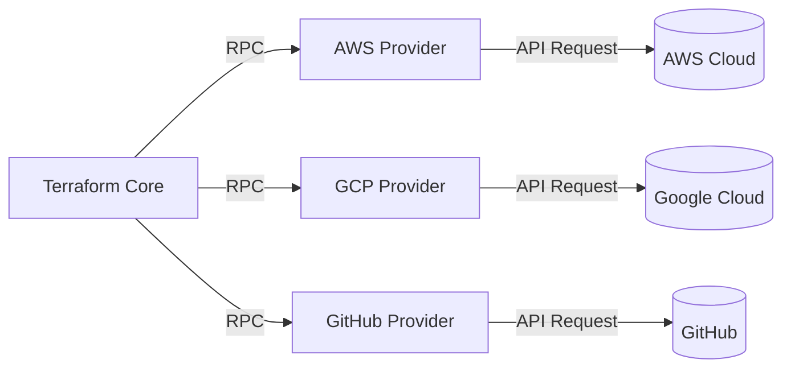
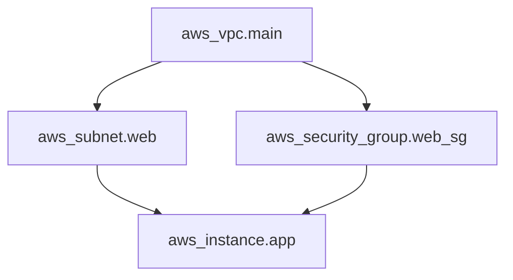
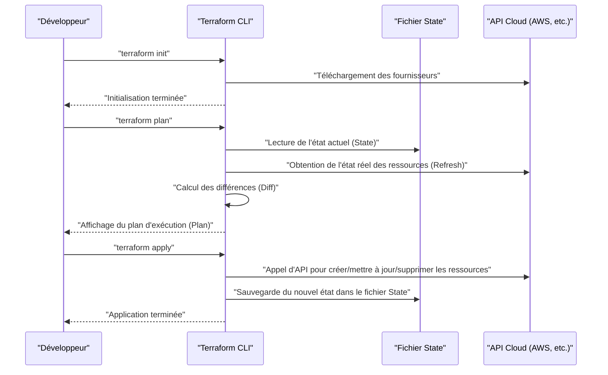
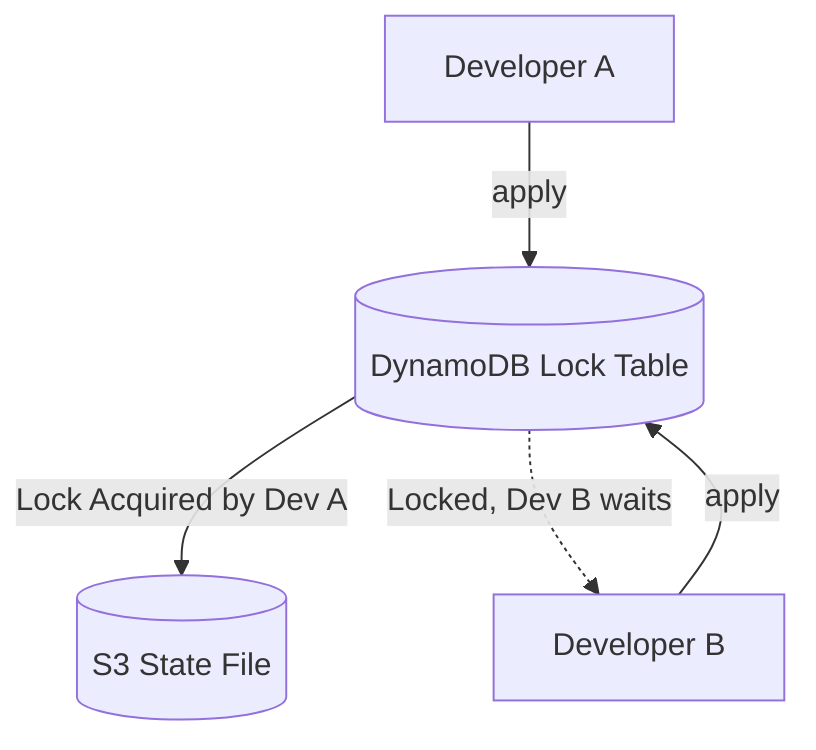
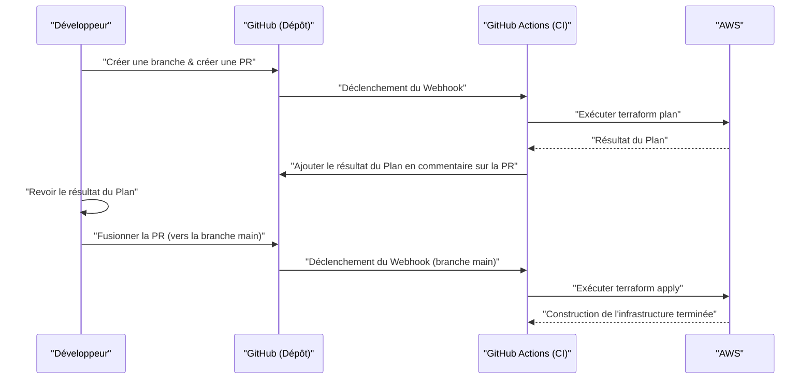

# Introduction : l'évolution de l'infrastructure et l'essor de l'IaC

Dans le monde du développement de systèmes, cela fait un moment qu'un changement de paradigme s'est produit : gérer non seulement le code de l'application, mais aussi l'infrastructure elle-même comme du code. C'est ce qu'on appelle **Infrastructure as Code (IaC)**. La création manuelle de serveurs (ce qu'on appelle "création basée sur des manuels" ou "opérations par clic") était un terrain propice aux erreurs humaines et souffrait de problèmes fatals tels qu'un manque de scalabilité et de reproductibilité.

Dans cet article, nous partirons du concept de l'IaC pour nous concentrer sur **Terraform**, qui peut être considéré comme son standard de facto. Nous expliquerons en détail la philosophie de la "gestion de configuration déclarative" adoptée par Terraform, son architecture interne, son mécanisme de gestion de l'état (State), ainsi que les meilleures pratiques concrètes.

---

# 1. Qu'est-ce que l'Infrastructure as Code (IaC) ?

## 1.1. Les méthodes traditionnelles et leurs limites

Avant la généralisation du cloud computing, ou dans les premiers environnements cloud, les ingénieurs d'infrastructure créaient les ressources manuellement depuis une console GUI (comme AWS Management Console ou Azure Portal).
Bien que cette méthode soit intuitive et que son coût d'apprentissage soit faible, elle présentait les limites suivantes :

- **Manque de reproductibilité** : Risque que le manuel soit obsolète ou que les paramètres diffèrent selon l'interprétation de l'opérateur.
- **Difficulté d'audit et de suivi** : Il est difficile de garder une trace de "qui, quand, et pourquoi" a effectué une modification.
- **Le mur de l'échelle** : Créer manuellement des centaines de serveurs prend physiquement trop de temps.

## 1.2. Les avantages de l'IaC

En codant l'infrastructure, il devient possible d'appliquer à la création d'infrastructures les excellentes pratiques développées dans le développement de logiciels.

1. **Gestion de version** : Vous pouvez gérer l'historique des modifications de l'infrastructure à l'aide de systèmes de contrôle de version (VCS) comme Git.
2. **Processus de révision** : Les revues de code via les Pull Requests (PR) deviennent possibles, garantissant la qualité avant toute modification.
3. **Automatisation et intégration continue** : En l'intégrant à un pipeline [CI/CD](https://kenji.blog/fr/p/cicd-pipeline-github-actions-best-practices/), les tests et les déploiements peuvent être automatisés.
4. **Cohérence et idempotence (Idempotency)** : Peu importe le nombre d'exécutions, il est garanti d'obtenir toujours le même résultat (état).

## 1.3. Différence entre le style impératif (Imperative) et déclaratif (Declarative)

Les outils IaC peuvent être globalement divisés en deux approches : "impérative" et "déclarative".

### Style impératif (Imperative)
Il décrit **"comment (How) créer l'infrastructure"**. Les scripts (Bash ou Python) ou Ansible (bien que partiellement déclaratif, il a un fort aspect impératif en ce sens qu'il tient compte de l'ordre d'exécution des tâches) entrent dans cette catégorie.
- Exemple : "Démarrer une instance EC2, puis créer un bucket S3, et obtenir l'adresse IP de l'EC2."

### Style déclaratif (Declarative)
Il décrit **"quel doit être l'état final (What)"**. Le système compare l'état actuel avec l'état idéal défini, et calcule puis applique automatiquement les modifications nécessaires. **Terraform** est le représentant typique de cette approche.
- Exemple : "Il y a 1 instance EC2 et le bucket S3 existe."

---

# 2. Qu'est-ce que Terraform ?

Terraform est un outil IaC open-source développé en Go par HashiCorp. Il permet de configurer et de gérer toute API sous forme de code, de l'infrastructure cloud aux paramètres SaaS.

## 2.1. Architecture des fournisseurs (Provider)

La plus grande force de Terraform réside dans son **indépendance de plateforme** et son **écosystème de fournisseurs**. Terraform Core (le noyau) ne crée pas de ressources directement. Au lieu de cela, il communique avec l'API de chaque service via un plugin appelé "Provider".



Cela permet de gérer de manière intégrée des services complètement différents comme AWS, Datadog et GitHub au sein d'une même base de code.

## 2.2. HCL (HashiCorp Configuration Language)

La configuration de Terraform est écrite en **HCL**, qui est compatible JSON tout en étant facile à lire et à écrire pour les humains. Voici un exemple simple définissant une instance EC2 sur AWS :

```hcl
provider "aws" {
  region = "ap-northeast-1"
}

resource "aws_instance" "web" {
  ami           = "ami-0c3fd0f5d33134a76"
  instance_type = "t3.micro"

  tags = {
    Name        = "WebServer"
    Environment = "Production"
  }
}
```

Ce code déclare "l'état dans lequel une instance EC2 ayant l'AMI et le type d'instance spécifiés existe dans la région de Tokyo".

---

# 3. La philosophie de la gestion de configuration déclarative

Le cœur de Terraform réside dans cette approche **déclarative (Declarative)**. Pourquoi cette approche est-elle supérieure ?

## 3.1. Calcul automatique de l'état et résolution des dépendances

Avec des scripts de type impératif, un humain doit décrire précisément l'ordre dans lequel les ressources sont créées. Par exemple, la procédure consiste à créer un VPC, puis à créer un sous-réseau, et enfin à placer un EC2 dans ce sous-réseau.

Dans Terraform, à partir des relations de référence apparaissant dans le code (par exemple, référencer `aws_vpc.main.id` dans la configuration du sous-réseau), Terraform Core construit automatiquement un **graphe de dépendances (Dependency Graph)**.



Grâce à cette approche basée sur la théorie des graphes, Terraform réalise les choses suivantes :
- **Création parallèle** des ressources sans dépendances (accélération).
- Création, mise à jour et suppression des ressources dans le bon ordre.

## 3.2. Idempotence (Idempotency)

Un autre avantage de l'approche déclarative est l'**idempotence**. Peu importe combien de fois vous exécutez `terraform apply` sur le même code, l'état final de l'infrastructure correspondra parfaitement à ce qui est décrit dans le code. Pour les ressources qui sont déjà dans l'état attendu, Terraform détermine qu'"aucune modification n'est nécessaire (No changes)".

Cela vous libère du cauchemar opérationnel tel que : "Si une erreur se produit au milieu du script, il faut vérifier manuellement jusqu'où il a été exécuté, corriger le script, puis le réexécuter."

---

# 4. Flux d'exécution : Init, Plan, Apply

Les opérations de base de Terraform sont divisées en 3 grandes phases. C'est ce flux de travail qui permet des modifications d'infrastructure en toute sécurité.



### 1. `terraform init`
Initialise le répertoire de travail. Télécharge les plugins du fournisseur spécifié et configure le backend (la destination de sauvegarde de l'état).

### 2. `terraform plan`
Effectue un test à blanc (Dry-Run). Compare la description du code avec l'état réel actuel de l'infrastructure et indique "ce qui sera ajouté (+), modifié (~), ou supprimé (-)". Durant cette phase, on passe en revue s'il n'y a pas de suppressions involontaires de ressources.

### 3. `terraform apply`
Applique réellement le plan de modification présenté lors du `plan` au fournisseur cloud.

---

# 5. Gestion de l'état : Les abysses du fichier State

Un concept incontournable pour comprendre Terraform est celui de l'**État (State)**.

## 5.1. Qu'est-ce que terraform.tfstate ?

Terraform génère et gère un fichier au format JSON appelé `.tfstate` pour mapper le code (l'état idéal) avec l'infrastructure réelle.

Pourquoi avoir besoin d'un fichier State ? Il semblerait plus simple d'appeler l'API cloud à chaque fois pour obtenir toutes les ressources.
Les raisons sont les suivantes :

1. **Sauvegarde des métadonnées et dépendances** : Pour mettre en cache les métadonnées spécifiques à Terraform, que l'API cloud ne renvoie pas, ainsi que le graphe de dépendances au moment de la création des ressources.
2. **Performances** : Dans une infrastructure à grande échelle, obtenir l'état de toutes les ressources via l'API à chaque fois entraînerait des dépassements de délai (timeouts) ou des limites de taux d'API.
3. **Suivi des ressources** : Si vous supprimez la définition d'une ressource du code, Terraform identifie "les ressources présentes dans le fichier State mais absentes du code" et exécute une action de suppression. Sans State, les ressources disparues du code seraient simplement "abandonnées".

## 5.2. Remote State et gestion des verrous

Dans un développement en équipe, placer le fichier `terraform.tfstate` sur une machine locale est un **anti-pattern absolu**. Si plusieurs personnes exécutent simultanément `terraform apply`, les états entreront en conflit et l'infrastructure sera corrompue.

La solution à cela est le **Remote State** et le **State Locking** (verrouillage de l'état).
Dans un environnement AWS, il est standard d'utiliser un bucket S3 pour stocker l'état et DynamoDB pour gérer les verrous.

```hcl
terraform {
  backend "s3" {
    bucket         = "my-terraform-state-bucket"
    key            = "prod/terraform.tfstate"
    region         = "ap-northeast-1"
    dynamodb_table = "terraform-state-lock"
    encrypt        = true
  }
}
```



En configurant ainsi, pendant que le Developer A exécute un `apply`, un verrou est écrit dans DynamoDB et l'exécution du Developer B est bloquée.

## 5.3. Détection et correction des dérives (Drift)

Le fait que l'infrastructure soit modifiée en dehors de Terraform (par exemple, manuellement depuis la console GUI) s'appelle une **dérive de configuration (Configuration Drift)**.

Lors de l'exécution de `plan` ou `apply`, Terraform obtient d'abord (Refresh) l'état réel actuel sur le cloud pour mettre à jour le fichier State. Ensuite, en le comparant au code, il peut détecter les modifications manuelles et "ramener (ou proposer de corriger)" vers l'état initial défini dans le code.

---

# 6. Modularisation et réutilisabilité

À mesure que le système grandit, la base de code Terraform gonfle également. Pour respecter le principe DRY (Don't Repeat Yourself), Terraform dispose d'un mécanisme appelé **Module**.

## 6.1. Les bases des modules

Un module est un conteneur regroupant des ressources liées. En encapsulant une fonctionnalité spécifique (par ex. un ensemble réseau VPC, un cluster ECS, etc.) et en définissant des variables d'entrée (Variables) et des sorties (Outputs), vous créez des composants réutilisables.

**Exemple de structure de répertoires :**
```text
.
├── environments
│   ├── prod
│   │   └── main.tf      # Appelle le module depuis l'environnement de production
│   └── stg
│       └── main.tf      # Appelle le module depuis l'environnement STG
└── modules
    └── vpc
        ├── main.tf      # Définition des ressources dans le module
        ├── variables.tf # Entrées pour le module
        └── outputs.tf   # Sorties depuis le module
```

**Côté appelant du module (`environments/prod/main.tf`) :**
```hcl
module "vpc" {
  source = "../../modules/vpc"

  vpc_cidr             = "10.0.0.0/16"
  environment          = "prod"
  enable_dns_hostnames = true
}
```

En concevant des modules de cette manière, la même configuration réseau peut être facilement déployée dans des environnements STG ou de développement, en modifiant simplement les paramètres (variables).

---

# 7. Fonctionnalités avancées de Terraform

Le HCL de Terraform n'est pas qu'un simple fichier de configuration ; il possède également des fonctionnalités pour intégrer une certaine logique.

## 7.1. Blocs dynamiques (dynamic block)

Génère dynamiquement des blocs imbriqués en fonction de listes ou de maps. Par exemple, c'est très utile pour configurer les règles de groupes de sécurité.

```hcl
resource "aws_security_group" "web" {
  name   = "web-sg"
  vpc_id = aws_vpc.main.id

  dynamic "ingress" {
    for_each = var.allowed_web_ports
    content {
      from_port   = ingress.value
      to_port     = ingress.value
      protocol    = "tcp"
      cidr_blocks = ["0.0.0.0/0"]
    }
  }
}
```

## 7.2. Utilisation appropriée de for_each et count

Lorsque vous créez plusieurs ressources similaires, utilisez `count` ou `for_each`.

- **count** : Crée autant de ressources que l'entier spécifié. Comme il dépend de l'index de la liste, si un élément intermédiaire est supprimé, les index se décalent, ce qui risque d'entraîner la recréation ou la suppression involontaire des ressources suivantes.
- **for_each** : Prend une map ou un ensemble de chaînes de caractères et crée des ressources en fonction de chaque clé. Il résiste bien aux décalages d'index, c'est pourquoi **l'utilisation de for_each est recommandée** pour les boucles sur les ressources.

---

# 8. Intégration avec les pipelines [CI/CD](https://kenji.blog/fr/p/cicd-pipeline-github-actions-best-practices/) (GitOps)

La véritable valeur de Terraform se révèle lorsqu'il est intégré dans un flux de travail GitOps. On interdit les `apply` locaux et on automatise toutes les modifications via des Pull Requests.



## 8.1. Décalage à gauche (Shift-Left) de la sécurité

Des outils d'analyse statique doivent être intégrés au pipeline [CI/CD](https://kenji.blog/fr/p/cicd-pipeline-github-actions-best-practices/) pour découvrir tôt les vulnérabilités de l'infrastructure.
- **tfsec** ou **checkov** : Ils scannent au niveau du code les risques de sécurité tels que "le bucket S3 est rendu public" ou "la base de données n'est pas chiffrée", et arrêtent la CI avec une erreur s'il y a des problèmes.

---

# 9. Approche mathématique de la fiabilité et de la modélisation des coûts

Lors de la conception d'infrastructures à l'aide de l'IaC, il est important d'évaluer l'équilibre entre la fiabilité (Reliability) et les coûts.
Par exemple, le taux de disponibilité d'un système dans une configuration multi-AZ (Availability Zone) peut être exprimé par un modèle mathématique.

Soit la fiabilité d'un seul composant (AZ) notée $R_1$.
Si l'on place des ressources dans 2 AZ (redondance) et que l'on considère que le système global fonctionne si l'un ou l'autre est opérationnel, la fiabilité du système global $R_{total}$ est exprimée par la formule suivante.

$$
R_{total} = 1 - (1 - R_1)(1 - R_2)
$$

Lors de la conception d'un module avec Terraform, fournir une variable d'entrée `az_count` pour déployer automatiquement une infrastructure qui répond aux exigences basées sur ce modèle mathématique est une compétence de conception avancée requise pour les architectes.

---

# 10. Meilleures pratiques concrètes et anti-patterns

## Meilleures pratiques
1. **Division des fichiers State** : Regrouper toute l'infrastructure dans un seul fichier State élargit trop la portée des impacts et ralentit l'exécution du `plan`. Divisez les States (et les répertoires) par cycles de vie, comme "Réseau (VPC, etc.)", "Base de données" et "Application".
2. **Fixation des versions** : Fixez (pinning) toujours la version de Terraform lui-même et celle du Provider. Cela protège votre infrastructure contre les modifications destructives causées par les mises à jour de version.
3. **Utilisation des sources de données (Data Sources)** : Lorsque vous référencez un autre State ou une ressource existante, ne les codez pas en dur, mais utilisez des blocs `data` pour récupérer les valeurs dynamiquement.

## Anti-patterns
1. **Mélanger avec des modifications manuelles** : Modifier directement depuis le GUI des ressources gérées par Terraform. Cela conduit à des incohérences dans le State.
2. **Codage en dur des identifiants (Credentials)** : Écrire des clés d'accès ou des clés secrètes directement dans le code. Veuillez utiliser des variables d'environnement ou des rôles IAM (comme la fédération [OIDC](https://kenji.blog/fr/p/oauth2-oidc-authentication-authorization-difference/)).
3. **Modules trop complexes** : Essayer de donner toutes les fonctionnalités à un module augmente le nombre de variables à des dizaines, ce qui diminue considérablement la lisibilité. Gardez à l'esprit "Un module a une seule responsabilité (Single Responsibility)".

---

# 11. Conclusion

**Infrastructure as Code** est une pratique indispensable dans le développement de logiciels moderne. Parmi eux, **Terraform** a établi sa position de standard de facto de l'IaC grâce à sa puissante philosophie de "gestion de configuration déclarative", son suivi de l'état avancé via le State, et son riche écosystème de fournisseurs multi-plateformes.

Cependant, il ne suffit pas d'introduire l'outil pour profiter pleinement de ses avantages. Ce n'est qu'en combinant des "meilleures pratiques" telles que la structuration du code avec des modules, la mise en place d'un système de développement en équipe avec le Remote State et le Locking, la réalisation de GitOps via l'intégration avec la [CI/CD](https://kenji.blog/fr/p/cicd-pipeline-github-actions-best-practices/), et le Shift-Left de la sécurité, qu'une exploitation sûre et scalable de l'infrastructure devient possible.

L'infrastructure n'est plus quelque chose que l'on "crée en cliquant". Tout comme le logiciel, c'est l'ère de "coder, tester et déployer en continu". Maîtrisez Terraform et construisez des architectures d'infrastructure robustes et élégantes.
