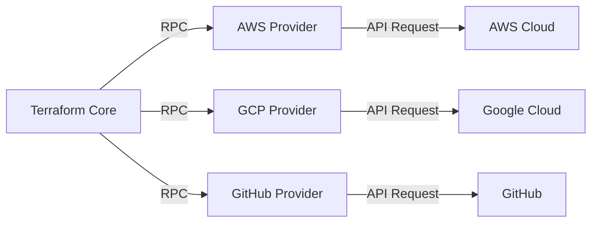
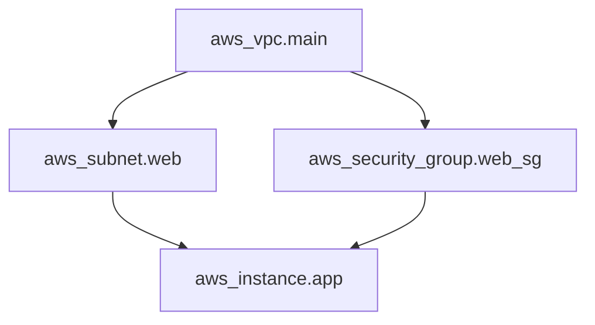
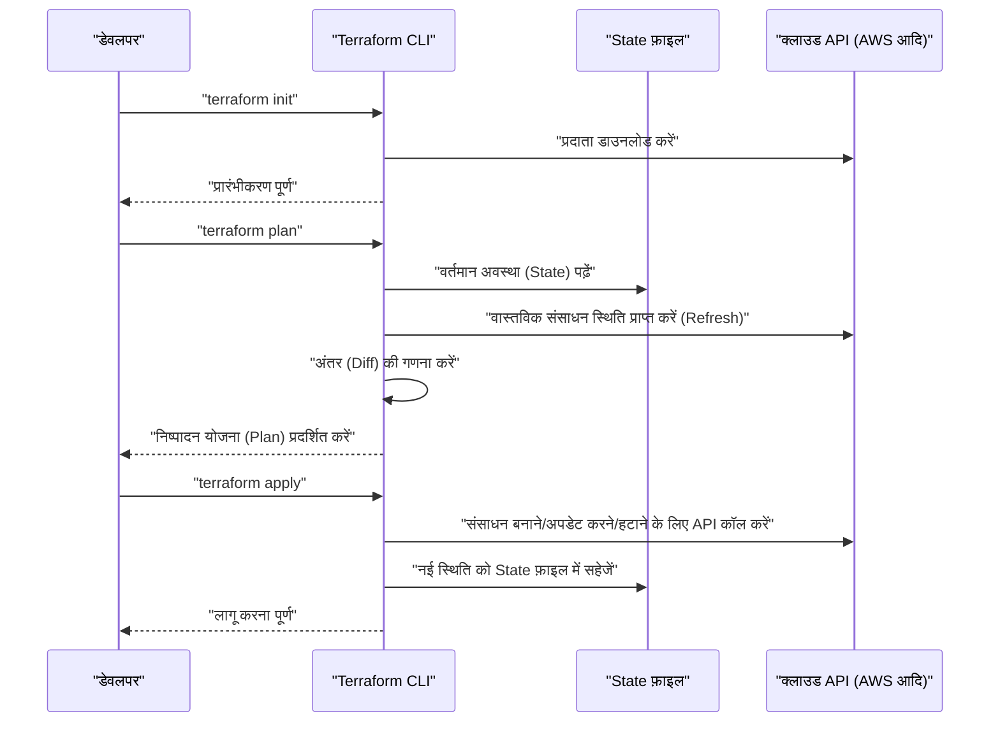
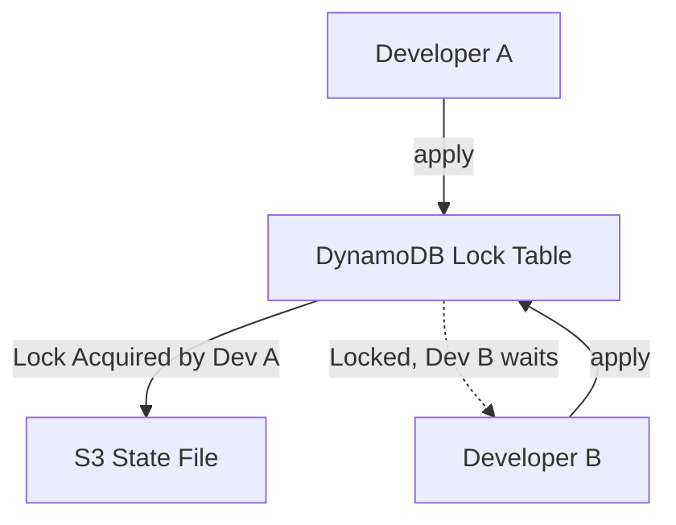
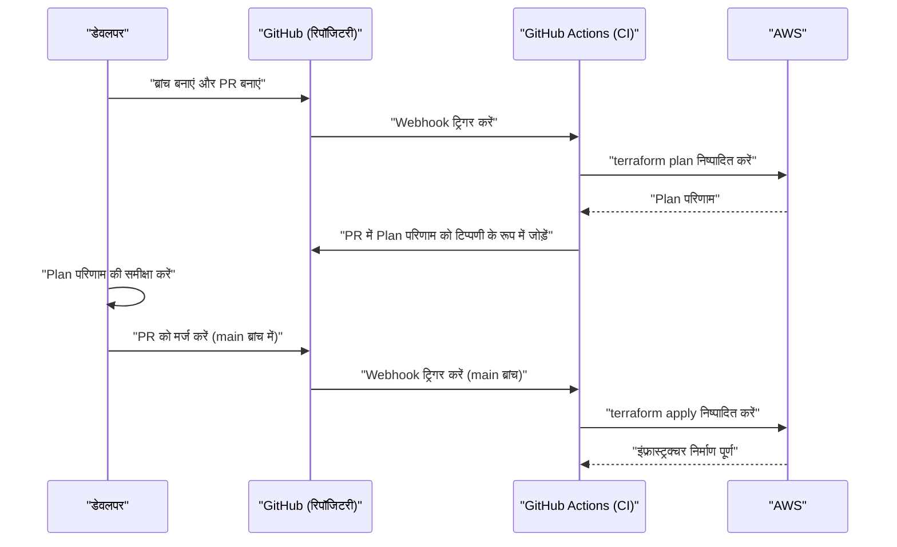

# परिचय: इंफ्रास्ट्रक्चर का विकास और IaC का उदय

सिस्टम विकास की दुनिया में, केवल एप्लिकेशन कोड ही नहीं, बल्कि इंफ्रास्ट्रक्चर को भी कोड के रूप में प्रबंधित करने के लिए एक पैराडाइम शिफ्ट हुए काफी समय हो गया है। यही **Infrastructure as Code (IaC)** है। मैन्युअल सर्वर निर्माण (जिसे "प्रक्रिया मैनुअल-आधारित निर्माण" या "क्लिक ऑपरेशन" कहा जाता है) मानवीय त्रुटियों का एक स्रोत था, और इसमें स्केलेबिलिटी और पुनरुत्पादन की कमी जैसी घातक समस्याएं थीं।

यह लेख IaC की अवधारणा से शुरू होता है और **Terraform** पर केंद्रित है, जिसे इसका वास्तविक मानक कहा जा सकता है। हम Terraform द्वारा अपनाए गए "डिक्लेरेटिव कॉन्फ़िगरेशन प्रबंधन" के दर्शन, आंतरिक वास्तुकला, अवस्था प्रबंधन (State) तंत्र और व्यावहारिक सर्वोत्तम प्रथाओं के बारे में बहुत विस्तार से बताएंगे।

---

# 1. Infrastructure as Code (IaC) क्या है

## 1.1. पारंपरिक तरीके और उनकी सीमाएं

क्लाउड कंप्यूटिंग के लोकप्रिय होने से पहले, या शुरुआती क्लाउड वातावरण में, इंफ्रास्ट्रक्चर इंजीनियर GUI कंसोल (जैसे AWS Management Console या Azure Portal) से मैन्युअल रूप से संसाधन बनाते थे।
यह तरीका सहज था और इसकी सीखने की लागत कम थी, लेकिन इसकी निम्नलिखित सीमाएं थीं:

- **पुनरुत्पादन की कमी** : प्रक्रिया मैनुअल के पुराने होने का जोखिम, या सेटिंग्स जो ऑपरेटर की व्याख्या के आधार पर भिन्न होती हैं।
- **ऑडिटिंग और ट्रैकिंग में कठिनाई** : इतिहास में यह रिकॉर्ड करना मुश्किल है कि "किसने, कब और क्यों" बदलाव किए।
- **स्केल की दीवार** : सैकड़ों सर्वर बनाते समय मैन्युअल काम में बहुत अधिक भौतिक समय लगता है।

## 1.2. IaC के लाभ

इंफ्रास्ट्रक्चर को कोड करके, सॉफ्टवेयर विकास में विकसित की गई उत्कृष्ट प्रथाओं को इंफ्रास्ट्रक्चर निर्माण में भी लागू किया जा सकता है।

1. **संस्करण नियंत्रण** : गिट (Git) जैसे वीसीएस (वर्जन कंट्रोल सिस्टम) का उपयोग करके इंफ्रास्ट्रक्चर परिवर्तनों के इतिहास का प्रबंधन किया जा सकता है।
2. **समीक्षा प्रक्रिया** : पुल रिक्वेस्ट (PR) के माध्यम से कोड समीक्षा संभव हो जाती है, जो बदलाव से पहले गुणवत्ता सुनिश्चित करती है।
3. **स्वचालन और निरंतर एकीकरण** : [CI/CD](https://kenji.blog/hi/p/cicd-pipeline-github-actions-best-practices/) पाइपलाइन में शामिल करके परीक्षण और परिनियोजन (Deployment) को स्वचालित किया जा सकता है।
4. **निरंतरता और आइडमपोटेंसी (Idempotency)** : यह गारंटी दी जाती है कि इसे कितनी भी बार निष्पादित किया जाए, परिणाम (अवस्था) हमेशा समान रहेगा।

## 1.3. प्रक्रियात्मक (Imperative) और घोषणात्मक (Declarative) के बीच अंतर

IaC टूल में मुख्य रूप से दो दृष्टिकोण होते हैं: "प्रक्रियात्मक" और "घोषणात्मक"।

### प्रक्रियात्मक (Imperative)
**"इंफ्रास्ट्रक्चर को कैसे (How) बनाया जाए"** का वर्णन करता है। स्क्रिप्ट (Bash या Python), या Ansible (आंशिक रूप से घोषणात्मक, लेकिन इस अर्थ में अत्यधिक प्रक्रियात्मक कि यह कार्य निष्पादन क्रम के प्रति सचेत है) इसके अंतर्गत आते हैं।
- उदाहरण: "1 EC2 इंस्टेंस शुरू करें, फिर एक S3 बकेट बनाएं, और EC2 का IP पता प्राप्त करें"

### घोषणात्मक (Declarative)
**"अंतिम अवस्था कैसी (What) होनी चाहिए"** का वर्णन करता है। सिस्टम वर्तमान अवस्था की तुलना परिभाषित आदर्श अवस्था से करता है, और आवश्यक परिवर्तनों की स्वचालित रूप से गणना और প্রয়োগ करता है। **Terraform** इस दृष्टिकोण का सबसे प्रमुख उदाहरण है।
- उदाहरण: "1 EC2 इंस्टेंस मौजूद होना चाहिए और एक S3 बकेट मौजूद होनी चाहिए"

---

# 2. Terraform क्या है

Terraform एक ओपन-सोर्स IaC टूल है जिसे HashiCorp द्वारा Go भाषा में विकसित किया गया है। क्लाउड इंफ्रास्ट्रक्चर से लेकर SaaS सेटिंग्स तक, सभी API को कोड के रूप में कॉन्फ़िगर और प्रबंधित किया जा सकता है।

## 2.1. प्रदाता (Provider) वास्तुकला

Terraform की सबसे बड़ी ताकत इसकी **प्लेटफ़ॉर्म स्वतंत्रता** और **प्रदाता पारिस्थितिकी तंत्र** है। Terraform कोर (Core) सीधे संसाधन नहीं बनाता है। इसके बजाय, यह "Provider" नामक प्लगइन्स के माध्यम से प्रत्येक सेवा के API के साथ संचार करता है।



यह AWS, Datadog और GitHub जैसी पूरी तरह से अलग सेवाओं को एक ही कोडबेस के तहत एकीकृत रूप से प्रबंधित करने की अनुमति देता है।

## 2.2. HCL (HashiCorp Configuration Language)

Terraform की सेटिंग्स **HCL** का उपयोग करके लिखी जाती हैं, जो JSON के अनुकूल होने के साथ-साथ इंसानों के लिए पढ़ने और लिखने में आसान है। नीचे AWS EC2 इंस्टेंस को परिभाषित करने वाला एक सरल उदाहरण दिया गया है।

```hcl
provider "aws" {
  region = "ap-northeast-1"
}

resource "aws_instance" "web" {
  ami           = "ami-0c3fd0f5d33134a76"
  instance_type = "t3.micro"

  tags = {
    Name        = "WebServer"
    Environment = "Production"
  }
}
```

यह कोड एक स्थिति की घोषणा करता है: "टोक्यो क्षेत्र में, निर्दिष्ट AMI और इंस्टेंस प्रकार के साथ एक EC2 इंस्टेंस मौजूद है।"

---

# 3. डिक्लेरेटिव कॉन्फ़िगरेशन प्रबंधन का दर्शन

Terraform का मूल इस **घोषणात्मक (Declarative)** दृष्टिकोण में निहित है। यह दृष्टिकोण इतना बेहतर क्यों है?

## 3.1. अवस्था की स्वचालित गणना और निर्भरता समाधान

प्रक्रियात्मक स्क्रिप्ट में, मनुष्य को संसाधनों के निर्माण के क्रम का सटीक वर्णन करना चाहिए। उदाहरण के लिए, VPC बनाने के बाद एक सबनेट बनाना, और फिर उस सबनेट के भीतर एक EC2 रखना।

Terraform में, Terraform कोर स्वचालित रूप से कोड में दिखाई देने वाले संदर्भ संबंधों (जैसे सबनेट सेटिंग्स में `aws_vpc.main.id` का संदर्भ देना) से एक **निर्भरता ग्राफ (Dependency [Graph](https://kenji.blog/hi/p/tree-graph-data-structures-search-dfs-bfs-dijkstra/))** बनाता है।



ग्राफ सिद्धांत पर आधारित इस दृष्टिकोण के माध्यम से, Terraform निम्नलिखित को प्राप्त करता है:
- बिना किसी निर्भरता वाले संसाधनों का **समानांतर निर्माण** (त्वरण)।
- सही क्रम में संसाधनों का निर्माण, अद्यतन और हटाना।

## 3.2. आइडमपोटेंसी (Idempotency)

घोषणात्मक दृष्टिकोण का एक अन्य लाभ **आइडमपोटेंसी** है। आप कितनी भी बार एक ही कोड को `terraform apply` करें, इंफ्रास्ट्रक्चर की अंतिम स्थिति पूरी तरह से उस कोड से मेल खाती है। उन संसाधनों के लिए जो पहले से ही अपेक्षित स्थिति में हैं, Terraform यह निर्धारित करता है कि "कोई बदलाव नहीं (No changes)"।

यह आपको "यदि स्क्रिप्ट के बीच में कोई त्रुटि होती है, तो मैन्युअल रूप से जांचें कि इसे कहां तक निष्पादित किया गया था, स्क्रिप्ट को ठीक करें और इसे फिर से निष्पादित करें" जैसे परिचालन दुःस्वप्न से मुक्त करता है।

---

# 4. निष्पादन प्रवाह: Init, Plan, Apply

मूलभूत Terraform संचालन मोटे तौर पर 3 चरणों में विभाजित होते हैं। यही वर्कफ़्लो सुरक्षित इंफ्रास्ट्रक्चर परिवर्तनों को संभव बनाता है।



### 1. `terraform init`
कार्यशील निर्देशिका को प्रारंभ करता है। निर्दिष्ट प्रदाता के प्लगइन को डाउनलोड करता है और बैकएंड (State सहेजने का गंतव्य) को कॉन्फ़िगर करता है।

### 2. `terraform plan`
ड्राई-रन (पूर्वाभ्यास) करता है। कोड के विवरण की तुलना वर्तमान वास्तविक इंफ्रास्ट्रक्चर स्थिति से करता है और आउटपुट करता है कि "क्या जोड़ा (+), बदला (~) या हटाया (-) जाएगा"। इस चरण में, हम समीक्षा करते हैं कि क्या अनपेक्षित रूप से कोई संसाधन हटाए जा रहे हैं।

### 3. `terraform apply`
वास्तव में क्लाउड प्रदाता पर `plan` में प्रस्तुत परिवर्तन योजना को लागू करता है।

---

# 5. अवस्था प्रबंधन: State फ़ाइल की गहराई

Terraform को समझते समय, **State (अवस्था)** की अवधारणा अपरिहार्य है।

## 5.1. terraform.tfstate क्या है

Terraform कोड (आदर्श स्थिति) को वास्तविक इंफ्रास्ट्रक्चर में मैप करने के लिए `.tfstate` नामक एक JSON स्वरूपित फ़ाइल बनाता और प्रबंधित करता है।

एक State फ़ाइल की आवश्यकता ही क्यों है? ऐसा लगता है कि हर बार क्लाउड API को हिट करके सभी संसाधनों को प्राप्त करना अच्छा होगा।
इसके कारण इस प्रकार हैं:

1. **मेटाडेटा और निर्भरता सहेजना**: Terraform-विशिष्ट मेटाडेटा और संसाधन निर्माण के समय निर्भरता ग्राफ को कैश करने के लिए, जिसे क्लाउड API वापस नहीं करता है।
2. **प्रदर्शन**: बड़े पैमाने के इंफ्रास्ट्रक्चर में, यदि आप हर बार API के माध्यम से सभी संसाधनों की स्थिति प्राप्त करते हैं, तो आप टाइमआउट और API रेट लिमिट में फंस जाएंगे।
3. **संसाधन ट्रैकिंग**: यदि आप कोड से संसाधन परिभाषा को हटाते हैं, तो Terraform "State फ़ाइल में मौजूद लेकिन कोड में नहीं" संसाधनों की पहचान करता है और एक विलोपन (Delete) क्रिया निष्पादित करता है। State के बिना, कोड से गायब होने वाले संसाधनों को बस "छोड़" दिया जाएगा।

## 5.2. रिमोट स्टेट और लॉक प्रबंधन

टीम विकास में, `terraform.tfstate` को अपनी स्थानीय मशीन पर रखना एक **पूर्ण एंटी-पैटर्न** है। यदि कई लोग एक ही समय में `terraform apply` निष्पादित करते हैं, तो State में टकराव होगा और इंफ्रास्ट्रक्चर दूषित हो जाएगा।

**Remote State** और **State Locking** इसे हल करते हैं।
AWS वातावरण में, S3 बकेट को State सहेजने के गंतव्य के रूप में और DynamoDB को लॉक प्रबंधन के लिए उपयोग करना मानक है।

```hcl
terraform {
  backend "s3" {
    bucket         = "my-terraform-state-bucket"
    key            = "prod/terraform.tfstate"
    region         = "ap-northeast-1"
    dynamodb_table = "terraform-state-lock"
    encrypt        = true
  }
}
```



इस तरह सेट अप करके, जब डेवलपर A `apply` निष्पादित कर रहा होता है, तो DynamoDB में एक लॉक लिखा जाता है, और डेवलपर B का निष्पादन ब्लॉक हो जाता है।

## 5.3. बहाव (Drift) का पता लगाना और सुधार

जब इंफ्रास्ट्रक्चर को Terraform के बाहर बदल दिया जाता है (उदाहरण के लिए, मैन्युअल रूप से GUI कंसोल से), तो इसे **कॉन्फ़िगरेशन बहाव (Configuration Drift)** कहा जाता है।

जब Terraform `plan` या `apply` निष्पादित करता है, तो यह पहले क्लाउड पर नवीनतम वास्तविक स्थिति प्राप्त करता है (Refresh) और State फ़ाइल को अपडेट करता है। फिर यह कोड के साथ इसकी तुलना करता है, मैन्युअल रूप से किए गए परिवर्तनों का पता लगाता है, और इसे कोड में परिभाषित मूल स्थिति में "वापस खींचने (या सुधार का प्रस्ताव देने)" में सक्षम है।

---

# 6. मॉड्यूलरकरण और पुन: प्रयोज्यता

जैसे-जैसे सिस्टम बढ़ता है, वैसे-वैसे Terraform कोडबेस भी बढ़ता है। DRY (Don't Repeat Yourself) सिद्धांत को बनाए रखने के लिए, Terraform में **Module (मॉड्यूल)** नामक एक तंत्र है।

## 6.1. मॉड्यूल की मूल बातें

एक मॉड्यूल एक कंटेनर है जो संबंधित संसाधनों को एक साथ समूहित करता है। विशिष्ट कार्यों (उदाहरण: संपूर्ण VPC नेटवर्क, संपूर्ण ECS क्लस्टर, आदि) को एन्कैप्सुलेट करके और इनपुट वेरिएबल्स (Variables) और आउटपुट (Outputs) को परिभाषित करके पुन: प्रयोज्य घटक बनाए जाते हैं।

**निर्देशिका संरचना उदाहरण:**
```text
.
├── environments
│   ├── prod
│   │   └── main.tf      # उत्पादन वातावरण से मॉड्यूल को कॉल करें
│   └── stg
│       └── main.tf      # STG वातावरण से मॉड्यूल को कॉल करें
└── modules
    └── vpc
        ├── main.tf      # मॉड्यूल के भीतर संसाधन परिभाषाएं
        ├── variables.tf # मॉड्यूल के लिए इनपुट
        └── outputs.tf   # मॉड्यूल से आउटपुट
```

**मॉड्यूल को कॉल करने वाला पक्ष (`environments/prod/main.tf`):**
```hcl
module "vpc" {
  source = "../../modules/vpc"

  vpc_cidr             = "10.0.0.0/16"
  environment          = "prod"
  enable_dns_hostnames = true
}
```

इस तरह मॉड्यूल डिजाइन करके, पैरामीटर (वेरिएबल्स) को बदलकर STG वातावरण या विकास वातावरण में समान नेटवर्क संरचना आसानी से बनाई जा सकती है।

---

# 7. Terraform की उन्नत विशेषताएं

Terraform का HCL केवल एक कॉन्फ़िगरेशन फ़ाइल नहीं है, बल्कि इसमें कुछ हद तक लॉजिक बनाने की सुविधा भी है।

## 7.1. डायनेमिक ब्लॉक (dynamic block)

सूचियों या मानचित्रों के आधार पर नेस्टेड ब्लॉकों को गतिशील रूप से उत्पन्न करता है। उदाहरण के लिए, यह सुरक्षा समूह (Security Group) नियमों को सेट करने के लिए बहुत उपयोगी है।

```hcl
resource "aws_security_group" "web" {
  name   = "web-sg"
  vpc_id = aws_vpc.main.id

  dynamic "ingress" {
    for_each = var.allowed_web_ports
    content {
      from_port   = ingress.value
      to_port     = ingress.value
      protocol    = "tcp"
      cidr_blocks = ["0.0.0.0/0"]
    }
  }
}
```

## 7.2. for_each और count का उचित उपयोग

एकाधिक समान संसाधन बनाते समय, `count` या `for_each` का उपयोग करें।

- **count** : निर्दिष्ट पूर्णांक संख्या के बराबर संसाधन बनाता है। चूँकि यह सूची के अनुक्रमणिका (index) पर निर्भर करता है, यदि मध्यवर्ती तत्वों को हटा दिया जाता है, तो अनुक्रमणिका शिफ्ट हो जाती है, और यह जोखिम होता है कि बाद वाले संसाधन अनपेक्षित रूप से फिर से बनाए या हटा दिए जाएंगे।
- **for_each** : एक मानचित्र (map) या स्ट्रिंग सेट (set) स्वीकार करता है, और प्रत्येक कुंजी के आधार पर एक संसाधन बनाता है। चूँकि यह अनुक्रमणिका के स्थानांतरण के प्रति प्रतिरोधी है, इसलिए संसाधनों को लूप करने के लिए **for_each के उपयोग की अनुशंसा की जाती है**।

---

# 8. [CI/CD](https://kenji.blog/hi/p/cicd-pipeline-github-actions-best-practices/) पाइपलाइन के साथ एकीकरण (GitOps)

Terraform का सही मूल्य तब महसूस होता है जब इसे GitOps वर्कफ़्लो में शामिल किया जाता है। यह आपके स्थानीय वातावरण में `apply` को रोकता है और पुल रिक्वेस्ट के माध्यम से सभी परिवर्तनों को स्वचालित करता है।



## 8.1. सुरक्षा में शिफ्ट-लेफ्ट (Shift-Left)

[CI/CD](https://kenji.blog/hi/p/cicd-pipeline-github-actions-best-practices/) पाइपलाइन में इंफ्रास्ट्रक्चर की कमजोरियों का जल्दी पता लगाने के लिए स्टैटिक विश्लेषण टूल शामिल होने चाहिए।
- **tfsec** या **checkov** : कोड स्तर पर सुरक्षा जोखिमों को स्कैन करता है, जैसे "S3 बकेट सार्वजनिक रूप से खुला है" या "DB एन्क्रिप्टेड नहीं है", और यदि कोई समस्या है तो CI को त्रुटि के साथ रोक देता है।

---

# 9. विश्वसनीयता और लागत मॉडलिंग का गणितीय दृष्टिकोण

IaC का उपयोग करके इंफ्रास्ट्रक्चर डिजाइन करते समय, विश्वसनीयता (Reliability) और लागत के संतुलन का मूल्यांकन करना महत्वपूर्ण है।
उदाहरण के लिए, मल्टी-AZ (अवेलेबिलिटी ज़ोन) कॉन्फ़िगरेशन में सिस्टम के अपटाइम को एक गणितीय मॉडल का उपयोग करके व्यक्त किया जा सकता है।

मान लें कि किसी एकल घटक (AZ) की विश्वसनीयता $R_1$ है।
यदि संसाधनों को दो AZ (रिडंडेंसी) में रखा गया है, और उनमें से कोई एक काम कर रहा है, तो सिस्टम को काम कर रहा माना जा सकता है। इस मामले में, पूरे सिस्टम की विश्वसनीयता $R_{total}$ को निम्नलिखित सूत्र द्वारा व्यक्त किया जा सकता है:

$$
R_{total} = 1 - (1 - R_1)(1 - R_2)
$$

Terraform में मॉड्यूल डिजाइन करते समय, एक इनपुट चर के रूप में `az_count` प्रदान करना, और इस गणितीय मॉडल के आधार पर आवश्यकताओं को पूरा करने वाले इंफ्रास्ट्रक्चर को स्वचालित रूप से तैनात करने में सक्षम होना एक उन्नत डिज़ाइन कौशल है जिसकी आर्किटेक्ट से अपेक्षा की जाती है।

---

# 10. व्यावहारिक सर्वोत्तम प्रथाएं और एंटी-पैटर्न

## सर्वोत्तम प्रथाएं
1. **State फ़ाइल को विभाजित करना** : यदि आप सभी इंफ्रास्ट्रक्चर को एक State फ़ाइल में रखते हैं, तो प्रभाव का दायरा बहुत व्यापक हो जाता है, और `plan` का निष्पादन भी धीमा हो जाता है। अलग-अलग जीवनचक्रों के आधार पर State (और निर्देशिकाओं) को विभाजित करें, जैसे "नेटवर्क (VPC आदि)", "डेटाबेस", और "एप्लिकेशन"।
2. **संस्करण फिक्सिंग (Version Pinning)** : Terraform कोर और Provider के संस्करणों को हमेशा पिन करें। यह अपग्रेड के कारण होने वाले विनाशकारी परिवर्तनों से इंफ्रास्ट्रक्चर की रक्षा करेगा।
3. **डेटा स्रोतों (Data Sources) का लाभ उठाएं** : अन्य State या मौजूदा संसाधनों का संदर्भ देते समय, उन्हें हार्ड-कोड न करें, बल्कि मूल्यों को गतिशील रूप से प्राप्त करने के लिए `data` ब्लॉक का उपयोग करें।

## एंटी-पैटर्न
1. **मैन्युअल परिवर्तनों के साथ मिश्रण** : सीधे GUI से Terraform द्वारा प्रबंधित संसाधनों को बदलना। यह State असंगति का कारण बनता है।
2. **क्रेडेंशियल्स को हार्ड-कोड करना** : सीधे कोड में एक्सेस कुंजियों और गुप्त कुंजियों को लिखना। पर्यावरण चर (Environment Variables) या IAM भूमिकाओं ([OIDC](https://kenji.blog/hi/p/oauth2-oidc-authentication-authorization-difference/) एकीकरण आदि) का उपयोग करें।
3. **अत्यधिक जटिल मॉड्यूल** : यदि आप किसी मॉड्यूल में हर संभव विशेषता जोड़ने का प्रयास करते हैं, तो इसमें दर्जनों चर होंगे, और पठनीयता काफी कम हो जाएगी। ध्यान रखें कि "एक मॉड्यूल का एक उद्देश्य (Single Responsibility)" होना चाहिए।

---

# 11. निष्कर्ष

आधुनिक सॉफ्टवेयर विकास में **Infrastructure as Code** एक आवश्यक अभ्यास है। उनमें से, **Terraform** ने "डिक्लेरेटिव कॉन्फ़िगरेशन प्रबंधन" के अपने शक्तिशाली दर्शन, State का उपयोग करके उन्नत स्थिति ट्रैकिंग, और क्रॉस-प्लेटफ़ॉर्म प्रदाता पारिस्थितिकी तंत्र के कारण IaC के वास्तविक मानक के रूप में अपनी स्थिति स्थापित की है।

हालाँकि, केवल टूल को लागू करके इसके लाभों को अधिकतम नहीं किया जा सकता है। एक सुरक्षित और स्केलेबल इंफ्रास्ट्रक्चर संचालन केवल "सर्वोत्तम प्रथाओं" को मिलाकर ही संभव है, जैसे मॉड्यूल का उपयोग करके कोड संरचना, रिमोट स्टेट और लॉक का उपयोग करके एक टीम विकास प्रणाली का निर्माण, [CI/CD](https://kenji.blog/hi/p/cicd-pipeline-github-actions-best-practices/) के साथ एकीकरण के माध्यम से GitOps की प्राप्ति, और सुरक्षा में शिफ्ट-लेफ्ट।

इंफ्रास्ट्रक्चर अब "क्लिक करके बनाने" की चीज नहीं है। यह सॉफ़्टवेयर की तरह "कोडिंग, परीक्षण और निरंतर परिनियोजन" का युग है। Terraform में महारत हासिल करें और एक मजबूत और सुंदर इंफ्रास्ट्रक्चर आर्किटेक्चर का निर्माण करें。
