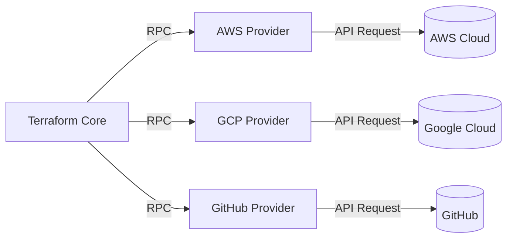
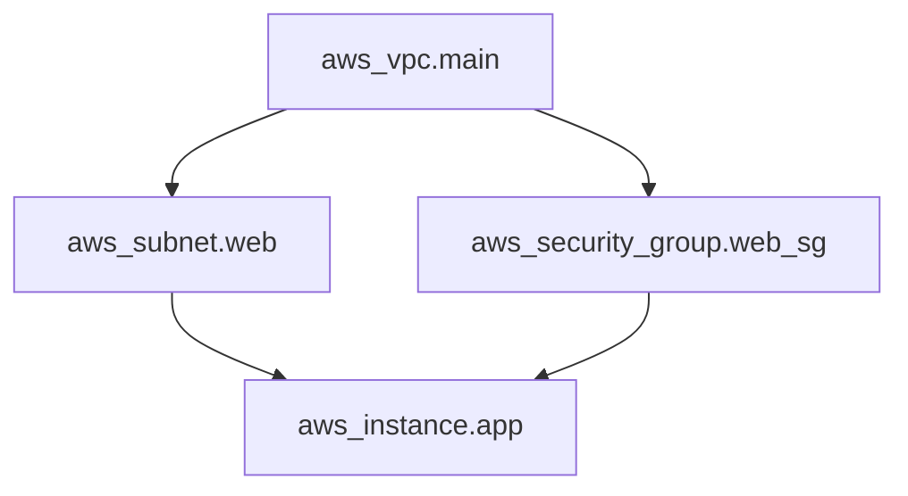
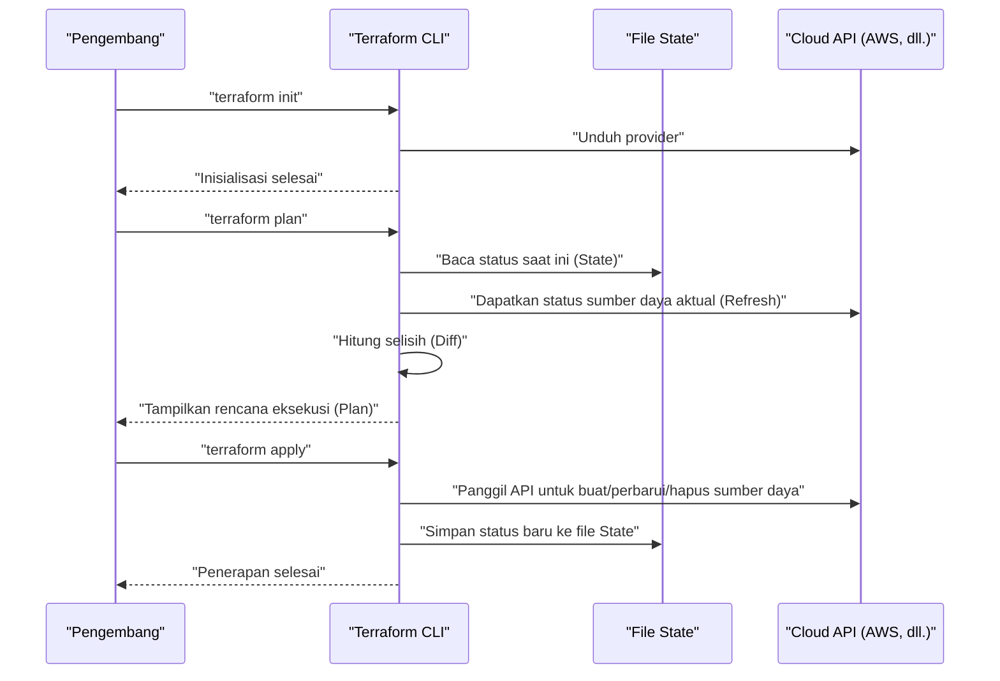
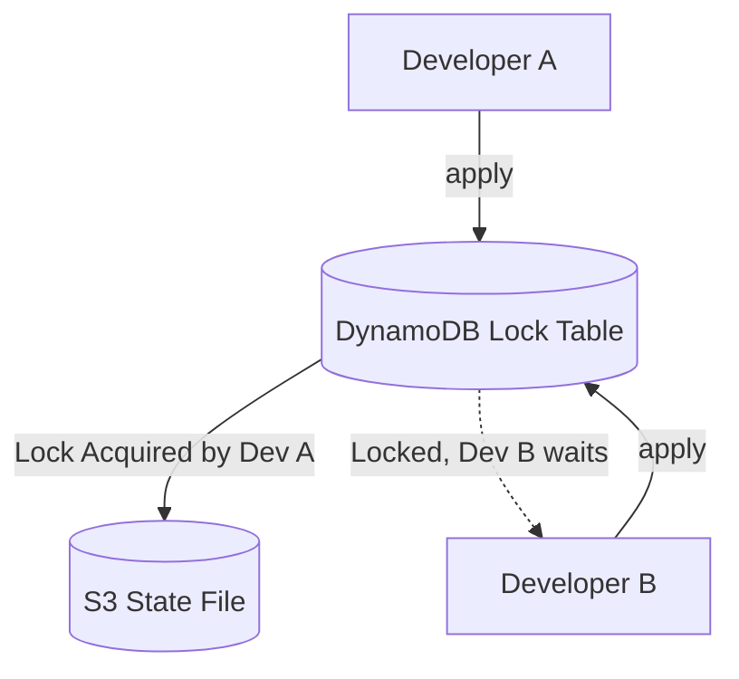
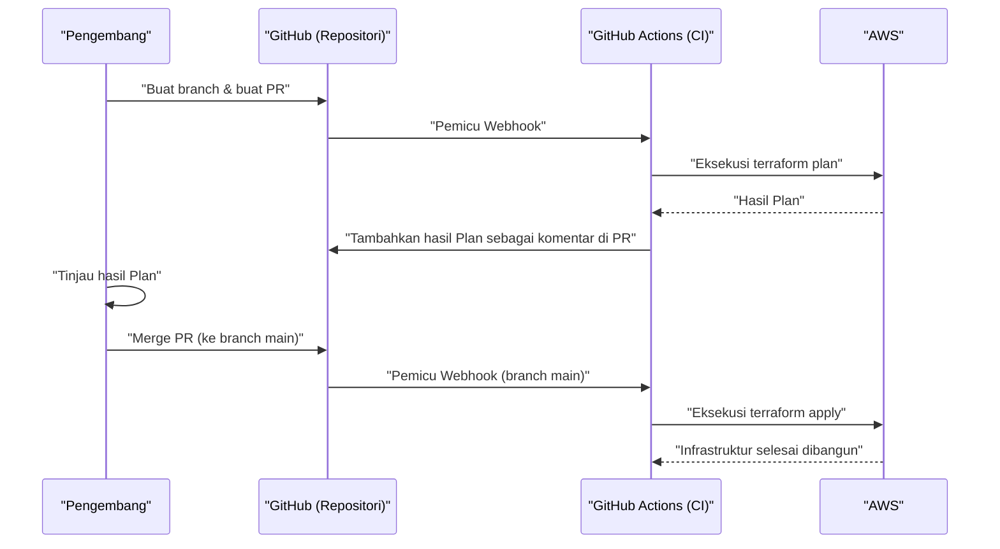

# Pengantar: Evolusi Infrastruktur dan Kemunculan IaC

Dalam dunia pengembangan sistem, sudah lama terjadi pergeseran paradigma untuk mengelola tidak hanya kode aplikasi, tetapi juga infrastruktur itu sendiri sebagai kode. Itulah **Infrastructure as Code (IaC)** . Pembangunan server secara manual (seperti "pembangunan berbasis panduan" atau "operasi klik") adalah sarang *human error* dan memiliki masalah fatal berupa kurangnya skalabilitas dan reproduktibilitas.

Artikel ini dimulai dengan konsep IaC dan berfokus pada **Terraform**, yang bisa dibilang sebagai standar de facto-nya. Kami akan menjelaskan secara sangat rinci filosofi "manajemen konfigurasi deklaratif" yang diadopsi oleh Terraform, arsitektur internal, mekanisme manajemen status (State), hingga praktik terbaik praktisnya.

---

# 1. Apa itu Infrastructure as Code (IaC)

## 1.1. Metode Konvensional dan Keterbatasannya

Sebelum komputasi awan meluas, atau di lingkungan komputasi awan awal, insinyur infrastruktur secara manual membuat sumber daya dari konsol GUI (seperti AWS Management Console atau Azure Portal).
Metode ini intuitif dan memiliki biaya pembelajaran yang rendah, tetapi memiliki keterbatasan berikut.

- **Kurangnya Reproduktibilitas** : Risiko bahwa dokumen prosedur sudah usang atau pengaturan berbeda tergantung pada interpretasi pekerja.
- **Kesulitan dalam Audit dan Pelacakan** : Sulit untuk menyimpan riwayat "siapa, kapan, mengapa" perubahan dilakukan.
- **Hambatan Skala** : Saat membangun ratusan server, pekerjaan manual memakan waktu fisik yang terlalu lama.

## 1.2. Keuntungan IaC

Dengan mengodekan infrastruktur, Anda dapat menerapkan praktik luar biasa yang telah dikembangkan dalam pengembangan perangkat lunak ke pembangunan infrastruktur.

1. **Kontrol Versi** : Menggunakan VCS (Sistem Kontrol Versi) seperti Git, riwayat perubahan infrastruktur dapat dikelola.
2. **Proses Ulasan** : Memungkinkan peninjauan kode melalui *Pull Request* (PR), memastikan kualitas sebelum perubahan dilakukan.
3. **Otomatisasi dan Integrasi Berkelanjutan** : Dengan menggabungkannya ke dalam *pipeline* [CI/CD](https://kenji.blog/id/p/cicd-pipeline-github-actions-best-practices/), pengujian dan penerapan dapat diotomatisasi.
4. **Konsistensi dan Idempotensi** : Dijamin bahwa tidak peduli berapa kali dijalankan, ia akan selalu menghasilkan hasil (status) yang sama.

## 1.3. Perbedaan antara Imperatif dan Deklaratif

Alat IaC secara kasar dibagi menjadi dua pendekatan: "imperatif" dan "deklaratif".

### Imperatif
Mendeskripsikan **"Bagaimana (How) membuat infrastruktur"** . Skrip (Bash atau Python), atau Ansible (meskipun sebagian deklaratif, memiliki aspek imperatif yang kuat dalam arti sadar akan urutan eksekusi tugas).
- Contoh: "Jalankan 1 instans EC2, kemudian buat *bucket* S3, lalu dapatkan alamat IP EC2"

### Deklaratif
Mendeskripsikan **"Seperti apa hasil akhir (What) yang diinginkan"** . Sistem membandingkan status saat ini dengan status ideal yang didefinisikan, dan secara otomatis menghitung serta menerapkan perubahan yang diperlukan. **Terraform** adalah perwakilan utama dari pendekatan ini.
- Contoh: "Terdapat 1 instans EC2 dan *bucket* S3 ada"

---

# 2. Apa itu Terraform

Terraform adalah alat IaC *open source* yang dikembangkan oleh HashiCorp dengan bahasa Go. Ini dapat mengkonfigurasi dan mengelola berbagai macam API, dari infrastruktur awan hingga pengaturan SaaS, sebagai kode.

## 2.1. Arsitektur Provider

Kekuatan terbesar Terraform terletak pada **ketidakterikatannya pada platform** dan **ekosistem *provider*** -nya. *Core* Terraform tidak membuat sumber daya secara langsung. Sebaliknya, ia berkomunikasi dengan API setiap layanan melalui *plugin* yang disebut "*Provider*".



Hal ini memungkinkan pengelolaan layanan yang sama sekali berbeda seperti AWS, Datadog, dan GitHub secara terintegrasi dengan satu basis kode.

## 2.2. HCL (HashiCorp Configuration Language)

Konfigurasi Terraform ditulis menggunakan **HCL**, yang kompatibel dengan JSON namun mudah dibaca dan ditulis oleh manusia. Berikut adalah contoh sederhana yang mendefinisikan instans EC2 AWS.

```hcl
provider "aws" {
  region = "ap-northeast-1"
}

resource "aws_instance" "web" {
  ami           = "ami-0c3fd0f5d33134a76"
  instance_type = "t3.micro"

  tags = {
    Name        = "WebServer"
    Environment = "Production"
  }
}
```

Kode ini mendeklarasikan bahwa "instans EC2 dengan AMI dan tipe instans yang ditentukan ada di region Tokyo".

---

# 3. Filosofi Manajemen Konfigurasi Deklaratif

Inti dari Terraform terletak pada pendekatan **Deklaratif** ini. Mengapa pendekatan ini lebih unggul?

## 3.1. Perhitungan Otomatis Status dan Penyelesaian Ketergantungan

Dalam skrip imperatif, manusia harus mendeskripsikan secara akurat urutan pembuatan sumber daya. Misalnya, prosedur membuat VPC, kemudian membuat *subnet*, lalu menempatkan EC2 di dalam *subnet* tersebut.

Di Terraform, *Terraform Core* secara otomatis membangun **Grafik Ketergantungan (Dependency [Graph](https://kenji.blog/id/p/tree-graph-data-structures-search-dfs-bfs-dijkstra/))** dari relasi referensi yang muncul dalam kode (misalnya, merujuk pada `aws_vpc.main.id` dalam pengaturan *subnet*).



Melalui pendekatan berbasis teori graf ini, Terraform mewujudkan hal-hal berikut:
- **Pembuatan Paralel** untuk sumber daya yang tidak saling bergantung (mempercepat proses).
- Pembuatan, pembaruan, dan penghapusan sumber daya dengan urutan yang benar.

## 3.2. Idempotensi

Manfaat lain dari pendekatan deklaratif adalah **idempotensi**. Tidak peduli berapa kali Anda menjalankan `terraform apply` dengan kode yang sama, status akhir infrastruktur akan sama persis dengan yang dideskripsikan dalam kode. Untuk sumber daya yang sudah berada dalam keadaan yang diharapkan, Terraform akan menilai "tidak ada perubahan (*No changes*)".

Dengan ini, Anda terbebas dari mimpi buruk operasional seperti "ketika terjadi kesalahan di tengah skrip, memeriksa secara manual sejauh mana skrip tersebut dieksekusi, memperbaiki skrip, dan menjalankannya kembali".

---

# 4. Alur Eksekusi: Init, Plan, Apply

Operasi dasar Terraform secara umum dibagi menjadi 3 fase. Alur kerja inilah yang memungkinkan perubahan infrastruktur yang aman.



### 1. `terraform init`
Menginisialisasi direktori kerja. Mengunduh *plugin provider* yang ditentukan dan mengonfigurasi *backend* (lokasi penyimpanan *State*).

### 2. `terraform plan`
Melakukan *Dry-Run* (gladi bersih). Membandingkan deskripsi kode dengan status infrastruktur aktual saat ini, dan menampilkan "apa yang akan ditambahkan (+), diubah (~), dan dihapus (-)". Pada fase ini, kita meninjau untuk memastikan tidak ada penghapusan sumber daya yang tidak disengaja.

### 3. `terraform apply`
Secara aktual menerapkan rencana perubahan yang disajikan dalam `plan` kepada penyedia layanan awan.

---

# 5. Manajemen Status: Kedalaman File State

Untuk memahami Terraform, tidak mungkin menghindari konsep **State (Status)** .

## 5.1. Apa itu terraform.tfstate

Terraform menghasilkan dan mengelola file dalam format JSON yang disebut `.tfstate` untuk memetakan kode (keadaan ideal) dengan infrastruktur realitas.

Mengapa kita membutuhkan file *State*? Tampaknya kita hanya perlu memanggil API awan dan mengambil semua sumber daya setiap kali.
Alasannya adalah sebagai berikut:

1. **Menyimpan metadata dan dependensi** : Untuk men- *cache* metadata khusus Terraform dan grafik dependensi saat pembuatan sumber daya, yang tidak dikembalikan oleh API awan.
2. **Kinerja** : Dalam infrastruktur berskala besar, mengambil status semua sumber daya setiap saat melalui API akan menyebabkan *timeout* atau batas laju ( *rate limit* ) API.
3. **Pelacakan sumber daya** : Jika Anda menghapus definisi sumber daya dari kode, Terraform mengidentifikasi "sumber daya yang ada di file *State* tetapi tidak ada di kode" dan menjalankan tindakan penghapusan. Tanpa *State*, sumber daya yang menghilang dari kode hanya akan "dibiarkan".

## 5.2. Remote State dan Manajemen Kunci

Dalam pengembangan tim, menempatkan `terraform.tfstate` di mesin lokal adalah **anti-pola absolut** . Jika beberapa orang menjalankan `terraform apply` secara bersamaan, *State* akan mengalami konflik dan infrastruktur akan rusak.

Solusi untuk hal ini adalah **Remote State** dan **State Locking** .
Di lingkungan AWS, merupakan hal yang standar untuk menggunakan *bucket* S3 sebagai lokasi penyimpanan *State* dan menggunakan DynamoDB untuk mengelola kunci (*lock*).

```hcl
terraform {
  backend "s3" {
    bucket         = "my-terraform-state-bucket"
    key            = "prod/terraform.tfstate"
    region         = "ap-northeast-1"
    dynamodb_table = "terraform-state-lock"
    encrypt        = true
  }
}
```



Dengan mengatur seperti ini, selama *Developer* A mengeksekusi `apply`, kunci akan ditulis ke DynamoDB, dan eksekusi *Developer* B akan diblokir.

## 5.3. Mendeteksi dan Memperbaiki Drift

Infrastruktur yang dimodifikasi di luar Terraform (misalnya, secara manual dari konsol GUI) disebut sebagai **konfigurasi melayang (Configuration Drift)** .

Saat menjalankan `plan` atau `apply`, Terraform pertama-tama memperoleh status realitas terbaru di awan (*Refresh*) dan memperbarui file *State*. Kemudian, dengan membandingkannya dengan kode, ini mendeteksi perubahan manual dan dapat "menarik kembali (atau menyarankan perbaikan)" ke keadaan asli yang didefinisikan oleh kode.

---

# 6. Modularisasi dan Reusabilitas

Seiring bertumbuhnya sistem, basis kode Terraform juga akan membengkak. Untuk mematuhi prinsip DRY (*Don't Repeat Yourself*), Terraform memiliki mekanisme yang disebut **Module (Modul)** .

## 6.1. Dasar-dasar Modul

Modul adalah wadah yang mengelompokkan sumber daya terkait. Ia merangkum fungsi tertentu (misalnya: satu set jaringan VPC, satu set kluster ECS, dll.), dan dengan mendefinisikan variabel input (*Variables*) serta output (*Outputs*), ia menciptakan komponen yang dapat digunakan kembali.

**Contoh struktur direktori:**
```text
.
├── environments
│   ├── prod
│   │   └── main.tf      # Memanggil modul dari lingkungan produksi
│   └── stg
│       └── main.tf      # Memanggil modul dari lingkungan STG
└── modules
    └── vpc
        ├── main.tf      # Definisi sumber daya di dalam modul
        ├── variables.tf # Input ke modul
        └── outputs.tf   # Output dari modul
```

**Sisi pemanggil modul (`environments/prod/main.tf`):**
```hcl
module "vpc" {
  source = "../../modules/vpc"

  vpc_cidr             = "10.0.0.0/16"
  environment          = "prod"
  enable_dns_hostnames = true
}
```

Dengan merancang modul seperti ini, Anda dapat dengan mudah membangun konfigurasi jaringan yang sama di lingkungan STG atau pengembangan hanya dengan mengubah parameter (variabel).

---

# 7. Fitur Lanjutan Terraform

HCL Terraform bukan sekadar file konfigurasi, tetapi juga dilengkapi dengan fitur untuk membangun beberapa tingkat logika.

## 7.1. Blok Dinamis (dynamic block)

Menghasilkan blok bersarang secara dinamis berdasarkan daftar atau peta (*map*). Ini sangat berguna, misalnya, saat mengatur aturan grup keamanan.

```hcl
resource "aws_security_group" "web" {
  name   = "web-sg"
  vpc_id = aws_vpc.main.id

  dynamic "ingress" {
    for_each = var.allowed_web_ports
    content {
      from_port   = ingress.value
      to_port     = ingress.value
      protocol    = "tcp"
      cidr_blocks = ["0.0.0.0/0"]
    }
  }
}
```

## 7.2. Kapan menggunakan for_each dan count

Saat membuat beberapa sumber daya yang mirip, gunakan `count` atau `for_each`.

- **count** : Membuat sumber daya sebanyak jumlah bilangan bulat yang ditentukan. Karena ia bergantung pada indeks daftar, jika elemen perantara dihapus, indeks akan bergeser, dan berisiko menyebabkan sumber daya berikutnya dibuat atau dihapus secara tidak disengaja.
- **for_each** : Menerima kumpulan string atau peta (*map*), lalu membuat sumber daya berdasarkan setiap kunci. Karena tahan terhadap pergeseran indeks, **penggunaan for_each direkomendasikan** untuk memproses sumber daya dalam perulangan (*loop*).

---

# 8. Integrasi dengan [Pipeline](https://kenji.blog/id/p/cicd-pipeline-github-actions-best-practices/) [CI/CD](https://kenji.blog/id/p/cicd-pipeline-github-actions-best-practices/) (GitOps)

Nilai sesungguhnya dari Terraform akan terlihat saat dimasukkan ke dalam alur kerja GitOps. Melarang `apply` di mesin lokal, dan mengotomatiskan semua perubahan melalui *Pull Request*.



## 8.1. Menggeser Keamanan ke Kiri (Shift-Left Security)

Di dalam *pipeline* [CI/CD](https://kenji.blog/id/p/cicd-pipeline-github-actions-best-practices/), kita harus memasukkan alat analisis statis untuk menemukan kerentanan infrastruktur sejak dini.
- **tfsec** atau **checkov** : Memindai risiko keamanan pada tingkat kode, seperti "*bucket* S3 bersifat publik" atau "DB tidak dienkripsi", dan menghentikan CI dengan *error* jika ada masalah.

---

# 9. Keandalan dan Pendekatan Matematis untuk Pemodelan Biaya

Saat merancang infrastruktur menggunakan IaC, mengevaluasi keseimbangan antara keandalan (*Reliability*) dan biaya adalah hal yang penting.
Misalnya, ketersediaan sistem dalam konfigurasi *multi-AZ* (*[Availability](https://kenji.blog/id/p/cap-theorem-distributed-systems-tradeoff/) Zone*) dapat direpresentasikan oleh model matematis.

Misalkan keandalan satu komponen (AZ) adalah $\text{R}_1$.
Jika Anda menempatkan sumber daya di 2 AZ (redundansi), dan jika salah satu dari mereka beroperasi, keseluruhan sistem dianggap beroperasi, maka keandalan keseluruhan sistem $\text{R}_{total}$ dinyatakan dengan rumus berikut:

$$
\text{R}_{total} = 1 - (1 - \text{R}_1)(1 - \text{R}_2)
$$

Saat merancang modul di Terraform, menyiapkan `az_count` sebagai variabel input dan mampu menerapkan infrastruktur secara otomatis yang memenuhi persyaratan berdasarkan model matematis ini adalah keterampilan desain tingkat lanjut yang diperlukan untuk seorang arsitek.

---

# 10. Praktik Terbaik Praktis dan Anti-pola

## Praktik Terbaik
1. **Pemisahan File State** : Jika Anda menggabungkan semua infrastruktur ke dalam satu file *State*, cakupan dampaknya menjadi terlalu luas, dan eksekusi `plan` menjadi lambat. Bagilah *State* (dan direktori) ke dalam unit siklus hidup yang berbeda seperti "jaringan (VPC, dll.)", "database", dan "aplikasi".
2. **Kunci Versi** : Pastikan untuk mengunci (*pinning*) versi *Terraform Core* dan versi *Provider*. Ini melindungi infrastruktur Anda dari perubahan merusak yang disebabkan oleh pembaruan versi.
3. **Pemanfaatan Sumber Data (Data Sources)** : Saat merujuk pada *State* lain atau sumber daya yang ada, jangan melakukan *hard-code*, melainkan gunakan blok `data` untuk mengambil nilai secara dinamis.

## Anti-pola
1. **Bercampur dengan Perubahan Manual** : Memodifikasi sumber daya yang dikelola oleh Terraform secara langsung melalui GUI. Ini menyebabkan ketidakkonsistenan *State*.
2. **Hard-coding Kredensial** : Menulis *access key* dan *secret key* secara langsung di dalam kode. Harap gunakan variabel lingkungan atau peran IAM (integrasi [OIDC](https://kenji.blog/id/p/oauth2-oidc-authentication-authorization-difference/), dll.).
3. **Modul yang Terlalu Kompleks** : Jika Anda mencoba memberikan setiap fitur kepada modul, jumlah variabel akan mencapai puluhan, dan keterbacaan akan menurun secara signifikan. Ingatlah "satu modul memiliki satu tanggung jawab (*Single Responsibility*)".

---

# 11. Kesimpulan

**Infrastructure as Code** adalah praktik yang sangat penting dalam pengembangan perangkat lunak modern. Di antaranya, **Terraform** telah mengukuhkan posisinya sebagai standar de facto untuk IaC karena filosofi kuatnya tentang "manajemen konfigurasi deklaratif", pelacakan status tingkat lanjut dengan *State*, dan ekosistem penyedia yang kaya di berbagai *platform*.

Namun, sekadar mengadopsi alat ini tidak akan memaksimalkan manfaatnya. Dengan menggabungkan "praktik terbaik" seperti penataan kode melalui modul, pembangunan struktur pengembangan tim dengan status dan kunci jarak jauh, mewujudkan GitOps dengan integrasi [CI/CD](https://kenji.blog/id/p/cicd-pipeline-github-actions-best-practices/), dan menggeser keamanan ke kiri, barulah manajemen infrastruktur yang aman dan terukur menjadi mungkin.

Infrastruktur tidak lagi sesuatu yang "dibuat dengan mengklik". Sama seperti perangkat lunak, kita berada di era di mana kita harus "mengodekan, menguji, dan menerapkannya secara berkelanjutan". Kuasailah Terraform dan bangun arsitektur infrastruktur yang kuat dan indah.
