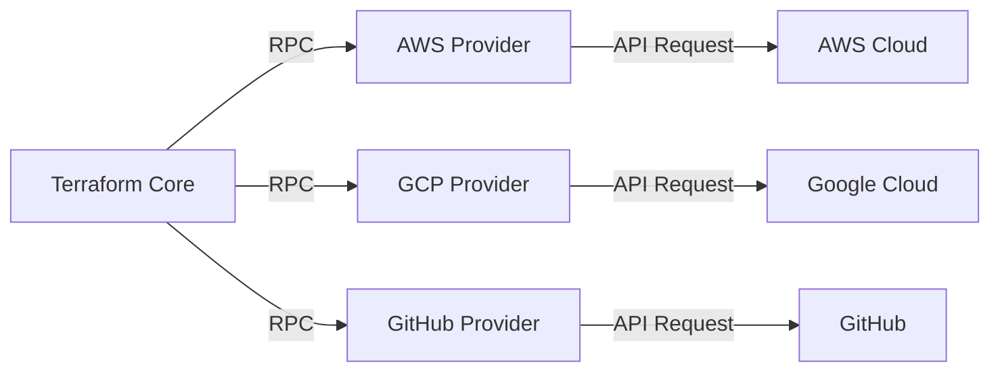
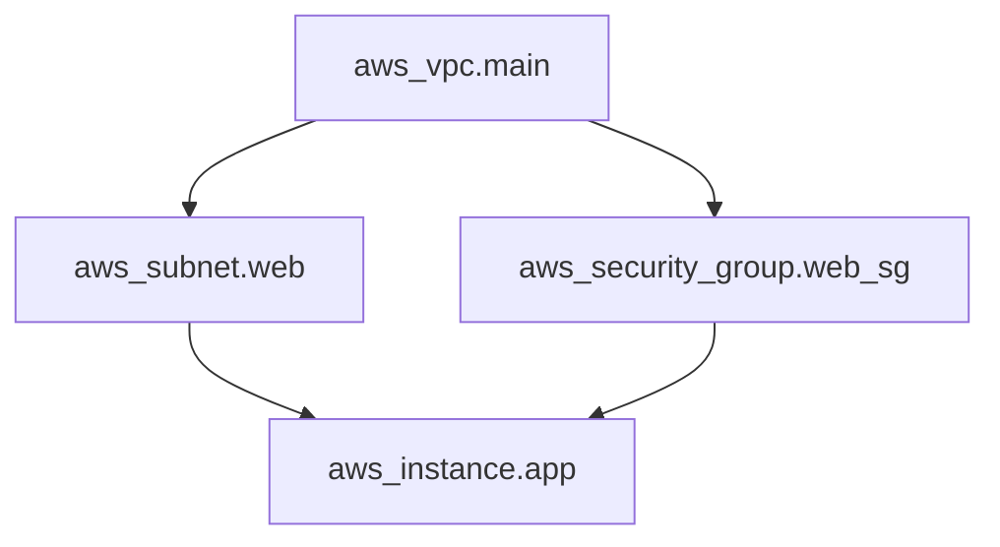
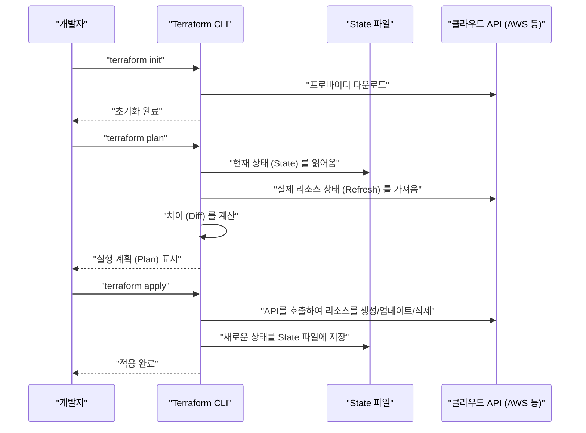
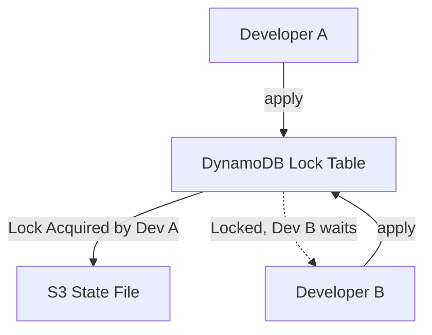
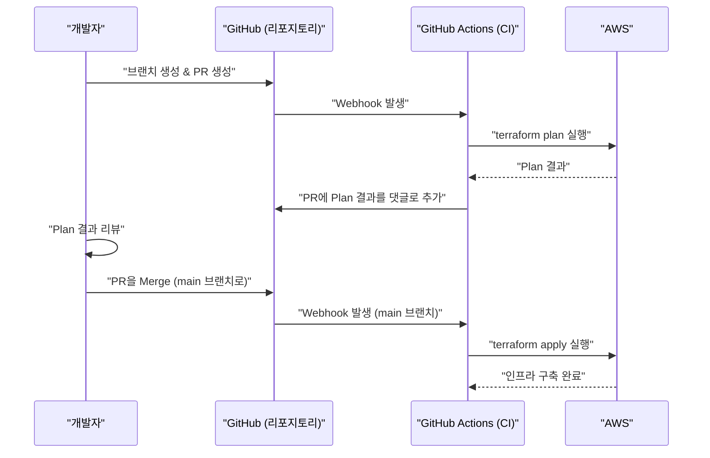

# 시작하며: 인프라스트럭처의 진화와 IaC의 대두

시스템 개발의 세계에서 애플리케이션의 코드뿐만 아니라 인프라스트럭처 자체도 코드로 관리하자는 패러다임 시프트가 일어난 지 오래되었습니다. 그것이 **Infrastructure as Code (IaC)** 입니다. 수작업에 의한 서버 구축(이른바 '절차서 기반 구축'이나 '클릭 오퍼레이션')은 휴먼 에러의 온상이며 확장성이나 재현성이 부족하다는 치명적인 문제를 안고 있었습니다.

본 문서에서는 IaC의 개념에서 시작하여 그 디팩토 스탠다드라고 할 수 있는 **Terraform** 에 초점을 맞춥니다. Terraform이 채택하고 있는 '선언적 구성 관리'의 철학, 내부 아키텍처, 상태 관리(State)의 구조, 그리고 실천적인 모범 사례까지 매우 상세하게 해설해 나갈 것입니다.

---

# 1. Infrastructure as Code (IaC) 란 무엇인가

## 1.1. 기존 방식과 그 한계

클라우드 컴퓨팅이 보급되기 전, 혹은 초기 클라우드 환경에서는 인프라 엔지니어가 GUI 콘솔(AWS Management Console이나 Azure Portal 등)에서 수동으로 리소스를 생성했습니다.
이 방식은 직관적이고 학습 비용이 낮은 반면 다음과 같은 한계가 있었습니다.

- **재현성의 결여** : 절차서가 오래되었거나 작업자의 해석에 따라 설정이 달라질 위험.
- **감사 및 추적의 어려움** : '누가·언제·왜' 변경을 가했는지 이력으로 남기 어려움.
- **스케일의 벽** : 수백 대의 서버를 구축할 때 수작업으로는 물리적인 시간이 너무 많이 걸림.

## 1.2. IaC의 장점

인프라를 코드화함으로써 소프트웨어 개발에서 축적된 우수한 프랙티스를 인프라 구축에도 적용할 수 있게 됩니다.

1. **버전 관리** : Git 등의 VCS(버전 관리 시스템)를 사용하여 인프라의 변경 이력을 관리할 수 있다.
2. **리뷰 프로세스** : Pull Request (PR)를 통한 코드 리뷰가 가능해져 변경 전의 품질을 담보할 수 있다.
3. **자동화와 지속적 통합** : [CI/CD](https://kenji.blog/ko/p/cicd-pipeline-github-actions-best-practices/) 파이프라인에 통합하여 테스트나 배포를 자동화할 수 있다.
4. **일관성과 멱등성 (Idempotency)** : 몇 번을 실행해도 반드시 같은 결과(상태)가 보장된다.

## 1.3. 절차형 (Imperative) 과 선언형 (Declarative) 의 차이

IaC 툴에는 크게 나누어 '절차형'과 '선언형'의 2가지 접근 방식이 존재합니다.

### 절차형 (Imperative)
**"어떻게 (How) 인프라를 만들 것인가"** 를 기술합니다. 스크립트(Bash나 Python), 혹은 Ansible(일부 선언적이지만 작업 실행 순서를 의식한다는 점에서는 절차적인 측면이 강함) 등이 해당합니다.
- 예: "EC2 인스턴스를 1대 시작하고, 그 후에 S3 버킷을 생성하고, EC2의 IP 주소를 가져온다"

### 선언형 (Declarative)
**"최종적으로 어떤 상태 (What) 이기를 바라는가"** 를 기술합니다. 시스템이 현재 상태와 정의된 이상적인 상태를 비교하여 필요한 변경을 자동으로 계산하고 적용합니다. **Terraform** 은 이 접근 방식의 대표격입니다.
- 예: "EC2 인스턴스가 1대 존재하고, S3 버킷이 존재할 것"

---

# 2. Terraform이란

Terraform은 HashiCorp사에서 [Go](https://kenji.blog/ko/p/programming-languages-history-paradigm-evolution/) 언어로 개발한 오픈소스 IaC 툴입니다. 클라우드 인프라부터 SaaS 설정까지 모든 API를 코드로 구성·관리할 수 있습니다.

## 2.1. 프로바이더 (Provider) 아키텍처

Terraform의 가장 큰 강점은 그 **플랫폼 독립성** 과 **프로바이더 생태계** 에 있습니다. Terraform 본체(Core)는 리소스를 직접 생성하지 않습니다. 대신 'Provider'라고 불리는 플러그인을 통해 각 서비스의 API와 통신합니다.



이를 통해 AWS와 Datadog, GitHub와 같은 전혀 다른 서비스를 1개의 코드베이스에서 통합적으로 관리하는 것이 가능해집니다.

## 2.2. HCL (HashiCorp Configuration Language)

Terraform의 설정은 JSON과 호환되면서도 인간이 읽고 쓰기 쉬운 **HCL** 을 사용하여 기술됩니다. 다음은 AWS의 EC2 인스턴스를 정의하는 간단한 예입니다.

```hcl
provider "aws" {
  region = "ap-northeast-1"
}

resource "aws_instance" "web" {
  ami           = "ami-0c3fd0f5d33134a76"
  instance_type = "t3.micro"

  tags = {
    Name        = "WebServer"
    Environment = "Production"
  }
}
```

이 코드는 "도쿄 리전에, 지정한 AMI와 인스턴스 타입을 가진 EC2 인스턴스가 존재하는 상태"를 선언하고 있습니다.

---

# 3. 선언적 구성 관리의 철학

Terraform의 핵심은 이 **선언적 (Declarative)** 인 접근 방식에 있습니다. 왜 이 접근 방식이 우수할까요?

## 3.1. 상태의 자동 계산과 의존 관계의 해결

절차형 스크립트에서는 리소스를 생성하는 순서를 인간이 정확하게 기술해야 합니다. 예를 들어, VPC를 생성한 후에 서브넷을 생성하고, 그 서브넷 내에 EC2를 배치한다는 절차입니다.

Terraform에서는 코드 내에 나타나는 참조 관계(예를 들어 `aws_vpc.main.id` 를 서브넷 설정에서 참조함)로부터 Terraform Core가 자동으로 **의존 관계 그래프 (Dependency [Graph](https://kenji.blog/ko/p/tree-graph-data-structures-search-dfs-bfs-dijkstra/))** 를 구축합니다.



이 그래프 이론에 기반한 접근 방식을 통해 Terraform은 다음을 실현합니다.
- 의존 관계가 없는 리소스의 **병렬 생성** (고속화).
- 올바른 순서로 리소스 생성·업데이트·삭제.

## 3.2. 멱등성 (Idempotency)

선언적 접근 방식의 또 다른 혜택이 **멱등성** 입니다. 동일한 코드를 몇 번 `terraform apply` 해도 인프라의 최종 상태는 코드에 기술된 것과 완전히 일치합니다. 이미 기대하는 상태가 되어 있는 리소스에 대해서는 Terraform은 "아무것도 변경하지 않는다(No changes)"고 판단합니다.

이로 인해 "스크립트 도중에 에러가 발생한 경우, 어디까지 실행되었는지 수동으로 확인하고 스크립트를 수정하여 재실행한다"와 같은 운영상의 악몽에서 해방됩니다.

---

# 4. 실행 흐름: Init, Plan, Apply

Terraform의 기본 작업은 크게 3가지 단계로 나뉩니다. 이 워크플로우야말로 안전한 인프라 변경을 가능하게 합니다.



### 1. `terraform init`
작업 디렉토리를 초기화합니다. 지정된 프로바이더의 플러그인을 다운로드하고 백엔드(State의 저장 위치) 설정을 수행합니다.

### 2. `terraform plan`
Dry-Run(예행연습)을 수행합니다. 코드의 기술과 현재의 실제 인프라 상태를 비교하여 "무엇이 추가(+), 변경(~), 삭제(-)될지"를 출력합니다. 이 단계에서 의도하지 않은 리소스 삭제가 없는지 리뷰합니다.

### 3. `terraform apply`
`plan` 에서 제시된 변경 계획을 실제로 클라우드 프로바이더에 적용합니다.

---

# 5. 상태 관리: State 파일의 심연

Terraform을 이해하는 데 있어 피할 수 없는 것이 **State (상태)** 라는 개념입니다.

## 5.1. terraform.tfstate 란

Terraform은 코드(이상적인 상태)와 현실의 인프라를 매핑하기 위해 `.tfstate` 라는 JSON 형식의 파일을 생성하고 관리합니다.

왜 굳이 State 파일이 필요할까요? 매번 클라우드 API를 호출하여 전체 리소스를 가져오면 될 것 같기도 합니다.
그 이유는 다음과 같습니다.

1. **메타데이터와 의존 관계 저장** : 클라우드 API가 반환하지 않는 Terraform 고유의 메타데이터나 리소스 생성 시의 의존 관계 그래프를 캐시해 두기 위해.
2. **성능** : 대규모 인프라에서는 전체 리소스 상태를 API를 통해 매번 가져오면 타임아웃이나 API 속도 제한에 걸리기 때문에.
3. **리소스 추적** : 코드 상에서 리소스 정의를 삭제한 경우, Terraform은 "State 파일에는 존재하지만 코드에는 없는 리소스"를 찾아 삭제 작업을 실행합니다. State가 없으면 코드에서 사라진 리소스는 단순히 '방치'되어 버립니다.

## 5.2. 원격 상태와 잠금 관리

팀 개발에 있어서 로컬 머신에 `terraform.tfstate` 를 두는 것은 **절대적인 안티 패턴** 입니다. 여러 명이 동시에 `terraform apply` 를 실행하면 State가 충돌하여 인프라가 파손됩니다.

이것을 해결하는 것이 **Remote State** 와 **State Locking** 입니다.
AWS 환경이라면 S3 버킷을 State의 저장 위치로 하고, DynamoDB를 잠금 관리에 사용하는 것이 표준적입니다.

```hcl
terraform {
  backend "s3" {
    bucket         = "my-terraform-state-bucket"
    key            = "prod/terraform.tfstate"
    region         = "ap-northeast-1"
    dynamodb_table = "terraform-state-lock"
    encrypt        = true
  }
}
```



이와 같이 설정함으로써 Developer A가 `apply` 를 실행하는 동안에는 DynamoDB에 잠금이 기록되고 Developer B의 실행은 블록됩니다.

## 5.3. 드리프트 (Drift) 의 탐지와 수정

인프라가 Terraform 외부(예를 들어 GUI 콘솔에서 수동으로)에서 변경되어 버리는 것을 **설정의 드리프트 (Configuration Drift)** 라고 부릅니다.

Terraform은 `plan` 이나 `apply` 를 실행할 때 먼저 클라우드 상의 최신 현실 상태를 가져오고(Refresh) State 파일을 업데이트합니다. 그런 다음 코드와 비교하기 때문에 수동으로 이루어진 변경을 감지하고 코드에 정의된 본래 상태로 "되돌리거나(혹은 수정을 제안할)" 수 있습니다.

---

# 6. 모듈화와 재사용성

시스템이 성장함에 따라 Terraform의 코드베이스도 비대해집니다. DRY (Don't Repeat Yourself) 원칙을 지키기 위해 Terraform에는 **Module (모듈)** 이라는 메커니즘이 있습니다.

## 6.1. 모듈의 기본

모듈은 관련된 리소스를 모아둔 컨테이너입니다. 특정 기능(예: VPC 네트워크 세트, ECS 클러스터 세트 등)을 캡슐화하고 입력 변수(Variables)와 출력(Outputs)을 정의함으로써 재사용 가능한 부품을 만듭니다.

**디렉토리 구성 예:**
```text
.
├── environments
│   ├── prod
│   │   └── main.tf      # 프로덕션 환경에서 모듈 호출
│   └── stg
│       └── main.tf      # STG 환경에서 모듈 호출
└── modules
    └── vpc
        ├── main.tf      # 모듈 내 리소스 정의
        ├── variables.tf # 모듈에 대한 입력
        └── outputs.tf   # 모듈에서의 출력
```

**모듈을 호출하는 측 (`environments/prod/main.tf`):**
```hcl
module "vpc" {
  source = "../../modules/vpc"

  vpc_cidr             = "10.0.0.0/16"
  environment          = "prod"
  enable_dns_hostnames = true
}
```

이와 같이 모듈을 설계하면 STG 환경이나 개발 환경에서도 동일한 네트워크 구성을 파라미터(변수)만 바꿔서 쉽게 구축할 수 있습니다.

---

# 7. Terraform의 고급 기능

Terraform의 HCL은 단순한 설정 파일이 아니라 어느 정도 로직을 짜기 위한 기능도 갖추고 있습니다.

## 7.1. 동적 블록 (dynamic block)

목록이나 맵을 기반으로 중첩된 블록을 동적으로 생성합니다. 예를 들어 보안 그룹의 규칙 설정 등에 유용합니다.

```hcl
resource "aws_security_group" "web" {
  name   = "web-sg"
  vpc_id = aws_vpc.main.id

  dynamic "ingress" {
    for_each = var.allowed_web_ports
    content {
      from_port   = ingress.value
      to_port     = ingress.value
      protocol    = "tcp"
      cidr_blocks = ["0.0.0.0/0"]
    }
  }
}
```

## 7.2. for_each 와 count 의 구분

여러 개의 유사한 리소스를 생성할 경우 `count` 또는 `for_each` 를 사용합니다.

- **count** : 지정한 정수의 수만큼 리소스를 생성합니다. 리스트의 인덱스에 의존하기 때문에 중간의 요소가 삭제되면 인덱스가 어긋나고, 후속 리소스가 의도치 않게 재생성 및 삭제될 위험이 있습니다.
- **for_each** : 맵이나 문자열의 세트를 받아서 각 키를 기반으로 리소스를 생성합니다. 인덱스가 어긋나는 것에 강하기 때문에 리소스의 루프 처리에는 **for_each 의 사용이 권장** 됩니다.

---

# 8. [CI/CD](https://kenji.blog/ko/p/cicd-pipeline-github-actions-best-practices/) 파이프라인과의 통합 (GitOps)

Terraform의 진가는 GitOps의 워크플로우에 통합되었을 때 발휘됩니다. 수작업에 의한 `apply` 를 금지하고, 모든 변경을 Pull Request를 통해 자동화합니다.



## 8.1. 보안의 시프트 레프트

[CI/CD](https://kenji.blog/ko/p/cicd-pipeline-github-actions-best-practices/) 파이프라인에는 인프라의 취약점을 조기에 발견하기 위해 정적 분석 도구를 포함시켜야 합니다.
- **tfsec** 또는 **checkov** : "S3 버킷이 퍼블릭에 공개되어 있다", "DB가 암호화되어 있지 않다" 등의 보안 위험을 코드 레벨에서 스캔하고, 문제가 있으면 CI를 에러로 멈춥니다.

---

# 9. 신뢰성과 비용 모델링의 수리적 접근

IaC를 사용하여 인프라를 설계할 때 신뢰성(Reliability)과 비용의 균형을 평가하는 것은 중요합니다.
예를 들어 멀티 AZ([Availability](https://kenji.blog/ko/p/cap-theorem-distributed-systems-tradeoff/) Zone) 구성에서의 시스템 가동률은 수리 모델로 표현할 수 있습니다.

단일 컴포넌트(AZ)의 신뢰성을 $R_1$ 이라고 합시다.
만약 2개의 AZ(이중화)에 리소스를 배치하고, 둘 중 어느 한쪽이라도 가동 중이면 시스템 전체가 가동 중인 것으로 간주할 수 있는 경우, 시스템 전체의 신뢰성 $R_{total}$ 은 다음과 같은 식으로 표현됩니다.

$$
R_{total} = 1 - (1 - R_1)(1 - R_2)
$$

Terraform으로 모듈을 설계할 때 입력 변수로 `az_count` 를 마련하고, 이 수리 모델에 기반한 요구 사항을 충족하는 인프라를 자동으로 배포할 수 있도록 하는 것이 아키텍트에게 요구되는 고도의 설계 기술입니다.

---

# 10. 실천적 모범 사례와 안티 패턴

## 모범 사례
1. **State 파일 분할** : 모든 인프라를 1개의 State 파일로 묶으면 영향 범위가 너무 넓어지고 `plan` 의 실행도 느려집니다. "네트워크(VPC 등)", "데이터베이스", "애플리케이션"과 같이 수명 주기가 다른 단위로 State(및 디렉토리)를 분할합시다.
2. **버전 고정** : Terraform 본체의 버전과 Provider의 버전은 반드시 고정(pinning)합시다. 버전 업데이트에 의한 파괴적 변경으로부터 인프라를 보호합니다.
3. **데이터 소스 (Data Sources) 의 활용** : 다른 State나 기존 리소스를 참조하는 경우에는 하드코딩하지 않고 `data` 블록을 사용하여 동적으로 값을 가져옵시다.

## 안티 패턴
1. **수동 변경과의 혼재** : Terraform으로 관리하고 있는 리소스를 GUI에서 직접 변경하는 것. State의 불일치를 초래합니다.
2. **자격 증명 하드코딩** : 액세스 키나 시크릿 키를 코드 내에 직접 기술하는 것. 환경 변수나 IAM 역할([OIDC](https://kenji.blog/ko/p/oauth2-oidc-authentication-authorization-difference/) 연동 등)을 사용해 주십시오.
3. **너무 복잡한 모듈** : 모듈에 모든 기능을 갖게 하려고 하면 변수가 수십 개나 되어 가독성이 현저히 저하됩니다. "1개의 모듈은 1개의 관심사 (Single Responsibility)"를 의식합시다.

---

# 11. 요약

**Infrastructure as Code** 는 현대의 소프트웨어 개발에서 필수 불가결한 프랙티스입니다. 그중에서도 **Terraform** 은 '선언적 구성 관리'라는 강력한 철학, State를 통한 고도의 상태 추적, 그리고 플랫폼을 넘나드는 풍부한 프로바이더 생태계로 인해 IaC의 디팩토 스탠다드로서의 지위를 확립하고 있습니다.

하지만 단순히 도구를 도입한 것만으로는 그 혜택을 극대화할 수 없습니다. 모듈을 통한 코드 구조화, 원격 상태 및 잠금을 통한 팀 개발 체제 구축, [CI/CD](https://kenji.blog/ko/p/cicd-pipeline-github-actions-best-practices/)와의 통합을 통한 GitOps 실현, 그리고 보안의 시프트 레프트와 같은 '모범 사례'를 결합함으로써 비로소 안전하고 확장 가능한 인프라 운영이 가능해집니다.

인프라는 더 이상 '클릭해서 만드는' 것이 아닙니다. 소프트웨어와 마찬가지로 '코딩하고, 테스트하고, 지속적으로 배포하는' 시대인 것입니다. Terraform을 자유자재로 사용하여 견고하고 아름다운 인프라 아키텍처를 구축해 보십시오.
