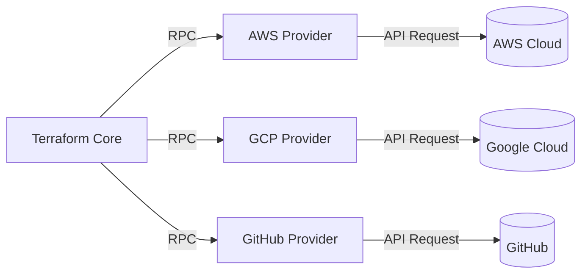
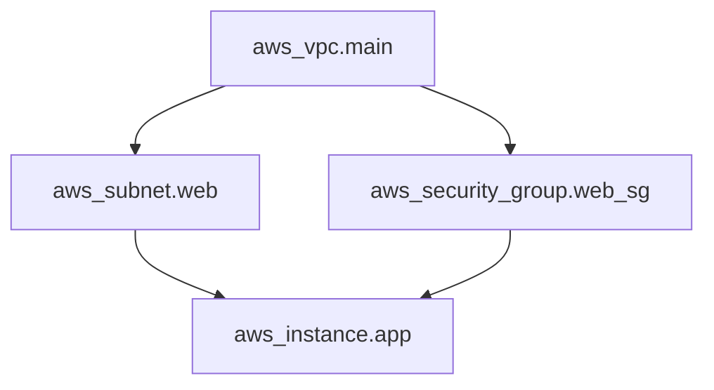
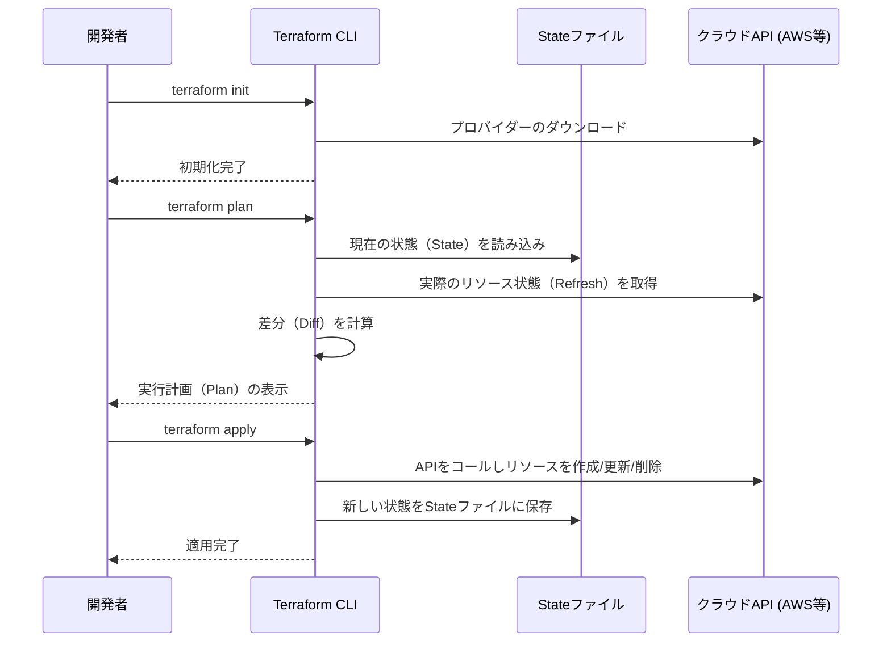
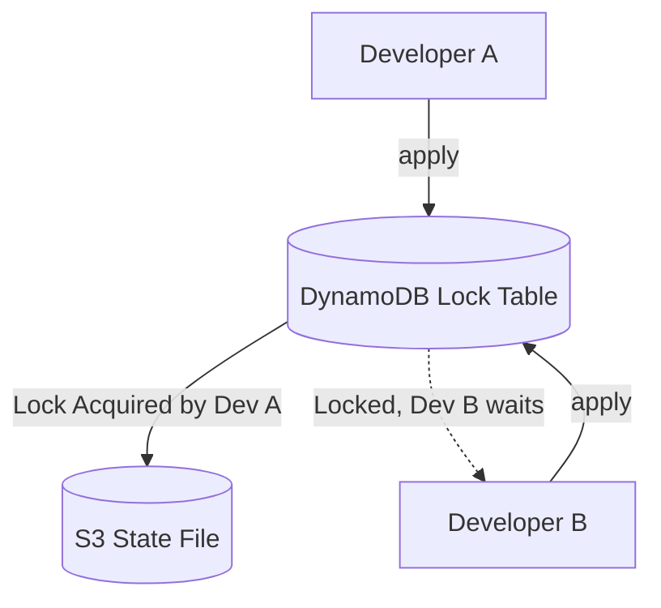
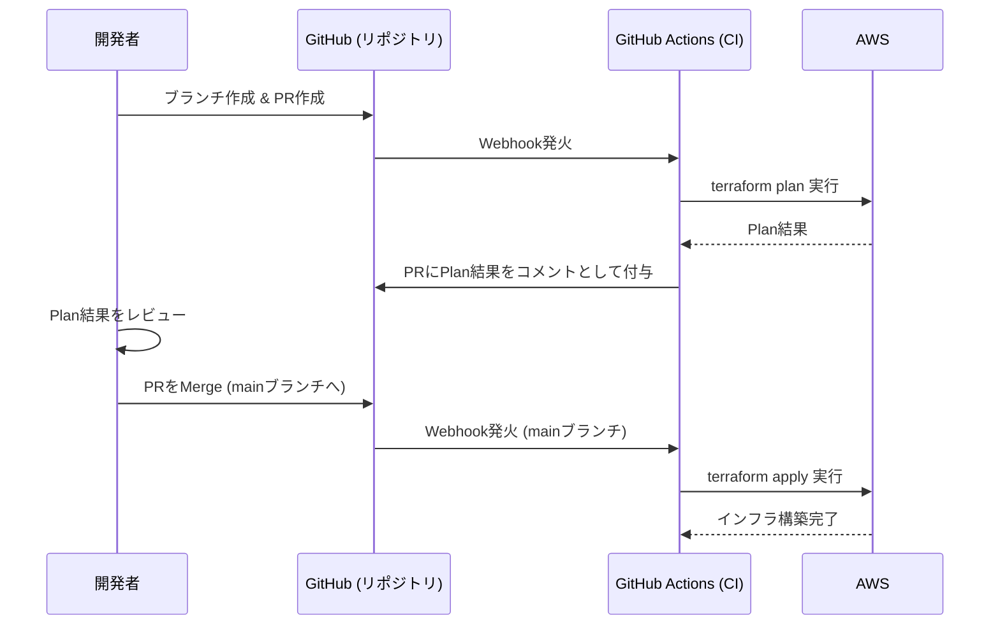

# はじめに：インフラストラクチャの進化とIaCの台頭

システム開発の世界において、アプリケーションのコードだけでなく、インフラストラクチャ自体もコードとして管理しようというパラダイムシフトが起きて久しいです。それが **Infrastructure as Code (IaC)** です。手作業でのサーバー構築（いわゆる「手順書ベースの構築」や「クリックオペレーション」）は、ヒューマンエラーの温床であり、スケーラビリティや再現性に欠けるという致命的な問題を抱えていました。

本記事では、IaCの概念から始まり、そのデファクトスタンダードとも言える **Terraform** に焦点を当てます。Terraformが採用している「宣言的構成管理」の哲学、内部アーキテクチャ、[状態管理](https://kenji.blog/p/state-management-history-redux-context-recoil-zustand/)（State）の仕組み、そして実践的なベストプラクティスまで、非常に詳細に解説していきます。

---

# 1. Infrastructure as Code (IaC) とは何か

## 1.1. 従来の手法とその限界

クラウドコンピューティングが普及する前、あるいは初期のクラウド環境においては、インフラエンジニアはGUIコンソール（AWS Management ConsoleやAzure Portalなど）から手動でリソースを作成していました。
この手法は直感的で学習コストが低い反面、以下のような限界がありました。

- **再現性の欠如** ：手順書が古くなっていたり、作業者の解釈によって設定が異なるリスク。
- **監査と追跡の困難さ** ：「誰が・いつ・なぜ」変更を加えたのかが履歴として残りにくい。
- **スケールの壁** ：数百台のサーバーを構築する際、手作業では物理的な時間がかかりすぎる。

## 1.2. IaCのメリット

インフラをコード化することによって、ソフトウェア開発で培われてきた優れたプラクティスをインフラ構築にも適用できるようになります。

1. **バージョン管理** ：GitなどのVCS（バージョン管理システム）を用いて、インフラの変更履歴を管理できる。
2. **レビュープロセス** ：Pull Request（PR）を通じたコードレビューが可能になり、変更前の品質担保ができる。
3. **自動化と継続的インテグレーション** ：[CI/CD](https://kenji.blog/p/cicd-pipeline-github-actions-best-practices/)[パイプライン](https://kenji.blog/p/cicd-pipeline-github-actions-best-practices/)に組み込むことで、テストやデプロイを自動化できる。
4. **一貫性と冪等性（Idempotency）** ：何度実行しても、必ず同じ結果（状態）になることが保証される。

## 1.3. 手続き型（Imperative）と宣言型（Declarative）の違い

IaCツールには、大きく分けて「手続き型」と「宣言型」の2つのアプローチが存在します。

### 手続き型 (Imperative)
**「どのように（How）インフラを作るか」** を記述します。スクリプト（BashやPython）、あるいはAnsible（一部宣言的ですが、タスクの実行順序を意識する点では手続き的な側面が強い）などが該当します。
- 例：「EC2インスタンスを1台起動し、その後にS3バケットを作成し、EC2のIPアドレスを取得する」

### 宣言型 (Declarative)
**「最終的にどのような状態（What）であってほしいか」** を記述します。システムが現在の状態と定義された理想の状態を比較し、必要な変更を自動的に計算して適用します。 **Terraform** はこのアプローチの代表格です。
- 例：「EC2インスタンスが1台存在し、S3バケットが存在していること」

---

# 2. Terraformとは

Terraformは、HashiCorp社によってGo言語で開発されたオープンソースのIaCツールです。クラウドインフラからSaaSの設定まで、あらゆるAPIをコードとして構成・管理することができます。

## 2.1. プロバイダー（Provider）アーキテクチャ

Terraformの最大の強みは、その **プラットフォーム非依存性** と **プロバイダーエコシステム** にあります。Terraform本体（Core）はリソースを直接作成しません。代わりに、「Provider」と呼ばれるプラグインを介して各サービスのAPIと通信します。



これにより、AWSとDatadog、GitHubといった全く異なるサービスを、1つのコードベースで統合的に管理することが可能になります。

## 2.2. HCL (HashiCorp Configuration Language)

Terraformの設定は、JSON互換でありながら人間にとって読み書きしやすい **HCL** を使用して記述されます。以下はAWSのEC2インスタンスを定義するシンプルな例です。

```hcl
provider "aws" {
  region = "ap-northeast-1"
}

resource "aws_instance" "web" {
  ami           = "ami-0c3fd0f5d33134a76"
  instance_type = "t3.micro"

  tags = {
    Name        = "WebServer"
    Environment = "Production"
  }
}
```

このコードは「東京リージョンに、指定したAMIとインスタンスタイプを持つEC2インスタンスが存在する状態」を宣言しています。

---

# 3. 宣言的構成管理の哲学

Terraformの核心は、この **宣言的（Declarative）** なアプローチにあります。なぜこのアプローチが優れているのでしょうか。

## 3.1. 状態の自動計算と依存関係の解決

手続き型のスクリプトでは、リソースを作成する順番を人間が正確に記述する必要があります。例えば、VPCを作成した後にサブネットを作成し、そのサブネット内にEC2を配置する、という手順です。

Terraformでは、コード内に現れる参照関係（例えば `aws_vpc.main.id` をサブネットの設定で参照する）から、Terraform Coreが自動的に **依存関係グラフ (Dependency Graph)** を構築します。



このグラフ理論に基づくアプローチにより、Terraformは以下のことを実現します。
- 依存関係のないリソースの **並列作成** （高速化）。
- 正しい順序でのリソース作成・更新・削除。

## 3.2. 冪等性（Idempotency）

宣言的アプローチのもう一つの恩恵が **冪等性** です。同じコードを何度 `terraform apply` しても、インフラの最終状態はコードに記述されたものと完全に一致します。既に期待する状態になっているリソースに対しては、Terraformは「何も変更しない（No changes）」と判断します。

これにより、「スクリプトの途中でエラーが起きた場合、どこまで実行されたか手動で確認し、スクリプトを修正して再実行する」といった運用上の悪夢から解放されます。

---

# 4. 実行フロー：Init, Plan, Apply

Terraformの基本的な操作は、大きく3つのフェーズに分かれています。このワークフローこそが、安全なインフラ変更を可能にしています。



### 1. `terraform init`
作業ディレクトリを初期化します。指定されたプロバイダーのプラグインをダウンロードし、バックエンド（Stateの保存先）の設定を行います。

### 2. `terraform plan`
Dry-Run（予行演習）を行います。コードの記述と現在の実際のインフラ状態を比較し、「何が追加（+）、変更（~）、削除（-）されるか」を出力します。このフェーズで意図しないリソースの削除がないかをレビューします。

### 3. `terraform apply`
`plan` で提示された変更計画を実際にクラウドプロバイダーに対して適用します。

---

# 5. [状態管理](https://kenji.blog/p/state-management-history-redux-context-recoil-zustand/)：Stateファイルの深淵

Terraformを理解する上で避けて通れないのが **State（状態）** の概念です。

## 5.1. terraform.tfstate とは

Terraformは、コード（理想の状態）と現実のインフラをマッピングするために、 `.tfstate` というJSON形式のファイルを生成・管理します。

なぜわざわざStateファイルが必要なのでしょうか？毎回クラウドAPIを叩いて全リソースを取得すれば良いようにも思えます。
その理由は以下の通りです。

1. **メタデータと依存関係の保存** ：クラウドAPIが返さないような、Terraform固有のメタデータや、リソース作成時の依存関係グラフをキャッシュしておくため。
2. **パフォーマンス** ：大規模なインフラでは、全リソースの状態をAPI経由で都度取得するとタイムアウトやAPIレートリミットに引っかかるため。
3. **リソースの追跡** ：コード上からリソースの定義を削除した場合、Terraformは「Stateファイルには存在するがコードにはないリソース」を特定し、削除アクションを実行します。Stateがなければ、コードから消えたリソースは単に「放置」されてしまいます。

## 5.2. リモートステートと[ロック](https://kenji.blog/p/rdbms-transaction-acid-isolation-level-lock/)管理

チーム開発において、ローカルマシンに `terraform.tfstate` を置くことは **絶対的なアンチパターン** です。複数人が同時に `terraform apply` を実行すると、Stateが競合しインフラが破損します。

これを解決するのが **Remote State** と **State Locking** です。
AWS環境であれば、S3バケットをStateの保存先にし、DynamoDBを[ロック](https://kenji.blog/p/rdbms-transaction-acid-isolation-level-lock/)の管理に用いるのが標準的です。

```hcl
terraform {
  backend "s3" {
    bucket         = "my-terraform-state-bucket"
    key            = "prod/terraform.tfstate"
    region         = "ap-northeast-1"
    dynamodb_table = "terraform-state-lock"
    encrypt        = true
  }
}
```



このように設定することで、Developer Aが `apply` を実行している間はDynamoDBに[ロック](https://kenji.blog/p/rdbms-transaction-acid-isolation-level-lock/)が書き込まれ、Developer Bの実行はブロックされます。

## 5.3. ドリフト（Drift）の検出と修正

インフラがTerraform外（例えばGUIコンソールから手動）で変更されてしまうことを **設定のドリフト（Configuration Drift）** と呼びます。

Terraformは `plan` や `apply` の実行時に、まずクラウド上の最新の現実状態を取得（Refresh）し、Stateファイルを更新します。その上でコードと比較するため、手動で行われた変更を検知し、コードで定義された本来の状態へと「引き戻す（あるいは修正を提案する）」ことができます。

---

# 6. モジュール化と再利用性

システムが成長するにつれ、Terraformのコードベースも肥大化します。DRY (Don't Repeat Yourself) の原則を守るため、Terraformには **Module（モジュール）** という仕組みがあります。

## 6.1. モジュールの基本

モジュールは、関連するリソースをまとめた[コンテナ](https://kenji.blog/p/docker-container-namespace-cgroups-layers/)です。特定の機能（例：VPCネットワーク一式、ECSクラスター一式など）をカプセル化し、入力変数（Variables）と出力（Outputs）を定義することで、再利用可能な部品を作ります。

**ディレクトリ構成例:**
```text
.
├── environments
│   ├── prod
│   │   └── main.tf      # 本番環境からモジュールを呼び出す
│   └── stg
│       └── main.tf      # STG環境からモジュールを呼び出す
└── modules
    └── vpc
        ├── main.tf      # モジュール内のリソース定義
        ├── variables.tf # モジュールへの入力
        └── outputs.tf   # モジュールからの出力
```

**モジュールの呼び出し側 (`environments/prod/main.tf`):**
```hcl
module "vpc" {
  source = "../../modules/vpc"

  vpc_cidr             = "10.0.0.0/16"
  environment          = "prod"
  enable_dns_hostnames = true
}
```

このようにモジュールを設計することで、STG環境や開発環境でも同じネットワーク構成を、パラメータ（変数）を変えるだけで簡単に構築できます。

---

# 7. Terraformの高度な機能

TerraformのHCLは単なる設定ファイルではなく、ある程度のロジックを組むための機能も備えています。

## 7.1. 動的ブ[ロック](https://kenji.blog/p/rdbms-transaction-acid-isolation-level-lock/) (dynamic block)

リストやマップに基づいて、ネストされたブロックを動的に生成します。例えば、セキュリティグループのルールの設定などに重宝します。

```hcl
resource "aws_security_group" "web" {
  name   = "web-sg"
  vpc_id = aws_vpc.main.id

  dynamic "ingress" {
    for_each = var.allowed_web_ports
    content {
      from_port   = ingress.value
      to_port     = ingress.value
      protocol    = "tcp"
      cidr_blocks = ["0.0.0.0/0"]
    }
  }
}
```

## 7.2. for_each と count の使い分け

複数の類似リソースを作成する場合、 `count` または `for_each` を使用します。

- **count** ：指定した整数の数だけリソースを作成します。リストのインデックスに依存するため、中間の要素が削除されるとインデックスがずれ、後続のリソースが意図せず再作成・削除されるリスクがあります。
- **for_each** ：マップや文字列のセットを受け取り、それぞれのキーに基づいてリソースを作成します。インデックスのズレに強いため、リソースのループ処理には **for_each の使用が推奨** されます。

---

# 8. [CI/CD](https://kenji.blog/p/cicd-pipeline-github-actions-best-practices/)[パイプライン](https://kenji.blog/p/cicd-pipeline-github-actions-best-practices/)との統合 (GitOps)

Terraformの真価は、GitOpsのワークフローに組み込んだ時に発揮されます。手元での `apply` を禁止し、すべての変更をPull Request経由で自動化します。



## 8.1. セキュリティのシフトレフト

[CI/CD](https://kenji.blog/p/cicd-pipeline-github-actions-best-practices/)[パイプライン](https://kenji.blog/p/cicd-pipeline-github-actions-best-practices/)には、インフラの[脆弱性](https://kenji.blog/p/web-application-vulnerability-owasp-top-10/)を早期に発見するための静的解析ツールを組み込むべきです。
- **tfsec** や **checkov** : 「S3バケットがパブリック公開されている」「DBが[暗号化](https://kenji.blog/p/modern-cryptography-public-key-hash-signature/)されていない」といったセキュリティリスクをコードレベルでスキャンし、問題があればCIをエラーで止めます。

---

# 9. 信頼性とコストモデリングの数理的アプローチ

IaCを用いてインフラを設計する際、信頼性（Reliability）とコストのバランスを評価することは重要です。
例えば、マルチAZ（[Availability](https://kenji.blog/p/cap-theorem-distributed-systems-tradeoff/) Zone）構成におけるシステムの稼働率は、数理モデルで表現できます。

単一のコンポーネント（AZ）の信頼性を $R_1$ とします。
もし2つのAZ（冗長化）にリソースを配置し、どちらか一方が稼働していればシステム全体が稼働するとみなせる場合、システム全体の信頼性 $R_{total}$ は以下の式で表されます。

$$
R_{total} = 1 - (1 - R_1)(1 - R_2)
$$

Terraformでモジュールを設計する際、入力変数として `az_count` を設け、この数理モデルに基づいた要件を満たすインフラを自動的に展開できるようにすることが、アーキテクトに求められる高度な設計スキルです。

---

# 10. 実践的ベストプラクティスとアンチパターン

## ベストプラクティス
1. **Stateファイルの分割** ：すべてのインフラを1つのStateファイルにまとめると、影響範囲が広がりすぎ、`plan` の実行も遅くなります。「ネットワーク（VPC等）」「データベース」「アプリケーション」のように、ライフサイクルが異なる単位でState（およびディレクトリ）を分割しましょう。
2. **バージョン固定** ：Terraform本体のバージョンと、Providerのバージョンは必ず固定（pinning）しましょう。バージョンアップによる破壊的変更からインフラを守ります。
3. **データソース（Data Sources）の活用** ：他のStateや既存のリソースを参照する場合は、ハードコードするのではなく `data` ブ[ロック](https://kenji.blog/p/rdbms-transaction-acid-isolation-level-lock/)を使用して動的に値を取得しましょう。

## アンチパターン
1. **手動変更との混在** ：Terraformで管理しているリソースをGUIから直接変更すること。Stateの不整合を招きます。
2. **クレデンシャルのハードコード** ：アクセスキーやシークレットキーをコード内に直接記述すること。環境変数やIAMロール（[OIDC](https://kenji.blog/p/oauth2-oidc-authentication-authorization-difference/)連携など）を使用してください。
3. **複雑すぎるモジュール** ：モジュールにあらゆる機能を持たせようとすると、変数が数十個にもなり、可読性が著しく低下します。「1つのモジュールは1つの関心事（Single Responsibility）」を意識しましょう。

---

# 11. まとめ

**Infrastructure as Code** は、現代のソフトウェア開発において不可欠なプラクティスです。その中でも **Terraform** は、「宣言的構成管理」という強力な哲学、Stateによる高度な状態追跡、そしてプラットフォームを跨いだ豊富なプロバイダーエコシステムにより、IaCのデファクトスタンダードとしての地位を確立しています。

しかし、単にツールを導入しただけではその恩恵を最大限に受けることはできません。モジュールによるコードの構造化、リモートステートと[ロック](https://kenji.blog/p/rdbms-transaction-acid-isolation-level-lock/)によるチーム開発体制の構築、[CI/CD](https://kenji.blog/p/cicd-pipeline-github-actions-best-practices/)との統合によるGitOpsの実現、そしてセキュリティのシフトレフトといった「ベストプラクティス」を組み合わせることで、初めて安全でスケーラブルなインフラ運用が可能になります。

インフラはもはや「クリックして作る」ものではありません。ソフトウェアと同様に「コーディングし、テストし、継続的にデプロイする」時代なのです。Terraformを使いこなし、堅牢で美しいインフラアーキテクチャを築き上げてください。
