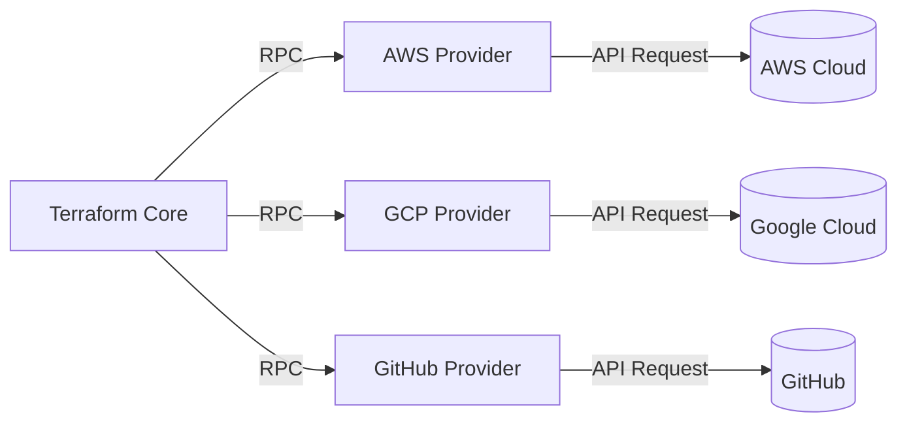
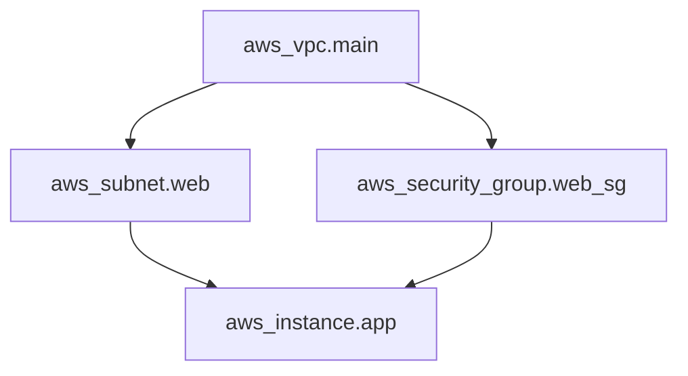
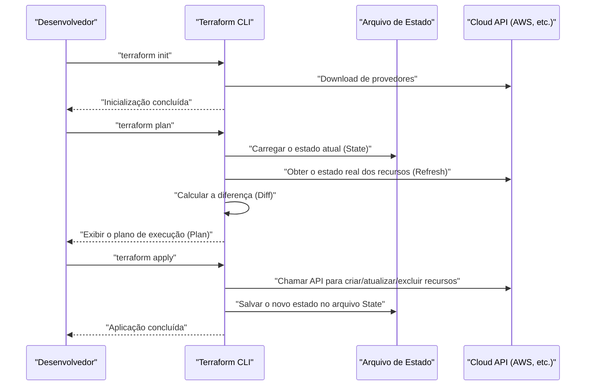
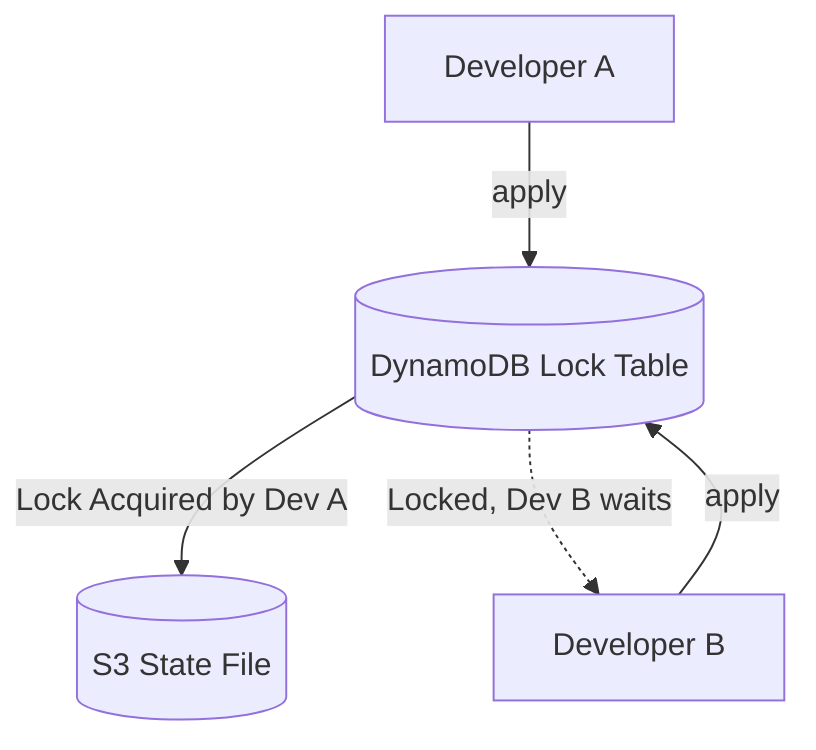
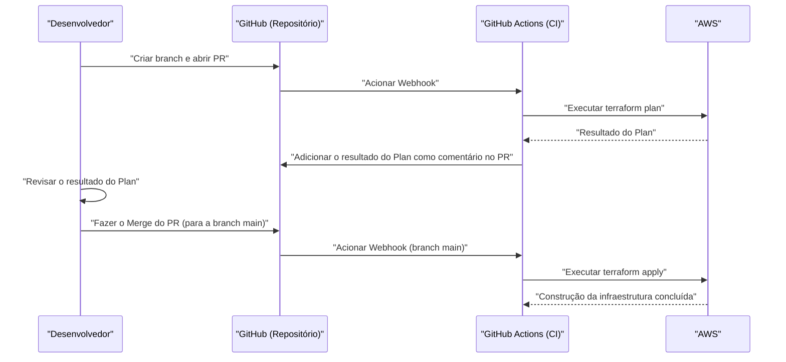

# Introdução: A Evolução da Infraestrutura e a Ascensão do IaC

No mundo do desenvolvimento de sistemas, ocorreu há muito tempo uma mudança de paradigma: gerenciar não apenas o código da aplicação, mas também a própria infraestrutura como código. Isso é **Infrastructure as Code (IaC)**. A construção manual de servidores (as chamadas "construções baseadas em manuais" e "operações de clique") era um terreno fértil para erros humanos, sofrendo com problemas fatais como a falta de escalabilidade e reprodutibilidade.

Neste artigo, começaremos pelo conceito de IaC e focaremos em seu padrão de fato, o **Terraform**. Explicaremos em grandes detalhes a filosofia de "gerenciamento de configuração declarativo" adotada pelo Terraform, sua arquitetura interna, o mecanismo de gerenciamento de estado (State) e as melhores práticas aplicáveis.

---

# 1. O que é Infrastructure as Code (IaC)?

## 1.1. Abordagens Tradicionais e Suas Limitações

Antes da popularização da computação em nuvem, ou nos primeiros ambientes de nuvem, os engenheiros de infraestrutura criavam recursos manualmente a partir de consoles GUI (como AWS Management Console e Azure Portal).
Embora essa abordagem fosse intuitiva e tivesse uma curva de aprendizado baixa, ela tinha as seguintes limitações:

- **Falta de reprodutibilidade**: Risco de manuais desatualizados ou configurações diferentes devido à interpretação do operador.
- **Dificuldade em auditoria e rastreamento**: É difícil manter um histórico de "quem, quando e por que" as alterações foram feitas.
- **Barreira de escalabilidade**: Construir centenas de servidores manualmente consome um tempo físico excessivo.

## 1.2. Benefícios do IaC

Ao codificar a infraestrutura, é possível aplicar as melhores práticas cultivadas no desenvolvimento de software à construção de infraestrutura.

1. **Controle de versão**: É possível gerenciar o histórico de alterações da infraestrutura usando um VCS (Sistema de Controle de Versão) como o Git.
2. **Processo de revisão**: Permite revisões de código através de Pull Requests (PR), garantindo a qualidade antes da aplicação das alterações.
3. **Automação e Integração Contínua**: Ao integrá-lo num pipeline de [CI/CD](https://kenji.blog/pt/p/cicd-pipeline-github-actions-best-practices/), testes e implantações podem ser automatizados.
4. **Consistência e Idempotência (Idempotency)**: Garante que o resultado (estado) será sempre o mesmo, não importa quantas vezes seja executado.

## 1.3. Diferença entre as Abordagens Imperativa (Imperative) e Declarativa (Declarative)

As ferramentas de IaC dividem-se amplamente em duas abordagens: "imperativa" e "declarativa".

### Imperativa (Imperative)
Descreve **"como (How) construir a infraestrutura"**. Scripts (Bash, Python) ou o Ansible (embora parcialmente declarativo, possui um forte aspecto imperativo ao se considerar a ordem de execução das tarefas) enquadram-se aqui.
- Exemplo: "Inicie 1 instância EC2, em seguida crie um bucket S3 e, depois, obtenha o endereço IP do EC2."

### Declarativa (Declarative)
Descreve **"qual deve ser o estado final esperado (What)"**. O sistema compara o estado atual com o estado ideal definido e calcula automaticamente as alterações necessárias para aplicá-las. O **Terraform** é o principal representante desta abordagem.
- Exemplo: "Deve existir 1 instância EC2 e um bucket S3."

---

# 2. O que é o Terraform?

O Terraform é uma ferramenta de IaC de código aberto desenvolvida em [Go](https://kenji.blog/pt/p/programming-languages-history-paradigm-evolution/) pela HashiCorp. Ele permite que as APIs de tudo, desde infraestrutura em nuvem até configurações de SaaS, sejam configuradas e gerenciadas como código.

## 2.1. Arquitetura de Provedores (Provider)

A maior força do Terraform está na sua **independência de plataforma** e no seu **ecossistema de provedores**. O próprio Terraform (Core) não cria recursos diretamente. Em vez disso, ele comunica com a API de cada serviço através de plugins chamados "Providers".



Isso torna possível gerenciar serviços completamente diferentes, como AWS, Datadog e GitHub, de forma integrada, a partir de uma única base de código.

## 2.2. HCL (HashiCorp Configuration Language)

As configurações do Terraform são escritas utilizando **HCL**, que é compatível com JSON e altamente legível para os humanos. Abaixo, está um exemplo simples que define uma instância EC2 na AWS.

```hcl
provider "aws" {
  region = "ap-northeast-1"
}

resource "aws_instance" "web" {
  ami           = "ami-0c3fd0f5d33134a76"
  instance_type = "t3.micro"

  tags = {
    Name        = "WebServer"
    Environment = "Production"
  }
}
```

Este código declara "um estado onde existe uma instância EC2 na região de Tóquio, com a AMI e o tipo de instância especificados".

---

# 3. A Filosofia do Gerenciamento de Configuração Declarativo

A essência do Terraform reside nesta abordagem **declarativa (Declarative)**. Por que essa abordagem é superior?

## 3.1. Cálculo Automático de Estado e Resolução de Dependências

Em scripts imperativos, é necessário que o ser humano escreva a ordem exata na qual os recursos devem ser criados. Por exemplo, criar uma VPC, criar uma sub-rede depois disso e, finalmente, colocar o EC2 dentro dessa sub-rede.

No Terraform, o Terraform Core constrói automaticamente um **Grafo de Dependências (Dependency [Graph](https://kenji.blog/pt/p/tree-graph-data-structures-search-dfs-bfs-dijkstra/))** a partir das relações de referência que aparecem no código (por exemplo, referenciar `aws_vpc.main.id` nas configurações de uma sub-rede).



Através desta abordagem baseada na teoria dos grafos, o Terraform alcança o seguinte:
- **Criação paralela** (aceleração) de recursos que não possuem dependências.
- Criação, atualização e exclusão de recursos na ordem correta.

## 3.2. Idempotência (Idempotency)

Outro benefício da abordagem declarativa é a **idempotência**. Não importa quantas vezes seja executado o `terraform apply` com o mesmo código, o estado final da infraestrutura corresponderá perfeitamente ao que está descrito no código. Para os recursos que já estão no estado esperado, o Terraform irá determinar "nenhuma mudança (No changes)".

Isso nos liberta do pesadelo operacional de "verificar manualmente até onde o script chegou se ocorrer um erro durante a execução, corrigir o script e executá-lo novamente".

---

# 4. Fluxo de Execução: Init, Plan, Apply

As operações básicas do Terraform estão divididas amplamente em 3 fases. É este fluxo de trabalho que torna possíveis as mudanças seguras de infraestrutura.



### 1. `terraform init`
Inicializa o diretório de trabalho. Descarrega os plugins dos provedores especificados e define as configurações do backend (o local de armazenamento do State).

### 2. `terraform plan`
Realiza uma simulação (Dry-Run). Compara o código escrito com o estado real atual da infraestrutura e exibe "o que será adicionado (+), alterado (~), ou removido (-)". Durante esta fase, reviu-se se há alguma eliminação não intencional de recursos.

### 3. `terraform apply`
Aplica efetivamente o plano de alterações apresentado no `plan` ao provedor de nuvem.

---

# 5. Gerenciamento de Estado: O Abismo do Arquivo State

Para entender o Terraform, o conceito de **State (Estado)** é inevitável.

## 5.1. O que é o terraform.tfstate

Para mapear o código (estado ideal) com a infraestrutura real, o Terraform gera e gere um arquivo no formato JSON chamado `.tfstate`.

Por que motivo é necessário um arquivo State? Poderia parecer que seria suficiente chamar a API da nuvem todas as vezes para obter todos os recursos.
Os motivos são os seguintes:

1. **Preservação de Metadados e Dependências**: Fazer cache de metadados específicos do Terraform e do grafo de dependências na criação de recursos, que as APIs da nuvem não retornam.
2. **Performance**: Em infraestruturas de grande escala, buscar o estado de todos os recursos via API sempre causaria timeouts ou limites de taxa da API (rate limits).
3. **Rastreamento de Recursos**: Se remover a definição de um recurso do código, o Terraform identificará "um recurso que existe no arquivo State mas não no código" e executará uma ação de eliminação. Sem o State, o recurso removido do código simplesmente seria "abandonado".

## 5.2. Remote State e Gerenciamento de Locks

No desenvolvimento em equipa, deixar o `terraform.tfstate` na máquina local é um **anti-padrão absoluto**. Se várias pessoas executarem `terraform apply` simultaneamente, o State entrará em conflito e a infraestrutura será danificada.

A solução para isso são o **Remote State** e o **State Locking**.
No ambiente AWS, é padrão usar um bucket S3 como destino do State e o DynamoDB para gerir os bloqueios (locks).

```hcl
terraform {
  backend "s3" {
    bucket         = "my-terraform-state-bucket"
    key            = "prod/terraform.tfstate"
    region         = "ap-northeast-1"
    dynamodb_table = "terraform-state-lock"
    encrypt        = true
  }
}
```



Ao configurar desta forma, enquanto o Developer A estiver executando o `apply`, um bloqueio será gravado no DynamoDB e a execução do Developer B será bloqueada.

## 5.3. Detecção e Correção de Desvios (Drift)

Quando a infraestrutura é modificada fora do Terraform (por exemplo, manualmente pelo console da GUI), chamamos isso de **Configuration Drift (Desvio de Configuração)**.

Durante a execução do `plan` ou `apply`, o Terraform primeiro obtém o estado real atual na nuvem (Refresh) e atualiza o arquivo State. Em seguida, comparando com o código, ele pode detetar essas mudanças manuais e "puxar de volta" (ou propor correções) ao estado original definido pelo código.

---

# 6. Modularização e Reutilização

À medida que o sistema cresce, a base de código do Terraform também incha. Para manter o princípio DRY (Don't Repeat Yourself), o Terraform possui um mecanismo chamado **Module (Módulo)**.

## 6.1. O Básico dos Módulos

Um módulo é um contêiner que agrupa recursos relacionados. Ele encapsula uma função específica (por exemplo, um conjunto de redes VPC, um conjunto de clusters ECS, etc.) e define variáveis de entrada (Variables) e de saída (Outputs) para criar componentes reutilizáveis.

**Exemplo de estrutura de diretório:**
```text
.
├── environments
│   ├── prod
│   │   └── main.tf      # Chama o módulo a partir do ambiente de produção
│   └── stg
│       └── main.tf      # Chama o módulo a partir do ambiente de homologação (STG)
└── modules
    └── vpc
        ├── main.tf      # Definição dos recursos dentro do módulo
        ├── variables.tf # Entradas para o módulo
        └── outputs.tf   # Saídas do módulo
```

**Lado do chamador do módulo (`environments/prod/main.tf`):**
```hcl
module "vpc" {
  source = "../../modules/vpc"

  vpc_cidr             = "10.0.0.0/16"
  environment          = "prod"
  enable_dns_hostnames = true
}
```

Projetando os módulos desta forma, a mesma arquitetura de rede pode ser facilmente construída em ambientes de produção, homologação ou desenvolvimento apenas alterando os parâmetros (variáveis).

---

# 7. Recursos Avançados do Terraform

A HCL do Terraform não é apenas um simples ficheiro de configurações; possui funcionalidades para construir certa lógica.

## 7.1. Blocos Dinâmicos (dynamic block)

Gera dinamicamente blocos aninhados com base num mapa ou lista. É muito útil, por exemplo, na configuração de regras de security groups.

```hcl
resource "aws_security_group" "web" {
  name   = "web-sg"
  vpc_id = aws_vpc.main.id

  dynamic "ingress" {
    for_each = var.allowed_web_ports
    content {
      from_port   = ingress.value
      to_port     = ingress.value
      protocol    = "tcp"
      cidr_blocks = ["0.0.0.0/0"]
    }
  }
}
```

## 7.2. Quando Usar for_each vs count

Ao criar múltiplos recursos similares, utilizam-se o `count` ou o `for_each`.

- **count**: Cria o número especificado de recursos em formato numérico inteiro. Como depende do índice da lista, se um elemento intermédio for apagado, os índices irão deslocar-se, havendo o risco de os recursos subsequentes serem apagados e recriados involuntariamente.
- **for_each**: Recebe um mapa ou um conjunto (set) de strings e cria um recurso com base em cada chave. Como é resistente ao deslocamento de índices, **o uso de for_each é recomendado** para fazer o loop de recursos.

---

# 8. Integração com [Pipeline](https://kenji.blog/pt/p/cicd-pipeline-github-actions-best-practices/)s de [CI/CD](https://kenji.blog/pt/p/cicd-pipeline-github-actions-best-practices/) (GitOps)

O verdadeiro valor do Terraform revela-se quando ele é integrado aos fluxos de trabalho de GitOps. Proíbe-se o uso de `apply` na máquina local, automatizando todas as mudanças via Pull Requests.



## 8.1. Shift-Left da Segurança

Os pipelines de [CI/CD](https://kenji.blog/pt/p/cicd-pipeline-github-actions-best-practices/) devem incorporar ferramentas de análise estática para descobrir precocemente vulnerabilidades de infraestrutura.
- **tfsec** e **checkov**: Realizam varreduras no código quanto a riscos de segurança (como "um bucket S3 aberto ao público", ou "a DB não está encriptada") e interrompem o CI caso detetem problemas.

---

# 9. Abordagem Matemática para Modelagem de Custo e Confiabilidade

Ao desenhar a infraestrutura utilizando IaC, é importante avaliar o equilíbrio entre a fiabilidade (Reliabilidade) e o custo.
Por exemplo, a disponibilidade de um sistema numa arquitetura Multi-AZ ([Availability](https://kenji.blog/pt/p/cap-theorem-distributed-systems-tradeoff/) Zone) pode ser expressa através de modelos matemáticos.

Considere a fiabilidade de um único componente (AZ) como $\text{R}_1$.
Se posicionarmos os recursos em 2 AZs (redundância) e assumirmos que o sistema no seu todo estará a funcionar enquanto uma das partes estiver ativa, a fiabilidade total do sistema $\text{R}_{\text{total}}$ é dada pela seguinte fórmula:

$$
\text{R}_{\text{total}} = 1 - (1 - \text{R}_1)(1 - \text{R}_2)
$$

Ao projetar um módulo no Terraform, adicionar `az_count` como uma variável de entrada e ser capaz de implantar automaticamente uma infraestrutura que atenda a requisitos fundamentados nesse modelo matemático é uma habilidade avançada que se exige dos arquitetos.

---

# 10. Melhores Práticas e Anti-Padrões na Prática

## Melhores Práticas
1. **Divisão de ficheiros State**: Consolidar toda a infraestrutura num único arquivo State ampliará muito a área de impacto, e também tornará o `plan` lento. Divida o State (e o diretório) em unidades de ciclo de vida, como "Rede (VPC, etc.)", "Base de Dados" e "Aplicação".
2. **Fixação de Versões**: Certifique-se de fixar as versões (pinning) tanto do Terraform em si quanto dos Provedores (Providers). Isto protege a infraestrutura de alterações que causam quebras decorrentes de atualizações.
3. **Utilização de Fontes de Dados (Data Sources)**: Quando fizer referência a outro State ou recursos existentes, use o bloco `data` para obter dinamicamente os valores em vez de defini-los no código (hardcoding).

## Anti-Padrões
1. **Mistura com Alterações Manuais**: Modificar um recurso gerido pelo Terraform diretamente da GUI. Isso levará a inconsistências de estado.
2. **Hardcoding de Credenciais**: Colocar diretamente chaves de acesso e chaves secretas no código. Use variáveis de ambiente e regras do IAM ([OIDC](https://kenji.blog/pt/p/oauth2-oidc-authentication-authorization-difference/) e integrações semelhantes).
3. **Módulos Demasiado Complexos**: Ao tentar incorporar todas as funcionalidades num módulo, há a possibilidade de criar dezenas de variáveis, degradando severamente a legibilidade. Tenha sempre em mente que "1 módulo deve ter 1 responsabilidade" (Single Responsibility).

---

# 11. Conclusão

**Infrastructure as Code** é uma prática indispensável no desenvolvimento moderno de software. Dentre elas, o **Terraform** consolidou a sua posição como o padrão de fato da indústria em IaC por meio de sua filosofia poderosa de "gerenciamento de configuração declarativo", um avançado rastreamento via o seu State e o seu amplo ecossistema de provedores que cruza plataformas.

Entretanto, você não conseguirá extrair o máximo benefício simplesmente introduzindo a ferramenta. Para uma operação de infraestrutura verdadeiramente segura e escalável, é necessário associar isso a um conjunto de "melhores práticas": uma boa estruturação do código utilizando módulos, o estabelecimento de fluxos de desenvolvimento da equipa com remoção do State e locking, a adoção do GitOps por meio da integração de [CI/CD](https://kenji.blog/pt/p/cicd-pipeline-github-actions-best-practices/), assim como as políticas de segurança de "shift-left".

A infraestrutura não é mais algo que simplesmente se constrói "clicando em botões". Tal como o software, ela entrou na era onde deve ser "codificada, testada, e implantada de forma contínua". Domine o uso do Terraform e construa belas e robustas arquiteturas de infraestrutura.
