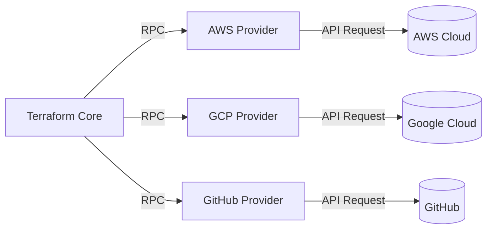
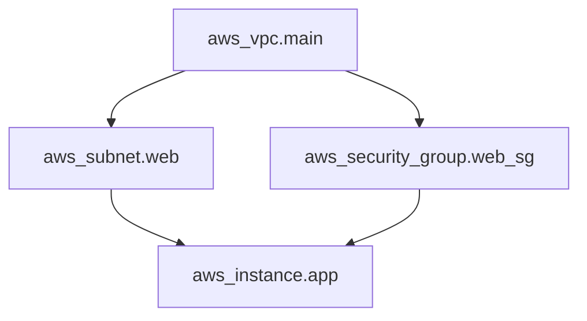
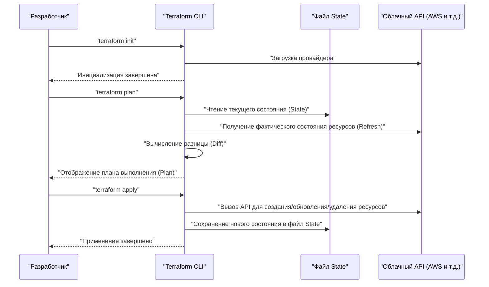
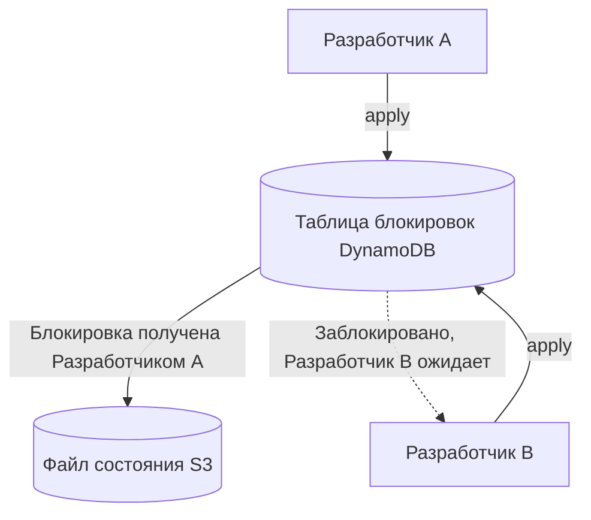
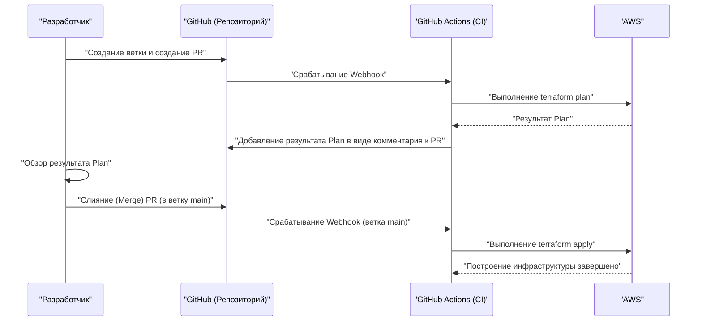

# Введение: Эволюция инфраструктуры и появление IaC

В мире разработки систем уже давно произошел сдвиг парадигмы в сторону управления не только кодом приложений, но и самой инфраструктурой в виде кода. Это и есть **Infrastructure as Code (IaC)**. Ручная настройка серверов (так называемая «настройка по инструкциям» или «настройка кликами») была рассадником человеческих ошибок и имела фатальные проблемы, связанные с отсутствием масштабируемости и воспроизводимости.

В этой статье мы начнем с концепции IaC и сосредоточимся на **Terraform**, который можно назвать фактическим стандартом в этой области. Мы подробно рассмотрим философию «декларативного управления конфигурацией», принятую в Terraform, внутреннюю архитектуру, механизм управления состоянием (State) и практические лучшие практики.

---

# 1. Что такое Infrastructure as Code (IaC)

## 1.1. Традиционные методы и их ограничения

До широкого распространения облачных вычислений, или на ранних этапах развития облачных сред, инженеры инфраструктуры создавали ресурсы вручную через графические консоли (такие как AWS Management Console или Azure Portal).
Этот метод был интуитивно понятным и имел низкий порог входа, но имел следующие ограничения:

- **Отсутствие воспроизводимости** : Риск того, что инструкции устарели, или настройки различаются в зависимости от интерпретации исполнителя.
- **Сложность аудита и отслеживания** : Трудно сохранить историю того, «кто, когда и почему» внес изменения.
- **Барьер масштабирования** : При создании сотен серверов ручная работа занимает слишком много физического времени.

## 1.2. Преимущества IaC

Превращая инфраструктуру в код, мы можем применять передовые практики, накопленные в разработке программного обеспечения, к созданию инфраструктуры.

1. **Контроль версий** : Использование систем контроля версий (VCS), таких как Git, позволяет управлять историями изменений инфраструктуры.
2. **Процесс проверки** : Становится возможным обзор кода через Pull Request (PR), что обеспечивает качество перед внесением изменений.
3. **Автоматизация и непрерывная интеграция** : Встраивание в пайплайны [CI/CD](https://kenji.blog/ru/p/cicd-pipeline-github-actions-best-practices/) позволяет автоматизировать тестирование и развертывание.
4. **Согласованность и идемпотентность (Idempotency)** : Гарантируется, что независимо от количества выполнений результат (состояние) всегда будет одинаковым.

## 1.3. Разница между процедурным (Imperative) и декларативным (Declarative) подходами

Инструменты IaC можно условно разделить на два подхода: «процедурный» и «декларативный».

### Процедурный (Imperative)
Описывает **«как (How) создать инфраструктуру»**. Сюда относятся скрипты (Bash или Python), а также Ansible (отчасти декларативный, но имеет сильную процедурную сторону в плане учета порядка выполнения задач).
- Пример: «Запустить один инстанс EC2, затем создать бакет S3 и получить IP-адрес EC2»

### Декларативный (Declarative)
Описывает **«каким должно быть конечное состояние (What)»**. Система сравнивает текущее состояние с определенным идеальным состоянием и автоматически вычисляет и применяет необходимые изменения. **Terraform** является типичным представителем этого подхода.
- Пример: «Существует один инстанс EC2, и существует бакет S3»

---

# 2. Что такое Terraform

Terraform — это инструмент IaC с открытым исходным кодом, разработанный компанией HashiCorp на языке Go. Он позволяет конфигурировать и управлять любыми API в виде кода, от облачной инфраструктуры до настроек SaaS.

## 2.1. Архитектура провайдеров (Provider)

Главное преимущество Terraform заключается в его **независимости от платформы** и **экосистеме провайдеров**. Само ядро Terraform (Core) не создает ресурсы напрямую. Вместо этого оно взаимодействует с API каждого сервиса через плагины, называемые «провайдерами» (Provider).



Это позволяет управлять совершенно разными сервисами, такими как AWS, Datadog и GitHub, централизованно из единой кодовой базы.

## 2.2. HCL (HashiCorp Configuration Language)

Конфигурации Terraform пишутся с использованием **HCL**, который совместим с JSON, но при этом легко читается и пишется человеком. Ниже приведен простой пример определения инстанса EC2 в AWS.

```hcl
provider "aws" {
  region = "ap-northeast-1"
}

resource "aws_instance" "web" {
  ami           = "ami-0c3fd0f5d33134a76"
  instance_type = "t3.micro"

  tags = {
    Name        = "WebServer"
    Environment = "Production"
  }
}
```

Этот код объявляет «состояние, при котором в регионе Токио существует инстанс EC2 с указанными AMI и типом инстанса».

---

# 3. Философия декларативного управления конфигурацией

Суть Terraform заключается в этом **декларативном (Declarative)** подходе. Почему же этот подход лучше?

## 3.1. Автоматическое вычисление состояния и разрешение зависимостей

В процедурных скриптах человек должен точно описывать порядок создания ресурсов. Например, порядок создания VPC, затем подсети, и размещения EC2 в этой подсети.

В Terraform ядро Terraform Core автоматически строит **граф зависимостей (Dependency Graph)** на основе связей (например, ссылки на `aws_vpc.main.id` в настройках подсети), которые появляются в коде.



Благодаря такому подходу, основанному на теории графов, Terraform реализует следующее:
- **Параллельное создание** ресурсов без зависимостей (ускорение).
- Создание, обновление и удаление ресурсов в правильном порядке.

## 3.2. Идемпотентность (Idempotency)

Еще одним преимуществом декларативного подхода является **идемпотентность**. Независимо от того, сколько раз вы выполняете `terraform apply`, конечное состояние инфраструктуры будет полностью соответствовать тому, что описано в коде. Для ресурсов, которые уже находятся в ожидаемом состоянии, Terraform определит, что «изменения не требуются» (No changes).

Это избавляет от эксплуатационного кошмара вроде: «Если во время выполнения скрипта произошла ошибка, нужно вручную проверять, до какого этапа он выполнился, исправлять скрипт и запускать его снова».

---

# 4. Поток выполнения: Init, Plan, Apply

Основные операции Terraform условно делятся на три фазы. Именно этот рабочий процесс позволяет безопасно вносить изменения в инфраструктуру.



### 1. `terraform init`
Инициализирует рабочий каталог. Загружает плагины указанных провайдеров и настраивает бэкенд (место сохранения State).

### 2. `terraform plan`
Выполняет пробный запуск (Dry-Run). Сравнивает описание кода с текущим фактическим состоянием инфраструктуры и выводит, «что будет добавлено (+), изменено (~), удалено (-)». На этом этапе проводится проверка на отсутствие непреднамеренного удаления ресурсов.

### 3. `terraform apply`
Фактически применяет к облачному провайдеру план изменений, предложенный в `plan`.

---

# 5. Управление состоянием: Глубины файла State

При изучении Terraform нельзя обойти стороной концепцию **состояния (State)**.

## 5.1. Что такое terraform.tfstate

Terraform создает и управляет файлом в формате JSON под названием `.tfstate`, чтобы сопоставить код (идеальное состояние) с реальной инфраструктурой.

Зачем вообще нужен файл State? Казалось бы, можно каждый раз обращаться к облачному API и получать все ресурсы.
Причины заключается в следующем:

1. **Сохранение метаданных и зависимостей** : Для кэширования специфичных для Terraform метаданных, которые не возвращаются облачным API, и графа зависимостей при создании ресурсов.
2. **Производительность** : В крупномасштабных инфраструктурах получение состояния всех ресурсов через API каждый раз приведет к тайм-аутам и превышению лимитов запросов к API.
3. **Отслеживание ресурсов** : Если вы удаляете определение ресурса из кода, Terraform определяет «ресурсы, которые существуют в файле State, но отсутствуют в коде» и выполняет действие удаления. Без State ресурсы, удаленные из кода, были бы просто «брошены».

## 5.2. Удаленное состояние (Remote State) и управление блокировками

В командной разработке хранение `terraform.tfstate` на локальной машине является **абсолютным антипаттерном**. Если несколько человек одновременно выполнят `terraform apply`, произойдет конфликт состояний, и инфраструктура будет повреждена.

Эту проблему решают **Remote State** и **State Locking**.
В среде AWS стандартом является использование бакета S3 для хранения State и DynamoDB для управления блокировками.

```hcl
terraform {
  backend "s3" {
    bucket         = "my-terraform-state-bucket"
    key            = "prod/terraform.tfstate"
    region         = "ap-northeast-1"
    dynamodb_table = "terraform-state-lock"
    encrypt        = true
  }
}
```



С такой настройкой, пока Разработчик A выполняет `apply`, блокировка записывается в DynamoDB, и выполнение для Разработчика B блокируется.

## 5.3. Обнаружение и исправление дрейфа (Drift)

Изменение инфраструктуры вне Terraform (например, вручную из графической консоли) называется **дрейфом конфигурации (Configuration Drift)**.

При выполнении `plan` или `apply` Terraform сначала получает последнее фактическое состояние в облаке (Refresh) и обновляет файл State. Затем он сравнивает его с кодом, обнаруживает изменения, внесенные вручную, и может «вернуть обратно» (или предложить исправления) к исходному состоянию, определенному в коде.

---

# 6. Модульность и возможность повторного использования

По мере роста системы база кода Terraform также увеличивается. Чтобы соблюдать принцип DRY (Don't Repeat Yourself), в Terraform есть механизм под названием **Модуль (Module)**.

## 6.1. Основы модулей

Модуль — это контейнер, объединяющий связанные ресурсы. Инкапсулируя определенную функциональность (например, набор сетей VPC, кластер ECS и т. д.) и определяя входные переменные (Variables) и выходные данные (Outputs), вы создаете компоненты, пригодные для повторного использования.

**Пример структуры каталогов:**
```text
.
├── environments
│   ├── prod
│   │   └── main.tf      # Вызов модуля из рабочей среды
│   └── stg
│       └── main.tf      # Вызов модуля из среды STG
└── modules
    └── vpc
        ├── main.tf      # Определение ресурсов в модуле
        ├── variables.tf # Входные данные для модуля
        └── outputs.tf   # Выходные данные из модуля
```

**Сторона вызова модуля (`environments/prod/main.tf`):**
```hcl
module "vpc" {
  source = "../../modules/vpc"

  vpc_cidr             = "10.0.0.0/16"
  environment          = "prod"
  enable_dns_hostnames = true
}
```

Разрабатывая модули таким образом, можно легко развернуть ту же сетевую архитектуру в среде STG или среде разработки, просто изменив параметры (переменные).

---

# 7. Продвинутые функции Terraform

HCL в Terraform — это не просто файл конфигурации, он также имеет функции для создания определенной логики.

## 7.1. Динамические блоки (dynamic block)

Динамически генерирует вложенные блоки на основе списков или карт. Это особенно полезно, например, при настройке правил групп безопасности.

```hcl
resource "aws_security_group" "web" {
  name   = "web-sg"
  vpc_id = aws_vpc.main.id

  dynamic "ingress" {
    for_each = var.allowed_web_ports
    content {
      from_port   = ingress.value
      to_port     = ingress.value
      protocol    = "tcp"
      cidr_blocks = ["0.0.0.0/0"]
    }
  }
}
```

## 7.2. Разница между for_each и count

При создании нескольких похожих ресурсов используется `count` или `for_each`.

- **count** : Создает ресурсы в количестве, указанном целым числом. Поскольку это зависит от индекса списка, удаление промежуточного элемента приведет к смещению индексов, что грозит непреднамеренным пересозданием или удалением последующих ресурсов.
- **for_each** : Принимает карту или набор строк и создает ресурсы на основе каждого ключа. Поскольку он устойчив к смещению индексов, **рекомендуется использовать for_each** для цикличности ресурсов.

---

# 8. Интеграция с пайплайнами [CI/CD](https://kenji.blog/ru/p/cicd-pipeline-github-actions-best-practices/) (GitOps)

Истинная ценность Terraform раскрывается при его интеграции в рабочий процесс GitOps. Выполнение `apply` локально запрещается, и все изменения автоматизируются через Pull Request.



## 8.1. Сдвиг безопасности влево (Shift-Left Security)

В пайплайны [CI/CD](https://kenji.blog/ru/p/cicd-pipeline-github-actions-best-practices/) следует встраивать инструменты статического анализа для раннего обнаружения уязвимостей в инфраструктуре.
- **tfsec** или **checkov**: Сканируют на уровне кода риски безопасности, такие как «Публичный доступ к бакету S3» или «База данных не зашифрована», и останавливают CI с ошибкой при обнаружении проблем.

---

# 9. Математический подход к надежности и моделированию затрат

При проектировании инфраструктуры с использованием IaC важно оценивать баланс между надежностью (Reliability) и затратами.
Например, коэффициент доступности системы в архитектуре Multi-AZ (Availability Zone) можно выразить математической моделью.

Пусть надежность отдельного компонента (AZ) равна $R_1$.
Если ресурсы размещены в двух AZ (избыточность) и система считается работающей, если работает хотя бы одна из них, то общая надежность системы $R_{total}$ выражается следующей формулой.

$$
R_{total} = 1 - (1 - R_1)(1 - R_2)
$$

При проектировании модулей в Terraform добавление входной переменной `az_count` для автоматического развертывания инфраструктуры, удовлетворяющей требованиям на основе этой математической модели, является продвинутым навыком проектирования, который ожидается от архитекторов.

---

# 10. Практические лучшие практики и антипаттерны

## Лучшие практики
1. **Разделение файлов State** : Размещение всей инфраструктуры в одном файле State слишком сильно расширяет зону влияния и замедляет выполнение `plan`. Разделяйте State (и каталоги) на единицы с разным жизненным циклом, такие как «Сеть (VPC и т.д.)», «База данных» и «Приложение».
2. **Фиксация версий** : Обязательно фиксируйте (pinning) версию самого Terraform и версии Provider-ов. Это защитит вашу инфраструктуру от ломающих изменений при обновлениях.
3. **Использование источников данных (Data Sources)** : При обращении к другим State или существующим ресурсам не используйте жестко заданные значения, а динамически получайте их с помощью блока `data`.

## Антипаттерны
1. **Смешивание с ручными изменениями** : Прямое изменение ресурсов, управляемых Terraform, через графический интерфейс. Это приводит к несогласованности State.
2. **Жесткое кодирование учетных данных** : Прямое указание ключей доступа и секретных ключей в коде. Используйте переменные окружения или роли IAM (например, интеграцию OIDC).
3. **Слишком сложные модули** : Попытка наделить модуль всеми возможными функциями приводит к появлению десятков переменных и значительному снижению читаемости. Помните, что «один модуль должен иметь одну зону ответственности (Single Responsibility)».

---

# 11. Заключение

**Infrastructure as Code** — незаменимая практика в современной разработке программного обеспечения. В частности, **Terraform** утвердился в качестве фактического стандарта IaC благодаря мощной философии «декларативного управления конфигурацией», расширенному отслеживанию состояния через State и богатой кроссплатформенной экосистеме провайдеров.

Однако простое внедрение инструмента не позволит в полной мере воспользоваться его преимуществами. Безопасная и масштабируемая эксплуатация инфраструктуры становится возможной только при сочетании таких «лучших практик», как структурирование кода с помощью модулей, построение командной разработки с помощью удаленного State и блокировок, реализация GitOps через интеграцию с [CI/CD](https://kenji.blog/ru/p/cicd-pipeline-github-actions-best-practices/) и сдвиг безопасности влево.

Инфраструктура больше не создается «кликами». Мы живем в эпоху, когда, как и программное обеспечение, ее необходимо «кодировать, тестировать и непрерывно развертывать». Овладейте Terraform и создайте надежную и красивую архитектуру инфраструктуры.
