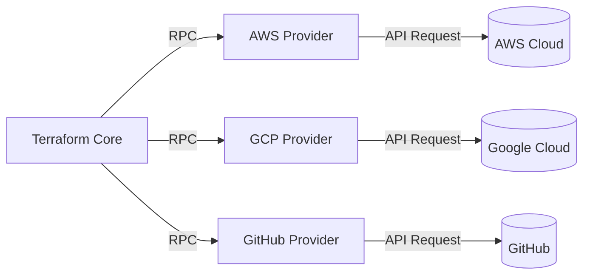
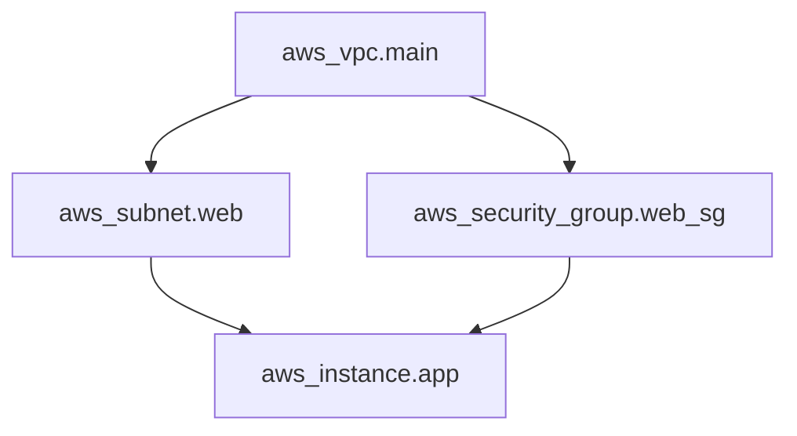
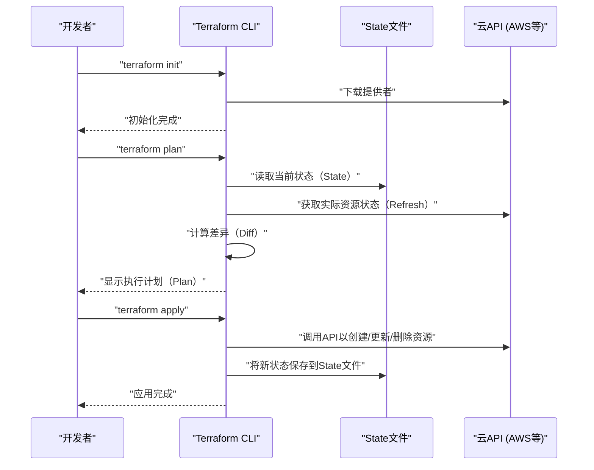
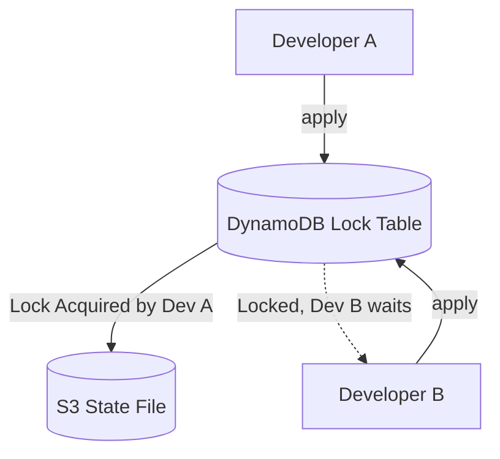
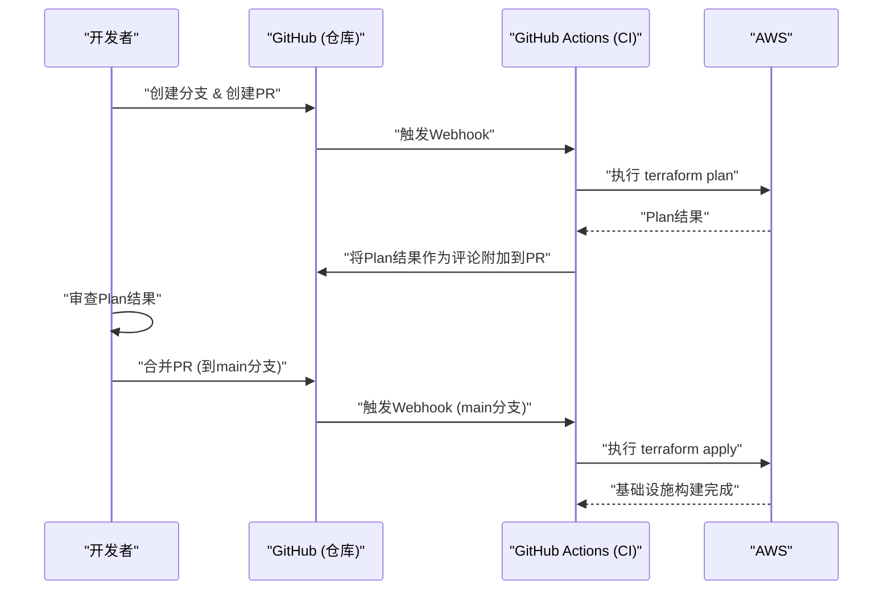

# 引言：基础设施的演进与IaC的崛起

在系统开发领域，不仅是应用程序的代码，将基础设施本身也作为代码来管理的范式转变已经发生很久了。这就是 **Infrastructure as Code (IaC)** 。手动搭建服务器（即所谓的“基于操作手册的搭建”或“点击操作”）是人为错误的温床，并且存在缺乏可扩展性和可重复性这一致命问题。

本文将从IaC的概念开始，重点介绍其可以说是事实标准的 **Terraform** 。我们将非常详细地解析Terraform采用的“声明式配置管理”哲学、内部架构、状态管理（State）机制，以及实际的最佳实践。

---

# 1. 什么是 Infrastructure as Code (IaC)

## 1.1. 传统方法及其局限性

在云计算普及之前，或者在早期的云环境中，基础设施工程师通过GUI控制台（如AWS Management Console或Azure Portal）手动创建资源。
这种方法虽然直观且学习成本低，但存在以下局限性：

- **缺乏可重复性** ：操作手册可能已过时，或者存在因操作人员的理解不同而导致配置不同的风险。
- **审计和追踪困难** ：很难留下“谁、何时、为什么”进行更改的历史记录。
- **扩展壁垒** ：在构建数百台服务器时，手动操作会花费太多的物理时间。

## 1.2. IaC的优势

通过将基础设施代码化，可以将软件开发中积累的优秀实践应用到基础设施构建中。

1. **版本控制** ：使用Git等VCS（版本控制系统），可以管理基础设施的变更历史。
2. **审查流程** ：可以通过Pull Request（PR）进行代码审查，从而在变更前保证质量。
3. **自动化与持续集成** ：通过集成到[CI/CD](https://kenji.blog/zh-cn/p/cicd-pipeline-github-actions-best-practices/)流水线中，可以自动化测试和部署。
4. **一致性与幂等性（Idempotency）** ：无论执行多少次，都能保证结果（状态）始终相同。

## 1.3. 命令式（Imperative）与声明式（Declarative）的区别

IaC工具大致可以分为“命令式”和“声明式”两种方法。

### 命令式 (Imperative)
描述 **“如何（How）构建基础设施”** 。脚本（Bash或Python）或者Ansible（虽然部分是声明式的，但在需要关注任务执行顺序这一点上，有很强的命令式特征）等属于此类。
- 示例：“启动1台EC2实例，然后创建S3存储桶，并获取EC2的IP地址”

### 声明式 (Declarative)
描述 **“最终期望是什么状态（What）”** 。系统会比较当前状态与定义的理想状态，自动计算并应用所需的变更。 **Terraform** 是这种方法的典型代表。
- 示例：“存在1台EC2实例，并且存在S3存储桶”

---

# 2. 什么是Terraform

Terraform是由HashiCorp公司使用Go语言开发的开源IaC工具。从云基础设施到SaaS配置，可以将各种API作为代码进行配置和管理。

## 2.1. 提供者（Provider）架构

Terraform最大的优势在于其 **平台无关性** 和 **提供者生态系统** 。Terraform核心（Core）不会直接创建资源。相反，它通过称为“Provider”的插件与各服务的API进行通信。



由此，可以通过一个代码库统一管理AWS、Datadog、GitHub等完全不同的服务。

## 2.2. HCL (HashiCorp Configuration Language)

Terraform的配置是使用 **HCL** 编写的，这是一种兼容JSON但对人类更易于读写的语言。以下是定义AWS EC2实例的一个简单示例。

```hcl
provider "aws" {
  region = "ap-northeast-1"
}

resource "aws_instance" "web" {
  ami           = "ami-0c3fd0f5d33134a76"
  instance_type = "t3.micro"

  tags = {
    Name        = "WebServer"
    Environment = "Production"
  }
}
```

这段代码声明了“在东京区域，存在具有指定AMI和实例类型的EC2实例的状态”。

---

# 3. 声明式配置管理的哲学

Terraform的核心在于这种 **声明式（Declarative）** 方法。为什么这种方法更优越呢？

## 3.1. 自动计算状态与解决依赖关系

在命令式脚本中，人类必须准确描述创建资源的顺序。例如，先创建VPC，然后创建子网，并将EC2放置在该子网内。

在Terraform中，从代码中出现的引用关系（例如在子网配置中引用 `aws_vpc.main.id`），Terraform Core会自动构建 **依赖关系图 (Dependency Graph)** 。



通过这种基于图论的方法，Terraform实现了以下功能：
- 没有依赖关系的资源的 **并行创建** （加速）。
- 以正确的顺序创建、更新和删除资源。

## 3.2. 幂等性（Idempotency）

声明式方法的另一个好处是 **幂等性** 。无论执行多少次 `terraform apply`，基础设施的最终状态都与代码中描述的完全一致。对于已经达到期望状态的资源，Terraform会判断为“无变更（No changes）”。

这让你摆脱了诸如“如果在脚本中途发生错误，必须手动检查执行到了哪里，修改脚本并重新执行”之类的运维噩梦。

---

# 4. 执行流程：Init, Plan, Apply

Terraform的基本操作大致分为3个阶段。正是这个工作流使得安全的基础设施变更成为可能。



### 1. `terraform init`
初始化工作目录。下载指定提供者的插件，并配置后端（State的保存位置）。

### 2. `terraform plan`
进行空运行（彩排）。将代码描述与当前实际的基础设施状态进行比较，并输出“将要添加（+）、更改（~）、删除（-）的内容”。在这个阶段审查是否存在意外的资源删除。

### 3. `terraform apply`
将 `plan` 中提示的变更计划实际应用到云提供商。

---

# 5. 状态管理：State文件的深渊

要理解Terraform， **状态（State）** 的概念是不可避免的。

## 5.1. terraform.tfstate 是什么

Terraform生成并管理一个JSON格式的 `.tfstate` 文件，以便将代码（理想状态）与实际的基础设施映射起来。

为什么特意需要State文件呢？每次调用云API获取所有资源似乎也可以。
其原因如下：

1. **保存元数据与依赖关系** ：为了缓存云API不会返回的Terraform特有的元数据，以及创建资源时的依赖关系图。
2. **性能** ：在大规模基础设施中，如果每次都通过API获取所有资源的状态，会触发超时或API速率限制。
3. **追踪资源** ：当从代码中删除资源的定义时，Terraform会识别出“存在于State文件但不在代码中的资源”，并执行删除操作。如果没有State，从代码中消失的资源将仅仅被“遗弃”。

## 5.2. 远程状态与锁管理

在团队开发中，将 `terraform.tfstate` 放在本地机器上是 **绝对的反模式** 。如果多人同时执行 `terraform apply`，会导致State冲突并损坏基础设施。

解决这个问题的方法是 **Remote State（远程状态）** 和 **State Locking（状态锁定）** 。
如果是AWS环境，标准的做法是将S3存储桶作为State的保存位置，并使用DynamoDB来管理锁。

```hcl
terraform {
  backend "s3" {
    bucket         = "my-terraform-state-bucket"
    key            = "prod/terraform.tfstate"
    region         = "ap-northeast-1"
    dynamodb_table = "terraform-state-lock"
    encrypt        = true
  }
}
```



通过这样的配置，在Developer A执行 `apply` 期间，锁会被写入DynamoDB，从而阻塞Developer B的执行。

## 5.3. 漂移（Drift）的检测与修复

基础设施在Terraform外部（例如从GUI控制台手动）被更改的情况被称为 **配置漂移（Configuration Drift）** 。

Terraform在执行 `plan` 或 `apply` 时，首先会获取云上最新的实际状态（Refresh），并更新State文件。然后将其与代码进行比较，这样就能检测到手动的更改，并能够将其“拉回（或提出修复建议）”到代码中定义的原始状态。

---

# 6. 模块化与可重用性

随着系统的扩展，Terraform的代码库也会变得臃肿。为了遵守 DRY (Don't Repeat Yourself) 原则，Terraform提供了一个称为 **Module（模块）** 的机制。

## 6.1. 模块基础

模块是汇总了相关资源的容器。通过封装特定的功能（例如：全套VPC网络、全套ECS集群等），并定义输入变量（Variables）和输出（Outputs），可以创建可重用的组件。

**目录结构示例:**
```text
.
├── environments
│   ├── prod
│   │   └── main.tf      # 从生产环境调用模块
│   └── stg
│       └── main.tf      # 从STG环境调用模块
└── modules
    └── vpc
        ├── main.tf      # 模块内的资源定义
        ├── variables.tf # 模块的输入
        └── outputs.tf   # 模块的输出
```

**模块调用方 (`environments/prod/main.tf`):**
```hcl
module "vpc" {
  source = "../../modules/vpc"

  vpc_cidr             = "10.0.0.0/16"
  environment          = "prod"
  enable_dns_hostnames = true
}
```

通过这样设计模块，只需更改参数（变量），即可轻松地在STG环境或开发环境中构建相同的网络架构。

---

# 7. Terraform的高级功能

Terraform的HCL不仅仅是配置文件，还具备一定程度的逻辑构建功能。

## 7.1. 动态块 (dynamic block)

根据列表或映射，动态生成嵌套的块。例如，在配置安全组规则时非常有用。

```hcl
resource "aws_security_group" "web" {
  name   = "web-sg"
  vpc_id = aws_vpc.main.id

  dynamic "ingress" {
    for_each = var.allowed_web_ports
    content {
      from_port   = ingress.value
      to_port     = ingress.value
      protocol    = "tcp"
      cidr_blocks = ["0.0.0.0/0"]
    }
  }
}
```

## 7.2. for_each 与 count 的区别和使用

当需要创建多个相似资源时，使用 `count` 或 `for_each`。

- **count** ：创建指定整数数量的资源。因为它依赖于列表的索引，如果中间的元素被删除，索引会发生偏移，后续的资源有被意外重建或删除的风险。
- **for_each** ：接收映射或字符串集合，并基于每个键创建资源。由于对索引偏移有很强的抵抗力， **推荐使用 for_each** 进行资源的循环处理。

---

# 8. 与[CI/CD](https://kenji.blog/zh-cn/p/cicd-pipeline-github-actions-best-practices/)流水线的集成 (GitOps)

Terraform的真正价值在整合到GitOps工作流中时才得以体现。禁止在本地执行 `apply`，而是通过Pull Request自动处理所有变更。



## 8.1. 安全左移

在[CI/CD](https://kenji.blog/zh-cn/p/cicd-pipeline-github-actions-best-practices/)流水线中，应该集成静态分析工具，以便尽早发现基础设施的漏洞。
- **tfsec** 或 **checkov** : 在代码级别扫描诸如“S3存储桶公开”、“DB未加密”等安全风险，如果发现问题，将通过错误停止CI。

---

# 9. 可靠性与成本建模的数学方法

在使用IaC设计基础设施时，评估可靠性（Reliability）与成本的平衡非常重要。
例如，多可用区（[Availability](https://kenji.blog/zh-cn/p/cap-theorem-distributed-systems-tradeoff/) Zone，AZ）架构中系统的可用率，可以用数学模型来表示。

假设单个组件（AZ）的可靠性为 $R_1$。
如果在两个AZ（冗余化）中部署了资源，并且只要其中一个在运行就可以认为整个系统在运行，那么整个系统的可靠性 $R_{total}$ 可以用以下公式表示：

$$
R_{total} = 1 - (1 - R_1)(1 - R_2)
$$

在用Terraform设计模块时，设置输入变量 `az_count`，并能够根据这一数学模型自动部署满足要求的基础设施，是架构师所需的高级设计技能。

---

# 10. 实践最佳实践与反模式

## 最佳实践
1. **State文件的分割** ：如果将所有基础设施放在一个State文件中，影响范围会过大，`plan` 的执行也会变慢。建议按照生命周期不同的单位（如“网络（VPC等）”、“数据库”、“应用程序”）来分割State（及目录）。
2. **版本固定** ：请务必固定（pinning）Terraform本体的版本和Provider的版本。以保护基础设施免受版本升级带来的破坏性变更影响。
3. **数据源（Data Sources）的利用** ：在引用其他State或现有资源时，不要硬编码，而是使用 `data` 块来动态获取值。

## 反模式
1. **手动更改的混合** ：直接从GUI更改Terraform管理的资源。这会导致State不一致。
2. **凭据的硬编码** ：在代码中直接写入访问密钥或秘密密钥。请使用环境变量或IAM角色（如[OIDC](https://kenji.blog/zh-cn/p/oauth2-oidc-authentication-authorization-difference/)集成）。
3. **过于复杂的模块** ：如果试图让模块拥有所有功能，变量将会多达几十个，可读性显著下降。请牢记“一个模块一个关注点（Single Responsibility）”。

---

# 11. 总结

**Infrastructure as Code** 是现代软件开发中不可或缺的实践。其中 **Terraform** 凭借“声明式配置管理”这一强大的哲学、基于State的高级状态追踪，以及跨平台的丰富提供者生态系统，确立了其作为IaC事实标准的地位。

然而，仅仅引入工具并不能最大化其优势。只有将基于模块的代码结构化、基于远程状态与锁的团队开发体制、与[CI/CD](https://kenji.blog/zh-cn/p/cicd-pipeline-github-actions-best-practices/)集成实现GitOps，以及安全左移等“最佳实践”结合起来，才能实现安全、可扩展的基础设施运维。

基础设施不再是“点击创建”的东西。现在是和软件一样“编码、测试、持续部署”的时代。请熟练掌握Terraform，构建坚固而美丽的基础设施架构。
