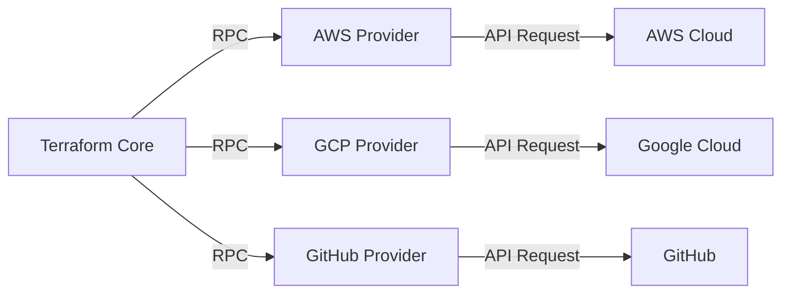
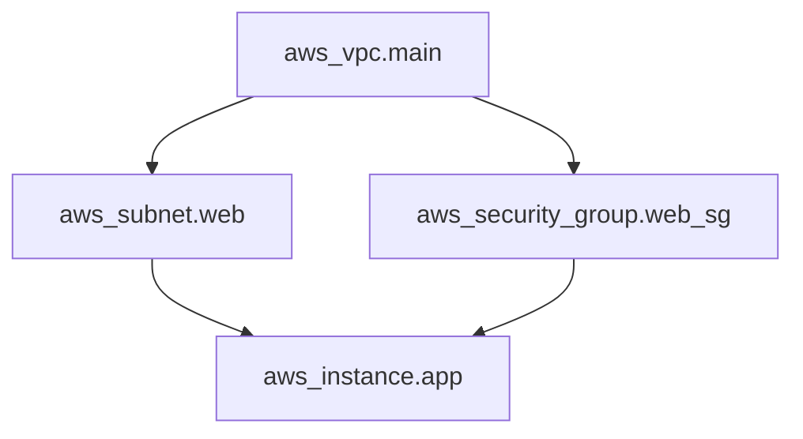
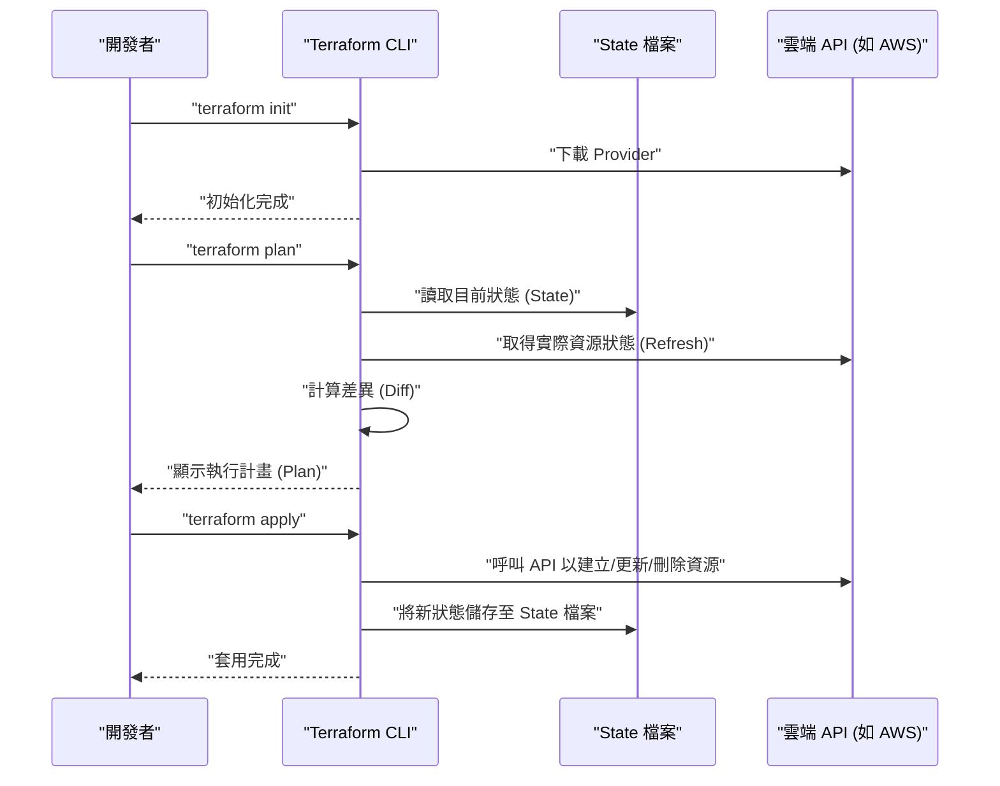
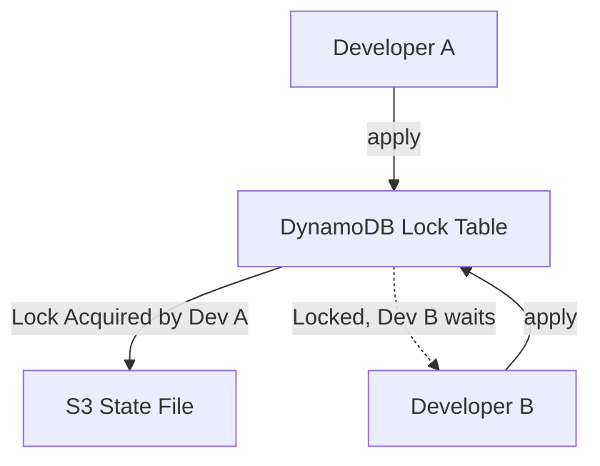
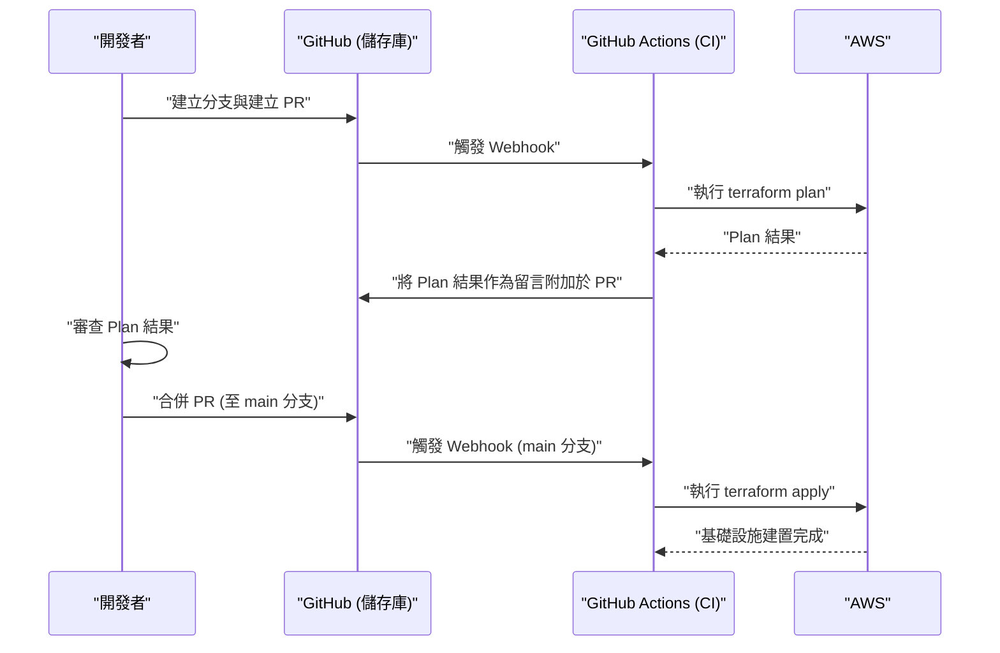

# 前言：基礎設施的演進與 IaC 的崛起

在系統開發的世界中，不僅是應用程式的程式碼，將基礎設施本身也視為程式碼來管理的典範轉移已發生多時。這就是 **Infrastructure as Code (IaC)** 。手動建置伺服器（即所謂的「基於步驟手冊的建置」或「點擊操作」）是人為錯誤的溫床，並存在著缺乏擴展性與可重現性的致命問題。

本篇文章將從 IaC 的概念開始，並聚焦於可說已成為事實標準的 **Terraform** 。我們將非常詳細地解說 Terraform 所採用的「宣告式組態管理」哲學、內部架構、狀態管理（State）的機制，以及實用的最佳實踐。

---

# 1. 什麼是 Infrastructure as Code (IaC)

## 1.1. 傳統手法及其極限

在雲端運算普及之前，或者在早期的雲端環境中，基礎設施工程師是從圖形使用者介面主控台（如 AWS Management Console 或 Azure Portal 等）手動建立資源。
這種手法雖然直覺且學習成本低，但存在以下極限：

- **缺乏可重現性** ：步驟手冊可能已過時，或者根據作業人員的解讀而導致設定不同的風險。
- **稽核與追蹤的困難度** ：難以將「誰、在何時、為了什麼原因」進行變更保留為歷史紀錄。
- **擴展的障礙** ：在建置數百台伺服器時，手動作業會花費過多的實體時間。

## 1.2. IaC 的優點

透過將基礎設施程式碼化，可以將軟體開發中累積的優秀實踐也應用到基礎設施建置上。

1. **版本控制** ：使用 Git 等 VCS（版本控制系統），可以管理基礎設施的變更歷史。
2. **審查流程** ：透過 Pull Request (PR) 進行程式碼審查成為可能，能夠在變更前確保品質。
3. **自動化與持續整合** ：透過整合到 [CI/CD](https://kenji.blog/zh-tw/p/cicd-pipeline-github-actions-best-practices/) 管道，可以自動化測試與部署。
4. **一致性與冪等性 (Idempotency)** ：保證無論執行多少次，都必定會達到相同的結果（狀態）。

## 1.3. 程式型（Imperative）與宣告型（Declarative）的差異

IaC 工具大致可分為「程式型」與「宣告型」兩種方法。

### 程式型 (Imperative)
描述 **「如何 (How) 建立基礎設施」** 。指令碼（Bash 或 Python），或是 Ansible（雖有部分為宣告式，但在需要意識到任務執行順序這一點上，程式型的層面較強）等皆屬此類。
- 範例：「啟動一台 EC2 執行個體，隨後建立 S3 儲存貯體，並取得 EC2 的 IP 位址」

### 宣告型 (Declarative)
描述 **「最終希望是怎麼樣的狀態 (What)」** 。系統會比較目前的狀態與定義的理想狀態，並自動計算且套用必要的變更。 **Terraform** 是這種方法的代表。
- 範例：「存在一台 EC2 執行個體，且存在 S3 儲存貯體」

---

# 2. 什麼是 Terraform

Terraform 是由 HashiCorp 公司使用 Go 語言開發的開源 IaC 工具。從雲端基礎設施到 SaaS 的設定，可以將各種 API 作為程式碼來組態與管理。

## 2.1. 提供者 (Provider) 架構

Terraform 最大的優勢在於其 **平台獨立性** 與 **提供者生態系統** 。Terraform 核心（Core）不會直接建立資源。取而代之的是，它透過被稱為「Provider」的外掛程式來與各項服務的 API 進行通訊。



這使得我們能夠使用單一的程式碼庫，將 AWS、Datadog、GitHub 等截然不同的服務進行整合管理。

## 2.2. HCL (HashiCorp Configuration Language)

Terraform 的設定是使用 **HCL** 來撰寫，這是一種相容於 JSON 且易於人類閱讀與寫入的語言。以下是定義 AWS 的 EC2 執行個體的簡單範例。

```hcl
provider "aws" {
  region = "ap-northeast-1"
}

resource "aws_instance" "web" {
  ami           = "ami-0c3fd0f5d33134a76"
  instance_type = "t3.micro"

  tags = {
    Name        = "WebServer"
    Environment = "Production"
  }
}
```

這段程式碼宣告了「在東京區域，存在一個擁有指定 AMI 與執行個體類型的 EC2 執行個體的狀態」。

---

# 3. 宣告式組態管理的哲學

Terraform 的核心就在於這種 **宣告式 (Declarative)** 的方法。為什麼這種方法會比較好呢？

## 3.1. 狀態的自動計算與相依性解析

在程式型的指令碼中，人類必須精確地撰寫建立資源的順序。例如，建立 VPC 之後建立子網路，然後將 EC2 配置在該子網路內這樣的步驟。

在 Terraform 中，從程式碼內出現的參照關係（例如在子網路的設定中參照 `aws_vpc.main.id`），Terraform Core 會自動建構 **相依性圖表 (Dependency Graph)** 。



透過這種基於圖論的方法，Terraform 實現了以下事項：
- 無相依性資源的 **平行建立** （加速化）。
- 以正確的順序建立、更新、刪除資源。

## 3.2. 冪等性 (Idempotency)

宣告式方法的另一個好處是 **冪等性** 。無論 `terraform apply` 相同的程式碼多少次，基礎設施的最終狀態都會與程式碼中所描述的完全一致。對於已經處於期望狀態的資源，Terraform 會判定為「不作任何變更 (No changes)」。

這使我們得以從「當指令碼在中途發生錯誤時，手動確認執行到了哪裡，然後修正指令碼並重新執行」這種維運上的惡夢中解脫。

---

# 4. 執行流程：Init、Plan、Apply

Terraform 的基本操作大致分為 3 個階段。正是這個工作流程，讓安全的基礎設施變更成為可能。



### 1. `terraform init`
初始化工作目錄。下載指定 Provider 的外掛程式，並進行後端（State 的儲存位置）的設定。

### 2. `terraform plan`
進行 Dry-Run（預演）。比較程式碼的描述與目前實際的基礎設施狀態，並輸出「將會新增 (+)、變更 (~)、刪除 (-) 什麼」。在此階段審查是否有非預期的資源刪除。

### 3. `terraform apply`
將 `plan` 中提示的變更計畫實際套用到雲端服務供應商。

---

# 5. 狀態管理：State 檔案的深淵

要理解 Terraform，就絕對無法避開 **狀態 (State)** 的概念。

## 5.1. terraform.tfstate 是什麼

Terraform 為了映射程式碼（理想狀態）與現實的基礎設施，會產生並管理一個名為 `.tfstate` 的 JSON 格式檔案。

為什麼特地需要 State 檔案呢？每次呼叫雲端 API 來取得所有資源不就好了嗎？
其原因如下：

1. **中介資料與相依性的儲存** ：為了快取雲端 API 不會回傳的 Terraform 專屬中介資料，以及資源建立時的相依性圖表。
2. **效能** ：在大型基礎設施中，如果每次都透過 API 取得所有資源的狀態，會遭遇逾時或 API 速率限制的問題。
3. **資源的追蹤** ：當從程式碼中刪除資源的定義時，Terraform 會找出「存在於 State 檔案中但在程式碼中沒有的資源」，並執行刪除動作。如果沒有 State，從程式碼中消失的資源將會單純地被「放置不管」。

## 5.2. 遠端狀態與鎖定管理

在團隊開發中，將 `terraform.tfstate` 放置於本機端是 **絕對的反模式** 。如果多人同時執行 `terraform apply`，State 將會發生衝突，導致基礎設施損壞。

解決這個問題的方法是 **Remote State** 與 **State Locking** 。
在 AWS 環境中，標準的做法是使用 S3 儲存貯體作為 State 的儲存位置，並使用 DynamoDB 來管理鎖定。

```hcl
terraform {
  backend "s3" {
    bucket         = "my-terraform-state-bucket"
    key            = "prod/terraform.tfstate"
    region         = "ap-northeast-1"
    dynamodb_table = "terraform-state-lock"
    encrypt        = true
  }
}
```



透過這樣的設定，當 Developer A 正在執行 `apply` 時，鎖定將會寫入至 DynamoDB，從而阻擋 Developer B 的執行。

## 5.3. 偏移 (Drift) 的檢測與修正

基礎設施在 Terraform 之外（例如從 GUI 主控台手動）遭到變更，稱為 **設定偏移 (Configuration Drift)** 。

Terraform 在執行 `plan` 或 `apply` 時，首先會取得雲端上最新的現實狀態（Refresh），並更新 State 檔案。在此基礎上與程式碼進行比較，因此能夠檢測出手動進行的變更，並將其「拉回（或提案修正）」到程式碼所定義的原本狀態。

---

# 6. 模組化與可重用性

隨著系統的成長，Terraform 的程式碼庫也會變得龐大。為了遵守 DRY (Don't Repeat Yourself) 的原則，Terraform 具備了名為 **模組 (Module)** 的機制。

## 6.1. 模組的基礎

模組是將相關資源匯整在一起的容器。透過封裝特定功能（例：VPC 網路一整套、ECS 叢集一整套等），並定義輸入變數（Variables）與輸出（Outputs），藉此建立可重用的元件。

**目錄結構範例:**
```text
.
├── environments
│   ├── prod
│   │   └── main.tf      # 從正式環境呼叫模組
│   └── stg
│       └── main.tf      # 從 STG 環境呼叫模組
└── modules
    └── vpc
        ├── main.tf      # 模組內的資源定義
        ├── variables.tf # 模組的輸入
        └── outputs.tf   # 模組的輸出
```

**模組的呼叫方 (`environments/prod/main.tf`):**
```hcl
module "vpc" {
  source = "../../modules/vpc"

  vpc_cidr             = "10.0.0.0/16"
  environment          = "prod"
  enable_dns_hostnames = true
}
```

透過這樣的模組設計，即使是在 STG 環境或開發環境中，也只需改變參數（變數），即可輕易建置相同的網路架構。

---

# 7. Terraform 的進階功能

Terraform 的 HCL 不僅僅是設定檔案，還具備了能組成一定程度邏輯的功能。

## 7.1. 動態區塊 (dynamic block)

根據列表或映射，動態產生巢狀的區塊。例如，在設定安全群組的規則等時非常方便。

```hcl
resource "aws_security_group" "web" {
  name   = "web-sg"
  vpc_id = aws_vpc.main.id

  dynamic "ingress" {
    for_each = var.allowed_web_ports
    content {
      from_port   = ingress.value
      to_port     = ingress.value
      protocol    = "tcp"
      cidr_blocks = ["0.0.0.0/0"]
    }
  }
}
```

## 7.2. for_each 與 count 的使用區分

在建立多個類似資源時，使用 `count` 或 `for_each`。

- **count** ：建立指定整數數量的資源。由於依賴於列表的索引，如果中間的元素被刪除，索引就會偏移，導致後續的資源有非預期地被重新建立・刪除的風險。
- **for_each** ：接收映射或字串集合，並根據各自的鍵建立資源。對於索引的偏移具有較強的抵抗力，因此 **強烈建議使用 for_each** 進行資源的迴圈處理。

---

# 8. 與 [CI/CD](https://kenji.blog/zh-tw/p/cicd-pipeline-github-actions-best-practices/) 管道的整合 (GitOps)

Terraform 的真正價值，在將其整合至 GitOps 的工作流程時才會發揮出來。禁止在手邊執行 `apply`，並透過 Pull Request 將所有的變更自動化。



## 8.1. 安全性的左移

在 [CI/CD](https://kenji.blog/zh-tw/p/cicd-pipeline-github-actions-best-practices/) 管道中，應該整合靜態分析工具，以便及早發現基礎設施的漏洞。
- **tfsec** 或 **checkov** : 從程式碼層面掃描如「S3 儲存貯體已公開給大眾」、「DB 未加密」等安全風險，若有問題則會發出錯誤並停止 CI。

---

# 9. 可靠性與成本模型的數學方法

在使用 IaC 設計基礎設施時，評估可靠性 (Reliability) 與成本的平衡是相當重要的。
例如，多個 AZ (Availability Zone) 架構中的系統可用性，可以用數學模型來表現。

假設單一元件 (AZ) 的可靠性為 $R_1$。
如果在 2 個 AZ (冗餘化) 中配置資源，只要其中一方運作中即可視為整個系統都在運作的話，則整個系統的可靠性 $R_{total}$ 可以用以下算式表示。

$$
R_{total} = 1 - (1 - R_1)(1 - R_2)
$$

在設計 Terraform 的模組時，將 `az_count` 設為輸入變數，並能自動展開滿足基於該數學模型需求的基礎設施，是架構師所被要求的進階設計技能。

---

# 10. 實用最佳實踐與反模式

## 最佳實踐
1. **State 檔案的分割** ：如果將所有的基礎設施集中於 1 個 State 檔案中，影響範圍會變得過大，`plan` 的執行也會變慢。應以生命週期不同的單位（如「網路（VPC 等）」、「資料庫」、「應用程式」）來分割 State（及目錄）。
2. **版本固定** ：Terraform 核心的版本與 Provider 的版本務必固定 (pinning)。這能保護基礎設施免受版本升級造成的破壞性變更影響。
3. **活用資料來源 (Data Sources)** ：在參照其他 State 或現有資源時，請勿使用硬編碼，而是使用 `data` 區塊來動態取得數值。

## 反模式
1. **與手動變更混雜** ：直接從 GUI 變更 Terraform 所管理的資源。這會導致 State 的不一致。
2. **憑證的硬編碼** ：將存取金鑰 (Access Key) 或私密金鑰 (Secret Key) 直接寫在程式碼中。請使用環境變數或 IAM 角色（如 [OIDC](https://kenji.blog/zh-tw/p/oauth2-oidc-authentication-authorization-difference/) 整合）。
3. **過度複雜的模組** ：試圖讓模組擁有所有功能的話，變數會多達數十個，可讀性將會顯著降低。請意識到「1 個模組只有 1 個關注點 (Single Responsibility)」。

---

# 11. 總結

**Infrastructure as Code** 在現代的軟體開發中是不可或缺的實踐。其中， **Terraform** 憑藉「宣告式組態管理」的強大哲學、基於 State 的進階狀態追蹤，以及跨平台的豐富 Provider 生態系統，確立了作為 IaC 事實標準的地位。

然而，單純導入工具並無法最大化地享受其好處。唯有將透過模組結構化程式碼、使用遠端狀態與鎖定建立團隊開發體制、透過與 [CI/CD](https://kenji.blog/zh-tw/p/cicd-pipeline-github-actions-best-practices/) 整合實現 GitOps，以及安全性左移等「最佳實踐」結合起來，才能實現安全且具備擴展性的基礎設施維運。

基礎設施已經不再是「點擊來建立」的東西了。就如同軟體一般，這是一個「編寫程式碼、測試、並持續部署」的時代。請充分掌握 Terraform，並建構出堅固且優美的基礎設施架構吧。
