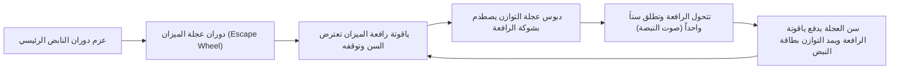
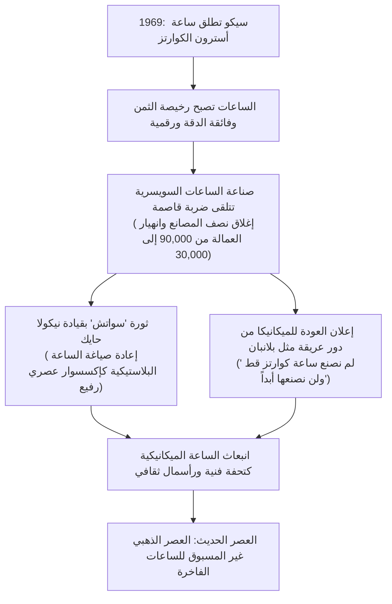
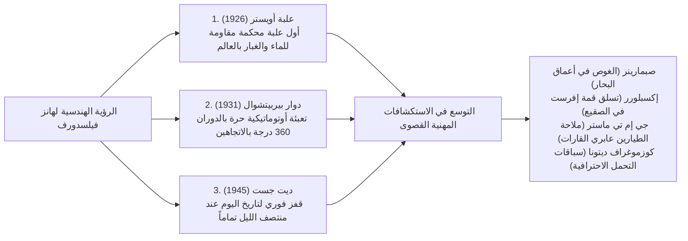

## مقدمة: الساعة الميكانيكية بوصفها كوناً مصغراً لضبط الوقت

داخل علبة معدنية لا يتجاوز قطرها 40 مليمتراً وسمكها بضعة مليمترات، تتشابك مئات التروس متناهية الصغر والروافع والينابيع ومحامل الياقوت لتنبض بتناغم تام دون انحراف ثانية واحدة――تلك هي "الساعة الميكانيكية (Mechanical Watch)". إنها بلا ريب الأصغر حجماً والأجمل تصميماً والأعمق فلسفياً بين سائر إبداعات الهندسة الميكانيكية الدقيقة التي ابتكرتها البشرية: "كون مصغر (Microcosmos)" حقيقي ينبض بالحياة.

في عصرنا الحاضر، حيث تعرض ساعات الكوارتز والساعات الذكية الوقت رقمياً بدقة متناهية عبر عشرات الآلاف من اهتزازات بلورات الكوارتز في الثانية أو إشارات الساعات الذرية عبر الأقمار الصناعية، لماذا لا تزال الساعات الميكانيكية التي تعمل حصرياً بالطاقة المرنة الكامنة في نابض لولبي تأسر قلوب الملايين وتُتداول في دور المزادات العالمية كتحف فنية تقدر بملايين وعشرات ملايين الدولارات؟

يكمن الجواب في أن الساعة الميكانيكية ليست مجرد "أداة لقياس الزمن"، بل هي **"خلاصة 500 عام من العبقرية البشرية التي تحدت قوانين ميكانيكا نيوتن والجاذبية والاحتكاك والتمدد الحراري"**. إنها تجسيد للحدس الفيزيائي لعمالقة صناعة الساعات مثل أبراهام-لويس بريغيه (Abraham-Louis Breguet)، وفنون التشطيب والزخرفة اليدوية المتطرفة (Finishing) التي توارثتها أجيال الحرفيين في جبال جورا السويسرية، والاعتزاز بالاستقلالية التامة لدور التصنيع المتكاملة (Manufacture d'horlogerie).

يتناول هذا المقال التحليلي الشامل المنظومة الكاملة لصناعة الساعات بأعلى درجات الدقة الأكاديمية والهندسية: بدءاً من تاريخ نشأة الصناعة السويسرية إثر هجرة الهوغونوت، وديناميكا ميكانيكا الحركة، والهندسة الدقيقة للتعقيدات الكبرى الثلاث (التوربيون، والتقويم الدائم، ومكرر الدقائق)، وفلسفة أعرق دور الساعات العالمية، والفيزياء الهجينة لتقنية "سبرينغ درايف" من غراند سيكو، وصولاً إلى أزمة الكوارتز وانبعاث الساعات الميكانيكية الفاخرة كأصول ثقافية وفنية خالدة.

```
【الهندسة الهيكلية المعمارية لآلية الساعة الميكانيكية】

┌─────────────────┬───────────────────────────────┬───────────────────────────────┐
│ الوحدة الوظيفية  │ المكونات والآليات الرئيسية    │ الدور الفيزيائي والقوانين الحاكمة│
├─────────────────┼───────────────────────────────┼───────────────────────────────┤
│ 1. وحدة الطاقة  │ النابض الرئيسي، برميل النابض، │ تخزين طاقة الوضع المرنة في    │
│ (Power Source)  │ ثقل التعبئة الأوتوماتيكية/التاج│ النابض وتفريغ عزم الدوران بثبات│
├─────────────────┼───────────────────────────────┼───────────────────────────────┤
│ 2. وحدة النقل   │ العجلة المركزية، العجلة الـ3، │ تحويل عزم الدوران المرتفع إلى │
│ (Gear Train)    │ العجلة الـ4 (الثواني)، المسننات│ سرعة دوران عبر نسب التروس الدقيقة│
├─────────────────┼───────────────────────────────┼───────────────────────────────┤
│ 3. وحدة الميزان │ عجلة الميزان، رافعة الميزان   │ كبح وإطلاق دوران التروس دورياً│
│ (Escapement)    │ (ميزان الرافعة السويسري)      │ ونقل نبضات الطاقة إلى المنظم  │
├─────────────────┼───────────────────────────────┼───────────────────────────────┤
│ 4. وحدة التنظيم │ عجلة التوازن، النابض الشعري،  │ توليد التردد المرجعي للوقت عبر│
│ (Regulator)     │ مسمار التثبيت، ذراع التنظيم   │ الحركة التوافقية (التزامنية)   │
├─────────────────┼───────────────────────────────┼───────────────────────────────┤
│ 5. وحدة العرض   │ عجلة الساعات، ماسورة الدقائق، │ تخفيض سرعة الدوران المنظمة    │
│ (Display)       │ عقارب الساعات والدقائق والثواني│ وتحويلها لمعلومات بصرية للمستخدم│
└─────────────────┴───────────────────────────────┴───────────────────────────────┘
```

---

## 1. تاريخ صناعة الساعات: من هجرة الهوغونوت إلى معجزة وادي جو

### 1.1 حركة الإصلاح الديني وميلاد صناعة الساعات السويسرية
تعود جذور الساعات الميكانيكية إلى ساعات الأبراج الكبرى في الأديرة والمدن الأوروبية خلال القرنين الثالث عشر والرابع عشر. غير أن تصغيرها المذهل لتتحول إلى "ساعة جيب" ثم إلى "ساعة يد"، وتحول سويسرا إلى المركز العالمي الأول لصناعة الساعات الفاخرة، ارتبط بأحداث دينية تاريخية عاصفة.

في عام 1541، قاد جان كالفن (Jean Calvin) حركة الإصلاح الديني في جنيف، وفرض تدابير تقشفية صارمة حظرت ارتداء المجوهرات والحلي الذهبية باعتبارها "مظاهر للرياء الدنيوي والترف المحرم". ونتيجة لذلك، وجد صاغة الذهب والنحاتون المهرة في جنيف أنفسهم بين عشية وضحاها محرومين من مصادر رزقهم ومواجهين شبح الانهيار الكامل.
وسط هذا المأزق الوجودي، اهتدى أولئك الحرفيون إلى مخرج عبقري: صناعة أداة لا تُصنف كحلية للزينة بل كـ "أداة عملية لقياس الوقت"――ألا وهي **"ساعة الجيب الشخصية (Watch)"**. اندمجت المهارات الفائقة لصاغة الذهب في تشكيل المعادن الثمينة مع الميكانيكا الدقيقة، لتتحول جنيف بسرعة خارقة إلى عاصمة عالمية لصناعة الساعات المتطورة.

ثم جاء المنعطف التاريخي الحاسم في عام 1685 عندما ألغى الملك الفرنسي لويس الرابع عشر "مرسوم نانت"، مما أدى إلى استئناف الاضطهاد الشرس ضد البروتستانت الفرنسيين (الهوغونوت). فر عشرات الآلاف من أمهر صانعي الساعات والمهندسين وعلماء الفلك من جميع أنحاء فرنسا ولجأوا إلى جنيف، مزودين إياها بأساس تقني وعلمي لا يُضاهى.

### 1.2 "وادي الساعات" في جبال جورا (فاليه دو جو) ونظام إتابليساج
انتقلت المعارف المتراكمة في جنيف تدريجياً إلى الوديان الجبلية الوعرة في جبال جورا――ولا سيما "فاليه دو جو (Vallée de Joux / وادي جو)" ولا شو دو فون.

كان وادي جو منطقة جبلية معزولة شديدة البرودة يغطيها الجليد لنصف عام. استغل المزارعون المحليون فترات الركود الشتوي، وفتحوا نوافذ واسعة في غرف العلية بمنازلهم لجلب الضوء الطبيعي، وانخرطت العائلات بأكملها في صناعة منزلية دقيقة لتشكيل وتصنيع المكونات الدقيقة للساعات (البراغي، والتروس، والينابيع، وأجزاء الميزان).
ومع حلول الربيع وذوبان الثلوج، كان تجار جنيف الموزعون (Établisseur) يجوبون قرى الوادي لجمع تلك القطع ونقلها إلى ورش جنيف للتجميع النهائي والمعايرة فائقة الدقة (Assembly). عُرف هذا النظام المتقدم لتقسيم العمل الأفقي باسم **"إتابليساج (Établissage)"**. وقد منح هذا الهيكل الصناعي المتميز الساعات السويسرية دقة استثنائية وتنافسية اقتصادية سحقت ورش الساعات النقابية التقليدية في بريطانيا وفرنسا.

---

## 2. ميكانيكا الساعة الميكانيكية: فيزياء العالم المجهري

### 2.1 قلب آلية التنظيم: "تزامنية" عجلة التوازن والنابض الشعري
القانون الفيزيائي المطلق الذي يحكم دقة الساعة الميكانيكية هو مبدأ **"تساوي أزمنة النواس (Isochronism)"** الذي اكتشفه غاليليو غاليلي.
يتساوى الزمن الذي يستغرقه البندول لإتمام دورة اهتزاز كاملة ذهاباً وإياباً (فترة التذبذب) بصرف النظر عن سعة الاهتزاز. وحيث إنه لا يمكن استخدام بندول الجاذبية في ساعات اليد المتحركة، استُبدل بمنظومة تذبذب التوائي تتألف من **"عجلة التوازن (Balance Wheel)"** و **"النابض الشعري (Balance Spring / Hairspring)"** فائق النعومة كشعرة الرأس.

تُوصف فترة تذبذب عجلة التوازن $T$ رياضياً بالمعادلة الميكانيكية التالية:

$$T = 2\pi \sqrt{\frac{I}{C}}$$

حيث يمثل $I$ عزم القصور الذاتي لعجلة التوازن، ويمثل $C$ صلابة الالتواء للنابض الشعري (ثابت النابض الالتوائي).
تكشف هذه المعادلة عن حقيقة فيزيائية حاسمة: **"فترة التذبذب $T$ مستقلة نظرياً تماماً عن سعة اهتزاز عجلة التوازن"**. وسواء كان النابض الرئيسي مشدوداً بالكامل ويوفر عزماً قوياً، أو كان قد اقترب من نهايته وانخفض عزمه، فإن عجلة التوازن تواصل التذبذب بالفاصل الزمني الدقيق نفسه. هذا هو السند الفيزيائي الذي يمكّن الساعة الميكانيكية من ضبط الوقت بدقة متناهية.

```
【العلاقة الهندسية بين تردد تذبذب التوازن ودقة التوقيت】

· 5 ذبذبات/ثانية (18,000 ذبذبة/ساعة / 2.5 هرتز):
  تتذبذب العجلة 5 مرات في الثانية. التردد المنخفض الكلاسيكي لساعات الجيب القديمة.
  تصدر صوت "تيك-تاك" رزيناً وهادئاً. التآكل الميكانيكي طفيف جداً مما يمنح المكونات عمراً مديداً.

· 6 ذبذبات/ثانية (21,600 ذبذبة/ساعة / 3.0 هرتز):
  المعيار التقليدي للحركات اليدوية العريقة (مثل كاليبر باتيك فيليب Cal. 215).

· 8 ذبذبات/ثانية (28,800 ذبذبة/ساعة / 4.0 هرتز):
  المعيار الذهبي المطلق لساعات اليد الميكانيكية المعاصرة (رولكس Cal. 3135/3235، إيتا 2824).
  يحقق التوازن الهندسي الأمثل بين مقاومة الصدمات الخارجية وثبات الزيوت وقلة التآكل.

· 10 ذبذبات/ثانية (36,000 ذبذبة/ساعة / 5.0 هرتز):
  التردد العالي المعروف بـ "هاي-بيت (High-Beat)". يتحرك عقرب الثواني بخطوات من 0.1 ثانية.
  أبرز أمثلته حركة زينيث "إل بريميرو" وغراند سيكو "9S85". مقاومة فائقة للاضطرابات لكنه يستهلك الزيوت بسرعة ويتطلب تعديناً ميكروياً فائقاً.
```

### 2.2 دورة ميكانيكا ميزان الرافعة السويسري (Swiss Lever Escapement)
مهما بلغت دقة الحركة التوافقية لعجلة التوازن، فإنها ستتوقف حتماً بسبب مقاومة الهواء والاحتكاك الداخلي ما لم تُحوَّل ذبذباتها إلى دوران منظم للتروس وتُزوَّد العجلة بدفعات طاقة مستمرة (نبضات). يُعد **"ميزان الساعة (Escapement)"** المنظومة الميكروية المسؤولة عن هذه المهمة المعقدة.



يكرر ميزان الرافعة السويسري هذه العملية الثلاثية (إيقاف، إطلاق، وإمداد بالنبض) في أجزاء من الألف من الثانية بمعدل 5 إلى 10 مرات في الثانية الواحدة. ويتحمل نحو 700,000 صدمة ميكانيكية بين المعدن والياقوت يومياً (و250 مليون صدمة سنوياً)، مع الحفاظ على كفاءته لسنوات طويلة دون تعطل، في مأثرة هندسية باهرة.

### 2.3 ذراع التنظيم مقابل عجلة التوازن ذات النابض الحر (Free Sprung)
توجد مدرستان هندسيتان رئيستان لضبط سرعة الساعة (تقديمها أو تأخيرها):

1. **طريقة ذراع التنظيم (Regulator Index)**:
   يُحصر الطرف الخارجي للنابض الشعري بين دبوسين صغيرين. وعبر تحريك ذراع التنظيم، يتغير "الطول الفعال" للنابض، مما يغير زمن التذبذب. ورغم سهولة الضبط، إلا أن الصدمات القوية قد تزحزح الذراع، كما أن ملامسة الدبابيس للنابض تسبب اضطرابات طفيفة في التزامنية.
2. **طريقة النابض الحر (Free Sprung Balance)**:
   القمة الهندسية المعتمدة لدى باتيك فيليب (Gyromax) ورولكس (Microstella). يُلغى ذراع التنظيم تماماً ويُثبت طول النابض بشكل دائم، **ويتم الضبط بتدوير أثقال أو براغي صغيرة مثبتة على حافة عجلة التوازن لتعديل عزم القصور الذاتي $I$ مباشرة**. توفر هذه المنظومة مقاومة استثنائية للصدمات وتضمن استقراراً طويلاً للدقة، لكنها تتطلب مهارة حرفية فائقة من صانع الساعات.

---

## 3. التشريح الهندسي للتعقيدات الكبرى الثلاث (Grand Complications)

تُسمى الآليات الميكروية التي تتجاوز الوظائف الأساسية (عرض الساعات والدقائق والثواني) لتقدم حسابات تقويمية فلكية، أو إشارات صوتية موسيقية، أو تعويضاً ذاتياً لخطأ الجاذبية باسم "التعقيدات (Complications)". وتتربع على عرش صناعة الساعات العالمية "التعقيدات الكبرى الثلاث".

```
【التصنيف الهندسي والتحديات الميكانيكية للتعقيدات الكبرى الثلاث】

┌─────────────────┬───────────────────────────────┬───────────────────────────────┐
│ نوع التعقيد     │ التحدي الفيزيائي للآلية       │ الحل الهندسي الدقيق           │
├─────────────────┼───────────────────────────────┼───────────────────────────────┤
│ التوربيون       │ جاذبية الأرض في الوضع الرأسي  │ وضع الميزان وعجلة التوازن داخل│
│ (Tourbillon)    │ تؤدي لإزاحة مركز ثقل النابض   │ قفص يدور 360 درجة كل دقيقة    │
├─────────────────┼───────────────────────────────┼───────────────────────────────┤
│ التقويم الدائم  │ التمييز التلقائي بين الشهور   │ عجلة برمجية ميكانيكية لدورة   │
│ (Perpetual Cal) │ المختلفة (30/31/28) وسنة الكبيس│ 4 سنوات (48 شهراً) مع رافعة كبرى│
├─────────────────┼───────────────────────────────┼───────────────────────────────┤
│ مكرر الدقائق    │ تحويل التوقيت غير المرئي إلى  │ قراءة كامات الحلزون عبر أذرع  │
│ (Minute Repeater)نغمات رنانة ميكانيكية بالكامل │ دقيقة وتوجيه مطارق لطرق الأجراس│
└─────────────────┴───────────────────────────────┴───────────────────────────────┘
```

### 3.1 التوربيون (Tourbillon): القفص الدوار المروِّض للجاذبية
اخترعه العبقري أبراهام-لويس بريغيه عام 1801، ويُعد التوربيون (الذي يعني "الزوبعة" بالفرنسية) ذروة المجد التقني والجمالي في عالم الساعات الميكانيكية.

كانت ساعات الجيب تُحمل عادة في وضع رأسي مستقيم داخل جيوب سترات النبلاء. وتعمل الجاذبية باستمرار في اتجاه واحد على النابض الشعري وعجلة التوازن، مما يؤدي إلى هبوط النابض لأسفل وانحراف مركز ثقله، مسبباً "خطأ الوضعية (Position Error)".
طرح بريغيه فكرة فيزيائية بارعة: "إذا كان يستحيل إلغاء جاذبية الأرض، فلماذا لا نجعل منظومة التنظيم بأكملها تدور باستمرار في الفضاء؟"

وضع بريغيه عجلة الميزان ورافعتها وعجلة التوازن والنابض الشعري بالكامل داخل قفص معدني دقيق بالغ الخفة――**"قفص التوربيون (Carriage / Cage)"**. وباتخاذ محور العجلة الرابعة كمركز للدوران، يدور القفص **"دورة كاملة (360 درجة) كل دقيقة بدقة متناهية"**.
وبذلك، حتى لو ظلت الساعة في وضع رأسي، فإن متجهات الجاذبية تتوزع بالتساوي على مدار الدقيقة في سائر الاتجاهات (360 درجة)، مما يؤدي إلى إلغاء أخطاء التقديم والتأخير الناتجة عن الجاذبية ذاتياً وبصورة مستمرة.
إن تجميع عشرات الأجزاء الدقيقة داخل قفص من التيتانيوم أو السبائك فائقة الخفة لا يتعدى وزنه الإجمالي 0.2 إلى 0.3 غرام مع ضمان دورانه بانسيابية دون احتكاك يظل إنجازاً تقنياً تعجز عنه غالبية دور الساعات حتى اليوم.

### 3.2 التقويم الدائم (Perpetual Calendar): رائد الحواسيب الميكانيكية
تتقدم ساعات التقويم العادية حتى اليوم الحادي والثلاثين من كل شهر، مما يفرض على حاملها تصحيح التاريخ يدوياً في نهاية شهور فبراير وأبريل ويونيو وسبتمبر ونوفمبر.

أما التقويم الدائم (Perpetual Calendar)، فيعتمد على الذاكرة الميكانيكية للتروس **للتمييز التلقائي بين الشهور القصيرة (30 يوماً)، والشهور الطويلة (31 يوماً)، وفبراير البسيط (28 يوماً)، وفبراير الكبيس (29 يوماً كل 4 سنوات)**، متبعاً التوقيت الفلكي بدقة تامة دون أي تعديل يدوي حتى عام 2100.

المكون المركزي لهذه العملية الحاسوبية هو **"كامة البرمجة لـ 48 شهراً (عجلة السنة الكبيسة)"**. نُحتت على محيط هذه العجلة حزوز متفاوتة العمق لـ 48 شهراً (دورة كاملة لأربع سنوات):
- شهر من 31 يوماً: الحز الأكثر ضحالة
- شهر من 30 يوماً: حز متوسط العمق
- فبراير العادي (28 يوماً): الحز الأعمق إطلاقاً
- فبراير الكبيس (29 يوماً): حز ذو عمق محدد
تتحسس رافعة ميكانيكية طويلة عمق هذه الحزوز، وعند منتصف ليل اليوم الأخير من الشهر، تقفز بقرص التاريخ دفعة واحدة من يوم إلى أربعة أيام. هذا التشفير الميكانيكي البحت الذي ابتُكر قبل عصر الكهرباء يمثل إعجازاً حقيقياً في الهندسة الدقيقة.

### 3.3 مكرر الدقائق (Minute Repeater): ذروة الفيزياء الصوتية
قبل اختراع الإنارة الكهربائية، كان النبيل في ظلمات الليل الدامسة يضغط على مزلاق في جانب علبة ساعة جيبه، فتنطلق نغمات رنانة آسرة: "دونغ، دونغ…… دينغ-دونغ، دينغ-دونغ…… دينغ، دينغ"، معلنة الوقت بالصوت حتى الدقيقة بدقة متناهية.

- **النغمة المنخفضة (الساعات)**: مطرقة تطرق نغمة عميقة لتعلن الساعات (حتى 12 مرة).
- **النغمة المزدوجة (أرباع الساعة)**: مطرقتان تتناوبان لتطرقا نغمة مزدوجة "دينغ-دونغ" لكل 15 دقيقة (حتى 3 مرات).
- **النغمة العالية (الدقائق المتبقية)**: مطرقة تطرق نغمة حادة للدقائق من 1 إلى 14 (حتى 14 مرة).
(مثال: الساعة 07:42 → 7 نغمات منخفضة + نغمتان مزدوجتان [30 دقيقة] + 12 نغمة حادة = المجموع 42 دقيقة).

يلتف حول محيط الحركة صنجان فولاذيان حلزونيان معالجان حرارياً (Gongs)، تطرقهما مطرقتان صغيرتان بقوة معايرة بدقة.
وعند سحب المزلاق، تتعشق رافعات مسننة مع كامات حلزونية مدرجة لقراءة موقع عقارب الساعات والدقائق ميكانيكياً. ولضبط إيقاع الطرقات ومنع تسارعها، تدور "مروحة هوائية طاردة مركزية (Air Governor)" بسرعة فائقة في صمت تام معتمدة على مقاومة الهواء. ولضمان صفاء ورنين النغمات، تُحسب الخصائص الصوتية ومطابقة المعاوقة لمعدن العلبة (الذهب الوردي، التيتانيوم، والبلاتين) بأعلى درجات الدقة الفيزيائية.

---

## 4. أعرق دور التصنيع السويسرية والعالمية وفلسفتها

في عالم صناعة الساعات، يُفرَّق بحزم بين العلامات التجارية التي تشتري الحركات الجاهزة وتكتفي بتركيبها في علب (établisseur)، وبين الصانع الذي يبتكر التصاميم ويطور الحركات ويصنع المكونات ويجمعها ويضبطها ويزخرفها يدوياً داخل مصانعه الخاصة. يُطلق على هذا الأخير لقب **"مانيفاكتور (Manufacture d'horlogerie)"**، ويحظى بأعلى درجات التقدير والتبجيل في العالم.

```
【أعرق دور التصنيع العالمية وأبرز روائعها التاريخية】

┌─────────────────┬───────────┬───────────────────────────────┐
│ اسم الدار       │ سنة       │ الفلسفة، النماذج الأيقونية،   │
│                 │ التأسيس   │ وأبرز الميزات الهندسية         │
├─────────────────┼───────────┼───────────────────────────────┤
│ باتيك فيليب     │ 1839      │ قمة "الثالوث المقدس". دمغة    │
│ (Patek Philippe)│ سويسرا    │ باتيك، كالاترافا، نوتيلوس.    │
│                 │           │ قيمة خالدة تتوارثها الأجيال   │
├─────────────────┼───────────┼───────────────────────────────┤
│ أوديمار بيغيه   │ 1875      │ رائدة الساعات الرياضية الفاخرة│
│ (Audemars       │ سويسرا    │ رويال أوك (1972، جيرالد جينتا)│
│  Piguet)        │           │ ثورة الفولاذ الفاخر عالمياً   │
├─────────────────┼───────────┼───────────────────────────────┤
│ فاشيرون         │ 1755      │ أقدم دار ساعات في العالم تعمل │
│ كونستنتين       │ سويسرا    │ دون انقطاع. باتريموني، أوفرسيز│
│ (Vacheron C.)   │           │ التجسيد الكامل لتقاليد جنيف   │
├─────────────────┼───────────┼───────────────────────────────┤
│ إيه لانغيه آند  │ 1845      │ ذروة هندسة الدقة الألمانية.   │
│ زونه (A. Lange) │ ألمانيا   │ صفيحة 3/4 من الفضة الألمانية، │
│                 │           │ تجميع مزدوج، لانغيه 1 الهندسية│
├─────────────────┼───────────┼───────────────────────────────┤
│ رولكس           │ 1905      │ الملك المتوج للساعات العملية. │
│ (Rolex)         │ سويسرا    │ علبة أويستر المقاومة للماء،   │
│                 │           │ دوار بيربيتشوال، موثوقية صلبة │
├─────────────────┼───────────┼───────────────────────────────┤
│ أوميغا          │ 1848      │ ساعة رحلات أبوللو القمرية     │
│ (OMEGA)         │ سويسرا    │ سبيدماستر، ميزان كو-أكسيال،   │
│                 │           │ ومقاومة كهرومغناطيسية خارقة   │
├─────────────────┼───────────┼───────────────────────────────┤
│ غراند سيكو      │ 1960      │ الدمج الثوري بين الميكانيكا   │
│ (Grand Seiko)   │ اليابان   │ والكوارتز: تقنية سبرينغ درايف │
└─────────────────┴───────────┴───────────────────────────────┘
```

### 4.1 باتيك فيليب (Patek Philippe): الحاكم المطلق لمملكة الساعات
تأسست عام 1839، واقتنى ساعاتها كبار عظماء التاريخ من الملكة فيكتوريا وألبرت أينشتاين إلى تشايكوفسكي، وتعد بلا منازع قمة هرم الساعات العالمية.
تجسد "كالاترافا (Calatrava)" النسبة الذهبية الكاملة للساعة الدائرية، بينما أعادت "نوتيلوس (Nautilus)" تعريف الفخامة الرياضية الأنيقة.
وضعت باتيك فيليب معيار جودة ذاتي فائق الصرامة يتجاوز المعايير الرسمية، وهو "دمغة باتيك فيليب (PP Seal)"، التي تلزم بمتوسط دقة استثنائي بين −3 إلى +2 ثانية يومياً، وتتعهد بإصلاح وترميم كل ساعة أنتجتها الدار منذ تأسيسها عام 1839. وتلخص حملتها الشهيرة: "أنت لا تمتلك ساعة باتيك فيليب حقاً، بل تكتفي بحفظها للأجيال القادمة" مكانتها بوصفها تراثاً ثقافياً حياً.

### 4.2 إيه لانغيه آند زونه (A. Lange & Söhne): انبعاث هندسة الدقة الألمانية
في بلدة غلاشوته بوادي جبال الخام بولاية ساكسونيا الألمانية، أسس فرديناند أدولف لانغيه هذه الدار العريقة عام 1845. وبعد المأساة التي شهدتها بالحرب العالمية الثانية والتأميم تحت الحكم الشيوعي في ألمانيا الشرقية واختفاء العلامة لنحو نصف قرن، بُعثت الدار من جديد بمعجزة حقيقية عام 1990 على يد والتر لانغيه بعد سقوط جدار برلين.

تتميز ساعات لانغيه بجماليات هندسية جرمانية عقلانية تختلف كلياً عن النمط السويسري:
- **صفيحة ثلاثة أرباع (3/4 Plate) من الفضة الألمانية غير المطلية**: تغطي معظم الحركة بصفيحة متكاملة من سبيكة النحاس والنيكل، مما يمنحها صلابة هيكلية خارقة. وتكتسب مع الوقت بريقاً ذهبياً دافئاً (باتينا).
- **أطواق الذهب المثبتة بالبراغي (Screwed Gold Chatons)**: محامل الياقوت موضوعة في أطواق من الذهب عيار 18 قيراطاً ومثبتة ببراغي فولاذية زرقاء معالجة حرارياً وفق أسلوب غلاشوته التاريخي.
- **جسر التوازن المنقوش يدوياً**: ينقش فنانو الدار زخارف نباتية يدوياً بأزاميل دقيقة على كل جسر توازن، فلا تتطابق حركتان في العالم إطلاقاً.
- **التجميع المزدوج (Double Assembly)**: يتم تجميع الحركة وضبطها واختبارها بالكامل مرة أولى، ثم تُفكك تماماً وتُنظف وتُصقل أجزاؤها يدوياً مرة ثانية قبل إعادة تجميعها نهائياً، في سعي مطلق نحو الكمال.

### 4.3 غراند سيكو والفيزياء الهجينة لآلية "سبرينغ درايف (Spring Drive)"
في عام 1960، انطلقت "غراند سيكو" بهدف صناعة أفضل ساعة عملية فائقة الدقة في العالم تتفوق على معايير الكرونومتر السويسرية.
وتوج هذا المسار بابتكار تقنية **"سبرينغ درايف (Spring Drive)"** التي رأت النور عام 1999 بعد أكثر من عشرين عاماً من الأبحاث المضنية.

```
【ديناميكا المنظومة الميكروية لتقنية سبرينغ درايف (Tri-synchro Regulator)】

[مصدر الطاقة الميكانيكية: النابض الرئيسي (Mainspring)]
· لا وجود لأي بطارية أو محرك كهربائي، الحركة مستمدة كلياً من استرخاء النابض الميكانيكي.
  ↓
[نقل الحركة ومضاعفة السرعة عبر قطار التروس]
  ↓
[دوران عجلة الانزلاق (دوار مغناطيسي): 8 دورات/ثانية]
· يمر الدوار عبر ملفات كهرومغناطيسية لإنتاج قوة دافعة كهربائية تأثيرية دقيقة (على مقياس النانوواط).
  ↓
[تنشيط دائرة الكوارتز المدمجة والبلورة الاهتزازية]
· تُشغل هذه الطاقة الضئيلة مذبذب كوارتز عالي الدقة بتردد 32,768 هرتز ودائرة تحكم متكاملة IC متدنية الاستهلاك.
  ↓
[كبح كهرومغناطيسي بدون احتكاك لتنظيم السرعة]
· تقارن الشريحة الإلكترونية بين إشارة الكوارتز وسرعة دوران الدوار مئات المرات كل ثانية.
· إذا زادت سرعة الدوار عن المعدل، يُطبق كبح تيار إيدي الكهرومغناطيسي بسلاسة،
  مما يقفل سرعة الدوران بدقة تامة عند "8 دورات ثابتة في الثانية".
```

لا يتحرك عقرب ثواني سبرينغ درايف بضربات متقطعة كالساعات الميكانيكية، ولا يقفز قفزات جافة كل ثانية كساعات الكوارتز، بل ينساب في صمت مطبق فوق الميناء كحركة الكواكب في مداراتها الفلكية فيما يُعرف بـ **"حركة الانسياب (Glide Motion)"**. تجمع هذه التقنية بين عزم الدوران الدائم للنابض الميكانيكي والدقة المطلقة للكوارتز (انحراف ±15 ثانية فقط شهرياً)، لتسجل أكبر ثورة في هندسة الساعات قادمة من آسيا.

---

## 5. أزمة الكوارتز والفلسفة الاقتصادية لانبعاث الساعات الميكانيكية

في 25 ديسمبر 1969، طرحت سيكو أول ساعة يد كوارتز تجارية في العالم "أسترون 35SQ". ومع انحراف يومي لا يتعدى ±0.2 ثانية (أقل من ±5 ثوانٍ شهرياً)――أي أدق بمئات المرات من الساعات الميكانيكية――أحدثت هذه الساعة زلزالاً مدمراً في قطاع الساعات العالمي عُرف باسم **"أزمة الكوارتز (Quartz Crisis)"**.



تعرضت صناعة الساعات السويسرية لدمار شبه كامل، وأفلست مئات الدور العريقة وفُقد ثلثا القوى العاملة.
غير أن هذه المحنة الوجودية أسهمت في تنقية "الجوهر الحقيقي" للساعة الميكانيكية.
فلو كان الهدف الوحيد للساعة هو مجرد "معرفة الوقت"، لكانت ساعة إلكترونية زهيدة الثمن أو شاشة هاتف ذكي كافية تماماً. لكن ما يرتديه الإنسان على معصمه يتجاوز كونه أداة وظيفية.
إن دفء التروس التي تدور وفق قوانين نيوتن الخالدة، وجمال خطوط جنيف والدوائر اللؤلؤية التي نُقشت يدوياً تحت المجهر لأسابيع، والقدرة على توارث الساعة عبر الأجيال――كلها قيم إنسانية لا يمكن للشرائح الإلكترونية الصامتة محاكاتها.

وبفضل الرؤية الثاقبة لرواد مثل جان-كلود بيفير (Jean-Claude Biver) ونيكولا حايك (Nicolas G. Hayek)، تحولت الساعة الميكانيكية من أداة لقياس الوقت عفا عليها الزمن إلى **"تحفة فنية تجسد الروح والبراعة الإنسانية: إرث ثقافي يُرتدى على المعصم"**. ويعد الإقبال العالمي الهائل على الساعات الميكانيكية الفاخرة اليوم رد فعل جمالي ضد الرقمنة المفرطة، واستعادة لأصالة المادة والميكانيكا الحقيقية.

---

## 3.4 ميكانيكا الكرونوغراف (Chronograph): هندسة ساعات التوقف الدقيقة

من بين جميع التعقيدات الميكانيكية، يرتبط الكرونوغراف (ساعة التوقف المدمجة لقياس الفترات الزمنية المنقضية) ارتباطاً وثيقاً بسباقات السيارات والطيران العسكري والاستكشافات الفلكية. تتحدد جودة ملمس أزرار الكرونوغراف ودقة قياسه عبر التوليفة الهندسية بين "نظام التحكم الوظيفي" و"نظام تعشيق القابض (Clutch)".

```
【النظامان الرئيسيان للتحكم ونظاما القابض في حركة الكرونوغراف】

┌─────────────────┬───────────────────────────────┬───────────────────────────────┐
│ التصنيف         │ نوع الآلية                    │ الخصائص الهندسية وسلوك التشغيل│
├─────────────────┼───────────────────────────────┼───────────────────────────────┤
│ آلية التحكم في  │ 1. نظام عجلة العمود           │ عجلة أسطوانية ذات أعمدة رأسية. │
│ التشغيل         │ (Column Wheel)                │ ملمس ضغط ناعم وسلس للغاية، رم-│
│                 │                               │ ز الساعات الفاخرة رفيعة المستوى│
├─────────────────┼───────────────────────────────┼───────────────────────────────┤
│                 │ 2. نظام الكامة والرافعة       │ صفائح معدنية تتحرك للأمام     │
│                 │ (Cam-Actuated)                │ والخلف. متين ومناسب للإنتاج   │
│                 │                               │ الضخم، ملمس الضغط صلب ومقاوم  │
├─────────────────┼───────────────────────────────┼───────────────────────────────┤
│ آلية نقل الطاقة │ 1. القابض الأفقي              │ ترس جانبي يتأرجح أفقياً ليتعشق│
│ (القابض)        │ (Horizontal Clutch)           │ مع عجلة الكرونوغراف. حركة ميك-│
│                 │                               │ انيكية مرئية فائقة الجمال     │
├─────────────────┼───────────────────────────────┼───────────────────────────────┤
│                 │ 2. القابض الرأسي              │ أقراص احتكاك تُكبس رأسياً من  │
│                 │ (Vertical Clutch)             │ الأعلى والأسفل. انعدام تام    │
│                 │                               │ لقفزة العقرب عند بدء القياس   │
└─────────────────┴───────────────────────────────┴───────────────────────────────┘
```

يعاني القابض الأفقي التقليدي من عيب بنيوي: فعند الضغط على زر البدء، تصطدم أطراف أسنان الترس الدائر بأسنان عجلة الكرونوغراف أفقياً، مما يسبب قفزة طفيفة مرئية لعقرب الثواني (Hand Jumping).
في المقابل، تعتمد حركات الكرونوغراف الحديثة عالية الأداء (مثل رولكس ديتونا Cal. 4130/4131، وأوميغا سبيدماستر، وبريتلينغ Cal. 01) **"القابض الرأسي (Vertical Clutch)"**. يضغط هذا النظام قرصين ميكرويين رأسياً عبر قوى الاحتكاك السطحي، مما يلغي قفزة العقرب تماماً، ويتيح تشغيل الكرونوغراف باستمرار دون التأثير سلباً على سعة اهتزاز أو دقة الحركة الأساسية.

### الفلايباك (Flyback) والثواني المنفصلة (Rattrapante)
- **الفلايباك (Flyback)**: بضغطة زر واحدة أثناء القياس، يُعاد ضبط العقرب إلى الصفر ويبدأ قياساً جديداً فوراً في خطوة واحدة ("إيقاف، تصفير، واستئناف"). طُوِّر هذا النظام لطياري المقاتلات الحربية لقياس أزمنة المناورات المتتابعة.
- **الثواني المنفصلة (Rattrapante)**: يضم عقربين لثواني الكرونوغراف متطابقين أحدهما فوق الآخر. عند الضغط على زر إضافي، يتوقف العقرب العلوي لعرض الوقت الوسيط (Split time)، بينما يواصل العقرب السفلي دورانه؛ وبضغطة أخرى، يلحق العقرب المتوقف بالعقرب الدائر ويندمجان من جديد، ويعد قمة تعقيد هندسة الكرونوغراف.

---

## 2.4 ثورة الميزان بعد 250 عاماً: الميزان مترافق المحور وتقنية السيليكون

بعد أن سيطر ميزان الرافعة السويسري لأكثر من قرنين على الصناعة، شهدت أواخر القرن العشرين وبدايات القرن الحادي والعشرين ثورة هندسية ومادية استهدفت القضاء على العدوين اللدودين للساعة: الاحتكاك والمغناطيسية.

### 1. الميزان مترافق المحور (Co-Axial Escapement) لجورج دانييلز
اخترعه صانع الساعات البريطاني المستقل جورج دانييلز (George Daniels) في سبعينيات القرن العشرين، ونجحت أوميغا (OMEGA) في تصنيعه تجارياً عام 1999، ليشكل حدثاً تاريخياً في هندسة الساعات.

يعتمد ميزان الرافعة التقليدي على "احتكاك انزلاقي (Sliding Friction)" عنيف بين ياقوتات الرافعة وأسنان عجلة الميزان، مما يجعل التزييت أمراً حتمياً، ويؤدي تدهور الزيوت وجفافها إلى تراجع الدقة بمرور الوقت.
أما الميزان مترافق المحور فيعتمد على عجلتي ميزان مركبتين على المحور ذاته (Co-Axial) مع ثلاث ياقوتات، ليحقق حركة دفع شعاعية قائمة **"دفع نقطي عمودي (Radial Push)"**. ومع انخفاض الاحتكاك الانزلاقي إلى الصفر تقريباً، تلاشت الحاجة الملحة للتزييت، وتمددت فترات الصيانة الشاملة (Overhaul) من 3-5 سنوات إلى 8-10 سنوات.

### 2. ثورة السيليكون (السيليكون أحادي البلورة) بالتقنيات الدقيقة
منذ مطلع الألفية، أثمر التعاون المشترك بين باتيك فيليب ورولكس وأوميغا وبريغيه مع المعهد السويسري للتقنيات الدقيقة عن تطبيق تقنيات النقش الأيوني التفاعلي العميق (DRIE) المستخدمة في أشباه الموصلات لصناعة مكونات ميكروية من السيليكون أحادي البلورة.
- **مقاومة مطلقة للمغناطيسية**: السيليكون مادة غير معدنية، وبالتالي لا تتأثر مطلقاً بالمجالات المغناطيسية للهواتف الذكية أو المغانط.
- **تزامنية كاملة واستقرار حراري**: عبر طلاء أكسيد السيليكون الحراري (مثل نابض Spiromax من باتيك فيليب)، يتعادل معامل المرونة الحراري تماماً ليبقى التردد ثابتاً في شتى درجات الحرارة.
- **خفة فائقة ونعومة على المستوى الجزيئي**: تقل كتلته كثيراً عن المعادن وسطحه ناعم مجهرياً، مما يقلل هدر الطاقة الحركية أثناء التذبذب.

---

## 4.4 رولكس (Rolex): الهيمنة الهندسية للساعات الفاخرة العملية

أسسها هانز فيلسدورف (Hans Wilsdorf) عام 1905 في لندن (ثم انتقل إلى جنيف السويسرية)، واستطاعت رولكس إعادة صياغة مفهوم ساعة اليد من مجرد حلية هشة للأثرياء إلى "أداة صلبة بالغة الدقة تعمل دون كلل في أقسى بقاع الأرض".



### فولاذ أويستر ستيل (سبيكة 904L) وهندسة التعدين الخاصة
يرتكز الأساس الصلب لمتانة رولكس الأسطورية على تخليها عن فولاذ "316L" الشائع، وتبنيها الكامل لسبيكة فائقة المقاومة للتآكل تُستخدم في المفاعلات الكيميائية وصناعات الفضاء: **"أويستر ستيل (فولاذ أوستنيتي فائق 904L)"**.
يحتوي هذا المعدن على نسب عالية من الكروم والموليبدينوم والنيكل والنحاس، مما يمنحه حصانة تامة ضد التآكل الناتج عن مياه البحار وأيونات الكلوريد في عرق الإنسان، ويكتسب عند صقله لمعاناً أبيض ناصعاً يشبه البلاتين. كما تمتلك رولكس مسبك ذهب خاصاً بها لابتكار سبائك حصرية مثل "إيفروز غولد (Everose Gold)" التي لا تفقد رونقها وبريقها الوردي مهما طال الزمن.

---

## 5.2 تشطيب الساعات اليدوي (Finishing) وفنون التزيين الجمالية

يكمن أكثر من نصف القيمة الفنية وتكاليف الإنتاج في الساعات الرفيعة في عمليات "التشطيب اليدوي (Finishing)" لأسطح مكونات الحركة. فالتشطيب ليس مجرد تجميل مظهري، بل يحمل وظائف هندسية جوهرية تشمل إزالة الزوائد المعدنية الدقيقة (Burrs)، ومنع التأكسد والصدأ، واحتجاز ذرات الغبار المجهرية.

```
【تقنيات التشطيب اليدوي التقليدية في الحركات الرفيعة】

1. آنغلاج (Anglage / الشطب الزاوي والتلميع):
   يقوم الحرفي ببرد الحواف القائمة (90 درجة) للصفائح والجسور بأزاميل دقيقة وخشب الجنطيانا ومعجون الماس ليحولها إلى زاوية 45 درجة موحدة أو منحنية، ويصقلها حتى تصبح كالمرآة. تعكس هذه الحواف الضوء وتبرز الهيكل المعماري للحركة.

2. كوت دو جنيف (Côtes de Genève / خطوط جنيف الرخامية):
   تقنية لنحت خطوط متموجة متوازية ومنتظمة على سطوح الجسور باستخدام قرص خشبي دوار. وتتغير الظلال والتموجات الضوئية بصورة بديعة مع تغير زاوية الرؤية.

3. بيرلاج (Perlage / التحبيب الدائري اللؤلؤي):
   نقش دوائر صغيرة متداخلة تشبه حراشف الأسماك أو اللؤلؤ على الصفيحة الرئيسية الداخلية. تعمل هذه التضاريس المجهرية على احتجاز ذرات الغبار الشاردة وحفظ الغشاء الزيتي للمحامل.

4. التلميع الأسود (Poli Noir / التلميع المرآتي الأسود):
   صقل القطع الفولاذية الصغيرة (رؤوس البراغي وقفص التوربيون) يدوياً بحركة رقم "8" على صفيحة من الزنك مطلية بمسحوق أكسيد الألومنيوم حتى تستوي تماماً على المستوى الجزيئي. وعند النظر إليها من زاوية معينة، تعكس 100% من الضوء في اتجاه واحد فتبدو شديدة السواد――وهي أعلى مراتب التشطيب اليدوي.
```

تضع **"دمغة جنيف (Poinçon de Genève)"**، التي سنها برلمان كانتون جنيف بقانون عام 1886، 12 معياراً فنياً وجمالياً صارماً: شطب جميع حواف القطع الفولاذية، وتلميع رؤوس البراغي وحزوزها تلميعاً مرآتياً، وتلميع ثقوب محامل الياقوت. وتعد شهادة الجودة والأصل الجغرافي الأرفع مكانة في صناعة الساعات السويسرية.

---

## 4.5 صانعو الساعات المستقلون (AHCI) وتحديات النحت المعاصر فائق التعقيد

في مشهد تهيمن عليه التكتلات الاستثمارية العملاقة (ريشمونت، مجموعة سواتش، LVMH)، تبرز "أكاديمية صانعي الساعات المبدعين المستقلين (AHCI)" كحارس أمين للنقاء الفلسفي والحرفي، حيث ينكب صانع الساعات منفرداً في ورشته لتجسيد رؤاه دون أدنى مساومة تجارية.

```
【أساطير صناعة الساعات المستقلة والابتكارات المتطرفة】

1. فيليب دوفور (Philippe Dufour):
   · يصنع ساعاته بمفرده تماماً في ورشته الصغيرة ببلدة لو سنتييه بوادي جو دون أي مساعد.
   · "سمبليسيتي (Simplicity)": رغم كونها ساعة بسيطة بثلاثة عقارب (ساعات، دقائق، ثوانٍ)، إلا أن اتساع زوايا الشطب الداخلي وحوافها المصقولة يدوياً تُعد الذروة التي لم تبلغها يد بشرية في تاريخ الصقل.
   · "دواليتي (Duality)": أول ساعة يد في العالم تحتوي على ميزانين مستقلين يربطهما ترس تفاضلي لموازنة معدل الخطأ آلياً بصورة فورية.

2. فرانسوا-بول جورن (F.P. Journe):
   · يرفع شعار "Invenit et Fecit (ابتكرته وصنعته)".
   · "كرونومتر الرنين (Chronomètre à Résonance)": يضع ميزانين متجاورين بفارق مليمترات معدودة، لتتزامن اهتزازاتهما كلياً بفعل موجات الهواء والرنين المشترك للصفيحة، في تحفة صوتية-ميكانيكية باهرة.
   · يصنع صفائح الحركة وجسورها بالكامل من الذهب الوردي عيار 18 قيراطاً.

3. ريتشارد ميل (Richard Mille):
   · رائد ساعات القرن الحادي والعشرين تحت شعار "سيارة فورمولا 1 على المعصم".
   · يستخدم مواد الفضاء وسباقات السيارات ككربون TPT، وتيتانيوم الدرجة 5، والياقوت الشفاف للعلبة والحركة.
   · طور توربيون يتحمل صدمات خارقة من 5,000G إلى 12,000G، ارتداه أسطورة التنس رافائيل نادال أثناء بطولات الغراند سلام وهو يسدد ضربات إرسال تتجاوز سرعتها 200 كم/ساعة.
```

---

## 2.5 الحرب ضد العدو اللدود "المغناطيسية": تاريخ تطور الهندسة المقاومة

في مجتمعنا المعاصر، تحاصرنا الحقول المغناطيسية من الهواتف الذكية والحواسيب المحمولة وأقفال الحقائب المغناطيسية ومواقد الحث الكهرومغناطيسي. وبالنسبة للساعة الميكانيكية، يمثل **"التمغنط (Magnetization)"** التهديد الأكثر شيوعاً لدقتها.

عندما يتمغنط النابض الشعري الفولاذي، تلتصق حلقاته ببعضها بفعل الجذب المغناطيسي، مما يقصر طوله الفعال بشكل حاد، فتبدأ الساعة في تقديم التوقيت بمقدار عشرات الدقائق أو عدة ساعات يومياً.

```
【المساران الهندسيان لمقاومة المغناطيسية في الساعات】

1. مسار الدرع الواقي (قفص فاراداي المادي):
   · المبدأ: إحاطة الحركة الميكانيكية بالكامل بـ "علبة داخلية من الحديد اللين".
   · الآلية: تمر خطوط المجال المغناطيسي الخارجية عبر الحديد اللين ذي النفاذية العالية وتلتف حوله، متجاوزة الحركة الحساسة بالداخل دون اختراقها.
   · النماذج الرائدة: IWC إنجينيور، رولكس ميلغوس (مقاومة حتى 1,000 غاوس).
   · العيوب: تزيد العلبة سمكاً ووزناً، ويستحيل تزويد الساعة بغطاء خلفي شفاف من البلور الياقوتي.

2. مسار المواد غير القابلة للتمغنط (ثورة علم المواد):
   · المبدأ: تصنيع النابض الشعري والرافعة وعجلة الميزان من السيليكون وسبائك غير حديدية منيعة ضد المغناطيس.
   · النماذج الرائدة: أوميغا "ماستر كرونومتر" (مقاومة مطلقة لـ 15,000 غاوس تعادل مجالات أجهزة الرنين المغناطيسي الطبية MRI)، عبر استخدام نابض السيليكون Si14 ومحاور التيتانيوم.
   · المزايا: الحفاظ على نحافة وأناقة العلبة، مع إمكانية التمتع برؤية نبض الحركة عبر الغطاء الخلفي الشفاف.
```

---

## 5.5 معايير شهادات الجودة السويسرية: دمغة جنيف واختبارات الكرونومتر COSC

تضمن الهيئات الرسمية المستقلة موثوقية وقيمة الساعات الميكانيكية الفاخرة عبر بروتوكولات فحص صارمة.

```
【معايير تقييم الجودة الرئيسة في صناعة الساعات السويسرية】

1. معهد COSC (المعهد السويسري الرسمي لاختبار الكرونومتر / Contrôle Officiel Suisse des Chronomètres):
   · الهدف: اختبار دقة الحركة غير المركبة (المجردة) المصنعة في سويسرا حصرياً.
   · الإجراءات: تُثبت الحركة في إطار خاص وتُفحص لمدة 15 يوماً متواصلة في 5 وضعيات فراغية مختلفة و3 درجات حرارة متباينة (8 و23 و38 مئوية).
   · شرط النجاح: متوسط انحراف يومي بين "-4 إلى +6 ثوانٍ" (للحركات التي يتجاوز قطرها 20 مم). ولا تنال هذه الشهادة سوى نسبة ضئيلة من الساعات السويسرية.

2. دمغة جنيف (Poinçon de Genève / شعار كانتون جنيف الرسمي):
   · التاريخ: أُقرت بقانون صادر عن برلمان كانتون جنيف عام 1886، وتمثل قمة المجد في أصالة المنشأ والتشطيب الفاخر.
   · الشرط الجغرافي: يقتصر التقديم على الساعات التي جرى تجميعها وضبطها وتشطيبها داخل حدود كانتون جنيف حصراً.
   · المعايير التقنية الـ 12 التقليدية:
     - شطب جميع زوايا الأجزاء الفولاذية (Anglage) وصقل أسطحها كالمرايا؛
     - صقل رؤوس البراغي وحزوزها؛
     - شطب أسنان التروس من الجانبين وصقل محاور المسننات؛
     - تلميع ثقوب محامل الياقوت للحفاظ على التوتر السطحي لزيوت التشحيم.
   · التحديثات الديناميكية المعاصرة: منذ مراجعة عام 2011، لم يعد الاختبار يقتصر على الحركة المجردة، بل أوجب اختبار الساعة الكاملة المركبة داخل علبتها عبر محاكاة ديناميكية لحركة المعصم، بمتوسط انحراف "-1 إلى +1 ثانية يومياً"، مع فحص احتياطي الطاقة، ومقاومة الماء، وتناغم وظائف التعقيدات. وتحمل فاشيرون كونستنتين وروجيه دوبوي هذه الدمغة التاريخية بفخر واعتزاز.
```

---

## 6. خاتمة: أن ترتدي كوناً مصغراً على معصمك

أن تلف ساعة ميكانيكية حول معصمك، وتدير تاجها ببطء بين إبهامك وسبابتك لتعبئة نابضها. تشعر عبر أطراف أصابعك بالمقاومة الخفيفة لأسنان التروس المتعشقة، وحين تقرب الساعة من أذنك، تسمع دقات عجلة التوازن السريعة: "تيك-تيك-تيك-تيك……" مثل نبضات قلب مفعم بالحياة.

في ذلك الحيز المعدني الضيق، تنبض حكمة صقلتها أجيال من صانعي الساعات على مدار خمسة قرون منذ ابتكر بيتر هينلاين النابض المحمول في نورمبرغ. لقد واجه أولئك الرواد الاضطهاد الديني، وأهوال الحروب، وعواصف ثورة الكوارتز الرقمية، ولم يحيدوا يوماً عن سؤالهم الجوهري الأبدي: "كيف نقيس هذا التدفق الفيزيائي الحتمي الذي نسميه الزمن بأعلى درجات الدقة وبأبهى صور الجمال؟"

بإمكاننا اليوم بنقرة واحدة على شاشة هاتف ذكي معرفة التوقيت بدقة تصل إلى جزء من تريليون من الثانية عبر الأقمار الصناعية الذرية.
غير أننا حين ننظر إلى معاصمنا لنشهد انحلال النابض اللولبي، وتذبذب عجلة التوازن، وانسياب العقارب فوق الميناء، ندرك بعمق شاعري وواقعي لا مثيل له أننا نعيش في قلب جاذبية الأرض، وتعاقب ليلها ونهارها، وحركة هذا الكون الفسيح.

إن الساعة الميكانيكية هي "درع العقلانية" الأبهى والأعز الذي صاغه الإنسان ليقف به بشموخ أمام هاوية الزمن الأبدي اللانهائي.
