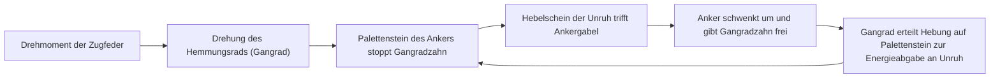
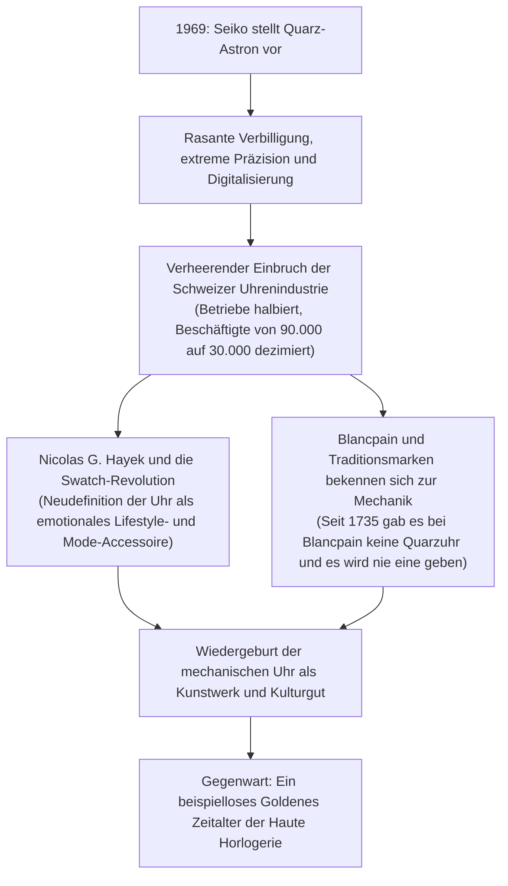
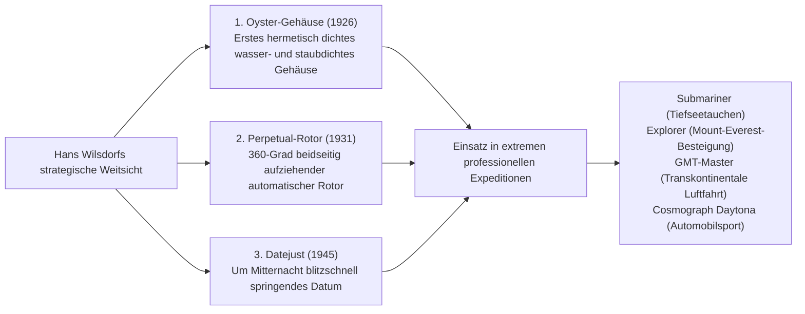

## Einleitung: Die mechanische Uhr als tickender Mikrokosmos

In einem Metallgehäuse von kaum 40 Millimetern Durchmesser und wenigen Millimetern Bauhöhe greifen hunderte mikroskopisch kleiner Zahnräder, Hebel, Federn und synthetische Rubinlager mit mikrometergenauer Präzision ineinander, um den Lauf der Zeit ohne Unterlass zu messen. Dies ist die mechanische Uhr. Unter allen Errungenschaften der Feinwerktechnik, die der menschliche Geist je ersonnen hat, verkörpert sie den kleinsten, ästhetisch faszinierendsten und philosophisch tiefgründigsten Mikrokosmos.

In einer Epoche, in der Quarzuhren und Smartwatches die Zeit digital über Schwingquarze mit zehntausenden Impulsen pro Sekunde oder über atomare Zeitsignale synchronisieren: Warum zieht eine mechanische Uhr, die allein durch die elastische Federkraft einer gewickelten Zugfeder angetrieben wird, nach wie vor Enthusiasten rund um den Globus in ihren Bann und erzielt Werte, die unvergänglichen Meisterwerken der bildenden Kunst gleichen und von zehntausenden bis zu mehreren Millionen Euro reichen?

Die Ursache liegt darin, dass eine mechanische Uhr niemals ein bloßes Zeitmessgerät ist. Sie ist **„die Quintessenz eines 500-jährigen Erkenntnisprozesses der Menschheit, der unentwegt an den Grenzen der Newtonschen Mechanik, der Gravitationskräfte, der Reibung und der thermischen Ausdehnung geforscht hat.“** In ihr verbinden sich die physikalische Genialität historischer Meister wie Abraham-Louis Breguet, die über Generationen kultivierte handwerkliche Vollendung der Täler des Schweizer Juras und der Stolz authentischer Fertigungstiefe – der wahren *Manufacture d'Horlogerie*.

Die vorliegende Abhandlung widmet sich der vollständigen Systematik dieses Fachgebiets: von den religiös-historischen Ursprüngen der Schweizer Uhrenindustrie über die Kinematik mechanischer Kaliber, die Mikrogeometrie der drei großen Komplikationen (Tourbillon, Ewiger Kalender, Minutenrepetition) und die Philosophie legendärer Weltmarken bis hin zur elektro-mechanischen Hybridphysik des Grand Seiko Spring Drive sowie der beispiellosen Renaissance der mechanischen Uhr aus den Verwerfungen der Quarzkrise.

```
[Hierarchische Architektur der mechanischen Uhr]

┌─────────────────┬───────────────────────────────┬───────────────────────────────┐
│ Funktionseinheit│ Wesentliche Bauteile & Organe │ Physikalische Funktion        │
├─────────────────┼───────────────────────────────┼───────────────────────────────┤
│ 1. Energie-     │ Zugfeder, Federhaus           │ Speichert die elastische      │
│    speicher     │ (Handaufzug / automatischer   │ Verformungsenergie; liefert   │
│                 │ Aufzugsrotor)                 │ kontinuierliches Drehmoment   │
├─────────────────┼───────────────────────────────┼───────────────────────────────┤
│ 2. Räderwerk    │ Großbodenrad, Kleinbodenrad,  │ Übersetzt die Drehzahl über   │
│                 │ Sekundenrad, Triebe           │ präzise Zahnradverhältnisse   │
│                 │                               │ unter Drehmomentreduktion     │
├─────────────────┼───────────────────────────────┼───────────────────────────────┤
│ 3. Hemmung      │ Gangrad (Hemmungsrad), Anker, │ Hält das Räderwerk periodisch │
│                 │ Palettensteine (Schweizer     │ an und überträgt Energie-     │
│                 │ Kolbenzahn-Ankerhemmung)      │ impulse auf das Regulierorgan │
├─────────────────┼───────────────────────────────┼───────────────────────────────┤
│ 4. Regulier-    │ Unruh, Unruhspirale           │ Erzeugt eine hochpräzise      │
│    organ        │ (Spiralrolle, Spiralklötzchen,│ Zeitbasis durch harmonische   │
│                 │ Rückerzeiger / Masseschrauben)│ Schwingung (Isochronismus)    │
├─────────────────┼───────────────────────────────┼───────────────────────────────┤
│ 5. Zeigerwerk   │ Wechselrad, Viertelrohr       │ Untersetzt die regulierte     │
│    (Anzeige)    │ (Minutenrohr), Stundenrad,    │ Drehbewegung in visuell       │
│                 │ Zeiger, Zifferblatt           │ lesbare Einheiten (h, min, s) │
└─────────────────┴───────────────────────────────┴───────────────────────────────┘
```

---

## 1. Geschichte der Uhrenindustrie: Von der Hugenottenmigration zum Wunder des Jura-Tals

### 1.1 Die Reformation und die Entstehung der Schweizer Uhrenindustrie
Die Wurzeln der mechanischen Uhrmacherei reichen bis zu den Monumental- und Klosteruhren des 13. und 14. Jahrhunderts in Europa zurück. Dass jedoch die radikale Miniaturisierung zur Taschen- und schließlich zur Armbanduhr gelang und die Schweiz zur unangefochtenen Uhrenmetropole der Welt aufstieg, ist das unmittelbare Resultat dramatischer religionspolitischer Umbrüche.

Im Jahre 1541 setzte der theologische Reformator Johannes Calvin in Genf eine rigorose theokratische Sittenordnung durch. Im Zuge dieser asketischen Doktrin wurde das Tragen von Schmuck, Perlen und kostbarem Geschmeide als sündhafte Eitelkeit unter strenge Strafe gestellt. Für die hochentwickelte Zunft der Genfer Goldschmiede, Ziseleure und Emailleure bedeutete dieses Dekret das unmittelbare wirtschaftliche Aus.

Um der existentiellen Vernichtung zu entgehen, entdeckten die Handwerker eine entscheidende theologische Lücke: Tragbare Taschenuhren galten nicht als verwerflicher Zierrat, sondern als nützliche, sittsame Instrumente der christlichen Lebensdisziplin. Durch die Verschmelzung meisterhafter Goldschmiedekunst mit feinmechanischer Uhrentechnik verwandelte sich Genf in rasantem Tempo in das führende Zentrum hochpräziser Uhrmacherei.

Der endgültige geopolitische Impuls folgte im Jahr 1685, als der französische König Ludwig XIV. das Edikt von Nantes aufhob. Die wiederaufflammende Verfolgung der protestantischen Hugenotten löste eine historische Fluchtwelle aus. Zehntausende hochqualifizierte französische Uhrmacher, Werkzeugmacher, Mathematiker und Astronomen flohen über die Grenze nach Genf und brachten unschätzbares Know-how, fortschrittliche Metallurgietechniken und bahnbrechende Fertigungsverfahren mit.

### 1.2 Das Jura-Gebirge „Watch Valley“ (Vallée de Joux) und das Établissage-System
Aus dem beengten Genf strahlte das Handwerk schon bald in die abgelegenen, rauen Täler des Schweizer Faltenjuras aus – allen voran in das Vallée de Joux, nach Le Locle und La Chaux-de-Fonds.

In diesen Höhenlagen war das Leben während der bis zu sechs Monate andauernden schneereichen Wintermonate von extremer Kälte und Isolation geprägt. Die ansässigen Bauern nutzten diese agrarische Ruhephase, indem sie ihre Dachböden mit großzügigen Atelierfenstern ausstatteten, um das spärliche Tageslicht optimal einzufangen. In meisterhafter Heimarbeit fertigten ganze Familienverbände mikroskopische Uhrenbestandteile an: Triebe, Räder, Federn, Schrauben und Hemmungsteile.

Sobald der Frühling das Eis brach, reisten Genfer Großhändler (*Établisseurs*) durch die Bergdörfer, kauften die Komponenten auf und führten in zentralen Genfer Manufakturen die Assemblage, Feinregulierung und Gehäusemontage durch. Dieses System hochgradig arbeitsteiliger Spezialisierung ging als **Établissage** in die Wirtschaftsgeschichte ein. Durch die Kombination aus dezentraler Spezialfertigung und zentraler Endkontrolle erzielte die Schweizer Uhrenproduktion eine überlegene Präzision und Skalierbarkeit, mit der sie die starr zunftgebundenen Werkstätten Frankreichs und Englands binnen weniger Jahrzehnte verdrängte.

---

## 2. Mechanik der mechanischen Uhr: Physik des Mikrokosmos

### 2.1 Das Herz des Regulierorgans: Unruh, Unruhspirale und der „Isochronismus“
Das fundamentale physikalische Prinzip hinter der Ganggenauigkeit jeder mechanischen Uhr ist der von Galileo Galilei am Pendel entdeckte **Isochronismus (Gleichförmigkeit der Schwingungsdauer)**.
Er besagt, dass die Periode einer Schwingung unabhängig von ihrer Amplitude (dem Schwingungswinkel) konstant bleibt. Da ein Pendel an die Schwerkraft gebunden und für tragbare Zeitmesser ungeeignet ist, kommt in Taschen- und Armbanduhren ein rotatorischer harmonischer Oszillator zum Einsatz: die Kombination aus einer kreisförmigen **Unruh (Balance Wheel)** und einer filigranen **Unruhspirale (Haarfeder)**.

Die theoretische Schwingungsdauer $T$ dieses Schwingsystems wird durch die klassische Bewegungsgleichung beschrieben:

$$T = 2\pi \sqrt{\frac{I}{C}}$$

Hierbei steht $I$ für das Trägheitsmoment der Unruh und $C$ für die Direktionskonstante (Drehfedersteifigkeit) der Unruhspirale.

Die entscheidende Konsequenz dieser Formel lautet: **Die Periode $T$ ist mathematisch unabhängig vom Drehwinkel (der Amplitude).** Ob die Zugfeder voll aufgezogen ist und ihr maximales Drehmoment abgibt oder kurz vor dem Ablauf steht und nur noch schwache Kraft liefert: Die Unruh vollzieht ihre Hin- und Herbewegung stets in exakt demselben zeitlichen Intervall. Auf diesem physikalischen Gesetz beruht die Fähigkeit mechanischer Uhrwerke, Zeit exakt zu teilen.

```
[Beziehung zwischen Schwingungsfrequenz und Ganggenauigkeit]

- 5 Halbschwingungen pro Sekunde (18.000 A/h / 2,5 Hz):
  Die Unruh schwingt fünfmal je Sekunde (18.000 Halbschwingungen pro Stunde). Typisch für antike Taschenuhren und klassische Vintage-Kaliber. Erzeugt das traditionelle, sonore Ticken. Geringster Materialverschleiß und extreme Langlebigkeit.

- 6 Halbschwingungen pro Sekunde (21.600 A/h / 3,0 Hz):
  Der historische Standard für klassische Handaufzugswerke der Mitte des 20. Jahrhunderts (z. B. Patek Philippe Kaliber 215 PS).

- 8 Halbschwingungen pro Sekunde (28.800 A/h / 4,0 Hz):
  Der unangefochtene Goldstandard moderner Luxusarmbanduhren (z. B. Rolex Kaliber 3135/3235, ETA 2824-2). Bietet die ideale Balance zwischen Schockresistenz gegen Armbewegungen, Schmiermittelstabilität und geringem Bauteilverschleiß.

- 10 Halbschwingungen pro Sekunde (36.000 A/h / 5,0 Hz):
  Hochfrequenz-Architektur („Schnellschwinger“). Ermöglicht mechanische Messungen auf die Zehntelsekunde genau. Legendär verkörpert im Zenith El Primero und Grand Seiko Kaliber 9S85. Äußerst widerstandsfähig gegen Lage- und Stoßstörungen, verlangt jedoch hochentwickelte Metallurgie und Schmierstoffe.
```

### 2.2 Der dynamische Zyklus der Schweizer Kolbenzahn-Ankerhemmung
Selbst das perfekteste Schwingsystem würde durch Luftwiderstand und innere Materialdämpfung rasch zum Stillstand kommen, erhielte es nicht bei jeder Schwingung einen minimalen energetischen Impuls. Das mechanische Bindeglied, das das kontinuierliche Drehmoment des Räderwerks in dosierte Impulse wandelt und gleichzeitig den Ablauf der Räder steuert, ist die **Hemmung**.



Die Schweizer Kolbenzahn-Ankerhemmung vollführt diese Sequenz aus Ruhestellung, Auslösung und Hebung fünf- bis zehnmal pro Sekunde im Millisekundenbereich. An einem einzigen Tag (86.400 Sekunden) bewältigt dieses mikroskopische Ensemble rund 700.000 metallische Anschläge; im Laufe eines Jahres über 250 Millionen Zyklen. Dass ein solcher Mechanismus über Jahrzehnte ohne Ermüdungsbruch funktioniert, ist ein Meisterstück mikrotribologischer Präzision.

### 2.3 Rückersystem vs. Freischwingende Unruh
Für die Feinregulierung der Ganggeschwindigkeit existieren zwei grundlegend verschiedene Konstruktionsphilosophien:

1. **Rückersystem (Raquette)**:
   Der äußere Spiralumgang wird zwischen zwei eng stehenden Rückerstiften geführt. Durch Schwenken des Rückerhebels wird die „aktive Schwingungslänge“ der Spiralfeder verkürzt oder verlängert, was die wirksame Federkonstante $C$ verändert. Dieses System ermöglicht einfache Regulierungen, birgt jedoch das Risiko, dass Erschütterungen den Hebel verstellen; zudem beeinträchtigt das Spiel zwischen Spirale und Stiften die feine Isochronie.
2. **Freischwingende Unruh (Free-Sprung Balance)**:
   Die konstruktive Krone der Haute Horlogerie, meisterhaft umgesetzt in Patek Philippes Gyromax-Unruh oder Rolex' Microstella-System. Der Rücker wird vollständig eliminiert, und die aktive Spirallänge bleibt fixiert. Die Regulierung erfolgt stattdessen über **auf dem Unruhschenkel oder -reif angebrachte Masseschrauben oder Exzentergewichte, durch deren Drehung das Trägheitsmoment $I$ der Unruh direkt variiert wird**. Diese Bauweise widersteht härtesten Stößen und garantiert überragende Langzeitstabilität, verlangt dem Regleur jedoch höchstes handwerkliches Geschick ab.

---

## 3. Ingenieurtechnische Anatomie der drei großen Komplikationen (Grandes Complications)

Jede uhrmacherische Funktion, die über die reine Anzeige von Stunden, Minuten und laufender Sekunde hinausgeht, wird als „Komplikation“ bezeichnet. An der Spitze der mechanischen Uhrmacherei thronen die „Drei Großen Komplikationen“, deren Beherrschung den ultimativen Nachweis meisterlicher Fertigungstiefe darstellt.

```
[Klassifizierung und ingenieurtechnische Herausforderungen der großen Komplikationen]

┌─────────────────┬───────────────────────────────┬───────────────────────────────┐
│ Komplikation    │ Physikalische & Mechanische   │ Feinmechanische               │
│                 │ Problemstellung               │ Lösung                        │
├─────────────────┼───────────────────────────────┼───────────────────────────────┤
│ Tourbillon      │ Lagefehler in vertikaler      │ Einbau von Hemmung und        │
│                 │ Position durch Einwirkung der │ Unruh in einen leichten Käfig,│
│                 │ Erdanziehung auf die Spirale  │ der sich in 60 s um 360° dreht│
├─────────────────┼───────────────────────────────┼───────────────────────────────┤
│ Ewiger Kalender │ Unterschiedliche Monatslängen │ Mechanisches 48-Monats-       │
│ (Quantième      │ (30, 31, 28 Tage) und         │ Programmrad mit spezifisch    │
│ Perpétuel)      │ Schaltjahre (29 Tage im Feb)  │ abgestuften Frästiefen        │
├─────────────────┼───────────────────────────────┼───────────────────────────────┤
│ Minuten-        │ Akustische Übersetzung der    │ Staffeln (Schnecken) tasten   │
│ repetition      │ unsichtbaren Uhrzeit auf      │ Uhrzeit ab; Hämmer schlagen   │
│                 │ Abruf über Schlagtöne         │ auf gestimmte Tonfedern       │
└─────────────────┴───────────────────────────────┴───────────────────────────────┘
```

### 3.1 Tourbillon: Zähmung der Schwerkraft im rotierenden Käfig
Das im Jahr 1801 von Abraham-Louis Breguet patentierte Tourbillon (französisch für „Wirbelwind“) gilt als Inbegriff uhrmacherischer Virtuosität.

Da historische Taschenuhren überwiegend aufrecht in der Westentasche getragen wurden, wirkte die Schwerkraft stets in derselben Richtung auf die Unruhspirale. Dies führte zu asymmetrischem Durchhängen, Verlagerung des Schwerpunkts und gravierenden Gangabweichungen (Lagefehlern).
Breguets revolutionäre Erkenntnis: Wenn man die Schwerkraft nicht ausschalten kann, muss man das Regulierorgan selbst kontinuierlich im Raum drehen.

Breguet lagerte die gesamte Hemmungsbaugruppe – Gangrad, Anker, Unruh und Spiralfeder – in einem federleichten Käfig. Dieser Käfig wird über das Trieb des Gangrads an einem feststehenden Sekundenrad abgerollt und vollzieht **in exakt 60 Sekunden eine volle Umdrehung um 360 Grad**. Hierdurch wird jeder lagebedingte Gangfehler innerhalb einer Minute durch einen entgegengesetzten Fehler vollständig kompensiert. Aus Titan oder Stahl gefertigte Käfige, die bei Dutzenden Bauteilen kaum 0,2 bis 0,3 Gramm wiegen, reibungsfrei rotieren zu lassen, bleibt eine Domäne weniger Elitemanufakturen.

### 3.2 Ewiger Kalender (Quantième Perpétuel): Der Urvater mechanischer Rechenmaschinen
Herkömmliche Datumsanzeigen schalten starr bis zum 31. eines jeden Monats weiter und verlangen in den Monaten Februar, April, Juni, September und November eine manuelle Korrektur über die Aufzugskrone.

Der Ewige Kalender fungiert hingegen als rein mechanischer Analogcomputer. Dank eines mechanischen Datenspeichers **erkennt er selbsttätig die Monate mit 30 und 31 Tagen, die regulären Februare mit 28 Tagen sowie den 29-tägigen Februar des vierjährlichen Schaltjahres**, und schaltet bis zum Säkularjahr 2100 ohne jeglichen Eingriff fehlerfrei.

Das Herzstück ist das sogenannte **48-Monats-Rad (Schaltjahr-Rad)**. Auf seinem Umfang sind 48 Sektoren eingefräst, deren Vertiefungen exakt dem vierjährigen Zyklus entsprechen:
- 31-Tage-Monate: Flachste Segmente
- 30-Tage-Monate: Mitteltiefe Segmente
- Regulärer Februar (28 Tage): Tiefste Ausfräsung
- Schaltjahr-Februar (29 Tage): Spezifisch profilierte Zwischenstufe
Ein hochentwickelter Fühlhebel tastet diese Einschnitte mechanisch ab und steuert in der Mitternachtsstunde des Monatsletzten, um wie viele Schaltschritte die Datumsscheibe vorspringt.

### 3.3 Minutenrepetition: Der Gipfel der Akustikphysik
In einer Zeit vor Erfindung des elektrischen Lichts ermöglichte die Repetition das akustische Ablesen der Zeit bei völliger Dunkelheit. Durch Betätigen eines Gehäuseschiebers ertönt eine harmonische Schlagfolge:

- **Tiefer Ton (Stundenschlag)**: Ein voller Klang auf der Basstonfeder, schlägt 1 bis 12 Mal.
- **Doppelschlag hoch-tief (Viertelstundenschlag)**: Zwei aufeinanderfolgende Töne („Ding-Dong“), schlägt 1 bis 3 Mal (für 15, 30 und 45 Minuten).
- **Hoher Ton (Minutenschlag)**: Ein heller Klang auf der Diskanttonfeder, schlägt 1 bis 14 Mal für die restlichen Minuten.
*(Beispiel um 7:42 Uhr: 7 tiefe Schläge + 2 Doppelschläge + 12 hohe Schläge).*

Um das Uhrwerk winden sich zwei kreisförmig gebogene, gehärtete Stahldrähte (Tonfedern), die von winzigen Hämmern angeschlagen werden. Beim Spannen des Schiebers fallen Abtasthebel (Rechen) auf gestufte Kurvenscheiben (Schnecken), welche die Zeigerstellung mechanisch abgreifen. Um ein gleichmäßiges Tempo zwischen den Schlägen zu sichern, rotiert ein lautloser Fliehkraft- oder aerodynamischer Windflügelregler. Die Wahl der Gehäuselegierung (Roségold, Titan oder Platin) wird dabei nach akustischen Resonanz- und Dämpfungskriterien millimetergenau abgestimmt.

---

## 4. Die erhabensten Manufakturen der Welt und die Philosophien legendärer Häuser

In der Uhrmacherei unterscheidet man streng zwischen Assemblierungsbetrieben (*Établisseurs*), die Rohwerke zukaufen, und echten **Manufakturen**, die Entwicklung, Teilefertigung, Veredelung, Montage und Gangregulierung vollständig im eigenen Hause ausführen.

```
[Weltberühmte Manufakturen und ihre uhrmacherischen Meilensteine]

┌─────────────────┬───────────┬───────────────────────────────┐
│ Manufaktur      │ Gegründet │ Philosophie, Ikonen und       │
│                 │           │ technische Charakteristika    │
├─────────────────┼───────────┼───────────────────────────────┤
│ Patek Philippe  │ 1839      │ Souverän der Heiligen         │
│                 │ Schweiz   │ Dreifaltigkeit; PP-Siegel;    │
│                 │           │ Calatrava, Nautilus.          │
├─────────────────┼───────────┼───────────────────────────────┤
│ Audemars Piguet │ 1875      │ Meister der Komplikationen;   │
│                 │ Schweiz   │ schufen 1972 mit der Royal    │
│                 │           │ Oak die Luxussportuhr.        │
├─────────────────┼───────────┼───────────────────────────────┤
│ Vacheron        │ 1755      │ Älteste ununterbrochene       │
│ Constantin      │ Schweiz   │ Uhrenmanufaktur der Welt;     │
│                 │           │ Genfer Siegel; Patrimony.     │
├─────────────────┼───────────┼───────────────────────────────┤
│ A. Lange &      │ 1845      │ Gipfel sächsischer Präzision; │
│ Söhne           │ Deutschland│ Dreiviertelplatte, Goldchatons,│
│                 │           │ doppelte Montage; Lange 1.    │
├─────────────────┼───────────┼───────────────────────────────┤
│ Rolex           │ 1905      │ Unangefochtener Primus der    │
│                 │ Schweiz   │ Alltags-Luxusuhr; Oyster,     │
│                 │           │ Perpetual-Rotor, In-House-Stahl│
├─────────────────┼───────────┼───────────────────────────────┤
│ Omega           │ 1848      │ Speedmaster Moonwatch; Master │
│                 │ Schweiz   │ Chronometer; Pionier der      │
│                 │           │ Co-Axial-Hemmungsrevolution.  │
├─────────────────┼───────────┼───────────────────────────────┤
│ Grand Seiko     │ 1960      │ Japanische Mikrotechnik;      │
│                 │ Japan     │ revolutionärer Spring-Drive-  │
│                 │           │ Tri-Synchro-Hybridantrieb.    │
└─────────────────┴───────────┴───────────────────────────────┘
```

### 4.1 Patek Philippe: Der absolute Souverän der Uhrmacherei
Gegründet 1839 in Genf, zählten Königin Victoria, Albert Einstein und Pjotr Tschaikowski zu den Trägern dieser Zeitmesser. Patek Philippe gilt unbestritten als weltweiter Primus der klassischen Haute Horlogerie.
Von den am Goldenen Schnitt orientierten Linien der Calatrava bis zum sportlich-eleganten Design der Nautilus verkörpert das Haus unvergängliche Noblesse.
2009 emanzipierte sich die Manufaktur vom Genfer Siegel und rief das noch strengere „Patek Philippe Siegel“ ins Leben, das für eingeschalte Uhren maximale Toleranzen von −3 bis +2 Sekunden pro Tag vorschreibt und eine lebenslange Restaurierungsgarantie für jedes jemals gefertigte Modell bietet. Das Credo – „Eine Patek Philippe besitzt man nie ganz allein. Man bewahrt sie nur für die nächste Generation“ – manifestiert das Selbstverständnis der Uhr als Generationen überdauerndes Kulturgut.

### 4.2 A. Lange & Söhne: Die Wiedergeburt sächsischer Präzisionskultur
In der erzgebirgischen Kleinstadt Glashütte begründete Ferdinand Adolph Lange 1845 die deutsche Feinuhrmacherei. Nach Zerstörung im Zweiten Weltkrieg und jahrzehntelanger Zwangswirtschaft im DDR-Regime führten Walter Lange und Günter Blümlein die Marke 1990 zu einer triumphalen Renaissance.

Uhrwerke von A. Lange & Söhne atmen eine unverkennbare germanische Ingenieursästhetik:
- **Glashütter Dreiviertelplatte aus Neusilber**: Eine massive Brücke aus einer Kupfer-Nickel-Zink-Legierung deckt den Großteil des Räderwerks ab und verleiht ihm unübertroffene Torsionssteifigkeit. Im Lauf der Jahrzehnte bildet das Material eine warme, goldene Patina aus.
- **Verschraubte Goldchatons**: In 18 Karat Goldfassungen eingepasste Rubinlager, die mit thermisch gebläuten Schrauben auf der Platine fixiert werden.
- **Freihandgravierte Unruhkloben**: Jeder Kloben wird von Meistern individuell mit traditionellen Blumenmotiven graviert, wodurch jedes Uhrwerk zum Unikat wird.
- **Doppelte Montage**: Jedes Werk wird zunächst komplett montiert und einreguliert, anschließend wieder vollständig zerlegt, aufwändig gereinigt, finissiert und endgültig zusammengesetzt – ein Zeugnis kompromissloser handwerklicher Integrität.

### 4.3 Grand Seiko und die hybride Physik des „Spring Drive“
1960 von Daini Seikosha und Suwa Seikosha mit dem Ehrgeiz ins Leben gerufen, die Schweizer Chronometernormen zu übertreffen, erreichte Grand Seiko 1999 nach über zwei Jahrzehnten Forschung unter Ingenieur Yoshikazu Akahane einen epochalen Meilenstein: den **Spring Drive**.

```
[Dynamik des Spring Drive Tri-Synchro-Regulators]

[Mechanische Energiequelle: Zugfeder]
- Völlig unabhängig von Batterien oder externen Motoren.
  Der gesamte Kraftfluss entstammt der elastischen Entspannung der Feder.
  ↓
[Übersetzung durch das Räderwerk]
  ↓
[Rotation des Gleitrads (Magnetrotor): 8 Umdrehungen/Sekunde]
- Induziert beim Vorbeigleiten an den Statorspulen eine minimale
  elektromagnetische Spannung im Mikrowatt-Bereich.
  ↓
[Aktivierung von Quarz-IC und Schwingquarz]
- Der erzeugte Mikrostrom aktiviert einen energiesparsamen IC
  und einen hochpräzisen Schwingquarz (32.768 Hz).
  ↓
[Elektromagnetische Bremsregelung]
- Der IC vergleicht hunderte Male pro Sekunde die Quarzfrequenz
  mit der tatsächlichen Drehzahl des Gleitrads.
- Rotiert das Rad zu schnell, übt eine berührungslose Wirbelstrombremse
  einen dosierten Widerstand aus und arretiert die Rotation auf exakt 8 U/s.
```

Während die Zeiger mechanischer Uhren in Mikroschritten vorrücken und Quarzuhren im Sekundentakt springen, gleitet der Sekundenzeiger des Spring Drive in einer völlig lautlosen, kontinuierlichen Kreisbewegung über das Zifferblatt – der sogenannten **Glide Motion**. Durch die Symbiose aus unbegrenzter mechanischer Autonomie und quarzgesteuerter Präzision (±15 Sekunden pro Monat) schuf Grand Seiko eine der größten Innovationen der modernen Uhrengeschichte.

---

## 5. Die Quarzkrise und die ökonomische Philosophie der mechanischen Renaissance

Am 25. Dezember 1969 brachte Seiko mit der „Quartz Astron 35SQ“ die erste kommerzielle Quarzarmbanduhr auf den Markt. Mit einer Gangabweichung von lediglich ±0,2 Sekunden pro Tag (±5 Sekunden im Monat) deklassierte sie selbst meisterhafte mechanische Chronometer um ein Vielfaches und stürzte die traditionelle Uhrenwelt in die sogenannte **Quarzkrise**.



Die Schweizer Industrie stand am Abgrund: Binnen eines Jahrzehnts schloss über die Hälfte aller Betriebe, und die Zahl der Beschäftigten sank von 90.000 auf unter 30.000.
Doch gerade diese existenzielle Erschütterung führte zu einer tiefgreifenden Klärung des Wesens der mechanischen Uhr.
Diente eine Uhr lediglich dem pragmatischen Ablesen der Zeit, so war jede elektronische Quarzuhr oder jedes Smartphone der Mechanik überlegen. Doch am menschlichen Handgelenk geht es um weit mehr als funktionale Zeitmessung:
Es geht um die lebendige Wärme eines nach Newtonschen Gesetzen atmenden Räderwerks, um die mikroskopische Perfektion handanglierter Brücken und um ein dauerhaftes Gut, das vom Vater an den Sohn vererbt wird.

Dank des visionären Wirkens von Unternehmerpersönlichkeiten wie Nicolas G. Hayek und Jean-Claude Biver vollzog die mechanische Uhr einen paradigmatischen Wandel: vom alltäglichen Gebrauchsgegenstand hin zum **hochemotionalen Kunstwerk und Verkörperung menschlicher Handwerkskultur**. Die heutige Begeisterung für edle mechanische Zeitmesser ist auch als Sehnsucht nach greifbarer Authentizität in einer voll digitalisierten Welt zu verstehen.

---

## 3.4 Kinematik des Chronographen: Präzisionsmechanik der Stoppuhr

Unter den Komplikationen ist der Chronograph – das Messwerk für Zeitintervalle – am engsten mit Motorsport, Luftfahrt und Wissenschaft verwoben. Haptik, Langlebigkeit und Präzision eines Chronographenkalibers werden maßgeblich durch das Zusammenspiel von **Schaltsteuerung** und **Kupplungssystem** bestimmt.

```
[Schaltsysteme und Kupplungsarten moderner Chronographen]

┌─────────────────┬───────────────────────────────┬───────────────────────────────┐
│ Funktionsbereich│ Bauart                        │ Technische Merkmale           │
│                 │                               │ und mechanisches Verhalten    │
├─────────────────┼───────────────────────────────┼───────────────────────────────┤
│ Schaltsteuerung │ 1. Säulenrad (Schaltrad /     │ Zylindrisches Stahlrad mit    │
│                 │    Column Wheel)              │ gefrästen Säulen. Seiden-     │
│                 │                               │ weicher Drückerwiderstand.    │
├─────────────────┼───────────────────────────────┼───────────────────────────────┤
│                 │ 2. Nockenschaltung (Kulisse / │ Gestanzte oder gefräste flache│
│                 │    Cam-Actuated)              │ Schaltwippe. Äußerst robust;  │
│                 │                               │ spürbar härterer Tastendruck. │
├─────────────────┼───────────────────────────────┼───────────────────────────────┤
│ Kraft-          │ 1. Horizontale Räderkupplung  │ Ein Zwischenrad schwenkt seit-│
│ übertragung     │    (Lateral Clutch)           │ lich ein. Faszinierendes      │
│                 │                               │ Schauspiel; traditionell.     │
├─────────────────┼───────────────────────────────┼───────────────────────────────┤
│                 │ 2. Vertikale Reibungskupplung │ Reibscheiben greifen axial    │
│                 │    (Vertical Clutch)          │ plan aufeinander. Keinerlei   │
│                 │                               │ Zeigerspringen beim Start.    │
└─────────────────┴───────────────────────────────┴───────────────────────────────┘
```

Die traditionelle horizontale Kupplung leidet unter einem inhärenten mechanischen Mangel: Beim Starten treffen die rotierenden Zähne des Zwischenrads seitlich auf das stehende Chronographen-Zentrumrad. Treffen Zahnspitzen aufeinander, vollführt der Stoppsekundenzeiger einen unschönen Sprung (*Aiguille sautante*).
Moderne Hochleistungschronographen (wie Rolex Kaliber 4130/4131, Omega Kaliber 9300 oder Breitling B01) setzen daher auf eine **vertikale Reibungskupplung**. Hierbei werden zwei Scheiben axial kraftschlüssig aufeinandergepresst. Das Anlaufen erfolgt absolut ruckfrei, und der Chronograph kann dauerhaft mitlaufen, ohne die Schwingungsamplitude der Unruh zu beeinträchtigen.

### Flyback und Schleppzeiger (Rattrapante)
- **Flyback (Retour-en-vol)**: Ermöglicht das Stoppen, Nullstellen und sofortige Neustarten einer Messung mit einer einzigen Betätigung des Rückstelldrückers – entwickelt für Kampfpiloten zur sequentiellen Kursnavigation.
- **Schleppzeiger (Rattrapante)**: Zwei übereinanderliegende Stoppsekundenzeiger laufen synchron. Durch Druck auf einen Zusatzdrücker wird der Schleppzeiger angehalten, um eine Zwischenzeit abzulesen, während der Hauptzeiger ununterbrochen weiterläuft. Ein erneuter Druck lässt ihn augenblicklich wieder mit dem Hauptzeiger verschmelzen.

---

## 2.4 Die erste Hemmungsrevolution seit 250 Jahren: Koaxial-Hemmung und Silizium-Materialwissenschaft

Nachdem die Schweizer Kolbenzahn-Ankerhemmung mehr als zwei Jahrhunderte lang konkurrenzlos dominiert hatte, brachte die Wende zum 21. Jahrhundert bahnbrechende Innovationen gegen die beiden Erzfeinde der Uhrmacherei hervor: Reibung und Magnetismus.

### 1. George Daniels und die Koaxial-Hemmung (Co-Axial Escapement)
In den 1970er-Jahren vom britischen Uhrmachergenie Dr. George Daniels erfunden und 1999 von Omega zur Serienreife gebracht, stellte die Koaxial-Hemmung die erste grundlegend neue, praxisreife Hemmung seit 250 Jahren dar.

Bei der traditionellen Ankerhemmung gleiten die Palettensteine mit erheblicher Reibung über die Zahnflanken des Gangrads, was flüssige Schmierstoffe zwingend erforderlich macht. Mit deren Alterung und Verharzung sinkt die Ganggenauigkeit unweigerlich ab.
Die Koaxial-Hemmung nutzt hingegen ein zweistufiges Koaxial-Gangrad und drei Rubinpaletten, wodurch die Kraftübertragung nicht durch Schleifbewegungen, sondern durch **radiale Hebungsimpulse (Tangentialkontakt ohne Gleitreibung)** erfolgt. Da fast keine Gleitreibung auftritt, arbeitet das System weitgehend schmiermittelfrei, wodurch Serviceintervalle von 3–5 Jahren auf 8–10 Jahre verdoppelt wurden.

### 2. Die High-Tech-Revolution durch einkristallines Silizium
Aus der Halbleiterindustrie adaptierte Fertigungsverfahren wie das Tiefen-Reaktionsionenätzen (DRIE) ermöglichten es einem Konsortium aus Patek Philippe, Rolex, Omega und dem CSEM in Neuchâtel, Werkteile aus einkristallinem Silizium herzustellen:
- **Absolute Antimagnetismus**: Silizium ist ein Halbmetall und völlig unempfindlich gegenüber den Magnetfeldern von Smartphones, Laptops und Handtaschenverschlüssen.
- **Thermisch kompensierter Isochronismus**: Durch Oxidation erzeugte Siliziumdioxidschichten (wie bei Patek Philippes Silinvar und Spiromax) kompensieren temperaturbedingte Elastizitätsänderungen vollständig.
- **Geringes Trägheitsmoment und höchste Gleitfähigkeit**: Dank minimaler Dichte und molekularer Oberflächenglätte arbeitet das System mit extrem hoher Energieeffizienz.

---

## 4.4 Rolex: Die technologische Hegemonie der funktionalen Luxusuhr

1905 von Hans Wilsdorf gegründet, wandelte Rolex die Armbanduhr von einem zerbrechlichen Schmuckgegenstand zu einem unzerstörbaren Präzisionsinstrument für widrigste Umweltbedingungen.



### Oystersteel (Edelstahllegierung 904L) und hauseigene Metallurgie
Im Gegensatz zu fast allen Mitbewerbern, die gebräuchlichen 316L-Edelstahl verwenden, setzt Rolex seit den 1980er-Jahren auf **Oystersteel aus der Familie der 904L-Superlegierungen**, die sonst vornehmlich in der Luft- und Raumfahrt sowie der chemischen Verfahrenstechnik Verwendung finden.
Dank hoher Anteile an Chrom, Molybdän, Nickel und Kupfer bietet dieser Stahl herausragende Beständigkeit gegen Lochfraßkorrosion durch Meerwasser und Schweiß und nimmt nach der Politur einen einzigartigen Glanz an. Zudem unterhält Rolex eine eigene Edelmetallgießerei, in der patentierte Legierungen wie das farbbeständige Everose-Gold erschmolzen werden.

---

## 5.2 Uhrwerkveredelung und die Ästhetik dekorativer Haute Horlogerie

Mehr als die Hälfte des Wertes eines Haute-Horlogerie-Uhrwerks begründet sich in der meisterhaften handwerklichen Veredelung (*Bienfacture*) der Werkteile. Veredelung ist dabei weit mehr als bloße Zierde: Das Brechen und Polieren scharfer Metallkanten verhindert winzige Spanabhebungen, während die Politur Korrosion zuverlässig unterbindet.

```
[Klassische Veredelungstechniken der Haute Horlogerie]

1. Anglage (Kantenbrechen / Fasieren):
   Rechtwinklige Kanten von Brücken und Platinen werden von Hand mit Feilen,
   Enzianholzstäben und Diamantpaste in gleichmäßige, spiegelglänzende 45-Grad-
   Fasen verwandelt, die das Licht funkelnd reflektieren.

2. Côtes de Genève (Genfer Streifen):
   Parallele, wellenförmige Schliffmuster, die mit rotierenden Holz- oder
   Schleifwerkzeugen auf die Brücken aufgebracht werden und je nach
   Lichteinfall faszinierende optische Tiefenwirkungen entfalten.

3. Perlage (Perlierung / Wolkenschliff):
   Kreisförmig überlappende Schliffe auf verdeckten Werkflächen wie der
   Hauptplatine, die mikroskopische Staubpartikel binden und das Haften
   von Schmierstofffilmen unterstützen.

4. Poli Noir (Schwarzpolitur / Spiegelglanz):
   Die anspruchsvollste aller Polituren. Stahlteile (wie Schraubenköpfe oder
   Tourbillonkäfige) werden auf einer mit Diamantinpulver bestrichenen
   Zinkplatte so lange von Hand gerieben, bis absolute Planheit erreicht ist.
   Aus bestimmten Blickwinkeln reflektiert die Fläche das gesamte Licht und
   erscheint tiefschwarz.
```

Das **Genfer Siegel (Poinçon de Genève)** stellt den renommiertesten offiziellen Herkunftsnachweis dar. Es wird ausschließlich Uhrwerken verliehen, die zwölf strengste ästhetische und konstruktive Vorgaben erfüllen – von perfekt anglierten Stahlkanten über polierte Schrauben bis hin zu spiegelnd polierten Trieben.

---

## 4.5 Die Herausforderung unabhängiger Uhrmacher (AHCI) und zeitgenössische Mikroskulpturen

In einer von Großkonzernen (Richemont, Swatch Group, LVMH) dominierten Uhrenwelt bildet die **Académie Horlogère des Créateurs Indépendants (AHCI)** das kreative Gewissen der Branche, in dem Meisteruhrmacher radikale Ideen ohne industriellen Renditedruck realisieren.

```
[Legendäre zeitgenössische unabhängige Uhrmacher]

1. Philippe Dufour:
   - Fertigt in seiner Werkstatt in Le Sentier Zeitmesser vollkommen allein,
     ohne Assistenten oder CNC-Maschinen.
   - „Simplicity“: Eine schlichte Dreizeigeruhr, deren breite, fließende
     Anglagekanten als die vollkommensten der Menschheitsgeschichte gelten.
   - „Duality“: Die erste Armbanduhr mit zwei Unruhen, die über ein
     Differentialgetriebe verbunden sind, um Gangfehler mechanisch auszugleichen.

2. François-Paul Journe (F.P. Journe):
   - Folgt dem Wahlspruch „Invenit et Fecit“ (Erfunden und gefertigt).
   - „Chronomètre à Résonance“: Zwei eng nebeneinanderliegende Unruhen
     synchronisieren ihre Schwingungen durch akustische Resonanz über
     Luft und Werkplatte vollkommen autonom.
   - Fertigt Platinen und Brücken grundsätzlich aus massivem 18 Karat Roségold.

3. Richard Mille:
   - Definiert die Luxusuhr als „Rennwagen fürs Handgelenk“.
   - Verwendet High-Tech-Werkstoffe wie Karbon TPT, Titan Grad 5 und
     Gehäuse aus massivem Saphirglas.
   - Konstruierte Tourbillons mit Stoßfestigkeiten von 5.000 bis über 12.000 G,
     die Tennisstar Rafael Nadal während seiner Matches am Handgelenk trägt.
```

---

## 2.5 Der Kampf gegen den Erzfeind Magnetismus: Die Evolutionsgeschichte des Magnetschutzes

In unserer modernen Zivilisation erzeugen Smartphones, Laptops, Lautsprecher, Magnetschließen und Induktionsfelder allgegenwärtige elektromagnetische Felder. Für ein mechanisches Uhrwerk stellt die **Magnetisierung** das größte Präzisionsrisiko der Gegenwart dar.

Wird eine herkömmliche Stahlspirale magnetisiert, haften ihre Spiralumgänge aneinander. Die freie Schwingungslänge verkürzt sich drastisch, und die Uhr geht binnen 24 Stunden um viele Minuten oder gar Stunden vor.

```
[Zwei Strategien des modernen Magnetschutzes]

1. Das Schirmungsprinzip (Faraday-Käfig):
   - Prinzip: Das gesamte Werk wird in ein Innengehäuse aus Weicheisen gebettet.
   - Wirkungsweise: Die magnetischen Feldlinien werden durch die hohe
     Permeabilität des Weicheisens um das empfindliche Werk herumgeleitet.
   - Klassiker: IWC Ingenieur, Rolex Milgauss (Schutz bis 1.000 Gauß).
   - Nachteile: Großes Gehäusevolumen und Verzicht auf Glassichtböden.

2. Das Materialprinzip (Werkstoffrevolution):
   - Prinzip: Spirale, Anker und Gangrad werden aus antimagnetischen
     Halbleitern oder Speziallegierungen gefertigt.
   - Klassiker: Omega Master Chronometer (resistent bis über 15.000 Gauß,
     selbst im MRT unbeeindruckt) dank Si14-Siliziumspirale und Titanachsen.
   - Vorteile: Schlanke Bauformen und freie Sicht auf das Werk durch
     transparente Saphirglasböden.
```

---

## 5.5 Schweizer Zertifizierungsstandards: COSC-Chronometerprüfung und Genfer Siegel

Zur objektiven Überprüfung von Ganggenauigkeit und Verarbeitungsqualität stützt sich die Schweizer Uhrenindustrie auf renommierte Prüfverfahren.

```
[Wichtigste Qualitäts- und Präzisionsstandards der Schweizer Uhrenindustrie]

1. COSC (Contrôle Officiel Suisse des Chronomètres):
   - Überblick: Staatlich anerkannte Chronometerprüfung für ungeschalte Werke.
   - Testzyklus: Die Werke werden über 15 Tage in 5 Lagen (Zifferblatt oben/unten,
     Krone links/oben/unten) und bei 3 Temperaturen (8 °C, 23 °C, 38 °C) geprüft.
   - Toleranz: Mittlerer täglicher Gang zwischen -4 und +6 Sekunden (bei Kalibern
     über 20 mm). Nur wenige Prozent aller Schweizer Uhren tragen diesen Titel.

2. Genfer Siegel (Poinçon de Genève):
   - Überblick: 1886 per Gesetz erlassenes Ehren- und Herkunftszertifikat des
     Kantons Genf für höchste uhrmacherische Vollendung.
   - Territoriale Bindung: Fertigung und Regulierung müssen ausnahmslos auf dem
     Gebiet des Kantons Genf erfolgen.
   - 12 Technische Kriterien:
     - Sämtliche Stahlkanten müssen angliert und Flanken satiniert sein.
     - Schraubenköpfe und Schlitze müssen poliert und gefast sein.
     - Zahnradflanken müssen angliert und Triebe hochglanzpoliert sein.
     - Rubinlagerbohrungen müssen poliert sein und korrekte Senkungen aufweisen.
   - Moderner Prüfzusatz: Seit 2011 werden auch die fertig eingeschalten Uhren
     auf Gangabweichungen (-1 bis +1 s/Tag), Gangreserve und Wasserdichtigkeit
     dynamisch geprüft. Traditionsmarken wie Vacheron Constantin bekennen sich
     nach wie vor zu dieser Institution.
```

---

## 6. Fazit: Das Tragen des Mikrokosmos am Handgelenk

Legt man eine mechanische Uhr um das Handgelenk und zieht die Krone behutsam mit den Fingerspitzen auf, so spürt man den elastischen Widerstand der Zugfeder und vernimmt beim Heranführen ans Ohr das vertraute, rasche Schlagen der Unruh.

In jenem Moment spürt man das pulsierende Erbe aus fünf Jahrhunderten mechanischer Innovationsgeschichte, beginnend bei Peter Henleins Federzug im Nürnberg der Renaissance. Über Kriege, politische Umstürze und technologische Paradigmenwechsel hinweg haben Uhrmacher ihr Leben einer einzigen Frage gewidmet: Wie lässt sich das unaufhaltsame Verstreichen der Zeit mit höchster Präzision und unsterblicher Schönheit vergegenwärtigen?

Ein Blick auf ein digitales Endgerät zeigt die auf atomare Genauigkeit synchronisierte Zeit. Doch der Blick auf das mechanische Kunstwerk am eigenen Handgelenk – wo mikroskopische Zahnräder und schwingende Federn die Zeit zum Leben erwecken – verbindet den Menschen unmittelbar mit den Gesetzen der Schwerkraft und dem Lauf des Kosmos.

Die mechanische Uhr bleibt die kostbarste, faszinierendste und edelste Rüstung des menschlichen Geistes im Angesicht der Vergänglichkeit.
