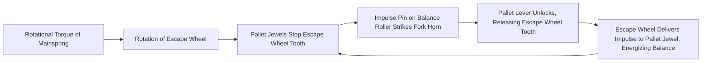
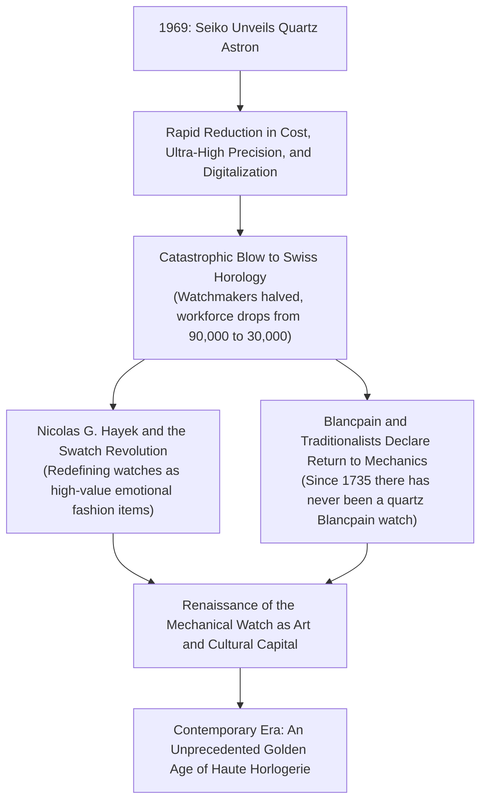
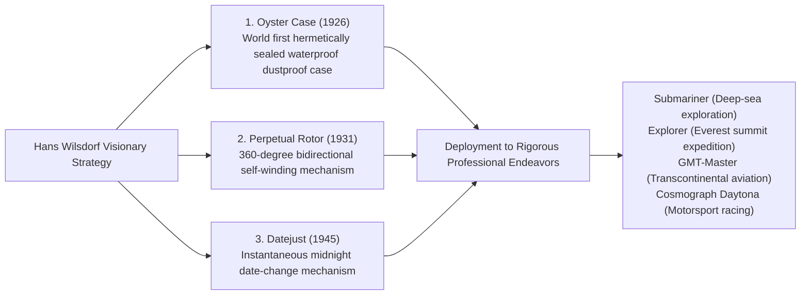

## Introduction: The Mechanical Watch as a Ticking Microcosm

Housed within a metal case measuring a mere 40 millimeters in diameter and a few millimeters in thickness, hundreds of microscopic gears, levers, springs, and synthetic ruby bearings interact seamlessly to measure the passage of time without missing a single beat. This is the mechanical watch. Among all precision mechanical engineering accomplishments ever conceived by humankind, it stands as the smallest, the most aesthetically captivating, and the most profoundly philosophical microcosm.

In an era dominated by quartz timepieces and smartwatches that compute time digitally via quartz crystals oscillating tens of thousands of times per second or synchronized to atomic clocks, why does the mechanical watch—driven solely by the elastic potential energy stored in a coiled mainspring—continue to captivate connoisseurs worldwide and command valuations comparable to immortal works of fine art, reaching tens of thousands to millions of dollars?

The answer lies in the reality that a mechanical watch is never merely a timekeeping instrument. It is **"the crystallization of five centuries of human intellectual inquiry, constantly challenging the frontiers of Newtonian mechanics, gravitational fields, friction, and thermal expansion."** Within its minuscule confines reside the physical intuitions of horological titans such as Abraham-Louis Breguet, the unyielding hand-finishing traditions nurtured across centuries in the Swiss Jura Mountains, and the uncompromised pride of true vertical integration—the *manufacture d'horlogerie*.

This treatise explores the full architectural continuum of horological science: from the socio-religious genesis of the Swiss watchmaking industry, through the kinematics of mechanical calibers, the micro-geometry of the Grand Complications (tourbillon, perpetual calendar, minute repeater), the design philosophies of the Holy Trinity and world-renowned manufactures, to the hybrid electro-mechanical physics of Grand Seiko's Spring Drive, and finally the economic and cultural renaissance that emerged from the crucible of the Quartz Crisis.

```
[Hierarchical Architecture of the Mechanical Watch]

┌─────────────────┬───────────────────────────────┬───────────────────────────────┐
│ Functional Unit │ Primary Components & Systems  │ Physical Role & Governing Law │
├─────────────────┼───────────────────────────────┼───────────────────────────────┤
│ 1. Power Source │ Mainspring, Mainspring Barrel │ Stores elastic potential      │
│                 │ (Manual wind / Automatic      │ energy of the coiled spring;  │
│                 │ oscillating weight)           │ delivers continuous torque    │
├─────────────────┼───────────────────────────────┼───────────────────────────────┤
│ 2. Gear Train   │ Center wheel, Third wheel,    │ Multiplies rotational speed   │
│                 │ Fourth wheel, Pinions         │ via precise gear ratios while │
│                 │                               │ dividing torque down          │
├─────────────────┼───────────────────────────────┼───────────────────────────────┤
│ 3. Escapement   │ Escape wheel, Pallet lever,   │ Periodically arrests the gear │
│                 │ Pallet jewels (Swiss lever)   │ train and delivers impulses   │
│                 │                               │ to the regulating organ       │
├─────────────────┼───────────────────────────────┼───────────────────────────────┤
│ 4. Regulating   │ Balance wheel, Hairspring     │ Generates a precise timebase  │
│    Organ        │ (Collet, Stud, Regulator      │ oscillation via simple        │
│                 │ index / Inertia weights)      │ harmonic motion (isochronism) │
├─────────────────┼───────────────────────────────┼───────────────────────────────┤
│ 5. Display      │ Motion work, Cannon pinion,   │ Steps down regulated motion   │
│    Work         │ Hour wheel, Hands, Dial       │ into human-readable visual    │
│                 │                               │ indicators (hours, mins, secs)│
└─────────────────┴───────────────────────────────┴───────────────────────────────┘
```

---

## 1. History of the Watchmaking Industry: From Huguenot Migration to the Miracle of the Jura Valleys

### 1.1 The Reformation and the Genesis of Swiss Horology
While the origins of mechanical horology trace back to monumental monastery clocks and civic belfries across 13th- and 14th-century Europe, its radical miniaturization into pocket watches and ultimately wristwatches—and Switzerland's emergence as the epicenter of world horology—stems from tumultuous religious history.

In 1541, the Protestant reformer John Calvin established a strict theocratic regime in Geneva. Under his ascetic sumptuary laws, the wearing of jewelry and ostentatious personal adornments was strictly forbidden as sinful vanity. As an immediate consequence, Geneva's goldsmiths, enamellers, and lapidaries faced financial ruin and existential collapse.

To survive, these artisans identified an ingenious loophole: portable pocket timepieces were categorized not as decorative vanity, but as utilitarian instruments of practical discipline. Merging the virtuosity of goldsmithing with mechanical craft, Geneva rapidly transformed into a vibrant bastion of high-precision watchmaking.

The decisive geopolitical turning point arrived in 1685 when King Louis XIV of France revoked the Edict of Nantes. Renewed state-sanctioned persecution of the Huguenots (French Protestants) ignited a mass exodus. Tens of thousands of France's most gifted watchmakers, precision toolmakers, mathematicians, and astronomers fled across the border into Geneva, bringing with them invaluable patents, metallurgical secrets, and workshop techniques.

### 1.2 The Jura Mountains "Watch Valley" (Vallée de Joux) and Établissage
The concentrated craftsmanship of Geneva soon expanded into the rugged, isolated valleys of the Jura Mountains—most notably the Vallée de Joux, Le Locle, and La Chaux-de-Fonds.

Blanketed by heavy snow for nearly six months each year, the farmers of the Jura turned to horological micro-mechanics during the harsh winter agricultural off-season. Installing expansive atelier windows in their attics to capture precious natural sunlight, entire families hand-crafted microscopic watch components: screws, pinions, escapements, and springs.

With the arrival of spring, Genevan merchant-entrepreneurs (*établisseurs*) traveled through the mountain villages, purchasing these bespoke components and bringing them back to central ateliers for final assembly, timing, and casing. This decentralized system of horizontal specialization became known as **établissage**. By combining hyper-specialized cottage craftsmanship with centralized quality control and assembly, the Swiss achieved unprecedented cost efficiency and manufacturing volume, ultimately surpassing the rigid, guild-bound horological industries of England and France.

---

## 2. Mechanics of the Mechanical Watch: The Physics of the Microcosm

### 2.1 The Heart of the Regulating Organ: Balance Wheel, Hairspring, and Isochronism
The ultimate arbiter of a mechanical watch's accuracy is the principle of **isochronism**, first observed in pendulums by Galileo Galilei. 
Isochronism dictates that the period of an oscillation remains constant regardless of its amplitude (the angle through which it swings). Because a pendulum relies on the external acceleration of gravity and is unsuitable for portable timekeeping, pocket watches and wristwatches employ a torsional harmonic oscillator: the **balance wheel** coupled to a spiral **hairspring (balance spring)**.

The fundamental period of oscillation $T$ of a balance assembly is expressed by the classical physical equation:

$$T = 2\pi \sqrt{\frac{I}{C}}$$

Where $I$ denotes the moment of inertia of the balance wheel, and $C$ represents the torsional spring constant (stiffness) of the hairspring.

A profound implication of this equation is that **the period $T$ is mathematically independent of amplitude**. Whether the mainspring is fully wound (delivering peak driving torque) or nearly unwound (yielding minimal torque), the balance wheel continues to oscillate back and forth with an identical duration per swing. This physical invariant provides the fundamental theoretical foundation for mechanical timekeeping.

```
[Relationship Between Oscillation Frequency and Precision]

- 5 vibrations per second (18,000 vph / 2.5 Hz):
  The balance oscillates 5 times per second (18,000 vibrations per hour). Characteristic of antique pocket watches and vintage calibers. Produces a stately, resonant tick-tock. Low component wear ensures exceptional operational longevity.

- 6 vibrations per second (21,600 vph / 3.0 Hz):
  The historical benchmark for mid-century manual-wind calibers (e.g., Patek Philippe Calibre 215 PS).

- 8 vibrations per second (28,800 vph / 4.0 Hz):
  The universal gold standard of contemporary luxury wristwatches (e.g., Rolex Calibres 3135/3235, ETA 2824-2). Represents the optimum equilibrium between external shock resistance, positional stability, lubrication dispersion, and mechanical wear.

- 10 vibrations per second (36,000 vph / 5.0 Hz):
  "High-Beat" architecture. Oscillates 10 times per second, enabling mechanical measurement down to 1/10th of a second. Exemplified by the Zenith El Primero and Grand Seiko Calibre 9S85. Outstanding resistance to external wrist perturbations, though requiring advanced metallurgy and specialized synthetic lubricants to mitigate friction.
```

### 2.2 Dynamic Cycle of the Swiss Lever Escapement
Even the most perfect harmonic oscillator will inevitably wind down and halt due to air resistance and internal friction unless sustained by external impulses. The mechanism that converts the continuous rotational torque of the gear train into discrete impulses while simultaneously regulating gear rotation is the **escapement**.



The Swiss lever escapement executes this triad of locking, unlocking, and impulse delivery five to ten times every single second with microsecond precision. Over a single 24-hour cycle (86,400 seconds), it performs approximately 700,000 violent metallic impacts; across a year, over 250 million cycles. That this miniature mechanism endures for decades without structural failure is a testament to extraordinary micro-tribological engineering.

### 2.3 Index Regulator vs. Free-Sprung Balance
Two distinct horological philosophies govern the fine adjustment of a movement's daily rate:

1. **Regulator Index (Raquette)**:
   The outer terminal coil of the hairspring passes between two regulating pins mounted on an adjustable lever. Swiveling the lever alters the "active vibrational length" of the hairspring, thereby modifying its spring constant $C$ and period $T$. While straightforward to adjust, severe mechanical shocks can dislodge the index, and contact between the vibrating spring and pins introduces subtle isochronal errors.
2. **Free-Sprung Balance**:
   The pinnacle of haute horlogerie, exemplified by Patek Philippe's Gyromax balance and Rolex's Microstella system. The regulator index is eliminated entirely, fixing the active length of the hairspring permanently. Rate regulation is achieved by **turning threaded inertia weights or eccentric collets mounted around the rim of the balance wheel, directly adjusting its moment of inertia $I$**. This architecture provides exceptional shock resistance and long-term rate stability, though it demands master-level regulateur watchmaking expertise.

---

## 3. Engineering Anatomy of the Big Three Complications (Grand Complications)

Any horological function that exceeds the fundamental display of hours, minutes, and seconds is termed a "complication." At the apex of mechanical watchmaking sit the Big Three Complications, whose mastery signifies the ultimate achievement in micro-mechanical design and artisanal execution.

```
[Classification and Engineering Challenges of the Big Three Complications]

┌─────────────────┬───────────────────────────────┬───────────────────────────────┐
│ Complication    │ Physical / Mechanical Problem │ Horological Engineering       │
│                 │ to Overcome                   │ Solution                      │
├─────────────────┼───────────────────────────────┼───────────────────────────────┤
│ Tourbillon      │ Positional rate error caused  │ Houses the escapement and     │
│                 │ by gravity acting on the      │ balance in a rotating cage    │
│                 │ hairspring in vertical planes │ that completes 360° per min   │
├─────────────────┼───────────────────────────────┼───────────────────────────────┤
│ Perpetual       │ Variable month lengths        │ Mechanical memory wheel       │
│ Calendar        │ (30, 31, 28 days) and leap    │ programmed with a 48-month    │
│                 │ years (29 days in February)   │ cycle of varying notches      │
├─────────────────┼───────────────────────────────┼───────────────────────────────┤
│ Minute          │ Translating visual time into  │ Stepped cams (snails) read by │
│ Repeater        │ an acoustic chime on demand   │ feeler racks; hammers striking│
│                 │ without external power        │ calibrated steel wire gongs   │
└─────────────────┴───────────────────────────────┴───────────────────────────────┘
```

### 3.1 Tourbillon: Taming Gravity with a Rotating Carriage
Patented in 1801 by the master horologist Abraham-Louis Breguet, the tourbillon (French for "whirlwind") represents the zenith of both technical ingenuity and kinetic artistry.

Pocket watches spent the vast majority of their operational lives resting vertically in a waistcoat pocket. In this orientation, gravity pulls persistently on the hairspring, causing asymmetrical expansion and sagging that displaces its center of gravity and induces significant positional rate errors.

Breguet's stroke of genius was radical: since gravity cannot be neutralized, the regulating organ itself should rotate through all vertical vectors.

Breguet mounted the entire escapement—escape wheel, pallet lever, balance wheel, and hairspring—inside a featherweight carriage (cage). Driven through a stationary fourth wheel, the entire carriage rotates continuously through **360 degrees exactly once every 60 seconds**. As a result, any gravitational gain experienced in one position is mechanically cancelled by an equal and opposite loss 180 degrees later. Assembling dozens of steel and titanium components weighing a mere 0.2 to 0.3 grams in total, and ensuring frictionless rotation, remains one of horology's most demanding undertakings.

### 3.2 Perpetual Calendar (Quantième Perpétuel): The Ancestor of Mechanical Computing
Standard calendar watches advance to the 31st day each month, necessitating manual intervention at the end of February, April, June, September, and November.

The perpetual calendar operates as a mechanical analog computer. Through hardwired mechanical memory, it **automatically accounts for 30-day and 31-day months, standard 28-day Februaries, and the quadrennial 29-day leap year February**, requiring zero manual correction until the secular year 2100.

The heart of this mechanism is the **48-month program wheel**. Its perimeter features 48 distinct sectors corresponding to a complete four-year leap-year cycle, each cut with precise notch depths:
- 31-day months: Shallowest cutouts
- 30-day months: Intermediate depth notches
- Common Februaries (28 days): Deepest notches
- Leap-year Februaries (29 days): Distinct intermediate-deep notch
A mechanical feeler lever continuously tracks these notch profiles. At midnight on the final day of each month, the lever dictates exactly how many teeth the date wheel must instantly advance—a triumph of pure mechanical computing conceived centuries before the digital age.

### 3.3 Minute Repeater: The Zenith of Acoustic Physics
In an era before municipal electricity or luminous compounds, reading the time in pitch darkness required acoustic horology. Sliding a slide piece on the case flank activates the minute repeater, which strikes a melodic sequence of chimes indicating the precise hour, quarter-hour, and minute:

- **Low tone (Hours)**: A deep chime struck on the bass gong, sounding from 1 to 12 times.
- **Combined high-low tone (Quarter-hours)**: An alternating double-strike ("ding-dong") sounding from 1 to 3 times (15, 30, 45 minutes past the hour).
- **High tone (Minutes)**: A bright chime struck on the treble gong, sounding from 1 to 14 times for remaining minutes.
*(For example, at 7:42: 7 low tones + 2 double chimes + 12 high tones = 42 minutes past 7 o'clock).*

Encircling the movement are two tempered steel wire rings known as gongs, tuned by hand filing and struck by miniature polished steel hammers. Actuating the slide piece cocks a dedicated strike barrel spring while simultaneously causing feeling racks to drop onto snail-shaped cams linked to the motion work. To ensure an even, elegant cadence between strikes, a centrifugal or silent aerodynamic friction governor (air brake) spins at high velocity. The density, elasticity, and resonance of the case alloy (rose gold, grade 5 titanium, or platinum) are meticulously engineered to ensure crystalline acoustic projection.

---

## 4. The World's Supreme Manufactures and the Philosophies of Legendary Maisons

In the lexicon of horology, an essential distinction separates assemblers (*établisseurs*) who purchase calibers from external suppliers from true **manufactures d'horlogerie**—houses that design, fabricate, finish, assemble, and regulate their movements entirely in-house.

```
[World-Renowned Manufactures and Their Horological Milestones]

┌─────────────────┬───────────┬───────────────────────────────┐
│ Manufacture     │ Founded   │ Philosophy, Iconic Calibers,  │
│                 │           │ and Technical Hallmarks       │
├─────────────────┼───────────┼───────────────────────────────┤
│ Patek Philippe  │ 1839      │ Sovereign of the Holy Trinity.│
│                 │ Switzerland│ Patek Philippe Seal; Calatrava│
│                 │           │ Nautilus; timeless legacy.    │
├─────────────────┼───────────┼───────────────────────────────┤
│ Audemars Piguet │ 1875      │ Masters of complications;     │
│                 │ Switzerland│ defined luxury sports watches │
│                 │           │ via the Royal Oak (1972).     │
├─────────────────┼───────────┼───────────────────────────────┤
│ Vacheron        │ 1755      │ The world's oldest continuous │
│ Constantin      │ Switzerland│ watchmaker; Hallmark of       │
│                 │           │ Geneva; Patrimony, Overseas.  │
├─────────────────┼───────────┼───────────────────────────────┤
│ A. Lange &      │ 1845      │ Pinnacle of Saxon precision;  │
│ Söhne           │ Germany   │ German silver 3/4 plates, gold│
│                 │           │ chatons, double assembly.     │
├─────────────────┼───────────┼───────────────────────────────┤
│ Rolex           │ 1905      │ Unchallenged monarch of robust│
│                 │ Switzerland│ luxury; Oyster Case, Perpetual│
│                 │           │ rotor, in-house metallurgy.   │
├─────────────────┼───────────┼───────────────────────────────┤
│ Omega           │ 1848      │ Speedmaster Moonwatch; Master │
│                 │ Switzerland│ Chronometer; Co-Axial balance │
│                 │           │ escapement revolution.        │
├─────────────────┼───────────┼───────────────────────────────┤
│ Grand Seiko     │ 1960      │ Japanese micro-engineering;   │
│                 │ Japan     │ revolutionary Spring Drive    │
│                 │           │ tri-synchro hybrid regulator. │
└─────────────────┴───────────┴───────────────────────────────┘
```

### 4.1 Patek Philippe: The Absolute Sovereign of Horology
Established in Geneva in 1839, Patek Philippe has adorned the wrists of Queen Victoria, Albert Einstein, Marie Curie, and Pyotr Tchaikovsky. It stands unequivocally at the pinnacle of watchmaking prestige.
From the golden-ratio proportions of the Bauhaus-inspired Calatrava to the boundary-pushing integrated luxury sports design of the Nautilus, Patek Philippe embodies an unrivaled continuum of horological mastery.
In 2009, the maison transcended the historic civic Geneva Seal by instituting its own Patek Philippe Seal, mandating extreme rate tolerances of −3/+2 seconds per day across fully cased watches and guaranteeing lifetime restoration for every timepiece produced since 1839. Its legendary ethos—"You never actually own a Patek Philippe. You merely look after it for the next generation"—captures the watch as an enduring cultural heirloom.

### 4.2 A. Lange & Söhne: The Rebirth of German Precision Engineering
Nestled in the Ore Mountains of Glashütte, Saxony, A. Lange & Söhne was founded in 1845 by Ferdinand Adolph Lange. After surviving wartime destruction and decades of Soviet-era nationalization behind the Iron Curtain, the manufacture experienced a triumphant resurrection in 1990 led by Walter Lange and industry visionary Günter Blümlein.

Lange calibers showcase a distinctly Germanic engineering aesthetic:
- **Untreated German Silver 3/4 Plate**: Machined from an alloy of nickel, copper, and zinc that develops a warm golden-hued patina over decades, providing immense structural rigidity to the gear train.
- **Screwed Gold Chatons**: Ruby pivot bearings nestled within solid 18K gold settings, secured by heat-blued screws.
- **Hand-Engraved Balance Cocks**: Every balance bridge is engraved entirely freehand with floral scrollwork, making each movement unique.
- **Double Assembly**: Every movement is fully assembled, adjusted, and tested, only to be completely dismantled, cleaned, hand-decorated, and reassembled from scratch—a testament to uncompromising perfectionism.

### 4.3 Grand Seiko and the Hybrid Physics of the "Spring Drive"
Established in 1960 by Daini Seikosha and Suwa Seikosha with the mandate to surpass Swiss chronometer benchmarks, Grand Seiko reached an unprecedented horological milestone in 1999 with the commercial introduction of the **Spring Drive**, conceived by Yoshikazu Akahane over two decades of research.

```
[Kinematics of the Spring Drive Tri-Synchro Regulator]

[Mechanical Source: Mainspring]
- Completely autonomous from chemical batteries or electric motors.
  All kinetic power is derived from the elastic unwinding of a mainspring.
  ↓
[Gear Train Speed Multiplication]
  ↓
[Rotation of Glide Wheel (Magnetic Rotor): 8 revolutions/sec]
- Generates a microscopic electromagnetic current as its permanent magnet
  sweeps past stator coils.
  ↓
[Activation of Quartz IC and Crystal Oscillator]
- The generated micro-power drives an ultra-low-consumption IC
  and a 32,768 Hz quartz crystal oscillator.
  ↓
[Electromagnetic Braking Regulation]
- The IC compares the reference quartz oscillation against the rotation
  rate of the glide wheel hundreds of times per second.
- If the wheel spins too rapidly, an eddy-current electromagnetic brake
  applies contactless resistance, locking the rotor at precisely 8 rev/sec.
```

Unlike mechanical watches whose hands advance in rapid discrete steps, or quartz watches whose seconds hand ticks once per second, the Spring Drive seconds hand glides across the dial in a continuous, unbroken, silent arc—the **Glide Motion**. Blending the infinite mechanical autonomy of an unwinding mainspring with quartz-level precision (±15 seconds per month), Spring Drive represents one of the most brilliant technological innovations in modern horological history.

---

## 5. The Quartz Crisis and the Economic Philosophy of the Mechanical Renaissance

On December 25, 1969, Seiko introduced the Quartz Astron 35SQ, the world's first commercially available quartz wristwatch. Delivering accuracy within ±0.2 seconds per day (±5 seconds per month)—hundreds of times more precise than any traditional mechanical watch—it ignited a tectonic upheaval known as the **Quartz Crisis**.



The Swiss industry suffered catastrophic contraction: within a single decade, over half of all watchmaking enterprises disappeared, and employment plummeted from 90,000 to under 30,000 artisans.
Yet this existential shock precipitated a profound philosophical purification of mechanical horology.
If a watch were merely an instrument for reading the time, an inexpensive digital quartz watch or smartphone is undeniably superior. But a wristwatch represents far more than chronological utility.
It represents the mechanical warmth of gear trains governed by Newtonian physics, the artisanal transcendence of hand-beveled bridges polished under microscopes, and an intimate machine passed down across generations.

Led by visionaries such as Nicolas G. Hayek (who consolidated Swiss production and funded mechanical haute horlogerie through the Swatch phenomenon) and Jean-Claude Biver (who revived Blancpain with the defiant motto: "Since 1735 there has never been a quartz Blancpain watch, and there never will be"), the mechanical watch was repositioned. It shifted from a utilitarian counter of seconds into a **tangible emotional art piece and an embodiment of human cultural capital**. The modern fervor for mechanical watchmaking represents a profound humanistic reaction against the disposable obsolescence of the digital age.

---

## 3.4 Kinematics of the Chronograph: The Precision Engineering of the Stopwatch

Among all complications, the chronograph—a mechanism capable of recording elapsed time on demand—developed in closest synergy with motorsport, aviation, and celestial observation. The tactile feedback, reliability, and precision of a chronograph caliber depend entirely on the interplay between its **actuation control system** and its **transmission coupling mechanism**.

```
[Chronograph Actuation Systems and Coupling Mechanisms]

┌─────────────────┬───────────────────────────────┬───────────────────────────────┐
│ Functional Role │ System Type                   │ Technical Characteristics     │
│                 │                               │ and Mechanical Behavior       │
├─────────────────┼───────────────────────────────┼───────────────────────────────┤
│ Actuation       │ 1. Column Wheel               │ Rotating cylindrical steel    │
│ Control System  │                               │ pillar gear. Delivers silky,  │
│                 │                               │ buttery pusher feel. Hallmark │
│                 │                               │ of high-end chronographs.     │
├─────────────────┼───────────────────────────────┼───────────────────────────────┤
│                 │ 2. Cam-Actuated               │ Stamped or machined flat      │
│                 │    (Coulisse-lever)           │ shuttle cam. Highly durable;  │
│                 │                               │ optimized for volume assembly;│
│                 │                               │ firmer pusher resistance.     │
├─────────────────┼───────────────────────────────┼───────────────────────────────┤
│ Transmission    │ 1. Horizontal / Lateral       │ Intermediate wheel mounted on │
│ Coupling System │    Clutch                     │ a pivoting arm swings into    │
│                 │                               │ engagement. Mesmerizing visual│
│                 │                               │ mechanics; historic beauty.   │
├─────────────────┼───────────────────────────────┼───────────────────────────────┤
│                 │ 2. Vertical Clutch            │ Friction discs clamp together │
│                 │                               │ vertically under spring load. │
│                 │                               │ Zero chronograph hand jump;   │
│                 │                               │ negligible amplitude drop.    │
└─────────────────┴───────────────────────────────┴───────────────────────────────┘
```

Traditional lateral clutches suffer from an inherent physical shortcoming: when the start pusher is pressed, the teeth of the driving intermediate wheel engage the teeth of the stationary chronograph center wheel laterally. If tooth crest meets tooth crest, the chronograph seconds hand exhibits an instantaneous shudder or jump (*aiguille sautante*).
In contrast, modern high-performance chronographs (such as Rolex Calibres 4130/4131, Omega Speedmaster Calibre 9300/9900, and Breitling Calibre 01) utilize a **vertical friction clutch**. The discs engage smoothly on flat friction surfaces without gear mesh jitter, enabling the chronograph to run continuously without degrading balance amplitude or accelerating gear tooth wear.

### Flyback and Split-Seconds (Rattrapante)
- **Flyback (Retour-en-vol)**: Allows elapsed timing to be stopped, reset to zero, and instantly restarted with a single push of the reset button, designed originally for military aviators navigating flight legs.
- **Split-Seconds (Rattrapante)**: Features two superimposed chronograph seconds hands. Depressing a secondary pusher arrests the upper rattrapante hand to record an intermediate split time, while the primary hand continues measuring elapsed time. Depressing the pusher again releases the brake, allowing the split hand to instantaneously catch up and harmonize with the running seconds hand.

---

## 2.4 The First Escapement Revolution in 250 Years: Co-Axial and Silicon Materials Science

While the Swiss lever escapement maintained an uncontested monopoly for over two centuries, the turn of the 21st century witnessed a material and mechanical revolution targeting horology's oldest adversaries: friction and magnetism.

### 1. George Daniels and the Co-Axial Escapement
Invented in 1974 by the legendary British independent master horologist Dr. George Daniels and industrialized by Omega in 1999, the Co-Axial escapement marked the first fundamentally new, commercially viable escapement design in 250 years.

In a conventional Swiss lever escapement, the pallet jewels slide across the locking faces of the escape wheel teeth with significant sliding friction, demanding specialized oil lubrication. As oil inevitably oxidizes and degrades, the movement's rate deteriorates.
The Co-Axial escapement incorporates a twin-tiered, co-axial escape wheel and a three-pallet lever that delivers **radial pushing impulses (tangential, rolling friction)** rather than sliding friction. By virtually eliminating sliding friction at the impulse faces, the need for lubrication is drastically reduced, extending service intervals from 3–5 years to 8–10 years while ensuring exceptional long-term rate stability.

### 2. The High-Tech Revolution of Monocrystalline Silicon (Silicium)
Pioneered through collaborative consortium research involving Patek Philippe, Rolex, Omega, and CSEM in Neuchâtel, the horological adoption of monocrystalline silicon fabricated via Deep Reactive Ion Etching (DRIE) revolutionized movement dynamics:
- **Absolute Anti-Magnetism**: Being metalloid and non-ferrous, silicon components are impervious to magnetic fields generated by laptops, magnetic closures, and medical scanners.
- **Thermo-Compensated Isochronism**: Silicon hairsprings treated with an engineered silicon dioxide layer (such as Patek Philippe's Silinvar and Spiromax) self-compensate for thermal shifts in Young's modulus across extreme temperature gradients.
- **Micro-Tribological Efficiency**: Silicon possesses ultra-low density (one-third that of steel) and molecular-level surface smoothness, dramatically reducing rotational inertia and eliminating the necessity of liquid lubricants.

---

## 4.4 Rolex: Technological Hegemony in Practical Luxury Watches

Founded in London in 1905 by Hans Wilsdorf and subsequently headquartered in Geneva, Rolex redefined the wristwatch from a fragile, decorative parlor trinket into an impenetrable, precision-engineered instrument capable of withstanding the world's most punishing environments.



### Oystersteel (904L Family) and In-House Metallurgy
Unlike the broader luxury watch industry, which utilizes standard 316L stainless steel, Rolex exclusively crafts its steel watches from **Oystersteel (a bespoke alloy belonging to the 904L superalloy family)**, a material typically reserved for the aerospace and chemical engineering industries.
Rich in chromium, molybdenum, nickel, and copper, Oystersteel demonstrates extraordinary resistance to pitting corrosion in saline environments and polishes to an exceptionally luminous, platinum-like sheen. Furthermore, Rolex operates its own private in-house foundry, formulating proprietary gold alloys such as patented Everose Gold to prevent color fading caused by chlorine exposure.

---

## 5.2 Movement Finishing and the Aesthetics of Decorative Haute Horlogerie

Over half of the valuation of a true haute horlogerie timepiece resides in the labor-intensive decorative finishes (*bienfacture*) applied to its movement components. Beyond visual magnificence, finishing performs critical mechanical functions: deburring sharp edges prevents metallic flakes from fouling the gear train, while mirror polishing inhibits surface oxidation.

```
[Traditional Hand-Finishing Techniques of Haute Horlogerie]

1. Anglage (Chamfering):
   The sharp 90-degree edges of bridges and plates are meticulously hand-filed
   and polished using files, gentian wood pegs, and diamond paste into uniform,
   mirror-like 45-degree bevels that catch and reflect light dynamically.

2. Côtes de Genève (Geneva Stripes):
   Parallel, wave-like abrasive striations applied to bridge surfaces using
   a spinning boxwood or abrasive lap, producing shifting moiré light refractions.

3. Perlage (Circular Graining):
   Overlapping, concentric circular graining applied to hidden lower surfaces
   such as the mainplate, which traps micro-particulate dust and stabilizes
   oil films.

4. Poli Noir (Black Polish / Mirror Polish):
   The ultimate standard of horological polishing. Steel parts (such as screw heads
   and tourbillon cages) are rubbed against a zinc plate coated with diamantine
   powder until optical flatness is achieved. The surface reflects light in a single
   vector, appearing dazzlingly bright from one angle and ink-black from another.
```

The prestigious **Geneva Seal (Poinçon de Genève)** represents the zenith of official certification. Granted only to movements meeting twelve rigorous technical and artisanal criteria—including hand-beveled edges, polished screw sinks, and contoured wheel teeth—it remains an unyielding benchmark of Genevan craftsmanship.

---

## 4.5 The Quest of Independent Watchmakers (AHCI) and Contemporary Micro-Sculptures

In an era consolidated by multi-brand luxury conglomerates (Richemont, Swatch Group, LVMH), the **Académie Horlogère des Créateurs Indépendants (AHCI)** represents an essential counterweight, where master artisans conceive and hand-craft radical horological sculptures free from corporate constraints.

```
[Iconic Contemporary Independent Watchmakers]

1. Philippe Dufour:
   - Operating from a solitary workbench in Le Sentier, crafting watches by hand
     without assistants or computerized automation.
   - "Simplicity": A three-hand movement whose expansive, flowing anglage bevels
     and pristine black polish represent the pinnacle of finishing in human history.
   - "Duality": The first wristwatch to feature two independent balance wheels
     joined by a differential gear to mechanically average out positional rate errors.

2. François-Paul Journe (F.P. Journe):
   - Guided by the motto "Invenit et Fecit" (Invented and Made).
   - "Chronomètre à Résonance": Features two balance wheels placed millimeters
     apart that synchronize their vibrational frequency via acoustic resonance
     transmitted through air and the solid mainplate.
   - Crafted uniquely with solid 18K rose gold baseplates and bridges.

3. Richard Mille:
   - Defining the 21st-century "racing machine on the wrist."
   - Pioneers aerospace composites including Carbon TPT, Grade 5 titanium,
     and solid sapphire crystal cases.
   - Engineered tourbillons capable of enduring accelerations from 5,000 G
     to over 12,000 G, worn by Rafael Nadal during Grand Slam tennis matches.
```

---

## 2.5 The Battle Against Magnetism: The Evolutionary History of Anti-Magnetic Engineering

In our contemporary digital ecosystem, high-intensity magnetic fields emitted by smartphones, laptop speakers, magnetic closures, and induction cooktops surround us constantly. For a mechanical watch, **magnetization** is the single most prevalent threat to precision.

When a steel hairspring becomes magnetized, its concentric coils stick together through magnetic attraction, drastically shortening its active vibrational length and causing the movement to race forward by minutes or even hours per day.

```
[Two Paradigms of Anti-Magnetic Horological Engineering]

1. Shielding Paradigm (Faraday Cage):
   - Principle: Enclosing the entire movement in an inner case of soft iron.
   - Kinematics: Magnetic flux lines preferentially travel through high-permeability
     soft iron, harmlessly diverting magnetic fields around the delicate caliber.
   - Landmarks: IWC Ingenieur, Rolex Milgauss (resistant to 1,000 Gauss).
   - Limitations: Increases case thickness and mass; precludes sapphire exhibition
     casebacks.

2. Non-Magnetic Materials Paradigm (Material Science Revolution):
   - Principle: Constructing the hairspring, escapement, and balance from
     intrinsically non-ferrous and non-magnetic materials.
   - Landmarks: Omega Master Chronometer (resistant to 15,000 Gauss, unaffected
     even inside medical MRI scanners) using silicon Si14 hairsprings, Nivagauss
     alloys, and non-magnetic titanium pivots.
   - Advantages: Allows ultra-thin case profiles and transparent sapphire
     casebacks without compromising absolute magnetic immunity.
```

---

## 5.5 Swiss Horological Certification Standards: The Geneva Seal and COSC Chronometer Testing

To substantiate chronometric excellence and decorative integrity, the Swiss watchmaking industry relies on rigorous third-party certifications.

```
[Primary Horological Quality and Precision Standards]

1. COSC (Contrôle Officiel Suisse des Chronomètres):
   - Overview: Official chronometer testing for uncased Swiss-made calibers.
   - Protocol: Movements are tested across 15 consecutive days in 5 static positions
     (dial up, dial down, 3 o'clock up, 6 o'clock up, 9 o'clock up) and across
     3 distinct temperatures (8°C, 23°C, 38°C).
   - Tolerance: Average daily rate within -4 to +6 seconds (for calibers > 20 mm).
     Only a tiny fraction of total Swiss production achieves this certification.

2. Geneva Seal (Poinçon de Genève):
   - Overview: Established by Geneva cantonal law in 1886, certifying origin,
     artisanal finishing, and mechanical excellence.
   - Territorial Requirement: Movements must be assembled and regulated within
     the Canton of Geneva.
   - 12 Technical Criteria:
     - All steel components must feature hand-chamfered edges and drawn flanks.
     - Screw heads and slots must be beveled and polished.
     - Wheel teeth must be chamfered, and pinion leaves mirror-polished.
     - Jewel sinks must be polished with proper oil retaining reservoirs.
   - Modern Dynamic Standard: Expanded in 2011 to require fully cased testing,
     guaranteeing accuracy within -1 to +1 second per day along with verified
     power reserve, water resistance, and functional integrity. Upheld by
     prestigious houses including Vacheron Constantin and Roger Dubuis.
```

---

## 6. Conclusion: Wearing the Microcosm upon the Wrist

Fastening a mechanical watch around the wrist and winding the crown between one's fingertips evokes a sensation unlike any other. One feels the tactile resistance of the winding click and hears the rapid, rhythmic heartbeat of the balance wheel vibrating softly within.

Within that metallic case beats the accumulated ingenuity of five centuries of horologists, tracing back to Peter Henlein's coiled spring in Renaissance Nuremberg. Through wars, revolutions, and digital disruptions, these master watchmakers pursued a singular, poetic inquiry: how to capture the irreversible flow of time with absolute physical precision and transcendent beauty.

Looking at a smartphone screen reveals the time synchronized to atomic clocks by orbiting GPS satellites with an accuracy of one trillionth of a second. Yet gazing upon the mechanical motion on one's wrist—where an unwinding spring transfers its life to oscillating wheels and sweeping hands—reconnects us directly to the gravitational forces of the Earth and the cosmic mechanics of the universe.

The mechanical watch remains humanity's most intimate, enduring, and beloved piece of intellectual armor against the infinite expanse of time.
