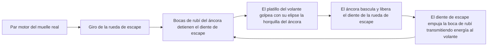
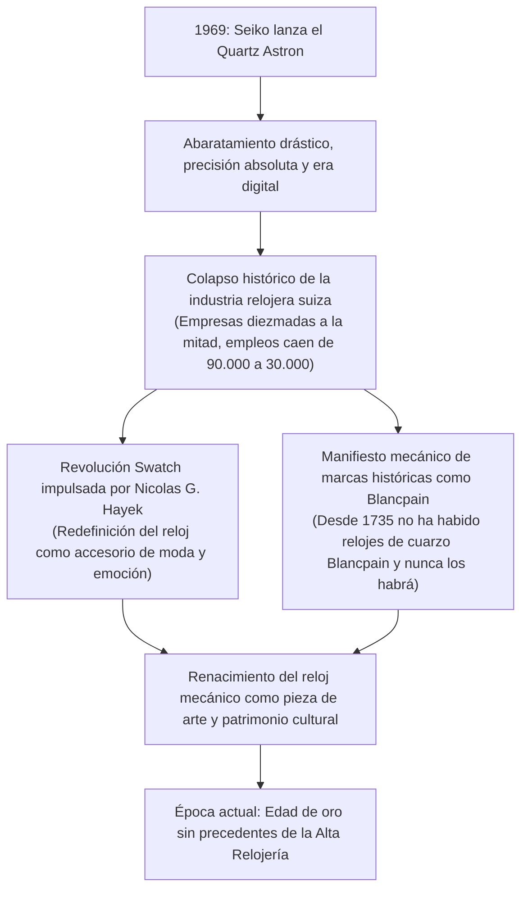
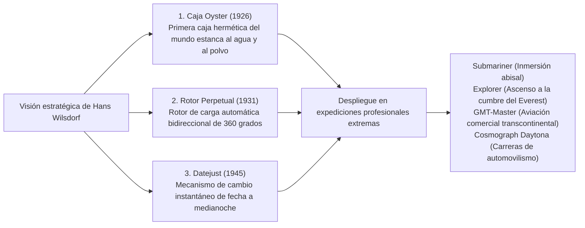

## Introducción: El reloj mecánico como microcosmos del tiempo

En el interior de una caja metálica de apenas 40 milímetros de diámetro y unos pocos milímetros de grosor, cientos de engranajes microscópicos, palancas, muelles y rubíes sintéticos interactúan con milimétrica precisión para medir el transcurso del tiempo sin perder un solo instante. Este es el reloj mecánico. Entre todos los hitos de la ingeniería de precisión creados por la humanidad, se erige como el microcosmos más compacto, estéticamente sublime y profundamente filosófico.

En una época dominada por el cuarzo y los relojes inteligentes, donde la hora se calcula digitalmente mediante osciladores de cristal que vibran decenas de miles de veces por segundo o se sincronizan con relojes atómicos: ¿por qué un reloj accionado únicamente por la energía elástica almacenada en un muelle real sigue fascinando a personas de todo el planeta y alcanza cotizaciones millonarias comparables a las más célebres obras de arte?

La razón es que un reloj mecánico nunca ha sido un mero instrumento de medida. Es **«la cristalización de quinientos años de pensamiento científico de la humanidad, desafiando incansablemente los límites de la mecánica newtoniana, la gravedad, la fricción y la dilatación térmica.»** En él convergen la intuición física de genios de la talla de Abraham-Louis Breguet, la inmutable tradición del acabado artesanal cultivada en el macizo del Jura suizo y el orgullo de la integración vertical absoluta: la *manufacture d'horlogerie*.

Este tratado analiza exhaustivamente el sistema integral de la horología: desde las raíces sociorreligiosas de la industria suiza hasta la cinemática de los calibres mecánicos, la microgeometría de las grandes complicaciones (tourbillon, calendario perpetuo, repetición de minutos), la filosofía de las manufacturas de élite, la física híbrida del Spring Drive de Grand Seiko y el renacimiento cultural nacido tras el colapso de la crisis del cuarzo.

```
[Arquitectura jerárquica del reloj mecánico]

┌─────────────────┬───────────────────────────────┬───────────────────────────────┐
│ Unidad funcional│ Componentes y mecanismos      │ Función física                │
│                 │ esenciales                    │ y leyes rectoras              │
├─────────────────┼───────────────────────────────┼───────────────────────────────┤
│ 1. Fuente de    │ Muelle real, Barrilete        │ Almacena la energía elástica  │
│    energía      │ (Cuerda manual / Masa oscilante│ del muelle enrollado; libera  │
│                 │ de carga automática)          │ un par motor continuo         │
├─────────────────┼───────────────────────────────┼───────────────────────────────┤
│ 2. Tren de      │ Rueda de centro, Rueda media, │ Multiplica la velocidad       │
│    rodaje       │ Rueda de segundos, Piñones    │ angular mediante relaciones   │
│                 │                               │ de engranaje desmultiplicando │
├─────────────────┼───────────────────────────────┼───────────────────────────────┤
│ 3. Escape       │ Rueda de escape, Áncora,      │ Detiene periódicamente el tren│
│                 │ Bocas de rubí (Escape de      │ de engranajes y suministra    │
│                 │ áncora suizo)                 │ impulsos al órgano regulador  │
├─────────────────┼───────────────────────────────┼───────────────────────────────┤
│ 4. Órgano       │ Volante, Espiral              │ Crea una base de tiempo       │
│    regulador    │ (Virola, Pitón, Raqueta /     │ periódica mediante movimiento │
│                 │ Tornillos de inercia)         │ armónico simple (isocronismo) │
├─────────────────┼───────────────────────────────┼───────────────────────────────┤
│ 5. Indicación   │ Rueda de minutería, Cañón de  │ Desmultiplica la rotación     │
│                 │ minutos, Rueda de horas,      │ regulada para transformarla en│
│                 │ Agujas, Esfera                │ horas, minutos y segundos     │
└─────────────────┴───────────────────────────────┴───────────────────────────────┘
```

---

## 1. Historia de la industria relojera: De la migración hugonote al milagro del Valle de Joux

### 1.1 La Reforma y la génesis de la relojería suiza
Aunque los orígenes de la relojería mecánica se remontan a los relojes monumentales de monasterios y campanarios urbanos de la Europa de los siglos XIII y XIV, su radical miniaturización en relojes de bolsillo y de pulsera —así como la consagración de Suiza como capital relojera indiscutible— fue el fruto de drásticas convulsiones religiosas.

En 1541, el reformador teológico Juan Calvino instauró en Ginebra un régimen puritano y austero. Bajo sus severas leyes suntuarias, el uso de joyas, cadenas de oro y ornamentos suntuosos quedó terminantemente prohibido como vanidad pecaminosa. De la noche a la mañana, los prestigiosos orfebres, esmaltadores y cinceladores ginebrinos quedaron sumidos en la ruina.

Para evitar la inanición comercial, los artesanos descubrieron una crucial excepción teológica: los relojes portátiles no se consideraban adornos suntuarios, sino «instrumentos útiles» indispensables para la observancia moral del tiempo. Al fusionar la excelencia del trabajo del oro con la microingeniería mecánica, Ginebra se metamorfoseó con celeridad en la capital indiscutible de la relojería de precisión.

El impulso geopolítico decisivo sobrevino en 1685, cuando el rey Luis XIV de Francia promulgó la revocación del Edicto de Nantes. El reinicio de la persecución inquisitorial contra los protestantes (hugonotes) forzó un éxodo masivo. Decenas de miles de relojeros franceses, matriceros, matemáticos y astrónomos huyeron a través de la frontera hacia Ginebra, aportando secretos metalúrgicos esenciales, patentes pioneras y métodos fabriles de avanzada.

### 1.2 La cordillera del Jura, el «Valle de los Relojes» (Vallée de Joux) y el établissage
El florecimiento artesanal de Ginebra no tardó en expandirse hacia las gargantas abruptas y aisladas del macizo del Jura: el Vallée de Joux, Le Locle y La Chaux-de-Fonds.

En estas altiplanicies, el invierno aislaba a las aldeas bajo mantos de nieve durante casi seis meses. Los campesinos locales aprovecharon esta tregua agrícola para acondicionar sus desvanes con ventanales orientados a la luz cenital, estableciendo una virtuosa microindustria doméstica. Familias enteras labraban pacientemente a mano tornillos microscópicos, piñones, áncoras y espirales.

Al llegar el deshielo primaveral, los comerciantes mayoristas ginebrinos (*établisseurs*) recorrían las granjas serranas adquiriendo las piezas para ensamblarlas, afinarlas y encajarlas en los talleres urbanos. Este modelo de división horizontal del trabajo, denominado **établissage**, otorgó a la relojería suiza un rendimiento de costes, una precisión y una flexibilidad productiva que terminarían aniquilando a los rígidos gremios corporativos de Francia e Inglaterra.

---

## 2. Mecánica del reloj mecánico: La física del microcosmos

### 2.1 El corazón del regulador: Volante, espiral y el «isocronismo»
El principio físico supremo que gobierna la precisión de un reloj mecánico es el **isocronismo**, formulado originariamente por Galileo Galilei al estudiar el péndulo.
El isocronismo postula que el período de oscilación permanece invariable con independencia de su amplitud angular. Al depender el péndulo de la fuerza gravitatoria externa y resultar inviable para dispositivos portátiles, el reloj adopta un oscilador armónico torsional: el binomio formado por la rueda del **volante** y el resorte enrollado de la **espiral**.

El período teórico de oscilación $T$ de un conjunto volante-espiral se rige por la clásica ecuación dinámica:

$$T = 2\pi \sqrt{\frac{I}{C}}$$

Donde $I$ representa el momento de inercia del volante y $C$ simboliza la rigidez torsional (par de restitución elástica) de la espiral.

La trascendencia fundamental de esta relación matemática reside en que **el período $T$ es independiente de la amplitud**. Ya se encuentre el muelle real con su par máximo de cuerda o próximo al agotamiento de su reserva, el volante recorre sus oscilaciones en un tiempo rigurosamente constante. En esta invariante física se cimienta la capacidad de un calibre para parcelar el tiempo de manera unívoca.

```
[Frecuencias de oscilación y precisión cronométrica]

- 5 alternancias por segundo (18.000 a/h / 2,5 Hz):
  El volante oscila 5 veces por segundo (18.000 alternancias por hora). Frecuencia canónica de los relojes de bolsillo históricos. Sonido pausado y señorial. Desgaste mínimo y extraordinaria durabilidad de los componentes.

- 6 alternancias por segundo (21.600 a/h / 3,0 Hz):
  Estándar predominante en los calibres manuales clásicos del siglo XX (p. ej., Patek Philippe Calibre 215 PS).

- 8 alternancias por segundo (28.800 a/h / 4,0 Hz):
  El patrón de oro universal de la relojería de lujo actual (p. ej., Rolex 3135/3235, ETA 2824-2). Brinda el equilibrio óptimo entre resistencia a las sacudidas del brazo, estabilidad y preservación de los lubricantes.

- 10 alternancias por segundo (36.000 a/h / 5,0 Hz):
  Arquitectura de «Alta Frecuencia» (High-Beat). Oscila 10 veces por segundo y mide fracciones de 1/10 de segundo. Encarnada en el mítico Zenith El Primero y el Grand Seiko 9S85. Magnífica resistencia a las turbulencias dinámicas, exigiendo lubricantes avanzados y metalurgia de élite.
```

### 2.2 Ciclo cinemático del escape de áncora suizo
Sin un aporte continuo de energía externa, las oscilaciones del volante terminarían extinguiéndose por la resistencia del aire y el rozamiento mecánico. El conjunto micromecánico encargado de transformar la rotación continua del rodaje en impulsos motrices discretos mientras regula la marcha es el **escape**.



El escape de áncora suizo completa esta secuencia —reposo, desbloqueo e impulsión— entre cinco y diez veces por segundo con una exactitud de microsegundos. En un solo día (86.400 segundos), afronta más de 700.000 impactos entre metales y gemas; en un año, más de 250 millones de ciclos. Que estos minúsculos órganos soporten semejante régimen durante décadas sin quebrarse evidencia la maestría de la tribología moderna.

### 2.3 Raqueta reguladora vs. Volante libre de inercia variable
El afinamiento de la marcha diaria de un calibre se sustenta en dos filosofías conceptuales opuestas:

1. **Ajuste mediante raqueta (Regulator Index)**:
   La espira exterior pasa entre dos pasadores solidarios a una palanca móvil llamada raqueta. Al desplazar la raqueta, se prolonga o acorta la «longitud activa» de la espiral, modificando su rigidez $C$ y alterando el período $T$. Aunque su reglaje resulta accesible, los golpes bruscos pueden desajustarla y la fricción parásita de la espiral oscilante con los pasadores introduce desviaciones sutiles en el isocronismo.
2. **Volante libre de inercia variable (Free-Sprung Balance)**:
   La cima indiscutible de la alta relojería, representada por el volante Gyromax de Patek Philippe o las tuercas Microstella de Rolex. La raqueta se suprime de raíz y la espiral queda anclada a una longitud inmutable. La regulación se efectúa **girando masas excéntricas o tornillos periféricos en la seroja del volante, alterando directamente su momento de inercia $I$**. Esta arquitectura proporciona una resistencia asombrosa ante impactos y una estabilidad cronométrica excepcional a largo plazo, demandando la maestría de los más diestros maestros afinadores.

---

## 3. Anatomía de ingeniería de las tres grandes complicaciones

Toda función que trascienda la indicación elemental de las horas, los minutos y los segundos recibe la denominación de «complicación». En la cúspide se sitúan las «Tres Grandes Complicaciones», cuyo dominio simultáneo constituye el reconocimiento supremo de la maestría relojera.

```
[Clasificación y retos de ingeniería de las tres grandes complicaciones]

┌─────────────────┬───────────────────────────────┬───────────────────────────────┐
│ Complicación    │ Problema físico y mecánico    │ Solución de ingeniería        │
│                 │ a subsanar                    │ micromecánica                 │
├─────────────────┼───────────────────────────────┼───────────────────────────────┤
│ Tourbillon      │ Desviación de marcha vertical │ Aloja el escape y el volante  │
│                 │ por la gravedad terrestre     │ en una jaula que gira 360°    │
│                 │ sobre el centro de gravedad   │ en exactamente 60 segundos    │
├─────────────────┼───────────────────────────────┼───────────────────────────────┤
│ Calendario      │ Variabilidad de meses         │ Rueda de programación de 48   │
│ perpetuo        │ (30, 31, 28 días) y bisiestos │ meses con cortes micrométricos│
│                 │ cuadrienales (29 días en feb) │ de profundidad diferenciada   │
├─────────────────┼───────────────────────────────┼───────────────────────────────┤
│ Repetición de   │ Traducción acústica de la hora│ Rastrillos palpan levas en    │
│ minutos         │ a demanda en plena oscuridad  │ caracol; martillos percuten   │
│                 │ sin energía exterior          │ gongs de acero templado       │
└─────────────────┴───────────────────────────────┴───────────────────────────────┘
```

### 3.1 Tourbillon: Domando la gravedad en una jaula giratoria
Patentado en 1801 por el célebre relojero Abraham-Louis Breguet, el tourbillon (término francés para «torbellino») encarna la cumbre del virtuosismo cinemático.

Los relojes de bolsillo tradicionales permanecían alojados de forma casi perenne en posición vertical en el chaleco. En esta posición, la aceleración gravitatoria deformaba asimétricamente la espiral hacia abajo, desplazando su centro de gravedad y originando pronunciados errores de posición.
Breguet concibió una solución genial: si la fuerza gravitatoria no puede neutralizarse, debe hacerse girar el propio conjunto de regulación en el espacio.

Breguet ensambló el escape, el áncora, el volante y la espiral en el interior de una jaula ultraligera. Esta jaula completa **un giro de 360 grados exactos en un minuto**. De este modo, los adelantos acumulados en una posición se cancelan con los retrasos de la posición contraria 180 grados después. Montar decenas de componentes de acero y titanio con un peso total que apenas roza los 0,2 a 0,3 gramos, asegurando una rotación carente de rozamiento, sigue siendo coto vedado para la inmensa mayoría de las marcas.

### 3.2 Calendario perpetuo: El antepasado de la computación mecánica
Los almanaques mecánicos estándar avanzan monótonamente hasta el día 31 en cada ciclo, exigiendo una corrección manual al finalizar febrero, abril, junio, septiembre y noviembre.

El calendario perpetuo, por el contrario, opera como una auténtica computadora mecánica analógica. A través de memorias cinemáticas talladas en engranajes, **discrimina automáticamente los meses de 30 y 31 días, los meses de febrero ordinarios de 28 días y los bisiestos de 29 días**, sin precisar ajuste manual hasta el año secular 2100.

El corazón del mecanismo es la **rueda de 48 meses (rueda de ciclo bisiesto)**. En su periferia exhibe 48 sectores que cubren los cuatro años de un ciclo completo, labrados con ranuras de profundidad graduada:
- Meses de 31 días: Hendiduras más superficiales
- Meses de 30 días: Hendiduras de profundidad media
- Febrero ordinario (28 días): Hendidura más profunda
- Febrero bisiesto (29 días): Hendidura intermedia calibrada
Un palpador basculante rastrea constantemente estas muescas. En la medianoche del último día del mes, el palpador acciona el salto instantáneo del disco de fecha con el número exacto de posiciones pertinentes.

### 3.3 Repetición de minutos: El cenit de la física acústica
Antes de la iluminación eléctrica, consultar la hora en la oscuridad exigía recurrir a la acústica. Al accionar una corredera ubicada en la carrura, la repetición de minutos entona una secuencia sonora melodiosa:

- **Tono grave (Horas)**: Golpe profundo sobre el gong bajo, de 1 a 12 veces.
- **Doble tono agudo-grave (Cuartos)**: Secuencia bimembre («Ding-Dong»), de 1 a 3 veces (para 15, 30 y 45 minutos).
- **Tono agudo (Minutos)**: Golpe cristalino sobre el gong alto, de 1 a 14 veces para los minutos restantes.
*(Por ejemplo, a las 7:42: 7 golpes graves + 2 dobles toques + 12 golpes agudos).*

Rodeando el calibre se hallan dos resortes de hilo de acero templado llamados timbres o gongs, afinados a mano mediante limado y golpeados por diminutos martillos de acero pulido. Al armar la corredera, se tensa un muelle motor auxiliar y caen rastrillos sobre levas escalonadas (caracoles). Para mantener una cadencia rítmica imperturbable, un volante de inercia o freno aerodinámico gira a gran velocidad de manera inaudible. La densidad, elasticidad y pureza de las aleaciones de la caja (oro rosa, titanio de grado 5 o platino) se calculan milimétricamente para proyectar las ondas armónicas con absoluta nitidez.

---

## 4. Las manufacturas supremas del mundo y la filosofía de las casas legendarias

En la alta relojería impera una división insoslayable entre los ensambladores (*établisseurs*), que compran movimientos a terceros, y las auténticas **manufacturas**, que diseñan, producen, decoran, ensamblan y afinan íntegramente sus propios calibres.

```
[Manufacturas ilustres y sus máximos logros técnicos]

┌─────────────────┬───────────┬───────────────────────────────┐
│ Manufactura     │ Fundación │ Filosofía, iconos mundiales   │
│                 │           │ y señas de identidad          │
├─────────────────┼───────────┼───────────────────────────────┤
│ Patek Philippe  │ 1839      │ Cúspide de la Santísima       │
│                 │ Suiza     │ Trinidad; Sello Patek Philippe;│
│                 │           │ Calatrava, Nautilus.          │
├─────────────────┼───────────┼───────────────────────────────┤
│ Audemars Piguet │ 1875      │ Virtuosos de las complicaciones│
│                 │ Suiza     │ creadores del Royal Oak       │
│                 │           │ en 1972 (Gérald Genta).       │
├─────────────────┼───────────┼───────────────────────────────┤
│ Vacheron        │ 1755      │ La manufactura ininterrumpida │
│ Constantin      │ Suiza     │ más antigua; Sello de Ginebra;│
│                 │           │ Patrimony, Overseas.          │
├─────────────────┼───────────┼───────────────────────────────┤
│ A. Lange &      │ 1845      │ Cenit de la precisión sajona; │
│ Söhne           │ Alemania  │ platina de alpaca, chatones de│
│                 │           │ oro, doble ensamblaje.        │
├─────────────────┼───────────┼───────────────────────────────┤
│ Rolex           │ 1905      │ Soberano del lujo funcional;  │
│                 │ Suiza     │ Caja Oyster, rotor Perpetual y│
│                 │           │ metalurgia de fundición propia│
├─────────────────┼───────────┼───────────────────────────────┤
│ Omega           │ 1848      │ Speedmaster Moonwatch; Master │
│                 │ Suiza     │ Chronometer; pionero de la    │
│                 │           │ revolución del escape Co-Axial│
├─────────────────┼───────────┼───────────────────────────────┤
│ Grand Seiko     │ 1960      │ Microingeniería japonesa;     │
│                 │ Japón     │ tecnología híbrida exclusiva  │
│                 │           │ Spring Drive (Tri-synchro).   │
└─────────────────┴───────────┴───────────────────────────────┘
```

### 4.1 Patek Philippe: El monarca absoluto de la relojería
Fundada en Ginebra en 1839, Patek Philippe ha servido a la reina Victoria, Albert Einstein y Piotr Chaikovski. Es el referente indiscutible de la excelencia relojera clásica.
Desde la perfección áurea de la Calatrava hasta la elegancia deportiva de la Nautilus, la maison encarna la nobleza atemporal.
En 2009, instauró su propio estándar de calidad, el Sello Patek Philippe, que impone una tolerancia de marcha de −3 a +2 segundos por día en relojes completamente encajados y asegura el mantenimiento y restauración de por vida para cada guardatiempo fabricado desde 1839. Su emblemático lema —«Nunca se es del todo dueño de un Patek Philippe. Simplemente se cuida para la siguiente generación»— compendia su trascendencia cultural.

### 4.2 A. Lange & Söhne: El renacimiento de la ingeniería sajona de precisión
En Glashütte, Sajonia, Ferdinand Adolph Lange cimentó en 1845 la alta relojería alemana. Tras sobrevivir a la devastación bélica y a décadas de colectivización bajo el telón de acero, Walter Lange y Günter Blümlein lideraron en 1990 su memorable resurrección.

Los calibres de Lange exhiben una estética de ingeniería inconfundible:
- **Platina de tres cuartos en alpaca alemana natural**: Aleación de cobre, níquel y cinc que confiere una rigidez insuperable al tren de rodaje y desarrolla con el paso de los años una cálida pátina dorada.
- **Chatones de oro atornillados**: Rubíes alojados en engastes de oro de 18 quilates, sujetos con tornillos azulados al fuego a 300 °C.
- **Puente del volante grabado a mano**: Cada pieza es decorada a pulso por un maestro artesano con filigranas florales, haciendo de cada calibre una creación única.
- **Doble ensamblaje**: Cada movimiento se ensambla y regula por completo, para luego desmontarse íntegramente, lavarse, decorarse y volverse a montar definitivamente: testimonio de un perfeccionismo riguroso.

### 4.3 Grand Seiko y la física híbrida del «Spring Drive»
Nacida en 1960 de la mano de Suwa y Daini Seikosha con el propósito de desbancar a los cronómetros suizos, Grand Seiko alcanzó en 1999 una proeza sin precedentes: el **Spring Drive**, gestado tras más de dos décadas de investigación liderada por el ingeniero Yoshikazu Akahane.

```
[Dinámica cinemática del regulador Tri-synchro Spring Drive]

[Fuente motriz mecánica: Muelle real]
- Libre por completo de baterías químicas o motores eléctricos.
  Toda la energía emana de la relajación elástica del resorte.
  ↓
[Multiplicación de giro por el tren de rodaje]
  ↓
[Giro de la rueda de deslizamiento (Rotor magnético): 8 vueltas/segundo]
- Al cortar las bobinas del estator genera una corriente microscópica
  en el rango del microvatio.
  ↓
[Activación del circuito integrado y del oscilador de cuarzo]
- La corriente generada alimenta un circuito integrado de consumo
  ultrabajo y un cristal de cuarzo que vibra a 32.768 Hz.
  ↓
[Freno electromagnético regulador]
- El circuito compara cientos de veces por segundo la velocidad del rotor
  frente a la oscilación de referencia del cuarzo.
- Si el rotor gira con exceso de velocidad, un freno de corrientes de Foucault
  sin rozamiento físico aplica resistencia electromagnética, fijándolo a 8 rev/s.
```

A diferencia de las agujas mecánicas habituales que avanzan a saltos diminutos o los relojes de cuarzo que brincan cada segundo, la manecilla segundera del Spring Drive surca la esfera en un desplazamiento continuo, mudo e impecable: el **Glide Motion**. Al hermanar la autonomía eterna del resorte mecánico con la exactitud suprema del cuarzo (±15 segundos mensuales), Grand Seiko formuló una de las mayores revoluciones técnicas de la historia contemporánea.

---

## 5. La crisis del cuarzo y la filosofía económica del renacimiento mecánico

El 25 de diciembre de 1969, Seiko comercializó el Quartz Astron 35SQ, el primer reloj de pulsera de cuarzo del mundo. Con una precisión asombrosa de ±0,2 segundos diarios (±5 segundos al mes), superó con creces al mejor de los calibres mecánicos, provocando una disrupción estructural denominada la **Crisis del Cuarzo**.



El tejido productivo suizo sufrió un golpe devastador: en menos de una década, desapareció más del 50 % de las marcas y los empleos cayeron de 90.000 a menos de 30.000 artífices.
Sin embargo, este cataclismo forzó una depuración filosófica sobre la esencia del guardatiempo mecánico.
Si el propósito exclusivo de un reloj fuera dar la hora con exactitud, un circuito digital barato o un teléfono inteligente resultan imbatibles. No obstante, en la muñeca del ser humano late algo infinitamente superior:
Late la calidez de un sistema gobernado por la mecánica clásica, el esplendor de puentes biselados pacientemente a mano bajo la lupa y la nobleza de un objeto imperecedero transferible entre generaciones.

Con el impulso de estrategas como Nicolas G. Hayek y Jean-Claude Biver, el reloj mecánico se despojó de su etiqueta utilitaria para elevarse a la categoría de **pieza de arte tangible y emblema del patrimonio humanista**. El fervor actual por la alta relojería mecánica representa una apasionada afirmación de la materia y la destreza humana en plena era de la digitalización efímera.

---

## 3.4 Cinemática del cronógrafo: La ingeniería de precisión del cronómetro

Entre las complicaciones, el cronógrafo —mecanismo diseñado para registrar lapsos de tiempo a demanda— se ha perfeccionado en estrecha simbiosis con el automovilismo, la aeronáutica y la ciencia. El tacto de pulsación y la exactitud operativa de un cronógrafo dimanan de la interacción armónica entre su **sistema de mando** y su **mecanismo de embrague**.

```
[Sistemas de mando y acoplamiento en cronógrafos modernos]

┌─────────────────┬───────────────────────────────┬───────────────────────────────┐
│ Área funcional  │ Sistema constructivo          │ Características de ingeniería │
│                 │                               │ y comportamiento dinámico     │
├─────────────────┼───────────────────────────────┼───────────────────────────────┤
│ Sistema de      │ 1. Rueda de pilares           │ Engranaje cilíndrico de acero │
│ conmutación     │    (Column Wheel)             │ con columnas. Pulsación sedosa│
│                 │                               │ y suave. Emblema de élite.    │
├─────────────────┼───────────────────────────────┼───────────────────────────────┤
│                 │ 2. Leva / Lanzadera           │ Placa plana mecanizada o      │
│                 │    (Cam-Actuated)             │ estampada. Robusta, apta para │
│                 │                               │ gran serie. Pulsación recia.  │
├─────────────────┼───────────────────────────────┼───────────────────────────────┤
│ Transmisión del │ 1. Embrague horizontal        │ Rueda intermedia basculante   │
│ par motor       │    (lateral)                  │ que engrana de lado. Visión   │
│                 │                               │ mecánica de enorme encanto.   │
├─────────────────┼───────────────────────────────┼───────────────────────────────┤
│                 │ 2. Embrague vertical          │ Dos discos enfrentados unidos │
│                 │    (Vertical Clutch)          │ por presión axial plana.      │
│                 │                               │ Cero sacudida de la aguja.    │
└─────────────────┴───────────────────────────────┴───────────────────────────────┘
```

El embrague horizontal clásico padece un inconveniente cinemático insoslayable: al presionar el pulsador de inicio, los dientes en giro de la rueda intermedia penetran lateralmente en la rueda trotadora detenida. Si coinciden punta contra punta, la trotadora da un sobresalto visual (*aguja saltante*).
En contrapartida, los cronógrafos contemporáneos de élite (como los calibres Rolex 4130/4131, Omega 9300 o Breitling 01) incorporan un **embrague vertical**. Dos discos coaxiales se acoplan por adherencia superficial plana, anulando cualquier temblor en el arranque del cronógrafo y permitiendo su funcionamiento continuo sin degradar la amplitud del volante.

### Flyback y Rattrapante (Fraccionamiento de segundos)
- **Flyback (Retorno al vuelo)**: Permite detener, devolver a cero y reiniciar una medición de inmediato mediante una única pulsación del botón de puesta a cero, ideado originalmente para la navegación en cazas de combate.
- **Rattrapante (Split-Seconds)**: Incorpora dos agujas trotadoras superpuestas. Al oprimir un tercer pulsador, la aguja superior se inmoviliza para registrar un tiempo intermedio mientras la aguja inferior continúa su curso. Una segunda pulsación hace que la aguja detenida alcance a la trotadora activa al instante.

---

## 2.4 La primera revolución del escape en 250 años: Co-Axial y ciencia de materiales de silicio

Habiendo reinado de forma indiscutida el escape de áncora suizo durante más de dos siglos, los albores del siglo XXI alumbraron revoluciones destinadas a neutralizar los dos enemigos históricos de la relojería: el rozamiento y el magnetismo.

### 1. George Daniels y el escape Co-Axial
Ideado en la década de 1970 por el insigne maestro independiente británico George Daniels e implantado comercialmente por Omega en 1999, el escape Co-Axial constituyó el primer escape inédito con viabilidad industrial en dos siglos y medio.

En el áncora suiza ordinaria, las bocas de rubí resbalan contra los dientes del escape mediante fricción por deslizamiento, haciendo imprescindible el aceite lubricante. Al envejecer y secarse este, la precisión decae indefectiblemente.
El escape Co-Axial introduce una rueda de escape doble y un áncora de tres paletas que transmite los impulsos **radialmente (contacto tangencial por rodadura)** sin deslizamiento. Al neutralizar prácticamente el rozamiento de arrastre, se reduce al mínimo el uso de lubricante, ampliando los intervalos de revisión de 3–5 años a 8–10 años con una estabilidad cronométrica excepcional.

### 2. La revolución tecnológica del silicio monocristalino
Pionera gracias a una alianza investigadora entre Patek Philippe, Rolex, Omega y el CSEM de Neuchâtel, la adopción del silicio monocristalino mediante microfabricación DRIE (grabado iónico reactivo profundo) transformó la cinética de los calibres:
- **Inmunidad magnética absoluta**: Al ser un metaloide libre de hierro, el silicio es enteramente refractario a los campos electromagnéticos cotidianos.
- **Isocronismo termocompensado**: Capas superficiales de óxido de silicio (p. ej., Silinvar y Spiromax de Patek Philippe) neutralizan las alteraciones térmicas de su coeficiente de elasticidad.
- **Inercia mínima y suavidad microscópica**: Densidad tres veces inferior al acero y un pulido molecular que incrementa la eficiencia en la transmisión energética.

---

## 4.4 Rolex: La hegemonía tecnológica del reloj de lujo utilitario

Fundada en 1905 por Hans Wilsdorf, Rolex reconvirtió el frágil reloj de pulsera de salón en un instrumento inexpugnable preparado para dominar los hábitats más hostiles del planeta.



### Acero Oystersteel (familia 904L) y metalurgia de fundición propia
A diferencia de la mayoría de competidores, que recurren al acero convencional 316L, Rolex moldea sus relojes de acero exclusivamente en **Oystersteel, un superacero de la estirpe 904L** habitualmente restringido al campo químico y aeroespacial.
Su alto tenor en cromo, molibdeno, níquel y cobre le otorga una inmunidad insólita a la corrosión por picaduras marinas y exudaciones ácidas, exhibiendo tras el pulido un resplandor blanquecino comparable al platino. Asimismo, la firma posee fundición propia de metales preciosos para formular patentes como el oro Everose, que no se decolora con el cloro.

---

## 5.2 El acabado relojero (finishing) y la estética de la alta artesanía decorativa

Más de la mitad de la cotización de una pieza de alta relojería emana de los acabados ornamentales manuales (*bienfacture*) que visten su movimiento. Lejos de constituir un mero adorno visual, el acabado elimina microrebabas de corte para que no interfieran en el rodaje y sella las superficies contra la corrosión ambiental.

```
[Técnicas tradicionales de acabado en alta relojería]

1. Anglage (Biselado):
   Las aristas vivas a 90 grados de puentes y pletinas son rebajadas y pulidas
   a mano con limas, madera de genciana y pasta de diamante, creando chaflanes
   homogéneos a 45 grados que reflejan la luz con gran dinamismo.

2. Côtes de Genève (Franjas de Ginebra):
   Estrías paralelas onduladas realizadas mediante herramientas rotativas
   con abrasivo, originando tornasoles tornasolados según el ángulo de mira.

3. Perlage (Perlado / Graneado circular):
   Motivo de círculos superpuestos sobre superficies interiores como la pletina
   base, reteniendo el polvo diminuto y estabilizando las películas de aceite.

4. Poli Noir (Pulido negro / Pulido espejo):
   El zénit del acabado. Los elementos de acero (cabezas de tornillos, jaulas
   de tourbillon) se frotan a mano sobre placas de cinc con pasta diamantina
   hasta lograr una planitud molecular. Visto bajo un ángulo concreto, el metal
   refleja toda la luz y adquiere un aspecto negro absoluto.
```

El **Sello de Ginebra (Poinçon de Genève)** representa la distinción oficial más insigne del cantón ginebrino. Se otorga exclusivamente a calibres que satisfacen doce condiciones técnicas rigurosas que abarcan aristas biseladas, tornillos pulidos y dientes contorneados.

---

## 4.5 El desafío de los relojeros independientes (AHCI) y las microesculturas contemporáneas

Frente a la hegemonía de los macroconglomerados del lujo (Richemont, Swatch Group, LVMH), la **Académie Horlogère des Créateurs Indépendants (AHCI)** simboliza el bastión de la creación libre, donde maestros artesanos conciben obras maestras sin ataduras comerciales.

```
[Figuras independientes de renombre contemporáneo]

1. Philippe Dufour:
   - Trabaja en solitario en su taller de Le Sentier, sin ayudantes ni maquinaria CNC.
   - «Simplicity»: Un tres agujas cuyos anchos y sensuales chaflanes pulidos
     son reconocidos como el pináculo del anglage en la historia de la humanidad.
   - «Duality»: Primer reloj de pulsera con dos volantes acoplados mediante un
     diferencial para promediar mecánicamente los errores posicionales.

2. François-Paul Journe (F.P. Journe):
   - Fiel al lema latino «Invenit et Fecit» (Inventado y hecho).
   - «Chronomètre à Résonance»: Dos volantes contiguos sincronizan sus frecuencias
     de forma autónoma mediante resonancia acústica por aire y pletina.
   - Mecanizado de calibres íntegramente forjados en oro rosa macizo de 18 quilates.

3. Richard Mille:
   - Redefine el guardatiempo bajo la premisa de «máquina de carreras en la muñeca».
   - Aplica compuestos aeronáuticos: Carbon TPT, titanio grado 5 y cajas de zafiro.
   - Diseña tourbillons que toleran deceleraciones de 5.000 a más de 12.000 G,
     usados por Rafael Nadal en torneos de Grand Slam.
```

---

## 2.5 La batalla contra el enemigo jurado, el magnetismo: Evolución de la ingeniería antimagnética

En nuestro entorno tecnificado, los teléfonos, ordenadores portátiles, altavoces, cierres imantados y placas de inducción saturan el espacio de radiación electromagnética. Para un calibre mecánico, la **imanación** constituye la mayor amenaza para la regularidad de marcha.

Cuando una espiral de acero se imanta, sus espiras contiguas se adhieren mutuamente por atracción magnética, recortando drásticamente su longitud activa de oscilación y causando adelantos desorbitados de minutos u horas al día.

```
[Dos vertientes de la ingeniería antimagnética moderna]

1. Paradigma de blindaje (Jaula de Faraday):
   - Principio: Encapsular el movimiento dentro de una caja interior de hierro dulce.
   - Funcionamiento: Las líneas de flujo magnético se desvían a través de la alta
     permeabilidad del hierro dulce sin llegar al calibre interno sensible.
   - Iconos: IWC Ingenieur, Rolex Milgauss (protección hasta 1.000 Gauss).
   - Desventajas: Engrosa la caja y prohíbe fondos transparentes de zafiro.

2. Paradigma de materiales inmunes (Revolución atómica):
   - Principio: Fabricar espiral, áncora y escape con materiales no ferromagnéticos.
   - Iconos: Omega Master Chronometer (inmune a más de 15.000 Gauss, inalterable
     en máquinas de resonancia magnética) gracias a la espiral Si14 y titanio.
   - Ventajas: Permite calibres delgados y admirar el movimiento a través
     de cristales de zafiro transparentes.
```

---

## 5.5 Normas de certificación relojera suiza: Sello de Ginebra y pruebas de cronometría COSC

Para garantizar la exactitud cronométrica y el refinamiento decorativo, la industria helvética somete sus calibres a rigurosos certificados independientes.

```
[Principales certificados de excelencia relojera en Suiza]

1. COSC (Contrôle Officiel Suisse des Chronomètres):
   - Misión: Certificación de precisión para calibres suizos antes de su encaje.
   - Metodología: Pruebas durante 15 jornadas en 5 posiciones geométricas y a
     3 niveles térmicos (8 °C, 23 °C, 38 °C).
   - Tolerancia: Marcha media diaria comprendida entre -4 y +6 segundos (para
     calibres de más de 20 mm). Solo una selecta fracción de calibres lo ostenta.

2. Sello de Ginebra (Poinçon de Genève):
   - Misión: Reconocimiento cantonal de origen y maestría artesanal fundado en 1886.
   - Cláusula geográfica: Ensamblaje y regulación ejecutados estrictamente dentro
     del Cantón de Ginebra.
   - 12 Exigencias maestras:
     - Aristas metálicas biseladas y flancos pulidos con estrías longitudinales.
     - Ranuras y cabezas de tornillos pulidas y redondeadas en sus bordes.
     - Ruedas con dientes biselados y piñones con pivotes diamantados.
     - Rubíes con cavidades de lubricación diamantadas de forma impoluta.
   - Protocolo contemporáneo: Desde 2011, la prueba se realiza dinámicamente con
     el reloj totalmente encajado, garantizando una precisión entre -1 y +1 s/día,
     verificando hermeticidad y reserva de marcha.
```

---

## 6. Conclusión: Ceñirse el microcosmos a la muñeca

Ajustar un reloj mecánico a la muñeca y deslizar suavemente la corona entre las yemas de los dedos despierta una emoción incomparable. Se experimenta el tacto resistente del muelle al tensarse y, al acercar la caja al oído, se percibe el latido veloz y constante del volante oscilando en su interior.

En ese cuerpo metálico palpita la sabiduría destilada durante cinco centurias de horología, que arrancó con el resorte de Peter Henlein en la Núremberg renacentista. Sobreviviendo a conflagraciones, revoluciones sociales y olas cibernéticas, los maestros relojeros han consagrado sus vidas a responder un único interrogante: cómo apresar la fuga inexorable del tiempo con la máxima verdad física y la más sublime armonía estética.

Una pantalla digital nos muestra la hora con la exactitud atómica de satélites en órbita. Sin embargo, al contemplar el movimiento mecánico en nuestra muñeca —donde un muelle transmite su energía a engranajes y manecillas— nos conectamos vivamente con las leyes gravitatorias y el curso del universo.

El reloj mecánico subsiste así como la más íntima, perdurable y fascinante armadura intelectual del ser humano frente al misterio del tiempo.
