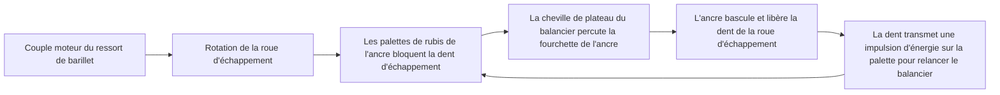
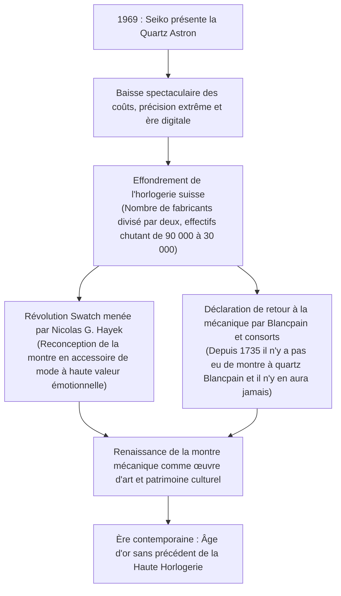
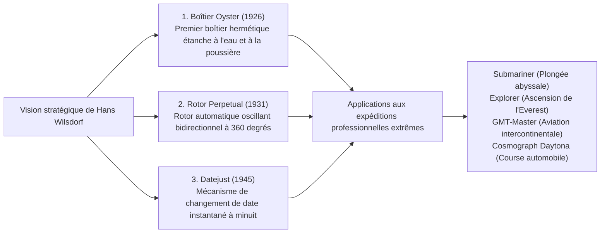

## Introduction : La montre mécanique comme microcosme du temps

Logée au sein d'un boîtier métallique d'à peine 40 millimètres de diamètre et de quelques millimètres d'épaisseur, une constellation de plusieurs centaines d'engrenages microscopiques, de leviers, de ressorts et de rubis synthétiques s'articule avec une rigueur absolue pour mesurer le temps sans jamais faillir. C'est la montre mécanique. Parmi toutes les réalisations du génie micromécanique forgées par l'esprit humain, elle demeure le plus compact, le plus fascinant et le plus philosophique des microcosmes.

À une époque dominée par le quartz et les montres connectées, où l'heure est calculée par des dizaines de milliers d'impulsions de cristaux oscillants ou synchronisée sur des horloges atomiques, pourquoi une mécanique animée exclusivement par la force élastique d'un ressort spiralé continue-t-elle de captiver les passionnés du monde entier et d'atteindre des valorisations dignes d'œuvres d'art inestimables, oscillant entre dizaines de milliers et millions d'euros ?

La réponse réside dans le fait qu'une montre mécanique n'est jamais un simple instrument de mesure. Elle incarne **« la cristallisation de cinq siècles d'intelligence humaine, défiant sans relâche les frontières de la mécanique newtonienne, de la gravité terrestre, des frottements et de la dilatation thermique. »** En elle confluent les intuitions physiques de maîtres d'exception tels qu'Abraham-Louis Breguet, l'excellence des finitions manuelles perpétuée dans le Jura suisse et la fierté de la verticalité absolue : la *manufacture d'horlogerie*.

Cette étude embrasse la totalité de l'édifice horloger : depuis les fondations religieuses et géopolitiques de l'industrie suisse jusqu'à la cinématique des calibres, la microgéométrie des grandes complications (tourbillon, quantième perpétuel, répétition minutes), la philosophie des prestigieuses maisons, la physique hybride du Spring Drive de Grand Seiko et la renaissance culturelle et économique née du séisme de la crise du quartz.

```
[Architecture hiérarchique de la montre mécanique]

┌─────────────────┬───────────────────────────────┬───────────────────────────────┐
│ Module          │ Composants & Organes          │ Fonction physique             │
│ fonctionnel     │ essentiels                    │ et lois directrices           │
├─────────────────┼───────────────────────────────┼───────────────────────────────┤
│ 1. Organe       │ Ressort de barillet, Barillet │ Accumule l'énergie potentielle│
│    moteur       │ (Remontage manuel / Rotor     │ élastique du ressort et       │
│                 │ automatique)                  │ délivre un couple continu     │
├─────────────────┼───────────────────────────────┼───────────────────────────────┤
│ 2. Rouage de    │ Roue de centre, Roue moyenne, │ Multiplie la vitesse angulaire│
│    transmission │ Roue des secondes, Pignons    │ via des rapports d'engrenage  │
│                 │                               │ précis tout en divisant couple│
├─────────────────┼───────────────────────────────┼───────────────────────────────┤
│ 3. Échappement  │ Roue d'échappement, Ancre,    │ Interrompt périodiquement le  │
│                 │ Palettes de rubis (Échappement│ rouage et transmet des impulsions│
│                 │ à ancre suisse)               │ d'énergie au régulateur       │
├─────────────────┼───────────────────────────────┼───────────────────────────────┤
│ 4. Organe       │ Balancier, Spiral             │ Génère une oscillation de     │
│    régulateur   │ (Virole, Piton, Raquette /    │ référence temporelle par      │
│                 │ Masselottes d'inertie)        │ mouvement harmonique simple   │
├─────────────────┼───────────────────────────────┼───────────────────────────────┤
│ 5. Organe       │ Minuterie, Chaussée, Roue des │ Démultiplie la rotation       │
│    d'affichage  │ heures, Aiguilles, Cadran     │ régulée pour afficher heures, │
│                 │                               │ minutes et secondes           │
└─────────────────┴───────────────────────────────┴───────────────────────────────┘
```

---

## 1. Histoire de l'industrie horlogère : De la migration huguenote au miracle de la Vallée de Joux

### 1.1 La Réforme et la genèse de l'horlogerie suisse
Si les origines de l'horlogerie mécanique remontent aux horloges monumentales des beffrois et abbayes du XIIIe et XIVe siècle en Europe, sa miniaturisation en montres de poche puis en montres-bracelets—et l'élévation de la Suisse au rang de capitale mondiale du secteur—trouve sa source dans les soubresauts dramatiques des guerres de religion.

En 1541, le réformateur Jean Calvin instaure à Genève un régime théocratique austère. Dans le cadre de ses lois somptuaires puritaines, le port de bijoux et d'ornements précieux est strictement prohibé comme péché d'orgueil. Du jour au lendemain, les orfèvres, ciseleurs et émailleurs genevois sont confrontés à une ruine totale.

Pour échapper à cette condamnation économique, les artisans exploitent une faille doctrinale déterminante : les garde-temps de poche ne sont pas considérés comme des parures futiles, mais comme des « instruments utiles » indispensables à l'éthique du travail chrétien. En unissant l'orfèvrerie d'art et le génie mécanique, Genève se convertit avec une rare célérité en métropole de l'horlogerie de précision.

Le choc géopolitique décisif survient en 1685 lors de la révocation de l'Édit de Nantes par le roi Louis XIV. La reprise des persécutions contre les protestants (huguenots) provoque un exode massif. Des dizaines de milliers d'horlogers français, d'ingénieurs d'outillage, de géomètres et d'astronomes fuient vers Genève, enrichissant les ateliers locaux de brevets cruciaux, de secrets métallurgiques et d'un savoir-faire artisanal sans égal.

### 1.2 Le massif du Jura, la « Watch Valley » (Vallée de Joux) et l'établissage
L'effervescence artisanale de Genève gagne rapidement les vallées sauvages et escarpées de l'arc jurassien : la Vallée de Joux, Le Locle et La Chaux-de-Fonds.

Durant les six mois d'un hiver rigoureux où la neige isole les plateaux, les paysans jurassiens se consacrent à la micromécanique horlogère. Équipant leurs greniers de larges baies vitrées pour capter la lumière zénithale, des familles entières usinent à la main des composants d'une infinie minutie : pignons, vis, ressorts et échappements.

Au printemps, les négociants genevois (*établisseurs*) sillonnent les hameaux pour racheter ces pièces éparses et les acheminer vers les manufactures citadines afin d'en assurer l'assemblage, le réglage fin et l'emboîtage. Ce modèle de division horizontale du travail, baptisé **établissage**, assure à la production suisse une compétitivité, une précision et une capacité de volume qui supplanteront irrémédiablement les corporations corporatistes rigides de France et d'Angleterre.

---

## 2. Mécanique de la montre mécanique : La physique du microcosme

### 2.1 Le cœur du régulateur : Balancier, spiral et isochronisme
Le principe physique fondateur qui régit l'exactitude d'une montre mécanique est l'**isochronisme**, initialement identifié sur le pendule par Galilée.
L'isochronisme stipule que la période d'une oscillation demeure strictement indépendante de son amplitude (l'angle d'oscillation). Le pendule étant tributaire de la gravité terrestre et inapte aux instruments portatifs, la montre de poche et la montre-bracelet adoptent un oscillateur harmonique rotatif : l'association d'un volant d'inertie appelé **balancier** et d'un ressort à boudin plat ultramince nommé **spiral**.

La période fondamentale d'oscillation $T$ d'un ensemble balancier-spiral est régie par l'équation dynamique classique :

$$T = 2\pi \sqrt{\frac{I}{C}}$$

Où $I$ représente le moment d'inertie du balancier et $C$ désigne le couple de rappel élastique (rigidité torsionnelle) du spiral.

La portée fondamentale de cette loi physique est que **la période $T$ ne dépend aucunement de l'amplitude de l'oscillation**. Que le ressort de barillet soit bandé au maximum (délivrant son couple crête) ou en fin de réserve de marche (couple résiduel faible), le balancier effectue son va-et-vient dans un intervalle rigoureusement constant. C'est sur ce socle dynamique immuable que repose toute la chronométrie mécanique.

```
[Fréquence d'oscillation et précision chronométrique]

- 5 alternances par seconde (18 000 alt/h / 2,5 Hz) :
  Le balancier effectue 5 alternances par seconde (18 000 par heure). Caractéristique des montres de poche anciennes et calibers historiques. Tic-tac solennel et feutré. Usure mécanique minime et exceptionnelle pérennité des rouages.

- 6 alternances par seconde (21 600 alt/h / 3,0 Hz) :
  Le standard des calibres classiques à remontage manuel du XXe siècle (ex. Patek Philippe calibre 215 PS).

- 8 alternances par seconde (28 800 alt/h / 4,0 Hz) :
  L'étalon-or universel des montres de luxe contemporaines (ex. Rolex 3135/3235, ETA 2824-2). Offre l'équilibre optimal entre résistance aux chocs du poignet, stabilité de marche et préservation des micro-lubrifiants.

- 10 alternances par seconde (36 000 alt/h / 5,0 Hz) :
  Architecture « Haute Fréquence » (High-Beat). Oscille 10 fois par seconde, autorisant la mesure au 1/10e de seconde. Magnifiée par le Zenith El Primero et le Grand Seiko 9S85. Remarquable insensibilité aux secousses, exigeant des huiles de synthèse évoluées et une métallurgie d'avant-garde.
```

### 2.2 Cycle dynamique de l'échappement à ancre suisse
Sans apport extérieur constant d'énergie, l'oscillateur balancier-spiral finirait par s'immobiliser sous l'effet des frottements de l'air et des pivots. Le dispositif mécanique qui convertit le couple moteur continu du rouage en impulsions intermittentes tout en cadençant la rotation des roues est l'**échappement**.



L'échappement à ancre suisse accomplit ce triptyque — repos, dégagement et impulsion — cinq à dix fois par seconde avec une synchronisation à la microseconde près. En une seule journée (86 400 secondes), il endure plus de 700 000 chocs métalliques ; en un an, plus de 250 millions de cycles. Sa capacité à fonctionner durant des décennies sans rupture témoigne de la perfection des sciences tribologiques appliquées.

### 2.3 Raquette traditionnelle vs. Balancier à inertie variable
L'ajustement fin de la marche journalière d'un mouvement s'articule autour de deux philosophies d'ingénierie :

1. **Système à raquette** :
   La spire terminale du spiral passe entre deux goupilles montées sur un levier mobile nommé raquette. En déplaçant la raquette, on modifie la « longueur active » du spiral, altérant ainsi sa raideur $C$ et sa période $T$. Très simple à régler, ce dispositif reste vulnérable aux chocs violents et génère de légers défauts d'isochronisme dus au contact entre le spiral oscillant et les goupilles.
2. **Balancier à inertie variable (balancier libre)** :
   Le sommet de la haute horlogerie, illustré par le balancier Gyromax de Patek Philippe ou le système Microstella de Rolex. La raquette est bannie et la longueur active du spiral est définitivement figée. Le réglage s'opère en **ajustant des masselottes fendues ou des vis d'inertie disposées sur la serge du balancier, faisant varier directement son moment d'inertie $I$**. Ce système offre une stabilité de marche exemplaire et résiste aux pires sollicitations dynamiques, au prix d'un travail de réglage réservé aux maîtres régleurs.

---

## 3. Anatomie technique des trois grandes complications

Toute fonction horlogère dépassant l'indication des heures, minutes et secondes est qualifiée de « complication ». Au sommet trônent les trois grandes complications, dont la fabrication conjointe couronne le génie d'une manufacture.

```
[Classification et défis techniques des trois grandes complications]

┌─────────────────┬───────────────────────────────┬───────────────────────────────┐
│ Complication    │ Problématique physique        │ Solution d'ingénierie         │
│                 │ et mécanique à surmonter      │ micromécanique                │
├─────────────────┼───────────────────────────────┼───────────────────────────────┤
│ Tourbillon      │ Écart de marche vertical dû à │ Cage rotative intégrant       │
│                 │ l'attraction gravitationnelle │ l'échappement et le balancier,│
│                 │ sur le centre de gravité      │ effectuant 360° en 1 minute   │
├─────────────────┼───────────────────────────────┼───────────────────────────────┤
│ Quantième       │ Variations des mois           │ Roue de programmation         │
│ perpétuel       │ (30, 31, 28 jours) et bissexte│ mécanique de 48 mois dotée    │
│                 │ quadriennal (29 jours en fév) │ d'encoches de profondeurs fixes│
├─────────────────┼───────────────────────────────┼───────────────────────────────┤
│ Répétition      │ Transposition de l'heure en   │ Limaçons palpés par des       │
│ minutes         │ sonnerie acoustique à la      │ râteaux ; marteaux frappant   │
│                 │ demande, sans source externe  │ des timbres en fil d'acier    │
└─────────────────┴───────────────────────────────┴───────────────────────────────┘
```

### 3.1 Tourbillon : Dompter la gravité dans une cage tournante
Breveté en 1801 par Abraham-Louis Breguet, le tourbillon représente le chef-d'œuvre absolu de la mécanique cinématique.

Les montres de poche demeuraient la majorité du temps en position verticale dans le gousset. Dans cette posture, la gravité terrestre s'exerce de façon constante sur le spiral, provoquant un affaissement asymétrique, une déviation du centre de gravité et de lourds écarts de marche.
Breguet formule une réponse magistrale : ne pouvant abolir l'attraction terrestre, il décide de faire tourner l'ensemble du système réglant sur lui-même.

Enfermant la roue d'échappement, l'ancre, le balancier et le spiral dans une cage ultralégère, Breguet fait pivoter cette structure de **360 degrés en exactement 60 secondes**. Les retards accumulés dans une position sont compensés point par point par des avances équivalentes lors du demi-tour suivant. Ajuster plusieurs dizaines de pièces en titane ou en acier pour un poids total inférieur à 0,3 gramme tout en garantissant une rotation sans frottement relève d'une prouesse réservée à un cercle très restreint de constructeurs.

### 3.2 Quantième perpétuel : L'ancêtre de l'ordinateur mécanique
Les mécanismes de quantième ordinaires égrainent 31 jours par cycle, requérant une correction manuelle à la fin de février, avril, juin, septembre et novembre.

Le quantième perpétuel agit comme un véritable calculateur mécanique analogique. Grâce à une mémoire matérialisée par des roues dentées, il **discrimine automatiquement les mois de 30 et 31 jours, les mois de février de 28 jours et le 29 février des années bissextiles**, sans le moindre réajustement manuel jusqu'en 2100.

L'organe maître en est la **roue de 48 mois (roue de bissexte)**. Son pourtour comporte 48 créneaux correspondant aux quatre années d'un cycle bissextil complet, chacun taillé avec une profondeur rigoureuse :
- Mois de 31 jours : Encoches les plus superficielles
- Mois de 30 jours : Encoches de profondeur moyenne
- Février ordinaire (28 jours) : Encoche la plus profonde
- Février bissextile (29 jours) : Encoche intermédiaire calibrée
Un palpeur mécanique analyse en permanence ces cotes. À minuit le dernier jour du mois, il libère le saut instantané de la roue des dates du nombre de divisions requis.

### 3.3 Répétition minutes : Le zénith de la physique acoustique
Avant l'avènement de l'électricité, lire l'heure dans l'obscurité complète imposait le recours au son. En actionnant un verrou d'armement logé sur la carrure, la répétition minutes égrène une sonnerie musicale :

- **Son grave (Heures)** : Frappé sur le timbre grave, de 1 à 12 coups.
- **Double coup aigu-grave (Quarts)** : Deux notes alternées (« Ding-Dong »), de 1 à 3 fois (pour 15, 30 et 45 minutes).
- **Son aigu (Minutes)** : Frappé sur le timbre aigu, de 1 à 14 coups pour les minutes résiduelles.
*(Exemple à 7 h 42 : 7 coups graves + 2 doubles coups + 12 coups aigus).*

Deux tiges circulaires en acier trempé appelées timbres ceignent le pourtour du calibre, percutées par de minuscules marteaux d'acier poli. Le glissement du verrou arme un ressort de barillet auxiliaire et précipite des râteaux sur des cames étagées (limaçons). Pour assurer une régularité parfaite au tempo de frappe, un régulateur à friction aérodynamique (volant d'inertie silencieux) tourne à haute vitesse. La masse volumique, le module d'élasticité et la pureté des alliages du boîtier (or rose, titane grade 5 ou platine) sont minutieusement calculés pour garantir une transmission cristalline des ondes sonores.

---

## 4. Les manufactures d'exception et la philosophie des grandes maisons

Dans l'univers horloger, une ligne de démarcation essentielle sépare les assembleurs (*établisseurs*) qui s'approvisionnent en calibres industriels des véritables **manufactures**, qui conçoivent, usinent, décorent, assemblent et règlent l'intégralité de leurs mouvements sous leur propre toit.

```
[Grandes manufactures mondiales et leurs réalisations maîtresses]

┌─────────────────┬───────────┬───────────────────────────────┐
│ Maison          │ Fondation │ Philosophie, modèles cultes   │
│                 │           │ et signatures techniques      │
├─────────────────┼───────────┼───────────────────────────────┤
│ Patek Philippe  │ 1839      │ Sommet de la Sainte Trinité ; │
│                 │ Suisse    │ Poinçon Patek Philippe ;      │
│                 │           │ Calatrava, Nautilus.          │
├─────────────────┼───────────┼───────────────────────────────┤
│ Audemars Piguet │ 1875      │ Maîtres des complications ;   │
│                 │ Suisse    │ créateurs de la Royal Oak     │
│                 │           │ en 1972 (Gérald Genta).       │
├─────────────────┼───────────┼───────────────────────────────┤
│ Vacheron        │ 1755      │ Plus ancienne manufacture sans│
│ Constantin      │ Suisse    │ interruption ; Poinçon de     │
│                 │           │ Genève ; Patrimony, Overseas. │
├─────────────────┼───────────┼───────────────────────────────┤
│ A. Lange &      │ 1845      │ Apogée saxon ; platine 3/4 en │
│ Söhne           │ Allemagne │ maillechort, chatons or vissés│
│                 │           │ et double assemblage.         │
├─────────────────┼───────────┼───────────────────────────────┤
│ Rolex           │ 1905      │ Maître absolu de la robustesse│
│                 │ Suisse    │ Boîtier Oyster, rotor Perpetual│
│                 │           │ et métallurgie exclusive.     │
├─────────────────┼───────────┼───────────────────────────────┤
│ Omega           │ 1848      │ Speedmaster Moonwatch ; Master│
│                 │ Suisse    │ Chronometer ; révolution de   │
│                 │           │ l'échappement Co-Axial.       │
├─────────────────┼───────────┼───────────────────────────────┤
│ Grand Seiko     │ 1960      │ Micro-ingénierie nippone ;    │
│                 │ Japon     │ calibre hybride Spring Drive  │
│                 │           │ à régulateur Tri-synchro.     │
└─────────────────┴───────────┴───────────────────────────────┘
```

### 4.1 Patek Philippe : Le souverain absolu de l'horlogerie
Fondée à Genève en 1839, Patek Philippe a compté parmi ses illustres détenteurs la reine Victoria, Albert Einstein et Piotr Tchaïkovski. Elle s'impose comme l'archétype de la haute horlogerie traditionnelle.
De la pureté géométrique de la Calatrava au design sportif intégré de la Nautilus, la maison incarne un idéal d'élégance intemporelle.
En 2009, la marque a instauré le Poinçon Patek Philippe, imposant un niveau de précision rigoureux de −3/+2 secondes par jour sur montre emboîtée et assurant la restauration à perpétuité de chaque pièce sortie de ses ateliers depuis 1839. Sa devise emblématique — « Jamais vous ne posséderez complètement une Patek Philippe. Vous en serez juste le gardien pour les générations futures » — en résume la dimension patrimoniale.

### 4.2 A. Lange & Söhne : La renaissance de l'ingénierie de précision saxonne
C'est à Glashütte, en Saxe, que Ferdinand Adolph Lange pose en 1845 les jalons de la haute précision allemande. Anéantie par les bombardements puis étatisée durant l'ère soviétique, la manufacture renaît spectaculairement en 1990 sous l'impulsion de Walter Lange et Günter Blümlein.

Les calibres de Lange affichent une identité technique germanique sans équivalent :
- **Platine trois-quarts en maillechort naturel** : Alliage de cuivre, nickel et zinc offrant une rigidité structurelle exceptionnelle et développant une chaleureuse patine dorée au fil des décennies.
- **Chatons en or vissés** : Paliers en rubis logés dans des bagues en or 18 carats, fixés par des vis bleuies thermiquement à 300 °C.
- **Coq gravé à la main** : Chaque pont de balancier est ciselé d'arabesques florales à main levée, conférant à chaque montre un caractère unique.
- **Double assemblage** : Chaque mouvement est monté, réglé, puis intégralement démonté, nettoyé, fini et réassemblé de novo—le summum de la rigueur artisanale.

### 4.3 Grand Seiko et la physique hybride du « Spring Drive »
Fondée en 1960 par les manufactures Daini et Suwa Seikosha pour rivaliser avec les chronomètres suisses, Grand Seiko a concrétisé en 1999 un chef-d'œuvre d'innovation : le **Spring Drive**, mis au point après plus de vingt ans de recherches menées par l'ingénieur Yoshikazu Akahane.

```
[Cinématique du régulateur Tri-synchro Spring Drive]

[Source mécanique : Ressort de barillet]
- Totalement affranchi de pile chimique ou de moteur pas à pas.
  Toute l'énergie découle de la force élastique du ressort moteur.
  ↓
[Démultiplication par le rouage]
  ↓
[Rotation de la roue de glissement (Rotor magnétique) : 8 tours/sec]
- Le passage des aimants devant les bobines génère un micro-courant
  électromagnétique de l'ordre du microwatt.
  ↓
[Alimentation du circuit intégré et de l'oscillateur à quartz]
- Le courant induit active un circuit intégré à ultra-basse consommation
  et un quartz vibrant à 32 768 Hz.
  ↓
[Freinage électromagnétique régulateur]
- Le circuit compare des centaines de fois par seconde la vitesse du rotor
  avec la fréquence de résonance absolue du quartz.
- En cas de surrégime, un frein électromagnétique sans contact à courants
  de Foucault applique une force régulatrice pour verrouiller le rotor à 8 tr/s.
```

Alors que l'aiguille des secondes d'une montre mécanique avance par saccades et que celle d'une montre à quartz saute d'un cran chaque seconde, celle du Spring Drive parcourt le cadran d'un mouvement continu, silencieux et parfaitement fluide : le **Glide Motion**. Réconciliant la longévité mécanique d'un ressort moteur avec l'exactitude du quartz (±15 secondes par mois), cette création s'impose comme une révolution d'ingénierie majeure.

---

## 5. La crise du quartz et la philosophie économique de la renaissance mécanique

Le 25 décembre 1969, Seiko dévoile la Quartz Astron 35SQ, première montre à quartz commerciale au monde. Précise à ±0,2 seconde par jour (±5 secondes par mois), elle bat à plate couture les meilleurs chronomètres mécaniques et plonge l'industrie helvétique dans une tourmente baptisée la **Crise du Quartz**.



Les ateliers suisses subissent des pertes dévastatrices : en l'espace d'une décennie, plus de la moitié des manufactures ferment leurs portes et les emplois chutent de 90 000 à moins de 30 000 horlogers.
Pourtant, cette épreuve existentielle va purifier le sens même de l'horlogerie mécanique.
Si la montre n'avait d'autre fonction que d'indiquer l'heure exacte, un module à quartz à bas coût ou un smartphone s'avèrent infiniment supérieurs. Mais un garde-temps mécanique représente tout autre chose :
Il recèle la présence vivante d'un rouage assujetti aux lois de Newton, la splendeur artisanale de ponts anglés à la main sous microscope et la noblesse d'un patrimoine transmis de génération en génération.

Sous l'impulsion de personnalités visionnaires telles que Nicolas G. Hayek et Jean-Claude Biver, la montre mécanique a opéré une métamorphose radicale : passant du rang d'objet utilitaire à celui d'**œuvre d'art émotionnelle et d'incarnation du patrimoine culturel humain**. L'engouement contemporain pour la haute horlogerie constitue une revendication d'humanisme et de matière face à l'évanescence du tout-numérique.

---

## 3.4 Cinématique du chronographe : L'ingénierie de précision du chronomètre

Parmi les complications, le chronographe — mécanisme dédié à la mesure d'intervalles de temps — s'est perfectionné au contact intime de la course automobile, de l'aviation et de la navigation. La douceur de déclenchement et la précision d'un chronographe dépendent de la symbiose entre son **organe de commande** et son **dispositif d'embrayage**.

```
[Systèmes de commande et d'embrayage du chronographe]

┌─────────────────┬───────────────────────────────┬───────────────────────────────┐
│ Fonction        │ Typologie                     │ Caractéristiques techniques   │
│                 │                               │ et comportement dynamique     │
├─────────────────┼───────────────────────────────┼───────────────────────────────┤
│ Commande de     │ 1. Roue à colonnes            │ Cylindre d'acier à piliers    │
│ commutation     │    (Column Wheel)             │ verticaux. Pression soyeuse   │
│                 │                               │ sur le poussoir. Signe d'élite│
├─────────────────┼───────────────────────────────┼───────────────────────────────┤
│                 │ 2. Commande par navette /     │ Came plane étampée. Robuste et│
│                 │    cames (Cam-Actuated)       │ optimisée pour la grande série│
│                 │                               │ Déclenchement plus ferme      │
├─────────────────┼───────────────────────────────┼───────────────────────────────┤
│ Transmission du │ 1. Embrayage horizontal       │ Roue intermédiaire oscillant  │
│ couple          │    (latéral)                  │ sur une bascule latérale.     │
│                 │                               │ Vue mécanique grandiose.      │
├─────────────────┼───────────────────────────────┼───────────────────────────────┤
│                 │ 2. Embrayage vertical         │ Deux disques de friction      │
│                 │    (Vertical Clutch)          │ plaqués axialement par ressort│
│                 │                               │ Zéro saut de l'aiguille chrono│
└─────────────────┴───────────────────────────────┴───────────────────────────────┘
```

L'embrayage horizontal traditionnel présente un inconvénient cinématique inhérent : au déclenchement, les dents en rotation de la roue intermédiaire pénètrent latéralement dans la denture de la roue centrale immobile. Si une crête rencontre une crête, l'aiguille des secondes subit un sursaut visible (*aiguille sautante*).
À l'opposé, les chronographes contemporains de référence (calibres Rolex 4130/4131, Omega 9300 ou Breitling 01) privilégient l'**embrayage vertical**. Deux disques superposés s'accouplent par adhérence axiale plane, garantissant un départ net, sans aucun soubresaut d'aiguille ni chute d'amplitude du balancier.

### Flyback et Rattrapante
- **Flyback (Retour en vol)** : Permet d'arrêter, de remettre à zéro et de relancer instantanément un chronométrage par une unique pression sur le poussoir inférieur, initialement développé pour les pilotes militaires.
- **Rattrapante (Split-Seconds)** : Superpose deux aiguilles de chronographe centrales trotteuses. Une pression sur un troisième poussoir stoppe l'aiguille supérieure pour figer un temps intermédiaire pendant que la trotteuse inférieure poursuit sa course. Une seconde impulsion fait rejoindre instantanément l'aiguille arrêtée sur celle en marche.

---

## 2.4 La première révolution de l'échappement en 250 ans : Co-Axial et science des matériaux silicium

Après plus de deux siècles de suprématie sans partage de l'échappement à ancre suisse, le tournant du XXIe siècle a vu naître des avancées radicales pour triompher des deux grands adversaires de la montre : le frottement et le magnétisme.

### 1. George Daniels et l'échappement Co-Axial
Inventé dans les années 1970 par le maître indépendant britannique George Daniels et industrialisé par Omega dès 1999, l'échappement Co-Axial constitue la première innovation architecturale viable depuis 250 ans.

Dans l'échappement à ancre suisse usuel, les palettes de rubis glissent contre les dents de la roue avec un frottement important imposant une lubrification constante par huile liquide. En vieillissant, celle-ci s'oxyde et dégrade la précision.
L'échappement Co-Axial fait appel à une roue à deux niveaux coaxiaux et à une ancre à trois palettes assurant une poussée **radiale directe (frottement de roulement pur)** sans glissement. Les pertes par frottement étant drastiquement réduites, le besoin en huile diminue substantiellement, portant les intervalles d'entretien de 3 à 5 ans à près de 8 à 10 ans.

### 2. La révolution de pointe du silicium monocristallin
Née d'un consortium de recherche associant Patek Philippe, Rolex, Omega et le CSEM à Neuchâtel, l'application du silicium par gravure ionique réactive profonde (DRIE) a révolutionné la micromécanique :
- **Amagnétisme total** : Le silicium étant un métalloïde non ferreux, il demeure insensible aux champs magnétiques des appareils électroniques courants.
- **Isochronisme thermo-compensé** : Une couche d'oxyde de silicium superficielle (ex. Silinvar et Spiromax de Patek Philippe) neutralise les variations du module d'Young en fonction de la température.
- **Faible inertie et état de surface parfait** : Densité trois fois moindre que l'acier et polissage moléculaire assurant un rendement énergétique exceptionnel.

---

## 4.4 Rolex : L'hégémonie technologique de la montre de luxe utilitaire

Fondée en 1905 par Hans Wilsdorf, Rolex a métamorphosé la montre-bracelet, la faisant passer d'une parure d'intérieur fragile à un instrument d'ingénierie imperméable capable d'affronter les conditions terrestres les plus hostiles.



### Acier Oystersteel (famille 904L) et métallurgie exclusive
Alors que l'industrie utilise traditionnellement l'acier inox 316L, Rolex emploie l'**Oystersteel, un superalliage appartenant à la famille des aciers 904L**, d'ordinaire réservé aux secteurs aérospatial et chimique.
Très riche en chrome, molybdène, nickel et cuivre, il résiste admirablement à la corrosion par piqûres sous l'agression des chlorures et de l'eau de mer, et se pare après polissage d'un éclat lumineux blanc comparable au platine. Rolex dispose en outre de sa propre fonderie d'or, créant des alliages inaltérables tels que l'or Everose.

---

## 5.2 La finition horlogère et l'esthétique des arts décoratifs de haute horlogerie

Plus de la moitié du prestige et de la valeur d'une montre de haute horlogerie provient des finitions manuelles (*bienfacture*) portées sur son mouvement. Loin d'être purement décoratives, elles ébavurent les arêtes métalliques, évitant l'émission de micro-copeaux, et préviennent l'oxydation de surface.

```
[Techniques traditionnelles de décoration en haute horlogerie]

1. Anglage :
   Les arêtes vives des ponts et platines sont abattues et polies à la main
   avec des limes, du bois de gentiane et de la pâte diamantée pour former
   un chanfrein parfait à 45 degrés qui capture la lumière.

2. Côtes de Genève :
   Ondulations parallèles et régulières tracées à l'aide d'un outil rotatif
   chargé d'abrasif, dessinant des reflets chatoyants selon l'angle de vue.

3. Perlage :
   Motifs en cercles imbriqués appliqués sur les surfaces inférieures
   comme la platine de base, captant les micro-poussières et retenant les
   films lubrifiants.

4. Poli noir (Poli miroir / Poli bloqué) :
   L'expression suprême du polissage. Les pièces en acier (têtes de vis,
   cages de tourbillon) sont frottées manuellement sur une plaque de zinc
   recouverte de poudre de diamantine jusqu'à planéité optique absolue.
   Sous un angle précis, la surface reflète toute la lumière et paraît
   d'un noir d'encre impénétrable.
```

Le **Poinçon de Genève**, instauré par la loi cantonale genevoise de 1886, constitue la distinction la plus illustre de la profession. Il récompense les calibres satisfaisant douze critères techniques intransigeants portant sur les chanfreins, les têtes de vis polies et les profils d'engrenages.

---

## 4.5 Le défi des horlogers indépendants (AHCI) et les micro-sculptures contemporaines

Face aux puissants conglomérats financiers (Richemont, Swatch Group, LVMH), l'**Académie Horlogère des Créateurs Indépendants (AHCI)** offre un espace de pure liberté où des créateurs conçoivent des œuvres d'exception sans contrainte industrielle.

```
[Maîtres indépendants contemporains de premier plan]

1. Philippe Dufour :
   - Œuvrant seul à son établi au Sentier, sans assistant ni automatisation.
   - « Simplicity » : Modèle à trois aiguilles dont la largeur et le galbe
     des anglages constituent le plus haut sommet d'anglage de l'histoire.
   - « Duality » : Première montre-bracelet pourvue de deux balanciers reliés
     par un différentiel mécanique pour moyenner les écarts de marche.

2. François-Paul Journe (F.P. Journe) :
   - Faisant sienne la devise « Invenit et Fecit » (Inventé et Fait).
   - « Chronomètre à Résonance » : Deux balanciers contigus se synchronisent
     spontanément par résonance acoustique à travers l'air et la platine.
   - Usinage exclusif des platines et ponts en or rose massif 18 carats.

3. Richard Mille :
   - Révolutionnant l'horlogerie avec le concept de « bolide au poignet ».
   - Intégration de matériaux aérospatiaux : Carbone TPT, titane grade 5
     et boîtiers en saphir massif.
   - Tourbillons résistant à des décélérations de 5 000 G à plus de 12 000 G,
     arborés par Rafael Nadal en tournoi du Grand Chelem.
```

---

## 2.5 La lutte contre l'ennemi juré, le magnétisme : L'évolution de l'ingénierie amagnétique

Dans notre quotidien connecté, les smartphones, ordinateurs portables, fermoirs d'étuis et plaques à induction génèrent des flux magnétiques intenses. Pour un mécanisme horloger, la **magnétisation** constitue la menace numéro un pour la régularité chronométrique.

Lorsqu'un spiral en acier est magnétisé, ses spires s'agglomèrent par attraction magnétique, réduisant dramatiquement sa longueur active et provoquant des avances journalières de plusieurs dizaines de minutes, voire d'heures.

```
[Deux approches de l'ingénierie amagnétique]

1. Approche par blindage (Cage de Faraday) :
   - Principe : Envelopper le mouvement d'une enveloppe en fer doux.
   - Fonctionnement : Les lignes de flux magnétique sont détournées par
     la haute perméabilité du fer doux sans pénétrer le cœur du mouvement.
   - Modèles historiques : IWC Ingenieur, Rolex Milgauss (1 000 Gauss).
   - Inconvénients : Boîtier massif et impossibilité d'avoir un fond saphir.

2. Approche par matériaux novateurs (Révolution moléculaire) :
   - Principe : Façonner les organes sensibles en matériaux amagnétiques.
   - Référence : Omega Master Chronometer (résistant à 15 000 Gauss,
     insensible même dans une IRM) grâce au spiral Si14 en silicium,
     aux alliages Nivagauss et aux axes en titane.
   - Avantages : Finesse préservée et calibres visibles sous verre saphir.
```

---

## 5.5 Les normes de certification suisses : Poinçon de Genève et contrôle officiel COSC

Pour attester de l'excellence de fabrication et de la rigueur chronométrique, l'horlogerie suisse s'appuie sur des certifications d'État et des labels reconnus.

```
[Principaux critères et labels d'excellence en Suisse]

1. COSC (Contrôle Officiel Suisse des Chronomètres) :
   - Rôle : Certification de la marche chronométrique des mouvements non emboîtés.
   - Épreuves : 15 jours consécutifs d'essais dans 5 positions géométriques et sous
     3 températures (8 °C, 23 °C, 38 °C).
   - Norme : Écart quotidien moyen contenu entre -4 et +6 s (pour calibres > 20 mm).
     Une part très sélective de la production helvétique décroche ce label.

2. Poinçon de Genève :
   - Rôle : Certification d'origine et de bienfacture d'exception créée en 1886.
   - Ancrage géographique : Assemblage et réglage exécutés obligatoirement
     dans le canton de Genève.
   - 12 Exigences fondamentales :
     - Ébavurage et anglage de l'ensemble des arêtes métalliques des composants.
     - Têtes de vis et fentes intégralement polies et adoucies.
     - Dents d'engrenages chanfreinées et pignons polis au diamant.
     - Paliers de rubis aux creusures parfaitement diamantées.
   - Protocole moderne : Depuis 2011, la montre fait l'objet d'un contrôle dynamique
     complet une fois emboîtée, garantissant un écart journalier compris entre -1
     et +1 s, ainsi que l'étanchéité et la réserve de marche.
```

---

## 6. Conclusion : Porter le microcosme au poignet

Boucler une montre mécanique à son poignet et remonter lentement sa couronne entre deux doigts procure une sensation tactile inimitable. Le cliquetis discret du remontoir résonne sous la pulpe des doigts et le balancier fait retentir sa vibration rapide et feutrée au creux de l'oreille.

Dans ce boîtier métallique s'anime le génie cumulé de cinq siècles d'horlogerie, depuis le ressort enroulé de Peter Henlein à Nuremberg. Par-delà les bouleversements politiques, les guerres et les vagues numériques, les horlogers ont inlassablement poursuivi une même quête : capturer la fuite inexorable du temps avec une exactitude mécanique absolue et une beauté souveraine.

Un écran de smartphone nous livre l'heure calculée au milliardième de seconde par des satellites GPS. Mais admirer la vie mécanique au poignet — où le déroulement d'une lame de métal anime des roues et des aiguilles — nous relie directement aux lois de la gravitation et au ballet des astres.

La montre mécanique demeure ainsi la plus intime, la plus noble et la plus émouvante des armures intellectuelles de l'être humain face à l'immensité du temps.
