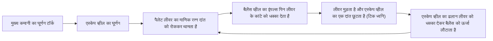
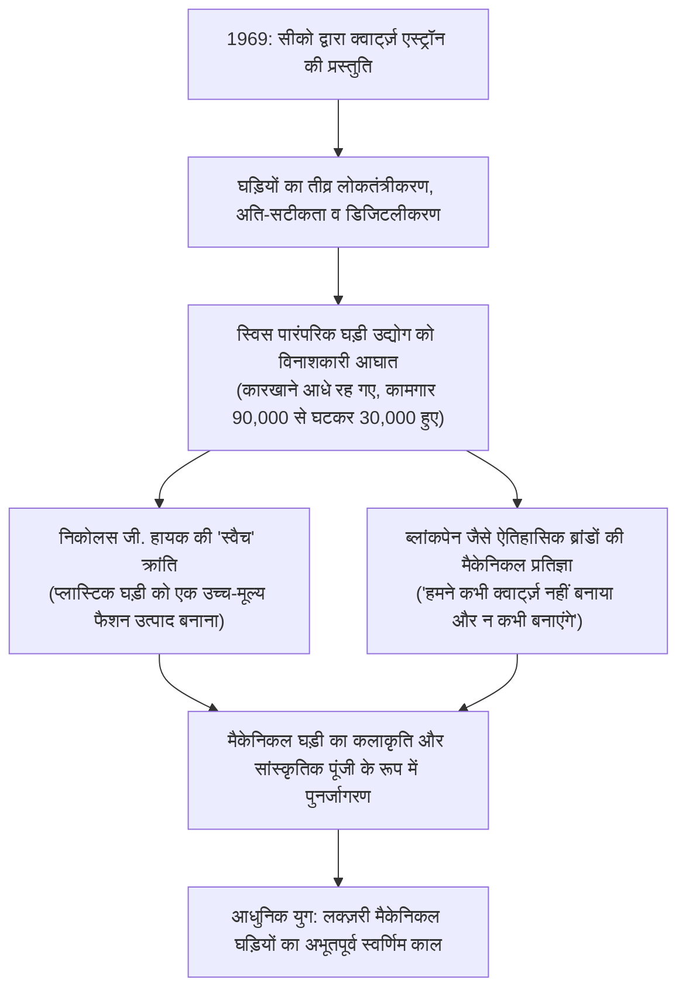
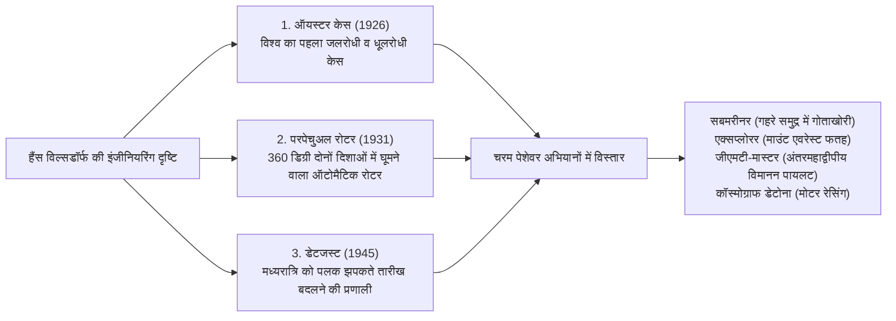

## प्रस्तावना: समय को अंकित करने वाला एक सूक्ष्म ब्रह्मांड

मात्र 40 मिलीमीटर के व्यास और कुछ मिलीमीटर की मोटाई वाले धातु के खोल (केस) के भीतर, सैकड़ों सूक्ष्म गियर, लीवर, कमानी (स्प्रिंग्स), और माणिक (रूबी) के बेयरिंग एक साथ मिलकर बिना एक सेकंड की भी त्रुटि के निरंतर समय की गति को दर्ज करते रहते हैं――यही है "मैकेनिकल घड़ी (Mechanical Watch)"। मानव सभ्यता द्वारा विकसित समस्त सटीक मैकेनिकल इंजीनियरिंग की कृतियों में यह सबसे छोटी, सबसे सुंदर, और सबसे दार्शनिक रचना है: एक जीवंत "सूक्ष्म ब्रह्मांड (Microcosmos)"।

आज के इस आधुनिक युग में, जहाँ क्वार्ट्ज़ घड़ियाँ और स्मार्टवॉच प्रति सेकंड हज़ारों बार कंपन करने वाले क्वार्ट्ज़ क्रिस्टल या परमाणु घड़ी के उपग्रह सिग्नलों के माध्यम से डिजिटल रूप से समय प्रदर्शित करती हैं, केवल एक धातु की कमानी की भौतिक प्रत्यास्थता (लोच) से संचालित होने वाली मैकेनिकल घड़ियाँ अब भी दुनिया भर के लोगों को मंत्रमुग्ध क्यों करती हैं? क्यों वे अंतरराष्ट्रीय नीलामी घरों में करोड़ों और अरबों रुपये की बहुमूल्य कलाकृतियों के रूप में खरीदी और बेची जाती हैं?

इसका कारण यह है कि एक मैकेनिकल घड़ी केवल एक साधारण "समय मापने का उपकरण" नहीं है, बल्कि **"न्यूटन के गति के नियमों, गुरुत्वाकर्षण, घर्षण, और तापीय प्रसार जैसी भौतिकी की सीमाओं को चुनौती देने वाली 500 वर्षों की मानव प्रज्ञा की उत्कृष्ट परिणति"** है। इसमें अब्राहम-लुई ब्रेगे (Abraham-Louis Breguet) जैसे महान घड़ी निर्माताओं की भौतिक अंतर्दृष्टि, स्विट्जरलैंड की जुरा पर्वतमाला के शिल्पकारों द्वारा पीढ़ियों से संजोई गई हस्तनिर्मित फिनिशिंग कला, और स्वतंत्र आंतरिक निर्माणशालाओं (मैन्युफैक्चर / Manufacture) का स्वाभिमान समाहित है।

यह लेख स्विस घड़ी उद्योग के ऐतिहासिक उद्भव से आरंभ करते हुए, मैकेनिकल मूवमेंट की गतिकी, तीन महान जटिलताओं (टॉरबिलॉन, परपेचुअल कैलेंडर, और मिनट रिपीटर) की सूक्ष्म ज्यामिति, विश्व के शीर्ष ब्रांडों के दर्शन, जापानी ग्रैंड सीको द्वारा विकसित स्प्रिंग ड्राइव की हाइब्रिड भौतिकी, तथा क्वार्ट्ज़ संकट से लेकर आधुनिक काल में मैकेनिकल घड़ियों के पुनर्जागरण तक के पूरे तंत्र का वैज्ञानिक और तकनीकी कठोरता के साथ संपूर्ण विश्लेषण प्रस्तुत करता है।

```
【मैकेनिकल घड़ी का संरचनात्मक पदानुक्रमिक ढाँचा】

┌─────────────────┬───────────────────────────────┬───────────────────────────────┐
│ कार्यात्मक मॉड्यूल│ प्रमुख घटक और तंत्र           │ भौतिक भूमिका और शासी नियम     │
├─────────────────┼───────────────────────────────┼───────────────────────────────┤
│ 1. शक्ति स्रोत  │ मुख्य कमानी (मेनस्प्रिंग),    │ कुंडलीकृत कमानी की स्थितिज    │
│ (Power Source)  │ बैरल (कमानी का डिब्बा),       │ ऊर्जा का संचय तथा निरंतर स्थिर│
│                 │ स्वचालित रोटर / वाइंडिंग नॉब  │ टॉर्क की आपूर्ति करना         │
├─────────────────┼───────────────────────────────┼───────────────────────────────┤
│ 2. संचरण तंत्र  │ दूसरा पहिया, तीसरा पहिया,     │ गियर अनुपात (त्वरक गियर ट्रेन)│
│ (Gear Train)    │ चौथा पहिया (सेकंड व्हील),     │ द्वारा उच्च टॉर्क को उच्च घूर्णन│
│                 │ पिनियन (सूक्ष्म गियर)         │ गति में परिवर्तित करना        │
├─────────────────┼───────────────────────────────┼───────────────────────────────┤
│ 3. एस्केपमेंट   │ एस्केप व्हील, पैलेट लीवर      │ गियर ट्रेन के घूर्णन को आवधिक │
│ (Escapement)    │ (एंकर रूबी पैलेट),            │ रूप से रोकना-छोड़ना तथा नियामक│
│                 │ (स्विस लीवर एस्केपमेंट)       │ को सूक्ष्म आवेग (ऊर्जा) देना  │
├─────────────────┼───────────────────────────────┼───────────────────────────────┤
│ 4. नियामक तंत्र │ बैलेंस व्हील, हेयरस्प्रिंग    │ सरल आवर्त दोलन (समकालिकता) के │
│ (Regulator)     │ (बाल-कमानी), कॉलेट, स्टड,     │ आधार पर अत्यंत सटीक 'आधारभूत  │
│                 │ रेगुलेटर इंडेक्स (सुई)        │ समय कंपन' उत्पन्न करना        │
├─────────────────┼───────────────────────────────┼───────────────────────────────┤
│ 5. प्रदर्शन     │ घंटे का पहिया, कैनन पिनियन,   │ नियमित घूर्णन गति को धीमा कर  │
│ (Display)       │ घंटे की सुई, मिनट की सुई,     │ मनुष्य द्वारा पठनीय समय की    │
│                 │ सेकंड की सुई, डायल (मुखपृष्ठ) │ दृश्य जानकारी में बदलना       │
└─────────────────┴───────────────────────────────┴───────────────────────────────┘
```

---

## 1. घड़ी उद्योग का इतिहास: ह्यूगनॉट पलायन से जू घाटी के चमत्कार तक

### 1.1 धार्मिक सुधार और स्विस घड़ी निर्माण का बीजारोपण
यद्यपि मैकेनिकल घड़ियों की उत्पत्ति 13वीं और 14वीं शताब्दी के यूरोपीय मठों और नगरों के विशाल घंटाघरों से जुड़ी है, किंतु उनका जेब में रखे जाने वाली "पॉकेट वॉच" और बाद में कलाई पर बाँधी जाने वाली "रिस्टवॉच" के रूप में लघुरूपण होना, और स्विट्जरलैंड का विश्व की घड़ी राजधानी बनना एक उथल-पुथल भरे धार्मिक इतिहास की देन है।

1541 में जिनेवा में प्रोटेस्टेंट सुधार आंदोलन का नेतृत्व करने वाले जॉन कैल्विन (Jean Calvin) ने कठोर वैराग्यवादी नियम लागू किए और आभूषण तथा रत्नों से जड़े गहनों को "सांसारिक आडंबर" मानकर पूरी तरह प्रतिबंधित कर दिया। इसके परिणामस्वरूप, जिनेवा के प्रसिद्ध सुनार और नक्काशीकार रातोंरात अपनी आजीविका खो बैठे और विनाश के कगार पर आ पहुँचे।
इस गंभीर संकट के बीच इन कुशल स्वर्णकारों ने एक नया मार्ग खोज निकाला: ऐसी वस्तु का निर्माण जो आभूषण नहीं, बल्कि एक "उपयोगी व्यावहारिक साधन" के रूप में मान्य थी――अर्थात **"पोर्टेबल व्यक्तिगत घड़ी (वॉच)"**। स्वर्णकारों की धातुकला की अद्वितीय निपुणता घड़ी के सूक्ष्म यांत्रिकी के साथ जुड़ गई, जिससे जिनेवा तेजी से एक उन्नत घड़ी निर्माण केंद्र में रूपांतरित हो गया।

इसके पश्चात 1685 में एक और ऐतिहासिक मोड़ आया, जब फ्रांस के सम्राट लुई चौदहवें ने "नांत की राजाज्ञा (Edict of Nantes)" को रद्द कर दिया। फ्रांस में प्रोटेस्टेंट (ह्यूगनॉट) समुदाय पर भीषण अत्याचार पुनः प्रारंभ हो गए, जिसके कारण फ्रांस के हज़ारों कुशल घड़ीसाज़, खगोलशास्त्री और यांत्रिक इंजीनियर अपनी जान बचाकर जिनेवा भाग आए। इस प्रतिभा पलायन ने स्विस घड़ी उद्योग को तकनीकी उत्कृष्टता की एक सुदृढ़ नींव प्रदान की।

### 1.2 जुरा पर्वतमाला की 'घड़ी घाटी' (वाले द जू) और एटाब्लिसाज प्रणाली
जिनेवा में एकत्रित कारीगरों का कौशल धीरे-धीरे जुरा पर्वतमाला की बीहड़ घाटियों――विशेष रूप से "वाले द जू (Vallée de Joux / जू घाटी)" और ला शो-द-फ़ों में फैल गया।

जू घाटी एक अत्यंत दुर्गम और अत्यधिक सर्द पर्वतीय क्षेत्र था, जो वर्ष में छह महीने तक घने हिमपात से ढका रहता था। स्थानीय किसानों ने सर्दियों की फुर्सत का उपयोग अपने घरों के अटारी (छत के कमरों) में बड़ी-बड़ी खिड़कियाँ बनाकर प्राकृतिक प्रकाश प्राप्त करने और पूरे परिवार के साथ मिलकर घड़ी के सूक्ष्म पुर्जे (पेंच, पहिए, कमानी, एस्केपमेंट के अंग) तराशने वाले घरेलू कुटीर उद्योग की स्थापना की।
बसंत ऋतु में जब बर्फ पिघलती, तो जिनेवा के व्यापारी (एटाब्लिस्योर / Établisseur) घाटी में जाकर इन पुर्जों को एकत्र करते और उन्हें जिनेवा की कार्यशालाओं में ले जाकर अंतिम असेंबलिंग और सूक्ष्म समायोजन करते थे। इस क्षैतिज श्रम-विभाजन की उन्नत प्रणाली को **"एटाब्लिसाज (Établissage)"** कहा जाता है। इसी प्रणाली ने स्विस घड़ियों को अभूतपूर्व सटीकता और लागत प्रतिस्पर्धात्मकता प्रदान की, जिसने आगे चलकर ब्रिटेन और फ्रांस के पारंपरिक गिल्ड-आधारित घड़ी कारखानों को परास्त कर दिया।

---

## 2. मैकेनिकल घड़ी की यांत्रिकी: सूक्ष्म भौतिकी का विज्ञान

### 2.1 नियामक प्रणाली का हृदय: बैलेंस व्हील और हेयरस्प्रिंग की 'समकालिकता'
मैकेनिकल घड़ी की समय मापने की सटीकता को नियंत्रित करने वाला सबसे मौलिक भौतिक नियम गैलीलियो गैलीली द्वारा खोजी गई **"लोलक की समकालिकता (Isochronism)"** है।
एक लोलक का दोलन विस्तार (आयाम) चाहे छोटा हो या बड़ा, उसका एक चक्कर पूरा करने का समय (आवर्तकाल) सदैव स्थिर रहता है। कलाई घड़ी में, जहाँ गुरुत्वाकर्षण पर निर्भर लोलक का प्रयोग संभव नहीं है, वहाँ **"बैलेंस व्हील (Balance Wheel)"** और बाल जैसी महीन **"हेयरस्प्रिंग (Balance Spring / Hairspring)"** के संयोजन से निर्मित घूर्णन दोलन प्रणाली का उपयोग किया जाता है।

बैलेंस व्हील का दोलन आवर्तकाल $T$ निम्नलिखित भौतिक सूत्र द्वारा व्यक्त किया जाता है:

$$T = 2\pi \sqrt{\frac{I}{C}}$$

जहाँ $I$ बैलेंस व्हील का जड़त्व आघूर्ण (Moment of Inertia) है और $C$ हेयरस्प्रिंग की मरोड़ कठोरता (Torsional Spring Constant) है।
यह समीकरण एक अत्यंत महत्वपूर्ण भौतिक सत्य प्रकट करता है: **"आवर्तकाल $T$ सैद्धांतिक रूप से दोलन के आयाम पर बिल्कुल निर्भर नहीं करता"**। चाहे मुख्य कमानी पूरी तरह से कसी हो और अधिक टॉर्क दे रही हो, या वह ढीली पड़ने लगी हो और कम टॉर्क दे रही हो, बैलेंस व्हील सदैव समान समय अंतराल में अपना घूर्णन पूरा करता है। यही वह भौतिक आधार है जो एक मैकेनिकल घड़ी को सटीक रूप से समय मापने में सक्षम बनाता है।

```
【बैलेंस व्हील की दोलन आवृत्ति (Frequency) और सटीकता का संबंध】

· 5 दोलन प्रति सेकंड (18,000 vph / 2.5Hz):
  प्रति सेकंड 5 दोलन (प्रति घंटे 18,000 दोलन)। विंटेज पॉकेट घड़ियों का धीमा दोलन।
  एक शांत और गरिमामय 'टिक-टिक' ध्वनि उत्पन्न करता है। यांत्रिक घिसाव न्यूनतम होने से पुर्जों का जीवन बहुत लंबा होता है।

· 6 दोलन प्रति सेकंड (21,600 vph / 3.0Hz):
  पारंपरिक मैनुअल वाइंडिंग और ऐतिहासिक क्लासिक मूवमेंट (जैसे पाटेक फिलिप Cal. 215) का मानक।

· 8 दोलन प्रति सेकंड (28,800 vph / 4.0Hz):
  आधुनिक रिस्टवॉच का सर्वमान्य स्वर्ण मानक (रोलेक्स Cal. 3135/3235, ईटीए 2824 आदि)।
  बाहरी झटकों की स्थिरता तथा तेल के फैलाव व पुर्जों के घिसाव के बीच सबसे संतुलित इंजीनियरिंग समाधान।

· 10 दोलन प्रति सेकंड (36,000 vph / 5.0Hz):
  इसे 'हाई-बीट (High-Beat)' कहा जाता है। प्रति सेकंड 10 बार दोलन, सेकंड की सुई 0.1 सेकंड के कदमों में चलती है।
  जेनिथ का 'एल प्राइमेरो' और ग्रैंड सीको का '9S85' इसके प्रमुख उदाहरण हैं। स्थितिगत गड़बड़ियों के प्रति अत्यंत प्रतिरोधी, किंतु उच्च धातुकर्म और स्नेहन की मांग करता है।
```

### 2.2 स्विस लीवर एस्केपमेंट (Swiss Lever Escapement) का गति चक्र
बैलेंस व्हील चाहे कितना भी सटीक दोलन क्यों न कर रहा हो, यदि उसे पहियों के घूर्णन में न बदला जाए और साथ ही दोलन को ऊर्जा का झटका (आवेग / इंपल्स) न दिया जाए, तो घर्षण और वायु प्रतिरोध के कारण वह कुछ ही क्षणों में रुक जाएगा। यह नाजुक नियंत्रण करने वाला प्रमुख घटक **"एस्केपमेंट (Escapement)"** कहलाता है।



स्विस लीवर एस्केपमेंट प्रति सेकंड 5 से 10 बार "रोकना, छोड़ना, और ऊर्जा आवेग देना" की यह मिलीसेकंड प्रक्रिया बिना रुके दोहराता है। एक दिन (86,400 सेकंड) में लगभग 7 लाख बार और एक वर्ष में 25 करोड़ बार धातु और रत्न के आपस में टकराने के बावजूद, यह बिना किसी खराबी के वर्षों तक लगातार चलता रहता है, जो इसकी विस्मयकारी विश्वसनीयता का प्रमाण है।

### 2.3 रेगुलेटर इंडेक्स बनाम फ्री-स्प्रंग बैलेंस
घड़ी की दैनिक गति को धीमा या तेज करने के लिए दो प्रमुख इंजीनियरिंग दृष्टिकोण अपनाए जाते हैं:

1. **रेगुलेटर इंडेक्स प्रणाली (Regulator Index)**:
   हेयरस्प्रिंग के बाहरी घेरे को दो छोटे पिनों (रेगुलेटर) के बीच दबाया जाता है। एक लीवर को हिलाकर हेयरस्प्रिंग की "प्रभावी दोलन लंबाई" को छोटा या बड़ा किया जाता है, जिससे आवर्तकाल बदल जाता है। यह प्रणाली समायोजित करने में सरल है, किंतु तीव्र झटके लगने पर लीवर अपनी जगह से खिसक सकता है और पिन तथा स्प्रिंग के संपर्क से सूक्ष्म समकालिकता में विकृति आ सकती है।
2. **फ्री-स्प्रंग बैलेंस प्रणाली (Free Sprung Balance)**:
   पाटेक फिलिप के 'गायरोमैक्स (Gyromax)' और रोलेक्स के 'माइक्रोस्टेला (Microstella)' द्वारा प्रयुक्त सर्वोच्च हॉरोलॉजी पद्धति। इसमें रेगुलेटर इंडेक्स को पूरी तरह हटा दिया जाता है और हेयरस्प्रिंग की लंबाई स्थिर रखी जाती है। **बैलेंस व्हील के बाहरी रिम पर लगे छोटे पेंचों या नटों को घुमाकर सीधे बैलेंस व्हील के जड़त्व आघूर्ण $I$ को समायोजित किया जाता है**। यह झटकों के प्रति अत्यधिक प्रतिरोधी है और वर्षों तक उच्च सटीकता बनाए रखता है, हालांकि इसके लिए अत्यधिक कुशल मास्टर वॉचमेकर की आवश्यकता होती है।

---

## 3. तीन महान जटिलताओं (Grand Complications) का इंजीनियरिंग विश्लेषण

घड़ी के बुनियादी कार्यों (घंटे, मिनट और सेकंड के प्रदर्शन) से परे, जटिल खगोलीय गणनाओं, ध्वनि संकेतों या गुरुत्वाकर्षण क्षतिपूर्ति को विशुद्ध यांत्रिक रूप से निष्पादित करने वाले तंत्र को "जटिलता (Complication)" कहा जाता है। इनमें सर्वोच्च स्थान "तीन महान जटिलताओं" को प्राप्त है।

```
【तीन महान जटिलताओं का तकनीकी वर्गीकरण और चुनौतियाँ】

┌─────────────────┬───────────────────────────────┬───────────────────────────────┐
│ जटिलता          │ तंत्र की मुख्य भौतिक चुनौती   │ समाधान हेतु सूक्ष्म इंजीनियरिंग│
├─────────────────┼───────────────────────────────┼───────────────────────────────┤
│ टॉरबिलॉन        │ लंबवत स्थिति में गुरुत्वाकर्षण│ संपूर्ण एस्केपमेंट और बैलेंस  │
│ (Tourbillon)    │ से हेयरस्प्रिंग का केंद्र हटना │ को एक पिंजरे में रखकर प्रति   │
│                 │ और स्थितिगत त्रुटि उत्पन्न होना│ मिनट 360 डिग्री घुमाना        │
├─────────────────┼───────────────────────────────┼───────────────────────────────┤
│ सतत कैलेंडर     │ छोटे/बड़े महीनों (30/31/28 दिन)│ 4 वर्ष (48 महीने) के खांचों   │
│ (Perpetual Cal) │ और 4 वर्ष में एक बार आने वाले │ वाले प्रोग्राम व्हील और लंबे │
│                 │ लीप वर्ष (29 दिन) की पहचान    │ यांत्रिक लीवर की प्रणाली      │
├─────────────────┼───────────────────────────────┼───────────────────────────────┤
│ मिनट रिपीटर     │ अदृश्य वर्तमान समय को शुद्ध   │ स्नेल कैम से समय को मापकर     │
│ (Minute Repeater)यांत्रिक घंटियों की सुरीली      │ हथौड़ों द्वारा विशेष गोंग पर   │
│                 │ ध्वनि में परिवर्तित करना      │ चोट करके समय की घोषणा करना    │
└─────────────────┴───────────────────────────────┴───────────────────────────────┘
```

### 3.1 टॉरबिलॉन (Tourbillon): गुरुत्वाकर्षण को वश में करने वाला घूर्णन पिंजरा
1801 में प्रतिभाशाली घड़ीसाज़ अब्राहम-लुई ब्रेगे (Abraham-Louis Breguet) द्वारा आविष्कृत टॉरबिलॉन (फ्रांसीसी भाषा में 'बवंडर') मैकेनिकल घड़ी निर्माण की तकनीकी और कलात्मक पराकाष्ठा है।

पारंपरिक पॉकेट घड़ियाँ सज्जनों की बनियान की जेब में लंबवत (सीधी) स्थिति में रखी जाती थीं। गुरुत्वाकर्षण लगातार एक ही दिशा में हेयरस्प्रिंग और बैलेंस व्हील को नीचे की ओर खींचता था, जिससे स्प्रिंग नीचे लटक जाती थी और उसका गुरुत्व केंद्र विचलित हो जाता था, जिसके परिणामस्वरूप गंभीर "स्थितिगत त्रुटि (Position Error)" पैदा होती थी।
ब्रेगे ने एक क्रांतिकारी विचार प्रस्तुत किया: "यदि हम पृथ्वी के गुरुत्वाकर्षण को समाप्त नहीं कर सकते, तो क्यों न पूरे नियामक तंत्र को ही अंतरिक्ष में घुमा दिया जाए?"

ब्रेगे ने एस्केप व्हील, पैलेट लीवर, बैलेंस व्हील और हेयरस्प्रिंग को एक अत्यंत हल्के धातु के पिंजरे――**"कैरिज (Cage)"** में स्थापित किया। चौथे पहिए को केंद्रीय धुरी बनाकर पूरे पिंजरे को **"प्रति मिनट ठीक एक चक्कर (360 डिग्री)"** घुमाया गया।
इसके द्वारा, जब घड़ी लंबवत होती है, तो एक मिनट के चक्र में गुरुत्वाकर्षण का प्रभाव सभी दिशाओं (360 डिग्री) में समान रूप से बंट जाता है, जिससे गुरुत्वाकर्षण के कारण होने वाली तेज और धीमी त्रुटियाँ स्वतः एक-दूसरे को निरस्त कर देती हैं।
मात्र 0.2 से 0.3 ग्राम वजनी टाइटेनियम के छोटे से पिंजरे में दर्जनों सूक्ष्म पुर्जों को असेंबल करना और घर्षण-मुक्त घुमाना आज भी दुनिया की चुनिंदा निर्माणशालाओं के ही वश की बात है।

### 3.2 सतत कैलेंडर (Perpetual Calendar): मैकेनिकल कंप्यूटर का जनक
साधारण कैलेंडर घड़ियाँ हर महीने 31 तारीख तक चलती हैं, इसलिए फरवरी, अप्रैल, जून, सितंबर और नवंबर के अंत में पहनने वाले को क्राउन घुमाकर मैन्युअल रूप से तारीख सही करनी पड़ती है।

इसके विपरीत, सतत कैलेंडर (Perpetual Calendar) पहियों की यांत्रिक स्मृति के आधार पर **30 दिन वाले छोटे महीनों, 31 दिन वाले बड़े महीनों, साधारण वर्ष की 28 दिन वाली फरवरी, और हर 4 वर्ष में एक बार आने वाले लीप वर्ष की 29 दिन वाली फरवरी को पूरी तरह स्वचालित रूप से पहचानता है**, और वर्ष 2100 तक बिना किसी मानवीय हस्तक्षेप के बिल्कुल सही तारीख बदलता रहता है।

इस गणना का केंद्रीय अंग **"48-महीने का प्रोग्राम कैम (लीप ईयर व्हील)"** है। इस पहिए की परिधि पर 4 वर्ष (48 महीने) के अनुसार अलग-अलग गहराई के खांचे तराशे होते हैं:
- 31 दिन वाला महीना: सबसे उथला खांचा
- 30 दिन वाला महीना: मध्यम गहराई का खांचा
- सामान्य फरवरी (28 दिन): सबसे गहरा खांचा
- लीप वर्ष की फरवरी (29 दिन): विशेष गहराई का खांचा
एक लंबा यांत्रिक लीवर (फीलर) इस खांचे की गहराई को स्पर्श द्वारा महसूस करता है और महीने के अंतिम दिन की मध्यरात्रि को तारीख के डिस्क को एक साथ 1 से 4 दिन आगे उछाल देता है। विद्युत के आविष्कार से पहले विशुद्ध यांत्रिकी द्वारा की गई यह प्रोग्रामिंग एक चमत्कारी उपलब्धि है।

### 3.3 मिनट रिपीटर (Minute Repeater): ध्वनिक भौतिकी की पराकाष्ठा
बिजली की रोशनी से पहले के युग में, जब रात के घने अंधेरे में समय जानना होता था, तो लोग जेब से घड़ी निकालकर उसके किनारे लगे स्लाइडर को खींचते थे। घड़ी से अत्यंत मधुर धातु की घंटियों की ध्वनि गूँज उठती थी――"डिंग, डिंग…… डिंग-डोंग, डिंग-डोंग…… डोंग, डोंग", जो ध्वनि द्वारा घंटे, चौथाई घंटे और मिनट की सटीक जानकारी देती थी।

- **मंद्र स्वर (घंटे की घंटी)**: भारी 'डिंग' ध्वनि से वर्तमान घंटा सूचित होता है (अधिकतम 12 बार)।
- **संयुक्त स्वर (चौथाई घंटे की घंटी)**: दो हथौड़ों द्वारा 'डिंग-डोंग' की युगल ध्वनि से प्रत्येक 15 मिनट (15, 30, 45 मिनट) सूचित होते हैं (अधिकतम 3 बार)।
- **तार स्वर (मिनट की घंटी)**: तीखी 'डोंग' ध्वनि से 15 मिनट के बाद बचे हुए 1 से 14 मिनट सूचित होते हैं (अधिकतम 14 बार)।
(उदाहरण: 7 बजकर 42 मिनट पर → 7 बार मंद्र स्वर + 2 बार संयुक्त स्वर [30 मिनट] + 12 बार तार स्वर = कुल 42 मिनट)।

मूवमेंट की परिधि पर विशेष रूप से तपे हुए स्टील के दो छल्लेदार "गोंग (Gongs)" लिपटे होते हैं, जिन पर दो छोटे हथौड़े प्रहार करते हैं।
स्लाइडर खींचते ही समय सूचक स्नेल कैम से संपर्क होकर यांत्रिक रूप से समय का पाठ पढ़ा जाता है। घंटियों के बजने की गति को स्थिर रखने के लिए वायु प्रतिरोध पर आधारित "घूर्णन वायु नियामक (Air Governor)" बिना किसी आवाज़ के अत्यधिक तेज गति से घूमता है। एक गूँजती हुई दिव्य ध्वनि प्राप्त करने के लिए केस की धातु (रोज़ गोल्ड, टाइटेनियम, प्लैटिनम) के ध्वनिक प्रतिबाधा का गहन भौतिकीय विश्लेषण किया जाता है।

---

## 4. विश्व की सर्वोच्च निर्माणशालाएँ और प्रतिष्ठित ब्रांडों का दर्शन

घड़ी उद्योग में बाहर से रेडीमेड मूवमेंट खरीदकर केवल केस में लगाने वाले ब्रांडों (एटाब्लिस्योर) की तुलना में, मूवमेंट की डिज़ाइनिंग, पुर्जों के निर्माण, असेंबलिंग, समायोजन से लेकर अंतिम पॉलिशिंग तक का सारा कार्य अपने ही कारखाने में संपन्न करने वाले निर्माताओं को **"मैन्युफैक्चर (Manufacture d'horlogerie)"** कहा जाता है, और उन्हें सर्वोच्च सम्मान दिया जाता है।

```
【विश्व की शीर्ष निर्माणशालाएँ और उनके ऐतिहासिक मास्टरपीस】

┌─────────────────┬───────────┬───────────────────────────────┐
│ ब्रांड का नाम    │ स्थापना   │ दर्शन, प्रतिष्ठित मॉडल और     │
│                 │ वर्ष      │ तकनीकी विशेषताएँ              │
├─────────────────┼───────────┼───────────────────────────────┤
│ पाटेक फिलिप     │ 1839      │ 'पवित्र त्रिमूर्ति' का शीर्ष। │
│ (Patek Philippe)│ स्विट्जरलैंड│ पाटेक सील, कैलात्रावा, नॉटिलस।│
│                 │           │ पीढ़ियों तक चलने वाली विरासत   │
├─────────────────┼───────────┼───────────────────────────────┤
│ ऑडेमार्स पिगे   │ 1875      │ लक्ज़री स्पोर्ट्स वॉच का जनक। │
│ (Audemars       │ स्विट्जरलैंड│ 1972 की रॉयल ओक, जिसने स्टील  │
│  Piguet)        │           │ को सोने से अधिक मूल्यवान बनाया│
├─────────────────┼───────────┼───────────────────────────────┤
│ वाशरों          │ 1755      │ विश्व की सबसे पुरानी निरंतर   │
│ कॉन्स्टेंटिन    │ स्विट्जरलैंड│ कार्यरत घड़ी निर्माणशाला।     │
│ (Vacheron C.)   │           │ पैट्रिमोनी, ओवरसीज। परंपरा    │
├─────────────────┼───────────┼───────────────────────────────┤
│ ए. लांगे एंड    │ 1845      │ जर्मन परिशुद्धता की पराकाष्ठा।│
│ सोने (A. Lange) │ जर्मनी    │ जर्मन सिल्वर 3/4 प्लेट, डबल   │
│                 │           │ असेंबलिंग, लांगे 1 का गणित    │
├─────────────────┼───────────┼───────────────────────────────┤
│ रोलेक्स         │ 1905      │ व्यावहारिक विलासिता का बेताज  │
│ (Rolex)         │ स्विट्जरलैंड│ बादशाह। ऑयस्टर केस, परपेचुअल   │
│                 │           │ रोटर, अप्रतिम विश्वसनीयता    │
├─────────────────┼───────────┼───────────────────────────────┤
│ ओमेगा           │ 1848      │ अपोलो चंद्र मिशन की मूनवॉच,   │
│ (OMEGA)         │ स्विट्जरलैंड│ को-एक्सियल एस्केपमेंट और      │
│                 │           │ असाधारण चुंबकीय प्रतिरोध      │
├─────────────────┼───────────┼───────────────────────────────┤
│ ग्रैंड सीको     │ 1960      │ मैकेनिकल व क्वार्ट्ज़ का अद्भुत│
│ (Grand Seiko)   │ जापान     │ समन्वय: स्प्रिंग ड्राइव तकनीक │
└─────────────────┴───────────┴───────────────────────────────┘
```

### 4.1 पाटेक फिलिप (Patek Philippe): घड़ी साम्राज्य का सर्वोच्च सम्राट
1839 में स्थापित पाटेक फिलिप महारानी विक्टोरिया, अल्बर्ट आइंस्टीन और त्चिकोवस्की जैसी ऐतिहासिक विभूतियों की पसंदीदा घड़ी रही है, और यह निर्विवाद रूप से घड़ी जगत का सर्वोच्च सम्राट है।
'कैलात्रावा (Calatrava)' गोल ड्रेस घड़ी के संपूर्ण स्वर्णिम अनुपात का प्रतीक है, जबकि 'नॉटिलस (Nautilus)' लक्ज़री स्पोर्ट्स घड़ी की भव्यता को परिभाषित करता है।
पाटेक फिलिप ने पारंपरिक जेनेवा सील से भी आगे बढ़कर अपना अत्यंत कड़ा आंतरिक मानक "पाटेक फिलिप सील (PP Seal)" स्थापित किया है। यह प्रतिदिन केवल −3 से +2 सेकंड की अत्यंत उच्च सटीकता सुनिश्चित करता है और 1839 से अब तक बनी अपनी प्रत्येक घड़ी की आजीवन मरम्मत की गारंटी देता है। उनका प्रसिद्ध विज्ञापन वाक्य: "आप वास्तव में कभी पाटेक फिलिप के स्वामी नहीं होते; आप केवल अगली पीढ़ी के लिए इसके संरक्षक होते हैं", इसे एक कालजयी सांस्कृतिक विरासत का दर्जा देता है।

### 4.2 ए. लांगे एंड सोने (A. Lange & Söhne): जर्मन इंजीनियरिंग का पुनर्जन्म
पूर्वी जर्मनी के सैक्सोनी राज्य की ग्लासह्यूटे घाटी में 1845 में फर्डिनेंड एडॉल्फ लांगे द्वारा स्थापित यह ब्रांड द्वितीय विश्व युद्ध के विनाश और साम्यवादी शासन में राष्ट्रीयकरण के अंधकार में खो गया था। 1990 में बर्लिन की दीवार गिरने के बाद, संस्थापक के परपोते वाल्टर लांगे ने इसका चमत्कारी पुनर्जन्म कराया।

लांगे की घड़ियाँ स्विस परंपरा से सर्वथा भिन्न जर्मन इंजीनियरिंग का सौंदर्य बिखेरती हैं:
- **जर्मन सिल्वर (निकल-सिल्वर) की 3/4 प्लेट**: पूरे मूवमेंट को बिना इलेक्ट्रोप्लेटिंग वाली जर्मन सिल्वर की एक ही बड़ी प्लेट से ढककर बेजोड़ संरचनात्मक मजबूती दी जाती है। समय बीतने के साथ इस पर एक सुनहरी प्राकृतिक चमक (पैटिना) आ जाती है।
- **पेंचों से जड़े गोल्ड शाटॉन**: माणिक के बेयरिंग को 18 कैरेट सोने के छल्ले में रखकर पारंपरिक नीले किए गए स्टील के पेंचों द्वारा प्लेट पर कसा जाता है।
- **हाथ से उकेरा गया बैलेंस कॉक**: प्रत्येक घड़ी के बैलेंस कॉक पर कुशल कारीगर हाथ से पुष्प आकृतियों की नक्काशी करते हैं, जिससे दुनिया में कोई भी दो घड़ियाँ एक जैसी नहीं होतीं।
- **दोहरी असेंबलिंग (Double Assembly)**: प्रत्येक मूवमेंट को एक बार पूरी तरह असेंबल करके परखा जाता है, फिर उसे पूरी तरह खोलकर प्रत्येक पुर्जे को दोबारा धोया और पॉलिश किया जाता है, और फिर दूसरी बार अंतिम रूप से असेंबल किया जाता है।

### 4.3 ग्रैंड सीको और 'स्प्रिंग ड्राइव' की हाइब्रिड भौतिकी
1960 में स्विस क्रोनोमीटर मानकों को पार करने वाली दुनिया की सबसे सटीक और व्यावहारिक घड़ी बनाने के संकल्प के साथ सीको ने "ग्रैंड सीको (Grand Seiko)" की स्थापना की।
इसकी तकनीकी यात्रा का शिखर 20 वर्षों के गहन शोध के बाद 1999 में साकार हुआ क्रांतिकारी तंत्र **"स्प्रिंग ड्राइव (Spring Drive)"** है।

```
【स्प्रिंग ड्राइव (ट्राई-सिंक्रो रेगुलेटर) की कार्यप्रणाली】

[मैकेनिकल ऊर्जा स्रोत: मुख्य कमानी (मेनस्प्रिंग)]
· इसमें बैटरी या इलेक्ट्रिक मोटर नहीं होती। यह विशुद्ध रूप से धातु की कमानी के खुलने से संचालित होती है।
  ↓
[गियर ट्रेन द्वारा गति संचरण]
  ↓
[ग्लाइड व्हील (चुंबकीय रोटर) का घूर्णन: प्रति सेकंड 8 चक्कर]
· रोटर स्टेटर कॉइल के बीच घूमता है और फैराडे के प्रेरण नियम से नैनोवॉट स्तर की अतिसूक्ष्म बिजली बनाता है।
  ↓
[अल्प-ऊर्जा क्वार्ट्ज़ आईसी और क्रिस्टल का सक्रियण]
· यह सूक्ष्म बिजली 32,768 हर्ट्ज़ के अत्यंत सटीक क्वार्ट्ज़ क्रिस्टल और माइक्रो-आईसी को सक्रिय करती है।
  ↓
[विद्युत-चुंबकीय ब्रेक द्वारा सटीक गति नियंत्रण]
· आईसी प्रति सेकंड सैकड़ों बार क्वार्ट्ज़ सिग्नल और रोटर की वास्तविक गति की तुलना करता है।
· यदि रोटर तेज हो, तो चुंबकीय भंवर धारा (Eddy Current) ब्रेक लगाकर उसे धीमा कर दिया जाता है,
  जिससे रोटर की गति निरंतर "प्रति सेकंड ठीक 8 चक्कर" पर स्थिर रखी जाती है।
```

स्प्रिंग ड्राइव की सेकंड की सुई मैकेनिकल घड़ी की तरह कांपते हुए नहीं चलती और न ही क्वार्ट्ज़ घड़ी की तरह एक-एक सेकंड पर झटके से कूदती है, बल्कि वह आकाश में तैरते तारे की भांति बिना किसी आवाज़ के डायल पर अत्यंत सहजता से तैरती है――इसे **"ग्लाइड मोशन (Glide Motion)"** कहा जाता है। यह मैकेनिकल घड़ी के शाश्वत टॉर्क और क्वार्ट्ज़ की मासिक मात्र ±15 सेकंड की सटीकता का अनुपम संगम है।

---

## 5. क्वार्ट्ज़ संकट और मैकेनिकल घड़ी पुनर्जागरण का आर्थिक दर्शन

25 दिसंबर 1969 को सीको ने दुनिया की पहली व्यावसायिक क्वार्ट्ज़ घड़ी "एस्ट्रॉन 35SQ" प्रस्तुत की। प्रतिदिन मात्र ±0.2 सेकंड (महीने में 5 सेकंड से भी कम) की अप्रतिम सटीकता वाली इस इलेक्ट्रॉनिक घड़ी ने पूरे विश्व के घड़ी उद्योग में एक प्रलयंकारी भूचाल ला दिया, जिसे इतिहास में **"क्वार्ट्ज़ संकट (Quartz Crisis)"** के नाम से जाना जाता है।



स्विस घड़ी उद्योग लगभग विनाश के कगार पर पहुँच गया और सैकड़ों ऐतिहासिक निर्माणशालाएँ दिवालिया हो गईं।
किंतु इस अस्तित्वगत संकट ने ही मैकेनिकल घड़ी के "वास्तविक मूल्य" को निखारा।
यदि घड़ी का उद्देश्य केवल "सटीक समय जानना" है, तो एक सस्ती डिजिटल घड़ी या मोबाइल फोन कहीं अधिक श्रेष्ठ है। परंतु मनुष्य अपनी कलाई पर जो बाँधता है, वह केवल एक अंक दर्शाने वाला उपकरण नहीं है।
सैकड़ों वर्ष पुराने न्यूटन के नियमों से चलने वाले गियरों की यांत्रिक ऊष्मा, सूक्ष्मदर्शी के नीचे बैठकर हफ्तों की मेहनत से उकेरी गई जेनेवा धारियों का सौंदर्य, और एक पीढ़ी से दूसरी पीढ़ी को सौंपी जा सकने वाली भौतिक अमरता――ये ऐसी मानवीय अनुभूतियाँ हैं जिनकी बराबरी सिलिकॉन चिप कभी नहीं कर सकती।

ज्याँ-क्लॉड बीवर (Jean-Claude Biver) और निकोलस हायक जैसे दूरदर्शी विचारकों के नेतृत्व में मैकेनिकल घड़ी एक अप्रचलित औज़ार से रूपांतरित होकर **"मानव आत्मा और शिल्पकला की चरम अभिव्यक्ति: एक पहनने योग्य कलाकृति"** बन गई। आधुनिक डिजिटल समाज में मैकेनिकल घड़ियों की लोकप्रियता दरअसल वास्तविक भौतिकता और प्रामाणिक स्पर्श के प्रति मानव चेतना की स्वाभाविक वापसी है।

---

## 3.4 क्रोनोग्रफ़ (Chronograph) की यांत्रिकी: स्टॉपवॉच की सूक्ष्म इंजीनियरिंग

जटिलताओं में मोटर रेसिंग, विमानन और खगोल विज्ञान के साथ सबसे गहरा संबंध रखने वाली विधा "क्रोनोग्रफ़ (समय अंतराल मापने वाली स्टॉपवॉच घड़ी)" है। एक क्रोनोग्रफ़ का संचालन अनुभव और उसकी सटीकता "नियंत्रण प्रणाली" और "क्लच शक्ति संचरण प्रणाली" के इंजीनियरिंग समन्वय पर निर्भर करती है।

```
【क्रोनोग्रफ़ के दो प्रमुख नियंत्रण तंत्र और दो क्लच प्रणालियाँ】

┌─────────────────┬───────────────────────────────┬───────────────────────────────┐
│ श्रेणी          │ प्रकार                        │ इंजीनियरिंग विशेषताएँ         │
├─────────────────┼───────────────────────────────┼───────────────────────────────┤
│ संचालन नियंत्रण │ 1. कॉलम व्हील प्रणाली         │ स्तंभों वाला बेलनाकार पहिया।  │
│ प्रणाली         │ (Column Wheel)                │ बटन दबाने का अनुभव अत्यंत मक्खन│
│                 │                               │ जैसा चिकना, लक्ज़री का प्रतीक │
├─────────────────┼───────────────────────────────┼───────────────────────────────┤
│                 │ 2. कैम-लीवर प्रणाली           │ धातु की प्लेटें आगे-पीछे सरकती│
│                 │ (Cam-Actuated)                │ हैं। टिकाऊ व बड़े पैमाने के   │
│                 │                               │ उत्पादन योग्य, बटन थोड़ा कड़ा │
├─────────────────┼───────────────────────────────┼───────────────────────────────┤
│ शक्ति संचरण     │ 1. क्षैतिज क्लच               │ बगल का पहिया क्षैतिज रूप से   │
│ (क्लच) प्रणाली  │ (Horizontal Clutch)           │ झूलकर जुड़ता है। पुर्जों की   │
│                 │                               │ गति दिखाई देती है, सुंदर दृश्य│
├─────────────────┼───────────────────────────────┼───────────────────────────────┤
│                 │ 2. ऊर्ध्वाधर क्लच             │ घर्षण डिस्क ऊपर-नीचे से दबकर  │
│                 │ (Vertical Clutch)             │ जुड़ती हैं। बटन दबाने पर सेकंड│
│                 │                               │ की सुई का उछलना शून्य होता है │
└─────────────────┴───────────────────────────────┴───────────────────────────────┘
```

पारंपरिक क्षैतिज क्लच में जब स्टार्ट बटन दबाया जाता है, तो घूमते हुए पहिए के दांत अचानक दूसरे पहिए से टकराते हैं, जिससे सेकंड की सुई के क्षणिक रूप से उछलने (Hand Jumping) की समस्या होती थी।
इसके विपरीत, आधुनिक उच्च-प्रदर्शन क्रोनोग्रफ़ (जैसे रोलेक्स डेटोना Cal. 4130/4131, ओमेगा स्पीडमास्टर, ब्रिटलिंग Cal. 01) में प्रयुक्त **"वर्टिकल क्लच (ऊर्ध्वाधर क्लच)"** में दो सूक्ष्म डिस्क एक-दूसरे पर सपाट दबती हैं, जिससे सुई का उछलना पूरी तरह समाप्त हो जाता है और क्रोनोग्रफ़ को लगातार चालू रखने पर भी मुख्य घड़ी की सटीकता पर कोई नकारात्मक प्रभाव नहीं पड़ता।

### फ्लाईबैक और स्प्लिट-सेकंड्स (रैट्रापांते)
- **फ्लाईबैक (Flyback)**: समय मापते समय रीसेट बटन दबाते ही 'रुकना, शून्य पर आना, और पुनः शुरू होना' तीनों क्रियाएँ एक ही झटके में संपन्न हो जाती हैं। लड़ाकू विमानों के पायलटों द्वारा लगातार मोड़ का समय मापने के लिए इसका आविष्कार हुआ था।
- **स्प्लिट-सेकंड्स (Rattrapante)**: डायल पर एक के ऊपर एक रखी दो सेकंड की सुइयां एक साथ दौड़ती हैं। एक अलग बटन दबाने पर ऊपरी सुई मध्यवर्ती समय (स्प्लिट टाइम) दिखाने के लिए रुक जाती है, जबकि निचली सुई दौड़ती रहती है; दोबारा दबाने पर रुकी हुई सुई उड़कर तुरंत दौड़ती हुई सुई से दोबारा आ मिलती है――यह क्रोनोग्रफ़ इंजीनियरिंग का चरम शिखर है।

---

## 2.4 एस्केपमेंट की 250 वर्षों की सबसे बड़ी क्रांति: को-एक्सियल और सिलिकॉन पदार्थ विज्ञान

दो शताब्दियों से अधिक समय तक स्विस लीवर एस्केपमेंट के एकाधिकार के पश्चात, 20वीं सदी के अंत और 21वीं सदी के प्रारंभ में घड़ियों के दो सबसे बड़े शत्रुओं――घर्षण और चुंबकत्व को समूल नष्ट करने वाली एक महान क्रांति घटित हुई।

### 1. जॉर्ज डेनियल का 'को-एक्सियल एस्केपमेंट (Co-Axial Escapement)'
ब्रिटिश स्वतंत्र घड़ीसाज़ जॉर्ज डेनियल (George Daniels) द्वारा 1970 के दशक में आविष्कृत और 1999 में ओमेगा (OMEGA) द्वारा बड़े पैमाने पर निर्मित को-एक्सियल एस्केपमेंट आधुनिक घड़ी विज्ञान की सबसे युगांतरकारी खोज थी।

पारंपरिक लीवर एस्केपमेंट में रूबी पैलेट और पहिए के दांतों के बीच तीव्र "फिसलने वाला घर्षण (Sliding Friction)" होता था, जिसके लिए चिकनाई वाले तेल (ल्यूब्रिकेंट) की अनिवार्य आवश्यकता होती थी; और तेल का सूखना ही सटीकता में गिरावट का मुख्य कारण बनता था।
को-एक्सियल एस्केपमेंट में एक ही धुरी पर दो छोटे-बड़े पहिए रखकर ऐसा ज्यामितीय डिज़ाइन तैयार किया गया जिसमें दांत पैलेट को **"सीधे लंबवत धक्का (रेडियल पुश)"** देते हैं। फिसलने वाला घर्षण लगभग शून्य हो जाने के कारण तेल की आवश्यकता समाप्तप्राय हो गई, जिससे सर्विसिंग (ओवरहाल) का अंतराल 3-5 वर्ष से बढ़कर 8-10 वर्ष हो गया।

### 2. सिलिकॉन (एकल क्रिस्टल सिलिकॉन) की उच्च-तकनीकी क्रांति
2000 के दशक से पाटेक फिलिप, रोलेक्स, ओमेगा और ब्रेगे ने स्विस माइक्रोइंजीनियरिंग संस्थान के साथ मिलकर सेमीकंडक्टर निर्माण तकनीक (DRIE: डीप रिएक्टिव-आयन एचिंग) का उपयोग करके सिलिकॉन पुर्जों का निर्माण किया।
- **पूर्ण चुंबकीय प्रतिरोध**: सिलिकॉन अधातु है, इसलिए यह स्मार्टफोन या स्पीकर के शक्तिशाली चुंबकीय क्षेत्र में भी कभी चुंबकित नहीं होता।
- **सटीक समकालिकता और तापीय स्थिरता**: सिलिकॉन की सतह पर थर्मल ऑक्साइड की परत चढ़ाकर तापमान परिवर्तन के कारण होने वाले विस्तार को पूरी तरह संतुलित किया जाता है।
- **अत्यधिक हल्का और घर्षणहीन**: धातु की तुलना में अत्यंत हल्का होने और सतह आणविक स्तर पर चिकनी होने से दोलन में ऊर्जा की भारी बचत होती है।

---

## 4.4 रोलेक्स (Rolex): व्यावहारिक विलासिता का तकनीकी आधिपत्य

1905 में हैंस विल्सडॉर्फ (Hans Wilsdorf) द्वारा स्थापित रोलेक्स ने नाजुक मानी जाने वाली कलाई घड़ी को "विश्व की सबसे विषम परिस्थितियों में भी अचूक चलने वाले सर्वोच्च उपकरण" के रूप में पुनर्परिभाषित किया।



### ऑयस्टरस्टील (904L मिश्रधातु) और आंतरिक धातुकर्म
रोलेक्स की प्रसिद्ध मजबूती का रहस्य यह है कि वह उद्योग में सामान्य रूप से प्रयुक्त 316L स्टील के स्थान पर रासायनिक संयंत्रों और एयरोस्पेस में उपयोग होने वाले उच्च-संक्षारण प्रतिरोधी सुपर अलॉय **"ऑयस्टरस्टील (904L सुपर ऑस्टेनिटिक स्टेनलेस स्टील)"** का उपयोग करता है।
इसमें क्रोमियम, मोलिब्डेनम, निकल और तांबे की उच्च मात्रा होती है, जो समुद्री नमक और पसीने के क्लोराइड से होने वाले संक्षारण को पूरी तरह रोकती है। पॉलिश करने पर यह प्लैटिनम जैसी चमकदार सफेद आभा बिखेरता है। रोलेक्स के पास अपना निजी स्वर्ण फाउंड्री भी है, जहाँ वह 'एवरोज़ गोल्ड' जैसी विशेष मिश्रधातुएँ तैयार करता है जो दशकों तक कभी फीकी नहीं पड़तीं।

---

## 5.2 मूवमेंट की हस्तनिर्मित फिनिशिंग और सौंदर्यशास्त्र

एक उच्च कोटि की घड़ी के मूल्य का आधा हिस्सा उसके मूवमेंट की सतह पर की जाने वाली पारंपरिक हस्तनिर्मित फिनिशिंग में निहित होता है। फिनिशिंग केवल दृश्य सुंदरता के लिए नहीं है, बल्कि यह धातु की कटाई से उत्पन्न सूक्ष्म खरोंचों और किनारों (Burrs) को हटाने, जंग रोकने, और धूल के कणों को फंसाकर रखने का महत्वपूर्ण इंजीनियरिंग कार्य करती है।

```
【सर्वोच्च मूवमेंट पर प्रयुक्त पारंपरिक फिनिशिंग तकनीकें】

1. आंग्लाज (Anglage / बेवेलिंग):
   प्लेट्स और ब्रिजों के 90 डिग्री के तीखे किनारों को कारीगर सूक्ष्म रेती और जेंटियन की लकड़ी तथा डायमंड पेस्ट का उपयोग करके हाथ से 45 डिग्री के चिकने ढलान में तराशते हैं और दर्पण जैसा चमकाते हैं। यह प्रकाश को परावर्तित करके पुर्जों के त्रि-आयामी स्वरूप को उभारता है।

2. कोट्स द जेनेवा (Côtes de Genève / जेनेवा धारियाँ):
   घूर्णन करने वाले लकड़ी के औजार से ब्रिज की सतह पर समानांतर लहरदार पट्टियां उकेरी जाती हैं। देखने के कोण के साथ प्रकाश और छाया का सुंदर खेल उत्पन्न होता है।

3. पर्लेज (Perlage / वृत्ताकार पॉलिश):
   मुख्य प्लेट की भीतरी सतह पर एक-दूसरे के ऊपर चढ़ते हुए छोटे-छोटे गोल छल्लों का पैटर्न बनाया जाता है, जो मछली की खाल या मोतियों जैसा दिखता है। यह उड़ती हुई धूल को रोकता है और तेल की परत बनाए रखता है।

4. ब्लैक पॉलिश (Poli Noir / दर्पण पॉलिश):
   स्टील के छोटे पुर्जों (पेंचों के सिर, टॉरबिलॉन कैरिज) को जस्ता प्लेट पर डायमंड पाउडर के साथ हाथ से '8' के आकार में तब तक रगड़ा जाता है जब तक कि वे आणविक स्तर पर समतल न हो जाएं। एक विशेष कोण से देखने पर यह प्रकाश को पूरी तरह एक दिशा में मोड़ देता है जिससे यह गहरा काला (Black) दिखाई देता है――यह फिनिशिंग की चरम सीमा है।
```

जेनेवा गणराज्य के कानून द्वारा स्थापित **"जेनेवा सील (Poinçon de Genève)"** के अनुसार स्टील के सभी किनारों की बेवेलिंग, पेंचों के सिर की मिरर पॉलिश, और रूबी के छेदों की पॉलिशिंग सहित 12 अत्यंत कड़े तकनीकी और सौंदर्य मानकों को पूरा करने वाले मूवमेंट को ही जेनेवा का राज्य प्रतीक चिह्न अंकित करने का गौरव प्राप्त होता है।

---

## 4.5 स्वतंत्र घड़ीसाज़ों (AHCI) की चुनौतियाँ और अति-विशिष्ट आधुनिक मूर्तिकला

विशाल कॉर्पोरेट समूहों (रिशमों, स्वैच, एलवीएमएच) के प्रभुत्व वाले आधुनिक युग में, व्यक्तिगत कार्यशालाओं में बिना किसी व्यावसायिक समझौते के घड़ियाँ गढ़ने वाले 'स्वतंत्र घड़ी निर्माता अकादमी (AHCI)' के उस्तादों ने मैकेनिकल घड़ी को विशुद्ध कला के स्तर पर पहुँचा दिया है।

```
【आधुनिक काल के दिग्गज स्वतंत्र घड़ीसाज़ और विशिष्ट कृतियाँ】

1. फिलिप डुफूर (Philippe Dufour):
   · स्विट्जरलैंड की जू घाटी में बिना किसी सहायक के पूरी तरह अकेले हाथ से घड़ियाँ बनाते हैं।
   · 'सिंप्लिसिटी (Simplicity)': केवल घंटे, मिनट और सेकंड की साधारण घड़ी होने के बावजूद, इसके आंतरिक कोनों की बेवेलिंग (Interior Anglage) को मानव इतिहास की सर्वश्रेष्ठ हस्तनिर्मित फिनिशिंग माना जाता है।
   · 'डुअलिटी (Duality)': दो स्वतंत्र बैलेंस व्हील्स को डिफरेंशियल गियर से जोड़कर वास्तविक समय में यांत्रिक रूप से त्रुटि को औसत करने वाली विश्व की पहली रिस्टवॉच।

2. एफ.पी. ज़ुर्न (François-Paul Journe):
   · "Invenit et Fecit (मैंने इसका आविष्कार किया और इसे बनाया)" के सिद्धांत पर चलने वाले विलक्षण प्रतिभा के धनी।
   · 'क्रोनोमीटर रेज़ोनेंस': दो बैलेंस व्हील्स को कुछ मिलीमीटर की दूरी पर रखकर, हवा के कंपन और बेसप्लेट के सूक्ष्म रेज़ोनेंस (अनुनाद) द्वारा दोनों के दोलन को पूरी तरह से सिंक्रनाइज़ करने वाला ध्वनिक चमत्कार।
   · मूवमेंट की बेसप्लेट और सभी ब्रिजों को 18 कैरेट रोज़ गोल्ड से बनाते हैं।

3. रिचर्ड मिल (Richard Mille):
   · "कलाई पर बांधी जाने वाली F1 रेस कार" की संकल्पना पर आधारित 21वीं सदी की हाइपर-वॉच।
   · कार्बन टीपीटी, ग्रेड 5 टाइटेनियम, और एकल नीलमणि क्रिस्टल जैसी अंतरिक्ष सामग्री का उपयोग।
   · टेनिस स्टार राफेल नडाल के लिए 200 किमी/घंटा से अधिक की सर्विस के झटकों को झेलने वाला 5,000G से 12,000G शॉक-प्रतिरोधी टॉरबिलॉन विकसित किया, जो आज अरबपतियों का परम स्टेटस सिंबल है।
```

---

## 2.5 घड़ी के सबसे बड़े शत्रु 'चुंबकत्व' से युद्ध: चुंबकीय प्रतिरोध का इतिहास

आधुनिक युग में स्मार्टफोन, लैपटॉप, बैग के चुंबकीय बटन और इंडक्शन स्टोव जैसे शक्तिशाली चुंबकीय क्षेत्र हमारे चारों ओर मौजूद हैं। एक मैकेनिकल घड़ी के लिए **"चुंबकित होना (Magnetization)"** उसकी सटीकता को बिगाड़ने वाला सबसे आम और गंभीर खतरा है।

जब स्टील की हेयरस्प्रिंग चुंबकित हो जाती है, तो उसके छल्ले आपस में चिपक जाते हैं, जिससे स्प्रिंग की प्रभावी लंबाई बहुत छोटी हो जाती है और घड़ी प्रतिदिन कई मिनट या कई घंटे तेज भागने लगती है।

```
【घड़ियों में चुंबकीय प्रतिरोध के दो प्रमुख इंजीनियरिंग दृष्टिकोण】

1. भौतिक आवरण प्रणाली (फैराडे केज शील्डिंग):
   · सिद्धांत: पूरे मूवमेंट को 'मृदु लोहे (सॉफ्ट आयरन)' के एक आंतरिक केस में बंद कर दिया जाता है।
   · कार्यप्रणाली: बाहरी चुंबकीय रेखाएं उच्च पारगम्यता वाले मृदु लोहे से होकर बाहर निकल जाती हैं और भीतरी नाजुक मूवमेंट तक नहीं पहुँच पातीं।
   · क्लासिक उदाहरण: IWC इंजीनियूर, रोलेक्स मिलगॉस (1,000 गॉस प्रतिरोधी)।
   · सीमाएँ: केस मोटा और भारी हो जाता है, और पीछे पारदर्शी कांच लगाना असंभव होता है।

2. आंतरिक गैर-चुंबकीय सामग्री प्रणाली (पदार्थ क्रांति):
   · सिद्धांत: हेयरस्प्रिंग, पैलेट और एस्केप व्हील को सिलिकॉन या अलौह धातुओं से बनाना जो चुंबक से पूरी तरह अप्रभावित रहते हैं।
   · क्लासिक उदाहरण: ओमेगा 'मास्टर क्रोनोमीटर' (15,000 गॉस चुंबकीय क्षेत्र में भी बिल्कुल अप्रभावित, जो एमआरआई मशीन के बराबर है)। Si14 सिलिकॉन स्प्रिंग और टाइटेनियम पुर्जे।
   · लाभ: केस पतला और सुरुचिपूर्ण रहता है और पीछे के पारदर्शी कांच से मूवमेंट के धड़कते सौंदर्य को देखा जा सकता है।
```

---

## 5.5 स्विस गुणवत्ता प्रमाणीकरण मानक: जेनेवा सील और COSC क्रोनोमीटर परीक्षण

उच्च कोटि की मैकेनिकल घड़ियों की प्रामाणिकता और सटीकता स्वतंत्र तीसरे पक्ष की आधिकारिक संस्थाओं के कठोर परीक्षणों द्वारा सुनिश्चित की जाती है।

```
【स्विस घड़ी उद्योग के मुख्य गुणवत्ता प्रमाणीकरण मानक】

1. COSC (स्विस आधिकारिक क्रोनोमीटर परीक्षण संस्थान / Contrôle Officiel Suisse des Chronomètres):
   · कार्य: केवल स्विट्जरलैंड में बने अनकेस्ड (नग्न) मूवमेंट की उच्च सटीकता का परीक्षण करना।
   · प्रक्रिया: मूवमेंट को विशेष फ्रेम में कसकर 5 अलग-अलग कोणों (डायल ऊपर, डायल नीचे, आदि) और 3 अलग-अलग तापमानों (8°C, 23°C, 38°C) पर लगातार 15 दिनों तक मापा जाता है।
   · मानक: औसत दैनिक विचलन "-4 से +6 सेकंड" के भीतर होना अनिवार्य है। स्विट्जरलैंड में बनने वाली कुल घड़ियों में से केवल कुछ प्रतिशत ही इसे प्राप्त कर पाती हैं।

2. जेनेवा सील (Poinçon de Genève / जेनेवा नगर का आधिकारिक संप्रभुता प्रतीक):
   · इतिहास: 1886 में जेनेवा की संसद द्वारा स्थापित, यह भौगोलिक उत्पत्ति और उच्चतम फिनिशिंग का प्रतीक है।
   · योग्यता: केवल वही घड़ियाँ पात्र हैं जिनका निर्माण, असेंबलिंग और समायोजन जेनेवा कैंटन की सीमा के भीतर हुआ हो।
   · 12 शास्त्रीय तकनीकी नियम:
     - सभी स्टील पुर्जों के किनारों की बेवेलिंग होनी चाहिए और सतह पर ब्रश या मिरर पॉलिश होनी चाहिए;
     - पेंचों के खांचों और सिरों पर मिरर पॉलिश होनी चाहिए;
     - गियरों के दांतों के दोनों तरफ बेवेलिंग होनी चाहिए और पिनियन की धुरी दर्पण जैसी होनी चाहिए;
     - रूबी बेयरिंग के छेद चिकने होने चाहिए ताकि तेल की सतह का तनाव बना रहे।
   · आधुनिक गतिशील मानक: 2011 के संशोधन के बाद, केवल मूवमेंट ही नहीं बल्कि पूरी तैयार घड़ी को सिमुलेटर पर चलाकर प्रतिदिन "-1 से +1 सेकंड" का विचलन, जलरोधकता और पावर रिज़र्व की पूर्ण जांच अनिवार्य कर दी गई है। वाशरों कॉन्स्टेंटिन और रोजर डुबुई आज भी गर्व से इस ऐतिहासिक सील को धारण करते हैं।
```

---

## 6. निष्कर्ष: कलाई पर सूक्ष्म ब्रह्मांड को धारण करना

एक मैकेनिकल घड़ी को कलाई पर बाँधकर अपनी उंगलियों से उसके क्राउन को धीरे-धीरे घुमाना। उंगलियों के पोरों पर कमानी के कड़े खिंचाव का सूक्ष्म स्पंदन महसूस होना, और जब घड़ी को कान के पास लाया जाए, तो बैलेंस व्हील की "टिक-टिक-टिक-टिक……" की द्रुत हृदय-धड़कन सुनाई देना।

उस छोटे से धातु के बक्से के भीतर, 500 वर्ष पूर्व नूर्नबर्ग के पीटर हेनलीन द्वारा पोर्टेबल कमानी के आविष्कार के बाद से दर्जनों पीढ़ियों के घड़ी निर्माताओं की संपूर्ण जीवन-तपस्या की बुद्धिमत्ता धड़क रही है। उन्होंने धार्मिक दमन, विनाशकारी युद्धों और क्वार्ट्ज़ क्रांति के थपेड़ों को झेलते हुए भी केवल एक ही प्रश्न का उत्तर खोजने में अपना जीवन समर्पित कर दिया――"समय जैसे अपरिवर्तनीय और अमूर्त भौतिक प्रवाह को हम सबसे सटीक और सबसे सुंदर रूप में कैसे माप सकते हैं?"

आज हम केवल अपने स्मार्टफोन की स्क्रीन छूकर जीपीएस उपग्रहों द्वारा प्रति सेकंड खरबवें हिस्से तक सटीक समय देख सकते हैं।
किंतु जब हम अपनी कलाई पर बंधी घड़ी में कमानी को खुलते, बैलेंस व्हील को झूलते और धातु की सुई को डायल पर आगे बढ़ते देखते हैं, तब हमें इस सत्य का सबसे गहन और सजीव अहसास होता है कि हम पृथ्वी के गुरुत्वाकर्षण, दिन-रात के चक्र, और संपूर्ण ब्रह्मांड की गति के साथ एक लय में सांस ले रहे हैं।

मैकेनिकल घड़ी वह सबसे सुंदर और गरिमामय "प्रज्ञा का कवच" है, जिसे मनुष्य ने समय की अथाह और अनंत खाई का सामना करने के लिए अपने हाथों से गढ़ा है।
