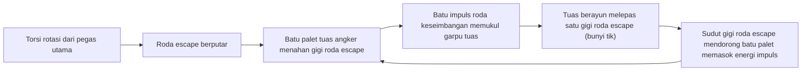
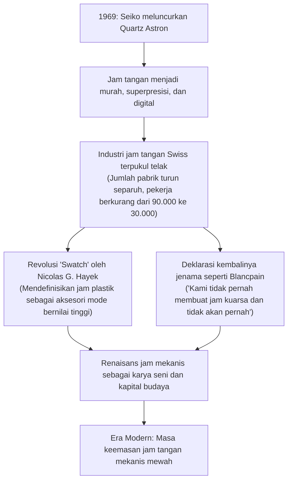
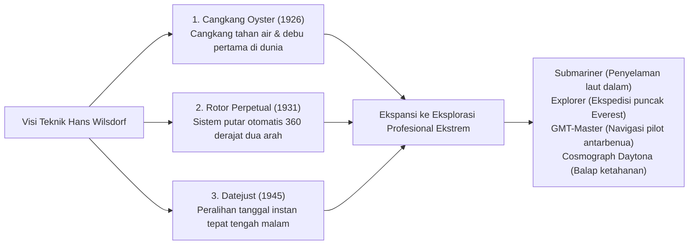

## Pengantar: Jam Tangan Mekanis sebagai Mikrokosmos Penunjuk Waktu

Di dalam cangkang logam dengan diameter hanya sekitar 40 milimeter dan ketebalan beberapa milimeter, ratusan roda gigi mikro, tuas penekan, pegas, dan bantalan batu rubi tersusun rapat dan berdetak tanpa henti mencatat waktu dengan presisi mutlak――itulah "Jam Tangan Mekanis (Mechanical Watch)". Di antara seluruh pencapaian rekayasa mekanik presisi yang pernah diciptakan peradaban manusia, jam tangan mekanis adalah instrumen terkecil, terindah, dan paling filosofis: sebuah "mikrokosmos (dunia miniatur)" yang nyata.

Di era modern saat jam kuarsa (quartz) dan jam tangan pintar (smartwatch) menampilkan waktu secara digital melalui puluhan ribu getaran osilator kristal per detik atau sinyal gelombang radio jam atom satelit, mengapa jam tangan mekanis yang hanya digerakkan oleh energi potensial elastis sebuah pegas gulung tetap memikat hati jutaan orang di seluruh dunia dan diperdagangkan layaknya karya seni adiluhung dengan nilai miliaran hingga ratusan miliar rupiah di balai lelang dunia?

Alasannya adalah jam tangan mekanis bukan sekadar "alat pengukur waktu", melainkan **"kristalisasi kecerdasan manusia selama lebih dari 500 tahun dalam menantang batas hukum mekanika Newton, gravitasi, gesekan, dan pemuaian termal"**. Di dalamnya terhimpun intuisi fisika dari para master horologi jenius seperti Abraham-Louis Breguet, seni penyelesaian dan pemolesan tangan ekstrem (finishing) yang diwariskan turun-temurun oleh para perajin di Pegunungan Jura Swiss, serta dedikasi kemandirian dari manufaktur terintegrasi (manufacture d'horlogerie).

Artikel ini mengupas tuntas seluruh arsitektur horologi dengan ketelitian akademis dan rekayasa mekanik: mulai dari sejarah lahirnya industri jam Swiss akibat migrasi kaum Huguenot, mekanika gerak mesin jam (movement), geometri mikro dari tiga komplikasi agung (tourbillon, kalender abadi, dan minute repeater), filosofi jenama legendaris dunia, fisika hibrida Spring Drive karya Grand Seiko Jepang, hingga Krisis Kuarsa dan kebangkitan kembali jam tangan mekanis bernilai seni tinggi.

```
【Arsitektur Hierarki Mekanisme Jam Tangan Mekanis】

┌─────────────────┬───────────────────────────────┬───────────────────────────────┐
│ Modul Fungsional│ Komponen & Mekanisme Kunci    │ Peran Fisika & Hukum Pengatur │
├─────────────────┼───────────────────────────────┼───────────────────────────────┤
│ 1. Sumber Daya  │ Pegas utama (mainspring),     │ Menyimpan energi potensial    │
│ (Power Source)  │ barel pegas (barrel), rotor   │ elastis pegas dan menyalurkan │
│                 │ putar otomatis/knop putar     │ torsi konstan secara stabil   │
├─────────────────┼───────────────────────────────┼───────────────────────────────┤
│ 2. Transmisi    │ Roda tengah (2nd), roda ke-3, │ Mengubah torsi tinggi menjadi │
│ (Gear Train)    │ roda ke-4 (roda detik), pinion│ kecepatan putaran melalui     │
│                 │ rasio roda gigi (roda percepat)│ rasio transmisi roda gigi     │
├─────────────────┼───────────────────────────────┼───────────────────────────────┤
│ 3. Pelepasan    │ Roda escape, tuas palet       │ Menahan dan melepas putaran   │
│ (Escapement)    │ (pallet lever / angker batu)  │ roda gigi secara berkala, ser-│
│                 │ (Swiss lever escapement)      │ ta memberi impuls ke regulator│
├─────────────────┼───────────────────────────────┼───────────────────────────────┤
│ 4. Pengatur     │ Roda keseimbangan (balance),  │ Menghasilkan osilasi frekuensi│
│ (Regulator)     │ per rambut (hairspring), collet│ acuan waktu yang stabil ber- │
│                 │ stud, indeks regulator        │ dasarkan getaran harmonik     │
├─────────────────┼───────────────────────────────┼───────────────────────────────┤
│ 5. Penampil     │ Roda jam, kanon pinion,       │ Menurunkan kecepatan putaran  │
│ (Display)       │ jarum jam, jarum menit,       │ yang telah diatur menjadi in- │
│                 │ jarum detik, dial (pelat)     │ formasi visual bagi manusia   │
└─────────────────┴───────────────────────────────┴───────────────────────────────┘
```

---

## 1. Sejarah Industri Horologi: Dari Eksodus Huguenot ke Keajaiban Lembah Jura

### 1.1 Reformasi Agama dan Kelahiran Horologi Swiss
Asal-usul jam mekanis dapat ditelusuri kembali ke lonceng menara katedral dan biara Eropa pada abad ke-13 dan ke-14. Namun, transformasi instrumen raksasa tersebut menjadi jam saku kecil, dan kemudian menjadi jam tangan yang melingkar di pergelangan tangan hingga menjadikan Swiss sebagai episentrum horologi dunia, berakar dari pergolakan sejarah keagamaan Eropa.

Pada tahun 1541, Yohanes Kalvin (Jean Calvin) memimpin Reformasi Protestan di Jenewa dan memberlakukan doktrin asketisme yang sangat ketat. Mengenakan perhiasan emas dan batu permata dilarang keras karena dianggap sebagai manifestasi dari kesombongan duniawi. Akibatnya, para perajin emas dan pengukir perhiasan tersohor di Jenewa seketika kehilangan mata pencaharian dan berada di ambang kebangkrutan.
Dalam keputusasaan tersebut, para perajin emas menemukan jalan keluar baru: membuat **"jam saku portabel (watch)"**, yang tidak digolongkan sebagai perhiasan melainkan diakui sebagai "alat praktis penunjuk waktu". Keterampilan ukir logam mulia tingkat tinggi dari perajin emas berpadu harmonis dengan mekanika presisi, memicu transformasi pesat Jenewa menjadi kota manufaktur jam berteknologi tinggi.

Peristiwa penting berikutnya terjadi pada tahun 1685 ketika Raja Prancis Louis XIV mencabut Edik Nantes. Penindasan berdarah terhadap kaum Protestan Prancis (kaum Huguenot) kembali berkobar, memicu eksodus puluhan ribu pembuat jam ulung, teknisi mekanik, dan ahli astronomi Prancis ke Jenewa. Masuknya kaum terpelajar dan perajin ahli ini memberikan fondasi teknologi yang tak tertandingi bagi industri jam Swiss.

### 1.2 "Lembah Jam" Pegunungan Jura (Vallée de Joux) dan Sistem Établissage
Keahlian para perajin di Jenewa lambat laun menyebar ke lembah-lembah terjal di Pegunungan Jura――khususnya "Vallée de Joux (Lembah Joux)" dan La Chaux-de-Fonds.

Wilayah Lembah Joux merupakan kawasan pegunungan terpencil bersuhu ekstrem dingin yang diselimuti salju tebal selama setengah tahun. Para petani setempat memanfaatkan masa jeda musim dingin dengan membuka jendela-jendela besar di loteng rumah mereka untuk menangkap sinar matahari alami. Di loteng itulah seluruh anggota keluarga terlibat dalam industri rumahan memotong, mengikir, dan membuat komponen-komponen mikro jam (sekrup, roda gigi, per, pelat escapement).
Ketika musim semi tiba dan salju mencair, para saudagar distributor dari Jenewa (établisseur) menyusuri desa-desa di lembah untuk mengumpulkan komponen buatan keluarga tersebut, lalu membawanya ke bengkel kerja Jenewa untuk perakitan akhir dan kalibrasi presisi (assembly). Sistem pembagian kerja horizontal yang terkoordinasi ini disebut **"Établissage"**. Struktur industri yang sangat efisien dan terspesialisasi inilah yang melahirkan keunggulan presisi dan efisiensi biaya luar biasa pada jam tangan Swiss, sehingga berhasil menundukkan bengkel serikat pekerja tradisional di Inggris dan Prancis.

---

## 2. Mekanika Mesin Jam: Fisika Tingkat Mikro

### 2.1 Jantung Mekanisme Pengatur: "Isokronisme" Roda Keseimbangan dan Per Rambut
Hukum fisika fundamental yang mengatur tingkat akurasi jam mekanis adalah **"Isokronisme Bandul (Isochronism)"** yang dirumuskan oleh Galileo Galilei.
Sebuah bandul membutuhkan waktu yang konstan untuk menyelesaikan satu ayunan bolak-balik (periode getaran), baik ayunannya lebar maupun sempit. Pada jam saku dan jam tangan yang bergerak bebas di ruang tiga dimensi, bandul gravitasi tidak dapat digunakan. Sebagai gantinya, digunakan sistem getaran torsi berupa kombinasi **"Roda Keseimbangan (Balance Wheel)"** dan **"Per Rambut (Balance Spring / Hairspring)"** yang sehalus helai rambut.

Periode getaran roda keseimbangan $T$ dirumuskan secara matematis melalui persamaan mekanika berikut:

$$T = 2\pi \sqrt{\frac{I}{C}}$$

Dalam rumus ini, $I$ melambangkan momen inersia dari roda keseimbangan, sedangkan $C$ adalah konstanta kekakuan puntir dari per rambut.
Persamaan ini membuktikan fakta fisika yang luar biasa krusial: **"Periode getaran $T$ secara teoretis sama sekali tidak bergantung pada amplitudo ayunan roda keseimbangan"**. Baik saat pegas utama terisi penuh dan menghasilkan torsi kuat, maupun saat pegas mulai kendur dan torsinya melemah, roda keseimbangan tetap berosilasi bolak-balik dengan interval waktu yang persis sama. Inilah pilar fisika yang memungkinkan jam mekanis mengukur waktu secara presisi.

```
【Korelasi Frekuensi Roda Keseimbangan dan Presisi Jam】

· 5 Getaran/detik (18.000 vph / 2,5 Hz):
  Roda berosilasi 5 kali per detik (18.000 kali per jam). Umum pada jam saku antik dan jam klasik.
  Menghasilkan suara detak "tik-tok" yang tenang, berwibawa, dan elegan. Keausan mekanik sangat rendah, menjamin usia pakai komponen yang sangat panjang.

· 6 Getaran/detik (21.600 vph / 3,0 Hz):
  Standar frekuensi mesin manual tradisional dan kaliber legendaris klasik (seperti Patek Philippe Cal. 215).

· 8 Getaran/detik (28.800 vph / 4,0 Hz):
  Standar emas mutlak jam tangan mekanis kontemporer (Rolex Cal. 3135/3235, ETA 2824, dll.).
  Menghadirkan titik keseimbangan teknik paling sempurna antara stabilitas terhadap guncangan eksternal dengan ketahanan minyak pelumas serta keausan komponen.

· 10 Getaran/detik (36.000 vph / 5,0 Hz):
  Dikenal sebagai "High-Beat". Bergetar 10 kali per detik, jarum detik melangkah tiap 0,1 detik, memungkinkan pengukuran sepersepuluh detik.
  Dicontohkan oleh Zenith "El Primero" dan Grand Seiko "9S85". Sangat stabil terhadap gangguan posisi dan guncangan, namun pelumas lebih cepat terurai sehingga membutuhkan metalurgi mikro tingkat tinggi.
```

### 2.2 Siklus Dinamika Escapement Tuas Swiss (Swiss Lever Escapement)
Betapa pun presisinya gerak harmonik sederhana yang dihasilkan oleh roda keseimbangan, jika tidak ada mekanisme yang meneruskannya menjadi "putaran roda gigi teratur" sekaligus memberi asupan energi impuls ke roda keseimbangan, maka roda tersebut akan berhenti akibat hambatan udara dan gesekan internal material. Mekanisme pengatur mikro yang menjembatani konversi kritis ini adalah **"Escapement"**.



Escapement tuas Swiss mengulang siklus "kunci, lepas, dan impuls" dalam hitungan milidetik sebanyak 5 hingga 10 kali setiap detiknya tanpa cela. Dalam kurun waktu satu hari (86.400 detik), mekanisme ini menahan sekitar 700.000 kali tumbukan logam-batu mulia, dan dalam setahun mencapai 250 juta kali tumbukan keras, membuktikan keandalan mekanis yang menakjubkan selama bertahun-tahun tanpa kerusakan.

### 2.3 Indeks Regulator vs Roda Keseimbangan Bersuspensi Bebas (Free Sprung)
Terdapat dua filosofi teknik utama dalam mengkalibrasi laju akurasi jam (cepat atau lambat):

1. **Sistem Indeks Regulator (Regulator Index)**:
   Dua pin pengatur menjepit lingkaran luar per rambut. Dengan menggeser tuas pengatur, panjang efektif getaran per rambut diubah sehingga periode getarannya berubah. Sistem ini mudah disetel, namun jika jam mengalami benturan keras, posisi tuas rentan bergeser dan kontak fisik antara pin dengan per rambut dapat menimbulkan deviasi isokronisme mikro.
2. **Sistem Suspensi Bebas (Free Sprung Balance)**:
   Konfigurasi kasta tertinggi horologi yang diaplikasikan pada "Gyromax" Patek Philippe dan mur "Microstella" Rolex. Komponen indeks regulator dihilangkan sepenuhnya, panjang per rambut terkunci permanen, dan **penyetelan akurasi dilakukan dengan memutar beban eksentrik atau mur berulir mikro pada tepi luar roda keseimbangan guna mengubah momen inersia $I$ secara langsung**. Sistem ini sangat kebal terhadap guncangan dan mempertahankan kestabilan laju waktu jangka panjang, meski membutuhkan kemahiran tingkat tinggi dari master pembuat jam.

---

## 3. Anatomi Rekayasa Tiga Komplikasi Agung (Grand Complications)

Di luar fungsi dasar menampilkan jam, menit, dan detik, modul mekanis mikro yang mengintegrasikan perhitungan kalender astronomi, transmisi akustik berdentang, atau kompensasi gravitasi otomatis disebut "Komplikasi (Complication)". Dan puncak takhta keahlian teknik pembuatan jam dunia ditempati oleh "Tiga Komplikasi Agung".

```
【Klasifikasi Rekayasa dan Tantangan Tiga Komplikasi Agung】

┌─────────────────┬───────────────────────────────┬───────────────────────────────┐
│ Komplikasi      │ Tantangan Fisika Mekanisme    │ Solusi Rekayasa Mekanik Mikro │
├─────────────────┼───────────────────────────────┼───────────────────────────────┤
│ Tourbillon      │ Gaya gravitasi bumi memicu de-│ Menempatkan seluruh escapement│
│                 │ viasi pusat massa per rambut  │ dan balance dalam sangkar pu- │
│                 │ saat jam dalam posisi vertikal│ tar 360 derajat tiap menit    │
├─────────────────┼───────────────────────────────┼───────────────────────────────┤
│ Kalender Abadi  │ Menghitung otomatis bulan     │ Roda program siklus 4 tahun   │
│ (Perpetual Cal) │ pendek/panjang (28/30/31 hari)│ (48 bulan) berprofil lekuk ber│
│                 │ dan tahun kabisat (29 hari)   │ tingkat dengan tuas peraba    │
├─────────────────┼───────────────────────────────┼───────────────────────────────┤
│ Minute Repeater │ Mengonversi waktu kasatmata   │ Tuas membaca profil bubungan  │
│                 │ menjadi alunan dentang lonceng│ siput (snail) dan menggerak-  │
│                 │ mekanis nada tinggi & rendah  │ kan palu pemukul genta baja   │
└─────────────────┴───────────────────────────────┴───────────────────────────────┘
```

### 3.1 Tourbillon: Sangkar Putar Penjinak Gravitasi
Ditemukan pada tahun 1801 oleh master horologi legendaris Abraham-Louis Breguet, tourbillon (berarti "angin puyuh" dalam bahasa Prancis) diakui sebagai mahkota teknis dan estetika tertinggi jam tangan mekanis.

Jam saku pada zaman dahulu umumnya disimpan dalam posisi tegak vertikal di dalam saku rompi pemiliknya. Gravitasi bumi menarik per rambut dan roda keseimbangan ke satu arah secara terus-menerus, menyebabkan per rambut melorot ke bawah dan titik beratnya bergeser, memicu kesalahan posisi (position error) yang signifikan.
Breguet mencetuskan gagasan fisika yang cemerlang: "Bila gravitasi bumi tidak dapat dimusnahkan, mengapa tidak memutar seluruh mekanisme pengatur waktu itu sendiri di ruang angkasa?"

Breguet merangkum roda escape, tuas palet, roda keseimbangan, dan per rambut ke dalam sangkar logam mikro berbobot sangat ringan――yang disebut **"Sangkar Tourbillon (Carriage / Cage)"**. Dengan roda ke-4 sebagai sumbu pusat, sangkar tersebut diputar **"tepat satu putaran penuh (360 derajat) per menit"**.
Melalui mekanisme ini, saat jam berada dalam orientasi vertikal, vektor gaya gravitasi didistribusikan merata ke segala arah 360 derajat dalam siklus satu menit, sehingga deviasi cepat dan lambat akibat gravitasi secara alami saling meniadakan secara otomatis.
Merakit puluhan komponen mikro di dalam sangkar titanium atau paduan ringan berbobot total hanya 0,2 hingga 0,3 gram dan memastikannya berputar mulus tanpa gesekan tetap merupakan tantangan ekstrem yang hanya dapat dituntaskan oleh segelintir manufaktur elite dunia saat ini.

### 3.2 Kalender Abadi (Perpetual Calendar): Pelopor Komputer Mekanis
Jam tangan dengan kalender biasa selalu melangkah hingga tanggal 31 setiap bulannya. Oleh karena itu, pada akhir Februari, April, Juni, September, dan November, pengguna wajib menarik knop pemutar (crown) untuk memajukan tanggal secara manual.

Sebaliknya, Kalender Abadi (Perpetual Calendar) mengandalkan memori mekanik roda gigi untuk **mengenali secara otomatis bulan pendek (30 hari), bulan panjang (31 hari), Februari tahun biasa (28 hari), hingga Februari tahun kabisat (29 hari yang terjadi 4 tahun sekali)**, melangkah tepat tanpa koreksi manual hingga tahun 2100.

"Mikroprosesor" mekanik dari sistem ini adalah **"Bubungan Program 48 Bulan (Roda Tahun Kabisat)"**. Pada keliling roda gigi ini terdapat lekukan terukir dengan kedalaman berbeda untuk siklus 4 tahun (48 bulan):
- Bulan 31 hari: lekukan paling dangkal
- Bulan 30 hari: lekukan kedalaman sedang
- Februari tahun biasa (28 hari): lekukan paling dalam
- Februari tahun kabisat (29 hari): lekukan kedalaman khusus
Tuas mekanis peraba membaca kedalaman lekukan ini, dan tepat pada tengah malam akhir bulan, mekanismenya secara instan memajukan piringan tanggal 1 hingga 4 langkah sekaligus. Inilah keajaiban komputasi murni mekanik yang dirancang jauh sebelum era elektronika lahir.

### 3.3 Minute Repeater: Puncak Fisika Akustik Mikro
Sebelum lampu listrik ditemukan, di tengah kegelapan malam para bangsawan cukup menggeser tuas geser di sisi cangkang jam saku mereka, dan suara dentang lonceng logam yang jernih bagai kristal akan berbunyi: "Ding, ding…… ding-dong, ding-dong…… dong, dong", memberitahukan jam, seperempat jam, dan menit melalui susunan nada.

- **Nada Rendah (Penunjuk Jam)**: Dentang nada rendah menunjukkan jam saat ini (maksimum 12 kali).
- **Nada Ganda Tinggi-Rendah (Penunjuk Seperempat Jam)**: Pasangan nada "ding-dong" menunjukkan kelipatan 15 menit (15, 30, atau 45 menit, maksimum 3 kali).
- **Nada Tinggi (Penunjuk Menit Sisa)**: Dentang nada tinggi menunjukkan sisa menit 1 hingga 14 (maksimum 14 kali).
(Contoh: Pukul 07.42 → Nada rendah 7 kali + Nada ganda 2 kali [30 menit] + Nada tinggi 12 kali = Total 42 menit).

Dua lingkaran genta baja lentur khusus yang ditempa dan disepuh melingkar di sekeliling mesin jam, dipukul oleh dua palu miniatur dengan kekuatan presisi.
Saat tuas ditekan, rak bergigi membaca profil bertingkat dari bubungan siput (snail cam) penunjuk waktu. Agar ketukan dentang berbunyi dengan tempo teratur dan tidak meluncur tergesa-gesa, sebuah "regulator sentrifugal udara (air governor)" berputar senyap pada kecepatan sangat tinggi memanfaatkan hambatan aerodinamika. Demi menghasilkan gaung suara yang merdu dan beresonansi panjang, konduktivitas akustik dari logam cangkang (rose gold, titanium, platinum) dihitung secara cermat melalui hukum impedansi akustik.

---

## 4. Manufaktur Puncak Dunia dan Filosofi Jenama Agung

Dalam industri horologi, jenama yang hanya membeli mesin mentah dari pabrikan luar untuk dirakit ke dalam cangkang (établisseur) dibedakan secara tegas dari produsen yang merancang, mengembangkan, memproduksi suku cadang, merakit, mengalibrasi, dan memoles mesin jam sepenuhnya secara mandiri. Produsen independen terpadu ini disebut **"Manufaktur (Manufacture d'horlogerie)"** dan memegang status kehormatan tertinggi di dunia.

```
【Manufaktur Puncak Dunia dan Mahakarya Ikoniknya】

┌─────────────────┬───────────┬───────────────────────────────┐
│ Nama Jenama     │ Tahun     │ Filosofi, Model Ikonik &      │
│                 │ Didirikan │ Keunggulan Rekayasa           │
├─────────────────┼───────────┼───────────────────────────────┤
│ Patek Philippe  │ 1839      │ Puncak "Tiga Besar". Standar  │
│                 │ Swiss     │ Segel PP Seal, Calatrava,     │
│                 │           │ Nautilus. Nilai abadi warisan │
├─────────────────┼───────────┼───────────────────────────────┤
│ Audemars Piguet │ 1875      │ Pelopor jam tangan sport mewah│
│                 │ Swiss     │ Royal Oak (1972, karya Gérald │
│                 │           │ Genta), perintis baja mewah   │
├─────────────────┼───────────┼───────────────────────────────┤
│ Vacheron        │ 1755      │ Manufaktur jam tertua di dunia│
│ Constantin      │ Swiss     │ beroperasi tanpa putus. Patri-│
│                 │           │ mony, Overseas. Puncak tradisi│
├─────────────────┼───────────┼───────────────────────────────┤
│ A. Lange &      │ 1845      │ Puncak horologi presisi Jerman│
│ Söhne           │ Jerman    │ Pelat 3/4 perak Jerman, double│
│                 │           │ assembly, Lange 1 asimetris   │
├─────────────────┼───────────┼───────────────────────────────┤
│ Rolex           │ 1905      │ Penguasa jam tangan mewah pra-│
│                 │ Swiss     │ ktis. Cangkang Oyster tahan   │
│                 │           │ air, rotor Perpetual otomatis │
├─────────────────┼───────────┼───────────────────────────────┤
│ OMEGA           │ 1848      │ Jam resmi Program Apollo bulan│
│                 │ Swiss     │ Speedmaster, pelopor escapement│
│                 │           │ koaksial dan antimagnetik     │
├─────────────────┼───────────┼───────────────────────────────┤
│ Grand Seiko     │ 1960      │ Fusi mekanis & kuarsa revolu- │
│                 │ Jepang    │ sioner: mekanisme Spring Drive│
└─────────────────┴───────────┴───────────────────────────────┘
```

### 4.1 Patek Philippe: Penguasa Takhta Horologi Dunia
Didirikan pada tahun 1839, Patek Philippe adalah penguasa tertinggi dunia jam tangan yang dicintai oleh tokoh-tokoh bersejarah seperti Ratu Victoria, Albert Einstein, hingga Pyotr Tchaikovsky.
Model "Calatrava" menampilkan proporsi bulat klasik dengan rasio emas sempurna, sedangkan "Nautilus" mendefinisikan kemewahan arsitektural jam sport modern.
Patek Philippe menetapkan standar internal mandiri yang melampaui Segel Jenewa resmi, yaitu "Patek Philippe Seal (PP Seal)". Standar ini mewajibkan deviasi harian superpresisi antara −3 hingga +2 detik, serta memberikan jaminan layanan restorasi dan perbaikan seumur hidup untuk setiap jam tangan yang pernah diproduksi sejak 1839. Slogan legendaris mereka: "Anda tidak pernah benar-benar memiliki Patek Philippe; Anda hanya menjaganya untuk generasi berikutnya" menegaskan status jam ini sebagai warisan budaya lintas zaman.

### 4.2 A. Lange & Söhne: Kebangkitan Rekayasa Presisi Jerman
Berpusat di kota pegunungan Glashütte, Saxony, Jerman Timur, A. Lange & Söhne didirikan pada 1845 oleh Ferdinand Adolph Lange. Setelah melewati tragedi Perang Dunia II, nasionalisasi di bawah rezim komunis Jerman Timur, dan hilangnya jenama dari peta dunia selama hampir setengah abad, jenama ini dibangkitkan kembali secara spektakuler pada 1990 pasca-runtuhnya Tembok Berlin oleh cicit sang pendiri, Walter Lange.

Jam tangan Lange memancarkan keindahan rekayasa rasional khas Jerman yang sangat kontras dengan gaya klasik Swiss:
- **Pelat Tiga Perempat (3/4 Plate) Perak Jerman (German Silver)**: Menutupi sebagian besar roda gigi dengan selembar pelat paduan tembaga-nikel-seng yang belum dilapisi listrik, memberikan kekakuan struktural luar biasa. Seiring bertambahnya usia, material ini memancarkan patina keemasan yang hangat dan anggun.
- **Bantalan Batu Emas Bersekrup (Screwed Gold Chatons)**: Bantalan batu rubi diletakkan di dalam cincin emas 18 karat dan dikunci dengan sekrup baja biru tahan panas tradisional.
- **Jembatan Keseimbangan Berukir Tangan**: Setiap jembatan roda keseimbangan diukir manual oleh ahli grafir dengan motif floral, memastikan tiada dua mesin jam yang identik di dunia.
- **Perakitan Ganda (Double Assembly)**: Setiap mesin jam dirakit, diuji, dan disetel sempurna sekali, lalu dibongkar total, dibersihkan kembali, dipoles ulang, dan dirakit untuk kedua kalinya demi mencapai kesempurnaan tanpa kompromi.

### 4.3 Grand Seiko dan Fisika Hibrida "Spring Drive"
Pada tahun 1960, Seiko meluncurkan "Grand Seiko" dengan ambisi menciptakan jam tangan praktis dengan akurasi dan ketahanan tertinggi di dunia, melampaui standar kronometer Swiss.
Puncak evolusi teknologi mereka terwujud dalam mekanisme orisinal **"Spring Drive"**, yang berhasil disempurnakan pada tahun 1999 setelah riset intensif selama lebih dari dua dekade.

```
【Dinamika Mikrosistem Spring Drive (Tri-synchro Regulator)】

[Sumber Energi Mekanis: Pegas Utama (Mainspring)]
· Murni menggunakan gaya pemulih elastis dari pegas mekanis gulung. Bebas baterai dan motor listrik.
  ↓
[Penerusan Daya Melalui Rangkaian Roda Gigi]
  ↓
[Putaran Roda Glide (Rotor Magnetik): 8 Putaran/detik]
· Rotor melintasi kumparan stator, menghasilkan gaya gerak listrik induksi (daya mikro tingkat nanowatt) berdasarkan hukum Faraday.
  ↓
[Mengaktifkan IC Berdaya Rendah & Osilator Kristal Kuarsa]
· Daya mikro mengaktifkan osilator kristal 32.768 Hz berpresisi tinggi dan sirkuit terpadu (IC) hemat energi ekstrem.
  ↓
[Pengereman Elektromagnetik Tanpa Sentuhan untuk Regulasi Laju]
· IC membandingkan sinyal kuarsa dengan kecepatan putar rotor ratusan kali per detik.
· Bila putaran rotor melebihi batas, rem arus eddy elektromagnetik diterapkan secara halus,
  mengunci putaran tepat pada kecepatan konstan "8 putaran per detik".
```

Jarum detik jam tangan Spring Drive tidak berdetak patah-patah seperti jam mekanis biasa, juga tidak melompat kaku satu detik per langkah seperti jam kuarsa, melainkan meluncur hening tanpa suara di atas dial bagai gerak orbit benda langit――fenomena ini disebut **"Glide Motion"**. Spring Drive menyatukan torsi mekanis tak terbatas dari pegas baja dengan presisi mutlak kuarsa (deviasi hanya ±15 detik per bulan), menjadikannya inovasi teknik horologi paling orisinal dari Asia.

---

## 5. Krisis Kuarsa dan Filosofi Ekonomi Kebangkitan Horologi Mekanis

Pada 25 Desember 1969, Seiko merilis jam tangan kuarsa komersial pertama di dunia, "Astron 35SQ". Dengan deviasi hanya ±0,2 detik per hari (kurang dari ±5 detik per bulan)――ratusan kali lebih presisi daripada jam mekanis terbaik saat itu――kedatangan jam tangan kuarsa memicu gempa dahsyat dalam industri horologi global yang dikenal sebagai **"Krisis Kuarsa (Quartz Crisis)"**.



Industri jam Swiss terjerumus ke jurang kehancuran. Ratusan bengkel bersejarah gulung tikar dan tenaga kerja terpangkas hingga dua pertiga.
Namun, krisis eksistensial inilah yang justru memurnikan "esensi sejati" dari jam tangan mekanis.
Bila jam tangan semata-mata dipandang sebagai "alat praktis untuk membaca waktu", maka jam digital murah atau telepon pintar jauh lebih unggul. Namun, apa yang dilingkarkan manusia di pergelangan tangannya bukanlah sekadar indikator angka.
Di sana bersemayam kehangatan mekanis dari roda gigi yang berputar menurut hukum Newton yang tak lekang oleh waktu, keindahan garis Côtes de Genève dan perlage yang digoreskan master perajin di bawah mikroskop selama berminggu-minggu, serta keabadian fisik yang dapat diwariskan dari orang tua kepada anak melintasi generasi.

Melalui visi strategis dari tokoh seperti Jean-Claude Biver dan Nicolas G. Hayek, jam tangan mekanis bertransformasi dari sekadar alat penunjuk waktu usang menjadi **"karya seni murni bernilai tinggi dan warisan budaya yang dikenakan di tubuh"**. Popularitas jam tangan mekanis mewah di era modern pada hakikatnya merupakan reaksi estetika manusia terhadap dunia informasi digital yang dingin, kembali merengkuh keaslian materi dan mekanika nyata.

---

## 3.4 Mekanika Kronograf (Chronograph): Rekayasa Presisi Pengukur Waktu

Di antara seluruh komplikasi mekanis, kronograf (jam tangan dengan fungsi stopwatch pengukur interval waktu) adalah yang paling erat bertautan dengan dunia balap mobil, penerbangan militer, dan eksplorasi astronomi. Kualitas sentuhan tombol dan presisi kronograf ditentukan oleh perpaduan antara "sistem kontrol aktivasi" dan "mekanisme kopling transmisi daya".

```
【Dua Sistem Kontrol dan Dua Arsitektur Kopling Kronograf】

┌─────────────────┬───────────────────────────────┬───────────────────────────────┐
│ Kategori        │ Tipe Arsitektur               │ Karakteristik Rekayasa        │
├─────────────────┼───────────────────────────────┼───────────────────────────────┤
│ Sistem Kontrol  │ 1. Roda Kolom                 │ Roda silinder dengan pilar teg│
│ Aktivasi        │ (Column Wheel)                │ ak. Tekanan tombol sangat em- │
│                 │                               │ puk & halus, simbol kemewahan │
├─────────────────┼───────────────────────────────┼───────────────────────────────┤
│                 │ 2. Bubungan Tuas (Cam)        │ Pelat logam bertingkat maju-  │
│                 │ (Cam-Actuated)                │ mundur. Sangat tangguh untuk  │
│                 │                               │ produksi massal, tombol kaku  │
├─────────────────┼───────────────────────────────┼───────────────────────────────┤
│ Sistem Kopling  │ 1. Kopling Horizontal         │ Roda gigi samping bergeser se-│
│ Daya (Clutch)   │ (Horizontal Clutch)           │ cara horizontal untuk menyatu.│
│                 │                               │ Gerak mekanis tampak indah    │
├─────────────────┼───────────────────────────────┼───────────────────────────────┤
│                 │ 2. Kopling Vertikal           │ Piringan gesek ditekan verti- │
│                 │ (Vertical Clutch)             │ kal dari atas-bawah. Nol lon- │
│                 │                               │ jakan jarum saat tombol ditekan│
└─────────────────┴───────────────────────────────┴───────────────────────────────┘
```

Kopling horizontal tradisional memiliki kelemahan mendasar: saat tombol start ditekan, ujung gigi dari roda gigi yang sedang berputar kencang bertabrakan dengan roda kronograf, memicu fenomena "lonjakan jarum (hand jumping)" yang terlihat kasatmata.
Sebaliknya, kaliber kronograf modern berkinerja tinggi (seperti Rolex Daytona Cal. 4130/4131, OMEGA Speedmaster, Breitling Cal. 01) menerapkan **"Kopling Vertikal"**. Sistem ini mengunci dua piringan mikro secara aksial melalui gaya gesek permukaan, sehingga fenomena lonjakan jarum sepenuhnya nol, dan aktivasi kronograf terus-menerus tidak akan mengganggu amplitudo maupun presisi mesin utama.

### Flyback dan Split-Seconds (Rattrapante)
- **Flyback**: Menekan tombol reset saat kronograf berjalan akan mengeksekusi tiga perintah sekaligus secara instan: "berhenti, kembali ke nol, dan memulai pengukuran baru". Fitur ini diciptakan untuk pilot pesawat tempur agar dapat mencatat waktu manuver berurutan tanpa jeda.
- **Split-Seconds (Rattrapante)**: Dilengkapi dua jarum detik kronograf yang bertumpuk sejajar. Saat tombol pemisah ditekan, jarum atas berhenti untuk mencatat waktu perantara (split time), sementara jarum bawah terus berputar; ketika tombol ditekan kembali, jarum yang berhenti langsung melesat mengejar jarum utama dan kembali menyatu, menjadikannya salah satu mekanisme kronograf paling rumit di dunia.

---

## 2.4 Revolusi 250 Tahun Escapement: Koaksial dan Rekayasa Material Silikon

Setelah escapement tuas Swiss mendominasi selama lebih dari dua abad, pada pergantian abad ke-20 menuju ke-21 lahir revolusi geometri dan ilmu material yang menumpas dua musuh bebuyutan jam mekanis: gesekan dan medan magnet.

### 1. "Escapement Koaksial (Co-Axial Escapement)" Karya George Daniels
Diciptakan pada tahun 1970-an oleh master horologi independen asal Inggris, George Daniels, dan berhasil diproduksi massal oleh OMEGA pada tahun 1999, escapement koaksial adalah terobosan monumental dalam sejarah jam mekanis.

Escapement tuas konvensional mengandalkan "gesekan geser (sliding friction)" yang intens antara batu palet dan gigi roda escape, sehingga pelumasan oli mutlak dibutuhkan; sayangnya, degradasi dan pengeringan oli merupakan biang keladi utama penurunan akurasi seiring waktu.
Escapement koaksial menyusun dua roda escape bertingkat pada sumbu yang sama (co-axial) dengan tiga batu palet, menghasilkan gerakan dorongan tegak lurus radial **"kontak dorong titik (radial push)"**. Dengan mereduksi gesekan geser hingga mendekati nol, kebutuhan pelumasan berkurang secara dramatis, sehingga memperpanjang interval servis besar (overhaul) dari 3-5 tahun menjadi 8-10 tahun.

### 2. Revolusi Teknologi Material Silikon (Silikon Monokristalin)
Sejak dekade 2000-an, konsorsium riset gabungan antara Patek Philippe, Rolex, OMEGA, dan Breguet bersama Institut Mikroelektronika Swiss berhasil menerapkan teknik fotolitografi semikonduktor (DRIE: Deep Reactive-Ion Etching) untuk memproduksi komponen silikon monokristalin.
- **Antimagnetik Mutlak**: Silikon bersifat non-logam sehingga sama sekali tidak dapat terinduksi magnet dari ponsel pintar atau pengeras suara.
- **Isokronisme Sempurna & Kompensasi Suhu**: Melalui lapisan termal silikon dioksida (seperti per Spiromax Patek Philippe), koefisien elastisitas termal positif meniadakan koefisien negatif silikon, menjaga frekuensi getar tetap stabil di segala rentang suhu.
- **Massa Ultraringan & Permukaan Molekuler Halus**: Kepadatannya jauh lebih ringan daripada paduan logam konvensional dan permukaannya licin pada skala atom, secara signifikan menghemat energi kinetik selama osilasi berulang.

---

## 4.4 Rolex: Hegemoni Rekayasa Jam Tangan Mewah Fungsional

Didirikan pada tahun 1905 di London oleh Hans Wilsdorf (kemudian pindah ke Jenewa, Swiss), Rolex merombak persepsi masyarakat elit yang memandang jam tangan sebagai perhiasan rentan menjadi "instrumen fungsional tangguh yang berdetak akurat di lingkungan paling ekstrem di muka bumi".



### Baja Oystersteel (Paduan 904L) dan Metalurgi Khusus
Fondasi ketangguhan legendaris Rolex bertumpu pada keputusannya meninggalkan baja tahan karat "316L" yang umum digunakan industri, dan beralih sepenuhnya ke paduan super **"Oystersteel (Baja Tahan Karat Super-Austenitik 904L)"** yang biasanya digunakan pada reaktor kimia dan industri dirgantara.
Kandungan kromium, molibdenum, nikel, dan tembaga yang sangat tinggi memberikan ketahanan luar biasa terhadap korosi pitting akibat air laut dan klorida keringat manusia. Saat dipoles, material ini memancarkan kilau putih cemerlang menyerupai platinum. Rolex bahkan memiliki fasilitas peleburan emas mandiri untuk menciptakan paduan emas murni eksklusif seperti "Everose Gold" yang tidak akan pudar warnanya meski terpapar sinar matahari dan air laut selama puluhan tahun.

---

## 5.2 Seni Pemolesan Tangan (Finishing) dan Estetika Dekorasi Jam

Lebih dari separuh nilai karya seni dan biaya produksi jam tangan mewah tingkat tinggi terpusat pada "Penyelesaian dan Pemolesan Tangan (Finishing)" pada permukaan komponen mesin jam. Finishing bukan semata riasan visual, melainkan langkah krusial untuk menghilangkan sisa geram mikro hasil pemotongan logam (burr), meniadakan titik konsentrasi tegangan, mencegah korosi oksidatif, dan menangkap partikel debu halus.

```
【Teknik Pemolesan Tradisional pada Mesin Jam Papan Atas】

1. Anglage (Pemotongan Bevel Sudut):
   Tepi siku 90 derajat dari pelat dan jembatan dipotong secara manual oleh perajin menggunakan kikir mikro, kayu gentian liar, dan pasta intan menjadi sudut miring 45 derajat yang seragam, lalu dipoles hingga mengilap bagai cermin. Polesan ini memantulkan cahaya dan menegaskan siluet arsitektur mesin jam.

2. Côtes de Genève (Garis-Garis Ombak Jenewa):
   Teknik menggoreskan pola garis-garis bergelombang paralel yang presisi pada permukaan jembatan menggunakan piringan kayu berputar. Garis-garis ini menciptakan permainan bayangan dramatis saat sudut pandang bergeser.

3. Perlage (Penghalusan Melingkar / Bintik Mutiara):
   Pada pelat dasar tersembunyi, perajin menggunakan bantalan abrasif berputar untuk mencap pola lingkaran-lingkaran kecil yang saling tumpang tindih menyerupai sisik ikan atau mutiara. Tekstur mikro ini berfungsi menangkap debu halus dan menjaga lapisan film minyak pelumas.

4. Black Polish (Poli Noir / Pemolesan Hitam Cermin):
   Komponen baja kecil (kepala sekrup, sangkar tourbillon) digosok manual dalam pola angka "8" di atas pelat seng yang dilumuri serbuk intan mikro hingga permukaannya mencapai kerataan tingkat molekuler absolut. Saat dilihat dari sudut tertentu, permukaan ini memantulkan 100% cahaya ke satu arah sehingga terlihat hitam pekat――puncak tertinggi seni pemolesan horologi.
```

Sertifikasi resmi **"Segel Jenewa (Poinçon de Genève)"** yang disahkan oleh parlemen Republik dan Kanton Jenewa mewajibkan pemenuhan 12 kriteria teknis dan estetika yang sangat ketat: semua tepi baja harus di-anglage, kepala sekrup harus dipoles cermin, lubang rubi harus dihaluskan, dan seterusnya. Hanya mesin jam dengan mutu tertinggi yang berhak mengukir lambang kota Jenewa ini pada pelat utamanya.

---

## 4.5 Eksplorasi Master Horologi Independen (AHCI) dan Seni Kontemporer Ekstrem

Di tengah dominasi konglomerat raksasa barang mewah (Richemont, Swatch Group, LVMH), kehadiran para perajin mandiri yang tergabung dalam "Akademi Pembuat Jam Tangan Independen (AHCI / Académie Horlogère des Créateurs Indépendants)" telah membawa kemurnian artistik horologi mekanis ke puncak yang belum pernah dicapai sebelumnya.

```
【Master Horologi Independen Legendaris dan Horologi Ekstrem】

1. Philippe Dufour:
   · Bekerja sepenuhnya seorang diri tanpa asisten di bengkel kecilnya di Le Sentier, Lembah Joux.
   · "Simplicity": Meskipun hanya jam tangan sederhana dengan penunjuk jam, menit, dan detik, lebar sudut bevel internal (interior anglage) dan kehalusan lengkungannya diakui sebagai puncak tertinggi pemolesan tangan dalam sejarah horologi manusia.
   · "Duality": Jam tangan pertama di dunia yang menggabungkan dua roda keseimbangan independen melalui roda gigi diferensial untuk merata-ratakan deviasi akurasi secara mekanik instan.

2. François-Paul Journe (F.P. Journe):
   · Mengusung semboyan filosofis "Invenit et Fecit (Saya menemukan dan saya membuatnya)".
   · "Chronomètre à Résonance": Menempatkan dua sistem roda keseimbangan berdampingan dengan jarak hanya beberapa milimeter, memanfaatkan gelombang getaran udara dan resonansi mikro pelat dasar untuk menyinkronkan osilasi kedua roda secara akustik-mekanik.
   · Merancang seluruh pelat dasar dan jembatan mesin jam dari paduan emas murni 18K rose gold.

3. Richard Mille:
   · Pelopor jam tangan abad ke-21 dengan konsep "Mobil Balap F1 untuk Pergelangan Tangan".
   · Mengintegrasikan material kedirgantaraan mutakhir seperti Karbon TPT, Titanium Kelas 5, dan kristal safir monoblok utuh ke dalam cangkang dan mesin jam.
   · Menciptakan tourbillon yang mampu menahan guncangan ekstrem 5.000 G hingga 12.000 G, dikenakan langsung oleh bintang tenis Rafael Nadal saat bertanding melakukan servis berkecapatan lebih dari 200 km/jam.
```

---

## 2.5 Perang Melawan Musuh Abadi "Magnet": Evolusi Rekayasa Antimagnetik

Di era kontemporer, kehidupan kita dikepung oleh medan magnet kuat dari ponsel pintar, komputer jinjing, magnet penutup tas, hingga kompor induksi. Bagi jam tangan mekanis, **"Induksi Magnet (Magnetization)"** adalah ancaman modern paling umum yang melumpuhkan akurasi.

Bila per rambut baja terinduksi magnet, lilitan kumparan per akan saling menempel akibat gaya tarik magnetis, memperpendek panjang efektif getaran secara drastis, sehingga jam mengalami gangguan parah dengan melaju terlalu cepat puluhan menit hingga berjam-jam per hari.

```
【Dua Pendekatan Rekayasa Antimagnetik pada Jam Tangan】

1. Pendekatan Perisai Fisik (Kandang Faraday):
   · Prinsip: Melindungi seluruh mesin jam dengan "cangkang dalam berbahan besi lunak (soft iron)".
   · Cara Kerja: Garis-garis medan magnet eksternal dibelokkan melintasi bagian dalam besi lunak yang memiliki permeabilitas magnetik sangat tinggi, melewati mesin jam tanpa menyentuh komponen sensitif di dalamnya.
   · Contoh Klasik: IWC Ingenieur, Rolex Milgauss (tahan magnet 1.000 Gauss).
   · Keterbatasan: Cangkang menjadi tebal dan berat, serta mustahil menggunakan penutup belakang kaca safir transparan (exhibition caseback).

2. Pendekatan Material Non-Magnetik Intrinsik (Revolusi Material):
   · Prinsip: Membuat per rambut, tuas palet, dan roda escape dari bahan yang secara alami kebal terhadap medan magnet seperti silikon monokristalin dan paduan non-besi.
   · Contoh Klasik: OMEGA "Master Chronometer" (tahan magnet 15.000 Gauss, setara paparan pemindai MRI rumah sakit). Penggunaan per silikon Si14, Liquidmetal, dan poros titanium.
   · Keunggulan: Cangkang tetap ramping dan elegan, dan keindahan denyut mesin jam dapat dinikmati melalui kaca safir transparan di bagian belakang.
```

---

## 5.5 Standar Sertifikasi Mutu Swiss: Segel Jenewa dan Pengujian Kronometer COSC

Objektivitas nilai dan presisi jam tangan mekanis kelas atas dijamin oleh standar sertifikasi resmi dari lembaga independen terakreditasi.

```
【Standar Penilaian Mutu Utama Industri Horologi Swiss】

1. COSC (Contrôle Officiel Suisse des Chronomètres):
   · Peran: Pengujian laju akurasi ketat yang hanya berlaku bagi mesin jam yang diproduksi di Swiss.
   · Proses Uji: Mesin jam mentah (tanpa cangkang) dipasang pada rangka khusus dan diuji selama 15 hari berturut-turut dalam 5 posisi ruang berbeda dan 3 rentang suhu ekstrem (8°C, 23°C, dan 38°C).
   · Standar Lolos: Rata-rata deviasi harian harus berada di antara "-4 hingga +6 detik per hari" (untuk kaliber berdiameter di atas 20 mm). Hanya sebagian kecil mesin jam Swiss yang berhasil meraih sertifikat ini.

2. Segel Jenewa (Poinçon de Genève / Cap Lambang Kota Jenewa):
   · Sejarah: Ditetapkan secara hukum oleh Parlemen Kanton Jenewa pada 1886 sebagai pengakuan tertinggi asal-usul teritorial dan standar pengerjaan tangan mewah.
   · Syarat Geografis: Hanya jam tangan yang dirakit, disetel, dan diselesaikan di dalam wilayah Kanton Jenewa yang berhak mengajukan permohonan.
   · 12 Aturan Teknis Klasik:
     - Semua tepi komponen baja harus dipotong serong (anglage) dan sisi-sisinya disikat halus;
     - Kepala sekrup dan celahnya harus dipoles cermin;
     - Gigi roda harus dibevel pada kedua sisinya dan poros pinion dipoles cermin sempurna;
     - Lubang batu rubi harus dipoles halus untuk mempertahankan tegangan permukaan pelumas.
   · Standar Dinamis Modern: Sejak pembaruan komprehensif tahun 2011, pengujian diperluas dari sekadar mesin mentah menjadi jam tangan utuh yang telah dicangkangkan, melalui simulasi dinamis pergelangan tangan dengan toleransi deviasi harian "-1 hingga +1 detik per hari", serta pengujian cadangan daya, ketahanan air, dan sinkronisasi seluruh fungsi komplikasi. Meskipun Patek Philippe kini beralih ke segel mandiri, Vacheron Constantin dan Roger Dubuis terus mengusung lambang bersejarah ini dengan penuh kebanggaan.
```

---

## 6. Kesimpulan: Memeluk Mikrokosmos di Pergelangan Tangan

Melingkarkan jam tangan mekanis di pergelangan tangan, lalu perlahan memutar knopnya dengan ujung jari. Getaran halus hambatan gigi roda yang saling bertaut terasa di ujung jemari, dan ketika jam didekatkan ke telinga, terdengar detak cepat roda keseimbangan: "Tik-tik-tik-tik……" seperti denyut nadi kehidupan.

Di dalam ruang sekecil itu, berdenyut kebijaksanaan yang diasah selama 500 tahun oleh puluhan generasi pembuat jam sejak Peter Henlein menciptakan pegas portabel di Nuremberg. Mereka menghadapi penindasan agama, badai perang antarbangsa, serta gelombang digital kuarsa, namun tak pernah goyah dari satu pencarian luhur: "Bagaimana cara menangkap waktu――besaran fisika yang fana dan searah――dengan seakurat mungkin dan seindah mungkin?"

Kini, kita cukup menyalakan layar ponsel pintar untuk mengetahui waktu saat ini dengan presisi sepermiliar detik yang disinkronkan oleh konstelasi satelit GPS.
Namun, saat kita menatap jarum jam mekanis yang bergerak anggun di atas dial, digerakkan oleh relaksasi pegas baja dan ayunan roda keseimbangan, kita disadarkan dengan cara yang paling nyata dan puitis bahwa kita sedang hidup berdampingan dengan gravitasi bumi, perputaran siang dan malam, serta ritme kosmik semesta yang agung.

Jam tangan mekanis adalah "zirah akal budi" paling memesona yang pernah ditempa manusia untuk menghadapi jurang keabadian waktu yang tak bertepi.
