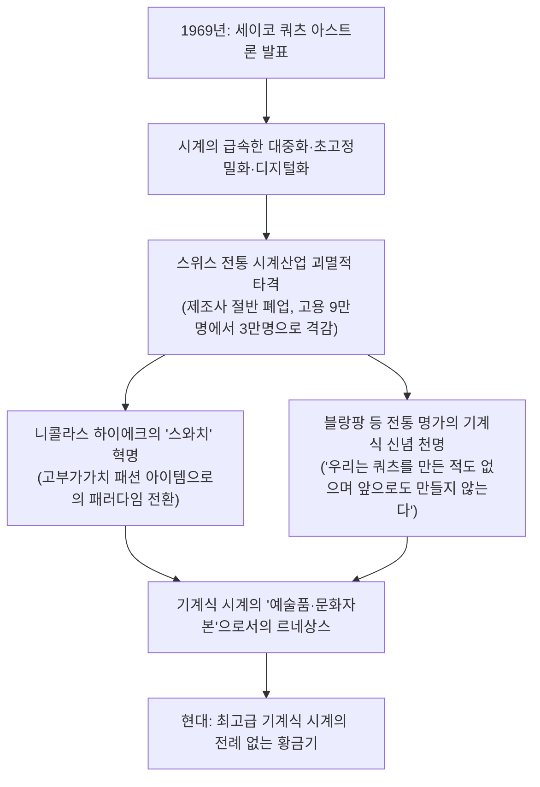
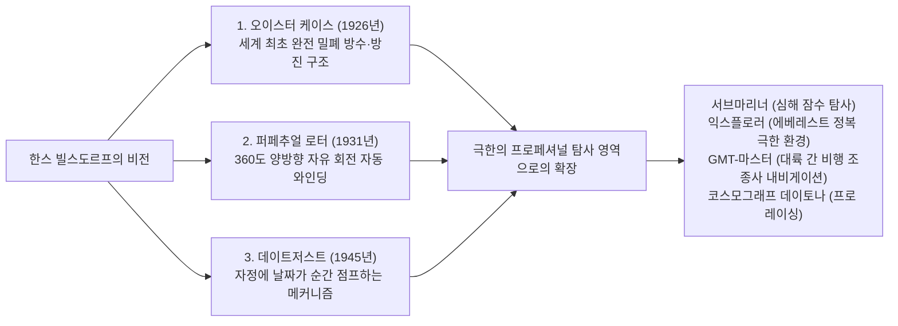

## 서론: 시간을 새기는 소우주로서의 기계식 시계

직경 불과 40밀리미터, 두께 수 밀리미터에 불과한 금속 케이스 내부에 수백 개에 달하는 극소형 톱니바퀴, 레버, 스프링, 루비 베어링이 빈틈없이 맞물려 단 1초의 오차도 없이 시간을 정확히 새겨나간다――바로 이것이 ‘기계식 시계(Mechanical Watch)’이다. 인류가 발명해 낸 정밀 기계공학의 역사 속에서 가장 작고, 가장 아름다우며, 가장 철학적인 ‘소우주(Microcosmos)’라 칭하기에 부족함이 없다.

쿼츠 시계와 스마트워치가 1초에 수만 번 진동하는 수정 진동자나 인공위성 원자시계의 신호를 통해 디지털로 시간을 표시하는 현대에, 왜 오직 태엽의 물리적 탄성력만으로 구동되는 기계식 시계가 여전히 전 세계 사람들을 매료시키며 수천만 원에서 수백억 원을 호가하는 예술품과 대등한 가치로 거래되는가?

그 이유는 기계식 시계가 단순한 ‘계시 도구’가 아니라, **“뉴턴 역학, 중력, 마찰력, 열팽창이라는 물리 법칙의 한계에 끊임없이 도전해 온 500년에 걸친 인류 지성의 결정체”**이기 때문이다. 그 작은 공간 속에는 아브라함-루이 브레게(Abraham-Louis Breguet)를 비롯한 천재 시계 장인들의 물리적 직관, 스위스 쥐라 산맥의 장인들이 대대로 계승해 온 극한의 수작업 마감 기법(Finishing), 그리고 인하우스 일관 생산(매뉴팩처, Manufacture)의 자부심이 응축되어 있다.

본 논고에서는 스위스 시계 산업의 태동사로부터 출발하여 기계식 무브먼트의 기구역학, 3대 컴플리케이션(투르비용, 퍼페추얼 캘린더, 미닛 리피터)의 미세 기하학, 세계 3대 시계를 위시한 유서 깊은 매뉴팩처들의 철학, 일본 그랜드 세이코가 도달한 스프링 드라이브의 하이브리드 물리학, 그리고 쿼츠 쇼크로부터 현대의 고급 기계식 시계 르네상스에 이르기까지, 학술적·기계공학적 엄밀함을 갖추어 그 전 체계를 철저히 규명한다.

```
【기계식 시계의 메커니즘 계층 아키텍처】

┌─────────────────┬───────────────────────────────┬───────────────────────────────┐
│ 기능 모듈       │ 주요 부품 및 메커니즘         │ 물리적 역할 및 지배 법칙      │
├─────────────────┼───────────────────────────────┼───────────────────────────────┤
│ 1. 동력부       │ 메인스프링(태엽), 배럴(태엽통)│ 감겨진 스프링의 탄성 위치에너 │
│ (Power Source)  │ (수동 와인딩 / 자동 로터)     │ 지 축적 및 안정적인 토크 공급 │
├─────────────────┼───────────────────────────────┼───────────────────────────────┤
│ 2. 전달부       │ 2번차, 3번차, 4번차           │ 기어비(증속 윤열)를 통하여     │
│ (Gear Train)    │ (기어 트레인·피니언·캐넌)   │ 높은 토크를 회전 속도로 변환  │
├─────────────────┼───────────────────────────────┼───────────────────────────────┤
│ 3. 탈진부       │ 이스케이프 휠, 팰릿 레버      │ 윤열의 회전을 주기적으로 제어,│
│ (Escapement)    │ (스위스 레버 탈진기)          │ 조속부로 미세한 충격 펄스 전달│
├─────────────────┼───────────────────────────────┼───────────────────────────────┤
│ 4. 조속부       │ 밸런스 휠, 헤어스프링         │ 단진동(등시성)을 기반으로     │
│ (Regulator)     │ (콜렛, 스터드, 완급침)        │ 정확한 '시간의 기준 진동' 창출│
├─────────────────┼───────────────────────────────┼───────────────────────────────┤
│ 5. 표시부       │ 아워 휠, 미닛 피니언, 시·분침│ 조속된 회전운동을 감속하여    │
│ (Display)       │ 초침, 다이얼(문자판)          │ 인간이 직관적으로 보는 시각화 │
└─────────────────┴───────────────────────────────┴───────────────────────────────┘
```

---

## 1. 시계 산업의 역사: 위그노 이주에서 발레 드 주의 기적까지

### 1.1 종교개혁과 스위스 시계 산업의 태동
기계식 시계의 기원은 13~14세기 유럽의 수도원과 도시 광장의 대형 탑시계로 거슬러 올라가지만, 그것이 주머니에 들어가는 ‘회중시계’, 나아가 손목에 차는 ‘손목시계’로 초소형화되고 스위스가 세계 최대의 시계 왕국으로 우뚝 서게 된 배경에는 격동의 종교사가 존재한다.

1541년, 제네바에서 종교개혁을 단행한 장 칼뱅(Jean Calvin)은 엄격한 금욕주의를 선포하고 보석과 장신구 착용을 ‘사치와 허영의 죄’로 규정하여 전면 금지하였다. 이 조치로 인해 제네바의 뛰어난 금세공 장인들과 조각가들은 순식간에 생계 수단을 잃고 파멸의 위기에 처했다.
그 절체절명의 위기 속에서 장인들이 찾아낸 새로운 활로가 바로 사치품이 아닌 ‘실용적인 계측 도구’로서 소지가 허용되었던 **‘휴대용 시계(Watch)의 제조’**였다. 금세공인들의 탁월한 금속 세공 기술이 정밀 시계 메커니즘과 융합되면서 제네바는 급속도로 고도화된 정밀 시계 제작 도시로 탈바꿈하였다.

또 다른 결정적인 역사적 분기점은 1685년 프랑스 국왕 루이 14세의 ‘낭트 칙령 폐지’였다. 신교도(위그노)에 대한 극심한 종교적 박해가 재개되자, 프랑스 전역에서 수만 명에 달하는 최정상급 시계 장인, 기계 기술자, 천문학자들이 제네바로 망명하였다. 이들의 유입은 스위스 시계 산업에 독보적인 기술적 기반을 제공하였다.

### 1.2 쥐라 산맥 ‘시계 계곡(발레 드 주)’과 에타블리사주 시스템
제네바에 집결한 장인들의 고급 기술은 점차 쥐라 산맥의 험준한 산골짜기인 ‘발레 드 주(Vallée de Joux / 주 계곡)’와 라쇼드퐁 일대로 확산되었다.

발레 드 주는 일 년 중 반년 동안 눈에 파묻히는 혹독한 한랭 산악 지대였다. 현지 농민들은 겨울철 농한기를 이용하여 자택 다락방에 커다란 채광창을 내어 자연광을 확보하고, 시계의 미세 부품(나사, 기어, 메인스프링, 탈진기 부품)을 온 가족이 수작업으로 가공해 내는 가내 수공업 체제를 구축하였다.
봄이 오고 눈이 녹으면, 제네바의 도매 상인(에타블리쇠르, Établisseur)들이 계곡을 돌며 각 가정의 정밀 부품들을 수거하여 제네바 공방에서 최종 조립과 정밀 조정(Assembly)을 수행하였다. 이 고도의 수평적 분업 체계를 **‘에타블리사주(Établissage)’**라 부른다. 이 독창적인 생산 네트워크가 스위스 시계에 압도적인 정밀도와 원가 경쟁력을 부여하였고, 영국과 프랑스의 보수적인 길드형 시계 공방들을 완전히 제압하는 결정적 원동력이 되었다.

---

## 2. 기계식 시계의 기구역학: 미시 물리학의 세계

### 2.1 조속 메커니즘의 심장: 밸런스 휠과 헤어스프링의 ‘등시성’
기계식 시계의 정확도를 지배하는 절대적인 물리 법칙은 갈릴레오 갈릴레이가 발견한 **‘진자의 등시성(Isochronism)’**이다.
진자는 진폭의 크기와 상관없이 한 번 왕복하는 데 걸리는 시간(주기)이 일정하다. 그러나 휴대용 회중시계나 손목시계에서는 중력에 의존하는 진자를 사용할 수 없으므로, **‘밸런스 휠(Balance Wheel)’**과 머리카락보다 가느다란 **‘헤어스프링(Balance Spring / Hairspring)’**의 결합에 의한 회전 비틀림 진동 시스템이 사용된다.

밸런스 휠의 진동 주기 $T$는 다음의 역학 공식으로 엄밀히 기술된다.

$$T = 2\pi \sqrt{\frac{I}{C}}$$

여기서 $I$는 밸런스 휠의 관성모멘트이며, $C$는 헤어스프링의 비틀림 강성(스프링 상수)이다.
이 공식이 보여주는 결정적인 물리적 진실은 **“진동 주기 $T$는 밸런스 휠의 진폭에 전혀 영향을 받지 않는다”**는 사실이다. 메인스프링이 가득 감겨 토크가 강할 때나, 태엽이 풀려 토크가 약해졌을 때나 상관없이 밸런스 휠은 항상 일정한 주기로 왕복 회전 운동을 반복한다. 이것이 바로 기계식 시계가 시간을 한결같이 정확히 측정할 수 있는 물리학적 근거이다.

```
【밸런스 휠 진동수(Frequency)와 정밀도의 상관관계】

· 5진동 (18,000 vph / 2.5Hz):
  초당 5회 진동(시간당 18,000회 진동). 앤틱 회중시계나 초기 손목시계의 저진동 무브먼트.
  '째깍·째깍' 하는 여유롭고 우아한 작동음을 울린다. 기계적 마모가 극히 적어 내구 수명이 매우 길다.

· 6진동 (21,600 vph / 3.0Hz):
  전통적인 수동 와인딩 무브먼트 및 클래식 명기(파텍 필립 Cal.215 등)의 표준 진동수.

· 8진동 (28,800 vph / 4.0Hz):
  현대 기계식 손목시계의 절대적 골드 스탠더드(롤렉스 Cal.3135/3235, ETA 2824 등).
  외부 충격 및 자세 변화에 대한 안정성과 윤활유 비산·부품 마모 간의 최적의 공학적 균형을 실현.

· 10진동 (36,000 vph / 5.0Hz):
  이른바 '하이비트(High-Beat)'. 초당 10회 진동하여 초침이 0.1초 단위로 움직여 초정밀 계측이 가능.
  제니스(Zenith)의 '엘 프리메로(El Primero)', 그랜드 세이코의 '9S85'가 대표적. 외란에 극히 강하나 윤활유 소모가 빠르며 미세 야금학과 초정밀 가공 기술이 요구됨.
```

### 2.2 스위스 레버 탈진기(Swiss Lever Escapement)의 역학 사이클
조속부(밸런스 휠)가 아무리 정확한 단진동 운동을 수행하더라도, 이를 톱니바퀴의 회전으로 변환하고 동시에 밸런스 휠에 에너지를 지속적으로 공급(임펄스)하지 않으면 밸런스는 마찰과 공기 저항으로 인해 결국 멈추고 만다. 이 미세하고도 정교한 동력 제어를 수행하는 핵심 기구가 바로 **‘탈진기(Escapement)’**이다.


스위스 레버 탈진기는 초당 5~10회의 빈도로 ‘정지·해제·충격 보충’이라는 밀리초 단위의 일련의 동작을 한 치의 오차도 없이 반복한다. 하루(86,400초) 동안 약 70만 회, 1년 동안 약 2억 5천만 회에 달하는 격렬한 금속과 보석 간의 충돌을 견디며 수년간 고장 없이 정확하게 작동하는 놀라운 기계적 신뢰성을 자랑한다.

### 2.3 완급침 방식 vs 프리스프렁 밸런스
시계의 일오차를 미세 조정하는 엔지니어링 접근법에는 크게 두 가지 상반된 철학이 존재한다.

1. **완급침 방식(Regulator Index)**:
   헤어스프링 외측을 두 개의 미세 핀(완급침) 사이에 끼우고 레버를 움직여 헤어스프링의 ‘유효 작동 길이’를 조절함으로써 진동 주기를 바꾼다. 조정이 간편하지만 강한 충격을 받으면 레버 위치가 미세하게 틀어질 위험이 있으며, 핀과 스프링의 접촉으로 인해 미세한 등시성 왜곡이 발생한다.
2. **프리스프렁 방식(Free Sprung Balance)**:
   파텍 필립의 ‘자이로맥스(Gyromax) 밸런스’와 롤렉스의 ‘마이크로스텔라(Microstella) 너트’로 대표되는 최고급 시계의 정점. 완급침 구조를 완전히 제거하고 헤어스프링 길이를 고정한 채, **밸런스 휠 림(외경 테두리)에 장착된 편심 추(조정 스크루나 너트)를 회전시켜 밸런스 휠 자체의 관성모멘트 $I$를 미세 가감**한다. 충격과 자세 차이에 극히 강해 오랜 기간 탁월한 정확도를 유지하지만, 고도로 숙련된 워치메이커의 장인 기술을 요구한다.

---

## 3. 3대 컴플리케이션(Grand Complications)의 공학적 해부

기본적인 시·분·초 표시 기능을 뛰어넘어 천문학적 역법, 음향 시각 알림, 중력 오차 자기 보정을 순수 기계식 메커니즘으로 구현해 내는 초정밀 기구를 ‘컴플리케이션(복잡 기구)’이라 부른다. 그리고 그 정상에 군림하는 기술이 바로 ‘3대 컴플리케이션’이다.

```
【3대 컴플리케이션의 공학적 분류 및 난제】

┌─────────────────┬───────────────────────────────┬───────────────────────────────┐
│ 컴플리케이션    │ 메커니즘의 물리적 난제        │ 해결을 위한 정밀 기계공학     │
├─────────────────┼───────────────────────────────┼───────────────────────────────┤
│ 투르비용        │ 수직 상태에서 지구 중력에 의해│ 탈진기와 밸런스 전체를 케이지에│
│ (Tourbillon)    │ 발생하는 헤어스프링 중력 편심 │ 넣고 1분당 360도 회전시켜 상쇄│
├─────────────────┼───────────────────────────────┼───────────────────────────────┤
│ 퍼페추얼 캘린더 │ 크고 작은 달(30/31/28일) 및   │ 4년 주기(48개월) 깊이 홈을 가진│
│ (Perpetual Cal) │ 4년 주기의 윤년 2월(29일) 판별│ 기계식 프로그램 캠(대레버 연동)│
├─────────────────┼───────────────────────────────┼───────────────────────────────┤
│ 미닛 리피터     │ 눈에 보이지 않는 현재 시각을  │ 다단 스네일 캠을 랙으로 감지, │
│ (Minute Repeater)순수 기계 타종 음향으로 변환 │ 정밀 해머로 공을 쳐서 시각 전달│
└─────────────────┴───────────────────────────────┴───────────────────────────────┘
```

### 3.1 투르비용(Tourbillon): 중력을 길들이는 회전 케이지
1801년, 천재 시계 장인 아브라함-루이 브레게(Abraham-Louis Breguet)가 발명한 투르비용(프랑스어로 ‘회오리바람’)은 기계식 시계 기술과 조형미의 최고봉으로 꼽힌다.

회중시계는 통상 신사의 조끼 주머니 속에 수직으로 오랜 시간 세워진 채 보관된다. 중력은 밸런스 휠과 헤어스프링에 항상 한 방향으로 일정하게 작용하여 헤어스프링이 아래로 처지며 무게중심이 틀어지고, 이로 인해 심각한 ‘자세차 오차(Position Error)’가 발생한다.
브레게는 혁신적인 물리적 착상을 떠올렸다. “지구의 중력을 없앨 수 없다면 조속 기구 자체를 공간에서 회전시켜 버리면 되지 않는가!”

브레게는 이스케이프 휠, 팰릿 레버, 밸런스 휠, 헤어스프링에 이르는 탈진·조속 기구 전부를 초경량 소형 새장과 같은 프레임인 **‘캐리지(케이지, Carriage / Cage)’** 내부에 통째로 수납하였다. 그리고 4번차를 중심축으로 삼아 캐리지 전체를 **‘1분에 정확히 1회전(360도)’**하도록 구동시켰다.
이렇게 하면 시계가 수직 상태에 머물더라도 밸런스에 작용하는 중력 벡터 방향이 1분 동안 전 방위(360도)로 균일하게 분산되어 중력에 의한 오차가 사이클 내에서 완벽하게 상쇄된다.
총중량이 0.2~0.3그램에 불과한 티타늄이나 경량 합금제 극소형 캐리지 속에 수십 개의 정밀 부품을 조립하고 마찰 없이 매끄럽게 회전시키는 기술은 현대에도 극소수 최상위 매뉴팩처만이 구현할 수 있다.

### 3.2 퍼페추얼 캘린더(Perpetual Calendar): 기계식 컴퓨터의 원조
일반적인 캘린더 시계는 매달 31일까지 날짜가 진행되므로 2월, 4월, 6월, 9월, 11월 말일에는 착용자가 용두를 뽑아 수동으로 날짜를 넘겨주어야 한다.

반면 퍼페추얼 캘린더(Perpetual Calendar)는 톱니바퀴의 기계식 메모리를 통해 **‘작은 달(30일)’과 ‘큰 달(31일)’은 물론 28일로 끝나는 평년의 2월과 29일이 존재하는 ‘윤년(4년에 1회)’의 2월까지 완벽하게 자동 판별**하여, 서기 2100년까지 어떠한 수동 수정도 없이 정확하게 날짜를 넘겨준다.

이 기계적 연산의 핵심 부품이 바로 **‘48개월 캠(윤년 기어)’**이다. 기어 외주에 48개월(4년 주기)에 걸친 서로 다른 깊이의 홈이 정밀하게 파여 있다:
- 31일인 달: 가장 얕은 홈
- 30일인 달: 중간 깊이의 홈
- 평년의 2월(28일): 가장 깊은 홈
- 윤년의 2월(29일): 다소 깊은 홈
이 홈의 깊이를 기다란 기계 레버(필러)가 물리적으로 감지하여 말일 자정에 날짜 디스크를 1일에서 최대 4일분까지 단숨에 점프시킨다. 전기가 존재하지 않던 시대에 고안된 순수 기계식 프로그래밍의 경이이다.

### 3.3 미닛 리피터(Minute Repeater): 음향 물리학의 극한
전등이 없던 시절, 칠흑 같은 어둠 속에서 회중시계를 꺼내어 케이스 측면의 슬라이드 레버를 밀면 맑고 청아한 종소리가 “딩, 딩…… 딩·동, 딩·동…… 동, 동” 울려 퍼지며 현재 시각을 분 단위까지 소리로 알려주던 기구――그것이 바로 미닛 리피터이다.

- **저음 (시간 타종)**: 묵직한 저음 해머가 “딩”을 울려 ‘몇 시’인지를 알림 (최대 12회)
- **고저 복합음 (15분 타종)**: 두 개의 해머가 교대로 “딩·동”을 울려 ‘15분 단위(15분, 30분, 45분)’를 알림 (최대 3회)
- **고음 (단위 분 타종)**: 청명한 고음 해머가 “동”을 울려 15분 단위 뒤에 남은 ‘1~14분’을 알림 (최대 14회)
(예: 7시 42분의 경우 → 저음 7회 + 복합음 2회(30분) + 고음 12회 = 총 42분)

무브먼트 외주에는 특수 열처리된 강철 합금제 링 형태의 ‘공(Gong)’ 두 가닥이 감겨 있으며 소형 ‘해머(Hammer)’가 이를 타격한다.
레버를 당기는 순간 시·쿼터·분을 관장하는 달팽이 모양의 계단식 캠(스네일)과 랙이 맞물려 시각 정보를 기계적으로 판독한다. 타종 템포를 일정하게 유지하기 위해 공기 저항을 응용한 ‘회전식 에어 거버너(감속 조속기)’가 정숙하게 고속 회전한다. 맑고 긴 여운의 아름다운 음색을 구현하기 위해 케이스 소재의 음향 전달 특성(로즈골드, 티타늄, 플래티넘의 음향 임피던스)까지 치밀하게 계산된다.

---

## 4. 세계 최고봉 매뉴팩처와 명문의 철학

시계업계에서 외부 제조사로부터 무브먼트를 납품받아 케이스에 조립하는 브랜드(에타블리쇠르)와 달리, 무브먼트의 설계·개발부터 부품 가공, 조립, 조정, 수작업 마감까지 사내에서 자체적으로 일관 생산하는 브랜드를 **‘매뉴팩처(Manufacture)’**라 부르며 최고의 존경을 표한다.

```
【세계 최정상 매뉴팩처 및 상징적 마스터피스】

┌─────────────────┬───────────┬───────────────────────────────┐
│ 브랜드 명칭     │ 창립 연도 │ 철학·상징적 모델·기술적 특장  │
├─────────────────┼───────────┼───────────────────────────────┤
│ 파텍 필립       │ 1839년    │ 세계 3대 시계의 정점. 독자적인│
│ (Patek Philippe)│ 스위스    │ 파텍 필립 실. 칼라트라바, 노틸│
│                 │           │ 러스. 대를 이어 계승되는 가치 │
├─────────────────┼───────────┼───────────────────────────────┤
│ 오데마 피게     │ 1875년    │ 럭셔리 스포츠 워치의 원조.    │
│ (Audemars       │ 스위스    │ 1972년 제랄드 젠타가 빚어낸   │
│  Piguet)        │           │ 로열 오크로 고급 시계 패러다임│
├─────────────────┼───────────┼───────────────────────────────┤
│ 바쉐론          │ 1755년    │ 창립 이래 단 한 번도 역사가   │
│ 콘스탄틴        │ 스위스    │ 끊기지 않은 세계 최장수 시계사│
│ (Vacheron C.)   │           │ 패트리모니, 오버시즈. 전통 집대성│
├─────────────────┼───────────┼───────────────────────────────┤
│ A. 랑에 운트    │ 1845년    │ 독일 정밀 시계의 절대적 정점. │
│ 죄네 (A. Lange) │ 독일      │ 저먼 실버 3/4 플레이트, 이중  │
│                 │           │ 조립 방식. 랑에 1의 기하학 미학│
├─────────────────┼───────────┼───────────────────────────────┤
│ 롤렉스          │ 1905년    │ 실용 럭셔리 워치의 절대 군주. │
│ (Rolex)         │ 스위스    │ 오이스터 케이스, 퍼페추얼 로터│
│                 │           │ 극도의 신뢰성과 독자 야금 공학│
├─────────────────┼───────────┼───────────────────────────────┤
│ 오메가          │ 1848년    │ 아폴로 달 착륙 공식 시계 초파,│
│ (OMEGA)         │ 스위스    │ 코액시얼 탈진기 및 강력한 항자│
├─────────────────┼───────────┼───────────────────────────────┤
│ 그랜드 세이코   │ 1960년    │ 기계식 태엽과 쿼츠의 정밀도를 │
│ (Grand Seiko)   │ 일본      │ 융합한 독자 기구 스프링 드라이브│
└─────────────────┴───────────┴───────────────────────────────┘
```

### 4.1 파텍 필립(Patek Philippe): 시계 제국의 황제
1839년 창립된 파텍 필립은 빅토리아 여왕, 알베르트 아인슈타인, 차이콥스키 등 역사적 거인들의 사랑을 받아 온 의심할 여지 없는 시계계의 제왕이다.
‘칼라트라바(Calatrava)’가 보여주는 원형 드레스 워치의 궁극적 황금비율, ‘노틸러스(Nautilus)’가 정의한 럭셔리 스포츠 워치의 세련미.
파텍 필립은 스위스 제네바주의 공적 품질 인증인 ‘제네바 실’을 뛰어넘는 독자적인 엄격한 기준인 ‘파텍 필립 실(PP Seal)’을 제정하였다. 일오차 −3~+2초라는 극상의 정밀도와 함께, 창립 이래 생산된 모든 시계의 영구 수리(리스토어)를 보증한다. “파텍 필립을 소유한다는 것은 다음 세대에게 물려주기 위해 잠시 맡아두는 것에 불과하다”라는 불멸의 광고 카피는 시계를 초월한 인류 문화유산으로서의 자긍심을 대변한다.

### 4.2 A. 랑에 운트 죄네(A. Lange & Söhne): 독일 정밀공학의 부활
독일 동부 작센주 오레 산맥의 글라슈테 마을에서 1845년 페르디난트 아돌프 랑에가 설립한 랑에 운트 죄네. 제2차 세계대전의 참화와 구동독 체제 하에서의 국유화·브랜드 소멸이라는 비극을 겪었으나, 1990년 동서독 통일과 함께 창립자의 증손자인 발터 랑에(Walter Lange)의 손에 의해 기적적으로 부활하였다.

랑에의 시계는 스위스 시계와는 궤를 달리하는 게르만 정밀공학 특유의 이성적 조형미를 뿜어낸다:
- **저먼 실버(양은) 3/4 플레이트**: 무브먼트의 대부분을 한 장의 무도금 저먼 실버 플레이트로 덮어 경이로운 구조적 강성을 확보한다. 세월의 흐름에 따라 표면이 은은한 황금빛 파티나(고색)로 에이징된다.
- **골드 샤톤 스크루 고정**: 인공 루비 베어링을 18K 순금 샤톤 링에 장착하고 전통 방식으로 구워낸 블루 스크루로 플레이트에 단단히 고정한다.
- **수작업 인그레이빙 밸런스 콕**: 모든 시계의 밸런스 콕에 장인이 정으로 수작업 꽃무늬 조각을 새겨 넣어 전 세계에 동일한 무브먼트가 단 하나도 존재하지 않는다.
- **이중 조립 방식(Double Assembly)**: 모든 무브먼트를 1차 조립하여 완벽히 테스트한 뒤, 전부 다시 분해하여 부품을 재세척·수작업 재마감한 후 2차 최종 조립을 거치는 결벽에 가까운 완벽주의를 고수한다.

### 4.3 그랜드 세이코와 ‘스프링 드라이브’의 하이브리드 물리학
1960년, 스위스의 크로노미터 기준을 능가하는 세계 최고 수준의 정밀 실용 시계를 목표로 탄생한 세이코의 ‘그랜드 세이코(Grand Seiko)’.
그 기술적 정점은 20년 이상의 끈질긴 연구개발 끝에 1999년 완성된 혁신 기구 **‘스프링 드라이브(Spring Drive)’**이다.

```
【스프링 드라이브(트라이신크로 레귤레이터)의 마이크로 시스템 동역학】

[기계식 에너지원: 메인스프링(Mainspring)]
· 배터리나 외부 전기 모터를 일체 사용하지 않음. 기계식 태엽이 풀리는 탄성 복원력으로 구동.
  ↓
[기어 트레인을 통한 토크 증속]
  ↓
[글라이드 휠(자기 로터)의 고속 회전: 초당 8회전]
· 회전자가 스테이터 코일을 통과하며 패러데이 전자기 유도 법칙에 의해 극미세 유도기전력(나노와트급 발전) 발생.
  ↓
[초저전력 쿼츠 IC 및 수정 진동자 활성화]
· 자체 발전된 미세 전력으로 32,768Hz의 고정밀 쿼츠 수정 진동자와 초저전력 제어 IC 가동.
  ↓
[비접촉 전자기 유도 브레이크를 통한 무단 조속]
· IC가 쿼츠 신호와 글라이드 휠의 회전 속도를 초당 수백 회 비교 분석.
· 회전 속도가 빠르면 전자석의 와전류 제동(자기 브레이크)을 가해 매끄럽게 감속,
  글라이드 휠의 속도를 정확히 '초당 8회전'의 등속 회전으로 정밀 제어.
```

스프링 드라이브의 초침은 기계식 시계의 틱틱거리는 단속적 박동이나 쿼츠 시계의 1초 단위 끊김이 전혀 없이, 밤하늘을 흐르는 혜성처럼 완전한 무음으로 다이얼 위를 미끄러지는 **‘글라이드 모션(Glide Motion, 스위프 운침)’**을 그린다. 기계식 시계의 영구적인 토크 수명과 쿼츠의 ‘월오차 ±15초’라는 절대적 정밀도를 하나로 결합한 아시아 시계 공학사 최대의 혁신이다.

---

## 5. 쿼츠 쇼크와 기계식 시계 르네상스의 경제사상사

1969년 12월 25일, 세이코가 세계 최초의 상용 쿼츠 손목시계 ‘쿼츠 아스트론 35SQ’를 발표하였다. 일오차 ±0.2초(월오차 ±5초 이내)라는, 기존 기계식 시계의 수백 배에 달하는 초정밀 전자시계의 출현은 전 세계 시계 산업에 거대한 지각변동을 불러일으켰다. 이것이 바로 **‘쿼츠 쇼크(Quartz Crisis)’**이다.



스위스 시계 산업은 존폐의 기로에 섰으며, 유구한 역사를 자랑하던 수백 개의 매뉴팩처가 파산으로 내몰렸다.
그러나 이 극한의 위기가 오히려 기계식 시계의 ‘본질적 가치’를 정제시키는 계기가 되었다.
시계의 존재 이유가 오직 ‘정확한 시간을 확인하는 도구’에 불과하다면 저렴한 플라스틱 전자시계나 스마트폰 화면으로 충분하다. 하지만 인간이 손목 위에 올리는 것은 단순한 계측기 이상의 의미를 지닌다.
수백 년 전과 다름없는 뉴턴 역학에 따라 맞물려 돌아가는 기어의 따스한 기계적 온기, 장인이 현미경 아래에서 손으로 깎아낸 코트 드 제네바와 페를라주의 조형미, 그리고 부모에게서 자식에게로 세대를 뛰어넘어 계승되는 영속성.

장-클로드 비버(Jean-Claude Biver)와 니콜라스 G. 하이에크(Nicolas G. Hayek) 등의 탁월한 사상적 전환을 통해 기계식 시계는 ‘시간을 보는 기계’에서 **‘인간의 영혼과 장인정신이 깃든 착용 가능한 예술품(웨어러블 문화유산)’**으로 극적인 승화를 이루어냈다. 현대 사회에서 기계식 시계에 쏟아지는 열광적인 찬사는 고도로 디지털화된 가상 사회에 대한 인간의 물리적 실체성과 물성에 대한 심미적 회귀 본능인 것이다.

---

## 3.4 크로노그래프(Chronograph)의 기구역학: 스톱워치의 정밀공학

컴플리케이션 중에서도 모터스포츠, 항공비행, 천문 관측과 가장 밀접하게 호흡하며 발전한 장르가 바로 경과 시간을 정밀하게 측정하는 ‘크로노그래프(스톱워치 일체형 시계)’이다. 크로노그래프의 조작감과 계측 신뢰성은 ‘제어 메커니즘’과 ‘동력 전달(클러치) 방식’의 공학적 조합에 의해 결정된다.

```
【크로노그래프 무브먼트의 2대 제어 방식 및 2대 클러치 구조】

┌─────────────────┬───────────────────────────────┬───────────────────────────────┐
│ 기구 분류       │ 방식 명칭                     │ 공학적 특장점 및 작동 거동    │
├─────────────────┼───────────────────────────────┼───────────────────────────────┤
│ 조작 제어 기구  │ 1. 컬럼 휠 방식               │ 원통형 기어 위에 균등한 기둥이│
│                 │ (Column Wheel)                │ 늘어선 구조. 푸셔 터치감이 부 │
│                 │                               │ 드러움. 하이엔드 크로노의 상징│
├─────────────────┼───────────────────────────────┼───────────────────────────────┤
│                 │ 2. 캠-레버 방식               │ 프레스 가공된 평판 캠이 전후  │
│                 │ (Cam-Actuated)                │ 로 이동. 내구성 우수, 양산형  │
│                 │                               │ 작동감이 다소 묵직하고 단단함 │
├─────────────────┼───────────────────────────────┼───────────────────────────────┤
│ 동력 전달 방식  │ 1. 수평 클러치                │ 4번차 옆의 중간 휠이 수평면   │
│ (클러치)        │ (Lateral / Horizontal Clutch) │ 상에서 측면으로 스윙하여 결합 │
│                 │                               │ 기어 맞물림이 노출되어 심미적 │
├─────────────────┼───────────────────────────────┼───────────────────────────────┤
│                 │ 2. 수직 클러치                │ 마찰 디스크를 상하 수직축에서 │
│                 │ (Vertical Clutch)             │ 압착. 결합 시 초침 튐이 전혀  │
│                 │                               │ 없으며 항시 가동 시에도 안정  │
└─────────────────┴───────────────────────────────┴───────────────────────────────┘
```

전통적인 수평 클러치는 스타트 버튼을 누르는 순간 고속 회전 중인 기어의 톱니 끝부분끼리 측면에서 충돌하기 때문에 크로노그래프 초침이 순간적으로 펄쩍 뛰는 ‘핸드 점핑(Hand Jumping)’ 현상을 물리적으로 피할 수 없었다.
반면 현대 고성능 크로노그래프(롤렉스 데이토나 Cal.4130/4131, 오메가 스피드마스터, 브라이틀링 Cal.01 등)가 채택한 **‘수직 클러치’**는 위아래의 마찰 디스크가 수직 방향에서 면접촉으로 압착되기 때문에 초침 튐이 원천적으로 발생하지 않으며, 크로노그래프를 상시 작동시켜 두어도 시계의 기본 시간 정확도와 밸런스 진폭에 악영향을 주지 않는 압도적인 실용성을 발휘한다.

### 플라이백 및 스플릿 세컨드(라트라팡테)
- **플라이백(Flyback)**: 시간 측정 도중 리셋 버튼을 누르면 ‘정지·영점 복귀·재시작’의 3단계를 단 한 번의 푸시로 연속 실행하는 기구. 전투기 조종사가 비행 중 연속으로 선회 시간을 측정하기 위해 개발되었다.
- **스플릿 세컨드(라트라팡테 / Rattrapante)**: 포개어진 두 개의 크로노그래프 초침이 동시에 달리다가 전용 푸셔를 누르면 바늘 하나가 멈추어 중간 경과 시간(스플릿 타임)을 표시하고, 다시 누르면 멈추었던 바늘이 달려가던 다른 바늘의 위치로 순간 점프하여 완벽히 합체하는 크로노그래프 기계공학의 최고봉.

---

## 2.4 탈진기의 250년 만의 혁신: 코액시얼과 실리콘 소재과학

200년 넘게 스위스 레버 탈진기가 독점해 온 시계업계에 20세기 말부터 21세기 초에 걸쳐 마찰과 자기라는 ‘2대 난제’를 근본적으로 퇴치하는 기술 혁명이 일어났다.

### 1. 조지 대니얼스의 ‘코액시얼 탈진기(Co-Axial Escapement)’
영국의 독립 시계 장인 조지 대니얼스(George Daniels)가 1970년대에 발명하고, 1999년 오메가(OMEGA)가 상용화에 성공한 코액시얼 탈진기는 시계 역사에 남을 대사건이었다.

기존 레버 탈진기는 팰릿 레버의 루비와 이스케이프 휠의 톱니가 강하게 미끄러지며 마찰(미끄럼 마찰)하기 때문에 윤활유가 필수적이었으며, 기름의 산화·건조가 정확도 저하의 주원인이었다.
코액시얼 탈진기는 동일한 축(Co-Axial) 위에 겹쳐진 두 장의 이스케이프 휠과 3개의 팰릿을 사용하여 기어가 팰릿을 **‘직각에 가깝게 밀어내는(점접촉 밀어내기)’** 기하학적 운동을 완성했다. 미끄럼 마찰이 거의 제로에 가깝게 감소하면서 탈진기 주유의 필요성이 극적으로 줄어들었고, 오버홀 주기를 기존 3~5년에서 8~10년으로 획기적으로 연장시켰다.

### 2. 실리콘(단결정 규소) 부품의 하이테크 혁신
2000년대 이후 파텍 필립, 롤렉스, 오메가, 브레게 등이 스위스 미세기술연구소와 공동 연구를 통해 반도체 초미세 가공 기술(DRIE: 심도 반응성 이온 식각)을 응용한 실리콘 부품을 실용화하였다.
- **완전한 항자성**: 실리콘은 비금속 물질이므로 스마트폰이나 자석의 강력한 자장에 노출되어도 자화되지 않는다.
- **완벽한 등시성과 온도 보상**: 실리콘 표면에 열산화 이산화규소 층을 증착 코팅(파텍 필립 스피로맥스 등)하여 온도 변화에 따른 탄성계수 변화를 정밀하게 상쇄한다.
- **초경량과 원자 단위 평활성**: 금속에 비해 질량이 현저히 가볍고 표면이 분자 단위로 매끄러워往복 진동 시 관성 손실과 에너지 낭비가 획기적으로 줄어든다.

---

## 4.4 롤렉스(Rolex): 실용 럭셔리 워치의 기술적 패권

1905년 독일인 한스 빌스도르프(Hans Wilsdorf)가 런던에서 창립(이후 스위스 제네바로 이전)한 롤렉스는, 귀족들의 연약한 장신구에 불과하던 손목시계를 ‘가장 가혹한 환경에서도 오차 없이 작동하는 궁극의 실용 장비’로 재정의한 거인이다.



### 오이스터스틸(904L 합금)과 사내 독자 야금 공학
롤렉스의 전설적인 내구성을 지탱하는 근간은 일반 고급 시계가 사용하는 ‘316L 스테인리스 스틸’ 대신 화학 플랜트나 항공우주 산업에서 쓰이는 초내식성 합금인 **‘오이스터스틸(904L 슈퍼 오스테나이트계 스테인리스 스틸)’**을 전량 채택한 데 있다.
크롬, 몰리브덴, 니켈, 구리를 고농도로 함유하여 해수나 땀의 염소 이온에 의한 점식 및 틈새 부식에 극히 강하며, 폴리싱 가공 시 플래티넘처럼 백색의 깊고 영롱한 광채를 뿜어낸다. 롤렉스는 본사 내에 전용 금 주조소를 보유하여 색이 바래지 않는 독자 배합의 ‘에버로즈 골드’를 직접 주조하는 등 기초 소재 야금학 차원에서부터 완벽한 기술적 독점을 확립하고 있다.

---

## 5.2 시계 무브먼트의 피니싱(Finishing)과 장식 공예의 미학

고급 기계식 시계가 지닌 예술적 가치의 절반 이상은 무브먼트 표면에 가해지는 장인의 수작업 ‘피니싱(Finishing, 마감)’에 있다. 피니싱은 단순한 시각적 장식이 아니라 금속 가공 시 발생하는 미세한 버(Burr)를 제거하고 산화(녹)를 방지하며 미세 먼지의 유입을 포집하는 중요한 공학적 기능을 담당한다.

```
【최고급 무브먼트에 적용되는 전통 수작업 마감 기법】

1. 앙글라주 (Anglage / 모따기):
   플레이트와 브리지의 90도 직각 모서리를 장인이 줄(File)과 용담풀 나무 막대, 다이아몬드 페이스트를 사용하여 수작업으로 45도 균일한 평면이나 곡면으로 깎아내고 거울처럼 광택을 낸다. 빛을 반사하여 기계 부품의 윤곽을 입체적으로 부각시킨다.

2. 코트 드 제네바 (Côtes de Genève / 제네바 스트라이프):
   회전 연마 공구를 브리지 표면에 수평으로 일정하게 이동시켜 규칙적인 물결 모양의 평행 스트라이프 패턴을 새기는 기법. 시선 각도에 따라 빛과 그림자가 우아하게 교차한다.

3. 페를라주 (Perlage / 원형 연마):
   메인 플레이트 등 눈에 띄지 않는 기저 표면에 소형 원형 스케일 문양을 빈틈없이 겹쳐서 연마하는 기법. 미세한 유동 분진을 포착하고 윤활유막 유지를 돕는다.

4. 블랙 폴리시 (Poli Noir / 거울 연마):
   나사 머리나 투르비용 케이지 등의 강철 부품을 산화 알루미늄 분말을 도포한 아연판 위에서 손으로 '8'자 모양으로 완벽히 평평해질 때까지 수시간 동안 연마한다. 특정 각도에서 보면 빛을 100% 한 방향으로 반사하여 칠흑같이 어두운 검은색(Black)으로 보인다 하여 이름 붙여진 피니싱의 정점.
```

제네바주 의회가 법률로 제정한 **‘제네바 실(Poinçon de Genève)’**은 모든 강철 부품의 모서리가 앙글라주 마감되어야 하고, 나사 머리가 완벽히 경면 연마되어야 하며, 루비 베어링 홀이 폴리싱되어야 한다는 등 12가지 엄격한 기술적·심미적 규정을 통과한 무브먼트에만 각인되는 스위스 시계의 최고 영예이다.

---

## 4.5 독립 시계 장인(AHCI)의 도전과 울트라 하이엔드 현대 조각

거대 자본의 럭셔리 그룹(리슈몽, 스와치, LVMH)이 지배하는 현대 시계 산업 환경 속에서, 개인 워치메이커가 독립 공방에서 타협 없는 철학을 시계로 빚어내는 ‘독립시계제작자협회(AHCI / Académie Horlogère des Créateurs Indépendants)’의 존재는 기계식 시계의 예술적 순도를 극상으로 끌어올리고 있다.

```
【현대의 전설적 독립 시계 장인과 익스트림 오롤로지】

1. 필립 듀포 (Philippe Dufour):
   · 스위스 르 상티에의 작은 공방에서 조수 한 명 없이 홀로 시계를 제작하는 현존 최고의 거장.
   · '심플리시티(Simplicity)': 시·분·초만 표시하는 심플한 3침 시계이나, 무브먼트의 안쪽 모따기(인테리어 앙글라주) 폭과 유려한 곡면 마감은 인류 역사상 최고봉으로 칭송받음.
   · '듀얼리티(Duality)': 두 개의 독립된 밸런스 휠을 차동 기어(디퍼렌셜 기어)로 연결하여 기계식으로 오차를 실시간 평균 상쇄하는 세계 최초의 더블 밸런스 손목시계.

2. F.P. 주른 (François-Paul Journe):
   · 'Invenit et Fecit (내 발명하고, 내 만들었다)'를 브랜드 철학으로 삼는 천재 시계 장인.
   · '크로노미터 레조낭스': 두 개의 밸런스 휠을 수 밀리미터 간격으로 초근접 배치하여 공기 진동과 플레이트의 미세 공명 현상(Resonance)을 통해 두 밸런스의 진동을 완전 동기화시킨 음향역학 마스터피스.
   · 무브먼트의 메인 플레이트와 모든 브리지에 18K 로즈골드를 사용하는 독보적 설계.

3. 리차드 밀 (Richard Mille):
   · '손목 위의 F1 머신'을 표방하는 21세기 하이퍼 워치의 개척자.
   · 카본 TPT, 5등급 티타늄, 통 사파이어 크리스털 등 최첨단 항공우주 소재 전면 도입.
   · 테니스 스타 라파엘 나달이 실제 경기에서 시속 200km 이상의 서브를 넣으며 착용해도 끄떡없는 '5,000G~12,000G 내충격성'의 투르비용을 개발. 수억 원에서 수십억 원대에 이르는 초고가로 슈퍼리치의 상징으로 군림.
```

---

## 2.5 시계의 숙적 ‘자기장’과의 사투: 항자 공학의 진화사

현대 사회는 스마트폰, 태블릿, 무선 이어폰 케이스 자석 단추, 인덕션 등 강력한 자기장을 내뿜는 전자기기로 둘러싸여 있다. 기계식 시계에 있어 **‘자화(Magnetization)’**는 정확도를 무너뜨리는 가장 흔하고 치명적인 현대적 위협이다.

강철 합금제 헤어스프링이 자성을 띠면 스프링의 코일끼리 서로 들러붙어 유효 진동 길이가 극단적으로 짧아지며 하루에 수십 분에서 수 시간씩 빨라지는 치명적인 시간 왜곡이 발생한다.

```
【기계식 시계 항자 공학의 2대 접근법】

1. 차폐 방식 (패러데이 케이지 실드 공학):
   · 원리: 무브먼트 전체를 '연철 내부 케이스'로 둘러싼다.
   · 메커니즘: 외부에서 유입된 자력선이 투자율이 높은 연철 내부를 우선적으로 우회(바이패스)하여 통과함으로써 내부의 정밀 무브먼트를 보호.
   · 대표작: IWC 인제니어, 롤렉스 밀가우스 (1,000가우스 항자성).
   · 한계점: 연철 덮개로 인해 케이스가 두껍고 무거워지며, 시스루 백(사파이어 글라스 투명 케이스백) 적용이 불가능.

2. 비자성 소재 방식 (신소재 물질 혁명):
   · 원리: 헤어스프링, 팰릿 레버, 이스케이프 휠 자체를 자성의 영향을 일체 받지 않는 비철금속, 세라믹, 실리콘 소재로 제조.
   · 대표작: 오메가 '마스터 크로노미터' (15,000가우스 = 병원 MRI 장비의 강력한 자기장 앞에서도 끄떡없는 절대 항자성). Si14 실리콘 헤어스프링, 리퀴드메탈, 티타늄 부품 채택.
   · 성과: 케이스 두께를 늘리지 않고도 투명 사파이어 글라스백을 통해 무브먼트의 박동을 감상할 수 있는 완벽한 항자 시계 실현.
```

---

## 5.5 스위스 시계의 품질 인증 규격: 제네바 실과 COSC 크로노미터 검정

고급 기계식 시계의 영구적인 가치와 정확도를 객관적으로 보증하는 것은 독립된 제3자 공적 검정 기관의 엄격한 규격이다.

```
【스위스 시계 산업의 핵심 품질 검정 기준】

1. COSC (스위스 공식 크로노미터 검정 협회 / Contrôle Officiel Suisse des Chronomètres):
   · 기관 개요: 스위스 내에서 제조된 무브먼트 단체만을 대상으로 하는 고정밀 보도(步度) 검정.
   · 검정 프로세스: 케이스에 조립되지 않은 순수 무브먼트를 전용 프레임에 고정하여 5가지 일상 착용 자세(다이얼 위, 다이얼 아래, 3시 위, 6시 위, 9시 위)와 3가지 극한 온도(8℃, 23℃, 38℃) 조건에서 15일 밤낮으로 연속 정밀 측정.
   · 합격 기준: 평균 일오차 '-4초~+6초 이내' (직경 20mm 이상 무브먼트 기준). 스위스 전체 생산 시계 중 단 수 퍼센트만이 이 인증을 통과.

2. 제네바 실 (Poinçon de Genève / 제네바 시 문장 각인):
   · 역사적 배경: 1886년 제네바주 법률로 공포된 시계업계 최고의 영예와 전통을 상징하는 원산지 및 수작업 마감 인증.
   · 법적 요건: 반드시 제네바주 내에 공방을 두고 그곳에서 부품 조립, 조정, 케이싱 검사가 완결된 시계에만 신청 자격 부여.
   · 전통적 12가지 엄격한 기술·장식 규정:
     - 모든 강철 부품의 모서리는 수작업으로 면취(앙글라주) 마감되어야 하며 측면은 헤어라인, 연마면은 거울처럼 광택 처리될 것.
     - 나사 머리와 슬롯(홈)은 완벽히 경면 연마되거나 챔퍼링 가공될 것.
     - 휠 톱니의 상하 양면은 모따기되고 피니언(축)의 축경과 단면은 완벽히 미러 폴리싱될 것.
     - 루비 베어링의 홀은 매끄럽게 폴리싱 처리되고 오일 싱크가 정밀하게 확보될 것.
   · 현대의 동적 추가 규정: 2011년 전면 개정 이후 정적 무브먼트 단체뿐 아니라 케이스에 수납된 완성 시계 상태로 모의 착용 시뮬레이터에서 일오차 '-1초~+1초 이내', 실제 방수 기능, 파워리저브 구동 시간, 모든 부가 기능의 완벽한 연동을 종합 검증하는 동적 테스트가 전면 의무화됨. 파텍 필립이 독자 실로 전환한 이후에도 바쉐론 콘스탄틴과 로저 드뷔(Roger Dubuis) 등이 이 유서 깊은 문장을 지키고 계승하고 있다.
```

---

## 6. 결론: 소우주를 손목에 품는다는 것

기계식 시계를 손목에 올리고 용두를 엄지와 검지 끝으로 천천히 감아올린다. 손가락 끝을 타고 전해지는 태엽 기어의 미세한 저항감과 시계에 귀를 가까이 대었을 때 들려오는 “치치치치……” 하는 밸런스 휠의 심장 박동 소리.

그 작은 공간 안에는 500년 전 뉘른베르크의 페터 헨라인(Peter Henlein)이 휴대용 태엽을 발명한 이래 수많은 세대의 시계 장인들이 평생을 바쳐 깎아 올린 지혜가 숨 쉬고 있다. 그들은 종교 박해와 전란, 기술 격변의 소용돌이 속에서도 묵묵히 “시간이라는 비가역적 물리량을 어떻게 가장 정확하고, 가장 아름답게 포착할 것인가”라는 근원적 질문을 멈추지 않았다.

오늘날 우리는 스마트폰 액정을 켜는 것만으로도 GPS 위성이 보정한 1조 분의 1초 단위의 원자시계 정밀도로 현재 시각을 확인할 수 있다.
그러나 내 손목 위에서 작은 태엽이 풀리고 밸런스가 왕복하며 시계바늘을 미세하게 밀어내는 모습을 응시할 때, 우리는 자신이 지구의 중력과 밤낮의 자전, 나아가 광활한 우주의 섭리 한가운데에 살아 숨 쉬고 있다는 사실을 그 무엇보다 생생하게 실감한다.

기계식 시계란 유한한 생을 살아가는 인간이 영원한 시간이라는 심연에 맞서기 위해 연마해 낸, 가장 다정하고도 숭고한 ‘이성의 갑옷’인 것이다.
