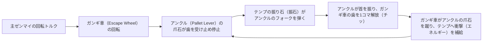
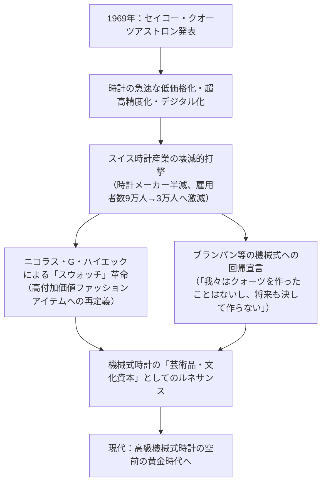
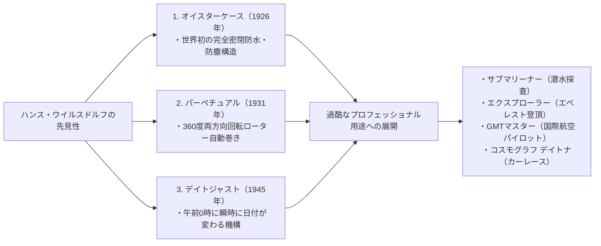

## 序論：時を刻む小宇宙としての機械式時計

直径わずか40ミリメートル、厚さ数ミリメートルの金属製ケースの内部に、数百点もの極小歯車、レバー、バネ、ルビー軸受が組み込まれ、一秒の狂いもなく正確に時を刻み続ける――「機械式時計（Mechanical Watch）」。それは、人類が発明した精密機械工学の中で、最も小さく、最も美しく、そして最も哲学的な「小宇宙（ミクロコスモス）」である。

クォーツ時計やスマートウォッチが1秒間に何万回もの水晶振動子や原子時計の信号によってデジタルに時刻を表示する現代において、なぜゼンマイの物理的な弾性力だけで駆動する機械式時計が、今なお世界中の人々を魅了し、数千万円から数十億円という芸術品と同等の価値で取引されるのか。

その理由は、機械式時計が単なる「計時ツール」ではなく、**「ニュートン力学、重力、摩擦、熱膨張という物理法則の限界に挑み続けてきた500年にわたる人類の知性の結晶」**だからである。そこには、アブラアン＝ルイ・ブレゲをはじめとする天才時計師たちの物理的直観、スイス・ジュラ山脈の職人たちが受け継いできた極限の手工芸技術（フィニッシング）、そして自社一貫製造（マニュファクチュール）の誇りが凝縮されている。

本稿では、スイス時計産業の誕生史から出発し、機械式ムーブメントの機構力学、三大複雑機構（トゥールビヨン・パーペチュアルカレンダー・ミニッツリピーター）の微小幾何学、世界三大時計をはじめとする名門ブランドの哲学、日本のグランドセイコーが到達したスプリングドライブのハイブリッド物理学、そしてクォーツショックから現代の高級時計ルネサンスに至るまで、学術的・機構工学的厳密さをもってその全体系を徹底解明する。

```
【機械式時計の機構階層アーキテクチャ】

┌─────────────────┬───────────────────────────────┬───────────────────────────────┐
│ 機能モジュール  │ 主要部品・メカニズム          │ 物理的役割と支配法則          │
├─────────────────┼───────────────────────────────┼───────────────────────────────┤
│ 1. 動力部       │ 主ゼンマイ、香箱車（バレル）  │ 巻き上げられたバネの弾性エネル│
│ （Power Source）│ （手巻き / 自動巻きローター） │ ギーの蓄積とトルクの安定供給  │
├─────────────────┼───────────────────────────────┼───────────────────────────────┤
│ 2. 伝達部       │ 二番車、三番車、四番車        │ 歯車比（増速輪列）により、    │
│ （Gear Train）  │ （輪列・カナ・ピニオン）      │ トルクを回転速度へと変換      │
├─────────────────┼───────────────────────────────┼───────────────────────────────┤
│ 3. 脱進部       │ ガンギ車、アンクル（爪石）    │ 輪列の回転を周期的に受け止め、│
│ （Escapement）  │ （スイスレバー脱進機）        │ 調速部へ微小な衝動（インパルス│
├─────────────────┼───────────────────────────────┼───────────────────────────────┤
│ 4. 調速部       │ テンプ（天輪）、ひげゼンマイ  │ 単振動（等時性）により、      │
│ （Regulator）   │ （ひげ玉、ひげ持ち、緩急針）  │ 正確な「時間の基準振動」を創出│
├─────────────────┼───────────────────────────────┼───────────────────────────────┤
│ 5. 表示部       │ 日の裏車、筒カナ、時針、分針  │ 調速された回転運動を減速し、  │
│ （Display）     │ 秒針、文字盤（ダイアル）      │ 人間が視認可能な時刻へと変換  │
└─────────────────┴───────────────────────────────┴───────────────────────────────┘
```

---

## 1. 時計産業の歴史：ユグノー移住からジュラ山谷の奇跡へ

### 1.1 宗教改革とスイス時計産業の胎動
機械式時計の起源は13〜14世紀のヨーロッパの修道院や都市の鐘楼（大時計）に遡るが、それがポケットに収まる「懐中時計」、そして腕に巻く「腕時計」へと超小型化され、スイスが世界最大の時計王国となった背景には、激動の宗教史が存在する。

1541年、ジュネーブで宗教改革を断行したジャン・カルヴァン（Jean Calvin）は、厳格な禁欲主義を敷き、宝石や装飾品の着用を「虚飾」として厳禁した。この結果、ジュネーブの金細工師や彫金師たちは一瞬にして職を失い、破滅の危機に瀕した。
そこで彼らが見出した活路が、装飾品ではなく「実用的な道具」として所持が認められた**「携帯時計（ウォッチ）の製造」**であった。金細工師たちの超絶技巧が時計製造へと融合し、ジュネーブは急速に高度な時計製造都市へと変貌を遂げた。

さらに決定打となったのが、1685年のフランス国王ルイ14世による「ナントの勅令廃止」である。プロテスタント（ユグノー）に対する激しい迫害が再開され、フランス全土から数万人の優秀な時計職人、技術者、天文学者たちがジュネーブへと亡命した。

### 1.2 ジュラ山脈「時計谷（ヴァレ・ド・ジュー）」とエタブリスサージュ
ジュネーブに集まった職人たちの技術は、やがてジュラ山脈の険しい山谷――「ヴァレ・ド・ジュー（Vallée de Joux / ジュー渓谷）」やラ・ショー・ド・フォンへと波及した。

この地域は半年間雪に閉ざされる極寒の山岳地帯であった。農民たちは冬季の農閑期を利用し、自宅の屋根裏部屋に大きな窓を設けて自然光を取り入れ、時計の微小部品（ネジ、歯車、ゼンマイ、脱進機）を家族総出で手作業で削り出す家内制手工業を確立した。
春になると、ジュネーブの元締め商人（エタブリスール）が各家庭を回って部品を買い集め、ジュネーブの工房で最終的な組み立てと調整（アッセンブリー）を行った。この高度な水平分業システムを**「エタブリスサージュ（Établissage）」**と呼ぶ。この分業体制が、スイス時計の驚異的な精度とコスト競争力を育み、イギリスやフランスの旧態依然としたギルド制時計産業を圧倒していくこととなった。

---

## 2. 機械式時計の機構力学：ミクロの物理学

### 2.1 調速機構の心臓：テンプとひげゼンマイの「等時性」
機械式時計の精度を支配する絶対の法則が、ガリレオ・ガリレイが発見した**「振り子の等時性（Isochronism）」**である。
振り子の振れ幅（振幅）が大きくても小さくても、往復にかかる時間（周期）は常に一定である。懐中時計や腕時計では、重力に依存する振り子の代わりに、**「テンプ（天輪 / Balance Wheel）」**と**「ひげゼンマイ（Balance Spring）」**の組み合わせによる回転振動システムが用いられる。

テンプの振動周期 $T$ は、以下の力学の公式によって表される。

$$T = 2\pi \sqrt{rac{I}{C}}$$

ここで、$I$ はテンプの慣性モーメント、$C$ はひげゼンマイのねじり剛性（バネ定数）である。
この数式が示す極めて決定的な事実は、**「周期 $T$ は、振れ幅（振幅）に一切依存しない」**という点である。ゼンマイが巻き上がってトルクが強い時も、ゼンマイが解けかけてトルクが弱まった時も、テンプは常に同じ周期で往復回転を繰り返す。これこそが、機械式時計が時間を正確に測ることができる物理的根拠である。

```
【テンプの振動数（Frequency）と精度の関係】

・5振動（18,000 vph / 2.5Hz）：
  1秒間に5回テンプが振動（1時間で18,000振動）。アンティーク時計や懐中時計に多いロービート。
  「チク・タク・チク・タク」と優雅な音を響かせる。部品の摩耗が極めて少なく長寿命。

・6振動（21,600 vph / 3.0Hz）：
  伝統的な手巻き時計やクラシックな名機（パテック・フィリップ Cal.215等）の標準。

・8振動（28,800 vph / 4.0Hz）：
  現代の腕時計の絶対的ゴールドスタンダード（ロレックス Cal.3135/3235、ETA2824等）。
  外乱（腕の振りや衝撃）に対する安定性と、潤滑油の飛散・部品摩耗のバランスが最も優れる。

・10振動（36,000 vph / 5.0Hz）：
  いわゆる「ハイビート（High-Beat）」。1秒間に10回振動し、0.1秒単位の計測が可能。
  ゼニスの「エル・プリメロ」、グランドセイコーの「9S85」が代表。外乱に極めて強いが、オイルの劣化が早く高度な冶金・加工精度が要求される。
```

### 2.2 スイスレバー脱進機（Swiss Lever Escapement）の力学サイクル
調速部（テンプ）がいくら正確に往復運動しても、それを「歯車の回転」へと変換し、同時にテンプにエネルギーを補充（インパルス）しなければ、摩擦によってテンプはやがて止まってしまう。この極めて微細な制御を行うのが**「脱進機（エスケープメント）」**である。



スイスレバー脱進機は、1秒間に5回から10回、この「停止・解放・衝動補給」という一連のミリ秒単位の動作を寸分の狂いもなく繰り返している。1日（86,400秒）で約70万回、1年で約2億5千万回もの激しい金属衝突を繰り返しながら、何年間も壊れずに動き続ける驚異の信頼性を誇る。

### 2.3 緩急針 vs フリースプラングテンプ
時計の進み・遅れを微調整するアプローチには、大きく二つの思想が存在する。

1. **緩急針方式（Regulator Index）**:
   ひげゼンマイの外側を2本のピン（緩急針）で挟み、レバーを動かしてひげゼンマイの「有効長（振動する長さ）」を伸縮させることで周期を変える。調整が容易であるが、強い衝撃を受けると緩急針がズレやすく、ピンとひげゼンマイの接触による微小な等時性の乱れが生じる。
2. **フリースプラング方式（Free Sprung Balance）**:
   パテック・フィリップの「ジャイロマックステンプ」やロレックスの「マイクロステラナット」に代表される高級機の頂点。緩急針を完全に排除し、ひげゼンマイを固定したまま、**テンプの輪（天輪）の外周に取り付けられた偏心重り（チラネジや調整ナット）を回してテンプ自体の慣性モーメント $I$ を変化させる**。衝撃に極めて強く、長期にわたって極めて高い精度を維持できるが、高度な熟練調速師の技術が要求される。

---

## 3. 三大複雑機構（グランド・コンプリケーション）の工学解剖

時計の基本機能（時・分・秒の表示）を超えて、天文学的カレンダーや音響、重力補正を機械仕掛けで実現する超絶機構を「複雑機構（コンプリケーション）」と呼ぶ。その頂点に君臨するのが「三大複雑機構」である。

```
【三大複雑機構の工学的分類と難易度】

┌─────────────────┬───────────────────────────────┬───────────────────────────────┐
│ 複雑機構        │ 機構の物理的課題              │ 解決のための機械工学          │
├─────────────────┼───────────────────────────────┼───────────────────────────────┤
│ トゥールビヨン  │ 鉛直姿勢における地球重力による│ 脱進機とテンプ全体をケージに収│
│ （Tourbillon）  │ ヒゲゼンマイの重心の偏心誤差  │ め、1分間に360度回転させて相殺│
├─────────────────┼───────────────────────────────┼───────────────────────────────┤
│ 永久カレンダー  │ 大小の月（30/31/28日）および  │ 4年周期（48ヶ月）の凹凸を持つ │
│ （Perpetual Cal）│ 4年に一度の閏年（29日）の自動判│ プログラムホイール（グランドレ│
├─────────────────┼───────────────────────────────┼───────────────────────────────┤
│ ミニッツ        │ 目に見えない現在時刻を、      │ カタツムリ状カム（スネイル）を│
│ リピーター      │ 機械の打鐘音（高低2音）に変換 │ レバーで読み取り、ハンマーで打│
└─────────────────┴───────────────────────────────┴───────────────────────────────┘
```

### 3.1 トゥールビヨン（Tourbillon）：重力を手懐ける回転ケージ
1801年、天才時計師アブラアン＝ルイ・ブレゲ（Abraham-Louis Breguet）が発明したトゥールビヨン（フランス語で「旋風」）は、機械式時計の技術的・審美的な最高峰である。

懐中時計は通常、ポケットの中で垂直（鉛直）に立てた状態で長時間保持される。重力はテンプとひげゼンマイに対して常に一方向に働き、ヒゲゼンマイが下側に垂れ下がって重心が狂い、姿勢差誤差（Position Error）が生じる。
ブレゲは考えた。「重力を消すことができないならば、調速機構そのものを回転させてしまえばよい」。

ブレゲは、ガンギ車、アンクル、テンプ、ひげゼンマイという脱進・調速機構のすべてを、軽量な小さな鳥かごのようなフレーム――**「キャリッジ（ケージ）」**の内部に丸ごと格納した。四番車を中心軸として、キャリッジ全体を**「1分間に正確に1回転（360度）」**させる。
これにより、時計が垂直状態にあっても、テンプにかかる重力の方向は1分間のうちに全方位（360度）へと均等に分散され、重力による進みと遅れの誤差が完全に自己相殺される。
総重量わずか0.2〜0.3グラムにも満たないチタンやアルミニウム製の極小キャリッジの中に数十個の部品を組み上げ、摩擦なく回転させる技術は、現代においても限られたマニュファクチュールにしか作ることができない。

### 3.2 永久カレンダー（パーペチュアル・カレンダー）：機械式コンピュータの元祖
通常のカレンダー時計は、毎月31日まで針が進むため、2月、4月、6月、9月、11月の末日には手動でリューズを回して日付を修正しなければならない。

永久カレンダー（Perpetual Calendar）は、歯車の機械的記憶によって、**「小の月（30日）」と「大の月（31日）」はもちろん、2月が28日で終わる平年と、2月29日が存在する「閏年（4年に一度）」までを完全に自動判別**し、西暦2100年まで手動修正なしで正確に日付を送り続ける。

その中核部品が、**「48ヶ月カム（閏年ホイール）」**である。歯車の外周に48ヶ月分（4年分）の深さの異なる溝が刻まれている。
- 31日の月：最も浅い溝
- 30日の月：中程度の溝
- 平年の2月（28日）：最も深い溝
- 閏年の2月（29日）：やや深い溝
この溝の深さを「レバー（フィーラー）」が物理的に感知し、月末の真夜中に日付ディスクを一気に1日から4コマ分ジャンプさせる。電気が一切ない時代に考案された、純粋なメカニカル・プログラミングの奇跡である。

### 3.3 ミニッツリピーター（Minute Repeater）：音響物理学の極限
電気照明がなかった時代、暗闇の中で懐中時計を取り出し、ケース側面のレバーをスライドさせると、「ポーン、ポーン……ピ・ポン、ピ・ポン……ピン、ピン」と鐘が鳴り、音で現在時刻を分単位まで教えてくれる機構――それがミニッツリピーターである。

- **低音（時打ち）**: 「ボーン」という低い音の数で「何時」を知らせる（最大12回）。
- **高低複合音（クォーター打ち）**: 「ディン・ダン」という2音の組み合わせで「15分単位（15分・30分・45分）」を知らせる（最大3回）。
- **高音（分打ち）**: 「キン」という高い音の数で「端数の1〜14分」を知らせる（最大14回）。
（例：7時42分の場合 → 低音7回 ＋ 複合音2回（30分） ＋ 高音12回 ＝ 合計42分）

ムーブメントの外周には、特殊な焼入れを施したスチール製の細いリング状の「ゴング」が2本巻きつけられており、小型の「ハンマー」がこれを叩く。
レバーを引いた瞬間に、時・クォーター・分を司るカタツムリ状の段付きカム（スネイル）にラックが噛み合い、時刻情報を機械的に読み取る。打鐘のテンポを一定に保つため、空気抵抗を利用した「回転式エアガバナー（調速器）」が静かに高速回転する。澄み切った余韻のある美しい音色を響かせるため、ケース素材の音響伝達特性（ローズゴールド、チタン、プラチナの密度）までが計算し尽くされている。

---

## 4. 世界の至高のマニュファクチュールと名門の哲学

時計界において、他社からムーブメントを購入して組み立てるメーカー（エタブリスール）に対し、ムーブメントの設計・開発から部品加工、組み立て、調整、装飾までを自社で一貫して行うメーカーを**「マニュファクチュール（Manufacture）」**と呼び、最高の敬意が払われる。

```
【世界最高峰のマニュファクチュールと代表的マスターピース】

┌─────────────────┬───────────┬───────────────────────────────┐
│ ブランド名      │ 創業年    │ 哲学・象徴的モデル・技術的特長│
├─────────────────┼───────────┼───────────────────────────────┤
│ パテック・      │ 1839年    │ 世界三大時計の頂点。ジュネーブ│
│ フィリップ      │ スイス    │ 最高峰シール。カラトラバ、ノー│
│                 │           │ チラス。タイムレスな絶対的価値│
├─────────────────┼───────────┼───────────────────────────────┤
│ オーデマ・ピゲ  │ 1875年    │ 世界初のラグジュアリースポーツ│
│                 │ スイス    │ 「ロイヤルオーク」（1972年・ジ│
│                 │           │ ェラルド・ジェンタ造形）      │
├─────────────────┼───────────┼───────────────────────────────┤
│ ヴァシュロン・  │ 1755年    │ 創業以来一度も途切れることのな│
│ コンスタンタン  │ スイス    │ い世界最古のマニュファクチュール│
│                 │           │ パトリモニー、オーヴァーシーズ│
├─────────────────┼───────────┼───────────────────────────────┤
│ A.ランゲ＆      │ 1845年    │ ドイツ精密時計の至高。洋銀3/4 │
│ ゾーネ          │ ドイツ    │ プレート、二度組方式。ランゲ1 │
├─────────────────┼───────────┼───────────────────────────────┤
│ ロレックス      │ 1905年    │ 実用高級時計の絶対王者。オイス│
│                 │ スイス    │ ターケース、パーペチュアル    │
├─────────────────┼───────────┼───────────────────────────────┤
│ オメガ          │ 1848年    │ アポロ計画公式採用「ムーンウォ│
│                 │ スイス    │ ッチ」、コーアクシャル脱進機  │
├─────────────────┼───────────┼───────────────────────────────┤
│ グランドセイコー│ 1960年    │ 機械式とクォーツを融合させた  │
│                 │ 日本      │ 独自機構「スプリングドライブ」│
└─────────────────┴───────────┴───────────────────────────────┘
```

### 4.1 パテック・フィリップ（Patek Philippe）：時計界の絶対君主
1839年創業のパテック・フィリップは、ヴィクトリア女王、アインシュタイン、チャイコフスキーをはじめとする歴史の偉人たちに愛されてきた、疑う余地なき時計界の頂点である。
「カラトラバ（Calatrava）」に見られるラウンド型時計の究極のプロポーション（黄金比）、「ノーチラス（Nautilus）」に見られるラグジュアリースポーツの洗練。
パテック・フィリップは、伝統的なジュネーブ州の公的品質基準「ジュネーブ・シール」をも超越する独自の厳格な基準「パテック フィリップ・シール（PPシール）」を制定。日差−3〜+2秒という超高精度に加え、創業以来製造されたすべての時計の永久修理（レストア）を保証している。「パテック・フィリップを所有することは、次の世代へと受け継ぐための預かり人にすぎない」という広告コピーは、時計の枠を超えた文化遺産としての自負を表している。

### 4.2 A.ランゲ＆ゾーネ（A. Lange & Söhne）：ドイツ精密工学の復興
ドイツ東部・ザクセン州の山あいの町グラスヒュッテにおいて、1845年にフェルディナント・アドルフ・ランゲが開いたランゲ＆ゾーネ。第二次世界大戦後の旧東ドイツによる国営化・ブランド消滅という悲劇を乗り越え、1990年の東西ドイツ統一とともに曾孫のウォルター・ランゲの手によって奇跡の復活を遂げた。

ランゲの時計は、スイスの時計とは全く異なるゲルマンの工学美を放つ。
- **ジャーマンシルバー（洋銀）製 3/4プレート**: ムーブメントの大部分を一枚のプレートで覆い、強烈な構造剛性を確保。経年変化によって美しい黄金色のパティーナ（古色）を帯びる。
- **ビス留めゴールドシャトン**: ルビー軸受を18Kゴールドの輪（シャトン）に収め、青焼きした青ネジで固定する伝統技法。
- **手彫り（エングレービング）テンプ受け**: すべての時計のテンプ受けに、職人がフリーハンドで草花模様の彫刻を刻むため、世界に二つと同じムーブメントが存在しない。
- **二度組（Double Assembly）**: すべてのムーブメントを一度完璧に組み立てて調整した後、完全に分解して部品を再洗浄・仕上げし、再度組み立て直すという狂気的なまでの完璧主義。

### 4.3 グランドセイコーと「スプリングドライブ」のハイブリッド物理学
1960年、スイスのクロノメーター基準を超える世界最高精度の実用時計を目指して誕生したセイコーの「グランドセイコー（Grand Seiko）」。
その最高到達点が、1999年に20年以上の開発期間を経て結実した独創の機構**「スプリングドライブ（Spring Drive）」**である。

```
【スプリングドライブ（Tri-synchro Regulator）の機構ダイナミクス】

［機械式の力：主ゼンマイ（Mainspring）］
・電池や外部モーターは一切不使用。機械式時計と同じ主ゼンマイが解ける力ですべてが駆動。
  ↓
［輪列による増速］
  ↓
［グライドホイール（磁気ローター）の回転：8回転/秒］
・ステーターコイルを横切ることで、極めて微弱な誘導起電力（微小電力）を発電。
  ↓
［クォーツICと水晶振動子の起動］
・発電された電力で、32,768Hzの超高精度クォーツ水晶振動子と超低消費電力ICが起動。
  ↓
［電磁ブレーキによる調速制御］
・ICがクォーツ信号とグライドホイールの回転速度を毎秒数百回比較。
・速度が速すぎれば電磁石の磁力（渦電流ブレーキ）で滑らかに制動をかけ、
  正確に「1秒間に8回転」の等速回転にコントロールする。
```

スプリングドライブの秒針は、機械式時計のようにチクタクと刻む（ビートする）のではなく、夜空を流れる星のように音もなく完全に滑らかに文字盤上を滑る**「スイープ運針（Glide Motion）」**を描く。機械式の持つ「永続的なトルク」と、クォーツが持つ「月差±15秒という絶対精度」を完全に融合させた、日本発の時計工学史上最大のイノベーションである。

---

## 5. クォーツショックと機械式時計ルネサンスの経済思想

1969年12月25日、セイコーが世界初の市販クォーツ腕時計「クオーツ アストロン 35SQ」を発表した。日差±0.2秒（月差±5秒以内）という、機械式時計の数百倍の精度を誇る水晶時計の出現は、世界の時計産業に巨大な地殻変動を引き起こした。いわゆる**「クォーツショック（Quartz Crisis）」**である。



スイス時計産業は壊滅的な危機に直面し、数百もの歴史あるマニュファクチュールが倒産に追い込まれた。
しかし、この極限の危機が、機械式時計の「本質」を純化させた。
もし時計が「単に正確な時間を知るための道具」にすぎないならば、安価なクォーツやスマートウォッチで十分である。しかし、人間が腕に巻くものは、時間測定器だけではない。
数百年変わらない物理法則に従って動く歯車の温もり、職人が顕微鏡下で施したコート・ド・ジュネーブやペルラージュの彫刻美、父から子へと世代を超えて受け継がれる永続性。

時計実業家ジャン＝クロード・ビバー（Jean-Claude Biver）やニコラス・ハイエックらの卓越した思想的転回により、機械式時計は「時間を見る機械」から、**「人間の魂と職人技の結晶たるアートピース（身に着ける文化遺産）」**へと劇的な昇華を遂げた。現代における機械式時計の熱狂的人気は、デジタル情報社会に対する人間の肉体的・物質的リアリズムの反動とも言えるのである。

---


---

## 3.4 クロノグラフ（Chronograph）の機構力学：ストップウォッチの精密工学

複雑機構の中でも、モータースポーツや航空、天文学と最も密接に結びついて発展したのが、経過時間を計測する「クロノグラフ（ストップウォッチ機能付き時計）」である。クロノグラフの操作感と精度は、「作動制御機構」と「動力伝達（クラッチ）機構」の組み合わせによって劇的に変化する。

```
【クロノグラフ機構の二大作動制御と二大クラッチ方式】

┌─────────────────┬───────────────────────────────┬───────────────────────────────┐
│ 機構分類        │ 方式名                        │ 工学的特長と挙動              │
├─────────────────┼───────────────────────────────┼───────────────────────────────┤
│ 作動制御機構    │ 1. コラムホイール方式         │ 円筒形の歯車に柱（ピラー）が並│
│                 │ （Column Wheel）              │ ぶ。プッシャータッチが極めて滑│
│                 │                               │ らか。高級クロノグラフの象徴  │
├─────────────────┼───────────────────────────────┼───────────────────────────────┤
│                 │ 2. カム式（レバー式）         │ プレス加工された平板カムが前後│
│                 │ （Cam-Actuated）              │ する。耐久性が高く大量生産向き│
│                 │                               │ 押し心地はやや重く硬質        │
├─────────────────┼───────────────────────────────┼───────────────────────────────┤
│ 動力伝達方式    │ 1. 水平クラッチ（キャリング式│ 四番車の横に配置された歯車が水│
│ （クラッチ）    │ （Lateral / Horizontal Clutch│ 平にスイングして噛み合う。歯車│
│                 │                               │ の連動が目視でき極めて美しい  │
├─────────────────┼───────────────────────────────┼───────────────────────────────┤
│                 │ 2. 垂直クラッチ               │ 摩擦板（クラッチディスク）を上│
│                 │ （Vertical Clutch）           │ 下から油圧/スプリングで圧着。 │
│                 │                               │ 噛み合い時の「針飛び」がゼロ  │
└─────────────────┴───────────────────────────────┴───────────────────────────────┘
```

伝統的な水平クラッチは、スタートボタンを押した瞬間に、回転している歯車の歯先同士が衝突するため、クロノグラフ秒針が一瞬ピクッと跳ねる「針飛び（ジャンプ）」現象が物理的に避けられなかった。
これに対し、現代の高性能クロノグラフ（ロレックス・デイトナのCal.4130/4131や、オメガ・スピードマスター、ブライトリングCal.01等）が採用する**「垂直クラッチ」**は、上下のディスクを面接触で圧着させるため、針飛びが完全にゼロであり、常時クロノグラフを作動させ続けても輪列への負荷や精度への悪影響が極めて少ないという圧倒的な実用優位性を誇る。

### フライバックとスプリットセコンド（ラトラパンテ）
- **フライバック（Flyback）**: 計測中にリセットボタンを押すだけで、ストップ・リセット・再スタートをワンプッシュで瞬時に連続実行する機構。戦闘機のパイロットが連続して旋回時間を計測するために開発された。
- **スプリットセコンド（ラトラパンテ / Rattrapante）**: 重なり合って同時に動く二本のクロノグラフ秒針を備え、ボタンを押すと一本が停止して中間タイム（スプリットタイム）を表示し、再度押すと停止していた針が瞬時に走行中のもう一本の針に追いついて合体する、クロノグラフの究極峰。

---

## 2.4 脱進機の250年ぶりの革命：コーアクシャルとシリコン素材科学

200年以上にわたってスイスレバー脱進機が君臨してきた時計界において、20世紀末から21世紀初頭にかけて、摩擦と磁気という時計の「二大天敵」を根本から駆逐する技術革命が巻き起こった。

### 1. ジョージ・ダニエルズの「コーアクシャル脱進機（Co-Axial Escapement）」
イギリスの独立時計師ジョージ・ダニエルズ（George Daniels）が1970年代に発明し、1999年にオメガ（OMEGA）が実用化に成功したコーアクシャル脱進機は、時計史における一大事件であった。

従来のレバー脱進機は、アンクルの爪石とガンギ車の歯が「擦れ合いながら滑る（摺動摩擦）」ため、潤滑油が不可欠であり、油の劣化・乾燥が精度の低下を招いていた。
コーアクシャル脱進機は、同軸（Co-Axial）上に配置された大小2枚のガンギ車と3つの爪石を用い、歯車が爪石を**「垂直に押す（点接触の押し合い）」**という幾何学的運動を実現した。摺動摩擦がほぼゼロに激減したため、脱進機への注油が事実上不要となり、オーバーホール周期を従来の3〜5年から8〜10年へと飛躍的に延長させることに成功した。

### 2. シリコン（単結晶ケイ素）素材のハイテク革命
2000年代以降、パテック・フィリップ、ロレックス、オメガ、ブレゲなどの共同研究によって実用化されたのが、半導体微細加工技術（DRIE: 深反応性イオンエッチング）を応用した「シリコン製パーツ」である。
- **完全な耐磁性**: シリコンは非金属であるため、スマートフォンや磁石の強力な磁場に晒されても絶対に磁気帯びしない。
- **完全な等時性**: 温度変化によるヤング率の変動を相殺する酸化ケイ素層のコーティング（パテックのスピロマックス等）により、過酷な温度変化でも一定の振動を維持。
- **超軽量と高平滑性**: 金属よりも圧倒的に比重が軽く、表面が分子レベルで滑らかなため、エネルギー伝達効率が飛躍的に向上。

---

## 4.4 ロレックス（Rolex）：実用高級時計の技術的覇権

1905年、ドイツ人ハンス・ウイルスドルフ（Hans Wilsdorf）がロンドンで創業（後にジュネーブへ移転）したロレックスは、富裕層の宝飾時計であった腕時計を「過酷な環境で狂わずに動く絶対の実用ギア」へと再定義した巨人である。



### オイスタースチール（904L系）と自社冶金工学
ロレックスの堅牢性を支えるのが、通常の高級時計が使用する「316Lステンレス鋼」ではなく、化学プラントや航空宇宙分野で使用される超耐食性合金**「オイスタースチール（904L系スーパーステンレス鋼）」**の全数採用である。
クロム、モリブデン、ニッケル、銅を高濃度で含有し、海水や汗の塩素イオンに対する耐孔食性が極めて高く、研磨するとプラチナのような白く輝かしい光沢を放つ。さらに自社内に専用のゴールド鋳造所を保有し、変色しない独自配合の「エバーローズゴールド」を開発するなど、冶金学（マテリアルサイエンス）のレベルから卓越した品質支配を貫いている。

---

## 5.2 時計の仕上げ（フィニッシング）と装飾工芸の美学

高級時計の価値の半分以上は、ムーブメントの表面に施される手作業の「仕上げ（Finishing）」にある。仕上げは単なる装飾ではなく、金属の切削バリを取り除き、酸化（サビ）を防止し、微小なゴミの混入を防ぐという機能的意味を持つ。

```
【最高峰ムーブメントに施される伝統的仕上げ技法】

1. アングラージュ（Anglage / 面取り）：
   プレートや受け（ブリッジ）の直角なエッジを、職人がヤスリやリンドウの木片、ダイヤモンドペーストを用いて、手作業で45度の均一な曲面・平面に削り落とし、鏡面状に磨き上げる。光を反射して輪郭を美しく際立たせる。

2. コート・ド・ジュネーブ（Côtes de Genève / ジュネーブ縞）：
   木製回転工具に研磨剤をつけ、プレート表面に規則的な平行の波状ストライプ模様を刻む技法。光の当たる角度によって美しく陰影が変化する。

3. ペルラージュ（Perlage / 円形研磨）：
   地板（メインプレート）などの見えない下層部に、小さな円形の鱗状パターンを隙間なく重ねて研磨する。微細なホコリを捕集し、油膜の保持を助ける。

4. ブラックポリッシュ（Poli Noir / 鏡面仕上げ）：
   スティール製パーツ（ネジ頭やトゥールビヨンキャリッジ）を、酸化ジアマンチン（微細アルミナ粉末）を塗布した亜鉛板の上で、完全に平滑になるまで手作業で磨き抜く。特定の角度から見ると光を100%反射して漆黒（ブラック）に見えることから名付けられた、仕上げの極致。
```

ジュネーブ州が認定する**「ジュネーブ・シール（Poinçon de Genève）」**は、すべてのスティール製パーツのエッジが面取りされていること、ネジ頭が鏡面研磨されていること、ルビー軸受の穴がポリッシュされていることなど、12の厳格な技術的・審美的基準をすべて満たしたムーブメントにのみ刻印が許される、スイス時計の至高の認証である。


---

## 4.5 独立時計師（AHCI）の挑戦とウルトラ・ハイエンドの現代彫刻

大資本のコングロマリット（リシュモン、スウォッチ、LVMH）が支配する現代の高級時計界において、個人の時計師が自らの工房で一台ずつ妥協なき哲学を具現化する「独立時計師アカデミー（AHCI / アカデミー・オロロジエール・デ・クレアトゥール・アンデパンダン）」の存在は、機械式時計の芸術性を極限まで高めている。

```
【現代の伝説的独立時計師とエクストリーム・オロロジー】

1. フィリップ・デュフォー（Philippe Dufour）：
   ・スイス・ル・サンティエの小さな工房で、助手を一切使わず一人で時計を製作。
   ・「シンプリシティ（Simplicity）」：時・分・秒のみのシンプルな3針時計ながら、ムーブメントの面取り（アングラージュ）の幅と曲面の美しさは人類史上最高峰と称される。
   ・「デュアリティ（Duality）」：二つのテンプをディファレンシャルギアで連結し、歩度誤差を機械的に平均化する世界初のダブルテンプ腕時計。

2. F.P.ジュルヌ（François-Paul Journe）：
   ・「Invenit et Fecit（我、発明し、製作す）」を哲学とする奇才。
   ・「クロノメーター・レゾナンス」：二つのテンプをわずか数ミリの間隔で近接配置し、空気振動と地板の微小な共鳴現象（Resonance）によって二つのテンプの振動を完全に同調させる音響力学的マスターピース。
   ・ムーブメントの地板とブリッジに「18Kローズゴールド」を採用する独自の贅沢な設計。

3. リシャール・ミル（Richard Mille）：
   ・「腕に着けるF1マシン」を標榜する21世紀のハイパーウォッチ。
   ・カーボンTPT、グレード5チタン、サファイアクリスタル無垢ケースなどの航空宇宙素材を投入。
   ・テニス選手ラファエル・ナダルが試合中に着用して時速200km超のサーブを打っても壊れない「5,000G〜12,000Gの耐衝撃性能」を持つトゥールビヨンを開発。数千万円から数億円の価格帯でありながら、ハイパーリッチのステータスシンボルとして君臨。
```

---

## 2.5 時計の天敵「磁力」との闘い：耐磁工学の進化史

現代社会において、スマートフォン、ノートPC、バッグのマグネット留め具、IH調理器など、強力な磁場を発生させる電子機器が生活のあらゆる場所に溢れている。機械式時計にとって、**「磁気帯び（Magnetization）」**は精度を狂わせる最大の現代的脅威である。

スチール製のひげゼンマイが磁気を帯びると、ゼンマイの輪同士が磁力でくっつき（密着）、振動する長さが極端に短くなるため、「1日に数十分から数時間も進む」という致命的な狂いが発生する。

```
【時計の耐磁工学における二大アプローチ】

1. 遮蔽方式（シールド工学 / ファラデーケージ）：
   ・原理：ムーブメント全体を「軟鉄製のインナーケース」で覆う。
   ・メカニズム：外部から侵入した磁力線は、透磁率の高い軟鉄の内部を優先的に通過（バイパス）し、内部のデリケートなムーブメントを迂回して反対側へ抜ける。
   ・代表例：IWC インヂュニア、ロレックス ミルガウス（1,000ガウス耐磁）。
   ・弱点：ケースが分厚く重くなり、シースルーバック（裏スケルトン）にできない。

2. 非磁性素材方式（マテリアル革命）：
   ・原理：ひげゼンマイ、アンクル、ガンギ車自体を、磁気の影響を一切受けない非鉄金属・セラミックス・半導体材料で製造する。
   ・代表例：オメガの「マスター クロノメーター」（15,000ガウス＝MRI装置の強烈な磁場に晒してもビクともしない絶対耐磁性能）。ニヴァロックスに代わるシリコン製「Si14」ひげゼンマイ、リキッドメタル、チタンパーツの採用。
   ・効果：ケースの厚みを増やすことなく、美しいムーブメントを裏蓋ガラスから鑑賞できる完全耐磁時計の実現。
```


---

## 5.5 スイス時計界の品質認証規格：ジュネーブ・シールとCOSCクロノメーター検定

高級機械式時計の価値と信頼性を担保するのが、第三者機関による厳格な公的認証基準である。

`
【スイス時計産業における主要品質検定基準】

1. COSC（スイス公式クロノメーター検定協会 / Contrôle Officiel Suisse des Chronomètres）：
   ・概要：スイス国内で製造されたムーブメントのみを対象とする高精度歩度検定。
   ・検定プロセス：ムーブメント単体を専用枠に固定し、5つの異なる姿勢（文字盤上、文字盤下、3時上、6時上、9時上）および3つの異なる温度環境（8℃、23℃、38℃）のもとで15日間にわたり連続テスト。
   ・合格基準：平均日差「-4秒〜+6秒以内」（直径20mm以上の場合）。全スイス製時計の数パーセントしか取得できない高精度基準。

2. ジュネーブ・シール（Poinçon de Genève / ジュネーブ市紋章刻印）：
   ・概要：1886年にジュネーブ州法により制定された、時計界最高峰の栄誉と伝統を誇る原産地および技術認証。
   ・地理的要件：ジュネーブ州内に工房を構え、そこで組み立て・調整が行われた時計にのみ付与資格がある。
   ・12の技術的規定（装飾・仕上げ基準）：
     - すべての鋼製部品の角（エッジ）は完全に面取り（アングラージュ）され、側面はヘアライン仕上げ、研磨面は鏡面に磨かれていなければならない。
     - ビス頭およびスロット（溝）は鏡面仕上げまたは面取り加工が施されていること。
     - 歯車（ホイール）の歯の上下両面は面取りされ、カナ（ピニオン）の軸および端面は完璧に鏡面研磨されていること。
     - ルビー（受石）の穴はポリッシュされ、オイリング用窪みが正確に確保されていること。
   ・現代の追加規定：2011年の改訂以降、静止状態のムーブメント単体だけでなく、ケーシングされた完成時計の状態で日差「-1秒〜+1秒以内」、機能動作、防水性、パワーリザーブ持続時間を完全検証する動的試験が義務付けられた。パテック フィリップが独自の「パテック フィリップ・シール」へ移行した後も、ヴァシュロン・コンスタンタンやロジェ・デュブイがこの誇り高き紋章を継承している。
`

## 6. 結論：小宇宙を腕に纏うということ

機械式時計を腕に巻き、リューズをゆっくりと指先で巻き上げる。指先に伝わるゼンマイの微かなクリック感と、耳を近づけたときに聞こえる「チチチチ……」というテンプの速やかな鼓動。

そこには、500年前にニュルンベルクのピーター・ヘンラインがゼンマイを発明して以来、何世代もの時計師たちが命を削って磨き上げてきた知恵が脈打っている。彼らは戦争や革命、技術の激変に翻弄されながらも、ただひたすらに「時という不可逆の物理量を、いかに正確に、いかに美しく切り取るか」という問いに向き合い続けてきた。

私たちは、スマートフォンの液晶画面を覗き込めば、GPS衛星が補正した1兆分の1秒の精度で現在時刻を知ることができる。
しかし、自分の腕の上で、小さなゼンマイがほどけ、テンプが往復し、針を動かしているのを見つめるとき、私たちは自らが地球の重力と宇宙の運行のただ中に生きているという事実を、これ以上ないほど生々しく実感する。

機械式時計とは、人間が有限の時間という深淵に立ち向かうために鍛え上げた、最も愛おしい「知性の鎧」なのである。
