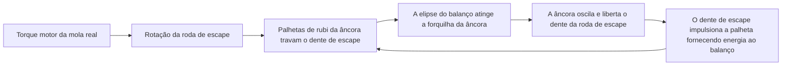
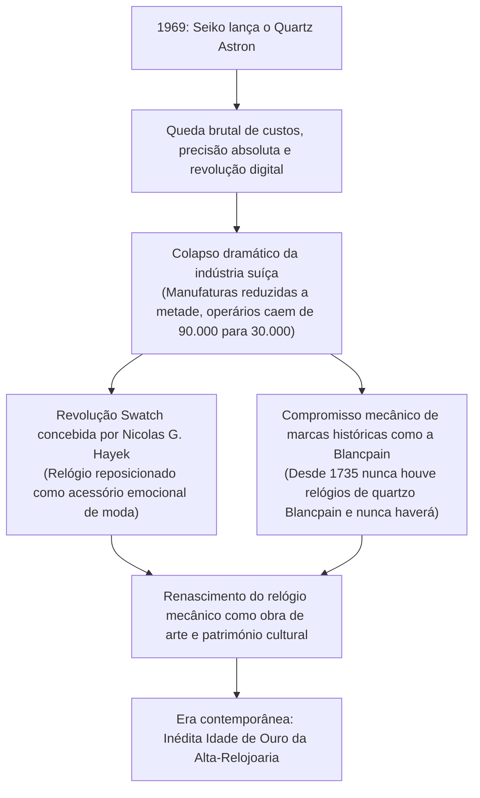
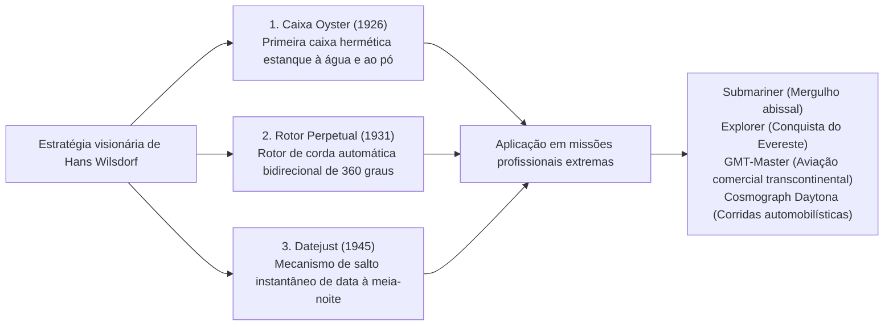

## Introdução: O relógio mecânico como microcosmo do tempo

No interior de uma caixa metálica de apenas 40 milímetros de diâmetro e alguns milímetros de espessura, centenas de engrenagens microscópicas, alavancas, molas e rubis sintéticos articulam-se com rigor milimétrico para medir a passagem do tempo sem perder um único instante. Este é o relógio mecânico. Entre todas as criações da mecânica de precisão desenvolvidas pela mente humana, ele representa o menor, o mais fascinante e o mais profundamente filosófico microcosmo.

Numa época dominada por relógios de quartzo e smartwatches, onde as horas são computadas digitalmente através de cristais que vibram dezenas de milhares de vezes por segundo ou sincronizadas com relógios atómicos: por que motivo um engenho mecânico, impulsionado exclusivamente pela força elástica de uma mola real enrolada, continua a cativar conhecedores em todo o mundo e a atingir valores comparáveis a obras de arte consagradas, variando entre dezenas de milhares e milhões de euros?

A razão primordial reside no facto de que o relógio mecânico nunca é um mero instrumento cronométrico. Ele é **«a cristalização de quinhentos anos de investigação intelectual da humanidade, desafiando incessantemente as fronteiras da mecânica newtoniana, da gravidade, do atrito e da dilatação térmica.»** Nele confluem a intuição física de mestres lendários como Abraham-Louis Breguet, a inabalável tradição do acabamento manual cultivada nas montanhas do Jura suíço e o orgulho supremo da integração vertical autêntica: a *manufacture d'horlogerie*.

Este tratado analisa toda a arquitetura da ciência relojoeira: desde as raízes históricas e religiosas da indústria suíça até à cinemática dos calibres, a microgeometria das grandes complicações (turbilhão, calendário perpétuo, repetição de minutos), a filosofia das manufaturas de topo, a física híbrida do Spring Drive da Grand Seiko e a extraordinária renascença cultural e económica que emergiu da crise do quartzo.

```
[Arquitetura hierárquica do relógio mecânico]

┌─────────────────┬───────────────────────────────┬───────────────────────────────┐
│ Unidade         │ Componentes e mecanismos      │ Função física                 │
│ funcional       │ fundamentais                  │ e leis orientadoras           │
├─────────────────┼───────────────────────────────┼───────────────────────────────┤
│ 1. Fonte de     │ Mola real, Tambor de corda    │ Acumula a energia potencial   │
│    energia      │ (Corda manual / Massa         │ elástica da mola espiralada;  │
│                 │ oscilante automática)         │ debita torque contínuo        │
├─────────────────┼───────────────────────────────┼───────────────────────────────┤
│ 2. Trem de      │ Roda de centro, Roda média,   │ Multiplica a velocidade de    │
│    engrenagens  │ Roda de segundos, Pinhões     │ rotação através de relações   │
│                 │                               │ de engrenagem exatas          │
├─────────────────┼───────────────────────────────┼───────────────────────────────┤
│ 3. Escape       │ Roda de escape, Âncora,       │ Interrompe periodicamente o   │
│                 │ Palhetas de rubi (Escape de   │ rodamento e fornece impulsos  │
│                 │ âncora suíço)                 │ regulares ao órgão regulador  │
├─────────────────┼───────────────────────────────┼───────────────────────────────┤
│ 4. Órgão        │ Balanço, Mola espiral         │ Produz uma base temporal de   │
│    regulador    │ (Virola, Pitão, Raquete /     │ oscilação precisa por         │
│                 │ Parafusos de inércia)         │ movimento harmónico simples   │
├─────────────────┼───────────────────────────────┼───────────────────────────────┤
│ 5. Trem de      │ Rodagem de quadratura,        │ Desmultiplica o movimento     │
│    indicação    │ Chaussée, Roda de horas,      │ regulado para indicar horas,  │
│                 │ Ponteiros, Mostrador          │ minutos e segundos legíveis   │
└─────────────────┴───────────────────────────────┴───────────────────────────────┘
```

---

## 1. História da indústria relojoeira: Da migração huguenote ao milagre do Vale de Joux

### 1.1 A Reforma e a génese da relojoaria suíça
Embora as origens da relojoaria mecânica remontem aos relógios monumentais em mosteiros e torres sineiras do século XIII e XIV na Europa, a sua radical miniaturização em relógios de bolso e de pulso — e a ascensão da Suíça como o centro nevrálgico do setor — tem origem em profundas reviravoltas da história religiosa.

Em 1541, o reformador teológico João Calvino implantou em Genebra uma ordem teocrática puritana. Sob as suas leis sumptuárias implacáveis, o uso de joias e adereços faustosos foi expressamente banido como vaidade pecaminosa. De um instante para o outro, os conceituados ourives, cinzeladores e esmaltadores genebrinos viram-se à beira da ruína material e existencial.

Para sobreviver, esses artífices encontraram uma fresta legal decisiva: os relógios de bolso portáteis não eram vistos como adorno frívolo, mas sim como «instrumentos úteis» para a disciplina moral e o cumprimento do dever cristão. Ao aliar a mestria da ourivesaria à mecânica fina, Genebra converteu-se em tempo recorde numa próspera capital da relojoaria de alta precisão.

O impulso geopolítico derradeiro deu-se em 1685, quando o rei Luís XIV de França revogou o Édito de Nantes. A retoma da perseguição implacável contra os protestantes (huguenotes) precipitou um êxodo em massa. Dezenas de milhares de relojoeiros franceses qualificados, fabricantes de ferramentas, matemáticos e astrónomos refugiaram-se em Genebra, trazendo consigo segredos metalúrgicos vitais, patentes pioneiras e métodos oficinais avançados.

### 1.2 O maciço do Jura, o «Watch Valley» (Vallée de Joux) e o établissage
A intensa capacidade oficinal de Genebra logo se estendeu aos vales agrestes e isolados da cordilheira do Jura: em particular o Vallée de Joux, Le Locle e La Chaux-de-Fonds.

Nessas regiões serranas, os invernos cobriam as aldeias de neve durante quase seis meses ininterruptos. Os camponeses locais converteram o período de inatividade agrícola numa virtuosa microindústria doméstica, instalando nos sótãos janelas amplas para captar a escassa luminosidade natural. Famílias completas dedicavam-se a modelar à mão peças de extrema minúcia: parafusos, pinhões, rodas, âncoras e molas.

Com o degelo da primavera, mercadores intermediários de Genebra (*établisseurs*) percorriam as aldeias para adquirir esses componentes e levá-los aos ateliês citadinos, onde se efetuava a montagem final, o ajuste fino e o encasamento. Este sistema de divisão horizontal do trabalho, denominado **établissage**, proporcionou à manufatura suíça uma eficiência económica, uma precisão e um poder de escala que acabariam por superar as corporações rígidas da Inglaterra e da França.

---

## 2. Mecânica do relógio mecânico: A física do microcosmo

### 2.1 O coração do regulador: Balanço, espiral e o «isocronismo»
O princípio físico basilar que governa a exatidão cronométrica do relógio mecânico é o **isocronismo**, descoberto originalmente por Galileu Galilei através dos seus estudos sobre o pêndulo.
O isocronismo estipula que o período de uma oscilação permanece inalterado, independentemente da sua amplitude angular. Visto que o pêndulo depende da aceleração da gravidade e é inviável para instrumentos portáteis, os relógios utilizam um oscilador harmónico torsional: o conjunto formado pelo volante do **balanço** e pela mola helicoidal plana chamada **espiral**.

O período teórico de oscilação $T$ do conjunto regulador é expresso pela fórmula clássica:

$$T = 2\pi \sqrt{\frac{I}{C}}$$

Onde $I$ representa o momento de inércia do balanço e $C$ exprime a rigidez torsional (constante elástica de restituição) da espiral.

A implicação mais sublime desta relação é que **o período $T$ independe matematicamente da amplitude da oscilação**. Quer a mola real esteja completamente carregada (fornecendo torque máximo) ou prestes a descarregar (debitando torque reduzido), o balanço executa cada ciclo de vaivém exatamente na mesma fração temporal. Nesta lei repousa toda a exatidão da medição do tempo.

```
[Relação entre frequência de oscilação e precisão cronométrica]

- 5 alternâncias por segundo (18.000 a/h / 2,5 Hz):
  O balanço oscila 5 vezes por segundo (18.000 alternâncias por hora). Cadência própria de relógios de bolso antigos. Tic-tac nobre e compassado. Desgaste material insignificante e vida útil prolongada.

- 6 alternâncias por segundo (21.600 a/h / 3,0 Hz):
  O padrão de referência dos calibres clássicos de corda manual de meados do século XX (ex.: Patek Philippe Calibre 215 PS).

- 8 alternâncias por segundo (28.800 a/h / 4,0 Hz):
  O padrão universal da alta-relojoaria contemporânea (ex.: Rolex 3135/3235, ETA 2824-2). Concilia o melhor equilíbrio entre imunidade aos choques diários, estabilidade e proteção dos lubrificantes.

- 10 alternâncias por segundo (36.000 a/h / 5,0 Hz):
  Arquitetura de «Alta Frequência» (High-Beat). Oscila 10 vezes por segundo, permitindo aferições ao décimo de segundo. Celebrizada no Zenith El Primero e Grand Seiko 9S85. Excelente resistência a oscilações bruscas, requerendo lubrificantes sintéticos de topo e metalurgia avançada.
```

### 2.2 Ciclo dinâmico do escape de âncora suíço
Sem um fornecimento regular de energia exterior, o conjunto oscilador acabaria por parar devido ao atrito do ar e dos mancais. O mecanismo responsável por converter a força rotativa contínua do trem de engrenagens em impulsos discretos e regulares é o **escape**.



O escape de âncora suíço repete este ciclo — repouso, desprendimento e impulso — entre cinco e dez vezes por segundo, com sincronização na escala do microssegundo. Num só dia (86.400 segundos), suporta mais de 700.000 colisões mecânicas; num ano, mais de 250 milhões de ciclos. A capacidade deste micromecanismo de funcionar ininterruptamente por décadas reflete o auge da tribologia moderna.

### 2.3 Raquete reguladora vs. Balanço livre de inércia variável
O ajustamento fino da marcha diária de um movimento fundamenta-se em duas abordagens conceptuais distintas:

1. **Ajuste por raquete (Regulator Index)**:
   A espira exterior passa por dois pinos guia fixados a uma alavanca móvel denominada raquete. Ao mover a raquete, altera-se o «comprimento ativo» da espiral, redefinindo a rigidez $C$ e o período $T$. Embora seja de fácil manuseio, choques bruscos podem desalinhar a raquete, e a fricção dos pinos com a espiral ativa gera pequenas irregularidades no isocronismo.
2. **Balanço livre de inércia variável (Free-Sprung Balance)**:
   A expressão máxima da alta-relojoaria, presente no balanço Gyromax da Patek Philippe ou no sistema Microstella da Rolex. A raquete é abolida e o comprimento da espiral é fixado de modo absoluto. A regulação faz-se **girando massas excêntricas ou parafusos ajustáveis situados no aro do balanço, modulando diretamente o seu momento de inércia $I$**. Esta conceção confere grande robustez contra impactos mecânicos e estabilidade cronométrica a longo prazo, exigindo todavia o conhecimento de mestres afinadores.

---

## 3. Anatomia de engenharia das três grandes complicações

Qualquer função relojoeira que exceda a indicação básica de horas, minutos e segundos recebe a designação de «complicação». No patamar supremo figuram as «Três Grandes Complicações», cujo domínio combinado simboliza a mestria absoluta de uma manufatura.

```
[Classificação e desafios de engenharia das três grandes complicações]

┌─────────────────┬───────────────────────────────┬───────────────────────────────┐
│ Complicação     │ Desafio físico e mecânico     │ Solução de engenharia         │
│                 │ a superar                     │ micromecânica                 │
├─────────────────┼───────────────────────────────┼───────────────────────────────┤
│ Turbilhão       │ Desvios de marcha verticais   │ Encerra o escape e o balanço  │
│ (Tourbillon)    │ induzidos pela gravidade      │ numa gaiola que executa 360°  │
│                 │ sobre a espiral               │ em exatamente 1 minuto        │
├─────────────────┼───────────────────────────────┼───────────────────────────────┤
│ Calendário      │ Variação da duração dos meses │ Roda de programação de 48     │
│ perpétuo        │ (30, 31, 28 dias) e bissextos │ meses com entalhes de         │
│                 │ quadrienais (29 dias em fev)  │ profundidade variável         │
├─────────────────┼───────────────────────────────┼───────────────────────────────┤
│ Repetição de    │ Transposição da hora para     │ Rasteis apalpam caracóis      │
│ minutos         │ sonoplastia a pedido no escuro│ graduados; martelos percutem  │
│                 │ sem energia exterior          │ gongos de aço temperado       │
└─────────────────┴───────────────────────────────┴───────────────────────────────┘
```

### 3.1 Turbilhão (Tourbillon): Domando a gravidade numa gaiola rotativa
Patenteado em 1801 pelo mestre Abraham-Louis Breguet, o turbilhão (do francês *tourbillon*, turbilhão de vento) representa o auge do engenho cinemático.

Os relógios de bolso passavam a quase totalidade do seu funcionamento na vertical dentro dos bolsos dos coletes. Nessa postura, a aceleração gravítica deformava a espiral para baixo de maneira constante, deslocando o seu centro de gravidade e provocando severos erros posicionais.
A intuição genial de Breguet consistiu numa conclusão definitiva: se não é viável neutralizar a gravidade, deve-se girar o próprio órgão regulador no espaço.

Breguet montou todo o escape — roda de escape, âncora, balanço e espiral — dentro de uma gaiola ultraleve. Esta gaiola completa **uma volta inteira de 360 graus em exatamente 60 segundos**. Dessa forma, o atraso acumulado numa posição é cancelado por um avanço proporcional 180 graus volvidos. Montar dezenas de componentes minúsculos de aço e titânio num conjunto de peso inferior a 0,3 gramas, mantendo uma rotação suave e sem atrito, continua a ser apanágio de pouquíssimas manufaturas.

### 3.2 Calendário perpétuo: O antepassado da computação mecânica
Os relógios comuns de calendário avançam sempre até ao dia 31, impondo correção manual no fecho de fevereiro, abril, junho, setembro e novembro.

O calendário perpétuo atua como um computador analógico puramente mecânico. Graças a uma memória mecânica talhada em rodas, **identifica automaticamente os meses de 30 e 31 dias, os meses de fevereiro com 28 dias e os anos bissextos de 29 dias**, sem exigir intervenção manual até ao ano secular de 2100.

O componente diretor é a **roda de 48 meses (roda de bissexto)**. O seu contorno possui 48 entalhes representativos dos quatro anos de um ciclo bissexto, cada qual com profundidade milimetricamente calibrada:
- Meses de 31 dias: Recortes mais rasos
- Meses de 30 dias: Recortes de profundidade média
- Fevereiro regular (28 dias): Entalhe mais profundo
- Fevereiro bissexto (29 dias): Entalhe intermediário específico
Um apalpador mecânico monitoriza constantemente essas cotas. À meia-noite do último dia do mês, liberta o salto instantâneo do disco de data para o número exato de divisões exigidas.

### 3.3 Repetição de minutos: O zénite da física acústica
Antes do advento da iluminação elétrica, consultar o relógio na escuridão profunda dependia da audição. Ao acionar uma corrediça na lateral da caixa, a repetição de minutos emite uma sonata cadenciada:

- **Som grave (Horas)**: Batida ressonante no gongo baixo, de 1 a 12 vezes.
- **Batida dupla agudo-grave (Quartos)**: Acorde duplo alternado («Ding-Dong»), de 1 a 3 vezes (aos 15, 30 e 45 minutos).
- **Som agudo (Minutos)**: Batida cristalina no gongo alto, de 1 a 14 vezes para os minutos residuais.
*(Exemplo às 7:42: 7 toques graves + 2 toques duplos + 12 toques agudos).*

Em torno do movimento estendem-se dois arames circulares de aço temperado denominados gongos, afinados à mão com lima e percutidos por minúsculos martelos de aço espelhado. Ao armar a corrediça, tensiona-se uma mola motriz auxiliar e os rasteis descem sobre caracóis graduados. Para imprimir um andamento uniforme entre as pancadas, um regulador de fricção centrífuga ou aerodinâmica gira silenciosamente em alta velocidade. A massa volúmica e a elasticidade dos metais da caixa (ouro rosa, titânio grau 5 ou platina) são calculadas para amplificar com pureza o eco acústico.

---

## 4. As manufaturas supremas do mundo e a filosofia das casas lendárias

No universo relojoeiro, existe uma separação crucial entre as oficinas de montagem (*établisseurs*), que compram movimentos terceirizados, e as autênticas **manufaturas**, que concebem, usinam, decoram, montam e afinam a totalidade dos seus calibres nas suas próprias instalações.

```
[Manufaturas de renome mundial e as suas criações célebres]

┌─────────────────┬───────────┬───────────────────────────────┐
│ Manufatura      │ Fundação  │ Filosofia, peças históricas   │
│                 │           │ e características técnicas    │
├─────────────────┼───────────┼───────────────────────────────┤
│ Patek Philippe  │ 1839      │ Soberana da Santíssima        │
│                 │ Suíça     │ Trindade; Selo Patek Philippe;│
│                 │           │ Calatrava, Nautilus.          │
├─────────────────┼───────────┼───────────────────────────────┤
│ Audemars Piguet │ 1875      │ Mestres das complicações;     │
│                 │ Suíça     │ pioneiros do desportivo de    │
│                 │           │ luxo Royal Oak (1972).        │
├─────────────────┼───────────┼───────────────────────────────┤
│ Vacheron        │ 1755      │ A mais antiga manufatura sem  │
│ Constantin      │ Suíça     │ interrupção; Selo de Genebra; │
│                 │           │ Patrimony, Overseas.          │
├─────────────────┼───────────┼───────────────────────────────┤
│ A. Lange &      │ 1845      │ Ápice saxónico; platina de    │
│ Söhne           │ Alemanha  │ alpaca, chatons em ouro,      │
│                 │           │ dupla montagem integral.      │
├─────────────────┼───────────┼───────────────────────────────┤
│ Rolex           │ 1905      │ Rei do luxo desportivo robusto│
│                 │ Suíça     │ Caixa Oyster, rotor Perpetual │
│                 │           │ e metalurgia exclusiva.       │
├─────────────────┼───────────┼───────────────────────────────┤
│ Omega           │ 1848      │ Speedmaster Moonwatch; Master │
│                 │ Suíça     │ Chronometer; pioneira da      │
│                 │           │ revolução do escape Co-Axial. │
├─────────────────┼───────────┼───────────────────────────────┤
│ Grand Seiko     │ 1960      │ Microengenharia nipónica;     │
│                 │ Japão     │ tecnologia híbrida Spring     │
│                 │           │ Drive (Tri-synchro).          │
└─────────────────┴───────────┴───────────────────────────────┘
```

### 4.1 Patek Philippe: O monarca absoluto da relojoaria
Fundada em Genebra em 1839, a Patek Philippe equipou figuras como a rainha Vitória, Albert Einstein e Piotr Tchaikovsky. Permanece como o expoente máximo da alta-relojoaria tradicional.
Desde o equilíbrio de proporções clássicas da Calatrava até à estética desportiva refinada do Nautilus, a marca mantém um padrão de elegância imortal.
Em 2009, a manufatura estabeleceu o seu próprio Selo Patek Philippe, prescrevendo limites de tolerância de marcha de −3 a +2 segundos diários em relógios encasados e afiançando restauro perpétuo para todos os relógios produzidos desde 1839. O seu aforismo célebre — «Nunca se é realmente dono de um Patek Philippe. Apenas se cuida dele para a próxima geração» — sintetiza o seu valor como legado cultural.

### 4.2 A. Lange & Söhne: O renascimento da engenharia de precisão saxónica
Foi na vila montanhosa de Glashütte, na Saxónia, que Ferdinand Adolph Lange lançou em 1845 as bases da precisão alemã. Após sofrer a destruição da guerra e a estatização soviética, Walter Lange e Günter Blümlein orquestraram em 1990 um renascimento prodigioso.

Os movimentos da Lange patenteiam traços de engenharia germânica únicos:
- **Platina de três quartos em alpaca natural (prata alemã)**: Liga nobre de cobre, níquel e zinco que providencia uma rigidez monumental e adquire, ao longo dos anos, uma acolhedora pátina dourada.
- **Chatons de ouro aparafusados**: Mancais de rubi inseridos em suportes de ouro de 18 quilates, fixados com parafusos azulados ao fogo a 300 °C.
- **Galo gravado à mão**: Cada ponte de balanço é lavrada à mão com desenhos florais, convertendo cada relógio numa obra singular.
- **Dupla montagem**: Cada movimento é montado e afinado, depois completamente desmontado, limpo, redecorado e novamente montado — testemunho de um rigor inegociável.

### 4.3 Grand Seiko e a física híbrida do «Spring Drive»
Concebida em 1960 pela Suwa e Daini Seikosha com a meta de superar os cronómetros suíços, a Grand Seiko alcançou em 1999 um monumento técnico sem precedentes: o **Spring Drive**, desenvolvido ao longo de duas décadas de pesquisas pelo engenheiro Yoshikazu Akahane.

```
[Cinemática do regulador Tri-synchro Spring Drive]

[Fonte motriz mecânica: Mola real]
- Inteiramente isento de pilhas químicas ou motores elétricos.
  Toda a energia emana do desenrolamento elástico da mola.
  ↓
[Multiplicação de velocidade pelo trem de engrenagens]
  ↓
[Giro da roda de deslize (Rotor magnético): 8 rotações/segundo]
- Ao girar entre as bobinas do estator, induz uma microcorrente
  eletromagnética da ordem do microwatt.
  ↓
[Ativação do circuito integrado e do cristal de quartzo]
- A energia microscópica aciona um circuito integrado de ultra-baixo
  consumo e um cristal de quartzo a 32.768 Hz.
  ↓
[Travagem eletromagnética reguladora]
- O circuito compara centenas de vezes por segundo a frequência do quartzo
  com a rotação efetiva do rotor magnético.
- Se o rotor girar depressa demais, um travão eletromagnético de correntes
  de Foucault sem atrito aplica resistência, travando-o em exatas 8 rot/s.
```

Ao contrário dos ponteiros de relógios mecânicos que avançam aos saltos ou dos de quartzo que pulam a cada segundo, o ponteiro de segundos do Spring Drive desliza sobre o mostrador numa trajetória silenciosa, contínua e sem qualquer trepidação: o **Glide Motion**. Aliando a autonomia perpétua da mecânica à exatidão astronómica do quartzo (±15 segundos ao mês), consagra-se como uma das maiores inovações da era moderna.

---

## 5. A crise do quartzo e a filosofia económica do renascimento mecânico

A 25 de dezembro de 1969, a Seiko apresentou o Quartz Astron 35SQ, o primeiro relógio de pulso a quartzo do mercado. Com uma exatidão sem precedentes de ±0,2 segundos por dia (±5 segundos ao mês), superou amplamente os melhores calibres mecânicos, gerando o abalo histórico denominado **Crise do Quartzo**.



A relojoaria helvética confrontou-se com a devastação: numa década, mais de 50% das oficinas fecharam e o quadro de artífices desceu de 90.000 para menos de 30.000 operários.
Todavia, essa crise abissal clarificou o significado primordial da relojoaria mecânica.
Se a finalidade de um relógio fosse unicamente indicar a hora exata, um circuito de quartzo de baixo custo ou um telemóvel seriam muito mais eficazes. Mas o ser humano procura no pulso algo imensamente mais profundo:
A presença orgânica de engrenagens movidas pelas leis de Newton, a finura estética de pontes chanfradas à mão ao microscópio e o apego a um engenho secular que resiste às gerações.

Graças à liderança de pioneiros como Nicolas G. Hayek e Jean-Claude Biver, o relógio mecânico transcendeu a sua condição instrumental para se firmar como **obra de arte escultórica e veículo de património humanista**. O entusiasmo atual em torno da relojoaria reflete a valorização do tangible e da habilidade humana perante o mundo digital.

---

## 3.4 Cinemática do cronógrafo: A engenharia de precisão do cronómetro

De todas as complicações mecânicas, o cronógrafo — mecanismo concebido para mensurar intervalos temporais a pedido — é o que mais intimamente evoluiu com o desporto motorizado, a aviação e a navegação. A sensibilidade do toque e a robustez de um calibre cronográfico dependem da harmonia entre o seu **sistema de comando** e o seu **dispositivo de embraiagem**.

```
[Sistemas de comando e acoplamento em cronógrafos]

┌─────────────────┬───────────────────────────────┬───────────────────────────────┐
│ Área mecânica   │ Solução adotada               │ Propriedades funcionais       │
│                 │                               │ e comportamento cinemático    │
├─────────────────┼───────────────────────────────┼───────────────────────────────┤
│ Sistema de      │ 1. Roda de colunas            │ Cilindro de aço torneado com  │
│ comando         │    (Column Wheel)             │ colunas. Sensação suave e     │
│                 │                               │ precisa no botão. Padrão nobre│
├─────────────────┼───────────────────────────────┼───────────────────────────────┤
│                 │ 2. Comando por cames /        │ Placa plana estampada ou      │
│                 │    naveta (Cam-Actuated)      │ fresada. Alta resistência;    │
│                 │                               │ acionamento mais resistente.  │
├─────────────────┼───────────────────────────────┼───────────────────────────────┤
│ Transmissão de  │ 1. Embraiagem horizontal      │ Roda intermédia montada numa  │
│ força           │    (lateral)                  │ ponte móvel oscilante.        │
│                 │                               │ Mecânica clássica espetacular.│
├─────────────────┼───────────────────────────────┼───────────────────────────────┤
│                 │ 2. Embraiagem vertical        │ Discos de fricção unidos por  │
│                 │    (Vertical Clutch)          │ pressão axial direta.         │
│                 │                               │ Zero salto do ponteiro.       │
└─────────────────┴───────────────────────────────┴───────────────────────────────┘
```

A tradicional embraiagem horizontal acarreta um problema cinemático inevitável: no instante em que se pressiona o botão de início, os dentes da roda intermédia em movimento chocam lateralmente com os da roda trotadora parada. Caso os topos dos dentes embatam diretamente, o ponteiro de segundos salta visivelmente (*aiguille sautante*).
Em contrapartida, os cronógrafos modernos de elevado desempenho (como os calibres Rolex 4130/4131, Omega 9300 ou Breitling 01) recorrem à **embraiagem vertical**. O acoplamento dá-se por pressão entre discos paralelos, anulando solavancos e possibilitando o funcionamento constante do cronógrafo sem abater a amplitude do balanço.

### Flyback e Rattrapante (Fração de segundos)
- **Flyback (Volta a voar)**: Permite parar, repor a zeros e reiniciar instantaneamente a medição com uma única compressão do botão de reinício, desenvolvido originalmente para aviadores em voos sequenciais.
- **Rattrapante (Split-Seconds)**: Possui dois ponteiros trotadores sobrepostos. Ao carregar num terceiro botão, o ponteiro superior imobiliza-se para registar um tempo parcial, ao passo que o inferior continua a rodar. Uma nova pressão faz com que o ponteiro imobilizado alcance e se funda com o ponteiro em marcha.

---

## 2.4 A primeira revolução do escape em 250 anos: Co-Axial e ciência dos materiais de silício

Após mais de dois séculos de hegemonia indiscutível do escape de âncora suíço, o despontar do século XXI trouxe consigo avanços decisivos para anular os dois maiores flagelos da relojoaria: o atrito e o magnetismo.

### 1. George Daniels e o escape Co-Axial
Criado nos anos 1970 pelo reputado mestre relojoeiro inglês George Daniels e viabilizado pela Omega em 1999, o escape Co-Axial constituiu o primeiro conceito de escape inédito e industrialmente aplicável em dois séculos e meio.

No escape de âncora convencional, as palhetas de rubi deslizam sobre os dentes da roda através de atrito tangencial severo, requerendo lubrificação por óleo fluído. Com o envelhecimento e ressecamento dos óleos, a precisão desaba forçosamente.
O escape Co-Axial adota uma roda coaxial com dois níveis dentados e uma âncora com três palhetas, garantindo um **impulso puramente radial (contacto tangencial por rolamento)** sem atrito deslizante. Eliminada a fricção, a premência de lubrificantes decresce radicalmente, dilatando os intervalos de assistência de 3–5 anos para 8–10 anos com elevada estabilidade cronométrica.

### 2. A revolução do silício monocristalino
Concretizada através de uma cooperação tecnológica unindo a Patek Philippe, a Rolex, a Omega e o CSEM em Neuchâtel, a integração de peças em silício talhadas por corrosão iónica reativa profunda (DRIE) refinou a dinâmica dos movimentos:
- **Imunidade antimagnética absoluta**: Por se tratar de um metaloide isento de ferro, o silício é completamente imune às radiações eletromagnéticas quotidianas.
- **Isocronismo com compensação térmica**: Superfícies revestidas por dióxido de silício (ex.: Silinvar e Spiromax da Patek Philippe) anulam os efeitos da oscilação de temperatura sobre o módulo de elasticidade.
- **Massa inercial reduzida e lisura microscópica**: Densidade três vezes inferior à do aço e superfícies perfeitamente polidas conferem um rendimento mecânico excecional.

---

## 4.4 Rolex: A hegemonia tecnológica do relógio de luxo funcional

Fundada em 1905 por Hans Wilsdorf, a Rolex transformou o relógio de pulso, que era tido por ornamento de salão frágil, numa armadura mecânica inexpugnável preparada para as condições ambientais mais hostis do globo.



### Aço Oystersteel (família 904L) e metalurgia própria
Contrariamente à grande maioria dos fabricantes, que utilizam o vulgar aço 316L, a Rolex elabora os seus relógios em **Oystersteel, uma superliga da linhagem dos aços 904L**, habitualmente reservada à engenharia aeroespacial e química.
Com elevados teores de crómio, molibdénio, níquel e cobre, ostenta excecional resistência à corrosão por picadas marinhas e suor, refletindo após o polimento um brilho luminoso comparável à platina. Dispõe igualmente de fundição própria para criar ligas exclusivas como o ouro Everose, imune à descoloração provocada pelo cloro.

---

## 5.2 O acabamento relojoeiro (finishing) e a estética da alta decoração artesanal

Mais de metade da avaliação de um modelo de alta-relojoaria reside nos acabamentos estéticos manuais (*bienfacture*) aplicados às peças do movimento. Longe de serem meros artifícios ornamentais, o acabamento debulha rebarbas metálicas para não poluir o trem de engrenagens e protege as superfícies contra a oxidação.

```
[Técnicas clássicas de acabamento em alta-relojoaria]

1. Anglage (Chanfragem):
   As arestas retas a 90 graus de pontes e platinas são abatidas e polidas
   à mão com limas, madeira de genciana e pasta diamantada, desenhando
   chanfros regulares a 45 graus que reluzem à luz.

2. Côtes de Genève (Ondas de Genebra):
   Estrias paralelas e onduladas traçadas com ferramenta abrasiva rotativa,
   revelando reflexos iridescentes conforme o ângulo de visão.

3. Perlage (Perolado):
   Padrão de círculos sobrepostos aplicado em planos encobertos, como a
   platina principal, retendo partículas microscópicas e suportando a fixação
   de películas de óleo.

4. Poli Noir (Polimento negro / Espelhado):
   O expoente máximo do acabamento. As peças de aço (cabeças de parafusos,
   gaiolas de turbilhão) são friccionadas à mão numa placa de zinco revestida
   de pó de diamantina até atingirem planicidade absoluta. Sob determinado
   ângulo, o metal reflete toda a luz, surgindo num tom negro profundo.
```

O prestigiado **Selo de Genebra (Poinçon de Genève)** permanece como a condecoração oficial mais venerada da relojoaria helvética. É atribuído unicamente a movimentos que cumprem doze estritas normas técnicas que incidem sobre arestas chanfradas, parafusos espelhados e dentes de engrenagens contornados.

---

## 4.5 O desafio dos relojoeiros independentes (AHCI) e as microesculturas contemporâneas

Em oposição ao domínio dos grandes conglomerados financeiros (Richemont, Swatch Group, LVMH), a **Académie Horlogère des Créateurs Indépendants (AHCI)** preserva o espírito de criação desinteressada, no qual mestres relojoeiros concebem peças autorais fora dos cânones industriais.

```
[Mestres independentes contemporâneos de vanguarda]

1. Philippe Dufour:
   - Trabalha sozinho na sua bancada em Le Sentier, sem ajudantes nem maquinaria CNC.
   - «Simplicity»: Um relógio de três ponteiros cujos amplos e fluidos chanfros
     polidos são tidos como a perfeição máxima do anglage em toda a história humana.
   - «Duality»: Primeiro relógio de pulso equipado com dois balanços unidos
     por um diferencial para compensar cinematicamente erros de marcha.

2. François-Paul Journe (F.P. Journe):
   - Conduzido pelo lema «Invenit et Fecit» (Inventado e Feito).
   - «Chronomètre à Résonance»: Dois balanços próximos sincronizam os seus
     ritmos por ressonância acústica natural transmitida pelo ar e platina.
   - Produção singular de platinas e pontes em ouro rosa maciço de 18 quilates.

3. Richard Mille:
   - Transfigura o relógio num conceito de «monolugar de Fórmula 1 no pulso».
   - Aplica materiais aeroespaciais: Carbono TPT, titânio grau 5 e caixas de safira.
   - Projeta turbilhões com capacidade de absorção de impactos entre 5.000 e
     mais de 12.000 G, utilizados por Rafael Nadal em torneios de Grand Slam.
```

---

## 2.5 A batalha contra o inimigo jurado, o magnetismo: Evolução da engenharia antimagnética

No nosso quotidiano eletrificado, telemóveis, computadores portáteis, fechos magnéticos e placas de indução geram campos magnéticos intensos. Num calibre mecânico, a **magnetização** configura o perigo mais frequente para a estabilidade da marcha.

Quando a espiral de aço é magnetizada, as suas voltas colam-se por atração magnética, encurtando o comprimento oscilatório ativo e provocando desvios acelerados de dezenas de minutos ou horas ao dia.

```
[Duas filosofias de proteção antimagnética]

1. Paradigma da blindagem (Gaiola de Faraday):
   - Princípio: Isolar o movimento no seio de uma caixa interna de ferro doce.
   - Mecanismo: As linhas de indução magnética contornam o ferro doce devido
     à sua alta permeabilidade, sem atingir os componentes frágeis.
   - Referências: IWC Ingenieur, Rolex Milgauss (resistência a 1.000 Gauss).
   - Desvantagens: Aumenta a espessura da caixa e impede fundos transparentes.

2. Paradigma dos materiais imunes (Evolução molecular):
   - Princípio: Conceber a espiral, a âncora e o escape em materiais não magnéticos.
   - Referências: Omega Master Chronometer (resistente a 15.000 Gauss, imune a
     scanners de ressonância magnética) graças à espiral Si14 e eixos de titânio.
   - Vantagens: Mantém perfis elegantes e possibilita apreciar a beleza do calibre
     através de fundos de cristal de safira transparente.
```

---

## 5.5 Normas de certificação relojoeira suíça: Selo de Genebra e testes de cronometria COSC

Com vista a autenticar a exatidão cronométrica e a integridade de manufatura, a indústria suíça confia em exigentes entidades certificadoras independentes.

```
[Grandes normas de avaliação da relojoaria helvética]

1. COSC (Contrôle Officiel Suisse des Chronomètres):
   - Âmbito: Certificação da precisão de movimentos não encasados de fabrico suíço.
   - Protocolo: Ensaios durante 15 dias consecutivos em 5 orientações espaciais e a
     3 níveis de temperatura (8 °C, 23 °C, 38 °C).
   - Tolerância: Desvio médio diário fixado entre -4 e +6 segundos (para calibres
     > 20 mm). Uma percentagem muito restrita de relógios alcança esta distinção.

2. Selo de Genebra (Poinçon de Genève):
   - Âmbito: Certificado oficial de origem e virtuosismo artesanal fundado em 1886.
   - Condição territorial: A montagem e a regulação têm de decorrer obrigatoriamente
     no território do Cantão de Genebra.
   - 12 Exigências fundamentais:
     - Chanfragem e polimento de todas as arestas metálicas dos componentes.
     - Cabeças e fendas dos parafusos inteiramente polidas e chanfradas.
     - Dentes das rodas chanfrados e eixos de pinhões polidos ao diamante.
     - Alojamentos de rubis polidos com reservatórios adequados para lubrificante.
   - Atualização contemporânea: Desde 2011, o exame dinâmico abrange o relógio já
     completamente encasado, afiançando uma precisão de -1 a +1 s/dia, além de
     inspecionar a estanqueidade e a autonomia de funcionamento.
```

---

## 6. Conclusão: Usar o microcosmo no pulso

Colocar um relógio mecânico no pulso e rodar devagar a coroa com as pontas dos dedos proporciona uma vivência sensorial ímpar. Sente-se a resistência tátil da mola a armar e escuta-se, ao aproximar o ouvido, o sussurro ritmado e acelerado do balanço a pulsar no seu âmago.

Naquele corpo metálico reside a inteligência acumulada de cinco séculos de inventores, remontando ao pioneirismo de Peter Henlein em Nuremberga. Atravessando guerras, sobressaltos sociais e revoluções digitais, os relojoeiros perseguiram incessantemente uma única aspiração: materializar o rio contínuo do tempo com o máximo rigor físico e beleza insuperável.

O ecrã de um telemóvel informa a hora com a exatidão atómica sincronizada por satélites em órbita. No entanto, ao contemplar o mecanismo em funcionamento no pulso — onde uma mola elástica transfere a sua energia vital a rodas e ponteiros —, o ser humano reencontra a sua ligação direta com a gravidade terrestre e a mecânica do cosmos.

O relógio mecânico persiste como a mais nobre, íntima e sublime armadura intelectual da humanidade perante a infinitude do tempo.
