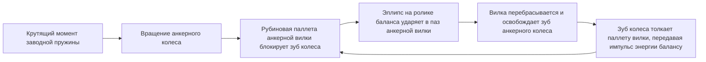
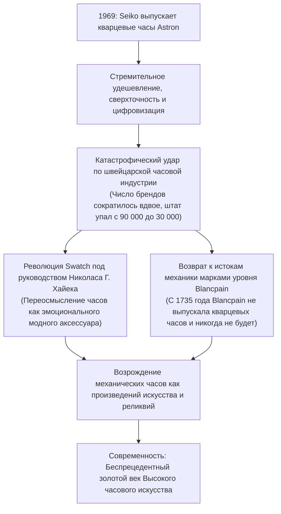
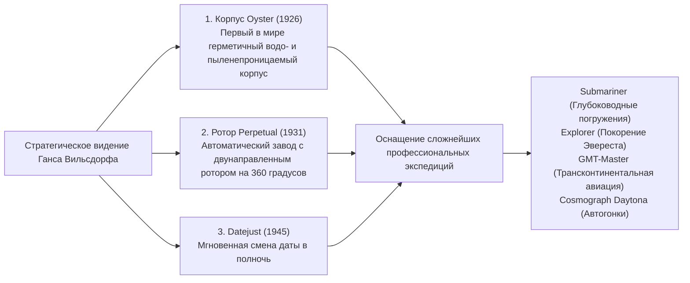

## Введение: Механические часы как тикающий микрокосм

Внутри металлического корпуса диаметром всего 40 миллиметров и толщиной в считанные миллиметры сотни микроскопических зубчатых колёс, рычагов, пружин и синтетических рубиновых камней взаимодействуют с микрометрической безупречностью, непрерывно отсчитывая бег времени без единой ошибки. Это механические часы. Среди всех достижений точного машиностроения, когда-либо созданных человеческим гением, они предстают самым компактным, самым эстетически совершенным и глубоко философским микрокосмом.

В современную эпоху, когда кварцевые механизмы и смарт-часы отображают время в цифровом виде благодаря кристаллам, колеблющимся с частотой в десятки тысяч герц, или ежесекундно синхронизируются с сигналами атомных часов, почему механические часы, движимые исключительно потенциальной энергией упругой деформации скрученной пружины, продолжают покорять людей по всему миру и продаются по ценам произведений бессмертного искусства — от десятков тысяч до миллионов долларов?

Причина заключается в том, что механические часы никогда не были заурядным инструментом измерения времени. Они представляют собой **«квинтэссенцию пятивекового интеллектуального поиска человечества, непрерывно бросающего вызов законам ньютоновской механики, гравитационным полям, трению и тепловому расширению.»** В них материализованы физическая интуиция великих мастеров во главе с Абрахамом-Луи Бреге, вековые традиции ручной отделки мастеров швейцарской Юры и гордость подлинного полного производственного цикла — мануфактуры (*Manufacture d'Horlogerie*).

В данном исследовании систематизируется вся панорама часовой науки: от религиозно-исторических истоков швейцарской индустрии к кинематике калибров, микрогеометрии трёх главных усложнений (турбийона, вечного календаря и минутного репетира), философии элитарных часовых домов, гибридной электромеханической физике калибра Spring Drive от Grand Seiko и вплоть до экономического и культурного ренессанса механики после потрясений кварцевого кризиса.

```
[Иерархическая архитектура механических часов]

┌─────────────────┬───────────────────────────────┬───────────────────────────────┐
│ Функциональный  │ Основные компоненты           │ Физическая роль               │
│ узел            │ и механизмы                   │ и действующие законы          │
├─────────────────┼───────────────────────────────┼───────────────────────────────┤
│ 1. Источник     │ Заводная пружина, заводной    │ Накопление потенциальной      │
│    энергии      │ барабан (Ручной завод / Ротор │ энергии упругой деформации;   │
│                 │ автоподзавода)                │ передача постоянного момента  │
├─────────────────┼───────────────────────────────┼───────────────────────────────┤
│ 2. Колёсная     │ Центральное, промежуточное    │ Повышающая зубчатая передача  │
│    передача     │ и секундное колёса, трибы     │ преобразует крутящий момент   │
│    (Англинаж)   │                               │ в высокую угловую скорость    │
├─────────────────┼───────────────────────────────┼───────────────────────────────┤
│ 3. Спуск        │ Анкерное колесо, анкерная     │ Периодически стопорит колёсную│
│    (Эскапаж)    │ вилка, паллеты (Швейцарский   │ передачу и передаёт импульсы  │
│                 │ анкерный ход)                 │ энергии регулятору баланса    │
├─────────────────┼───────────────────────────────┼───────────────────────────────┤
│ 4. Регулятор    │ Балансовое колесо, волосковая │ Задаёт эталонную частоту      │
│    хода         │ спираль (Колонка, градусник / │ колебаний за счёт гармоничес- │
│                 │ регулировочные грузики)       │ кого движения (изохронизм)    │
├─────────────────┼───────────────────────────────┼───────────────────────────────┤
│ 5. Стрелочный   │ Минутный триб, вексельное и   │ Понижает скорость вращения для│
│    механизм     │ часовое колёса, стрелки,      │ визуального отображения часов,│
│                 │ циферблат                     │ минут и секунд                │
└─────────────────┴───────────────────────────────┴───────────────────────────────┘
```

---

## 1. История часовой индустрии: От исхода гугенотов к чуду долины Жу

### 1.1 Реформация и зарождение швейцарского часового дела
Хотя истоки механической хронометрии восходят к башенным часам европейских монастырей и ратуш XIII–XIV веков, её радикальное уменьшение до размеров карманных, а затем и наручных часов — как и превращение Швейцарии в бесспорную мировую часовую столицу — стало прямым результатом тектонических религиозных катаклизмов.

В 1541 году протестантский реформатор Жан Кальвин установил в Женеве бескомпромиссный теократический порядок. Его суровые законы против роскоши категорически запретили ношение ювелирных изделий, золотых цепей и драгоценных украшений как греховную тщету. В один момент процветающие женевские ювелиры, гравёры и эмальеры оказались на грани голода и полного разорения.

Стремясь выжить, мастера отыскали спасительную лазейку в каноническом праве: портативные карманные часы были классифицированы не как праздная роскошь, а как «практический и нравственный инструмент» христианской самодисциплины. Объединив ювелирное мастерство с микромеханикой, Женева стремительно превратилась в процветающий центр прецизионного приборостроения.

Решающий геополитический поворот произошёл в 1685 году, когда французский король Людовик XIV отменил Нантский эдикт. Возобновившиеся гонения на протестантов (гугенотов) вызвали колоссальный исход. Десятки тысяч высококвалифицированных французских часовщиков, инструментальщиков, математиков и астрономов бежали через границу в Женеву, обогатив её передовыми технологиями металлургии, изобретениями и уникальными производственными методиками.

### 1.2 Горы Юра, «Часовая долина» (Валле-де-Жу) и система этаблиссажа
Вскоре часовое ремесло выплеснулось за пределы Женевы в суровые и изолированные долины Юрского горного хребта — прежде всего в Валле-де-Жу (Vallée de Joux), Ле-Локль и Ла-Шо-де-Фон.

Зимой эти горные края на полгода оказывались отрезанными от внешнего мира глубокими снегами. Местные крестьяне превратили вынужденный перерыв в полевых работах в домашнее часовое производство. Оборудовав на чердаках широкие окна для максимального улавливания скудного дневного света, целые семьи вручную вытачивали сложнейшие микродетали: винты, трибы, колёса, анкерные вилки и пружины.

Весной женевские купцы-негоцианты (*établisseurs*) объезжали горные хижины, скупали заготовки и привозили их в городские мануфактуры для финальной сборки, точной регулировки и установки в корпуса. Эта система децентрализованного разделения труда получила название **этаблиссаж (établissage)**. Обеспечив непревзойдённую гибкость затрат, высочайшую точность и колоссальный объём производства, она позволила швейцарцам за несколько десятилетий вытеснить закостеневшие ремесленные цехи Франции и Англии.

---

## 2. Механика механических часов: Физика микрокосма

### 2.1 Сердце регулятора хода: Баланс, спираль и «изохронизм»
Фундаментальным физическим принципом, определяющим точность хода любых механических часов, является **изохронизм колебаний**, открытый Галилео Галилеем при изучении маятника.
Изохронизм гласит: период колебания остаётся строго неизменным вне зависимости от его амплитуды (угла размаха). Поскольку маятник зависит от силы тяжести и непригоден для переносных приборов, в портативных часах используется крутильный гармонический осциллятор — узел из махового обода **баланса** и тончайшей спиральной пружины — **волоска (спирали баланса)**.

Теоретический период колебания $T$ такого узла описывается классической формулой динамики:

$$T = 2\pi \sqrt{\frac{I}{C}}$$

Где $I$ — момент инерции обода баланса, а $C$ — угловая жёсткость (момент упругой реституции) спирали.

Главный вывод из этой формулы заключается в том, что **период $T$ математически не зависит от амплитуды колебаний**. Полностью ли заведена заводная пружина (отдавая максимальный крутящий момент) или она почти раскрутилась (отдавая остаточный минимум), балансовое колесо совершает каждое колебание за абсолютно одинаковый отрезок времени. На этой физической инвариантности зиждется вся хронометрическая механика.

```
[Взаимосвязь частоты колебаний баланса и хронометрической точности]

- 5 полуколебаний в секунду (18 000 пк/ч / 2,5 Гц):
  Баланс делает 5 колебаний в секунду (18 000 полуколебаний в час). Классический низкооборотный ритм антикварных карманных часов. Неторопливый и звучный ход. Минимальный износ деталей и огромная долговечность механизма.

- 6 полуколебаний в секунду (21 600 пк/ч / 3,0 Гц):
  Исторический стандарт для калибров с ручным заводом середины XX века (например, легендарный Patek Philippe Calibre 215 PS).

- 8 полуколебаний в секунду (28 800 пк/ч / 4,0 Гц):
  Современный золотой стандарт индустрии роскошных наручных часов (Rolex Calibres 3135/3235, ETA 2824-2). Обеспечивает образцовый компромисс между устойчивостью к толчкам руки, стабильностью смазки и долговечностью цапф.

- 10 полуколебаний в секунду (36 000 пк/ч / 5,0 Гц):
  Высокочастотная архитектура («High-Beat»). Колеблется 10 раз в секунду, позволяя измерять интервалы с точностью до 1/10 секунды. Прославлен в Zenith El Primero и Grand Seiko Calibre 9S85. Обладает высочайшей стойкостью к внешним воздействиям, но требует синтетических масел и высокопрочных сплавов.
```

### 2.2 Динамический цикл швейцарского анкерного спуска
Если колебательной системе баланса не передавать порции внешней энергии, она быстро остановится из-за сопротивления воздуха и трения в опорах. Механическим узлом, который преобразует непрерывное вращение колёсной передачи в дискретные импульсы и синхронизирует ход стрелок, является **спусковой механизм (эскапаж)**.



Швейцарский анкерный спуск выполняет эту строгую цепочку — покой, отпирание и импульс — от 5 до 10 раз в секунду с микросекундной точностью. За одни сутки (86 400 секунд) он испытывает свыше 700 000 соударений металла и камня, а за год — более 250 миллионов циклов. Способность этого миниатюрного узла исправно работать десятилетиями является триумфом микротрибологии.

### 2.3 Регулировочный градусник против свободно колеблющегося баланса
Для тонкой регулировки суточного хода механизма применяются две диаметрально противоположные концепции:

1. **Регулировка градусником (Regulator Index)**:
   Внешний виток спирали проходит между двумя штифтами поворотного рычажка — градусника. Смещая рычаг, часовщик укорачивает или удлиняет «активную рабочую длину» спирали, меняя её жёсткость $C$ и период $T$. Этот способ удобен при настройке, однако при сильных ударах градусник может смещаться, а микрозазоры между спиралью и штифтами при колебаниях вносят погрешности в изохронизм.
2. **Свободно колеблющийся баланс с переменной инерцией (Free-Sprung Balance)**:
   Вершина высокого часового искусства, воплощённая в балансе Gyromax от Patek Philippe и системе Microstella от Rolex. Градусник исключён, а длина спирали зафиксирована навсегда. Регулировка хода осуществляется **поворотом регулировочных винтов или эксцентрических грузиков, расположенных по ободу баланса, что напрямую меняет его момент инерции $I$**. Такая конструкция демонстрирует феноменальную стойкость к ударам и сохраняет точность годами, требуя виртуозного мастерства часовщика-регулятора.

---

## 3. Инженерная анатомия трёх грандиозных усложнений (Grandes Complications)

Любая функция часов, выходящая за рамки отображения часов, минут и секунд, именуется «усложнением» (complication). На недосягаемой вершине часовой иерархии пребывают «Три великих усложнения», создание которых служит абсолютным свидетельством высочайшего инженерного мастерства мануфактуры.

```
[Классификация и инженерные вызовы трёх великих усложнений]

┌─────────────────┬───────────────────────────────┬───────────────────────────────┐
│ Усложнение      │ Физическая и механическая     │ Микромеханическое             │
│                 │ проблема                      │ инженерное решение            │
├─────────────────┼───────────────────────────────┼───────────────────────────────┤
│ Турбийон        │ Позиционные погрешности хода  │ Размещение спуска и баланса во│
│ (Tourbillon)    │ от гравитации при вертикальном│ вращающейся каретке, делающей │
│                 │ положении спирали в пространстве 1 полный оборот (360°) за 60 с│
├─────────────────┼───────────────────────────────┼───────────────────────────────┤
│ Вечный          │ Неодинаковая длина месяцев    │ Механическое программное      │
│ календарь       │ (30, 31, 28 дней) и високосные│ 48-месячное колесо с пазами   │
│                 │ годы (29 дней в феврале)      │ строго калиброванной глубины  │
├─────────────────┼───────────────────────────────┼───────────────────────────────┤
│ Минутный        │ Акустическая индикация теку-  │ Ступенчатые улитки щупаются   │
│ репетир         │ щего времени по запросу бой-  │ гребёнками; молоточки отбивают│
│                 │ цом без источников питания    │ время по гонгам из стали      │
└─────────────────┴───────────────────────────────┴───────────────────────────────┘
```

### 3.1 Турбийон (Tourbillon): Укрощение гравитации во вращающейся каретке
Запатентованный в 1801 году выдающимся часовым гением Абрахамом-Луи Бреге, турбийон (от французского *tourbillon* — «вихрь») остаётся квинтэссенцией кинематической виртуозности.

В эпоху Бреге карманные часы почти всё время находились вертикально в кармане жилета. В этом положении сила земного притяжения однонаправленно оттягивала витки спирали баланса книзу, смещая центр тяжести колебательной системы и вызывая значительную позиционную погрешность.
Идея Бреге была гениальна: раз гравитацию нельзя отключить, следует непрерывно вращать сам узел баланса в пространстве.

Бреге собрал анкерное колесо, вилку, баланс и спираль внутри невесомой каретки. Вращаясь вокруг неподвижного секундного колеса, вся каретка совершает **ровно один оборот на 360 градусов за 60 секунд**. В результате погрешность, возникшая в одном положении, ровно через полминуты компенсируется противоположным отклонением. Сборка каретки из титана или закалённой стали, состоящей из десятков деталей общим весом всего 0,2–0,3 грамма, способной плавно вращаться без трения, доступна считанным мануфактурам мира.

### 3.2 Вечный календарь: Предтеча механических компьютеров
Обычный календарный механизм переключается на 31 деление каждый месяц, требуя ручной корректировки даты в конце февраля, апреля, июня, сентября и ноября.

Вечный календарь (*Quantième Perpétuel*) функционирует как полноценный механический аналоговый компьютер. Благодаря механической памяти, закодированной в зубчатых секторах, он **автоматически распознаёт месяцы продолжительностью 30 и 31 день, обычный 28-дневный февраль и 29-дневный февраль високосного года**, не требуя ни единого вмешательства владельца вплоть до секулярного 2100 года.

Сердцем механизма служит **48-месячное программное колесо (колесо високосного цикла)**. На его ободе нарезано 48 секторов, глубина прорезей в которых строго соответствует четырёхлетнему циклу:
- Месяцы из 31 дня: Самые мелкие вырезы
- Месяцы из 30 дней: Вырезы средней глубины
- Обычный февраль (28 дней): Самый глубокий паз
- Високосный февраль (29 дней): Калиброванный ступенчатый паз
Специальный механический щуп непрерывно скользит по профилю колеса. В полночь последнего дня месяца он определяет точное количество делений, на которое суточный диск мгновенно перескакивает вперёд.

### 3.3 Минутный репетир: Апогей акустической физики
В эпоху, предшествовавшую электрическому освещению, узнать время в полной темноте можно было только на слух. При нажатии на боковую каретку корпуса репетир воспроизводит мелодичный бой:

- **Низкий тон (Часы)**: Удары басового молоточка по низкому гонгу (от 1 до 12 раз).
- **Двойной тон высокий-низкий (Четверти)**: Чередующиеся удары двух молоточков («динь-дон») от 1 до 3 раз (15, 30 и 45 минут).
- **Высокий тон (Минуты)**: Удары дискантового молоточка по тонкому гонгу (от 1 до 14 раз для оставшихся минут).
*(Например, в 7:42: 7 низких ударов + 2 двойных удара + 12 высоких ударов).*

Вокруг механизма уложены две стальные струны — гонги, вручную подпиливаемые мастером для идеальной тональности. При взводе каретки сжимается отдельная пружина боя, а зубчатые гребёнки опускаются на ступенчатые кулачки — «улитки». Чтобы темп ударов был плавным и размеренным, механизм оснащается бесшумным центробежным или аэродинамическим регулятором скорости. Плотность, вязкость и акустический резонанс металлов корпуса (розовое золото, титан Grade 5 или платина) подбираются с ювелирной точностью для чистейшего звучания.

---

## 4. Величайшие мануфактуры мира и философия легендарных домов

В часовом сообществе существует фундаментальное различие между сборочными мастерскими (*établisseurs*), покупающими сторонние механизмы, и подлинными **мануфактурами**, которые разрабатывают, производят, декорируют, собирают и регулируют калибры исключительно собственными силами.

```
[Знаменитые мануфактуры мира и их высочайшие достижения]

┌─────────────────┬───────────┬───────────────────────────────┐
│ Мануфактура     │ Основание │ Философия, культовые калибры  │
│                 │           │ и технологический почерк      │
├─────────────────┼───────────┼───────────────────────────────┤
│ Patek Philippe  │ 1839      │ Владыка «Святой Троицы»;      │
│                 │ Швейцария │ Клеймо Patek Philippe;        │
│                 │           │ Calatrava, Nautilus.          │
├─────────────────┼───────────┼───────────────────────────────┤
│ Audemars Piguet │ 1875      │ Мастера сложных функций;      │
│                 │ Швейцария │ создатели люксовых спорт-часов│
│                 │           │ Royal Oak (1972, Джента).     │
├─────────────────┼───────────┼───────────────────────────────┤
│ Vacheron        │ 1755      │ Старейшая непрерывная часовая │
│ Constantin      │ Швейцария │ мануфактура мира; Женевское   │
│                 │           │ клеймо; Patrimony, Overseas.  │
├─────────────────┼───────────┼───────────────────────────────┤
│ A. Lange &      │ 1845      │ Зенит саксонской точности;    │
│ Söhne           │ Германия  │ платина 3/4 из нейзильбера,   │
│                 │           │ шатоны, двойная сборка.       │
├─────────────────┼───────────┼───────────────────────────────┤
│ Rolex           │ 1905      │ Непревзойдённый властелин     │
│                 │ Швейцария │ надежности; корпус Oyster,    │
│                 │           │ ротор Perpetual, своя сталь.  │
├─────────────────┼───────────┼───────────────────────────────┤
│ Omega           │ 1848      │ Speedmaster Moonwatch; Master │
│                 │ Швейцария │ Chronometer; коаксиальная     │
│                 │           │ революция спуска Co-Axial.    │
├─────────────────┼───────────┼───────────────────────────────┤
│ Grand Seiko     │ 1960      │ Японская микроинженерия;      │
│                 │ Япония    │ гибридный калибр Spring Drive │
│                 │           │ с регулятором Tri-synchro.    │
└─────────────────┴───────────┴───────────────────────────────┘
```

### 4.1 Patek Philippe: Абсолютный суверен часового мира
Основанный в Женеве в 1839 году, дом Patek Philippe создавал шедевры для королевы Виктории, Альберта Эйнштейна, Марии Кюри и Петра Чайковского. Он занимает высшую ступень часового олимпа.
От безупречных классических пропорций золотого сечения Calatrava до динамичного стального корпуса Nautilus, мануфактура остаётся эталоном вневременного достоинства.
В 2009 году мануфактура пошла дальше классического государственного Женевского клейма, учредив собственное «Клеймо Patek Philippe». Оно требует беспрецедентной точности от −3 до +2 секунд в сутки для готовых часов в сборе и гарантирует пожизненную реставрацию любых часов, выпущенных с 1839 года. Слоган дома — «Вы никогда не владеете Patek Philippe целиком. Вы лишь сохраняете его для следующего поколения» — отражает отношение к часам как к культурной реликвии.

### 4.2 A. Lange & Söhne: Возрождение саксонской прецизионной школы
В саксонском городке Гласхютте Фердинанд Адольф Ланге в 1845 году заложил основы немецкого прецизионного часового дела. Пережив разрушения Второй мировой войны и десятилетия национализации при социализме, правнук основателя Вальтер Ланге и визионер Гюнтер Блюмляйн в 1990 году совершили чудодейственное возрождение марки.

Калибры Lange обладают неповторимой германской инженерной эстетикой:
- **Трёхчетвертная платина из необработанного нейзильбера**: Сплав меди, никеля и цинка гарантирует колоссальную структурную жёсткость колёсной передачи и с годами приобретает благородную золотистую патину.
- **Привинченные золотые шатоны**: Рубиновые подшипники помещаются в оправы из 18-каратного золота и крепятся воронёными синими винтами.
- **Гравированный вручную мост баланса**: Узор гравируется мастером исключительно вручную штихелем, поэтому в мире нет двух идентичных механизмов Lange.
- **Двойная сборка (Double Assembly)**: Каждый калибр полностью собирается и настраивается, после чего разбирается до последнего винтика, очищается, декорируется и собирается заново — пример бескомпромиссного перфекционизма.

### 4.3 Grand Seiko и гибридная физика Spring Drive
Основанная в 1960 году подразделениями Suwa и Daini Seikosha с целью превзойти швейцарские стандарты хронометрии, Grand Seiko в 1999 году воплотила в жизнь технологический триумф — механизм **Spring Drive**, разработанный инженером Ёсикадзу Акаханэ после двадцати с лишним лет исследований.

```
[Кинематика регулятора Tri-synchro Spring Drive]

[Механический источник энергии: Заводная пружина]
- Никаких батареек или электромоторов.
  Вся энергия вырабатывается исключительно пружиной.
  ↓
[Повышающая зубчатая передача]
  ↓
[Вращение глиссадного ротора с постоянным магнитом: 8 об/сек]
- Пересекая катушки статора, ротор вырабатывает микроток
  мощностью в доли микроватта.
  ↓
[Запуск микросхемы и кварцевого резонатора]
- Ток питает микросхему с ультранизким энергопотреблением
  и кварцевый резонатор на 32 768 Гц.
  ↓
[Электромагнитное тормозное регулирование]
- Микросхема сотни раз в секунду сравнивает вращение ротора
  с идеальной опорной частотой кварца.
- При превышении скорости бесконтактный вихретоковый тормоз
  плавно притормаживает ротор, фиксируя его на отметке ровно 8 об/с.
```

В отличие от традиционных механических часов, где стрелка движется частыми скачками, или кварцевых, где она совершает один дискретный шаг в секунду, стрелка Spring Drive беззвучно скользит по циферблату в непрерывном струящемся потоке — **Glide Motion**. Гармонично объединив вечную автономность механики и безупречную точность кварца (±15 секунд в месяц), Grand Seiko подарила миру одну из величайших инноваций новейшего времени.

---

## 5. Кварцевый кризис и экономическая философия механического ренессанса

25 декабря 1969 года компания Seiko выпустила Quartz Astron 35SQ — первые коммерческие кварцевые наручные часы. Их феноменальная точность ±0,2 секунды в сутки (±5 секунд в месяц) превосходила механические аналоги в сотни раз, вызвав тектонический сдвиг, известный как **Кварцевый кризис**.



Швейцарская часовая индустрия оказалась на грани гибели: за десятилетие закрылось более половины мануфактур, а число занятых специалистов сократилось с 90 000 до менее чем 30 000 человек.
Однако именно эта катастрофа помогла кристаллизовать истинную сущность механических часов.
Если цель заключается лишь в том, чтобы узнать время, дешёвый кварцевый чип или экран смартфона безусловно эффективнее. Но наручные часы для человека значат неизмеримо больше:
Это осязаемое тепло механики, оживающей по законам Ньютона, рукотворное великолепие англажа на мостах под микроскопом и семейная реликвия, передаваемая из поколения в поколение.

Благодаря дальновидности предпринимателей калибра Николаса Г. Хайека и Жан-Клода Бивера механические часы совершили триумфальную трансформацию: из утилитарного прибора они превратились в **одушевлённое произведение искусства и материальное воплощение человеческого гения**. Современный ажиотаж вокруг мануфактурной механики — это естественный гуманистический ответ на эфемерность цифрового мира.

---

## 3.4 Кинематика хронографа: Точная инженерия секундомера

Среди всех усложнений хронограф — механизм фиксации коротких промежутков времени — исторически теснее всего связан с автоспортом, авиацией и наукой. Чёткость срабатывания кнопок и надёжность механизма хронографа всецело определяются слаженностью **системы управления** и **механизма сцепления**.

```
[Системы управления и типы сцепления современных хронографов]

┌─────────────────┬───────────────────────────────┬───────────────────────────────┐
│ Функциональный  │ Конструктивный тип            │ Инженерные свойства           │
│ узел            │                               │ и кинематическое поведение    │
├─────────────────┼───────────────────────────────┼───────────────────────────────┤
│ Управление      │ 1. Колонное колесо            │ Стальной барабан с вертикаль- │
│ переключением   │    (Column Wheel)             │ ными зубьями. Бархатистое     │
│                 │                               │ нажатие кнопок. Элитный класс │
├─────────────────┼───────────────────────────────┼───────────────────────────────┤
│                 │ 2. Кулачковый переключатель   │ Штампованный или фрезерованный│
│                 │    (Cam-Actuated)             │ кулисный рычаг. Высокая стой- │
│                 │                               │ кость; более жёсткий клик     │
├─────────────────┼───────────────────────────────┼───────────────────────────────┤
│ Передача        │ 1. Горизонтальное зацепление  │ Промежуточное колесо входит   │
│ крутящего       │    (Lateral Clutch)           │ в зацепление сбоку. Заворажи- │
│ момента         │                               │ вающая классическая эстетика  │
├─────────────────┼───────────────────────────────┼───────────────────────────────┤
│                 │ 2. Вертикальное фрикционное   │ Диски сжимаются по вертикаль- │
│                 │    сцепление (Vertical Clutch)│ ной оси. Полное отсутствие    │
│                 │                               │ скачка секундной стрелки      │
└─────────────────┴───────────────────────────────┴───────────────────────────────┘
```

Классическое горизонтальное зацепление имеет кинематический изъян: при нажатии кнопки пуска зубья вращающегося промежуточного колеса сбоку входят в зубья неподвижного центрального колеса хронографа. Если вершина зуба попадает на вершину соседнего, стрелка хронографа делает неприятный глазу скачок (*aiguille sautante*).
В современных калибрах высшего класса (Rolex Cal. 4130/4131, Omega Cal. 9300, Breitling Cal. 01) применяется **вертикальное сцепление**. Диски соединяются торцевым трением без ударов зубьев, что исключает любые рывки стрелки и позволяет хронографу работать непрерывно без падения амплитуды баланса.

### Функция Flyback и сплит-хронограф (Rattrapante)
- **Функция мгновенного возврата (Flyback)**: Позволяет остановить, сбросить на ноль и мгновенно перезапустить хронометраж одним нажатием нижней кнопки, что было жизненно необходимо военным лётчикам для навигации.
- **Сплит-хронограф (Rattrapante)**: Имеет две наложенные друг на друга секундные стрелки. При нажатии дополнительной кнопки верхняя стрелка останавливается для фиксации промежуточного времени, а нижняя продолжает движение. Повторное нажатие моментально совмещает обе стрелки вместе.

---

## 2.4 Первая революция спуска за 250 лет: Коаксиальный спуск и физика кремниевых материалов

После двух с лишним веков единоличного господства швейцарского анкерного спуска рубеж XX и XXI веков ознаменовался прорывными изобретениями, направленными против главных врагов часового механизма: трения и магнетизма.

### 1. Джордж Дэниелс и коаксиальный спуск (Co-Axial)
Изобретённый в 1970-х годах выдающимся британским часовщиком Джорджем Дэниелсом и запущенный в серию компанией Omega в 1999 году, коаксиальный спуск стал первым принципиально новым спуском промышленного масштаба за 250 лет.

В классическом спуске рубиновые паллеты скользят по зубьям анкерного колеса с существенным трением, что требует постоянной жидкой смазки. Со временем масло окисляется и высыхает, ухудшая точность.
В коаксиальном спуске применены двухъярусное колесо и анкер с тремя паллетами, обеспечивающие **радиальный толчок (трение качения вместо трения скольжения)**. Практическое устранение трения скольжения снизило потребность в смазке, увеличив межсервисный интервал с 3–5 до 8–10 лет.

### 2. Высокотехнологичная революция монокристаллического кремния
Благодаря совместным разработкам консорциума Patek Philippe, Rolex, Omega и исследовательского центра CSEM в Нёвшателе в часовую отрасль пришёл монокристаллический кремний, обрабатываемый методом глубокого реактивного ионного травления (DRIE):
- **Абсолютная антимагнитность**: Кремний является неметаллическим материалом и полностью невосприимчив к электромагнитным полям ноутбуков и смартфонов.
- **Термокомпенсированный изохронизм**: Напыление оксида кремния (технологии Silinvar и Spiromax у Patek Philippe) компенсирует температурные изменения модуля Юнга.
- **Минимальная инерция и зеркальная гладкость**: Плотность втрое ниже стали и безупречная гладкость снижают инерционные потери и повышают КПД спуска.

---

## 4.4 Rolex: Технологическая гегемония функциональных часов класса люкс

Основанная в 1905 году Гансом Вильсдорфом, компания Rolex превратила хрупкие наручные часы из салонного украшения в неуязвимый прибор, готовый к эксплуатации в экстремальных условиях планеты.



### Сталь Oystersteel (семейство 904L) и собственная металлургия
В то время как подавляющее большинство брендов использует рядовую нержавеющую сталь 316L, Rolex производит корпуса исключительно из **Oystersteel — суперсплава семейства 904L**, применяемого в аэрокосмической и химической отраслях.
Высокое содержание хрома, молибдена, никеля и меди придаёт этой стали превосходную стойкость к точечной коррозии в морской воде, а после полировки она обретает сияющий платиновый блеск. Кроме того, Rolex имеет собственный литейный цех драгоценных металлов, где создаёт сплавы вроде золота Everose, не тускнеющего от хлорированной воды.

---

## 5.2 Декоративная отделка (финишинг) и эстетика часового ремесла

Более половины ценности часов Haute Horlogerie заключается в тончайшей ручной отделке (*bienfacture*) деталей механизма. Финишинг выполняет не только декоративную роль: он удаляет микроскопические заусенцы после резки металла и полирует поверхности, защищая их от коррозии.

```
[Традиционные техники ручной отделки Высокого часового искусства]

1. Англаж (Anglage / Снятие фасок):
   Острые 90-градусные кромки мостов и платин вручную скашиваются напильниками,
   брусками из древесины горечавки и алмазной пастой под угол 45 градусов
   до зеркального блеска, завораживающе отражающего свет.

2. Женевские волны (Côtes de Genève):
   Параллельные волнообразные полосы, наносимые на поверхность мостов
   вращающимся абразивным инструментом, создающие глубокие переливы света.

3. Перлаж (Perlage / Круговое зернение):
   Перекрывающийся круговой узор, наносимый на внутренние плоскости
   (например, платину), задерживающий микрочастицы пыли и удерживающий масло.

4. Чёрная полировка (Poli Noir / Зеркальная полировка):
   Высшая форма отделки стали. Детали (винты, каретки турбийонов) полируются
   вручную на цинковой пластине с алмазной пудрой до абсолютной оптической
   плоскости. Под определённым углом деталь кажется абсолютно чёрной.
```

Престижное **Женевское клеймо (Poinçon de Genève)**, учреждённое кантональным законом в 1886 году, остаётся высшим государственным знаком отличия швейцарских часовщиков. Оно присваивается только калибрам, отвечающим 12 строжайшим техническим и эстетическим критериям.

---

## 4.5 Вызов независимых часовщиков (AHCI) и современные микроскульптуры

На фоне гигантских мультинациональных холдингов (Richemont, Swatch Group, LVMH) **Академия независимых часовщиков (AHCI)** представляет собой оплот бескомпромиссного авторского творчества, где мастера создают подлинные микроскульптуры.

```
[Выдающиеся современные независимые мастера]

1. Филипп Дюфур (Philippe Dufour):
   - Работает в одиночку в мастерской в Ле-Сантье, без помощников и станков ЧПУ.
   - «Simplicity»: Трёхстрелочные часы, чьи широкие плавные фаски мостов
     признаны совершеннейшим англажем в истории человечества.
   - «Duality»: Первые наручные часы с двумя балансами, соединёнными
     дифференциалом для механического усреднения погрешностей хода.

2. Франсуа-Поль Журн (F.P. Journe):
   - Творит под девизом «Invenit et Fecit» (Изобрёл и сделал).
   - «Chronomètre à Résonance»: Два расположенных рядом баланса самостоятельно
     синхронизируют свои колебания за счёт акустического резонанса.
   - Изготавливает платины и мосты исключительно из цельного 18-каратного золота.

3. Ришар Милль (Richard Mille):
   - Концепция «гоночного болида на запястье».
   - Внедрение композитов: Carbon TPT, титан Grade 5 и сапфировые корпуса.
   - Создание турбийонов с ударопрочностью от 5 000 до 12 000 G,
     в которых Рафаэль Надаль выступает на турнирах Большого шлема.
```

---

## 2.5 Борьба с главным врагом часов — магнетизмом: Эволюция антимагнитной инженерии

В повседневной жизни нас окружают смартфоны, планшеты, магнитные замки сумок и индукционные плиты. Для механических часов **намагничивание** остаётся главной скрытой угрозой.

При намагничивании стальной спирали её витки слипаются под действием магнитного поля, что сокращает рабочую длину и приводит к спешке часов на десятки минут или даже часов в сутки.

```
[Два направления антимагнитной инженерии]

1. Принцип экранирования (Клетка Фарадея):
   - Принцип: Механизм помещается во внутренний корпус из мягкого железа.
   - Действие: Силовые линии поля замыкаются внутри экрана с высокой
     магнитной проницаемостью в обход чувствительного механизма.
   - Примеры: IWC Ingenieur, Rolex Milgauss (до 1 000 Гаусс).
   - Недостатки: Увеличение веса и невозможность сделать прозрачную заднюю крышку.

2. Принцип немагнитных материалов (Материаловедческая революция):
   - Принцип: Спираль, анкерная вилка и колесо делаются из немагнитных веществ.
   - Примеры: Omega Master Chronometer (до 15 000 Гаусс, выдерживают процедуру
     томографии в аппарате МРТ) благодаря спирали Si14 и титану.
   - Преимущества: Тонкий корпус и возможность открывать взору отделку калибра
     сквозь сапфировое стекло.
```

---

## 5.5 Швейцарские стандарты сертификации качества: Женевское клеймо и хронометрические испытания COSC

Для объективного подтверждения хронометрической точности и качества отделки швейцарская часовая индустрия обращается к признанным независимым институтам.

```
[Главные стандарты сертификации в Швейцарии]

1. COSC (Contrôle Officiel Suisse des Chronomètres):
   - Назначение: Государственная проверка точности калибров до их установки в корпус.
   - Испытания: В течение 15 суток механизм тестируется в 5 пространственных
     положениях и при 3 температурах (8 °C, 23 °C, 38 °C).
   - Норматив: Среднесуточный ход от -4 до +6 секунд (для калибров > 20 мм).
     Лишь малая доля швейцарских механизмов получает этот сертификат.

2. Женевское клеймо (Poinçon de Genève):
   - Назначение: Знак происхождения и высочайшего качества, учреждённый в 1886 г.
   - Территориальное требование: Сборка и настройка должны производиться строго
     на территории кантона Женева.
   - 12 Технических требований:
     - Обязательное снятие фасок и полировка кромок стальных деталей.
     - Полировка головок и шлицев всех винтов.
     - Фаски на зубьях колёс и полировка трибов.
     - Тончайшая обработка отверстий для рубиновых камней.
   - Современные правила: С 2011 года часы проходят проверку в полностью собранном
     виде с контролем суточного хода (-1...+1 с), запаса хода и водонепроницаемости.
```

---

## 6. Заключение: Ношение микрокосма на запястье

Застегнуть механические часы на руке и медленно повернуть заводную головку подушечками пальцев — это неповторимый тактильный ритуал. Пальцы ощущают упругое сопротивление заводной пружины, а поднесённый к уху корпус наполняется частым, негромким биением балансового колеса.

В этом металлическом корпусе бьётся живая мысль пяти веков часового искусства, берущего начало от пружины Петера Хенляйна в Нюрнберге эпохи Возрождения. Пройдя сквозь бури войн, социальные революции и цифровую экспансию, мастера неустанно следовали одной мечте: как материализовать неумолимый бег времени с предельной физической строгостью и непреходящей красотой.

Экран смартфона показывает нам время с атомной точностью благодаря спутникам на орбите. Однако, когда мы смотрим на механические часы на собственном запястье — где раскручивающаяся пружина вдыхает жизнь в баланс и стрелки —, мы непосредственно ощущаем свою сопричастность к земной гравитации и великому движению Вселенной.

Механические часы остаются для человека самыми интимными, прекрасными и надёжными «доспехами разума» перед лицом бесконечного времени.
