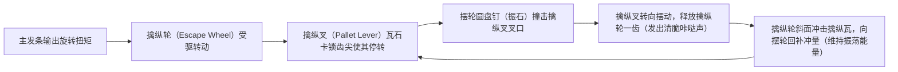
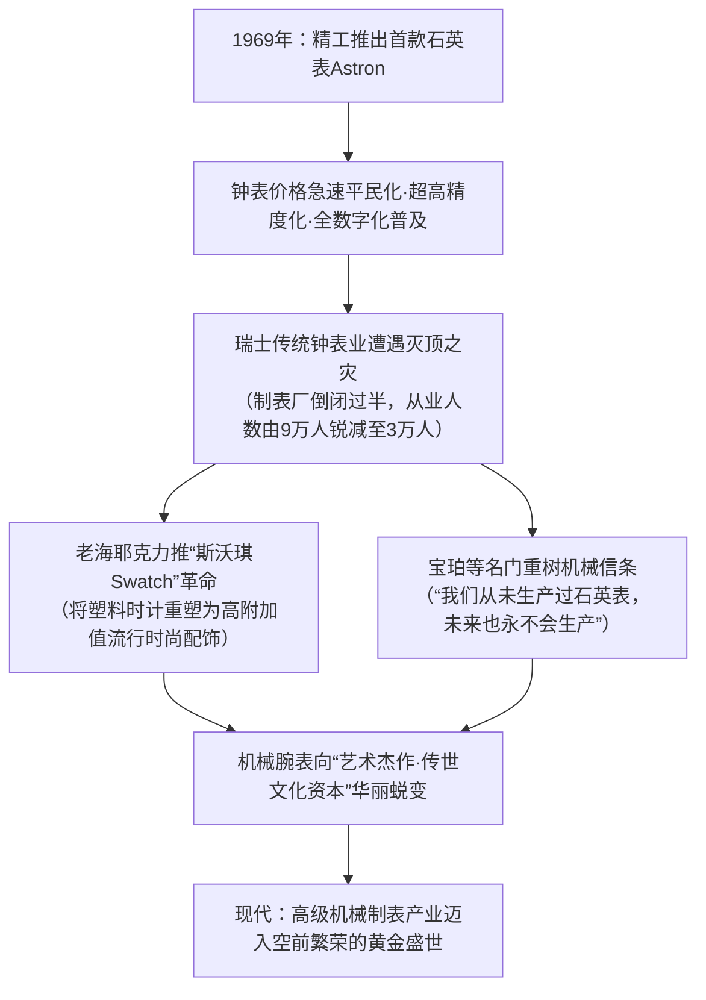
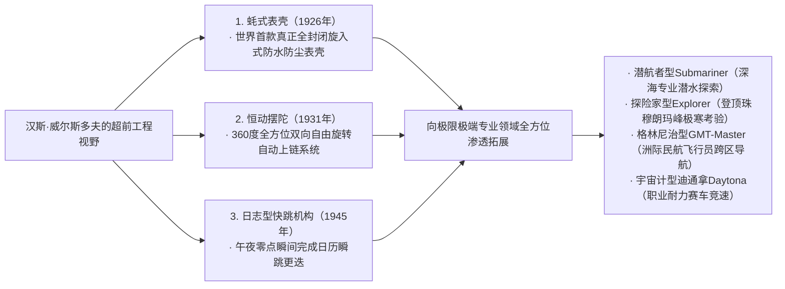

## 引言：作为微型宇宙的机械腕表

在直径仅40毫米、厚度仅数毫米的金属表壳内部，容纳着数百枚极微小的齿轮、杠杆、弹簧与红宝石轴承，分秒不差、严丝合缝地持续运转——这就是“机械腕表（Mechanical Watch）”。在人类发明的所有精密机械工程中，它是体积最小、结构最精巧、亦最具哲学意味的“微型宇宙（Microcosmos）”。

在石英表与智能手表凭借每秒数万次的石英晶体震荡或原子钟电波实现数字化计时的当代，为何仅凭发条物理弹性驱动的机械表，至今依然令全球无数人神往，甚至能以数千万元乃至数亿元人民币的艺术品天价在拍卖行成交？

其根本原因在于，机械表绝非单纯的“计时工具”，而是**“人类五百年来向牛顿力学、重力、摩擦力与热膨胀等物理法则极限不断发起挑战的智慧结晶”**。这里凝结着以阿伯拉罕-路易·宝玑（Abraham-Louis Breguet）为代表的天才制表大师们的物理直觉，瑞士汝山谷工匠代代相传的极致手工打磨技艺（Finishing），以及自产机芯制表工坊（Manufacture）对独立卓越的执着坚守。

本文将从瑞士钟表工业的诞生史切入，系统解构机械机芯的机构动力学、三大复杂功能（陀飞轮、万年历、三问报时）的微观几何学、以世界三大顶级制表品牌为代表的哲学理念、日本冠蓝狮所创立的Spring Drive混合物理学，以及从石英风暴到当代机械表文艺复兴的经济与文化演进，以严谨的学术与工程视角展开全景剖析。

```
【机械腕表的机构层级架构】

┌─────────────────┬───────────────────────────────┬───────────────────────────────┐
│ 功能模块        │ 核心部件与机械结构            │ 物理功用与支配定律            │
├─────────────────┼───────────────────────────────┼───────────────────────────────┤
│ 1. 动力部       │ 主发条、发条盒                │ 蓄积发条卷紧后的弹性势能，    │
│ （Power Source）│ （手动上链 / 自动上链摆陀）   │ 并向轮系稳定输出力矩          │
├─────────────────┼───────────────────────────────┼───────────────────────────────┤
│ 2. 传动部       │ 二番轮、三番轮、四番轮        │ 通过齿轮传动比（增速轮系），  │
│ （Gear Train）  │ （走时轮系·齿轴·小齿轮）      │ 将高力矩转化为高转速          │
├─────────────────┼───────────────────────────────┼───────────────────────────────┤
│ 3. 擒纵部       │ 擒纵轮、擒纵叉（瓦石）        │ 周期性锁止与释放轮系旋转，    │
│ （Escapement）  │ （瑞士杠杆式擒纵机构）        │ 向调速部件传递微小脉冲能量    │
├─────────────────┼───────────────────────────────┼───────────────────────────────┤
│ 4. 调速部       │ 摆轮、游丝                    │ 依靠简谐振动（等时性），      │
│ （Regulator）   │ （内桩、外桩、快慢针）        │ 产生精准恒定的“基准时间振动”  │
├─────────────────┼───────────────────────────────┼───────────────────────────────┤
│ 5. 显示部       │ 跨轮、分针轮管、时针、分针    │ 将调速后的旋转运动减速输出，  │
│ （Display）     │ 秒针、表盘                    │ 转化为人类可直观读取的时间信息│
└─────────────────┴───────────────────────────────┴───────────────────────────────┘
```

---

## 1. 钟表工业史：从胡格诺派迁徙到汝山谷的奇迹

### 1.1 宗教改革与瑞士钟表业的萌芽
机械钟表的源头可追溯至13至14世纪欧洲的修道院与城市钟楼（大型机械钟），然而将其微型化为可置于口袋的“怀表”，进而演进为佩戴于手腕的“腕表”，并最终使瑞士跃升为全球制表王国的历史进程，却深植于波澜壮阔的宗教变革之中。

1541年，在日内瓦推行宗教改革的约翰·加尔文（Jean Calvin）颁布严厉的禁欲法令，将穿戴金银珠宝与华美首饰视为“虚荣之恶”严加取缔。这一禁令使日内瓦名噪一时的金匠与雕刻金工瞬间失去生计，陷入灭顶之灾。
在绝境之中，手艺精湛的金匠们开辟出一条崭新道路——制造不被视为纯饰品、而被承认为“实用工具”的**“便携式时计（Watch）”**。金匠超凡的金属雕琢技艺与钟表机械构造完美交融，推动日内瓦迅速崛起为精湛的高级钟表制造之都。

另一关键历史转折发生在1685年，法国国王路易十四废除《南特敕令》。法国境内对新教徒（胡格诺派）的残酷迫害再度爆发，导致数万名精通精密机械、天文历法与冶金工艺的法国顶尖钟表匠逃亡至日内瓦避难。这批精英的涌入，为瑞士注入了无与伦比的技术底蕴。

### 1.2 汝拉山脉“钟表谷（汝山谷）”与分工整合制（Établissage）
聚集在日内瓦的钟表匠人与技术，随后向汝拉山脉险峻深邃的崇山峻岭——“汝山谷（Vallée de Joux）”及拉绍德封等地延伸蔓延。

汝山谷地处高寒地带，每年长达半年被大雪封山。当地农民利用漫长冬歇期，在自家阁楼开凿巨大的透光窗户，引入充足的自然光线，以家庭手工作坊的形式，全家分工磨砺制造极精密的钟表零部件（螺丝、齿轮、发条、擒纵件）。
待春回大地、积雪融化，日内瓦的钟表发行商（Établisseur）便驱车深入山谷，巡回收购散落于各户农舍的零件，运回日内瓦工坊进行最终的组装与高精度调校（Assembly）。这种高度专业化、模块化的水平分工生产体系被称为**“分工整合制（Établissage）”**。正是这种兼具精密分工与敏捷协作的产业架构，孕育出瑞士钟表惊人的精度与成本优势，一举击溃英法等国墨守成规的传统行会行规钟表工场。

---

## 2. 机械腕表的机构力学：微观物理学

### 2.1 调速机构的心脏：摆轮与游丝的“等时性”
决定机械钟表走时精度的终极物理法则，是伽利略·伽利莱发现的**“摆的等时性（Isochronism）”**。
单摆无论摆幅大或小，完成一次往复摆动所需的时间（周期）基本恒定。而在体积受限且随时变动方位的怀表与腕表中，无法依赖重力单摆，取而代之的是由**“摆轮（Balance Wheel）”**与卷曲如发丝的**“游丝（Balance Spring / Hairspring）”**构成的扭转振动系统。

摆轮振动周期 $T$ 可由以下力学公式严格表征：

$$T = 2\pi \sqrt{rac{I}{C}}$$

式中，$I$ 为摆轮的转动惯量，$C$ 为游丝的抗扭刚度（扭转弹簧常数）。
该公式揭示了一个极其关键的物理事实：**“振动周期 $T$ 在理论上完全独立于摆轮的振幅”**。无论主发条刚刚满链、输出扭矩强劲，抑或发条接近释放末端、输出扭矩减弱，摆轮始终以恒定的周期进行往复回旋。这正是机械时计得以精准丈量时间的物理基石。

```
【摆轮振频（Frequency）与走时精度的工程权衡】

· 5振频（18,000 vph / 2.5Hz）：
  摆轮每秒往复振动5次（每小时18,000次）。多见于早期怀表与古董腕表等低频机芯。
  机芯运作节奏沉稳从容，发出悠扬悦耳的“滴答·滴答”声。部件机械磨损极微，使用寿命极长。

· 6振频（21,600 vph / 3.0Hz）：
  传统手动上链机芯与经典名机（如百达翡丽 Cal.215 等）的常用基准振频。

· 8振频（28,800 vph / 4.0Hz）：
  当代现代机械腕表的绝对黄金标准（如劳力士 Cal.3135/3235、ETA 2824 等）。
  在外力冲击扰动稳定性与润滑油飞溅、机械部件磨损之间达成了最完美的工程平衡点。

· 10振频（36,000 vph / 5.0Hz）：
  即“高振频（High-Beat）”。摆轮每秒振动10次，秒针每步移动0.1秒，可实现1/10秒精度的机械计时。
  真力时（Zenith）“El Primero”、冠蓝狮（Grand Seiko）“9S85”为此类代表。抗外部位姿冲击能力极强，但润滑油衰减损耗较快，对微冶金材料与加工精度有着严苛要求。
```

### 2.2 瑞士杠杆式擒纵机构（Swiss Lever Escapement）的力学循环
单纯拥有精确简谐往复运动的摆轮调速系统尚不足以构成时钟，若无法将其转化为“轮系的定速旋转”，且不能持续向摆轮补充机械能（能量脉冲），摆轮终将因空气阻力与材料内阻而停摆。完成这套极细微控制转换的核心部件正是**“擒纵机构（Escapement）”**。



瑞士杠杆式擒纵机构以每秒5至10次的频率，分毫不爽地重复这一“锁止·释放·冲量补充”的毫秒级微动作。在一天（86,400秒）内承受约70万次、一年内承受约2.5亿次剧烈的金属与宝石微冲击碰撞，却能历经数年持续稳定运转无故障，展现了令人叹为观止的机械可靠性。

### 2.3 快慢针调节 vs 无卡度游丝摆轮
微调机械表走时快慢的工程路线，历史上演化出两种截然不同的设计哲学：

1. **快慢针调节（Regulator Index）**:
   利用两根微小限位销夹住游丝外圈，通过拨动微调杠杆改变游丝的“有效工作长度”，进而改变振动周期。此结构调校直观便捷，但在剧烈震动时微调夹容易发生微移，且限位销与游丝的物理接触会诱发微小的等时性扰动。
2. **无卡度游丝调校（Free Sprung Balance）**:
   以百达翡丽的“Gyromax摆轮”与劳力士的“Microstella微调螺母”为代表的高级制表巅峰配置。该方案彻底剔除了快慢针组件，游丝长度完全固定，**通过旋动安装在摆轮外缘的偏心砝码或微调螺母，直接微调摆轮自身的转动惯量 $I$**。其抗震抗位姿干扰性能卓绝，能在极其严苛的日常佩戴环境中维持超常的长期走时稳定性，但对制表师的手工装配与调校技艺有着极高门槛。

---

## 3. 三大顶级复杂功能（Grand Complications）的工学解剖

超越基础的时、分、秒指示，在纯机械机芯内融入天文历法、天籁声学报时或重力误差自补偿的超凡微型机械系统，被称为“复杂功能（Complication）”。而君临钟表技艺巅峰的，正是举世公认的“三大顶级复杂功能”。

```
【三大顶级复杂功能的工学机理与制造难点】

┌─────────────────┬───────────────────────────────┬───────────────────────────────┐
│ 复杂功能类别    │ 面临的核心物理挑战            │ 解决挑战的精密机械工程        │
├─────────────────┼───────────────────────────────┼───────────────────────────────┤
│ 陀飞轮          │ 腕表处于竖直平面时，地球引力  │ 将整个擒纵机构与摆轮置于旋转  │
│ （Tourbillon）  │ 导致游丝重心偏移并引发位差误差│ 框架内，每分钟旋转360度以抵消 │
├─────────────────┼───────────────────────────────┼───────────────────────────────┤
│ 万年历          │ 自动识别大小月（30/31/28天）  │ 搭载以四年（48个月）为物理编码│
│ （Perpetual Cal）│ 以及四年一遇的闰年2月（29天） │ 凹凸深浅的程序凸轮（大杠杆）  │
├─────────────────┼───────────────────────────────┼───────────────────────────────┤
│ 三问报时        │ 将肉眼不可见的当下精密时刻，  │ 齿条探测多级蜗形轮（蜗轮）阶梯│
│ （Minute Repeater）转化为高低音交错的纯机械敲钟声│ 驱动双音锤敲击淬火立体音簧    │
└─────────────────┴───────────────────────────────┴───────────────────────────────┘
```

### 3.1 陀飞轮（Tourbillon）：驯服重力的旋转框架
1801年，制表天才阿伯拉罕-路易·宝玑（Abraham-Louis Breguet）发明了陀飞轮（法文原意为“旋风”），它被公认为机械腕表在技术与视觉美学上的至高皇冠。

怀表在传统佩戴模式下，通常长时间垂直静置于绅士的背心口袋中。重力对摆轮与游丝施加单一方向的恒定拉扯，导致游丝在重力作用下向下微垂变形，重心偏移，从而产生严重的“方位误差（Position Error）”。
宝玑给出了极富物理洞察力的构想：“既然无法消除地球引力，何不让整个调速机构自身在空间中旋转起来？”

宝玑将擒纵轮、擒纵叉、摆轮与游丝全部置入一个极致轻量化的微型框架——**“旋转陀飞轮框架（Carriage / Cage）”**中。以四番轮为中心旋转轴，驱动整个框架**“每分钟精准自转一整周（360度）”**。
如此一来，即便腕表长时间处于竖直位置，摆轮系统在这一分钟内连续经历360度各方位的重力矢量拉扯，重力引起的走快与走慢在运动循环中自动互相抵消。
在总重量仅0.2至0.3克的钛合金或航空级轻质金属框架中装配数十枚精密部件，并保持零迟滞超低摩擦平稳自转，即便在现代，也仅有极少数顶级制表工坊能够独立攻克。

### 3.2 万年历（Perpetual Calendar）：机械计算机的鼻祖
常规日历手表每月固定行进至31日，因此在2月、4月、6月、9月和11月月末，佩戴者必须手动拔出表冠拔针调校日期。

而万年历（Perpetual Calendar）则依靠纯机械记忆，**不仅能够自动辨识“小月（30天）”与“大月（31天）”，还能无缝识别平年2月（28天）以及每四年一次的“闰年2月（29天）”**，在无需任何人工干预的前提下，准确无误地运行至公元2100年。

实现这一计算的核心机械“芯片”，是一个**“48个月程序凸轮（闰年齿轮）”**。在该齿轮的圆周边缘上，精确铣削出对应48个月（4年完整周期）深浅各异的机械凹槽：
- 31天的月份：凹槽最浅；
- 30天的月份：凹槽深度中等；
- 平年2月（28天）：凹槽最深；
- 闰年2月（29天）：凹槽深度介于中间。
一根由机械探针控制的长杠杆（大杠杆）在月末物理探测该凹槽深度，在午夜瞬间驱动日历盘跳动1格至4格。在电学尚未诞生的时代，工匠仅凭弹簧、凸轮与杠杆实现对复杂历法的物理编程，堪称微机械领域的绝代奇迹。

### 3.3 三问报时（Minute Repeater）：声学物理学的极境
在白炽灯与电力照明尚未普及的年代，贵族若想在漆黑深夜知晓当下时刻，只需推拉表壳侧边的滑柄滑簧，表内便会传出宛若天籁的金属钟声——“当、当……叮·当、叮·当……叮、叮”，通过音调与次数向听者精确报出时、刻、分——这就是三问报时机构。

- **低音（报时）**: 沉稳的低音锤击发出“当”，报出当前小时数（最多12次）；
- **高低交错复合音（报刻）**: 两个音锤交替发出“叮·当”，报出刻度（15分、30分、45分，最多3次）；
- **高音（报分）**: 清脆的高音锤击发出“叮”，报出不足一刻的单数分钟（1至14分，最多14次）。
（例如：7时42分 → 低音7次 ＋ 复合音2次表示30分 ＋ 高音12次 ＝ 共计42分）

机芯周边紧密环绕着两条经由特殊回火淬火工艺打造的高弹性合金钢圆弧音簧，微型音锤以恒定力度精确敲击。
当佩戴者推动上弦拨柄时，由时、刻、分各自对应的多级阶梯状微型凸轮（蜗形轮）与齿条啮合，以机械方式感测当前时间坐标。为了防止报时敲击因发条释放失控而抢速，内部引入了利用空气动力学阻力控速的“离心飞轮（旋转空气减速调速器）”，在悄然无声的高速回转中维持钟声节奏的庄严与稳定。为了激发余音袅袅的空灵音色，表壳材质的声学传导特性（玫瑰金、五级钛、铂金的声阻抗匹配）均经过精微的声学计算。

---

## 4. 全球顶级制表工坊与传世名企哲学

在制表业中，相较于从外部机芯厂采购毛坯机芯进行组装贴牌的组装品牌（Établisseur），能够独立完成机芯概念设计、研发构图、精密零件切削、打磨、组装直至整表出厂校准的全套工序的品牌，被称为**“真正意义上的自产制表工坊（Manufacture）”**，享有业界无可争议的崇高地位。

```
【全球巅峰制表工坊与其标志性杰作】

┌─────────────────┬───────────┬───────────────────────────────┐
│ 品牌名称        │ 创立年份  │ 核心哲学·标志性代表作·技术特色 │
├─────────────────┼───────────┼───────────────────────────────┤
│ 百达翡丽        │ 1839年    │ 世界三大名表之首。超越日内瓦印│
│ （Patek Philippe│ 瑞士      │ 记的PP印记。卡拉卓华、鹦鹉螺。│
│ ）              │           │ 代代相传的非凡价值与尊贵气韵  │
├─────────────────┼───────────┼───────────────────────────────┤
│ 爱彼            │ 1875年    │ 奢华运动腕表开山鼻祖。1972年  │
│ （Audemars      │ 瑞士      │ 杰罗·尊达倾力操刀的“皇家橡树”│
│  Piguet）       │           │ 颠覆顶级腕表传统审美与材质界限│
├─────────────────┼───────────┼───────────────────────────────┤
│ 江诗丹顿        │ 1755年    │ 自创立以来从未间断生产的世界最│
│ （Vacheron      │ 瑞士      │ 古老制表名厂。传承系列、纵横四│
│  Constantin）   │           │ 海。日内瓦卓越手工技艺的集大成│
├─────────────────┼───────────┼───────────────────────────────┤
│ 朗格            │ 1845年    │ 德系精密制表的至高丰碑。德国银│
│ （A. Lange &    │ 德国      │ 3/4夹板、双重组装工艺。Lange 1│
│  Söhne）        │           │ 偏心大日历的严谨理性几何美学  │
├─────────────────┼───────────┼───────────────────────────────┤
│ 劳力士          │ 1905年    │ 实用户外奢华腕表的绝对王者。  │
│ （Rolex）       │ 瑞士      │ 蚝式防水表壳、恒动双向自动摆陀│
│                 │           │ 经久耐用的工业微工程霸权      │
├─────────────────┼───────────┼───────────────────────────────┤
│ 欧米茄          │ 1848年    │ 阿波罗登月工程唯一指定登月表，│
│ （OMEGA）       │ 瑞士      │ 同轴擒纵系统与超高抗磁技术先锋│
├─────────────────┼───────────┼───────────────────────────────┤
│ 冠蓝狮          │ 1960年    │ 融汇机械发条与石英超高精度的  │
│ （Grand Seiko） │ 日本      │ 独门绝技“Spring Drive”微系统 │
└─────────────────┴───────────┴───────────────────────────────┘
```

### 4.1 百达翡丽（Patek Philippe）：钟表王座的无冕之皇
自1839年创立以来，百达翡丽深受维多利亚女王、爱因斯坦、柴可夫斯基等历史巨擘的深情青睐，是名副其实的钟表界终极君王。
“卡拉卓华（Calatrava）”展现了圆形腕表的极致黄金分割法则，“鹦鹉螺（Nautilus）”定义了顶级奢华运动腕表的优雅张力。
百达翡丽率先设立了超越日内瓦官方严格认证的自研严苛标准——“百达翡丽印记（PP Seal）”。其不仅要求日差达到惊人的−3至+2秒超高精密度，更承诺为自1839年品牌创立以来出厂的所有钟表提供终身维修与部件原样修复（Restore）服务。“没有人能真正拥有百达翡丽，只不过为下一代保管而已”这句传世格言，道尽了其跨越世纪的文化财产底蕴。

### 4.2 朗格（A. Lange & Söhne）：德国精密工学的浴火重光
坐落于德国萨克森州厄尔士山脉深处格拉苏蒂小镇的朗格，由费尔迪南多·阿道夫·朗格于1845年创设。在经历了二战战火重创、东德公有化解体改组并销声匿迹的悲壮历史后，伴随1990年两德统一，由品牌第四代传人瓦尔特·朗格（Walter Lange）使这一德系钟表巨擘奇迹般复兴涅槃。

朗格时计散发着与瑞士古典风格迥异的纯粹日耳曼理性工学美感：
- **未电镀德国银制 3/4夹板**: 以一整块未经电镀的洋银（铜镍锌合金）覆盖机芯绝大部分轮系，赋予机芯超凡的结构刚性。随着漫长岁月的洗礼，洋银表面会自然沉淀出一层温润优雅的淡金色包浆氧化膜。
- **螺丝固定黄金套筒**: 将红宝石轴承安放于18K纯金套筒内，并由手工高温烤制的湛蓝钢螺丝锁死固定于夹板之上，再现古典格拉苏蒂怀表的奢华工法。
- **手工雕花摆轮夹板**: 每一枚机芯的摆轮夹板均由雕刻大师手持刻刀纯手工雕琢花卉藤蔓纹样，每一道线条皆独一无二。
- **双重组装工艺（Double Assembly）**: 每一枚机芯在历经初次精密组装与全方位走时调校后，必须彻底全部拆卸，对所有零件进行二次超声波清洗、手工二次倒角抛光，而后再进行第二次正式组装——这是对极致完美的无上执念。

### 4.3 冠蓝狮与“Spring Drive”机芯的混合物理学
1960年，为了制造出在精度、坚固度与美学上全面超越瑞士天文台标准的顶级实用腕表，精工创立了“冠蓝狮（Grand Seiko）”。
而其技术成就的登峰造极之作，是历经20余年持续技术攻坚、于1999年正式商用问世的划时代独创机构——**“Spring Drive”**。

```
【Spring Drive（三女智调速机构 / Tri-synchro Regulator）的微系统动力学】

［机械能量源泉：主发条（Mainspring）］
· 内部完全不依赖电池或外置微型马达，纯粹由机械发条释放的弹性恢复力矩驱动。
  ↓
［增速轮系动力传递］
  ↓
［滑轮（glide wheel / 磁力转子）回旋运转：精准恒定8转/秒］
· 转子高速掠过定子线圈，通过法拉第电磁感应定律产生极其微弱的感应电动势（纳瓦级微电能）。
  ↓
［低功耗石英集成电路IC与石英晶体震荡器唤醒激活］
· 产生的微电流激活工作频率高达32,768Hz的高精度石英震荡器与超低功耗专用IC。
  ↓
［电磁非接触式阻尼制动无级调速］
· IC以每秒数百次的频率严密比对石英振荡信号与转子的实时转速。
· 若转子转速因发条释放而略有超速，线圈即施加非接触式电磁涡流制动平滑施加阻尼，
  将滑轮的转速极其精准地锁定在“每秒整整回转8圈”的恒定转速。
```

搭载Spring Drive机芯的秒针，不再呈现机械表步进式的微颤律动，亦非石英表每秒一跳的僵硬动作，而是在表盘之上呈现如天体运行般静谧无声、连绵滑移的**“平滑流动（Glide Motion）”**。它将机械表“无需更换电池的长久动能储备”与石英科技“月误差仅±15秒的绝对精度”合二为一，谱写了当代钟表工程史上由亚洲开辟的最具颠覆性的工程奇迹。

---

## 5. 石英危机与机械表文艺复兴的经济思想史

1969年12月25日，精工推出了世界上首款量产石英腕表“Astron 35SQ”。凭借日误差仅±0.2秒（月误差在5秒以内）、精确度超出传统机械表数百倍的压倒性优势，石英钟表的问世在世界钟表产业掀起了一场毁天灭地的超级海啸——史称**“石英危机（Quartz Crisis）”**。



瑞士制表业在这场产业洗劫中近乎遭遇毁灭性打击，数百家拥有百年历史的传统名厂相继破产关停。
然而，正是这场将机械表逼入绝境的存亡危机，促使人类彻底厘清并纯化了机械手表的“本质价值”。
如果钟表存在的唯一目的只是“知晓精确的时间”，那么一枚廉价的塑料石英表或一块智能手环显然更为高效。然而，人类佩戴于手腕之上的物什，从来都不只是一个简单的物理读数仪器。
遵循数百年不变的牛顿力学运转的游丝与咬合齿轮所散发的金属温情，顶级匠人在显微镜下耗费数周手工勾勒的日内瓦波纹与鱼鳞纹饰，以及能够超越使用者寿命代代传递的物质永恒性——这些是冰冷的硅芯片永远无法替代的人文质感。

在商业奇才让-克劳德·比弗（Jean-Claude Biver）与尼古拉斯·G·海耶克（Nicolas G. Hayek）等先锋领袖的哲学重构下，机械表完成了华丽转身：它由一种过时的精密计时工具，全面升华跃迁为**“凝聚人类灵魂温度与极限制表技艺的手工艺术孤品与佩戴式文化遗产”**。当下全球对高级机械表的狂热追捧，实质上是现代人在高度数字化、虚拟化的信息社会中，对真实物理机械质感与具身现实主义的审美反弹。

---

## 3.4 计时码表（Chronograph）的机构力学：秒表测时的微工程学

在所有复杂功能中，与赛车运动、航空航天及天文学探索结合最紧密的，当属测量短时间段流逝的“计时码表（Chronograph）”。一枚顶级计时码表的机械启闭阻尼手感与计时精度，取决于其“控制联动机构”与“离合动力传动机构”的工程架构组合。

```
【计时码表机芯的两大控制系统与两大离合架构】

┌─────────────────┬───────────────────────────────┬───────────────────────────────┐
│ 机构分类        │ 结构形态                      │ 机械工程特性与运作响应表现    │
├─────────────────┼───────────────────────────────┼───────────────────────────────┤
│ 启闭控制机构    │ 1. 导柱轮系统                 │ 立体圆柱外缘分布均等立柱。按压│
│                 │ （Column Wheel）              │ 手感极其轻柔顺滑，高端计时象征│
├─────────────────┼───────────────────────────────┼───────────────────────────────┤
│                 │ 2. 凸轮杠杆系统               │ 由多层金属冲压凸轮前后滑动。结│
│                 │ （Cam-Actuated）              │ 构耐造易量产，按压段落感生硬  │
├─────────────────┼───────────────────────────────┼───────────────────────────────┤
│ 动力离合方式    │ 1. 水平离合系统               │ 传动齿轮在水平平面内侧向摆动咬│
│ （Clutch）      │ （Horizontal Clutch）         │ 合。机械联动清晰可见，极具观赏│
├─────────────────┼───────────────────────────────┼───────────────────────────────┤
│                 │ 2. 垂直离合系统               │ 依靠微型摩擦摩擦片由上下两端  │
│                 │ （Vertical Clutch）           │ 压紧结合。启动时彻底杜绝针跳  │
└─────────────────┴───────────────────────────────┴───────────────────────────────┘
```

传统的水平侧向离合在按下启动按钮的瞬间，两个处于高速自转中的齿轮齿尖在水平侧向强行咬合，极易导致接触瞬间发生齿面错位摩擦，使得中央计时秒针产生肉眼可见的“震颤跳针（Jumping）”。
与之形成鲜明对比的是，当代顶级高性能现代计时机芯（如劳力士迪通拿搭载的 Cal.4130/4131、欧米茄超霸机芯、百年灵自产 Cal.01 等）广泛采用的**“垂直离合系统”**。它通过微型弹簧使上下两枚精密摩擦盘在垂直轴线上瞬间平整压紧咬合，彻底消除了启动跳针现象，且长时间保持计时秒针开启也不会对主走时轮系的力矩传递和摆幅精度产生任何可测的负面干扰，具备无可比拟的工程优势。

### 飞返与双追针（追针计时）
- **飞返功能（Flyback）**: 处于计时状态时，只需直接单次按下归零按钮，中央计时秒针瞬间完成“停止·归零·重新计时”三个连续动作。该功能最初专为战机飞行员在复杂空战中连续快速记录航向转弯用时而研制。
- **双追针功能（追针计时 / Rattrapante）**: 表盘中央叠置两根精密重合的计时秒针，按下追针按钮时，上方第一根秒针瞬间暂停锁定以供读取中间分段用时（分段计时），而下方第二根秒针继续不停奔跑；再次按下按钮，停顿的指针瞬间追赶上飞奔中的主针并再次完全合二为一，是计时机械结构的顶级登峰之作。

---

## 2.4 擒纵机构250年未遇之技术剧变：同轴擒纵与硅晶材料革命

在瑞士杠杆式擒纵系统统治制表业长达两百余年之后，20世纪末至21世纪初，一场旨在彻底终结机械钟表“两大宿敌”——机械摩擦与电磁干扰的材料与几何学革命席卷而来。

### 1. 乔治·丹尼尔斯的“同轴擒纵机构（Co-Axial Escapement）”
英国独立制表宗师乔治·丹尼尔斯（George Daniels）于1970年代发明、并由欧米茄（OMEGA）于1999年成功攻克量产工艺的同轴擒纵机构，是现代钟表机械拓扑学史上的伟大创举。

传统瑞士杠杆擒纵由于擒纵叉瓦石与擒纵轮齿面之间存在剧烈的“滑动摩擦（Sliding Friction）”，必须依赖润滑油来缓解磨损；而钟表润滑油随时间的推移不可避免地变质、氧化、干涸，是导致机芯走时精度长期劣化的核心病因。
同轴擒纵机构创造性地将大小双层擒纵轮重叠安置在同一旋转轴上，配合三颗复合擒纵瓦，实现了齿齿接触时近乎绝对垂直的**“径向冲推顶撞（低滑动点接触传动）”**。由于将滑动摩擦骤降至近乎忽略不计的微量级别，同轴擒纵系统理论上彻底摆脱了对润滑油的严苛依赖，使机械腕表的全面洗油保养周期由传统的3至5年一举跃升至8至10年。

### 2. 硅材料（单晶硅）带来的高科技微加工飞跃
2000年代以降，由百达翡丽、劳力士、欧米茄、宝玑等名门联手瑞士微技术研究所展开深度攻关，将半导体光刻微纳制造工艺（DRIE：深反应离子刻蚀）引入钟表零部件加工，成功研制出全单晶硅核心机件。
- **绝对抗磁性**: 单晶硅为非金属材料，即使置身于智能手机扬声器或高强永磁铁产生的磁场中，亦绝对不会发生任何磁化。
- **极致等时性与抗温变**: 借助单晶硅表面热氧化生长微米级二氧化硅包覆层技术（如百达翡丽Spiromax游丝），巧妙利用二氧化硅正温度弹性系数抵消单晶硅本身的负温度弹性系数，实现在剧烈温差环境下的恒定等时性。
- **超轻质量与分子级镜面光洁度**: 密度远低于传统金属弹簧合金，表面达到原子级平整度，大幅减少能量在往复振动中的惯性损耗与机械动能内耗。

---

## 4.4 劳力士（Rolex）：实用奢华腕表的工程学霸权

1905年由德国人格斯·汉斯·威尔斯多夫（Hans Wilsdorf）在英国伦敦创立（后迁往瑞士日内瓦）的劳力士，彻底颠覆了当时上流社会仅将腕表视作娇贵脆弱装饰品的刻板偏见，将其重塑为“可在最极端恶劣环境中分秒不差、极度可靠的终极工具装备”。



### 蚝式钢（904L超级奥氏体不锈钢）与自建冶金工厂
铸就劳力士钢铁般坚固声誉的基石，是其摒弃了整个钟表行业通用的“316L不锈钢”，在全系产品中全面换装原本专用于化工反应釜与航空航天工业的高性能特种耐蚀合金——**“蚝式钢（904L特种超级奥氏体不锈钢）”**。
该材质具有极高比例的铬、钼、镍与铜成分，抗海水盐雾及人体汗液氯离子点蚀与缝隙腐蚀的能力极其出众，经反复精密抛光后能折射出媲美贵金属白金般深邃皎洁的冷冽光泽。劳力士更在自设的贵金属浇铸冶金工厂中独立炼制黄金与白金，配制出即便数十年风吹日晒亦永不褪色的专利合金“永恒玫瑰金（Everose Gold）”，从微观冶金学源头筑起不可逾越的技术壁垒。

---

## 5.2 机芯手工打磨修饰（Finishing）与装饰美学

在顶级高级制表领域，一枚机芯超过一半的艺术附加值与工时成本，凝聚在制表师对机芯金属部件表面所施加的纯手工“打磨修饰（Finishing）”之中。顶级打磨不仅是赏心悦目的视觉仪式，更具有刮除机械切削微观毛刺、消除加工应力集中点、防止表面氧化锈蚀、捕集微尘杂质的关键工程实用价值。

```
【施加于顶级机芯之上的传统经典手工打磨工艺】

1. 倒角打磨（Anglage / 手工倒角）：
   对于夹板和桥架90度的锋利边缘，制表大师手持微型什锦锉刀、龙胆草木研磨木棒，蘸取极细钻石研磨膏，全凭指尖触觉削磨出45度绝对均一平整或微凹曲面，并手工抛光出无一丝瑕疵的镜面反光棱边。在光线倾斜掠过时，机芯轮廓线条犹如刀削斧劈般立体凸显。

2. 日内瓦波纹（Côtes de Genève / 缎面波纹）：
   工匠使用由黄杨木制作的微型高速回转磨盘，在桥板表面平推碾压出一道道严谨平行、间距均匀的微米级波浪形缎纹。随着视线角度变换，光影在波纹间流光溢彩。

3. 鱼鳞纹（Perlage / 珍珠圆纹）：
   在主夹板等隐匿于轮系深处的内层表面，工匠手持带有研磨头的气动立钻，以重叠交错的点压手法制作出密密麻麻排列如鱼鳞或珍珠般重叠的同心圆研磨纹。其微观凹凸能有效捕集微小游离尘埃，并锁住润滑微油膜。

4. 黑色抛光（Poli Noir / 镜面黑色抛光）：
   对于微小的钢质零件（如螺丝顶端、陀飞轮框架），将其放置在涂布有微米级金刚石微粉或超细氧化铝的纯锌板或锡板表面，纯手工以“8”字形反复平推数小时直至表面达到绝对分子级平整。当从特定角度观察时，零件会将所有光线完全朝同一方向镜面全反射，在正面视线中呈现出深邃凝重的“幽黑之色”，被尊为机芯手工抛光修饰的登峰造极之境。
```

由日内瓦州政府立法颁布监督的**“日内瓦印记（Poinçon de Genève）”**，要求机芯所有钢质零件边缘必须全手工倒角、螺丝头部与凹槽必须完全镜面研磨、红宝石轴承槽孔必须经过高光精抛等共计12条极其严苛的工程与美学准则。只有全数达标的艺术级机芯，方获准在主夹板镌刻这枚象征日内瓦市徽的骄傲印记。

---

## 4.5 独立制表师（AHCI）的激进探索与超高端微雕当代艺术

在历峰集团（Richemont）、斯沃琪集团（Swatch Group）、路威酩轩（LVMH）等超级资本巨鳄主导的当代钟表工业格局下，由少数传奇大师在独立个人工作室中、以完全不向商业妥协的极客态度亲手雕琢手表的“独立制表师协会（AHCI / Académie Horlogère des Créateurs Indépendants）”，将机械制表的艺术纯粹度推向了人类未曾触及的峰峦。

```
【当代独立制表大师与先锋极限钟表学代表】

1. 菲利普·杜佛（Philippe Dufour）：
   · 隐居于瑞士汝山谷勒桑捷小镇的微型作坊中，一生拒绝雇佣流水线学徒，全凭一人双手雕琢时计。
   · 代表作“简素之极（Simplicity）”：虽为仅指示时、分、秒的基础三针腕表，但其机芯夹板手工内倒角（Interior Anglage）的曲率开阔度与镜面打磨极限，被全球钟表鉴赏界奉为人类手工打磨天花板。
   · 代表作“双子星（Duality）”：搭载由差速齿轮将两组独立摆轮物理联动的双擒纵系统，在微型腕表空间内实现两组走时步度的瞬时机械平均抵消。

2. 弗朗索瓦-保罗·儒纳（François-Paul Journe / F.P. Journe）：
   · 以“Invenit et Fecit（我发明，我制作）”为永恒技术信条的绝代奇才。
   · 代表作“共振天文台Chronometre à Resonance”：将两套完全独立的摆轮系统相隔仅微米级微距并排安置，利用摆轮震动引发的微弱空气波动力与主夹板弹性谐振（Resonance），诱导两组摆轮产生自动锁定同频共振的惊世物理杰作。
   · 业界罕见地全系采用“18K玫瑰金”整体切削打造机芯主夹板与所有齿轮桥板。

3. 理查米尔（Richard Mille）：
   · 标榜“戴在手腕上的极速F1赛车”的21世纪超级现代腕表先锋。
   · 将碳纤维TPT复合材质、五级钛合金、整块纯人工蓝宝石水晶等尖端航空航天及深空材料全面融入表壳与机芯结构。
   · 为顶级网球巨星拉斐尔·纳达尔量身打造其在职业大满贯决赛中可全程佩戴挥拍、承受时速200公里发球剧烈冲击的“承受5,000G至12,000G超级冲击力”极限陀飞轮腕表，以数百万元至上千万元的超高端定位颠覆了传统钟表审美维度。
```

---

## 2.5 钟表的终极死敌“磁场”之战：抗磁工程演化史

在电子科技无孔不入的现代社会，智能手机、平板电脑、无线耳机充电盒磁吸搭扣、电磁炉等强磁场发生源在日常起居中随处可见。对于精密机械腕表而言，**“受磁（Magnetization）”**是破坏走时精度的最常见、最普遍的现代公害。

传统碳钢合金游丝一旦不慎受磁，游丝相邻盘旋的圈层便会因残余磁力相互粘连吸附在一起，导致游丝实际振动的有效工作长度瞬间缩短大半，引发机芯每天暴走数十分钟乃至数小时的严重故障。

```
【机械腕表抗磁工程的两大流派路线】

1. 物理屏蔽流派（屏蔽法拉第笼工学）：
   · 基本原理：为机芯穿上一套由“高导磁软铁”打造的全封闭内胆表壳。
   · 作用机制：外部磁力线射入时，会优先顺着磁阻极低的软铁外壳内部绕行分流（高透磁旁路效应），从而绕开并严密保护内部娇贵的摆轮游丝系统。
   · 经典名作：IWC 万国表“工程师（Ingenieur）”、劳力士“格磁型闪电针Milgauss”（承受1,000高斯强磁）。
   · 物理局限：由于增加了厚重的软铁屏蔽罩，表壳不可避免地厚重笨拙，且绝无法采用蓝宝石水晶透底后盖。

2. 本征非磁性材料流派（材料科学革命）：
   · 基本原理：彻底抛弃铁磁合金，机芯核心游丝、擒纵叉、擒纵轮直接采用非晶态合金、半导体单晶硅、高分子非磁性材料精制。
   · 经典名作：欧米茄“至臻天文台认证（Master Chronometer）”，能够正面硬抗15,000高斯（相当于医疗核磁共振MRI设备核心区域强磁场）而走时精度丝毫不受影响。全面换装Si14单晶硅游丝、液态金属（Liquidmetal）及钛合金关键轴承件。
   · 工程优势：无需在表壳内部增加笨重的软铁防磁罩，腕表得以保持轻薄典雅，佩戴者可在蓝宝石水晶透明表背下从容饱览机芯运转之美。
```

---

## 5.5 瑞士制表品质认证体系：日内瓦印记与COSC瑞士官方天文台检定

保障高端机械腕表卓越价值与走时精确度的，是第三方独立权威机构所制定的严苛法定检测标准体系。

```
【瑞士钟表产业核心品质评定基准】

1. COSC（瑞士官方天文台检测机构 / Contrôle Officiel Suisse des Chronomètres）：
   · 机构职能：仅针对瑞士境内制造的独立裸机芯进行高精度连续动态走时检测。
   · 评测规程：将裸机芯固定于专用测验支架，在5种典型日常空间方位（表面朝上、表面朝下、3点朝上、6点朝上、9点朝上）以及3种预设极限工作温度（8℃、23℃、38℃）下，经历长达15个昼夜的严苛连续走时监控。
   · 准入门槛：日均走时误差必须稳定控制在“−4秒至+6秒以内”（针对直径20mm以上的大型机芯）。每年在整个瑞士生产的数千万枚钟表中，仅有极少数顶级机芯能够成功摘得此项认证。

2. 日内瓦印记（Poinçon de Genève / 日内瓦城徽图腾雕刻）：
   · 历史沿革：由瑞士日内瓦大议会于1886年正式立法确立，代表全球制表业原产地认证与手工修饰等级的最高荣誉。
   · 地理法定资质：唯有将独立制表工坊设于日内瓦州境内，并在该州境内完成所有装配、调校与封装出厂检验的腕表，方具备申请评审资格。
   · 经典12条美学与技术硬性标准：
     - 所有的钢制传动零件所有棱角均须进行彻底的手工倒角抛光（Anglage），所有侧立面必须经由细密拉丝修饰，所有螺丝沉孔与研磨面均须呈现出无暇的镜面反光；
     - 所有螺丝头部及狭缝边缘必须经过精细倒角或全面镜面抛光处理；
     - 传动轮系中所有齿轮轮齿的上下表面均须倒角研磨，所有微型齿轴（Pinion）的轴颈和端面均必须经过纯手工镜面抛光；
     - 红宝石轴承的油孔周围必须经过高度光洁的精细研磨凹槽处理，以防润滑微油产生表面张力爬溢。
   · 现代动态补充规范：自2011年颁布全新严苛修订案以来，检测不仅限于静态单体裸机芯，更强制要求将机芯完全装入表壳、组装为整表成品后，在全自动模拟佩戴动感仪上完成整表动态测试，成品全表日均走时误差必须严苛锁定在“−1秒至+1秒以内”，并对其自动上链储能时长、真实防水密封性、全功能运转协调性进行无死角最终实测。在百达翡丽转而推行标准更为苛刻的自立“百达翡丽印记”后，江诗丹顿与罗杰杜彼（Roger Dubuis）依然骄傲地捍卫并传承着这一至尊荣誉。
```

---

## 6. 结语：佩戴在手腕上的微型宇宙

将一枚纯机械腕表戴上手腕，用指尖捏住表冠缓缓顺时针旋动上弦。指尖隐隐感受到内部发条齿轮相互咬合传来的细微阻尼震颤，将表耳贴紧耳畔，便能听见那清脆悠扬、如心脏搏动般急促跳动的“滴答·滴答……”之声。

在那方寸之间，澎湃激荡着五百年前自纽伦堡的彼得·亨莱因（Peter Henlein）研制发条以来，数十代钟表先哲与工匠大师倾尽毕生心血所凝练的智慧结晶。他们曾直面血雨腥风的宗教迫害、战火纷飞的时代浩劫、以及石英数码浪潮的惊涛骇浪，却始终心无旁骛、目光如炬，穷极一生去求索同一个终极命题——“如何以最精妙的机械构造，将时间这一无形无相、不可逆转的物理存在，丈量得更精准、切割得更具尊严与诗意？”

今天，我们只需在掌中轻点智能手机的玻璃屏幕，由环球GPS卫星群微秒级校正的万亿分之一秒精准时间便跃然眼前。
然而，当我们低头凝视手腕上那枚完全由发条驱动、摆轮往复旋回、金属指针在表盘上悄然滑过的机械时计，我们才会以最为真切、深沉的方式，感知到自己正与地球的重力引力、地壳的昼夜回转、乃至整个浩瀚宇宙的星辰律动共呼吸。

机械腕表，正是人类为了在有限的生命长度中对抗永恒时间的无垠深渊，所亲手铸造的、最为温存而高傲的“理性之铠”。
