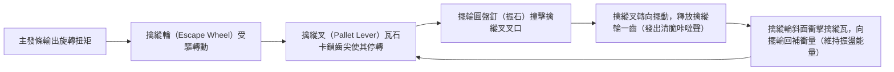
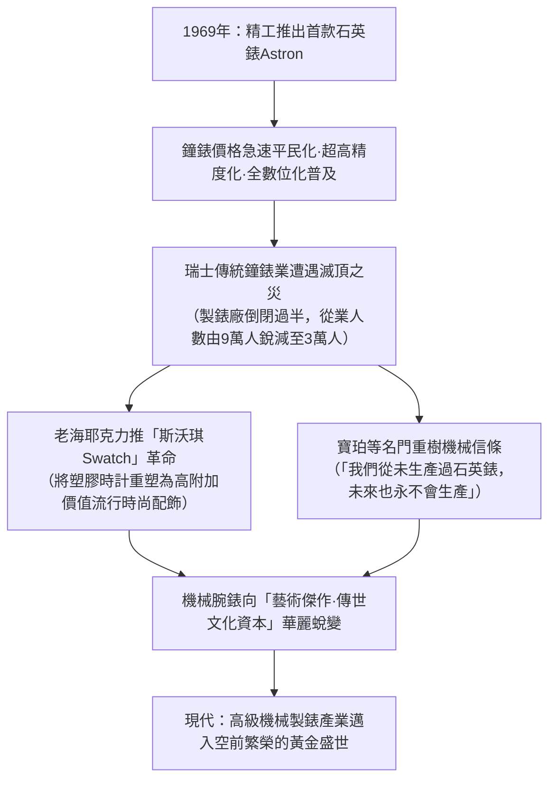
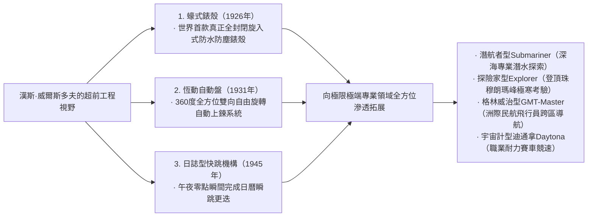

## 引言：作為微型宇宙的機械腕錶

在直徑僅40毫米、厚度僅數毫米的金屬錶殼內部，容納著數百枚極微小的齒輪、槓桿、彈簧與紅寶石軸承，分秒不差、嚴絲合縫地持續運轉——這就是「機械腕錶（Mechanical Watch）」。在人類發明的所有精密機械工程中，它是體積最小、結構最精巧、亦最具哲學意味的「微型宇宙（Microcosmos）」。

在石英錶與智慧手錶憑藉每秒數萬次的石英晶體振盪或原子鐘電波實現數位化計時的當代，為何僅憑發條物理彈性驅動的機械錶，至今依然令全球無數人神往，甚至能以數千萬元乃至數億元新台幣的藝術品天價在拍賣行成交？

其根本原因在於，機械錶絕非單純的「計時工具」，而是**「人類五百年來向牛頓力學、重力、摩擦力與熱膨脹等物理法則極限不斷發起挑戰的智慧結晶」**。這裡凝結著以阿伯拉罕-路易·寶璣（Abraham-Louis Breguet）為代表的天才製錶大師們的物理直覺，瑞士汝山谷工匠代代相傳的極致手工打磨技藝（Finishing），以及自產機芯製錶工坊（Manufacture）對獨立卓越的執著堅守。

本文將從瑞士鐘錶工業的誕生史切入，系統解構機械機芯的機構動力學、三大複雜功能（陀飛輪、萬年曆、三問報時）的微觀幾何學、以世界三大頂級製錶品牌為代表的哲學理念、日本冠藍獅所創立的Spring Drive混合物理學，以及從石英風暴到當代機械錶文藝復興的經濟與文化演進，以嚴謹的學術與工程視角展開全景剖析。

```
【機械腕錶的機構層級架構】

┌─────────────────┬───────────────────────────────┬───────────────────────────────┐
│ 功能模組        │ 核心部件與機械結構            │ 物理功用與支配定律            │
├─────────────────┼───────────────────────────────┼───────────────────────────────┤
│ 1. 動力部       │ 主發條、發條盒                │ 蓄積發條捲緊後的彈性位能，    │
│ （Power Source）│ （手動上鍊 / 自動上鍊自動盤） │ 並向輪系穩定輸出扭矩          │
├─────────────────┼───────────────────────────────┼───────────────────────────────┤
│ 2. 傳動部       │ 二番輪、三番輪、四番輪        │ 透過齒輪傳動比（增速輪系），  │
│ （Gear Train）  │ （走時輪系·齒軸·小齒輪）      │ 將高扭矩轉化為高轉速          │
├─────────────────┼───────────────────────────────┼───────────────────────────────┤
│ 3. 擒縱部       │ 擒縱輪、擒縱叉（紅寶石擒縱瓦）│ 週期性鎖止與釋放輪系旋轉，    │
│ （Escapement）  │ （瑞士槓桿式擒縱機構）        │ 向調速部件傳遞微小脈衝能量    │
├─────────────────┼───────────────────────────────┼───────────────────────────────┤
│ 4. 調速部       │ 擺輪、游絲                    │ 依靠簡諧振動（等時性），      │
│ （Regulator）   │ （內樁、外樁、快慢針）        │ 產生精準恆定的「基準時間振動」│
├─────────────────┼───────────────────────────────┼───────────────────────────────┤
│ 5. 顯示部       │ 跨輪、分針輪管、時針、分針    │ 將調速後的旋轉運動減速輸出，  │
│ （Display）     │ 秒針、面盤（錶盤）            │ 轉化為人類可直觀讀取的時間資訊│
└─────────────────┴───────────────────────────────┴───────────────────────────────┘
```

---

## 1. 鐘錶工業史：從胡格諾派遷徙到汝山谷的奇蹟

### 1.1 宗教改革與瑞士鐘錶業的萌芽
機械鐘錶的源頭可追溯至13至14世紀歐洲的修道院與城市鐘樓（大型機械鐘），然而將其微型化為可置於口袋的「懷錶」，進而演進為佩戴於手腕的「腕錶」，並最終使瑞士躍升為全球製錶王國的歷史進程，卻深植於波瀾壯闊的宗教變革之中。

1541年，在日內瓦推行宗教改革的約翰·喀爾文（Jean Calvin）頒布嚴厲的禁慾法令，將穿戴金銀珠寶與華美首飾視為「虛榮之惡」嚴加取締。這一禁令使日內瓦名噪一時的金匠與雕刻金工瞬間失去生計，陷入滅頂之災。
在絕境之中，手藝精湛的金匠們開闢出一條嶄新道路——製造不被視為純飾品、而被承認是「實用工具」的**「攜帶式時計（Watch）」**。金匠超凡的金屬雕琢技藝與鐘錶機械構造完美交融，推動日內瓦迅速崛起為精湛的高級鐘錶製造之都。

另一關鍵歷史轉折發生在1685年，法國國王路易十四廢除《南特敕令》。法國境內對新教徒（胡格諾派）的殘酷迫害再度爆發，導致數萬名精通精密機械、天文曆法與冶金工藝的法國頂尖鐘錶匠逃亡至日內瓦避難。這批菁英的湧入，為瑞士注入了無與倫比的技術底蘊。

### 1.2 汝拉山脈「鐘錶谷（汝山谷）」與分工整合制（Établissage）
聚集在日內瓦的鐘錶匠人與技術，隨後向汝拉山脈險峻深邃的崇山峻嶺——「汝山谷（Vallée de Joux）」及拉紹德封等地延伸蔓延。

汝山谷地處高寒地帶，每年長達半年被大雪封山。當地農民利用漫長冬歇期，在自家閣樓開鑿巨大的採光窗戶，引入充足的自然光線，以家庭手工作坊的形式，全家分工磨礪製造極精密的鐘錶零組件（螺絲、齒輪、發條、擒縱件）。
待春回大地、積雪融化，日內瓦的鐘錶發行商（Établisseur）便巡迴深入山谷，收購散落於各戶農舍的零件，運回日內瓦工坊進行最終的組裝與高精度調校（Assembly）。這種高度專業化、模組化的水平分工生產體系被稱為**「分工整合制（Établissage）」**。正是這種兼具精密分工與敏捷協作的產業架構，孕育出瑞士鐘錶驚人的精度與成本優勢，一舉擊潰英法等國墨守成規的傳統行會行規鐘錶工坊。

---

## 2. 機械腕錶的機構力學：微觀物理學

### 2.1 調速機構的心臟：擺輪與游絲的「等時性」
決定機械鐘錶走時精度的終極物理法則，是伽利略·伽利萊發現的**「擺的等時性（Isochronism）」**。
單擺無論擺幅大或小，完成一次往復擺動所需的時間（週期）基本恆定。而在體積受限且隨時變動方位的懷錶與腕錶中，無法依賴重力單擺，取而代之的是由**「擺輪（Balance Wheel）」**與捲曲如髮絲的**「游絲（Balance Spring / Hairspring）」**構成的扭轉振動系統。

擺輪振動週期 $T$ 可由以下力學公式嚴格表徵：

$$T = 2\pi \sqrt{\frac{I}{C}}$$

式中，$I$ 為擺輪的轉動慣量，$C$ 為游絲的抗扭剛度（扭轉彈簧常數）。
該公式揭示了一個極其關鍵的物理事實：**「振動週期 $T$ 在理論上完全獨立於擺輪的振幅」**。無論主發條剛剛滿鍊、輸出扭矩強勁，抑或發條接近釋放末端、輸出扭矩減弱，擺輪始終以恆定的週期進行往復旋轉。這正是機械時計得以精準丈量時間的物理基石。

```
【擺輪振頻（Frequency）與走時精度的工程權衡】

· 5振頻（18,000 vph / 2.5Hz）：
  擺輪每秒往復振動5次（每小時18,000次）。多見於早期懷錶與古董腕錶等低頻機芯。
  機芯運作節奏沉穩從容，發出悠揚悅耳的「滴答·滴答」聲。零件機械磨損極微，使用壽命極長。

· 6振頻（21,600 vph / 3.0Hz）：
  傳統手動上鍊機芯與經典名機（如百達翡麗 Cal.215 等）的常用基準振頻。

· 8振頻（28,800 vph / 4.0Hz）：
  當代現代機械腕錶的絕對黃金標準（如勞力士 Cal.3135/3235、ETA 2824 等）。
  在外力衝擊擾動穩定性與潤滑油飛濺、機械零件磨損之間達成了最完美的工程平衡點。

· 10振頻（36,000 vph / 5.0Hz）：
  即「高振頻（High-Beat）」。擺輪每秒振動10次，秒針每步移動0.1秒，可實現1/10秒精度的機械計時。
  真力時（Zenith）「El Primero」、冠藍獅（Grand Seiko）「9S85」為此類代表。抗外部位姿衝擊能力極強，但潤滑油衰減損耗較快，對微冶金材料與加工精度有著嚴苛要求。
```

### 2.2 瑞士槓桿式擒縱機構（Swiss Lever Escapement）的力學循環
單純擁有精確簡諧往復運動的擺輪調速系統尚不足以構成時計，若無法將其轉化為「輪系的定速旋轉」，且不能持續向擺輪補充機械能（能量脈衝），擺輪終將因空氣阻力與材料內阻而停擺。完成這套極細微控制轉換的核心部件正是**「擒縱機構（Escapement）」**。



瑞士槓桿式擒縱機構以每秒5至10次的頻率，分毫不爽地重複這一「鎖止·釋放·衝量補充」的毫秒級微動作。在一天（86,400秒）內承受約70萬次、一年內承受約2.5億次劇烈的金屬與寶石微衝擊碰撞，卻能歷經數年持續穩定運轉無故障，展現了令人嘆為觀止的機械可靠性。

### 2.3 快慢針調節 vs 無卡度游絲擺輪
微調機械錶走時快慢的工程路線，歷史上演化出兩種截然不同的設計哲學：

1. **快慢針調節（Regulator Index）**:
   利用兩根微小限位銷夾住游絲外圈，透過撥動微調槓桿改變游絲的「有效工作長度」，進而改變振動週期。此結構調校直觀便捷，但在劇烈震動時微調夾容易發生微移，且限位銷與游絲的物理接觸會誘發微小的等時性擾動。
2. **無卡度游絲調校（Free Sprung Balance）**:
   以百達翡麗的「Gyromax擺輪」與勞力士的「Microstella微調螺母」為代表的高級製錶巔峰配置。該方案徹底剔除了快慢針組件，游絲長度完全固定，**透過旋動安裝在擺輪外緣的偏心砝碼或微調螺母，直接微調擺輪自身的轉動慣量 $I$**。其抗震抗位姿干擾性能卓絕，能在極其嚴苛的日常佩戴環境中維持超常的長期走時穩定性，但對製錶師的手工裝配與調校技藝有著極高門檻。

---

## 3. 三大頂級複雜功能（Grand Complications）的工學解剖

超越基礎的時、分、秒指示，在純機械機芯內融入天文曆法、天籟聲學報時或重力誤差自補償的超凡微型機械系統，被稱為「複雜功能（Complication）」。而君臨鐘錶技藝巔峰的，正是舉世公認的「三大頂級複雜功能」。

```
【三大頂級複雜功能的工學機理與製造難點】

┌─────────────────┬───────────────────────────────┬───────────────────────────────┐
│ 複雜功能類別    │ 面臨的核心物理挑戰            │ 解決挑戰的精密機械工程        │
├─────────────────┼───────────────────────────────┼───────────────────────────────┤
│ 陀飛輪          │ 腕錶處於豎直平面時，地球引力  │ 將整個擒縱機構與擺輪置於旋轉  │
│ （Tourbillon）  │ 導致游絲重心偏移並引發位差誤差│ 框架內，每分鐘旋轉360度以抵消 │
├─────────────────┼───────────────────────────────┼───────────────────────────────┤
│ 萬年曆          │ 自動識別大小月（30/31/28天）  │ 搭載以四年（48個月）為物理編碼│
│ （Perpetual Cal）│ 以及四年一遇的閏年2月（29天） │ 凹凸深淺的程式凸輪（大槓桿）  │
├─────────────────┼───────────────────────────────┼───────────────────────────────┤
│ 三問報時        │ 將肉眼不可見的當下精密時刻，  │ 齒條探測多級蝸形輪（蝸輪）階梯│
│ （Minute Repeater）轉化為高低音交錯的純機械敲鐘聲│ 驅動雙音錘敲擊淬火立體音簧    │
└─────────────────┴───────────────────────────────┴───────────────────────────────┘
```

### 3.1 陀飛輪（Tourbillon）：馴服重力的旋轉框架
1801年，製錶天才阿伯拉罕-路易·寶璣（Abraham-Louis Breguet）發明了陀飛輪（法文原意為「旋風」），它被公認為機械腕錶在技術與視覺美學上的至高皇冠。

懷錶在傳統佩戴模式下，通常長時間垂直靜置於紳士的背心口袋中。重力對擺輪與游絲施加單一方向的恆定拉扯，導致游絲在重力作用下向下微垂變形，重心偏移，從而產生嚴重的「方位誤差（Position Error）」。
寶璣給出了極富物理洞察力的構想：「既然無法消除地球引力，何不讓整個調速機構自身在空間中旋轉起來？」

寶璣將擒縱輪、擒縱叉、擺輪與游絲全部置入一個極致輕量化的微型框架——**「旋轉陀飛輪框架（Carriage / Cage）」**中。以四番輪為中心旋轉軸，驅動整個框架**「每分鐘精準自轉一整周（360度）」**。
如此一來，即便腕錶長時間處於豎直位置，擺輪系統在這一分鐘內連續經歷360度各方位的重力向量拉扯，重力引起的走快與走慢在運動循環中自動互相抵消。
在總重量僅0.2至0.3克的鈦金屬或航空級輕質合金框架中裝配數十枚精密零件，並保持零遲滯超低摩擦平穩自轉，即便在現代，也僅有極少數頂級製錶工坊能夠獨立攻克。

### 3.2 萬年曆（Perpetual Calendar）：機械計算機的鼻祖
常規日曆手錶每月固定行進至31日，因此在2月、4月、6月、9月和11月月末，佩戴者必須手動拔出錶冠拔針調校日期。

而萬年曆（Perpetual Calendar）則依靠純機械記憶，**不僅能夠自動辨識「小月（30天）」與「大月（31天）」，還能無縫識別平年2月（28天）以及每四年一次的「閏年2月（29天）」**，在無需任何人工干預的前提下，準確無誤地運行至公元2100年。

實現這一計算的核心機械「晶片」，是一個**「48個月程式凸輪（閏年齒輪）」**。在該齒輪的圓周邊緣上，精確銑削出對應48個月（4年完整週期）深淺各異的機械凹槽：
- 31天的月份：凹槽最淺；
- 30天的月份：凹槽深度中等；
- 平年2月（28天）：凹槽最深；
- 閏年2月（29天）：凹槽深度介於中間。
一根由機械探針控制的長槓桿（大槓桿）在月末物理探測該凹槽深度，在午夜瞬間驅動日曆盤跳動1格至4格。在電學尚未誕生的時代，工匠僅憑彈簧、凸輪與槓桿實現對複雜曆法的物理編程，堪稱微機械領域的絕代奇蹟。

### 3.3 三問報時（Minute Repeater）：聲學物理學的極境
在白熾燈與電力照明尚未普及的年代，貴族若想在漆黑深夜知曉當下時刻，只需推拉錶殼側邊的滑柄滑簧，錶內便會傳出宛若天籟的金屬鐘聲——「當、當……叮·當、叮·當……叮、叮」，透過音調與次數向聽者精確報出時、刻、分——這就是三問報時機構。

- **低音（報時）**: 沉穩的低音錘擊發出「當」，報出當前小時數（最多12次）；
- **高低交錯複合音（報刻）**: 兩個音錘交替發出「叮·當」，報出刻度（15分、30分、45分，最多3次）；
- **高音（報分）**: 清脆的高音錘擊發出「叮」，報出不足一刻的單數分鐘（1至14分，最多14次）。
（例如：7時42分 → 低音7次 ＋ 複合音2次表示30分 ＋ 高音12次 ＝ 共計42分）

機芯周邊緊密環繞著兩條經由特殊回火淬火工藝打造的高彈性合金鋼圓弧音簧，微型音錘以恆定力度精確敲擊。
當佩戴者推動上弦撥柄時，由時、刻、分各自對應的多級階梯狀微型凸輪（蝸形輪）與齒條嚙合，以機械方式感測當前時間座標。為了防止報時敲擊因發條釋放失控而搶速，內部引入了利用空氣動力學阻力控速的「離心飛輪（旋轉空氣減速調速器）」，在悄然無聲的高速迴轉中維持鐘聲節奏的莊嚴與穩定。為了激發餘音嫋嫋的空靈音色，錶殼材質的聲學傳導特性（玫瑰金、五級鈦金屬、鉑金的聲阻抗匹配）均經過精微的聲學計算。

---

## 4. 全球頂級製錶工坊與傳世名企哲學

在製錶業中，相較於從外部機芯廠採購毛坯機芯進行組裝貼牌的組裝品牌（Établisseur），能夠獨立完成機芯概念設計、研發構圖、精密零件切削、打磨、組裝直至整錶出廠校準的全套工序的品牌，被稱為**「真正意義上的自產製錶工坊（Manufacture）」**，享有業界無可爭議的崇高地位。

```
【全球巔峰製錶工坊與其標誌性傑作】

┌─────────────────┬───────────┬───────────────────────────────┐
│ 品牌名稱        │ 創立年份  │ 核心哲學·標誌性代表作·技術特色 │
├─────────────────┼───────────┼───────────────────────────────┤
│ 百達翡麗        │ 1839年    │ 世界三大名錶之首。超越日內瓦印│
│ （Patek Philippe│ 瑞士      │ 記的PP印記。卡拉卓華、鸚鵡螺。│
│ ）              │           │ 代代相傳的非凡價值與尊貴氣韻  │
├─────────────────┼───────────┼───────────────────────────────┤
│ 愛彼            │ 1875年    │ 奢華運動腕錶開山鼻祖。1972年  │
│ （Audemars      │ 瑞士      │ 傑羅·尊達傾力操刀的「皇家橡樹」│
│  Piguet）       │           │ 顛覆頂級腕錶傳統審美與材質界限│
├─────────────────┼───────────┼───────────────────────────────┤
│ 江詩丹頓        │ 1755年    │ 自創立以來從未間斷生產的世界最│
│ （Vacheron      │ 瑞士      │ 古老製錶名廠。傳承系列、縱橫四│
│  Constantin）   │           │ 海。日內瓦卓越手工技藝的集大成│
├─────────────────┼───────────┼───────────────────────────────┤
│ 朗格            │ 1845年    │ 德系精密製錶的至高豐碑。德國銀│
│ （A. Lange &    │ 德國      │ 3/4夾板、雙重組裝工藝。Lange 1│
│  Söhne）        │           │ 偏心大日曆的嚴謹理性幾何美學  │
├─────────────────┼───────────┼───────────────────────────────┤
│ 勞力士          │ 1905年    │ 實用戶外奢華腕錶的絕對王者。  │
│ （Rolex）       │ 瑞士      │ 蠔式防水錶殼、恆動雙向自動盤  │
│                 │           │ 經久耐用的工業微工程霸權      │
├─────────────────┼───────────┼───────────────────────────────┤
│ 歐米茄          │ 1848年    │ 阿波羅登月任務唯一指定登月錶，│
│ （OMEGA）       │ 瑞士      │ 同軸擒縱系統與超高抗磁技術先鋒│
├─────────────────┼───────────┼───────────────────────────────┤
│ 冠藍獅          │ 1960年    │ 融匯機械發條與石英超高精度的  │
│ （Grand Seiko） │ 日本      │ 獨門絕技「Spring Drive」微系統│
└─────────────────┴───────────┴───────────────────────────────┘
```

### 4.1 百達翡麗（Patek Philippe）：鐘錶王座的無冕之皇
自1839年創立以來，百達翡麗深受維多利亞女王、愛因斯坦、柴可夫斯基等歷史巨擘的深情青睞，是名副其實的鐘錶界終極君王。
「卡拉卓華（Calatrava）」展現了圓形腕錶的極致黃金分割法則，「鸚鵡螺（Nautilus）」定義了頂級奢華運動腕錶的優雅張力。
百達翡麗率先設立了超越日內瓦官方嚴格認證的自研嚴苛標準——「百達翡麗印記（PP Seal）」。其不僅要求日差達到驚人的−3至+2秒超高精密度，更承諾為自1839年品牌創立以來出廠的所有鐘錶提供終身維修與零件原樣修復（Restore）服務。「沒有人能真正擁有百達翡麗，只不過為下一代保管而已」這句傳世格言，道盡了其跨越世紀的文化財產底蘊。

### 4.2 朗格（A. Lange & Söhne）：德國精密工學的浴火重光
坐落於德國薩克森州厄爾士山脈深處格拉蘇蒂小鎮的朗格，由費爾迪南多·阿道夫·朗格於1845年創設。在經歷了二戰戰火重創、東德公有化解體改組並銷聲匿跡的悲壯歷史後，伴隨1990年兩德統一，由品牌第四代傳人瓦爾特·朗格（Walter Lange）使這一德系鐘錶巨擘奇蹟般復興涅槃。

朗格時計散發著與瑞士古典風格迥異的純粹日耳曼理性工學美感：
- **未電鍍德國銀製 3/4夾板**: 以一整塊未經電鍍的洋銀（銅鎳鋅合金）覆蓋機芯絕大部分輪系，賦予機芯超凡的結構剛性。隨著漫長歲月的洗禮，洋銀表面會自然沉澱出一層溫潤優雅的淡金色包漿氧化膜。
- **螺絲固定黃金套筒**: 將紅寶石軸承安放於18K純金套筒內，並由手工高溫烤製的湛藍鋼螺絲鎖死固定於夾板之上，再現古典格拉蘇蒂懷錶的奢華工法。
- **手工雕花擺輪夾板**: 每一枚機芯的擺輪夾板均由雕刻大師手持刻刀純手工雕琢花卉藤蔓紋樣，每一道線條皆獨一無二。
- **雙重組裝工藝（Double Assembly）**: 每一枚機芯在歷經初次精密組裝與全方位走時調校後，必須徹底全部拆卸，對所有零件進行二次超音波清洗、手工二次倒角拋光，而後再進行第二次正式組裝——這是對極致完美的無上執念。

### 4.3 冠藍獅與「Spring Drive」機芯的混合物理學
1960年，為了製造出在精度、堅固度與美學上全面超越瑞士天文台標準的頂級實用腕錶，精工創立了「冠藍獅（Grand Seiko）」。
而其技術成就的登峰造極之作，是歷經20餘年持續技術攻堅、於1999年正式商用問世的劃時代獨創機構——**「Spring Drive」**。

```
【Spring Drive（三女智調速機構 / Tri-synchro Regulator）的微系統動力學】

［機械能量源泉：主發條（Mainspring）］
· 內部完全不依賴電池或外置微型馬達，純粹由機械發條釋放的彈性恢復扭矩驅動。
  ↓
［增速輪系動力傳遞］
  ↓
［滑輪（glide wheel / 磁力轉子）迴旋運轉：精準恆定8轉/秒］
· 轉子高速掠過定子線圈，透過法拉第電磁感應定律產生極其微弱的感應電動勢（奈瓦級微電能）。
  ↓
［低功耗石英積體電路IC與石英晶體振盪器喚醒激活］
· 產生的微電流激活工作頻率高達32,768Hz的高精度石英振盪器與超低功耗專用IC。
  ↓
［電磁非接觸式阻尼制動無段調速］
· IC以每秒數百次的頻率嚴密比對石英振盪訊號與轉子的即時轉速。
· 若轉子轉速因發條釋放而略有超速，線圈即施加非接觸式電磁渦流制動平滑施加阻尼，
  將滑輪的轉速極其精準地鎖定在「每秒整整迴轉8圈」的恆定轉速。
```

搭載Spring Drive機芯的秒針，不再呈現機械錶步進式的微顫律動，亦非石英錶每秒一跳的生硬動作，而是在面盤之上呈現如天體運行般靜謐無聲、連綿滑移的**「平滑流動（Glide Motion）」**。它將機械錶「無需更換電池的長久動能儲備」與石英科技「月誤差僅±15秒的絕對精度」合二為一，譜寫了當代鐘錶工程史上由亞洲開闢的最具顛覆性的工程奇蹟。

---

## 5. 石英危機與機械錶文藝復興的經濟思想史

1969年12月25日，精工推出了世界上首款量產石英腕錶「Astron 35SQ」。憑藉日誤差僅±0.2秒（月誤差在5秒以內）、精確度超出傳統機械錶數百倍的壓倒性優勢，石英鐘錶的問世在世界鐘錶產業掀起了一場毀天滅地的超級海嘯——史稱**「石英危機（Quartz Crisis）」**。



瑞士製錶業在這場產業洗劫中近乎遭遇毀滅性打擊，數百家擁有百年歷史的傳統名廠相繼破產關閉。
然而，正是這場將機械錶逼入絕境的存亡危機，促使人類徹底釐清並純化了機械手錶的「本質價值」。
如果鐘錶存在的唯一目的只是「知曉精確的時間」，那麼一枚廉價的塑膠石英錶或一塊智慧手環顯然更為高效。然而，人類佩戴於手腕之上的物什，從來都不只是一個簡單的物理讀數儀器。
遵循數百年不變的牛頓力學運轉的游絲與咬合齒輪所散發的金屬溫情，頂級匠人在顯微鏡下耗費數週手工勾勒的日內瓦波紋與魚鱗紋飾，以及能夠超越使用者壽命代代傳遞的物質永恆性——這些是冰冷的矽晶片永遠無法替代的人文質感。

在商業奇才讓-克勞德·比弗（Jean-Claude Biver）與尼古拉斯·G·海耶克（Nicolas G. Hayek）等先鋒領袖的哲學重構下，機械錶完成了華麗轉身：它由一種過時的精密計時工具，全面升華躍遷為**「凝聚人類靈魂溫度與極限制錶技藝的手工藝術孤品與佩戴式文化遺產」**。當下全球對高級機械錶的狂熱追捧，實質上是現代人在高度數位化、虛擬化的資訊社會中，對真實物理機械質感與具身現實主義的審美反彈。

---

## 3.4 計時碼錶（Chronograph）的機構力學：碼錶測時的微工程學

在所有複雜功能中，與賽車運動、航空航天及天文學探索結合最緊密的，當屬測量短時間段流逝的「計時碼錶（Chronograph）」。一枚頂級計時碼錶的機械啟閉阻尼手感與計時精度，取決於其「控制連動機構」與「離合動力傳動機構」的工程架構組合。

```
【計時碼錶機芯的兩大控制系統與兩大離合架構】

┌─────────────────┬───────────────────────────────┬───────────────────────────────┐
│ 機構分類        │ 結構形態                      │ 機械工程特性與運作響應表現    │
├─────────────────┼───────────────────────────────┼───────────────────────────────┤
│ 啟閉控制機構    │ 1. 導柱輪系統                 │ 立體圓柱外緣分布均等立柱。按壓│
│                 │ （Column Wheel）              │ 手感極其輕柔順滑，高端計時象徵│
├─────────────────┼───────────────────────────────┼───────────────────────────────┤
│                 │ 2. 凸輪槓桿系統               │ 由多層金屬沖壓凸輪前後滑動。結│
│                 │ （Cam-Actuated）              │ 構耐造易量產，按壓段落感生硬  │
├─────────────────┼───────────────────────────────┼───────────────────────────────┤
│ 動力離合方式    │ 1. 水平離合系統               │ 傳動齒輪在水平平面內側向擺動咬│
│ （Clutch）      │ （Horizontal Clutch）         │ 合。機械連動清晰可見，極具觀賞│
├─────────────────┼───────────────────────────────┼───────────────────────────────┤
│                 │ 2. 垂直離合系統               │ 依靠微型摩擦片由上下兩端壓緊  │
│                 │ （Vertical Clutch）           │ 結合。啟動時徹底杜絕指針跳動  │
└─────────────────┴───────────────────────────────┴───────────────────────────────┘
```

傳統的水平側向離合在按下啟動按鈕的瞬間，兩個處於高速自轉中的齒輪齒尖在水平側向強行咬合，極易導致接觸瞬間發生齒面錯位摩擦，使得中央計時秒針產生肉眼可見的「震顫跳針（Jumping）」。
與之形成鮮明對比的是，當代頂級高性能現代計時機芯（如勞力士迪通拿搭載的 Cal.4130/4131、歐米茄超霸機芯、百年靈自產 Cal.01 等）廣泛採用的**「垂直離合系統」**。它透過微型彈簧使上下兩枚精密摩擦盤在垂直軸線上瞬間平整壓緊咬合，徹底消除了啟動跳針現象，且長時間保持計時秒針開啟也不會對主走時輪系的扭矩傳遞和擺幅精度產生任何可測的負面干擾，具備無可比擬的工程優勢。

### 飛返與雙追針（追針計時）
- **飛返功能（Flyback）**: 處於計時狀態時，只需直接單次按下歸零按鈕，中央計時秒針瞬間完成「停止·歸零·重新計時」三個連續動作。該功能最初專為戰機飛行員在複雜空戰中連續快速記錄航向轉彎用時而研製。
- **雙追針功能（追針計時 / Rattrapante）**: 錶盤中央疊置兩根精密重合的計時秒針，按下追針按鈕時，上方第一根秒針瞬間暫停鎖定以供讀取中間分段用時（分段計時），而下方第二根秒針繼續不停奔跑；再次按下按鈕，停頓的指針瞬間追趕上飛奔中的主針並再次完全合二為一，是計時機械結構的頂級登峰之作。

---

## 2.4 擒縱機構250年未遇之技術劇變：同軸擒縱與矽晶材料革命

在瑞士槓桿式擒縱系統統治製錶業長達兩百餘年之後，20世紀末至21世紀初，一場旨在徹底終結機械鐘錶「兩大宿敵」——機械摩擦與電磁干擾的材料與幾何學革命席捲而來。

### 1. 喬治·丹尼爾斯的「同軸擒縱機構（Co-Axial Escapement）」
英國獨立製錶宗師喬治·丹尼爾斯（George Daniels）於1970年代發明、並由歐米茄（OMEGA）於1999年成功攻克量產工藝的同軸擒縱機構，是現代鐘錶機械拓撲學史上的偉大創舉。

傳統瑞士槓桿擒縱由於擒縱叉瓦石與擒縱輪齒面之間存在劇烈的「滑動摩擦（Sliding Friction）」，必須依賴潤滑油來緩解磨損；而鐘錶潤滑油隨時間的推移不可避免地變質、氧化、乾涸，是導致機芯走時精度長期劣化的核心病因。
同軸擒縱機構創造性地將大小雙層擒縱輪重疊安置在同一旋轉軸上，配合三顆複合擒縱瓦，實現了齒齒接觸時近乎絕對垂直的**「徑向衝推頂撞（低滑動點接觸傳動）」**。由於將滑動摩擦驟降至近乎忽略不計的微量級別，同軸擒縱系統理論上徹底擺脫了對潤滑油的嚴苛依賴，使機械腕錶的全面洗油保養週期由傳統的3至5年一舉躍升至8至10年。

### 2. 矽材料（單晶矽）帶來的高科技微加工飛躍
2000年代以降，由百達翡麗、勞力士、歐米茄、寶璣等名門聯手瑞士微技術研究所展開深度攻關，將半導體微影微納製造工藝（DRIE：深反應離子蝕刻）引入鐘錶零組件加工，成功研製出全單晶矽核心機件。
- **絕對抗磁性**: 單晶矽為非金屬材料，即使置身於智慧手錶喇叭或高強永磁鐵產生的磁場中，亦絕對不會發生任何磁化。
- **極致等時性與抗溫變**: 借助單晶矽表面熱氧化生長微米級二氧化矽包覆層技術（如百達翡麗Spiromax游絲），巧妙利用二氧化矽正溫度彈性係數抵消單晶矽本身的負溫度彈性係數，實現在劇烈溫差環境下的恆定等時性。
- **超輕質量與分子級鏡面光潔度**: 密度遠低於傳統金屬彈簧合金，表面達到原子級平整度，大幅減少能量在往復振動中的慣性損耗與機械動能內耗。

---

## 4.4 勞力士（Rolex）：實用奢華腕錶的工程學霸權

1905年由德國人格斯·漢斯·威爾斯多夫（Hans Wilsdorf）在英國倫敦創立（後遷往瑞士日內瓦）的勞力士，徹底顛覆了當時上流社會僅將腕錶視作嬌貴脆弱裝飾品的刻板偏見，將其重塑為「可在最極端惡劣環境中分秒不差、極度可靠的終極工具裝備」。



### 蠔式鋼（904L超級奧氏體不鏽鋼）與自建冶金工廠
鑄就勞力士鋼鐵般堅固聲譽的基石，是其摒棄了整個鐘錶行業通用的「316L不鏽鋼」，在全系列產品中全面換裝原本專用於化工反應釜與航空航天工業的高性能特種耐蝕合金——**「蠔式鋼（904L特種超級奧氏體不鏽鋼）」**。
該材質具有極高比例的鉻、鉬、鎳與銅成分，抗海水鹽霧及人體汗液氯離子點蝕與縫隙腐蝕的能力極其出眾，經反覆精密拋光後能折射出媲美貴金屬白金般深邃皎潔的冷冽光澤。勞力士更在自設的貴金屬澆鑄冶金工廠中獨立煉製黃金與白金，配製出即便數十年風吹日曬亦永不褪色的專利合金「永恆玫瑰金（Everose Gold）」，從微觀冶金學源頭築起不可逾越的技術壁壘。

---

## 5.2 機芯手工打磨修飾（Finishing）與裝飾美學

在頂級高級製錶領域，一枚機芯超過一半的藝術附加價值與工時成本，凝聚在製錶師對機芯金屬部件表面所施加的純手工「打磨修飾（Finishing）」之中。頂級打磨不僅是賞心悅目的視覺儀式，更具有刮除機械切削微觀毛刺、消除加工應力集中點、防止表面氧化鏽蝕、捕集微塵雜質的關鍵工程實用價值。

```
【施加於頂級機芯之上的傳統經典手工打磨工藝】

1. 倒角打磨（Anglage / 手工倒角）：
   對於夾板和橋架90度的鋒利邊緣，製錶大師手持微型什錦銼刀、龍膽草木研磨木棒，蘸取極細鑽石研磨膏，全憑指尖觸覺削磨出45度絕對均一平整或微凹曲面，並手工拋光出無一絲瑕疵的鏡面反光棱邊。在光線傾斜掠過時，機芯輪廓線條猶如刀削斧劈般立體凸顯。

2. 日內瓦波紋（Côtes de Genève / 緞面波紋）：
   工匠使用由黃楊木製作的微型高速迴轉磨盤，在橋板表面平推碾壓出一道道嚴謹平行、間距均勻的微米級波浪形緞紋。隨著視線角度變換，光影在波紋間流光溢彩。

3. 魚鱗紋（Perlage / 珍珠圓紋）：
   在主夾板等隱匿於輪系深處的內層表面，工匠手持帶有研磨頭的氣動立鑽，以重疊交錯的點壓手法製作出密密麻麻排列如魚鱗或珍珠般重疊的同心圓研磨紋。其微觀凹凸能有效捕集微小游離塵埃，並鎖住潤滑微油膜。

4. 黑色拋光（Poli Noir / 鏡面黑色拋光）：
   對於微小的鋼質零件（如螺絲頂端、陀飛輪框架），將其放置在塗布有微米級金剛石微粉或超細氧化鋁的純鋅板或錫板表面，純手工以「8」字形反覆平推數小時直至表面達到絕對分子級平整。當從特定角度觀察時，零件會將所有光線完全朝同一方向鏡面全反射，在正面視線中呈現出深邃凝重的「幽黑之色」，被尊為機芯手工拋光修飾的登峰造極之境。
```

由日內瓦州政府立法頒布監督的**「日內瓦印記（Poinçon de Genève）」**，要求機芯所有鋼質零件邊緣必須全手工倒角、螺絲頭部與凹槽必須完全鏡面研磨、紅寶石軸承槽孔必須經過高光精拋等共計12條極其嚴苛的工程與美學準則。只有全數達標的藝術級機芯，方獲准在主夾板鐫刻這枚象徵日內瓦市徽的驕傲印記。

---

## 4.5 獨立製錶師（AHCI）的激進探索與超高端微雕當代藝術

在歷峰集團（Richemont）、斯沃琪集團（Swatch Group）、路威酩軒（LVMH）等超級資本巨鱷主導的當代鐘錶工業格局下，由少數傳奇大師在獨立個人工作室中、以完全不向商業妥協的極客態度親手雕琢手錶的「獨立製錶師協會（AHCI / Académie Horlogère des Créateurs Indépendants）」，將機械製錶的藝術純粹度推向了人類未曾觸及的峰巒。

```
【當代獨立製錶大師與先鋒極限鐘錶學代表】

1. 菲利普·杜佛（Philippe Dufour）：
   · 隱居於瑞士汝山谷勒桑捷小鎮的微型作坊中，一生拒絕僱用流水線學徒，全憑一人雙手雕琢時計。
   · 代表作「簡素之極（Simplicity）」：雖為僅指示時、分、秒的基礎三針腕錶，但其機芯夾板手工內倒角（Interior Anglage）的曲率開闊度與鏡面打磨極限，被全球鐘錶鑑賞界奉為人類手工打磨天花板。
   · 代表作「雙子星（Duality）」：搭載由差速齒輪將兩組獨立擺輪物理連動的雙擒縱系統，在微型腕錶空間內實現兩組走時步度的瞬時機械平均抵消。

2. 弗朗索瓦-保羅·儒納（François-Paul Journe / F.P. Journe）：
   · 以「Invenit et Fecit（我發明，我製作）」為永恆技術信條的絕代奇才。
   · 代表作「共振天文台Chronometre à Resonance」：將兩套完全獨立的擺輪系統相隔僅微米級微距並排安置，利用擺輪震動引發的微弱空氣波動力與主夾板彈性諧振（Resonance），誘導兩組擺輪產生自動鎖定同頻共振的驚世物理傑作。
   · 業界罕見地全系採用「18K玫瑰金」整體切削打造機芯主夾板與所有齒輪橋板。

3. 理查米爾（Richard Mille）：
   · 標榜「戴在手腕上的極速F1賽車」的21世紀超級現代腕錶先鋒。
   · 將碳纖維TPT複合材質、五級鈦金屬、整塊純人工藍寶石水晶等尖端航空航天及深空材料全面融入錶殼與機芯結構。
   · 為頂級網球巨星拉斐爾·納達爾量身打造其在職業大滿貫決賽中可全程佩戴揮拍、承受時速200公里發球劇烈衝擊的「承受5,000G至12,000G超級衝擊力」極限陀飛輪腕錶，以數百萬元至上千萬元的超高端定位顛覆了傳統鐘錶審美維度。
```

---

## 2.5 鐘錶的終極死敵「磁場」之戰：抗磁工程演化史

在電子科技無孔不入的現代社會，智慧型手機、平板電腦、無線耳機充電盒磁吸搭扣、電磁爐等強磁場發生源在日常起居中隨處可見。對於精密機械腕錶而言，**「受磁（Magnetization）」**是破壞走時精度的最常見、最普遍的現代公害。

傳統碳鋼合金游絲一旦不慎受磁，游絲相鄰盤旋的圈層便會因殘餘磁力相互粘連吸附在一起，導致游絲實際振動的有效工作長度瞬間縮短大半，引發機芯每天暴走數十分鐘乃至數小時的嚴重故障。

```
【機械腕錶抗磁工程的兩大流派路線】

1. 物理屏蔽流派（屏蔽法拉第籠工學）：
   · 基本原理：為機芯穿上一套由「高導磁軟鐵」打造的全封閉內膽錶殼。
   · 作用機制：外部磁力線射入時，會優先順著磁阻極低的軟鐵外殼內部繞行分流（高透磁旁路效應），從而繞開並嚴密保護內部嬌貴的擺輪游絲系統。
   · 經典名作：IWC 萬國錶「工程師（Ingenieur）」、勞力士「抗磁型閃電針Milgauss」（承受1,000高斯強磁）。
   · 物理局限：由於增加了厚重的軟鐵屏蔽罩，錶殼不可避免地厚重笨拙，且絕無法採用藍寶石水晶透底後蓋。

2. 本徵非磁性材料流派（材料科學革命）：
   · 基本原理：徹底拋棄鐵磁合金，機芯核心游絲、擒縱叉、擒縱輪直接採用非晶態合金、半導體單晶矽、高分子非磁性材料精製。
   · 經典名作：歐米茄「至臻天文台認證（Master Chronometer）」，能夠正面硬抗15,000高斯（相當於醫療核磁共振MRI設備核心區域強磁場）而走時精度絲毫不受影響。全面換裝Si14單晶矽游絲、液態金屬（Liquidmetal）及鈦合金關鍵軸承件。
   · 工程優勢：無需在錶殼內部增加笨重的軟鐵防磁罩，腕錶得以保持輕薄典雅，佩戴者可在藍寶石水晶透明錶背下從容飽覽機芯運轉之美。
```

---

## 5.5 瑞士製錶品質認證體系：日內瓦印記與COSC瑞士官方天文台檢定

保障高端機械腕錶卓越價值與走時精確度的，是第三方獨立權威機構所制定的嚴苛法定檢測標準體系。

```
【瑞士鐘錶產業核心品質評定基準】

1. COSC（瑞士官方天文台檢測機構 / Contrôle Officiel Suisse des Chronomètres）：
   · 機構職能：僅針對瑞士境內製造的獨立裸機芯進行高精度連續動態走時檢測。
   · 評測規程：將裸機芯固定於專用測驗支架，在5種典型日常空間方位（表面朝上、表面朝下、3點朝上、6點朝上、9點朝上）以及3種預設極限工作溫度（8℃、23℃、38℃）下，經歷長達15個晝夜的嚴苛連續走時監控。
   · 准入門檻：日均走時誤差必須穩定控制在「−4秒至+6秒以內」（針對直徑20mm以上的大型機芯）。每年在整個瑞士生產的數千萬枚鐘錶中，僅有極少數頂級機芯能夠成功摘得此項認證。

2. 日內瓦印記（Poinçon de Genève / 日內瓦城徽圖騰雕刻）：
   · 歷史沿革：由瑞士日內瓦大議會於1886年正式立法確立，代表全球製錶業原產地認證與手工修飾等級的最高榮譽。
   · 地理法定資質：唯有將獨立製錶工坊設於日內瓦州境內，並在該州境內完成所有裝配、調校與封裝出廠檢驗的腕錶，方具備申請評審資格。
   · 經典12條美學與技術硬性標準：
     - 所有的鋼製傳動零件所有棱角均須進行徹底的手工倒角拋光（Anglage），所有側立面必須經由細密拉絲修飾，所有螺絲沉孔與研磨面均須呈現出無暇的鏡面反光；
     - 所有螺絲頭部及狹縫邊緣必須經過精細倒角或全面鏡面拋光處理；
     - 傳動輪系中所有齒輪輪齒的上下表面均須倒角研磨，所有微型齒軸（Pinion）的軸頸和端面均必須經過純手工鏡面拋光；
     - 紅寶石軸承的油孔周圍必須經過高度光潔的精細研磨凹槽處理，以防潤滑微油產生表面張力爬溢。
   · 現代動態補充規範：自2011年頒布全新嚴苛修訂案以來，檢測不僅限於靜態單體裸機芯，更強制要求將機芯完全裝入錶殼、組裝為整錶成品後，在全自動模擬佩戴動感儀上完成整錶動態測試，成品全錶日均走時誤差必須嚴苛鎖定在「−1秒至+1秒以內」，並對其自動上鍊儲能時長、真實防水密封性、全功能運轉協調性進行無死角最終實測。在百達翡麗轉而推行標準更為苛刻的自立「百達翡麗印記」後，江詩丹頓與羅傑杜彼（Roger Dubuis）依然驕傲地捍衛並傳承著這一至尊榮譽。
```

---

## 6. 結語：佩戴在手腕上的微型宇宙

將一枚純機械腕錶戴上手腕，用指尖捏住錶冠緩緩順時針旋動上鍊。指尖隱隱感受到內部發條齒輪相互咬合傳來的細微阻尼震顫，將錶耳貼緊耳畔，便能聽見那清脆悠揚、如心臟搏動般急促跳動的「滴答·滴答……」之聲。

在那方寸之間，澎湃激盪著五百年前自紐倫堡的彼得·亨萊因（Peter Henlein）研製發條以來，數十代鐘錶先哲與工匠大師傾盡畢生心血所凝練的智慧結晶。他們曾直面血雨腥風的宗教迫害、戰火紛飛的時代浩劫、以及石英數位浪潮的驚濤駭浪，卻始終心無旁騖、目光如炬，窮極一生去求索同一個終極命題——「如何以最精妙的機械構造，將時間這一無形無相、不可逆轉的物理存在，丈量得更精準、切割得更具尊嚴與詩意？」

今天，我們只需在掌中輕點智慧手錶或智慧型手機的玻璃螢幕，由環球GPS衛星群微秒級校正的萬億分之一秒精準時間便躍然眼前。
然而，當我們低頭凝視手腕上那枚完全由發條驅動、擺輪往復旋回、金屬指針在面盤上悄然滑過的機械時計，我們才會以最為真切、深沉的方式，感知到自己正與地球的重力引力、地殼的晝夜迴轉、乃至整個浩瀚宇宙的星辰律動共呼吸。

機械腕錶，正是人類為了在有限的生命長度中對抗永恆時間的無垠深淵，所親手鑄造的、最為溫存而高傲的「理性之鎧」。
