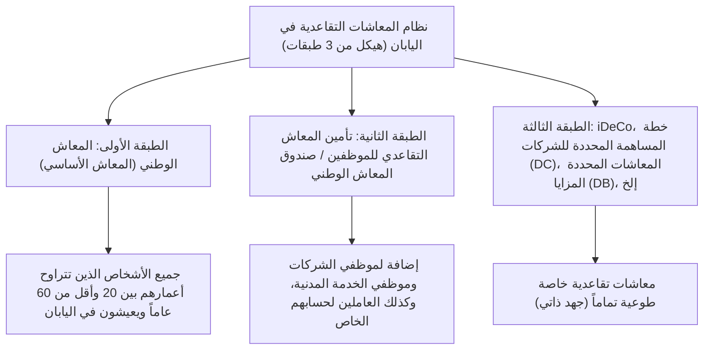

## مقدمة: لماذا iDeCo (معاشات المساهمة المحددة الفردية) الآن؟

في اليابان الحديثة، في ظل تقدم انخفاض معدل المواليد وشيخوخة السكان وطول العمر (ما يسمى بـ "عصر الـ 100 عام من الحياة")، أصبح القلق بشأن المعاشات التقاعدية المستقبلية ونقص أموال التقاعد مشكلة اجتماعية كبيرة. لقد ولى العصر الذي كان من الممكن فيه "قضاء حياة تقاعدية غنية فقط بالمعاشات التقاعدية العامة التي توفرها الدولة"، ودخلنا عصراً أصبح فيه تكوين الأصول من خلال جهود المساعدة الذاتية أمراً لا غنى عنه. وفي هذا السياق، يُعد "iDeCo (معاش المساهمة المحددة الفردي)" في طليعة الأنظمة التي تدعمها الدولة بقوة.

iDeCo ليس مجرد نظام استثماري. فهو "أقوى أداة لتكوين أموال التقاعد" حيث تم دمج حوافز ضريبية قوية لا مثيل لها في تصميم النظام الحكومي. ومع ذلك، وراء تأثيره القوي في توفير الضرائب، هناك آليات معقدة تتعلق بالضرائب والمعاشات التقاعدية. في هذا المقال، سنكشف عن آليات iDeCo من خلال الصورة العامة لنظام المعاشات التقاعدية في اليابان، ونشرح بشكل تفصيلي ومنهجي للغاية الخلفية النظرية لـ "تأثيرات توفير الضرائب الثلاثة" التي يمكن التمتع بها عند دفع الاشتراكات، وأثناء إدارتها، وعند استلامها، وتأثير ذلك على معدل الضريبة الهامشية، ومعنى تقييد الأموال حتى سن 60 عاماً، وصولاً إلى استراتيجية الخروج المثلى.

---

## 1. مكانة iDeCo في نظام المعاشات التقاعدية في اليابان (هيكل من 3 طبقات)

لفهم آلية iDeCo بدقة، من الضروري أولاً فهم الهيكل العام لأنظمة المعاشات التقاعدية العامة والخاصة في اليابان، أو ما يسمى بـ "الهيكل المكون من 3 طبقات للمعاشات التقاعدية".

### الطبقة الأولى: المعاش الوطني (المعاش الأساسي)
أساس نظام المعاشات التقاعدية في اليابان هو "المعاش الوطني". يُلزم جميع الأشخاص الذين لديهم عنوان في اليابان وتتراوح أعمارهم بين 20 وأقل من 60 عاماً بالانضمام إليه (الفئات من الأولى إلى الثالثة من المؤمن عليهم). يُطلق على هذا اسم "الطبقة الأولى"، وهو يمثل الأساس الذي يدعم الحياة الأساسية في الشيخوخة، ولكن من الصعب الحفاظ على مستوى معيشي كافٍ بهذا فقط.

### الطبقة الثانية: تأمين المعاش التقاعدي للموظفين وصندوق المعاش الوطني
يتم بناء "الطبقة الثانية" فوق الطبقة الأولى. ينضم موظفو الشركات وموظفو الخدمة المدنية (الفئة الثانية من المؤمن عليهم) إلى "تأمين المعاش التقاعدي للموظفين" من خلال أصحاب العمل. يتناسب هذا المعاش مع المكافآت، حيث تختلف أقساط التأمين ومبلغ الاستلام المستقبلي وفقاً للدخل خلال سنوات العمل. من ناحية أخرى، نظراً لأن العاملين لحسابهم الخاص والمستقلين (الفئة الأولى من المؤمن عليهم) لا يمكنهم الانضمام إلى هذا المعاش، يمكنهم بدلاً من ذلك استخدام "صندوق المعاش الوطني" لبناء الطبقة الثانية.

### الطبقة الثالثة: المعاشات التقاعدية الخاصة الطوعية (iDeCo ومعاشات الشركات)
"الطبقة الثالثة"، وهي المعاشات التقاعدية الخاصة، مُعدة لتكملة أموال التقاعد التي لا تغطيها المعاشات العامة (الطبقتان الأولى والثانية). بالإضافة إلى معاش المساهمة المحددة للشركات (DC للشركات) ومعاش المزايا المحددة للشركات (DB) التي تقدمها الشركات لموظفيها، يقع هنا "iDeCo (معاش المساهمة المحددة الفردي)" الذي ينضم إليه الأفراد بأنفسهم. من حيث المبدأ، يمكن لأي شخص يتراوح عمره بين 20 وأقل من 65 عاماً الانضمام إلى iDeCo، بغض النظر عن مهنته أو توفر نظام في مكان عمله، وقد أصبح بنية تحتية تقدم من خلالها الدولة دعماً ضريبياً قوياً لـ "تكوين الأصول من خلال الجهد الذاتي للمواطنين".

---

## 2. الجاذبية الكبرى لـ iDeCo: آليات الإعفاء الضريبي الثلاثة

يوفر iDeCo "ثلاث مزايا قوية لتوفير الضرائب" لا تتوفر في صناديق الاستثمار المشتركة أو استثمارات الأسهم العادية. من خلال العمل معاً، تزيد هذه المزايا من تأثير الفائدة المركبة والتأثيرات الضريبية في تكوين الأصول إلى الحد الأقصى.

### الميزة الأولى: آلية "الخصم الكامل من الدخل" للاشتراكات
الميزة الأكثر إلحاحاً وموثوقية لـ iDeCo هي "الخصم الكامل للاشتراكات من الدخل". خصم الدخل هو آلية تسمح لك بخصم مبلغ معين من "الدخل الخاضع للضريبة"، والذي يمثل الأساس لحساب الضرائب.

تتبنى ضريبة الدخل في اليابان "نظام ضرائب تصاعدي زائد"، حيث كلما زاد الدخل، ارتفع معدل الضريبة المطبق (معدل الضريبة الهامشية). يتم خصم الاشتراكات المدفوعة في iDeCo بالكامل من دخل تلك السنة كـ "خصم اشتراكات تعاونية للشركات الصغيرة، إلخ".

#### آلية حساب معدل الضريبة الهامشية وتأثير توفير الضرائب
كمثال محدد، دعونا نفكر في موظف شركة يبلغ دخله الخاضع للضريبة 5 ملايين ين (معدل ضريبة الدخل 20%، معدل ضريبة السكان 10%) ويساهم بمبلغ 23,000 ين شهرياً (276,000 ين سنوياً).

1. **مبلغ توفير ضريبة الدخل**: 276,000 ين × 20% = 55,200 ين
2. **مبلغ توفير ضريبة السكان**: 276,000 ين × 10% = 27,600 ين
3. **إجمالي التوفير الضريبي (سنوياً)**: 82,800 ين

بمعنى آخر، هذا التوفير الضريبي السنوي البالغ 82,800 ين يعادل "الحصول بالتأكيد على استرداد نقدي بنسبة 30% تقريباً (82,800 ين) مقابل استثمار سنوي قدره 276,000 ين". لا يوجد شيء اسمه "عائد مؤكد" في الاستثمار، ولكن تأثير توفير الضرائب هذا من خلال خصم الدخل يمكن القول بأنه "عائد خالي من المخاطر" يمكن الحصول عليه بشكل مؤكد كل عام بمجرد استخدام النظام. بشكل خاص، كلما ارتفع دخل الشخص وارتفع معدل الضريبة الهامشية، كلما كانت ميزة توفير الضرائب هذه أكبر بشكل كبير.

### الميزة الثانية: آلية إعفاء أرباح الاستثمار من الضرائب بالكامل
عادةً، تخضع الأرباح المكتسبة من الأسهم أو صناديق الاستثمار المشتركة (الأرباح الموزعة والمكاسب الرأسمالية) لضريبة بنسبة 20.315% (ضريبة الدخل 15.315%، ضريبة السكان 5%). ومع ذلك، فإن الأرباح المكتسبة من خلال الاستثمار داخل حساب iDeCo تكون "معفاة من الضرائب" طوال الفترة.

تكمن القوة الحقيقية لهذا الإعفاء الضريبي على أرباح الاستثمار في "تعظيم تأثير الفائدة المركبة". عند الاستثمار في حساب عادي، يتم خصم حوالي 20% كضرائب في كل مرة يتم فيها تحقيق ربح (أو استلام أرباح موزعة)، مما يقلل من المبلغ الذي يمكن إعادة استثماره. ومع ذلك، في iDeCo، فإن نسبة الـ 20% تقريباً التي كان ينبغي خصمها كضرائب يتم دمجها كما هي في رأس المال وتوجيهها مرة أخرى للاستثمار. على مدى فترة تشغيل طويلة (20 أو 30 عاماً)، فإن تأثير الفائدة المركبة الناتج عن هذا "التأجيل الضريبي (إعادة الاستثمار بدون ضرائب)" يخلق فرقاً هائلاً يصل إلى ملايين الين في مبلغ الأصول النهائي.

### الميزة الثالثة: خصومات قوية عند الاستلام (خصم دخل التقاعد / خصم المعاشات العامة، إلخ)
تتوفر حوافز ضريبية قوية أيضاً عند استلام الأصول التي تم تجميعها وتنميتها من خلال iDeCo بعد سن الستين. تنقسم طرق الاستلام بشكل عام إلى "مبلغ مقطوع (استلام دفعة واحدة)" و"معاش تقاعدي (استلام مقسم)"، وينطبق خصم مختلف على كل منهما.

*   **في حالة استلام مبلغ مقطوع: "خصم دخل التقاعد"**
    عند الاستلام كمبلغ مقطوع، يتم التعامل معه للأغراض الضريبية كـ "دخل تقاعد". تم تصميم خصم دخل التقاعد بحيث يزداد مبلغ الخصم كلما زادت فترة الانضمام (سنوات الخدمة)، وصيغة الحساب كما يلي:
    *   فترة الانضمام 20 سنة أو أقل: 400,000 ين × فترة الانضمام
    *   فترة الانضمام أكثر من 20 سنة: 8 ملايين ين + 700,000 ين × (فترة الانضمام - 20 سنة)
    إذا كان المبلغ يقع ضمن حد الخصم هذا، فلن يتم فرض أي ضريبة على الإطلاق. علاوة على ذلك، حتى إذا تجاوز حد الخصم، يتم تطبيق طريقة حساب تفضيلية للغاية حيث يتم فرض ضريبة فقط على "النصف" من المبلغ الزائد.

*   **في حالة استلام معاش تقاعدي: "خصم المعاشات العامة، إلخ"**
    عند الاستلام على دفعات، يتم التعامل معه كـ "دخل متنوع"، ولكن يتم تطبيق "خصم المعاشات العامة، إلخ". يتم حساب ذلك من خلال جمعه مع المعاشات العامة مثل المعاش الوطني ومعاش الموظفين، وإذا كان عمرك 65 عاماً أو أكثر، فسيتم إعفاء ما يصل إلى 1.1 مليون ين سنوياً (إذا كان الدخل من المعاشات العامة فقط) من الضرائب.

---

## 3. معضلة تقييد الأموال: معنى عدم القدرة على السحب حتى سن 60 كقاعدة عامة

غالباً ما يُشار إلى العيب الأكبر في iDeCo وهو قاعدة تقييد الأموال التي تنص على أنه "كقاعدة عامة، لا يمكن سحب الأصول حتى سن 60". حتى إذا كنت بحاجة إلى مبلغ كبير من المال لحدث حياتي مثل نفقات التعليم أو تمويل شراء منزل، فلا يمكنك المساس بأصول iDeCo الخاصة بك.

ومع ذلك، فإن "تقييد الأموال" هذا ليس مجرد عيب، بل يتضمن قصداً مهماً في تصميم النظام.

### آلية قسرية لـ "الاستثمار طويل الأجل وتأمين أموال التقاعد"
من منظور الاقتصاد السلوكي البشري، يميل الناس إلى إعطاء الأولوية لـ "المكاسب الصغيرة الفورية (أو الرغبات)" على "المكاسب الكبيرة المستقبلية" (التحيز للحاضر). إذا كنت تدخر في حساب يمكنك السحب منه بحرية، فمن السهل جداً إلغاء الحساب عندما ينهار السوق وتصاب بالذعر، أو عندما تحتاج إلى القليل من المال.

يعمل تقييد أموال iDeCo حتى سن 60 عاماً كآلية قفل قوية لاحتواء "التحيز للحاضر" مادياً. إنه جهاز أمان لفرض الغرض المتمثل في كونه "أموالاً للشيخوخة" وضمان فعالية الفائدة المركبة على مدى عقود.

### القفل كبديل للحوافز الضريبية
السبب في أن الدولة تقدم مثل هذه الحوافز الضريبية السخية (خصم الدخل، إعفاء أرباح الاستثمار من الضرائب، خصم دخل التقاعد) هو "جعل المواطنين يبنون أموال تقاعدهم بشكل مستقل". إذا كان نظاماً يسمح بالسحب الحر، فقد يتم إساءة استخدامه كأداة بسيطة لتوفير الضرائب على المدى القصير. يجب فهم أن تقييد الأموال حتى سن 60 موجود كـ "شرط تبادل" لتحقيق هدف سياسة الدولة المتمثل في تكوين أموال التقاعد.

---

## 4. الحل الأمثل لاستراتيجية الخروج: مبلغ مقطوع، أم معاش تقاعدي، أم مزيج منهما؟

بعد بناء أصول بعشرات الملايين من خلال iDeCo، فإن الشيء الأكثر أهمية هو "كيفية استلامها (استراتيجية الخروج)". نظراً لأن المبلغ المتبقي النهائي في متناول اليد (المبلغ بعد خصم الضرائب) يتغير بشكل كبير اعتماداً على طريقة الاستلام، فإن المحاكاة الدقيقة والمسبقة ضرورية.

### الخيار الأول: آلية واستراتيجية المبلغ المقطوع (استلام دفعة واحدة)
في كثير من الحالات، من المرجح أن يكون الخيار الأكثر فائدة من الناحية الضريبية هو "الاستلام كمبلغ مقطوع". كما ذكرنا سابقاً، يعد خصم دخل التقاعد قوياً للغاية. على سبيل المثال، إذا كانت فترة الانضمام 30 عاماً، فإن مبلغ الخصم سيكون "8 ملايين ين + 700,000 ين × 10 سنوات = 15 مليون ين". إذا كان مبلغ الاستلام بما في ذلك أرباح الاستثمار 15 مليون ين أو أقل، فإن الضريبة تكون صفراً.

**نقطة مهمة (قاعدة الجمع مع مكافأة نهاية الخدمة للشركة):**
ومع ذلك، يجب على موظفي الشركات الذين يتلقون مكافأة نهاية خدمة كبيرة من صاحب العمل توخي الحذر. إذا تلقيت مبلغ iDeCo المقطوع ومكافأة نهاية الخدمة للشركة في نفس العام (أو في سنوات متقاربة)، فستشترك (تجمع) في حد خصم دخل التقاعد لكليهما في الحساب. لتجنب ذلك، من الضروري استخدام تقنيات متقدمة لتغيير وقت الاستلام بشكل استراتيجي (استخدام ما يسمى بـ "قاعدة الـ 5 سنوات لخصم دخل التقاعد")، مثل "استلام iDeCo أولاً عند سن 60 عاماً، واستلام مكافأة نهاية الخدمة للشركة عند سن 65 عاماً (ترك فجوة مدتها 5 سنوات)".

### الخيار الثاني: آلية واستراتيجية المعاش التقاعدي (استلام مقسم)
في حالة الاستلام على دفعات، هناك ميزة القدرة على إطالة عمر الأصول لأنك تستمر في إدارتها أثناء السحب منها. ومع ذلك، من الناحية الضريبية، يتم دمجها مع المعاشات العامة (المعاش الوطني وتأمين المعاش التقاعدي للموظفين)، لذلك بالنسبة للأشخاص الذين يتلقون مبالغ كبيرة من المعاشات العامة، هناك خطر من أن تتجاوز إضافة مدفوعات معاشات iDeCo حد خصم المعاشات العامة وتخضع للضريبة كدخل متنوع.

بالإضافة إلى ذلك، إذا اخترت استلام معاش تقاعدي، يتم فرض "رسوم منفعة (رسوم تحويل)" في كل مرة للبنك الاستئماني أو الجهة المشابهة، لذلك يجب عليك أيضاً مراعاة احتمال الخسارة بسبب الرسوم إذا كنت تتلقى مبالغ صغيرة بشكل متكرر.

### الخيار الثالث: الجمع بين المبلغ المقطوع والمعاش التقاعدي
تسمح لك العديد من المؤسسات المالية باختيار "الجمع" الذي يدمج بين المبلغ المقطوع والمعاش التقاعدي. هذه استراتيجية هجينة تستفيد بشكل كامل من حد الإعفاء الضريبي لخصم دخل التقاعد لاستلام مبلغ مقطوع، وتتلقى الجزء الذي يتجاوز الحد كمعاش تقاعدي على دفعات لإبقائه ضمن حد خصم المعاشات العامة. بناءً على ظروف الفرد (وجود أو عدم وجود مكافأة نهاية الخدمة، ومبلغ المعاش العام المستلم، والدخل الآخر، وما إلى ذلك)، فإن تحسين هذا التوازن هو الهدف النهائي في استراتيجية الخروج.

---

## الخاتمة: iDeCo هو نظام ترتبط فيه "فجوة المعرفة" مباشرة بفجوة الأصول

يعد iDeCo (معاش المساهمة المحددة الفردي) أقوى بنية تحتية لتكوين الأصول برعاية الدولة، ويتحمل مسؤولية الطبقة الثالثة من نظام المعاشات التقاعدية في اليابان. يتمتع "الإعفاء الضريبي الثلاثي" المتمثل في التوفير الضريبي المؤكد وفقاً لمعدل الضريبة الهامشية من خلال الخصم الكامل للاشتراكات من الدخل، وتعظيم تأثير الفائدة المركبة من خلال إعفاء أرباح الاستثمار من الضرائب، والخصومات القوية عند الاستلام، بتفوق ساحق لا يمكن لأي منتج مالي آخر تقليده.

من ناحية أخرى، لا يمكنك استخلاص قيمته الحقيقية بالكامل ما لم تفهم الصورة الكاملة للنظام وتستخدمه بشكل استراتيجي، مثل القاعدة الصارمة المتمثلة في تقييد الأموال حتى سن 60، والحسابات الضريبية المعقدة المحيطة بخصم دخل التقاعد وخصم المعاشات العامة عند الاستلام.

في اليابان الحديثة، سواء كنت تستخدم iDeCo أم لا، وكيفية استخدامه، لم يعد مجرد "خيار استثماري"، بل هو "استراتيجية ضريبية مدى الحياة" و "استراتيجية بقاء في الشيخوخة" بحد ذاتها. سيكون تحسين المعرفة المالية واختراق أنظمة الدولة إلى أقصى حد هو الخطوة الأولى والأكثر يقينية للنجاة في عصر غني يتمثل في العيش 100 عام.
