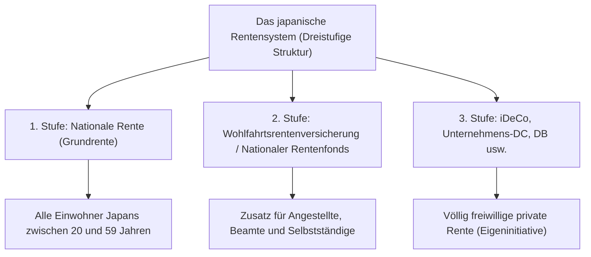

## Einführung: Warum iDeCo (Persönliche beitragsorientierte Altersvorsorge) jetzt wichtig ist

Im heutigen Japan sind im Zuge der fortschreitenden sinkenden Geburtenraten und der Überalterung der Gesellschaft sowie der höheren Lebenserwartung (der sogenannten "Ära des 100-jährigen Lebens") die Sorge um zukünftige Renten und der Mangel an Mitteln für den Ruhestand zu großen gesellschaftlichen Herausforderungen geworden. Die Zeit, in der man mit der vom Staat gezahlten öffentlichen Rente allein einen wohlhabenden Ruhestand verbringen konnte, ist vorbei. Wir sind in eine Ära eingetreten, in der der Vermögensaufbau durch eigene Anstrengungen unerlässlich ist. Unter den staatlich stark geförderten Systemen steht "iDeCo" (Persönliche beitragsorientierte Altersvorsorge) an erster Stelle.

iDeCo ist nicht einfach nur ein Investitionssystem. Aufgrund der staatlichen Ausgestaltung ist es das "stärkste Instrument zum Aufbau von Altersvorsorge", in das eine beispiellos starke steuerliche Begünstigung integriert ist. Hinter diesem starken Steuerersparniseffekt verbirgt sich jedoch ein komplexer Mechanismus in Bezug auf Steuern und Renten. Dieser Artikel entschlüsselt den Mechanismus von iDeCo aus der Gesamtperspektive des japanischen Rentensystems und erklärt äußerst detailliert und systematisch die theoretischen Hintergründe der "drei Steuerersparniseffekte", die bei der Beitragszahlung, der Anlage und dem Empfang genossen werden können, die Auswirkungen auf den Grenzsteuersatz, die Bedeutung der Kapitalbindung bis zum Alter von 60 Jahren und schließlich die optimale Ausstiegsstrategie.

---

## 1. Die Stellung von iDeCo im japanischen Rentensystem (Dreistufige Struktur)

Um den Mechanismus von iDeCo genau zu verstehen, ist es zunächst notwendig, die Gesamtstruktur der öffentlichen und privaten Rentensysteme in Japan, die sogenannte "dreistufige Struktur der Rente", zu erfassen.

### 1. Stufe: Nationale Rente (Grundrente)
Das Fundament des japanischen Rentensystems ist die "Nationale Rente". Alle Personen im Alter von 20 bis 59 Jahren mit Wohnsitz in Japan sind verpflichtet, daran teilzunehmen (Versicherte der Kategorien 1 bis 3). Dies wird als "1. Stufe" bezeichnet und bildet die Basis zur Unterstützung der Grundversorgung im Alter. Damit allein ist es jedoch schwierig, einen ausreichenden Lebensstandard aufrechtzuerhalten.

### 2. Stufe: Wohlfahrtsrentenversicherung / Nationaler Rentenfonds
Auf der 1. Stufe baut die "2. Stufe" auf. Angestellte und Beamte (Versicherte der Kategorie 2) treten über ihren Arbeitgeber der "Wohlfahrtsrentenversicherung" bei. Die Wohlfahrtsrente ist gehaltsabhängig, sodass die Prämien und die zukünftigen Leistungsbeträge je nach Einkommen während der Erwerbsphase variieren. Andererseits können Selbstständige und Freiberufler (Versicherte der Kategorie 1) nicht an der Wohlfahrtsrente teilnehmen. Stattdessen können sie den "Nationalen Rentenfonds" nutzen, um die 2. Stufe aufzubauen.

### 3. Stufe: Freiwillige private Altersvorsorge (iDeCo und Betriebsrenten)
Um die durch die öffentlichen Renten (1. und 2. Stufe) allein unzureichenden Altersgelder zu ergänzen, ist die private Rente, die "3. Stufe", vorgesehen. Neben den von Unternehmen für ihre Mitarbeiter eingeführten beitragsorientierten Betriebsrenten (Unternehmens-DC) und leistungsorientierten Betriebsrenten (DB) ist hier "iDeCo" (Persönliche beitragsorientierte Altersvorsorge) angesiedelt, der Einzelpersonen selbst beitreten. Unabhängig vom Beruf oder davon, ob das Unternehmen ein eigenes System anbietet, kann iDeCo grundsätzlich von jedem zwischen 20 und 64 Jahren genutzt werden. Es dient als Infrastruktur für den Staat, um den "Vermögensaufbau durch die Eigeninitiative der Bürger" steuerlich massiv zu unterstützen.

---

## 2. Der größte Reiz von iDeCo: Drei steuerliche Vergünstigungsmechanismen

iDeCo bietet äußerst starke "drei Steuerersparnisvorteile", die es bei gewöhnlichen Investmentfonds oder Aktieninvestitionen nicht gibt. Durch das Zusammenwirken dieser Vorteile werden der Zinseszinseffekt und die Steuereffekte beim Vermögensaufbau maximiert.

### Teil 1: Der Mechanismus, bei dem Beiträge "vollständig vom Einkommen abgezogen" werden
Der unmittelbarste und sicherste Vorteil von iDeCo ist der "vollständige Einkommensabzug der Beiträge". Der Einkommensabzug ist ein Mechanismus, bei dem ein bestimmter Betrag vom "steuerpflichtigen Einkommen", der Basis für die Steuerberechnung, abgezogen werden kann.

Die japanische Einkommensteuer verwendet ein "progressives Steuersystem", bei dem der angewandte Steuersatz (Grenzsteuersatz) umso höher ist, je höher das Einkommen ist. Die in iDeCo eingezahlten Beiträge werden als "Abzug für Beiträge zu Hilfsfonds für Kleinunternehmen usw." im jeweiligen Jahr vollständig vom Einkommen abgezogen.

#### Der Berechnungsmechanismus von Grenzsteuersatz und Steuerersparnis
Betrachten wir als konkretes Beispiel einen Angestellten mit einem steuerpflichtigen Einkommen von 5 Millionen Yen (Einkommensteuersatz 20%, Einwohnersteuersatz 10%), der monatlich 23.000 Yen (jährlich 276.000 Yen) als Beitrag einzahlt.

1. **Ersparnis bei der Einkommensteuer**: 276.000 Yen × 20% = 55.200 Yen
2. **Ersparnis bei der Einwohnersteuer**: 276.000 Yen × 10% = 27.600 Yen
3. **Gesamte Steuerersparnis (jährlich)**: 82.800 Yen

Diese jährliche Steuerersparnis von 82.800 Yen bedeutet mit anderen Worten: "Für eine Investition von 276.000 Yen pro Jahr erhalten Sie garantiert etwa 30% (82.800 Yen) Cashback". Bei Investitionen gibt es zwar keine "garantierten Renditen", aber dieser Steuerersparniseffekt durch den Einkommensabzug kann als "risikofreie Rendite" betrachtet werden, die man jedes Jahr sicher erhält, allein indem man das System nutzt. Insbesondere für Personen mit hohem Einkommen und hohem Grenzsteuersatz ist dieser Steuerersparnisvorteil dramatisch größer.

### Teil 2: Der Mechanismus, bei dem Anlagegewinne "vollständig steuerfrei" bleiben
Normalerweise werden Gewinne aus Aktien oder Investmentfonds (Dividenden oder Kapitalgewinne) mit einer Steuer von 20,315% (Einkommensteuer 15,315%, Einwohnersteuer 5%) belegt. Gewinne, die innerhalb eines iDeCo-Kontos erzielt werden, bleiben jedoch während der gesamten Laufzeit "steuerfrei".

Die wahre Kraft dieser Steuerfreiheit von Anlagegewinnen liegt in der "Maximierung des Zinseszinseffekts". Wenn Sie in einem normalen Konto anlegen, werden bei jeder Gewinnerzielung (oder bei jeder Dividendenausschüttung) etwa 20% als Steuern abgezogen, wodurch sich der Betrag, der reinvestiert werden kann, verringert. Bei iDeCo fließen jedoch auch diese rund 20%, die sonst als Steuern abgezogen worden wären, direkt ins Kapital ein und werden erneut angelegt. Bei einer Anlage über einen langen Zeitraum (20, 30 Jahre) führt der Zinseszinseffekt, der durch diesen "Steueraufschub (steuerfreie Reinvestition)" entsteht, zu einem überwältigenden Unterschied in Millionenhöhe beim endgültigen Vermögenswert.

### Teil 3: Starke Abzüge beim Empfang (Abzug für Ruhestandseinkommen / Abzug für öffentliche Renten)
Auch wenn Sie das durch iDeCo angesparte und vermehrte Vermögen ab dem Alter von 60 Jahren in Empfang nehmen, stehen starke Steuervergünstigungen zur Verfügung. Es gibt grob gesagt zwei Möglichkeiten des Empfangs: "Einmalzahlung" und "Rente (Ratenzahlung)". Für jede Option gelten unterschiedliche Abzüge.

*   **Bei Empfang als Einmalzahlung: "Abzug für Ruhestandseinkommen"**
    Wenn Sie den Betrag als Einmalzahlung erhalten, wird er steuerlich als "Ruhestandseinkommen" behandelt. Der Abzug für das Ruhestandseinkommen ist so strukturiert, dass der Abzugsbetrag mit zunehmender Beitragsdauer (Dienstjahren) steigt. Die Berechnungsformel lautet wie folgt:
    *   Beitragsdauer 20 Jahre oder weniger: 400.000 Yen × Beitragsdauer
    *   Beitragsdauer über 20 Jahre: 8.000.000 Yen + 700.000 Yen × (Beitragsdauer - 20 Jahre)
    Bleibt der Betrag innerhalb dieses Abzugsrahmens, fallen überhaupt keine Steuern an. Darüber hinaus gilt selbst bei Überschreiten des Rahmens eine äußerst vorteilhafte Berechnungsmethode, bei der nur "die Hälfte" des überschüssigen Betrags besteuert wird.

*   **Bei Empfang als Rente: "Abzug für öffentliche Renten usw."**
    Wenn Sie den Betrag in Raten erhalten, wird er als "Sonstiges Einkommen" behandelt, aber der "Abzug für öffentliche Renten usw." kommt zur Anwendung. Dieser wird zusammen mit öffentlichen Renten wie der Nationalen Rente und der Wohlfahrtsrente berechnet. Ab dem Alter von 65 Jahren sind bis zu 1,1 Millionen Yen pro Jahr (wenn nur Einnahmen aus öffentlichen Renten usw. vorliegen) steuerfrei.

---

## 3. Das Dilemma der Kapitalbindung: Die Bedeutung, das Geld grundsätzlich bis zum Alter von 60 Jahren nicht abheben zu können

Der am häufigsten genannte größte Nachteil von iDeCo ist die Regel der Kapitalbindung: "Grundsätzlich kann das Vermögen bis zum Alter von 60 Jahren nicht abgehoben werden". Selbst wenn Sie bei Lebensereignissen wie der Finanzierung der Ausbildung der Kinder oder dem Kauf eines Eigenheims einen größeren Geldbetrag benötigen, können Sie nicht auf das iDeCo-Vermögen zugreifen.

Diese "Kapitalbindung" ist jedoch nicht einfach nur ein Nachteil, sondern beinhaltet eine wichtige systemische Absicht.

### Der Mechanismus der erzwungenen "langfristigen Investition und Sicherung der Altersvorsorge"
Aus verhaltensökonomischer Sicht neigen Menschen dazu, "kurzfristigen kleinen Gewinnen (oder Wünschen)" den Vorzug vor "zukünftigen großen Gewinnen" zu geben (Gegenwartspräferenz). Wenn Sie Einzahlungen auf ein Konto leisten, von dem Sie jederzeit abheben können, neigen Sie bei Markteinbrüchen, die Panik auslösen, oder wenn Sie etwas Geld benötigen, leicht dazu, es zu kündigen.

Die Kapitalbindung von iDeCo bis zum 60. Lebensjahr fungiert als starker Sperrmechanismus, der diese "Gegenwartspräferenz" physisch unterdrückt. Es handelt sich um eine Sicherheitsvorrichtung, die den Zweck "Geld für das Alter" zwingend durchsetzt und den Zinseszinseffekt über Jahrzehnte hinweg zuverlässig wirken lässt.

### Die Sperre als Gegenleistung für Steuervergünstigungen
Der Grund, warum der Staat derart großzügige Steuervergünstigungen (Einkommensabzug, Steuerfreiheit der Anlagegewinne, Abzug des Ruhestandseinkommens) gewährt, ist, "dass die Bürger eigenverantwortlich Geld für den Ruhestand aufbauen sollen". Wäre es ein System, aus dem man jederzeit frei Geld abheben könnte, bestünde die Gefahr, dass es lediglich als kurzfristiges Instrument zur Steuervermeidung missbraucht wird. Man sollte die Kapitalbindung bis zum Alter von 60 Jahren als "Gegenleistung" verstehen, um das politische Ziel des Staates – den Aufbau von Mitteln für den Ruhestand – zu erreichen.

---

## 4. Die optimale Lösung für die Ausstiegsstrategie: Einmalzahlung, Rente oder eine Kombination?

Nachdem Sie mit iDeCo ein Vermögen in Millionenhöhe aufgebaut haben, wird am wichtigsten, "wie Sie es empfangen (Ausstiegsstrategie)". Je nach Empfangsmethode ändert sich der Betrag, der am Ende (nach Steuern) übrig bleibt, erheblich, weshalb im Vorfeld genaue Simulationen unerlässlich sind.

### Option 1: Mechanismus und Strategie der Einmalzahlung
In vielen Fällen ist der "Empfang als Einmalzahlung" die steuerlich vorteilhafteste Option. Wie bereits erwähnt, ist der Abzug für Ruhestandseinkommen sehr mächtig. Bei einer Beitragsdauer von beispielsweise 30 Jahren beträgt der Abzugsbetrag "8.000.000 Yen + 700.000 Yen × 10 Jahre = 15.000.000 Yen". Wenn der erhaltene Betrag einschließlich der Anlagegewinne 15 Millionen Yen oder weniger beträgt, ist die Steuer null.

**Zu beachten (Regel der Zusammenrechnung mit der Abfindung des Unternehmens):**
Vorsicht ist jedoch geboten, wenn Sie als Angestellter eine hohe Abfindung von Ihrem Arbeitgeber erhalten. Wenn Sie die Einmalzahlung von iDeCo und die Abfindung des Unternehmens im selben Jahr (oder in eng beieinander liegenden Jahren) erhalten, wird der Freibetrag des Abzugs für Ruhestandseinkommen für beide zusammen (kumuliert) berechnet. Um dies zu vermeiden, sind fortgeschrittene Techniken (die Nutzung der sogenannten "5-Jahres-Regel für den Abzug von Ruhestandseinkommen" usw.) erforderlich, wie beispielsweise die strategische Verschiebung der Auszahlungszeitpunkte: "Zuerst iDeCo mit 60 Jahren empfangen und die Abfindung des Unternehmens mit 65 Jahren erhalten (die Regel einer Lücke von 5 Jahren)".

### Option 2: Mechanismus und Strategie der Rente (Ratenzahlung)
Wenn Sie sich für die Ratenzahlung entscheiden, bauen Sie das Vermögen ab, während Sie die Anlage fortsetzen, was den Vorteil hat, die Lebensdauer des Vermögens zu verlängern. Aus steuerlicher Sicht wird es jedoch mit der öffentlichen Rente (Nationale Rente, Wohlfahrtsrente) zusammengefasst. Für Personen, die hohe öffentliche Rentenzahlungen erhalten, besteht das Risiko, dass der in Raten ausgezahlte iDeCo-Betrag die Grenze des Abzugs für öffentliche Renten überschreitet und als sonstiges Einkommen versteuert wird.

Darüber hinaus fällt bei der Wahl der Rentenauszahlung jedes Mal eine "Auszahlungsgebühr (Überweisungsgebühr)" an eine Treuhandbank oder ähnliches an. Daher muss bedacht werden, dass bei vielen kleinen Auszahlungen die Gebühren den Gewinn übersteigen können.

### Option 3: Kombination von Einmalzahlung und Rente
Viele Finanzinstitute bieten die Möglichkeit, eine "Kombination" aus Einmalzahlung und Rente zu wählen. Dies ist eine hybride Strategie: Man nutzt den steuerfreien Rahmen des Abzugs für Ruhestandseinkommen voll aus, um eine Einmalzahlung zu erhalten, und den Betrag, der diesen Rahmen überschreitet, erhält man in Raten als Rente, um ihn innerhalb des Rahmens des Abzugs für öffentliche Renten zu halten. Je nach individueller Situation (Vorhandensein einer Abfindung, Höhe der öffentlichen Rentenzahlungen, sonstiges Einkommen usw.) dieses Gleichgewicht zu optimieren, ist das ultimative Ziel der Ausstiegsstrategie.

---

## Fazit: iDeCo ist ein System, bei dem das "Wissensgefälle" direkt mit dem Vermögensgefälle zusammenhängt

iDeCo (Persönliche beitragsorientierte Altersvorsorge) ist die vom Staat stark geförderte, stärkste Infrastruktur zum Vermögensaufbau, die die dritte Stufe des japanischen Rentensystems bildet. Die "dreifache Steuervergünstigung" – garantierte Steuerersparnis entsprechend dem Grenzsteuersatz durch vollständigen Einkommensabzug der Beiträge, Maximierung des Zinseszinseffekts durch Steuerfreiheit der Anlagegewinne und starke Abzüge bei der Auszahlung – besitzt eine überwältigende Überlegenheit, die von keinem anderen Finanzprodukt erreicht werden kann.

Andererseits können Sie den wahren Wert dieses Systems nicht vollständig ausschöpfen, wenn Sie das System nicht richtig verstehen und strategisch nutzen, wie zum Beispiel die strenge Regel der Kapitalbindung bis zum Alter von 60 Jahren und die komplexen steuerlichen Berechnungen rund um den Abzug für Ruhestandseinkommen und den Abzug für öffentliche Renten.

Im heutigen Japan ist die Frage, ob und wie man iDeCo nutzt, nicht mehr nur eine bloße "Investitionsentscheidung", sondern vielmehr eine "lebenslange Steuerstrategie" und die "Überlebensstrategie für das Alter" selbst. Die Verbesserung der finanziellen Allgemeinbildung und die maximale Nutzung des staatlichen Systems dürften der sicherste erste Schritt sein, um die Ära des wohlhabenden 100-jährigen Lebens erfolgreich zu meistern.
