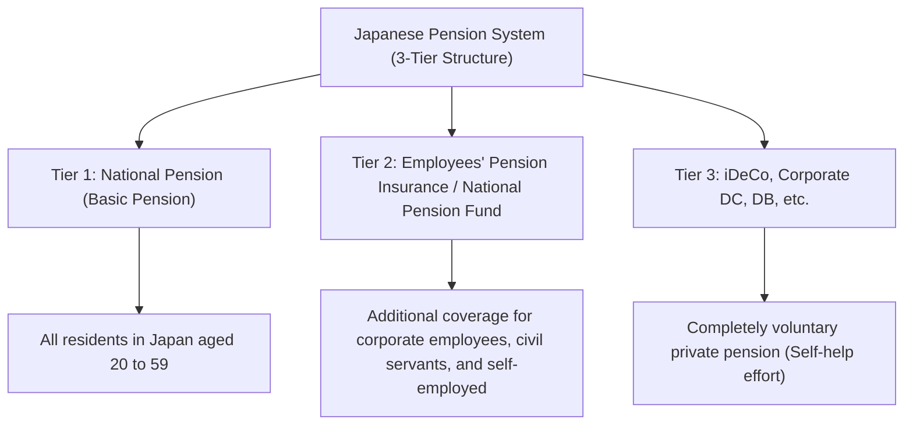

## Introduction: Why iDeCo (Individual-type Defined Contribution Pension Plan) Now?

In modern Japan, against the backdrop of a declining birthrate, an aging population, and increasing longevity (the so-called '100-year life era'), anxiety about future pensions and the shortage of retirement funds have become major social issues. The era when one could 'enjoy a wealthy retirement solely on public pensions provided by the state' has come to an end, plunging us into an age where asset formation through self-help efforts is indispensable. Among the systems strongly backed by the government in this context, the foremost is 'iDeCo' (Individual-type Defined Contribution Pension Plan).

iDeCo is not merely an investment system. By design, it is the 'ultimate retirement fund formation tool' incorporating unparalleled tax incentives. However, behind these powerful tax-saving effects lies a complex mechanism regarding taxes and pensions. This article unravels the mechanism of iDeCo from the overall picture of Japan's pension system, explaining extremely detailed and systematically the theoretical background of the 'three tax-saving effects' you can enjoy during contribution, investment, and receipt, the impact on marginal tax rates, the meaning of capital lock-up until age 60, and down to the optimal exit strategy.

---

## 1. Positioning of iDeCo in Japan's Pension System (3-Tier Structure)

To accurately understand the mechanism of iDeCo, it is first necessary to grasp the overall structure of Japan's public and private pension systems, the so-called '3-tier structure of pensions'.

### Tier 1: National Pension (Basic Pension)
The foundation of Japan's pension system is the 'National Pension'. All residents in Japan aged 20 to 59 are obliged to enroll (Category 1 to Category 3 insured persons). This is called 'Tier 1' and serves as the base to support basic living in retirement, but it is difficult to maintain an adequate standard of living with this alone.

### Tier 2: Employees' Pension Insurance and National Pension Fund
Built on top of Tier 1 is 'Tier 2'. Corporate employees and civil servants (Category 2 insured persons) enroll in 'Employees' Pension Insurance' through their employers. The Employees' Pension is earnings-related, meaning premiums and future benefit amounts fluctuate according to income during working years. On the other hand, self-employed individuals and freelancers (Category 1 insured persons) cannot join the Employees' Pension, so they can use the 'National Pension Fund' instead to build their Tier 2.

### Tier 3: Voluntary Private Pensions (iDeCo and Corporate Pensions)
To supplement retirement funds that are insufficient with only public pensions (Tier 1 and 2), the 'Tier 3' private pension is prepared. In addition to Corporate Defined Contribution Pension (Corporate DC) and Defined Benefit Corporate Pension (DB) introduced by companies for employees, 'iDeCo (Individual-type Defined Contribution Pension Plan)', which individuals join on their own, is positioned here. iDeCo is designed so that, in principle, anyone between ages 20 and 64 can join regardless of their occupation or the availability of a workplace system, serving as an infrastructure for the government to strongly support 'asset formation through citizens' self-help efforts' from a tax perspective.

---

## 2. The Greatest Appeal of iDeCo: Three Tax Incentive Mechanisms

iDeCo offers extremely powerful 'three tax-saving benefits' not found in regular mutual funds or stock investments. By linking these together, the compounding effect and tax effect in asset formation are maximized.

### Benefit 1: The Mechanism of Contributions Becoming 'Fully Tax Deductible'
The most immediate and certain benefit of iDeCo is the 'full income deduction of contributions'. An income deduction is a mechanism that allows a specific amount to be subtracted from 'taxable income', which serves as the base for calculating taxes.

Japan's income tax adopts a 'progressive taxation system', where the applied tax rate (marginal tax rate) increases as income gets higher. Contributions made through iDeCo are fully deducted from that year's income as a 'deduction for small enterprise mutual aid premiums, etc.'.

#### Marginal Tax Rate and the Calculation Mechanism of Tax Savings
As a specific example, let's consider a corporate employee with a taxable income of 5 million yen (income tax rate 20%, inhabitant tax rate 10%) who contributes 23,000 yen every month (276,000 yen annually).

1. **Income tax savings**: 276,000 yen x 20% = 55,200 yen
2. **Inhabitant tax savings**: 276,000 yen x 10% = 27,600 yen
3. **Total tax savings (annual)**: 82,800 yen

This annual tax saving of 82,800 yen is synonymous with saying, 'You are reliably getting a cash back of about 30% (82,800 yen) on an annual investment of 276,000 yen.' While 'certain returns' do not exist in investing, this tax-saving effect through income deduction can be said to be a 'no-risk yield' that is reliably obtained every year just by using the system. Especially for people with high incomes and high marginal tax rates, this tax-saving benefit becomes dramatically larger.

### Benefit 2: The Mechanism of Investment Returns Becoming 'Fully Tax-Free'
Normally, profits obtained from stocks or mutual funds (dividends or capital gains) are subject to a 20.315% tax (income tax 15.315%, inhabitant tax 5%). However, profits obtained through investments within an iDeCo account remain 'tax-free' throughout the period.

The true power of this tax-free investment return lies in the 'maximization of the compounding effect'. When investing in a regular account, every time a profit is made (or a dividend is received), about 20% is deducted as tax, reducing the amount that can be reinvested. However, in iDeCo, the approximately 20% that would have been deducted as tax is instead added intact to the principal and redirected back into investment. In long-term investments (20 or 30 years), the compounding effect brought about by this 'tax deferral (tax-free reinvestment)' creates an overwhelming difference of millions of yen in the final asset amount.

### Benefit 3: Powerful Deductions Upon Receipt (Retirement Income Deduction / Public Pension Deduction)
When receiving the assets accumulated and grown in iDeCo after age 60, powerful tax incentives are also prepared. Ways to receive the funds are broadly divided into 'lump-sum payment (bulk receipt)' and 'pension (installment receipt)', with different deductions applied to each.

*   **In the case of lump-sum receipt: 'Retirement Income Deduction'**
    If received as a lump sum, it is treated as 'retirement income' for tax purposes. The retirement income deduction is structured so that the deduction amount increases the longer the enrollment period (years of service), and the calculation formula is as follows:
    *   Enrollment period of 20 years or less: 400,000 yen x enrollment period
    *   Enrollment period over 20 years: 8,000,000 yen + 700,000 yen x (enrollment period - 20 years)
    If the amount falls within this deduction limit, no tax is levied at all. Furthermore, even if it exceeds the deduction limit, an extremely preferential calculation method is applied where only 'half' of the excess amount is subject to taxation.

*   **In the case of pension receipt: 'Public Pension Deduction'**
    If received in installments, it is treated as 'miscellaneous income', but the 'Public Pension Deduction' is applied. This is calculated by aggregating it with public pensions such as the National Pension and Employees' Pension, and if you are 65 or older, up to 1.1 million yen annually (in the case of income solely from public pensions) becomes tax-free.

---

## 3. The Dilemma of Capital Lock-up: The Meaning Behind the Inability to Withdraw Until Age 60 in Principle

A frequently cited major disadvantage of iDeCo is the capital lock-up rule that 'in principle, assets cannot be withdrawn until age 60.' Even if a large sum of money is needed for life events like education funds or housing purchase funds, you cannot touch your iDeCo assets.

However, this 'capital lock-up' is not merely a disadvantage; it contains an important intention in the system design.

### The Mechanism of Compulsory 'Long-term Investment and Securing Retirement Funds'
From the perspective of human behavioral economics, people have a tendency (present bias) to prioritize 'small immediate gains (or desires)' over 'large future gains.' When accumulating funds in a freely withdrawable account, people are prone to easily cancel their investments when panicked by a market crash or when they need a little money.

iDeCo's capital lock-up until age 60 works as a powerful locking function to physically contain this 'present bias.' It is a safety device to forcibly carry through the purpose of being 'funds for retirement' and ensure the compounding effect works reliably over decades.

### The Lock as a Trade-off for Tax Incentives
The reason the government provides such generous tax incentives (income deduction, tax-free investment returns, retirement income deduction) is 'to have citizens independently build their retirement funds.' If it were a freely withdrawable system, it could be misused as merely a short-term tax-saving tool. It should be understood that the capital lock-up until age 60 exists as a 'trade-off condition' to achieve the national policy objective of forming retirement funds.

---

## 4. The Optimal Exit Strategy: Lump-sum, Pension, or a Combination?

After building tens of millions in assets with iDeCo, the most crucial part becomes 'how to receive it (exit strategy).' Because the final amount left in hand (after-tax amount) changes significantly depending on how it is received, precise prior simulation is indispensable.

### Option 1: Mechanism and Strategy for Lump-sum (Bulk Receipt)
In many cases, what is highly likely to be most advantageous tax-wise is 'receipt as a lump sum.' As mentioned earlier, the retirement income deduction is extremely powerful. For example, if the enrollment period is 30 years, the deduction amount is '8,000,000 yen + 700,000 yen x 10 years = 15,000,000 yen.' If the received amount including investment returns is 15 million yen or less, the tax is zero.

**Point of Caution (Aggregation rule with corporate severance pay):**
However, caution is needed for corporate employees receiving large severance pay from their employers. If you receive an iDeCo lump sum and company severance pay in the same year (or close years), the retirement income deduction limit will be shared (aggregated) and calculated for both. To avoid this, advanced techniques strategically shifting the receipt timing (utilizing the so-called '5-year rule of retirement income deduction') are required, such as 'receiving iDeCo first at age 60, and receiving company severance pay at age 65 (a rule to leave a 5-year blank).'

### Option 2: Mechanism and Strategy for Pension (Installment Receipt)
When receiving in installments, there is an advantage of extending the lifespan of assets because you draw down while continuing to invest. However, on the tax front, it is aggregated with public pensions (National Pension and Employees' Pension), so individuals with large public pension receipt amounts face the risk that the added iDeCo pension receipt will exceed the public pension deduction limit, causing it to be taxed as miscellaneous income.

Also, if you choose pension receipt, a 'benefit fee (transfer fee)' is incurred to the trust bank etc. each time, so you must consider the possibility that receiving small amounts frequently could result in fees eroding the benefits.

### Option 3: Combination of Lump-sum and Pension
At many financial institutions, you can choose a 'combination' of lump-sum and pension. This is a hybrid strategy where you fully utilize the tax-free limit of the retirement income deduction to receive a lump sum, and receive the portion exceeding the limit in installments as a pension, keeping it within the limit of the public pension deduction. Optimizing this balance according to individual circumstances (presence of severance pay, amount of public pension received, other income, etc.) becomes the ultimate goal in the exit strategy.

---

## Conclusion: iDeCo is a System Where the 'Knowledge Gap' Directly Translates to an 'Asset Gap'

iDeCo (Individual-type Defined Contribution Pension Plan) is the ultimate asset formation infrastructure spearheaded by the state, bearing the Tier 3 portion of Japan's pension system. The 'triple tax incentives'—certain tax savings according to marginal tax rates through full income deduction of contributions, maximization of compounding effects through tax-free investment returns, and powerful deductions upon receipt—hold an overwhelming superiority that no other financial product can imitate.

On the other hand, without correctly understanding the full scope of the system and strategically utilizing it—such as the strict rule of capital lock-up until age 60 and complex tax calculations surrounding retirement income deductions and public pension deductions at the time of receipt—its true value cannot be fully unlocked.

In modern Japan, whether to utilize iDeCo and how to use it is no longer merely an 'investment choice,' but a 'lifelong tax strategy' and 'survival strategy for retirement' itself. Enhancing financial literacy and maximizing the government's systems will likely be the most certain first step to survive the affluent 100-year life era.
