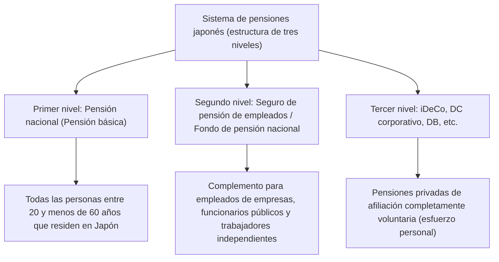

## Introducción: ¿Por qué iDeCo (Pensión de Aportación Definida Individual) ahora?

En el Japón moderno, en el contexto de la disminución de la tasa de natalidad y el envejecimiento de la población, así como de la longevidad (la llamada 'era de los 100 años de vida'), la ansiedad sobre las pensiones futuras y la falta de fondos para la jubilación se han convertido en importantes problemas sociales. La época en que 'se podía disfrutar de una jubilación próspera solo con la pensión pública otorgada por el estado' ha llegado a su fin, y hemos entrado en una era donde la formación de activos a través del esfuerzo personal es indispensable. Entre ellas, la institución principal fuertemente respaldada por el gobierno es el 'iDeCo (Pensión de Aportación Definida Individual)'.

iDeCo no es simplemente un sistema de inversión. Por su diseño gubernamental, es la 'herramienta de formación de fondos de jubilación más poderosa' que incorpora beneficios fiscales inigualables. Sin embargo, detrás de sus fuertes efectos de ahorro de impuestos, existen mecanismos complejos relacionados con los impuestos y las pensiones. En este artículo, desglosaremos el mecanismo de iDeCo desde la perspectiva general del sistema de pensiones de Japón, y explicaremos de manera extremadamente detallada y sistemática el contexto teórico de los 'tres efectos de ahorro de impuestos' que se pueden disfrutar al realizar contribuciones, durante la gestión de las inversiones y en el momento de la recepción, así como el impacto en la tasa impositiva marginal, el significado de la retención de fondos hasta los 60 años y la estrategia de salida óptima.

---

## 1. El posicionamiento de iDeCo en el sistema de pensiones japonés (estructura de tres niveles)

Para comprender con precisión el mecanismo de iDeCo, primero es necesario captar la estructura general de los sistemas de pensiones públicos y privados de Japón, la llamada 'estructura de pensiones de tres niveles'.

### Primer nivel: Pensión nacional (Pensión básica)
La base del sistema de pensiones de Japón es la 'Pensión nacional'. Todas las personas que residen en Japón y que tienen entre 20 y menos de 60 años están obligadas a afiliarse (asegurados de categoría 1 a 3). Esto se denomina el 'primer nivel' y sirve como base para apoyar la vida fundamental en la vejez, pero es difícil mantener un nivel de vida suficiente solo con esto.

### Segundo nivel: Seguro de pensión de empleados y Fondo de pensión nacional
Lo que se construye sobre el primer nivel es el 'segundo nivel'. Los empleados de empresas y funcionarios públicos (asegurados de categoría 2) se afilian al 'Seguro de pensión de empleados' a través de sus empleadores. La pensión de los empleados es proporcional a la remuneración, por lo que las primas y el monto de los beneficios futuros varían según los ingresos durante los años de actividad laboral. Por otro lado, dado que los trabajadores independientes y autónomos (asegurados de categoría 1) no pueden afiliarse a la pensión de los empleados, pueden utilizar el 'Fondo de pensión nacional' como alternativa para construir el segundo nivel.

### Tercer nivel: Pensión privada de afiliación voluntaria (iDeCo y pensiones corporativas)
Para complementar los fondos de jubilación que son insuficientes solo con las pensiones públicas (primer y segundo nivel), se ha preparado el 'tercer nivel', que es la pensión privada. Aquí se posicionan la pensión corporativa de aportación definida (DC corporativo) y la pensión corporativa de beneficio definido (DB) introducidas por las empresas para sus empleados, además del 'iDeCo (Pensión de aportación definida individual)' al que los individuos se afilian por su cuenta. Como regla general, cualquier persona entre 20 y menos de 65 años puede afiliarse a iDeCo, independientemente de su ocupación o de si su empleador tiene un sistema, sirviendo como infraestructura para que el gobierno apoye fuertemente la 'formación de activos mediante el esfuerzo personal de los ciudadanos' en el aspecto fiscal.

---

## 2. El mayor atractivo de iDeCo: Tres mecanismos de beneficios fiscales

iDeCo ofrece 'tres beneficios de ahorro de impuestos' extremadamente poderosos que no se encuentran en los fideicomisos de inversión regulares o las inversiones en acciones. Al interactuar entre sí, se maximizan el efecto del interés compuesto y el efecto fiscal en la formación de activos.

### Número 1: El mecanismo donde las contribuciones son 'totalmente deducibles de ingresos'
El beneficio más inmediato y seguro de iDeCo es la 'deducción total de ingresos de las contribuciones'. La deducción de ingresos es un mecanismo que permite restar una cantidad específica del 'ingreso gravable', que sirve como base para calcular los impuestos.

El impuesto sobre la renta de Japón adopta un 'sistema impositivo progresivo sobre el exceso', donde la tasa impositiva aplicable (tasa impositiva marginal) aumenta a medida que aumentan los ingresos. Las contribuciones realizadas en iDeCo se deducen en su totalidad de los ingresos de ese año como 'deducción de contribuciones para la mutualidad de pequeñas empresas, etc.'.

#### El mecanismo de cálculo de la tasa impositiva marginal y el efecto de ahorro de impuestos
Como ejemplo concreto, consideremos a un empleado corporativo con un ingreso gravable de 5 millones de yenes (tasa del impuesto sobre la renta del 20%, tasa del impuesto de residencia del 10%) que aporta una contribución de 23,000 yenes al mes (276,000 yenes al año).

1. **Ahorro en el impuesto sobre la renta**: 276,000 yenes × 20% = 55,200 yenes
2. **Ahorro en el impuesto de residencia**: 276,000 yenes × 10% = 27,600 yenes
3. **Ahorro total de impuestos (anual)**: 82,800 yenes

Este ahorro de impuestos anual de 82,800 yenes, en otras palabras, es sinónimo de 'recibir un reembolso garantizado de aproximadamente el 30% (82,800 yenes) por una inversión de 276,000 yenes al año'. Aunque no existe tal cosa como un 'rendimiento garantizado' en la inversión, el efecto de ahorro de impuestos a través de esta deducción de ingresos se puede describir como un 'rendimiento sin riesgo' que se puede obtener de manera confiable cada año simplemente utilizando el sistema. Especialmente para aquellos con altos ingresos y altas tasas impositivas marginales, este beneficio de ahorro de impuestos es drásticamente mayor.

### Número 2: El mecanismo donde las ganancias de inversión son 'totalmente libres de impuestos'
Normalmente, las ganancias (dividendos y ganancias de capital) obtenidas de acciones y fideicomisos de inversión están sujetas a un impuesto del 20.315% (15.315% de impuesto sobre la renta, 5% de impuesto de residencia). Sin embargo, las ganancias obtenidas de las inversiones dentro de la cuenta iDeCo permanecen 'libres de impuestos' durante todo el período.

El verdadero poder de esta exención de impuestos sobre las ganancias de inversión radica en la 'maximización del efecto del interés compuesto'. Al invertir en una cuenta regular, se deduce aproximadamente un 20% en impuestos cada vez que se genera una ganancia (o cada vez que se reciben dividendos), lo que reduce la cantidad que se puede reinvertir. Sin embargo, en iDeCo, ese 20% que se habría deducido como impuesto se incorpora al capital y se reinvierte. A largo plazo (20 o 30 años), el efecto de interés compuesto generado por este 'aplazamiento de impuestos (reinversión libre de impuestos)' crea una diferencia abrumadora de millones de yenes en el monto final de los activos.

### Número 3: Deducciones poderosas al recibir los fondos (Deducción de ingresos de jubilación / Deducción de pensiones públicas, etc.)
También existen poderosos beneficios fiscales cuando se reciben los activos acumulados y aumentados a través de iDeCo después de los 60 años. Existen dos formas principales de recibir los fondos: 'suma global (recepción en un solo pago)' y 'pensión (recepción en cuotas)', aplicándose diferentes deducciones a cada una.

*   **En el caso de recibir una suma global: 'Deducción de ingresos de jubilación'**
    Al recibirlo como suma global, se trata fiscalmente como 'ingreso de jubilación'. La deducción de ingresos de jubilación está estructurada de manera que el monto de la deducción aumenta a medida que se alarga el período de afiliación (años de servicio), y la fórmula de cálculo es la siguiente:
    *   Período de afiliación de 20 años o menos: 400,000 yenes × período de afiliación
    *   Período de afiliación superior a 20 años: 8 millones de yenes + 700,000 yenes × (período de afiliación - 20 años)
    Si el monto está dentro de este límite de deducción, no se incurre en ningún impuesto. Además, incluso si se excede el límite de deducción, se aplica un método de cálculo extremadamente favorable, donde solo se grava 'la mitad' del exceso.

*   **En el caso de recibir como pensión: 'Deducción de pensiones públicas, etc.'**
    Si se recibe en cuotas, se tratará como 'ingresos varios', pero se aplicará la 'deducción de pensiones públicas, etc.'. Esto se calcula combinándolo con pensiones públicas como la pensión nacional y la pensión de los empleados, y si se tiene 65 años o más, están exentos de impuestos hasta 1.1 millones de yenes al año (en el caso de que solo se tengan ingresos de pensiones públicas, etc.).

---

## 3. El dilema de la retención de fondos: El significado de no poder retirarlos, en principio, hasta los 60 años

La regla de retención de fondos que establece que, 'en principio, los activos no se pueden retirar hasta los 60 años' se cita con frecuencia como la mayor desventaja de iDeCo. Incluso si se necesita una suma global para eventos de la vida como fondos para educación o para la compra de una vivienda, no se pueden tocar los activos de iDeCo.

Sin embargo, esta 'retención de fondos' no es simplemente una desventaja, sino que incluye importantes intenciones en el diseño del sistema.

### El mecanismo forzoso de 'inversión a largo plazo y aseguramiento de fondos de jubilación'
Desde la perspectiva de la economía conductual humana, las personas tienen una tendencia (sesgo del presente) a priorizar las 'pequeñas ganancias (o deseos) inmediatas' sobre las 'grandes ganancias futuras'. Si se realizan ahorros en una cuenta de libre retiro, es fácil cancelarla cuando el mercado colapsa y entra el pánico, o cuando se necesita un poco de dinero.

La retención de fondos hasta los 60 años en iDeCo actúa como una poderosa función de bloqueo para contener físicamente este 'sesgo del presente'. Es un mecanismo de seguridad para hacer cumplir obligatoriamente el propósito de que 'son fondos para la jubilación' y para asegurar de forma confiable el efecto del interés compuesto a lo largo de décadas.

### El bloqueo como precio de los beneficios fiscales
La razón por la que el gobierno proporciona beneficios fiscales tan generosos (deducciones de ingresos, exención de impuestos sobre ganancias de inversión y deducciones de ingresos de jubilación) es 'para lograr que los ciudadanos sean independientes y construyan sus fondos de jubilación'. Si fuera un sistema que permitiera retiros libres, podría ser abusado como una simple herramienta de ahorro de impuestos a corto plazo. Debe entenderse que la retención de fondos hasta los 60 años existe como una 'condición de intercambio' para lograr el objetivo de política gubernamental de formar fondos para la vejez.

---

## 4. La solución óptima para la estrategia de salida: Suma global, pensión, o una combinación de ambas

Después de acumular activos por valor de decenas de millones en iDeCo, lo más importante será 'cómo recibirlos (estrategia de salida)'. Dependiendo de cómo se reciba, la cantidad que finalmente quede a la mano (la cantidad después de impuestos) variará significativamente, por lo que es esencial una simulación meticulosa de antemano.

### Opción 1: Mecanismo y estrategia para suma global (recepción en un solo pago)
En muchos casos, es muy probable que 'recibir como una suma global' sea lo más ventajoso desde el punto de vista fiscal. Como se mencionó anteriormente, la deducción de los ingresos de jubilación es muy poderosa. Por ejemplo, si el período de afiliación es de 30 años, el monto de la deducción será '8 millones de yenes + 700,000 yenes × 10 años = 15 millones de yenes'. Si el monto recibido, incluidas las ganancias de inversión, es de 15 millones de yenes o menos, el impuesto es cero.

**Puntos a tener en cuenta (regla de suma con la indemnización por despido de la empresa):**
Sin embargo, si eres un empleado corporativo y recibes una gran cantidad de indemnización por despido (retiro) de tu lugar de trabajo, debes tener cuidado. Si recibes la suma global de iDeCo y la indemnización de retiro de tu empresa el mismo año (o en años cercanos), el límite de la deducción de los ingresos de jubilación será compartido (sumado) y calculado por ambos. Para evitar esto, se requieren técnicas avanzadas (como la utilización de la llamada 'regla de 5 años para la deducción de ingresos de jubilación') para cambiar estratégicamente el período de recepción, como 'recibir iDeCo primero a los 60 años y recibir la indemnización de la empresa a los 65 años (dejando un espacio en blanco de 5 años)'.

### Opción 2: Mecanismo y estrategia para pensión (recepción en cuotas)
Al recibirlo en cuotas, hay un beneficio de extender la vida de los activos al retirarlos mientras se continúa invirtiendo. Sin embargo, desde el punto de vista fiscal, dado que se suma con las pensiones públicas (Pensión Nacional y Pensión de Empleados), para aquellos que reciben una cantidad alta de pensión pública, existe el riesgo de que la cantidad recibida de la pensión iDeCo exceda el límite de la deducción para pensiones públicas y sea gravada como ingresos varios.

Además, si se elige recibirlo como una pensión, se incurre en una 'tarifa de beneficio (tarifa de transferencia)' a un banco fiduciario, etc. cada vez, por lo que también se debe considerar la posibilidad de perder dinero en comisiones si se reciben pequeñas cantidades detalladamente.

### Opción 3: Combinación de suma global y pensión
En muchas instituciones financieras, es posible seleccionar una 'combinación' de suma global y pensión. Es una estrategia híbrida en la que se aprovecha al máximo el límite libre de impuestos de la deducción de ingresos de jubilación para recibir una suma global, y la porción que exceda el límite se recibe en cuotas como pensión para mantenerla dentro del límite de la deducción de pensiones públicas, etc. Dependiendo de la situación individual (presencia o ausencia de indemnización por retiro, monto de la pensión pública recibida, otros ingresos, etc.), optimizar este equilibrio se convierte en el objetivo final en la estrategia de salida.

---

## Conclusión: iDeCo es un sistema donde la 'brecha de conocimiento' se traduce directamente en una brecha de activos

iDeCo (Pensión de Aportación Definida Individual) es la infraestructura de formación de activos más sólida apoyada por el gobierno, y sirve como el tercer nivel del sistema de pensiones de Japón. Su 'triple beneficio fiscal' de ahorros de impuestos seguros correspondientes a la tasa impositiva marginal mediante la deducción completa de ingresos para las contribuciones, la maximización de los efectos del interés compuesto a través de ganancias de inversión libres de impuestos, y poderosas deducciones al momento del cobro, posee una superioridad abrumadora que ningún otro producto financiero puede imitar.

Por otro lado, sin una comprensión correcta del panorama general del sistema y sin utilizarlo de manera estratégica, incluidas reglas estrictas como la retención de fondos hasta los 60 años y cálculos impositivos complejos relacionados con deducciones de ingresos de jubilación y deducciones de pensiones públicas, etc., en el momento de la recepción, no se puede extraer completamente su verdadero valor.

En el Japón contemporáneo, si aprovechar iDeCo y cómo hacerlo, ya no es solo una mera 'elección de inversión', sino una 'estrategia fiscal de por vida' y una 'estrategia de supervivencia para la vejez' en sí misma. Aumentar la educación financiera y 'hackear' el sistema del país al máximo será el primer paso más seguro para sobrevivir a una próspera era de 100 años de vida.
