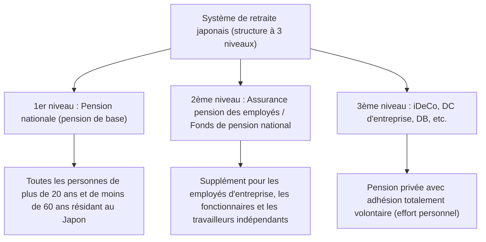

## Introduction : Pourquoi l'iDeCo (Régime de retraite à cotisations déterminées individuel) aujourd'hui ?

Dans le Japon moderne, sur fond de baisse de la natalité, de vieillissement de la population et d'allongement de l'espérance de vie (ce qu'on appelle « l'ère de la vie de 100 ans »), l'incertitude quant aux pensions futures et le manque de fonds pour la retraite sont devenus des problèmes sociaux majeurs. L'époque où « la seule pension publique versée par l'État suffisait pour passer une retraite aisée » est révolue, et nous sommes entrés dans une ère où la constitution d'un patrimoine par ses propres efforts est indispensable. Dans ce contexte, l'institution que l'État soutient le plus vigoureusement est l'« iDeCo (Régime de retraite à cotisations déterminées individuel) ».

L'iDeCo n'est pas un simple système d'investissement. Par la conception de l'État, c'est « l'outil ultime de constitution de fonds de retraite » qui intègre des avantages fiscaux extrêmement puissants et sans précédent. Cependant, derrière ce puissant effet de réduction d'impôts, il existe un mécanisme complexe concernant les impôts et les pensions. Cet article décrypte le fonctionnement de l'iDeCo à partir de la vue d'ensemble du système de retraite japonais. Il expliquera de manière très détaillée et systématique les « 3 effets de réduction d'impôt » dont vous pouvez bénéficier lors de la cotisation, de la gestion et de la réception, le contexte théorique, l'impact sur le taux marginal d'imposition, la signification de l'immobilisation des fonds jusqu'à 60 ans, et enfin, la stratégie de sortie optimale.

---

## 1. La place de l'iDeCo dans le système de retraite japonais (Structure à 3 niveaux)

Afin de comprendre exactement le fonctionnement de l'iDeCo, il est nécessaire de saisir la structure globale des systèmes de retraite publics et privés japonais, à savoir la « structure à 3 niveaux des pensions ».

### 1er niveau : Pension nationale (Pension de base)
Le fondement du système de retraite japonais est la « Pension nationale ». L'adhésion est obligatoire pour toutes les personnes âgées de 20 à 59 ans résidant au Japon (assurés de la 1ère à la 3ème catégorie). C'est ce qu'on appelle le « 1er niveau », qui sert de base pour soutenir la vie quotidienne pendant la retraite, mais il est difficile de maintenir un niveau de vie suffisant avec cela seul.

### 2ème niveau : Assurance pension des employés / Fonds de pension national
Le « 2ème niveau » est construit au-dessus du 1er niveau. Les employés d'entreprise et les fonctionnaires (assurés de 2ème catégorie) adhèrent à l'« Assurance pension des employés » par l'intermédiaire de leur employeur. Cette pension est proportionnelle à la rémunération, de sorte que les primes d'assurance et le montant futur de la pension varient en fonction des revenus pendant la vie active. D'autre part, les travailleurs indépendants et les freelances (assurés de 1ère catégorie) ne peuvent pas adhérer à l'assurance pension des employés, ils peuvent donc utiliser le « Fonds de pension national » pour constituer ce 2ème niveau à la place.

### 3ème niveau : Pensions privées à adhésion volontaire (iDeCo et pensions d'entreprise)
Pour compléter les fonds de retraite qui seraient insuffisants avec les seules pensions publiques (1er et 2ème niveaux), des pensions privées constituent le « 3ème niveau ». Outre les régimes de retraite d'entreprise à cotisations déterminées (DC d'entreprise) et à prestations déterminées (DB) mis en place par les entreprises pour leurs employés, c'est là que se situe l'« iDeCo (Régime de retraite à cotisations déterminées individuel) », auquel les individus souscrivent eux-mêmes. L'iDeCo est conçu pour permettre à toute personne de 20 à 64 ans de s'inscrire, indépendamment de sa profession ou de la présence d'un régime d'entreprise. Il sert d'infrastructure par laquelle l'État soutient fortement sur le plan fiscal « la constitution d'un patrimoine par l'effort personnel des citoyens ».

---

## 2. Le plus grand attrait de l'iDeCo : 3 mécanismes d'avantages fiscaux

L'iDeCo offre « 3 puissants avantages de réduction d'impôt » qui n'existent pas dans les fiducies de placement classiques ou les investissements en actions. L'interaction de ces avantages maximise l'effet des intérêts composés et l'efficacité fiscale dans la constitution de votre patrimoine.

### Avantage n°1 : Le mécanisme de déduction totale des cotisations sur le revenu
L'avantage le plus immédiat et certain de l'iDeCo est la « déduction totale des cotisations sur le revenu ». La déduction sur le revenu est un mécanisme permettant de soustraire un montant spécifique du « revenu imposable », qui sert de base au calcul de l'impôt.

L'impôt sur le revenu au Japon adopte un « système d'imposition progressive », où le taux d'imposition applicable (taux d'imposition marginal) augmente avec le revenu. Les cotisations versées à l'iDeCo sont entièrement déduites du revenu de l'année au titre de la « déduction pour cotisations de mutuelle de la petite entreprise, etc. ».

#### Mécanisme de calcul du taux d'imposition marginal et de l'effet de réduction d'impôt
Prenons l'exemple concret d'un employé de bureau ayant un revenu imposable de 5 millions de yens (taux d'impôt sur le revenu de 20 %, taux d'impôt local de 10 %) qui cotise 23 000 yens par mois (276 000 yens par an).

1. **Montant de la réduction d'impôt sur le revenu** : 276 000 yens × 20 % = 55 200 yens
2. **Montant de la réduction d'impôt local** : 276 000 yens × 10 % = 27 600 yens
3. **Réduction d'impôt totale (annuelle)** : 82 800 yens

Cette réduction d'impôt annuelle de 82 800 yens signifie, en d'autres termes, que « pour un investissement annuel de 276 000 yens, vous obtenez un retour garanti d'environ 30 % (82 800 yens) ». Bien qu'il n'y ait pas de « rendement garanti » en investissement, cet effet de réduction d'impôt grâce à la déduction sur le revenu peut être considéré comme un « rendement sans risque » que vous obtenez à coup sûr chaque année en utilisant simplement le système. En particulier, plus votre revenu est élevé et donc votre taux marginal d'imposition important, plus cet avantage fiscal devient spectaculaire.

### Avantage n°2 : Le mécanisme d'exonération totale d'impôt sur les gains
En temps normal, les bénéfices réalisés sur les actions et les fiducies de placement (dividendes et plus-values) sont soumis à une taxe de 20,315 % (15,315 % d'impôt sur le revenu et 5 % d'impôt local). Cependant, les bénéfices générés par les investissements sur un compte iDeCo sont « exonérés d'impôt » pendant toute la durée de la détention.

La véritable puissance de cette exonération d'impôt sur les gains réside dans la « maximisation de l'effet des intérêts composés ». Lors d'un investissement sur un compte ordinaire, chaque fois qu'un bénéfice est réalisé (ou qu'un dividende est perçu), environ 20 % sont prélevés sous forme d'impôts, ce qui diminue le montant disponible pour le réinvestissement. Cependant, avec l'iDeCo, les quelque 20 % qui auraient dû être prélevés en impôts sont intégrés au capital tel quel et réinvestis. Sur une longue période (20 ans, 30 ans), l'effet des intérêts composés généré par ce « report d'imposition (réinvestissement sans impôt) » crée une différence écrasante de plusieurs millions de yens dans l'actif final.

### Avantage n°3 : De puissantes déductions lors de la réception (Déduction pour revenus de retraite / Déduction pour pensions publiques, etc.)
Lors de la réception de l'actif accumulé et fructifié via l'iDeCo après 60 ans, de puissants avantages fiscaux sont également prévus. Il existe deux grandes façons de recevoir les fonds : en « capital (versement unique) » ou en « rente (versement fractionné) », et des déductions différentes s'appliquent à chacune.

*   **En cas de réception en capital : « Déduction pour revenus de retraite »**
    Si vous recevez l'argent sous forme de capital, il est traité fiscalement comme un « revenu de retraite ». Le montant de la déduction pour revenus de retraite augmente proportionnellement à la période de cotisation (années de service), et la formule de calcul est la suivante :
    *   Période de cotisation de 20 ans ou moins : 400 000 yens × période de cotisation
    *   Période de cotisation supérieure à 20 ans : 8 millions de yens + 700 000 yens × (période de cotisation - 20 ans)
    Si vous restez dans cette limite de déduction, vous ne paierez aucun impôt. De plus, même si vous dépassez la limite, une méthode de calcul extrêmement avantageuse s'applique, selon laquelle seule « la moitié » du montant excédentaire est imposable.

*   **En cas de réception en rente : « Déduction pour pensions publiques, etc. »**
    Si vous choisissez de recevoir l'argent en versements fractionnés, cela sera traité comme un « revenu divers », mais la « déduction pour pensions publiques, etc. » s'applique. Celle-ci est calculée en additionnant vos autres pensions publiques comme la pension nationale ou l'assurance pension des employés, et si vous avez 65 ans ou plus, jusqu'à 1,1 million de yens par an (si vos seuls revenus proviennent de pensions publiques) seront exonérés d'impôt.

---

## 3. Le dilemme de l'immobilisation des fonds : La signification de l'impossibilité de retrait avant 60 ans en principe

Le plus grand inconvénient fréquemment cité de l'iDeCo est la règle de restriction des fonds : « en principe, il est impossible de retirer les actifs avant l'âge de 60 ans ». Même si vous avez besoin d'une grosse somme d'argent pour un événement de la vie tel que des frais d'études ou l'achat d'un logement, vous ne pouvez pas toucher aux actifs de votre iDeCo.

Cependant, cette « immobilisation des fonds » n'est pas un simple inconvénient, elle contient une intention de conception importante du système.

### Le mécanisme forcé d'« investissement à long terme et de sécurisation des fonds de retraite »
Du point de vue de l'économie comportementale humaine, les individus ont tendance à privilégier les « petits bénéfices (ou désirs) immédiats » par rapport aux « grands bénéfices futurs » (le biais du présent). Si vous épargnez sur un compte avec des retraits libres, il est facile d'annuler et de retirer les fonds lorsque le marché s'effondre et que la panique s'installe, ou lorsque vous avez besoin d'un peu d'argent.

Le blocage des fonds de l'iDeCo jusqu'à 60 ans agit comme un verrou physique puissant pour contenir ce « biais du présent ». C'est un dispositif de sécurité visant à imposer la réalisation de l'objectif « ce sont des fonds pour la retraite » et à garantir le fonctionnement de l'effet des intérêts composés sur plusieurs décennies.

### Le verrouillage en tant que contrepartie des avantages fiscaux
La raison pour laquelle l'État offre des avantages fiscaux aussi généreux (déduction sur le revenu, exonération d'impôts sur les bénéfices, déduction pour revenus de retraite) est « d'encourager les citoyens à devenir indépendants et à se constituer des fonds pour leur retraite ». S'il s'agissait d'un système permettant des retraits libres, il risquerait d'être détourné comme un simple outil de réduction d'impôts à court terme. Il faut comprendre que le blocage des fonds jusqu'à 60 ans existe comme « condition d'échange » pour atteindre l'objectif de la politique gouvernementale de constitution d'un patrimoine pour la retraite.

---

## 4. La solution optimale pour la stratégie de sortie : Capital, rente ou une combinaison des deux

Après avoir constitué un patrimoine de dizaines de millions de yens avec l'iDeCo, la chose la plus importante devient « comment le recevoir (la stratégie de sortie) ». Le montant final qui vous restera en main (après impôts) changera considérablement en fonction du mode de réception, une simulation préalable minutieuse est donc indispensable.

### Option 1 : Mécanisme et stratégie de la réception en capital (versement unique)
Dans de nombreux cas, l'option qui a le plus de chances d'être fiscalement la plus avantageuse est la « réception sous forme de capital ». Comme mentionné précédemment, la déduction pour revenus de retraite est extrêmement puissante. Par exemple, si la période de cotisation est de 30 ans, le montant de la déduction est de « 8 millions de yens + 700 000 yens × 10 ans = 15 millions de yens ». Si le montant reçu, y compris les gains d'investissement, est de 15 millions de yens ou moins, l'impôt est nul.

**Point d'attention (règle de cumul avec les indemnités de licenciement de l'entreprise) :**
Cependant, il faut faire attention si vous êtes un employé d'entreprise et que vous recevez d'importantes indemnités de licenciement (prime de retraite) de votre employeur. Si vous recevez le capital de l'iDeCo et la prime de retraite de votre entreprise la même année (ou des années proches), la limite de déduction pour revenus de retraite sera partagée (cumulée) pour le calcul. Pour éviter cela, il est nécessaire d'utiliser des techniques avancées pour décaler stratégiquement la période de réception (utilisation de ce qu'on appelle la « règle des 5 ans pour la déduction des revenus de retraite »), telles que « recevoir l'iDeCo d'abord à 60 ans et recevoir la prime de retraite de l'entreprise à 65 ans (règle de laisser un écart de 5 ans) ».

### Option 2 : Mécanisme et stratégie de la réception en rente (versement fractionné)
Si vous choisissez de recevoir l'argent en versements fractionnés, vous avez l'avantage de pouvoir prolonger la durée de vie de vos actifs, car vous les retirez tout en continuant à les investir. Cependant, sur le plan fiscal, ces revenus seront ajoutés aux pensions publiques (pension nationale, assurance pension des employés). Par conséquent, pour les personnes percevant des pensions publiques élevées, le fait d'ajouter la part de rente de l'iDeCo risque de dépasser la limite de déduction pour pensions publiques, etc., entraînant une imposition en tant que revenus divers.

De plus, si vous optez pour la réception en rente, des « frais de versement (frais de transfert) » seront facturés à chaque fois par la banque fiduciaire, etc., il faut donc tenir compte de la possibilité de perdre de l'argent en frais si vous recevez de petites sommes fréquemment.

### Option 3 : Combinaison de capital et de rente
De nombreuses institutions financières permettent de choisir une « combinaison » de capital et de rente. Il s'agit d'une stratégie hybride consistant à maximiser la franchise d'impôt de la déduction pour revenus de retraite en recevant une partie en capital, puis à recevoir le montant excédant cette limite sous forme de rente fractionnée pour rester dans la limite de la déduction pour pensions publiques, etc. Optimiser cet équilibre en fonction de votre situation personnelle (présence d'une prime de retraite, montant des pensions publiques, autres revenus, etc.) est le but ultime de votre stratégie de sortie.

---

## Conclusion : L'iDeCo est un système où « l'écart de connaissances » se traduit directement par un écart de patrimoine

L'iDeCo (Régime de retraite à cotisations déterminées individuel) est l'infrastructure ultime de constitution de patrimoine, fortement soutenue par l'État, qui forme le 3ème niveau du système de retraite japonais. Sa « triple incitation fiscale » - une réduction d'impôt garantie correspondant à votre taux d'imposition marginal grâce à la déduction totale de vos cotisations sur le revenu, la maximisation de l'effet des intérêts composés grâce à l'exonération d'impôt sur les gains d'investissement, et une puissante déduction lors du versement - lui confère une supériorité écrasante qu'aucun autre produit financier ne peut imiter.

D'un autre côté, vous ne pouvez pas tirer pleinement parti de sa véritable valeur sans une compréhension correcte de l'ensemble du système et sans une utilisation stratégique, compte tenu de règles strictes comme le blocage des fonds jusqu'à 60 ans et des calculs fiscaux complexes entourant la déduction pour revenus de retraite et la déduction pour pensions publiques, etc. lors de la réception.

Dans le Japon d'aujourd'hui, le fait d'utiliser ou non l'iDeCo, et la manière de l'utiliser, n'est plus un simple « choix d'investissement », c'est une « stratégie fiscale pour toute une vie » et la « stratégie de survie pour la retraite » elle-même. Améliorer ses connaissances financières et « hacker » les systèmes mis en place par l'État au maximum sera la première étape la plus sûre pour survivre à cette riche ère de la vie de 100 ans.
