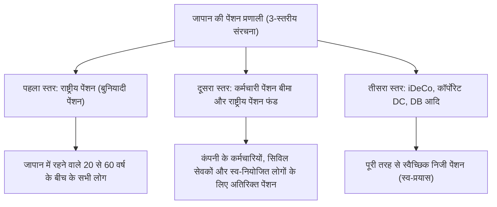

## प्रस्तावना: अब iDeCo (व्यक्तिगत प्रकार की परिभाषित अंशदान पेंशन) ही क्यों?

आधुनिक जापान में, जन्म दर में गिरावट, बढ़ती उम्र की आबादी और लंबी उम्र (तथाकथित '100 साल के जीवन का युग') की पृष्ठभूमि में, भविष्य की पेंशन को लेकर चिंताएं और सेवानिवृत्ति कोष की कमी प्रमुख सामाजिक मुद्दे बन गए हैं। वे दिन लद गए जब 'आप केवल सरकार द्वारा प्रदान की जाने वाली सार्वजनिक पेंशन के साथ एक आरामदायक सेवानिवृत्ति जी सकते थे', और हम एक ऐसे युग में प्रवेश कर चुके हैं जहां आत्म-प्रयास के माध्यम से संपत्ति का निर्माण आवश्यक है। इस संदर्भ में, सरकार द्वारा मजबूती से समर्थित प्रणालियों में सबसे प्रमुख "iDeCo (व्यक्तिगत प्रकार की परिभाषित अंशदान पेंशन)" है।

iDeCo केवल एक निवेश प्रणाली नहीं है। सरकार की प्रणाली के डिजाइन के हिस्से के रूप में, यह अभूतपूर्व और शक्तिशाली कर प्रोत्साहनों के साथ अंतर्निहित 'सेवानिवृत्ति निधि निर्माण के लिए सबसे शक्तिशाली उपकरण' है। हालांकि, इस शक्तिशाली कर-बचत प्रभाव के पीछे करों और पेंशन से संबंधित एक जटिल तंत्र मौजूद है। यह लेख जापान की पेंशन प्रणाली की समग्र तस्वीर से iDeCo के तंत्र को खोलेगा, और योगदान के समय, निवेश के दौरान, और प्राप्त करने के समय मिलने वाले '3 कर-बचत प्रभावों' की सैद्धांतिक पृष्ठभूमि, सीमांत कर दर पर प्रभाव, 60 वर्ष की आयु तक धन के लॉक-इन के अर्थ, और इष्टतम निकास रणनीति तक बहुत विस्तृत और व्यवस्थित व्याख्या करेगा।

---

## 1. जापान की पेंशन प्रणाली में iDeCo का स्थान (3-स्तरीय संरचना)

iDeCo के तंत्र को सटीक रूप से समझने के लिए, सबसे पहले जापान की सार्वजनिक और निजी पेंशन प्रणालियों की समग्र संरचना, जिसे 'पेंशन की 3-स्तरीय संरचना' कहा जाता है, को समझना आवश्यक है।

### पहला स्तर: राष्ट्रीय पेंशन (बुनियादी पेंशन)
जापान की पेंशन प्रणाली की नींव "राष्ट्रीय पेंशन" है। जापान में रहने वाले 20 से 60 वर्ष के बीच के सभी लोगों के लिए इसमें शामिल होना अनिवार्य है (श्रेणी 1 से 3 बीमित व्यक्ति)। इसे 'पहला स्तर' कहा जाता है, और यह बुढ़ापे में बुनियादी जीवनयापन का आधार बनता है, लेकिन केवल इसी से पर्याप्त जीवन स्तर बनाए रखना मुश्किल है।

### दूसरा स्तर: कर्मचारी पेंशन बीमा और राष्ट्रीय पेंशन फंड
पहले स्तर के ऊपर 'दूसरा स्तर' बनाया गया है। कंपनी के कर्मचारी और सिविल सेवक (श्रेणी 2 बीमित व्यक्ति) अपने नियोक्ता के माध्यम से "कर्मचारी पेंशन बीमा" में शामिल होते हैं। कर्मचारी पेंशन पारिश्रमिक के आनुपातिक है, और प्रीमियम और भविष्य में प्राप्त होने वाली राशि काम करने के दिनों की आय के अनुसार भिन्न होती है। दूसरी ओर, स्व-नियोजित लोग और फ्रीलांसर (श्रेणी 1 बीमित व्यक्ति) कर्मचारी पेंशन में शामिल नहीं हो सकते हैं, इसलिए वे इसके बजाय दूसरा स्तर बनाने के लिए "राष्ट्रीय पेंशन फंड" का उपयोग कर सकते हैं।

### तीसरा स्तर: स्वैच्छिक निजी पेंशन (iDeCo और कॉर्पोरेट पेंशन)
सार्वजनिक पेंशन (स्तर 1 और 2) द्वारा अपर्याप्त सेवानिवृत्ति निधि की भरपाई के लिए एक निजी पेंशन के रूप में 'तीसरा स्तर' प्रदान किया गया है। कॉर्पोरेट प्रकार की परिभाषित अंशदान पेंशन (कॉर्पोरेट DC) और परिभाषित लाभ कॉर्पोरेट पेंशन (DB) जो कंपनियां अपने कर्मचारियों के लिए लागू करती हैं, साथ ही "iDeCo (व्यक्तिगत प्रकार की परिभाषित अंशदान पेंशन)" जिसमें व्यक्ति स्वयं शामिल होते हैं, यहां स्थित हैं। iDeCo को सिद्धांत रूप में 20 से 65 वर्ष की आयु के किसी भी व्यक्ति के लिए सुलभ बनाया गया है, चाहे उनका पेशा कुछ भी हो या उनके कार्यस्थल पर कोई प्रणाली हो, और यह "नागरिकों के आत्म-प्रयास से संपत्ति निर्माण" का कर के मोर्चे पर दृढ़ता से समर्थन करने के लिए सरकार का बुनियादी ढांचा बन गया है।

---

## 2. iDeCo का सबसे बड़ा आकर्षण: 3 कर प्रोत्साहन तंत्र

iDeCo के पास अत्यधिक शक्तिशाली '3 कर-बचत लाभ' हैं जो सामान्य निवेश ट्रस्टों या स्टॉक निवेशों में उपलब्ध नहीं हैं। जब ये एक साथ काम करते हैं, तो संपत्ति निर्माण में चक्रवृद्धि प्रभाव और कर प्रभाव अधिकतम हो जाते हैं।

### भाग 1: तंत्र जहां योगदान "पूरी तरह से आय कटौती" योग्य हो जाता है
iDeCo का सबसे तत्काल और निश्चित लाभ "योगदान की पूर्ण आय कटौती" है। आय कटौती एक ऐसी प्रणाली है जो करों की गणना के लिए आधार "कर योग्य आय" से एक विशिष्ट राशि में कटौती करने की अनुमति देती है।

जापान का आयकर "प्रगतिशील कराधान प्रणाली" को अपनाता है, जिसका अर्थ है कि आय जितनी अधिक होगी, लागू कर दर (सीमांत कर दर) उतनी ही अधिक होगी। iDeCo में योगदान की गई राशि को उस वर्ष की आय से "लघु उद्यम पारस्परिक राहत योगदान कटौती" के रूप में पूरी तरह से काट लिया जाता है।

#### सीमांत कर दर और कर-बचत प्रभाव का गणना तंत्र
एक विशिष्ट उदाहरण के रूप में, 5 मिलियन येन (आयकर दर 20%, निवासी कर दर 10%) की कर योग्य आय वाले कंपनी कर्मचारी के मामले पर विचार करें जो हर महीने 23,000 येन (प्रति वर्ष 276,000 येन) का योगदान देता है।

1. **आयकर बचत**: 276,000 येन × 20% = 55,200 येन
2. **निवासी कर बचत**: 276,000 येन × 10% = 27,600 येन
3. **कुल कर बचत (प्रति वर्ष)**: 82,800 येन

प्रति वर्ष 82,800 येन की इस कर बचत का अर्थ है कि "प्रति वर्ष 276,000 येन के निवेश के लिए, आप निश्चित रूप से लगभग 30% (82,800 येन) कैशबैक प्राप्त कर रहे हैं।" हालांकि निवेश में "निश्चित रिटर्न" जैसी कोई चीज नहीं है, आय कटौती से होने वाला यह कर-बचत प्रभाव एक "जोखिम मुक्त रिटर्न" है जो केवल प्रणाली का उपयोग करके हर साल मज़बूती से प्राप्त किया जा सकता है। विशेष रूप से, उच्च आय और उच्च सीमांत कर दर वाले लोगों के लिए, यह कर-बचत लाभ नाटकीय रूप से बढ़ जाता है।

### भाग 2: वह तंत्र जो निवेश लाभ को "पूरी तरह से कर-मुक्त" बनाता है
आमतौर पर, स्टॉक और निवेश ट्रस्टों से होने वाले लाभ (लाभांश और पूंजीगत लाभ) 20.315% (15.315% आयकर, 5% निवासी कर) कर के अधीन होते हैं। हालांकि, iDeCo खाते के भीतर निवेश से अर्जित लाभ पूरी अवधि के दौरान "कर-मुक्त" रहता है।

इस निवेश लाभ कर छूट की वास्तविक शक्ति "चक्रवृद्धि प्रभाव को अधिकतम करने" में निहित है। नियमित खाते में निवेश करते समय, हर बार जब आप लाभ कमाते हैं (या लाभांश प्राप्त करते हैं), लगभग 20% कर के रूप में काट लिया जाता है, जिससे वह राशि कम हो जाती है जिसे पुनर्निवेशित किया जा सकता है। हालांकि, iDeCo में, लगभग 20% जो कर के रूप में काट लिया गया होता, उसे मूलधन में शामिल कर लिया जाता है और फिर से निवेश किया जाता है। लंबी अवधि (20 साल, 30 साल) के निवेश में, इस "कर स्थगन (कर-मुक्त पुनर्निवेश)" द्वारा लाया गया चक्रवृद्धि प्रभाव अंतिम संपत्ति मूल्य में लाखों येन का भारी अंतर पैदा करता है।

### भाग 3: प्राप्त करने के समय शक्तिशाली कटौती (सेवानिवृत्ति आय कटौती / सार्वजनिक पेंशन आदि कटौती)
iDeCo के साथ जमा और बढ़ाई गई संपत्ति को 60 वर्ष की आयु के बाद प्राप्त करते समय भी शक्तिशाली कर प्रोत्साहन प्रदान किए जाते हैं। प्राप्त करने के मुख्य रूप से दो तरीके हैं: "एकमुश्त भुगतान (लंप सम)" और "पेंशन (किस्त भुगतान)", और प्रत्येक पर अलग-अलग कटौतियां लागू होती हैं।

*   **एकमुश्त प्राप्त करने के मामले में: "सेवानिवृत्ति आय कटौती"**
    यदि आप इसे एकमुश्त राशि के रूप में प्राप्त करते हैं, तो इसे कर उद्देश्यों के लिए "सेवानिवृत्ति आय" माना जाएगा। सेवानिवृत्ति आय कटौती को इस तरह डिज़ाइन किया गया है कि सदस्यता अवधि (सेवा के वर्ष) जितनी लंबी होगी, कटौती की राशि उतनी ही अधिक होगी, और गणना का सूत्र इस प्रकार है:
    *   20 वर्ष या उससे कम की सदस्यता अवधि: 400,000 येन × सदस्यता अवधि
    *   20 वर्ष से अधिक की सदस्यता अवधि: 8 मिलियन येन + 700,000 येन × (सदस्यता अवधि - 20 वर्ष)
    यदि यह इस कटौती सीमा के भीतर रहता है, तो कोई कर नहीं लगेगा। इसके अलावा, भले ही यह कटौती सीमा से अधिक हो, एक बहुत ही अनुकूल गणना विधि लागू की जाती है जहां अतिरिक्त राशि के केवल "आधे" हिस्से पर कर लगाया जाता है।

*   **पेंशन के रूप में प्राप्त करने के मामले में: "सार्वजनिक पेंशन आदि कटौती"**
    किस्तों में प्राप्त करने के मामले में, इसे "विविध आय" माना जाता है, लेकिन "सार्वजनिक पेंशन आदि कटौती" लागू होती है। इसकी गणना राष्ट्रीय पेंशन और कर्मचारी पेंशन जैसी सार्वजनिक पेंशन के साथ जोड़कर की जाती है, और यदि आपकी आयु 65 वर्ष या उससे अधिक है, तो 1.1 मिलियन येन तक (यदि केवल सार्वजनिक पेंशन आदि से आय है) कर-मुक्त है।

---

## 3. धन लॉक-इन की दुविधा: सिद्धांत रूप में 60 वर्ष की आयु तक निकासी न कर पाने का अर्थ

iDeCo के सबसे बड़े नुकसान के रूप में जो बात अक्सर बताई जाती है, वह है धन के लॉक-इन का नियम कि "सिद्धांत रूप में, 60 वर्ष की आयु तक संपत्ति नहीं निकाली जा सकती।" यहां तक ​​कि अगर आपको शिक्षा या घर खरीदने जैसे जीवन के किसी महत्वपूर्ण अवसर के लिए बड़ी रकम की आवश्यकता हो, तो भी आप iDeCo की संपत्ति को हाथ नहीं लगा सकते।

हालाँकि, यह "धन का लॉक-इन" केवल एक नुकसान नहीं है, बल्कि इसमें प्रणाली के डिजाइन का एक महत्वपूर्ण इरादा शामिल है।

### अनिवार्य "दीर्घकालिक निवेश और सेवानिवृत्ति निधि को सुरक्षित करने" का तंत्र
मानवीय व्यवहार अर्थशास्त्र के दृष्टिकोण से देखा जाए, तो लोगों में "भविष्य के बड़े मुनाफे" के बजाय "तत्काल छोटे मुनाफे (या इच्छाओं)" को प्राथमिकता देने की प्रवृत्ति (वर्तमान पूर्वाग्रह) होती है। यदि आप किसी ऐसे खाते में पैसा जमा कर रहे हैं जहां से आप स्वतंत्र रूप से निकासी कर सकते हैं, तो जब बाजार क्रैश हो जाता है और घबराहट होती है, या जब आपको थोड़े से पैसे की आवश्यकता होती है, तो आप आसानी से इसे रद्द कर सकते हैं।

iDeCo का 60 वर्ष की आयु तक धन का लॉक-इन इस "वर्तमान पूर्वाग्रह" को भौतिक रूप से रोकने के लिए एक शक्तिशाली लॉक फ़ंक्शन के रूप में कार्य करता है। यह एक सुरक्षा उपकरण है जो बलपूर्वक इस उद्देश्य को पूरा करता है कि "यह धन सेवानिवृत्ति के लिए है" और यह सुनिश्चित करता है कि दशकों की अवधि में चक्रवृद्धि प्रभाव मज़बूती से काम करे।

### कर प्रोत्साहनों के लिए कीमत के रूप में लॉक
सरकार द्वारा इतने उदार कर प्रोत्साहन (आय कटौती, निवेश लाभ पर कर छूट, और सेवानिवृत्ति आय कटौती) प्रदान करने का कारण यह है कि "नागरिक स्वतंत्र रूप से अपने लिए सेवानिवृत्ति निधि बनाएं।" यदि यह एक ऐसी प्रणाली होती जहां से स्वतंत्र रूप से निकासी की जा सकती, तो इसका दुरुपयोग एक अल्पकालिक कर-बचत उपकरण के रूप में किया जा सकता था। इसे इस तरह समझा जाना चाहिए कि 60 वर्ष की आयु तक धन का लॉक-इन सेवानिवृत्ति निधि बनाने के सरकार के नीतिगत उद्देश्य को प्राप्त करने के लिए "लेन-देन की शर्त" के रूप में मौजूद है।

---

## 4. निकास रणनीति का इष्टतम समाधान: एकमुश्त, पेंशन, या दोनों का संयोजन

iDeCo के साथ करोड़ों येन की संपत्ति बनाने के बाद, जो सबसे महत्वपूर्ण हो जाता है वह है "इसे कैसे प्राप्त किया जाए (निकास रणनीति)"। आप इसे कैसे प्राप्त करते हैं, इसके आधार पर अंततः आपके पास जो राशि बचेगी (कर-पश्चात राशि) वह काफी बदल जाएगी, इसलिए पहले से सावधानीपूर्वक सिमुलेशन आवश्यक है।

### विकल्प 1: एकमुश्त (लंप सम) का तंत्र और रणनीति
कई मामलों में, जो कर के दृष्टिकोण से सबसे अधिक फायदेमंद होने की संभावना है वह "एकमुश्त के रूप में प्राप्त करना" है। जैसा कि पहले उल्लेख किया गया है, सेवानिवृत्ति आय कटौती बहुत शक्तिशाली है। उदाहरण के लिए, यदि सदस्यता अवधि 30 वर्ष है, तो कटौती की राशि "8 मिलियन येन + 700,000 येन × 10 वर्ष = 15 मिलियन येन" होगी। यदि निवेश लाभ सहित प्राप्त होने वाली राशि 15 मिलियन येन या उससे कम है, तो कर शून्य है।

**ध्यान देने योग्य बातें (कंपनी के सेवानिवृत्ति वेतन के साथ संयोजन नियम):**
हालाँकि, यदि आप एक कंपनी कर्मचारी हैं और आपको अपने नियोक्ता से बड़ी राशि का सेवानिवृत्ति वेतन मिलने वाला है, तो आपको सावधान रहने की आवश्यकता है। यदि आप एक ही वर्ष (या करीब के वर्षों) में iDeCo का एकमुश्त और अपनी कंपनी का सेवानिवृत्ति वेतन प्राप्त करते हैं, तो सेवानिवृत्ति आय कटौती सीमा की गणना दोनों के बीच साझा (संयुक्त) करके की जाएगी। इससे बचने के लिए, एक उन्नत तकनीक (तथाकथित "सेवानिवृत्ति आय कटौती का 5-वर्षीय नियम" आदि का उपयोग) की आवश्यकता होती है, जिसमें रणनीतिक रूप से प्राप्त करने के समय को अलग किया जाता है, जैसे कि "iDeCo को पहले 60 वर्ष की आयु में प्राप्त करना और कंपनी का सेवानिवृत्ति वेतन 65 वर्ष की आयु में प्राप्त करना (5 साल का अंतराल छोड़ने का नियम)।"

### विकल्प 2: पेंशन (किस्त भुगतान) का तंत्र और रणनीति
यदि आप इसे किस्तों में प्राप्त करना चुनते हैं, तो आपको निवेश जारी रखते हुए पैसे निकालने का लाभ मिलता है, जिससे संपत्ति का जीवन बढ़ सकता है। हालाँकि, कर के संदर्भ में, इसे सार्वजनिक पेंशन (राष्ट्रीय पेंशन / कर्मचारी पेंशन) के साथ जोड़ा जाता है, इसलिए जिन लोगों को सार्वजनिक पेंशन की बड़ी राशि मिलती है, उनके लिए iDeCo के पेंशन प्राप्तियों को जोड़ने से सार्वजनिक पेंशन आदि कटौती सीमा से अधिक होने और विविध आय के रूप में कर लगाए जाने का जोखिम होता है।

इसके अतिरिक्त, यदि आप पेंशन प्राप्त करना चुनते हैं, तो ट्रस्ट बैंक आदि के लिए हर बार "लाभ शुल्क (हस्तांतरण शुल्क)" लगेगा, इसलिए आपको इस संभावना पर भी विचार करना होगा कि यदि आप छोटी राशियों को कई बार में प्राप्त करते हैं तो शुल्क के कारण आपको नुकसान हो सकता है।

### विकल्प 3: एकमुश्त और पेंशन का संयोजन
कई वित्तीय संस्थान आपको एकमुश्त और पेंशन को मिलाकर "संयोजन" चुनने की अनुमति देते हैं। यह एक हाइब्रिड रणनीति है जहां आप सेवानिवृत्ति आय कटौती की कर-मुक्त सीमा का पूरी तरह से उपयोग करके एकमुश्त राशि प्राप्त करते हैं, और जो हिस्सा सीमा से अधिक हो जाता है, उसे पेंशन के रूप में किस्तों में प्राप्त करते हैं ताकि यह सार्वजनिक पेंशन आदि कटौती की सीमा के भीतर रहे। व्यक्ति की स्थिति (सेवानिवृत्ति वेतन है या नहीं, सार्वजनिक पेंशन की राशि, अन्य आय आदि) के अनुसार इस संतुलन को अनुकूलित करना निकास रणनीति में अंतिम लक्ष्य है।

---

## निष्कर्ष: iDeCo एक ऐसी प्रणाली है जहां "ज्ञान की असमानता" सीधे संपत्ति की असमानता से जुड़ती है

iDeCo (व्यक्तिगत प्रकार की परिभाषित अंशदान पेंशन) सरकार द्वारा समर्थित सबसे शक्तिशाली संपत्ति निर्माण बुनियादी ढांचा है जो जापान की पेंशन प्रणाली के तीसरे स्तर के रूप में कार्य करता है। योगदान की पूर्ण आय कटौती द्वारा सीमांत कर दर के अनुसार निश्चित कर बचत, निवेश लाभ पर कर छूट द्वारा चक्रवृद्धि प्रभाव का अधिकतमकरण, और प्राप्त करने के समय शक्तिशाली कटौती का यह "तिहरा कर प्रोत्साहन" अन्य किसी भी वित्तीय उत्पाद द्वारा प्राप्त नहीं की जा सकने वाली असीम श्रेष्ठता रखता है।

दूसरी ओर, 60 वर्ष की आयु तक धन लॉक-इन का सख्त नियम, और प्राप्त करने के समय सेवानिवृत्ति आय कटौती और सार्वजनिक पेंशन आदि कटौती से जुड़ी जटिल कर गणनाएं, इसका मतलब है कि यदि आप प्रणाली की पूरी तस्वीर को सही ढंग से नहीं समझते हैं और रणनीतिक रूप से इसका उपयोग नहीं करते हैं, तो आप इसके वास्तविक मूल्य को पूरी तरह से नहीं निकाल पाएंगे।

आधुनिक जापान में, iDeCo का उपयोग करना है या नहीं, और इसका उपयोग कैसे करना है, यह अब केवल "निवेश का विकल्प" नहीं है, बल्कि एक "आजीवन कर रणनीति" और बुढ़ापे में "अस्तित्व की रणनीति" है। वित्तीय साक्षरता बढ़ाना और सरकारी प्रणालियों का अधिकतम लाभ उठाना 100 साल के जीवन के इस समृद्ध युग में जीवित रहने के लिए सबसे निश्चित पहला कदम होगा।
