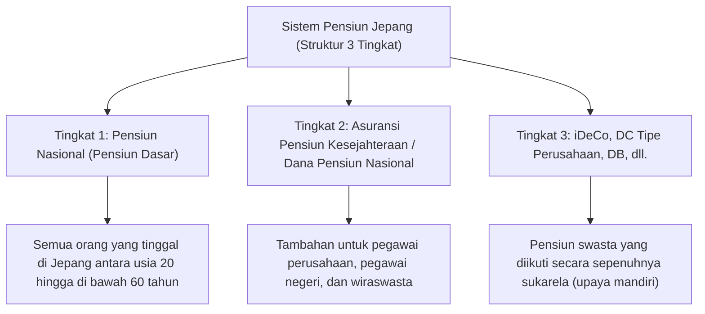

## Pendahuluan: Mengapa Sekarang Membutuhkan iDeCo (Pensiun Iuran Pasti Tipe Individu)?

Di Jepang modern, dengan latar belakang penurunan angka kelahiran, penuaan populasi, dan peningkatan usia harapan hidup (apa yang disebut "era kehidupan 100 tahun"), kekhawatiran tentang pensiun di masa depan dan kurangnya dana hari tua telah menjadi masalah sosial yang besar. Era di mana seseorang bisa "menikmati masa tua yang sejahtera hanya dengan pensiun publik yang disediakan oleh negara" seperti di masa lalu telah berakhir, dan kita telah memasuki era di mana pembentukan aset melalui upaya mandiri menjadi sangat penting. Di tengah situasi tersebut, institusi utama yang sangat didukung oleh negara adalah "iDeCo (Pensiun Iuran Pasti Tipe Individu)".

iDeCo bukanlah sekadar sistem investasi biasa. Dalam desain sistem negara, ini adalah "alat pembentukan dana hari tua terkuat" yang dilengkapi dengan insentif pajak yang sangat kuat yang belum pernah ada sebelumnya. Namun, di balik efek penghematan pajak yang kuat tersebut, terdapat mekanisme kompleks terkait pajak dan pensiun. Dalam artikel ini, kita akan mengungkap mekanisme iDeCo dari keseluruhan sistem pensiun Jepang, dan menjelaskan secara sangat rinci dan sistematis mulai dari latar belakang teoretis dari "tiga efek penghematan pajak" yang dapat dinikmati saat memberikan iuran, saat berinvestasi, dan saat menerima dana, dampaknya terhadap tarif pajak marjinal, makna dari penahanan dana hingga usia 60 tahun, hingga strategi keluar yang optimal.

---

## 1. Posisi iDeCo dalam Sistem Pensiun Jepang (Struktur 3 Tingkat)

Untuk memahami mekanisme iDeCo secara akurat, pertama-tama perlu untuk memahami keseluruhan struktur sistem pensiun publik dan swasta di Jepang, yang disebut "struktur pensiun 3 tingkat".

### Bagian Tingkat 1: Pensiun Nasional (Pensiun Dasar)
Fondasi dari sistem pensiun Jepang adalah "Pensiun Nasional". Semua orang yang memiliki alamat domisili di Jepang dan berusia antara 20 hingga di bawah 60 tahun diwajibkan untuk bergabung (Tertanggung Kategori 1 hingga 3). Ini disebut sebagai "bagian tingkat 1" dan menjadi dasar untuk mendukung kehidupan dasar di masa tua, tetapi sulit untuk mempertahankan standar hidup yang memadai hanya dengan ini.

### Bagian Tingkat 2: Asuransi Pensiun Kesejahteraan / Dana Pensiun Nasional
Dibangun di atas tingkat 1 adalah "bagian tingkat 2". Pegawai perusahaan dan pegawai negeri (Tertanggung Kategori 2) bergabung dengan "Asuransi Pensiun Kesejahteraan" melalui tempat kerja mereka. Pensiun kesejahteraan ini proporsional dengan kompensasi, di mana premi dan jumlah penerimaan di masa depan bervariasi sesuai dengan pendapatan selama masa kerja aktif. Di sisi lain, wiraswasta dan pekerja lepas (Tertanggung Kategori 1) tidak dapat bergabung dengan pensiun kesejahteraan, sehingga mereka dapat menggunakan "Dana Pensiun Nasional" sebagai gantinya untuk membangun bagian tingkat 2.

### Bagian Tingkat 3: Pensiun Swasta Keikutsertaan Sukarela (iDeCo dan Pensiun Perusahaan)
Untuk melengkapi kekurangan dana hari tua dari pensiun publik (tingkat 1 dan 2), disediakan "bagian tingkat 3" yang merupakan pensiun swasta. Selain pensiun iuran pasti tipe perusahaan (DC Perusahaan) dan pensiun perusahaan manfaat pasti (DB) yang diperkenalkan oleh perusahaan untuk karyawan, "iDeCo (Pensiun Iuran Pasti Tipe Individu)" yang diikuti secara mandiri oleh individu ditempatkan di sini. iDeCo pada prinsipnya dapat diikuti oleh siapa saja yang berusia antara 20 hingga di bawah 65 tahun, terlepas dari profesi atau ada tidaknya sistem di tempat kerja, dan telah menjadi infrastruktur bagi negara untuk sangat mendukung "pembentukan aset melalui upaya mandiri warga negara" dari segi perpajakan.

---

## 2. Daya Tarik Terbesar iDeCo: Tiga Mekanisme Insentif Pajak

iDeCo menawarkan "tiga manfaat penghematan pajak" yang sangat kuat yang tidak ditemukan pada reksa dana biasa atau investasi saham. Ketika ketiganya bekerja sama, efek bunga majemuk dan efek pajak dalam pembentukan aset dimaksimalkan.

### Kesatu: Mekanisme di mana Iuran Menjadi "Pengurangan Pendapatan Penuh"
Manfaat iDeCo yang paling cepat dan pasti adalah "pengurangan pendapatan penuh atas iuran". Pengurangan pendapatan adalah mekanisme di mana jumlah tertentu dapat dikurangi dari "pendapatan kena pajak" yang menjadi dasar penghitungan pajak.

Pajak penghasilan Jepang mengadopsi "sistem pajak progresif berlebih", di mana semakin tinggi pendapatan, semakin tinggi tarif pajak yang diterapkan (tarif pajak marjinal). Iuran yang dibayarkan ke iDeCo dikurangkan sepenuhnya dari pendapatan tahun tersebut sebagai "pengurangan iuran untuk reksa dana perusahaan skala kecil, dll.".

#### Mekanisme Penghitungan Tarif Pajak Marjinal dan Efek Penghematan Pajak
Sebagai contoh konkret, mari kita pertimbangkan kasus di mana seorang pegawai perusahaan dengan pendapatan kena pajak 5 juta yen (tarif pajak penghasilan 20%, tarif pajak penduduk 10%) membayar iuran sebesar 23.000 yen setiap bulan (276.000 yen per tahun).

1. **Jumlah penghematan pajak penghasilan**: 276.000 yen × 20% = 55.200 yen
2. **Jumlah penghematan pajak penduduk**: 276.000 yen × 10% = 27.600 yen
3. **Total jumlah penghematan pajak (tahunan)**: 82.800 yen

Penghematan pajak sebesar 82.800 yen per tahun ini, dengan kata lain, identik dengan "untuk investasi sebesar 276.000 yen per tahun, Anda pasti mendapatkan cashback sekitar 30% (82.800 yen)". Meskipun tidak ada yang namanya "keuntungan pasti" dalam investasi, efek penghematan pajak dari pengurangan pendapatan ini dapat dikatakan sebagai "imbal hasil tanpa risiko" yang pasti diperoleh setiap tahun hanya dengan menggunakan sistem ini. Terutama, bagi mereka yang memiliki pendapatan tinggi dan tarif pajak marjinal yang tinggi, manfaat penghematan pajak ini menjadi jauh lebih besar.

### Kedua: Mekanisme di mana Hasil Investasi Menjadi "Sepenuhnya Bebas Pajak"
Biasanya, keuntungan yang diperoleh dari saham dan reksa dana (dividen dan keuntungan modal) dikenakan pajak sebesar 20,315% (pajak penghasilan 15,315%, pajak penduduk 5%). Namun, keuntungan yang diperoleh dari investasi dalam rekening iDeCo adalah "bebas pajak" selama periode tersebut.

Kekuatan sejati dari pembebasan pajak atas hasil investasi ini terletak pada "maksimalisasi efek bunga majemuk". Ketika berinvestasi di rekening reguler, setiap kali ada keuntungan (atau setiap kali menerima dividen), sekitar 20% dikurangkan sebagai pajak, sehingga mengurangi jumlah yang dapat diinvestasikan kembali. Namun, dengan iDeCo, bagian sekitar 20% yang seharusnya dikurangkan sebagai pajak dimasukkan kembali ke dalam pokok awal sebagaimana adanya, dan dialokasikan untuk investasi lagi. Dalam investasi jangka panjang (20 tahun, 30 tahun), efek bunga majemuk yang dibawa oleh "penundaan pajak (reinvestasi bebas pajak)" ini akan menghasilkan perbedaan yang luar biasa dalam jumlah aset akhir, mencapai jutaan yen.

### Ketiga: Pengurangan Kuat Saat Menerima Dana (Pengurangan Pendapatan Pensiun / Pengurangan Pensiun Publik dll.)
Saat menerima aset yang telah diakumulasikan dan dikembangkan dengan iDeCo setelah usia 60 tahun, insentif pajak yang kuat juga disediakan. Ada dua cara utama untuk menerimanya: "Sekaligus (Penerimaan Lump-sum)" dan "Pensiun (Penerimaan Dicicil)", dan setiap metode menerapkan pengurangan yang berbeda.

*   **Dalam Kasus Penerimaan Sekaligus: "Pengurangan Pendapatan Pensiun"**
    Jika Anda menerimanya sebagai jumlah sekaligus, untuk tujuan perpajakan ini diperlakukan sebagai "pendapatan pensiun". Pengurangan pendapatan pensiun memiliki mekanisme di mana jumlah pengurangan meningkat seiring bertambahnya periode partisipasi (masa kerja), dan rumus penghitungannya adalah sebagai berikut.
    *   Periode partisipasi 20 tahun atau kurang: 400.000 yen × periode partisipasi
    *   Periode partisipasi lebih dari 20 tahun: 8.000.000 yen + 700.000 yen × (periode partisipasi - 20 tahun)
    Jika berada di dalam batas pengurangan ini, tidak ada pajak yang dikenakan sama sekali. Selain itu, bahkan jika melebihi batas pengurangan, metode penghitungan yang sangat diistimewakan diterapkan, di mana pajak hanya dikenakan pada "setengah" dari jumlah kelebihan.

*   **Dalam Kasus Penerimaan Pensiun: "Pengurangan Pensiun Publik dll."**
    Jika Anda menerimanya secara dicicil, itu diperlakukan sebagai "pendapatan lain-lain", tetapi "Pengurangan Pensiun Publik dll." diterapkan. Ini dihitung dengan menggabungkannya dengan pensiun publik seperti pensiun nasional dan pensiun kesejahteraan, dan jika Anda berusia 65 tahun ke atas, hingga 1,1 juta yen setahun (hanya jika pendapatannya dari pensiun publik dll.) bebas pajak.

---

## 3. Dilema Penahanan Dana: Makna Mengapa pada Prinsipnya Tidak Dapat Ditarik hingga Usia 60 Tahun

Salah satu kelemahan terbesar iDeCo yang sering disebutkan adalah aturan penahanan dana yang menyatakan bahwa, "pada prinsipnya, aset tidak dapat ditarik hingga usia 60 tahun". Bahkan jika Anda membutuhkan sejumlah besar uang untuk peristiwa kehidupan seperti dana pendidikan atau dana pembelian rumah, Anda tidak dapat menyentuh aset di iDeCo.

Namun, "penahanan dana" ini bukan sekadar kelemahan, tetapi mengandung niat penting dalam desain sistemnya.

### Mekanisme Obligasi "Investasi Jangka Panjang / Pengamanan Dana Hari Tua"
Dari perspektif ekonomi perilaku manusia, orang cenderung memprioritaskan "keuntungan (atau keinginan) kecil langsung" di atas "keuntungan besar di masa depan" (bias saat ini). Jika Anda mengakumulasi di rekening yang dapat ditarik dengan bebas, ketika pasar jatuh dan kepanikan melanda, atau ketika Anda membutuhkan sedikit uang, Anda cenderung membatalkannya dengan mudah.

Penahanan dana iDeCo hingga usia 60 tahun bertindak sebagai fitur kunci yang kuat untuk secara fisik menahan "bias saat ini" tersebut. Ini adalah alat pengaman untuk secara paksa mencapai tujuan "dana untuk hari tua", dan memastikan bahwa efek bunga majemuk bekerja secara efektif selama beberapa dekade.

### Kunci Sebagai Kompensasi atas Insentif Pajak
Alasan mengapa negara memberikan insentif pajak yang begitu besar (pengurangan pendapatan, pembebasan pajak atas hasil investasi, pengurangan pendapatan pensiun) adalah "untuk mendorong warga negara agar secara mandiri membangun dana hari tua mereka". Jika itu adalah sistem di mana dana bisa ditarik dengan bebas, itu dapat disalahgunakan sekadar sebagai alat penghematan pajak jangka pendek. Penahanan dana hingga usia 60 tahun harus dipahami sebagai "syarat pertukaran" untuk mencapai tujuan kebijakan negara dalam membentuk dana hari tua.

---

## 4. Solusi Optimal untuk Strategi Keluar: Sekaligus, Pensiun, atau Kombinasi?

Setelah membangun aset bernilai puluhan juta yen dengan iDeCo, hal terpenting yang tersisa adalah "bagaimana menerimanya (strategi keluar)". Bergantung pada bagaimana Anda menerimanya, jumlah akhir yang tersisa di tangan Anda (jumlah setelah pajak) akan sangat bervariasi, sehingga simulasi yang cermat sebelumnya sangat penting.

### Pilihan 1: Mekanisme dan Strategi Penerimaan Sekaligus (Lump-sum)
Dalam banyak kasus, yang kemungkinan paling menguntungkan dari segi pajak adalah "penerimaan sekaligus". Seperti disebutkan sebelumnya, pengurangan pendapatan pensiun sangat kuat. Misalnya, jika periode partisipasi adalah 30 tahun, jumlah pengurangannya adalah "8.000.000 yen + 700.000 yen × 10 tahun = 15.000.000 yen". Jika jumlah yang diterima termasuk hasil investasi adalah 15 juta yen atau kurang, pajaknya nol.

**Poin yang Perlu Diperhatikan (Aturan Penggabungan dengan Uang Pesangon Perusahaan):**
Namun, kehati-hatian diperlukan jika Anda adalah pegawai perusahaan dan menerima uang pesangon yang besar dari tempat kerja Anda. Jika Anda menerima dana sekaligus dari iDeCo dan uang pesangon perusahaan di tahun yang sama (atau tahun yang berdekatan), batas pengurangan pendapatan pensiun akan dibagikan (digabungkan) dan dihitung untuk keduanya. Untuk menghindari hal ini, diperlukan teknik canggih untuk mengubah waktu penerimaan secara strategis, seperti "menerima iDeCo terlebih dahulu pada usia 60 tahun dan menerima pesangon perusahaan pada usia 65 tahun (aturan menyisakan jarak 5 tahun)" (pemanfaatan dari apa yang disebut "aturan 5 tahun untuk pengurangan pendapatan pensiun").

### Pilihan 2: Mekanisme dan Strategi Pensiun (Penerimaan Dicicil)
Jika Anda menerimanya secara dicicil, ada keuntungan dapat memperpanjang umur aset karena Anda mencairkannya sambil terus berinvestasi. Namun, dari segi pajak, itu digabungkan dengan pensiun publik (pensiun nasional dan pensiun kesejahteraan), jadi jika Anda menerima jumlah pensiun publik yang tinggi, ada risiko tambahan penerimaan pensiun iDeCo akan melampaui batas pengurangan pensiun publik dll., dan dikenakan pajak sebagai pendapatan lain-lain.

Selain itu, jika Anda memilih penerimaan pensiun, "biaya manfaat (biaya transfer)" akan dikenakan oleh bank perwalian setiap kali pembayaran, sehingga Anda juga harus mempertimbangkan kemungkinan rugi biaya jika Anda menerima jumlah kecil secara perlahan.

### Pilihan 3: Kombinasi Sekaligus dan Pensiun
Di banyak lembaga keuangan, Anda dapat memilih "kombinasi" sekaligus dan pensiun. Ini adalah strategi hibrida di mana Anda memanfaatkan sepenuhnya batas bebas pajak dari pengurangan pendapatan pensiun untuk menerima dana sekaligus, dan untuk jumlah yang melebihi batas, Anda menerimanya secara dicicil sebagai pensiun agar sesuai dengan batas pengurangan pensiun publik dll. Mengoptimalkan keseimbangan ini sesuai dengan keadaan masing-masing individu (keberadaan uang pesangon, jumlah penerimaan pensiun publik, pendapatan lain, dll.) adalah tujuan akhir dalam strategi keluar.

---

## Kesimpulan: iDeCo adalah Sistem di Mana "Kesenjangan Pengetahuan" Secara Langsung Mengarah pada Kesenjangan Aset

iDeCo (Pensiun Iuran Pasti Tipe Individu) adalah infrastruktur pembentukan aset terkuat yang didukung oleh negara, yang memainkan peran bagian tingkat 3 dari sistem pensiun Jepang. "Insentif pajak tiga lapis" berupa penghematan pajak yang pasti sesuai dengan tarif pajak marjinal melalui pengurangan penuh iuran dari pendapatan, maksimalisasi efek bunga majemuk melalui pembebasan pajak atas hasil investasi, dan pengurangan yang kuat saat penerimaan, memiliki keunggulan luar biasa yang tidak dapat ditiru oleh produk keuangan lainnya.

Di sisi lain, tanpa memahami dengan benar keseluruhan gambar sistem dan memanfaatkannya secara strategis, seperti aturan ketat penahanan dana hingga usia 60 tahun dan perhitungan pajak yang rumit mengenai pengurangan pendapatan pensiun serta pengurangan pensiun publik dll. saat menerima dana, nilai sejatinya tidak dapat dimaksimalkan sepenuhnya.

Di Jepang modern, apakah akan memanfaatkan iDeCo atau tidak, dan bagaimana memanfaatkannya, bukan lagi sekadar "pilihan investasi", tetapi merupakan "strategi pajak seumur hidup" dan "strategi bertahan hidup di masa tua" itu sendiri. Meningkatkan literasi keuangan dan meretas sistem negara secara maksimal akan menjadi langkah pertama yang paling pasti untuk bertahan di era kehidupan 100 tahun yang sejahtera.
