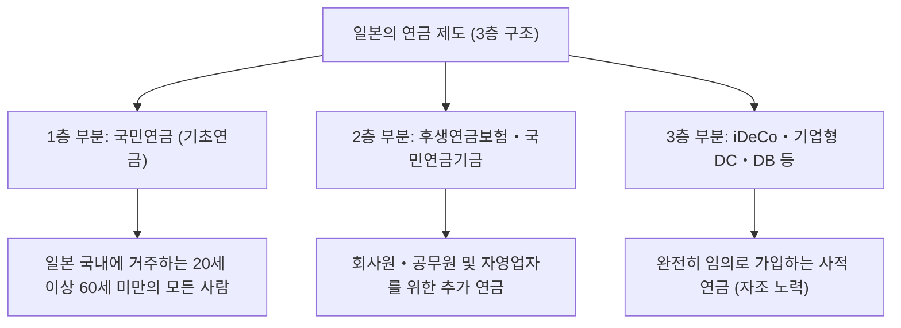

## 시작하며: 왜 지금 iDeCo(개인형 확정갹출연금)인가

현대 일본에서 저출산 고령화의 진전과 장수화(이른바 '인생 100세 시대')를 배경으로 장래의 연금 불안과 노후 자금 부족이 큰 사회적 과제가 되고 있습니다. 과거처럼 '국가가 지급하는 공적 연금만으로 풍요로운 노후를 보낼 수 있는' 시대는 막을 내리고, 자조 노력에 의한 자산 형성이 불가결한 시대로 돌입했습니다. 그중에서 국가가 강력하게 뒷받침하고 있는 제도의 대표격이 'iDeCo(개인형 확정갹출연금)'입니다.

iDeCo는 단순한 투자 제도가 아닙니다. 국가의 제도 설계상 유례를 찾아볼 수 없을 정도로 강력한 세제 우대가 짜여 있는 '최강의 노후 자금 형성 도구'입니다. 그러나 그 강력한 절세 효과의 이면에는 세금과 연금에 관한 복잡한 메커니즘이 존재합니다. 본 기사에서는 iDeCo의 구조를 일본의 연금 제도 전체상에서 풀어내어, 납입 시, 운용 시, 수령 시 누릴 수 있는 '3가지 절세 효과'의 이론적 배경, 한계 세율에 미치는 영향, 60세까지의 자금 구속이 갖는 의미, 그리고 최적의 출구 전략에 이르기까지 극히 상세하고 체계적으로 해설합니다.

---

## 1. 일본 연금 제도에서 iDeCo의 위치 (3층 구조)

iDeCo의 구조를 정확하게 이해하기 위해서는 먼저 일본의 공적 연금 및 사적 연금 제도의 전체 구조, 이른바 '연금의 3층 구조'를 파악해야 합니다.

### 1층 부분: 국민연금(기초연금)
일본 연금 제도의 토대가 되는 것이 '국민연금'입니다. 일본 국내에 주소를 둔 20세 이상 60세 미만의 모든 사람이 가입을 의무화받고 있습니다(제1호~제3호 피보험자). 이것이 '1층 부분'으로 불리며, 노후의 기본적인 생활을 지탱하는 기반이 되지만, 이것만으로는 충분한 생활 수준을 유지하기 어렵습니다.

### 2층 부분: 후생연금보험·국민연금기금
1층 부분 위에 구축되는 것이 '2층 부분'입니다. 회사원이나 공무원(제2호 피보험자)은 근무처를 통해 '후생연금보험'에 가입합니다. 후생연금은 보수비례로 되어 있어, 현역 시절의 수입에 따라 보험료와 장래의 수급액이 변동합니다. 반면 자영업자나 프리랜서(제1호 피보험자)는 후생연금에 가입할 수 없기 때문에, 대신 '국민연금기금'을 이용하여 2층 부분을 구축할 수 있습니다.

### 3층 부분: 임의 가입 사적 연금(iDeCo나 기업 연금)
공적 연금(1층·2층)만으로는 부족한 노후 자금을 보완하기 위해 마련된 것이 사적 연금인 '3층 부분'입니다. 기업이 종업원을 위해 도입하는 기업형 확정갹출연금(기업형 DC)이나 확정급여 기업연금(DB) 외에, 개인이 스스로 가입하는 'iDeCo(개인형 확정갹출연금)'가 여기에 자리 잡고 있습니다. iDeCo는 직업이나 근무처의 제도 유무와 관계없이 원칙적으로 20세 이상 65세 미만의 누구나 가입할 수 있게 되어 있으며, '국민의 자조 노력에 의한 자산 형성'을 국가가 세제 면에서 강력히 지원하기 위한 인프라가 되고 있습니다.

---

## 2. iDeCo의 최대 매력: 3가지 세제 우대 메커니즘

iDeCo에는 일반적인 투자신탁이나 주식 투자에는 없는, 극히 강력한 '3가지 절세 이점'이 마련되어 있습니다. 이것들이 연동함으로써 자산 형성에서의 복리 효과와 절세 효과가 극대화됩니다.

### 첫 번째: 납입금이 '전액 소득공제'가 되는 메커니즘
iDeCo의 가장 즉각적이고 확실한 이점이 '납입금의 전액 소득공제'입니다. 소득공제란 세금을 계산할 때 기반이 되는 '과세소득'에서 특정 금액을 뺄 수 있는 구조입니다.

일본의 소득세는 '초과누진과세제도'를 채택하고 있어, 소득이 높아질수록 적용되는 세율(한계 세율)이 높아집니다. iDeCo로 납입한 금액은 '소규모 기업 공제 등 납입금 공제'로서 당해 연도의 소득에서 전액 공제됩니다.

#### 한계 세율과 절세 효과의 계산 메커니즘
구체적인 예로, 과세 소득이 500만 엔(소득세율 20%, 주민세율 10%)인 회사원이 매월 2만 3000엔(연간 27만 6000엔)의 납입금을 낼 경우를 생각해 봅시다.

1. **소득세 절세액**: 276,000엔 × 20% = 55,200엔
2. **주민세 절세액**: 276,000엔 × 10% = 27,600엔
3. **총 절세액(연간)**: 82,800엔

이 연간 82,800엔의 절세는 바꿔 말하면 '연간 27만 6000엔의 투자에 대해 확실하게 약 30%(82,800엔)의 캐시백을 얻고 있는 것'과 같은 의미입니다. 투자에 있어 '확실한 리턴'이라는 것은 존재하지 않지만, 이 소득공제에 의한 절세 효과는 제도를 이용하는 것만으로 매년 확실하게 얻을 수 있는 '무위험 수익률'이라고 할 수 있습니다. 특히 소득이 높아 한계 세율이 높은 사람일수록 이 절세 이점은 극적으로 커집니다.

### 두 번째: 운용 수익이 '전액 비과세'가 되는 메커니즘
통상적으로 주식이나 투자신탁에서 얻은 이익(배당금이나 양도익)에는 20.315%(소득세 15.315%, 주민세 5%)의 세금이 부과됩니다. 그러나 iDeCo 계좌 내에서 운용하여 얻은 이익은 기간 내내 '비과세'가 됩니다.

이 운용 수익 비과세의 진정한 힘은 '복리 효과의 극대화'에 있습니다. 일반 계좌에서 운용할 경우, 이익이 날 때마다(또는 배당을 받을 때마다) 약 20%가 세금으로 차감되어 재투자할 수 있는 금액이 줄어듭니다. 그러나 iDeCo에서는 세금으로 차감되었어야 할 약 20%분도 그대로 원금에 편입되어 다시 운용에 쓰입니다. 장기간(20년, 30년)에 걸친 운용에서는 이 '세금 이연(비과세로의 재투자)'이 가져오는 복리 효과가 최종적인 자산액에 수백만 엔 단위의 압도적인 차이를 만들어내는 것입니다.

### 세 번째: 수령 시의 강력한 공제(퇴직소득공제·공적 연금 등 공제)
iDeCo로 적립하여 불린 자산을 60세 이후에 수령할 때에도 강력한 세제 우대가 마련되어 있습니다. 수령 방법에는 크게 나누어 '일시금(일괄 수령)'과 '연금(분할 수령)'이 있으며, 각각 다른 공제가 적용됩니다.

*   **일시금 수령의 경우: '퇴직소득공제'**
    일시금으로 수령할 경우 세무상으로는 '퇴직소득'으로 취급됩니다. 퇴직소득공제는 가입 기간(근속 연수)이 길어질수록 공제액이 늘어나는 구조로 되어 있으며, 계산식은 다음과 같습니다.
    *   가입 기간 20년 이하: 40만 엔 × 가입 기간
    *   가입 기간 20년 초과: 800만 엔 ＋ 70만 엔 × (가입 기간 － 20년)
    이 공제 한도 내에 들어가면 세금은 전혀 부과되지 않습니다. 게다가 공제 한도를 초과한 경우에도 초과분의 '2분의 1'에 대해서만 과세된다는, 매우 우대된 계산 방법이 적용됩니다.

*   **연금 수령의 경우: '공적 연금 등 공제'**
    분할로 수령할 경우는 '잡소득' 취급이 되지만, '공적 연금 등 공제'가 적용됩니다. 이는 국민연금이나 후생연금 등의 공적 연금과 합산하여 계산되며, 65세 이상이라면 연간 110만 엔(공적 연금 등의 수입만 있는 경우)까지는 비과세가 됩니다.

---

## 3. 자금 구속의 딜레마: 원칙적으로 60세까지 인출할 수 없는 의미

iDeCo의 최대 단점이라고 빈번하게 꼽히는 것이 '원칙적으로 60세까지 자금을 인출할 수 없다'는 자금 구속 규칙입니다. 교육 자금이나 주택 구입 자금 등 인생의 이벤트로 목돈이 필요해져도 iDeCo의 자산에는 손을 댈 수 없습니다.

그러나 이 '자금 구속'은 단순한 단점이 아니라 제도 설계상의 중요한 의도가 포함되어 있습니다.

### 강제적인 '장기 투자·노후 자금 확보'의 메커니즘
인간의 행동경제학적인 관점에서 보면, 사람은 '장래의 큰 이익'보다 '눈앞의 작은 이익(또는 욕구)'을 우선시해 버리는 경향(현재 편향)이 있습니다. 자유롭게 인출할 수 있는 계좌에서 적립을 하고 있으면, 시세가 폭락하여 패닉이 되었을 때나 돈이 조금 필요해졌을 때 쉽게 해약해 버리기 쉽습니다.

iDeCo의 60세까지의 자금 구속은 이 '현재 편향'을 물리적으로 봉쇄하는 강력한 잠금 기능으로 작용합니다. '노후를 위한 자금이다'라는 목적을 강제적으로 관철시켜, 복리 효과를 수십 년 단위로 확실하게 발휘시키기 위한 안전장치인 것입니다.

### 세제 우대의 대가로서의 잠금
국가가 이렇게까지 파격적인 세제 우대(소득공제, 운용 수익 비과세, 퇴직소득공제)를 제공하는 이유는 '국민이 자립해서 노후 자금을 만들도록 하기 위해서'입니다. 만약 자유롭게 인출할 수 있는 제도라면 단순한 단기적인 절세 도구로 악용될 수도 있습니다. 노후 자금의 형성이라는 국가의 정책 목적을 달성하기 위한 '교환 조건'으로서 60세까지의 자금 구속이 존재한다고 이해해야 합니다.

---

## 4. 출구 전략의 최적해: 일시금인가, 연금인가, 아니면 병용인가

iDeCo로 수천만 단위의 자산을 구축한 후 가장 중요해지는 것이 '어떻게 수령할 것인가(출구 전략)'입니다. 수령 방법에 따라 최종적으로 수중에 남는 금액(세후 금액)이 크게 달라지기 때문에 사전의 치밀한 시뮬레이션이 필수적입니다.

### 선택지 1: 일시금(일괄 수령)의 메커니즘과 전략
대부분의 경우 세제상 가장 유리해질 가능성이 높은 것이 '일시금으로의 수령'입니다. 앞서 말씀드린 대로 퇴직소득공제는 매우 강력합니다. 예를 들어 가입 기간이 30년인 경우, 공제액은 '800만 엔 ＋ 70만 엔 × 10년 ＝ 1500만 엔'이 됩니다. 운용 수익을 포함한 수령액이 1500만 엔 이하라면 세금은 제로입니다.

**주의점 (회사의 퇴직금과의 합산 규칙):**
그러나 회사원으로서 근무처로부터 다액의 퇴직금을 받는 경우는 주의가 필요합니다. iDeCo의 일시금과 회사의 퇴직금을 같은 해(또는 가까운 해)에 수령하면 퇴직소득공제 한도를 양쪽이 공유(합산)하여 계산하게 됩니다. 이를 피하기 위해서는 'iDeCo를 먼저 60세에 수령하고, 회사의 퇴직금을 65세에 수령하는(5년의 공백을 두는 규칙)' 등, 수령 시기를 전략적으로 늦추는 고도의 테크닉(이른바 '퇴직소득공제의 5년 규칙' 등의 활용)이 필요해집니다.

### 선택지 2: 연금(분할 수령)의 메커니즘과 전략
분할로 수령할 경우에는 운용을 계속하면서 허물어 쓰기 때문에 자산의 수명을 늘릴 수 있는 장점이 있습니다. 그러나 세제 면에서는 공적 연금(국민연금·후생연금)과 합산되기 때문에 공적 연금 수급액이 많은 사람은 iDeCo의 연금 수령분이 얹어짐으로써 공적 연금 등 공제 한도를 벗어나, 잡소득으로 과세되어 버릴 위험이 있습니다.

또한, 연금 수령을 선택할 경우 신탁은행 등에 대해 매번 '급부 수수료(송금 수수료)'가 발생하므로 소액을 잘게 수령하면 수수료 손실이 발생할 가능성도 고려해야 합니다.

### 선택지 3: 일시금과 연금의 병용
많은 금융기관에서는 일시금과 연금을 조합한 '병용'을 선택할 수 있습니다. 퇴직소득공제의 비과세 한도를 최대한 활용하여 일시금을 수령하고, 한도를 넘는 부분에 대해서는 연금으로서 분할로 수령하여 공적 연금 등 공제의 한도 내에 맞추는 하이브리드 전략입니다. 개인의 상황(퇴직금 유무, 공적 연금 수급액, 다른 소득 등)에 따라 이 균형을 최적화하는 것이 출구 전략에 있어서의 궁극적인 목표가 됩니다.

---

## 결론: iDeCo는 '지식의 격차'가 자산의 격차로 직결되는 제도

iDeCo(개인형 확정갹출연금)는 일본 연금 제도의 3층 부분을 담당하는 국가 차원의 최강의 자산 형성 인프라입니다. 납입금의 전액 소득공제에 의한 한계 세율에 따른 확실한 절세, 운용 수익 비과세에 의한 복리 효과의 극대화, 그리고 수령 시의 강력한 공제라는 '3중의 세제 우대'는 다른 어떤 금융 상품도 흉내 낼 수 없는 압도적인 우위성을 가지고 있습니다.

한편으로 60세까지의 자금 구속이라는 엄격한 규칙이나 수령 시의 퇴직소득공제·공적 연금 등 공제를 둘러싼 복잡한 세무 계산 등, 제도의 전모를 올바르게 이해하고 전략적으로 활용하지 않으면 그 진가를 충분히 끌어낼 수 없습니다.

현대 일본에서 iDeCo를 활용할지 말지, 그리고 어떻게 활용할지는 이제 단순한 '투자의 선택'이 아니라 '생애의 세무 전략'이며 '노후에 있어서의 생존 전략' 그 자체입니다. 금융 리터러시를 높이고 국가의 제도를 최대한으로 활용하는 것이, 풍요로운 인생 100세 시대를 살아남기 위한 가장 확실한 첫걸음이 될 것입니다.
