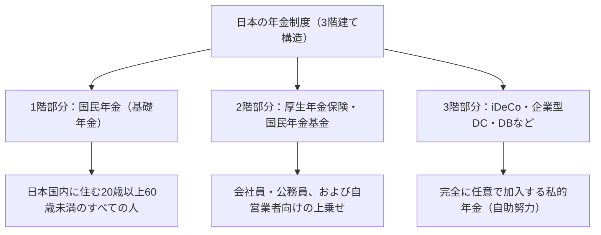

## はじめに：なぜ今、iDeCo（個人型確定拠出年金）なのか

現代の日本において、少子高齢化の進展や長寿化（いわゆる「人生100年時代」）を背景に、将来の年金不安や老後資金の不足が大きな社会課題となっています。かつてのように「国が支給する公的年金だけで豊かな老後が送れる」という時代は終わりを告げ、自助努力による資産形成が不可欠な時代へと突入しました。その中で、国が強力に後押ししている制度の筆頭が「iDeCo（個人型確定拠出年金）」です。

iDeCoは単なる投資制度ではありません。国の制度設計上、類を見ないほど強力な税制優遇が組み込まれた「最強の老後資金形成ツール」です。しかし、その強力な節税効果の裏側には、税と年金に関する複雑なメカニズムが存在しています。本記事では、iDeCoの仕組みを日本の年金制度の全体像から紐解き、掛金拠出時、運用時、受取時に享受できる「3つの節税効果」の理論的背景、限界税率への影響、60歳までの資金拘束が持つ意味、そして最適な出口戦略に至るまで、極めて詳細かつ体系的に解説します。

---

## 1. 日本の年金制度におけるiDeCoの位置づけ（3階建て構造）

iDeCoの仕組みを正確に理解するためには、まず日本の公的年金および私的年金制度の全体構造、いわゆる「年金の3階建て構造」を把握する必要があります。

### 1階部分：国民年金（基礎年金）
日本の年金制度の土台となるのが「国民年金」です。日本国内に住所を有する20歳以上60歳未満のすべての人が加入を義務付けられています（第1号〜第3号被保険者）。これが「1階部分」と呼ばれ、老後の基本的な生活を支えるベースとなりますが、これだけでは十分な生活水準を維持することは困難です。

### 2階部分：厚生年金保険・国民年金基金
1階部分の上に構築されるのが「2階部分」です。会社員や公務員（第2号被保険者）は、勤務先を通じて「厚生年金保険」に加入します。厚生年金は報酬比例となっており、現役時代の収入に応じて保険料と将来の受給額が変動します。一方、自営業者やフリーランス（第1号被保険者）は厚生年金に加入できないため、代わりに「国民年金基金」を利用して2階部分を構築することができます。

### 3階部分：任意加入の私的年金（iDeCoや企業年金）
公的年金（1階・2階）だけでは不足する老後資金を補完するために用意されているのが、私的年金である「3階部分」です。企業が従業員向けに導入する企業型確定拠出年金（企業型DC）や確定給付企業年金（DB）のほか、個人が自ら加入する「iDeCo（個人型確定拠出年金）」がここに位置付けられます。iDeCoは、職業や勤務先の制度の有無にかかわらず、原則として20歳以上65歳未満の誰もが加入できるようになっており、「国民の自助努力による資産形成」を国が税制面で強力に支援するためのインフラとなっています。

---

## 2. iDeCoの最大の魅力：3つの税制優遇メカニズム

iDeCoには、通常の投資信託や株式投資にはない、極めて強力な「3つの節税メリット」が用意されています。これらが連動することで、資産形成における複利効果と税効果が最大化されます。

### その1：掛金が「全額所得控除」になるメカニズム
iDeCoの最も即効性があり、かつ確実なメリットが「掛金の全額所得控除」です。所得控除とは、税金を計算する際のベースとなる「課税所得」から、特定の金額を差し引くことができる仕組みです。

日本の所得税は「超過累進課税制度」を採用しており、所得が高くなるほど適用される税率（限界税率）が高くなります。iDeCoで拠出した掛金は「小規模企業共済等掛金控除」として、その年の所得から全額控除されます。

#### 限界税率と節税効果の計算メカニズム
具体例として、課税所得が500万円（所得税率20%、住民税率10%）の会社員が、毎月2万3000円（年間27万6000円）の掛金を拠出する場合を考えてみましょう。

1. **所得税の節税額**：276,000円 × 20% = 55,200円
2. **住民税の節税額**：276,000円 × 10% = 27,600円
3. **合計節税額（年間）**：82,800円

この年間82,800円の節税は、言い換えれば「年間27万6000円の投資に対して、確実に約30%（82,800円）のキャッシュバックが得られている」ことと同義です。投資において「確実なリターン」というものは存在しませんが、この所得控除による節税効果は、制度を利用するだけで毎年確実に得られる「ノーリスクの利回り」と言えます。特に、所得が高く限界税率が高い人ほど、この節税メリットは劇的に大きくなります。

### その2：運用益が「全額非課税」になるメカニズム
通常、株式や投資信託で得た利益（配当金や譲渡益）には、20.315%の税金（所得税15.315%、住民税5%）がかかります。しかし、iDeCoの口座内で運用して得た利益は、期間中ずっと「非課税」となります。

この運用益非課税の真の力は「複利効果の最大化」にあります。通常口座で運用する場合、利益が出るたびに（あるいは配当を受け取るたびに）約20%が税金として差し引かれ、再投資できる金額が目減りします。しかし、iDeCoでは税金として引かれるはずだった約20%分もそのまま元本に組み込まれ、再び運用に回されます。長期間（20年、30年）にわたる運用では、この「税の繰り延べ（非課税での再投資）」がもたらす複利効果が、最終的な資産額に数百万円単位の圧倒的な差を生み出すのです。

### その3：受取時の強力な控除（退職所得控除・公的年金等控除）
iDeCoで積み立て、増やした資産を60歳以降に受け取る際にも、強力な税制優遇が用意されています。受け取り方には大きく分けて「一時金（一括受取）」と「年金（分割受取）」があり、それぞれに異なる控除が適用されます。

*   **一時金受取の場合：「退職所得控除」**
    一時金として受け取る場合、税務上は「退職所得」として扱われます。退職所得控除は、加入期間（勤続年数）が長くなるほど控除額が増える仕組みになっており、計算式は以下の通りです。
    *   加入期間20年以下：40万円 × 加入期間
    *   加入期間20年超：800万円 ＋ 70万円 ×（加入期間 － 20年）
    この控除枠内に収まれば税金は一切かかりません。さらに、控除枠を超えた場合でも、超過分の「2分の1」に対してしか課税されないという、極めて優遇された計算方法が適用されます。

*   **年金受取の場合：「公的年金等控除」**
    分割で受け取る場合は「雑所得」扱いとなりますが、「公的年金等控除」が適用されます。これは国民年金や厚生年金などの公的年金と合算して計算され、65歳以上であれば年間110万円（公的年金等の収入のみの場合）までは非課税となります。

---

## 3. 資金拘束のジレンマ：原則60歳まで引き出せない意味

iDeCoの最大のデメリットとして頻繁に挙げられるのが、「原則として60歳まで資産を引き出すことができない」という資金拘束のルールです。教育資金や住宅購入資金など、ライフイベントでまとまったお金が必要になっても、iDeCoの資産には手を付けることができません。

しかし、この「資金拘束」は、単なるデメリットではなく、制度設計上の重要な意図が含まれています。

### 強制的な「長期投資・老後資金確保」のメカニズム
人間の行動経済学的な観点から見ると、人は「将来の大きな利益」よりも「目先の小さな利益（または欲求）」を優先してしまう傾向（現在バイアス）があります。自由に引き出せる口座で積立を行っていると、相場が暴落してパニックになった時や、少しお金が必要になった時に、簡単に解約してしまいがちです。

iDeCoの60歳までの資金拘束は、この「現在バイアス」を物理的に封じ込める強力なロック機能として働きます。「老後のための資金である」という目的を強制的に貫徹させ、複利効果を数十年単位で確実に効かせるための安全装置なのです。

### 税制優遇の代償としてのロック
国がこれほどまでに手厚い税制優遇（所得控除、運用益非課税、退職所得控除）を提供している理由は、「国民に自立して老後資金を作ってもらうため」です。もし自由に引き出せる制度であれば、単なる短期的な節税ツールとして悪用されかねません。老後資金の形成という国の政策目的を達成するための「交換条件」として、60歳までの資金拘束が存在していると理解するべきです。

---

## 4. 出口戦略の最適解：一時金か、年金か、あるいは併用か

iDeCoで数千万単位の資産を築いた後、最も重要になるのが「どのように受け取るか（出口戦略）」です。受け取り方によって最終的に手元に残る金額（税引き後の金額）が大きく変わるため、事前の緻密なシミュレーションが不可欠です。

### 選択肢1：一時金（一括受取）のメカニズムと戦略
多くの場合、税制上最も有利になる可能性が高いのが「一時金での受取」です。前述の通り、退職所得控除は非常に強力です。例えば、加入期間が30年の場合、控除額は「800万円 ＋ 70万円 × 10年 ＝ 1500万円」となります。運用益を含めた受取額が1500万円以下であれば、税金はゼロです。

**注意点（会社の退職金との合算ルール）：**
しかし、会社員で勤務先から多額の退職金を受け取る場合は注意が必要です。iDeCoの一時金と会社の退職金を同じ年（あるいは近い年）に受け取ると、退職所得控除の枠を両者で共有（合算）して計算することになります。これを回避するためには、「iDeCoを先に60歳で受け取り、会社の退職金を65歳で受け取る（5年のブランクを空けるルール）」など、受け取り時期を戦略的にずらす高度なテクニック（いわゆる「退職所得控除の5年ルール」等の活用）が必要になります。

### 選択肢2：年金（分割受取）のメカニズムと戦略
分割で受け取る場合は、運用を継続しながら取り崩していくため、資産の寿命を延ばせるメリットがあります。しかし、税制面では公的年金（国民年金・厚生年金）と合算されるため、公的年金の受給額が多い人は、iDeCoの年金受取分が上乗せされることで公的年金等控除の枠をはみ出し、雑所得として課税されてしまうリスクがあります。

また、年金受取を選択した場合、信託銀行等に対して毎回「給付手数料（振込手数料）」が発生するため、少額を細かく受け取ると手数料負けする可能性も考慮しなければなりません。

### 選択肢3：一時金と年金の併用
多くの金融機関では、一時金と年金を組み合わせた「併用」を選択できます。退職所得控除の非課税枠をフル活用して一時金を受け取り、枠をはみ出す分については年金として分割で受け取り、公的年金等控除の枠内に収める、というハイブリッド戦略です。個人の状況（退職金の有無、公的年金の受給額、他の所得など）に応じて、このバランスを最適化することが、出口戦略における究極の目標となります。

---

## 結論：iDeCoは「知の格差」が資産の格差に直結する制度

iDeCo（個人型確定拠出年金）は、日本の年金制度の3階部分を担う、国家肝いりの最強の資産形成インフラです。掛金の全額所得控除による限界税率に応じた確実な節税、運用益の非課税による複利効果の極大化、そして受取時の強力な控除という「3重の税制優遇」は、他のいかなる金融商品にも真似できない圧倒的な優位性を持っています。

一方で、60歳までの資金拘束という厳格なルールや、受取時の退職所得控除・公的年金等控除をめぐる複雑な税務計算など、制度の全容を正しく理解し、戦略的に活用しなければ、その真価を十分に引き出すことはできません。

現代の日本において、iDeCoを活用するか否か、そしてどのように活用するかは、もはや単なる「投資の選択」ではなく、「生涯の税務戦略」であり「老後における生存戦略」そのものです。金融リテラシーを高め、国の制度を最大限にハックすることが、豊かな人生100年時代を生き抜くための最も確実な第一歩となるでしょう。
