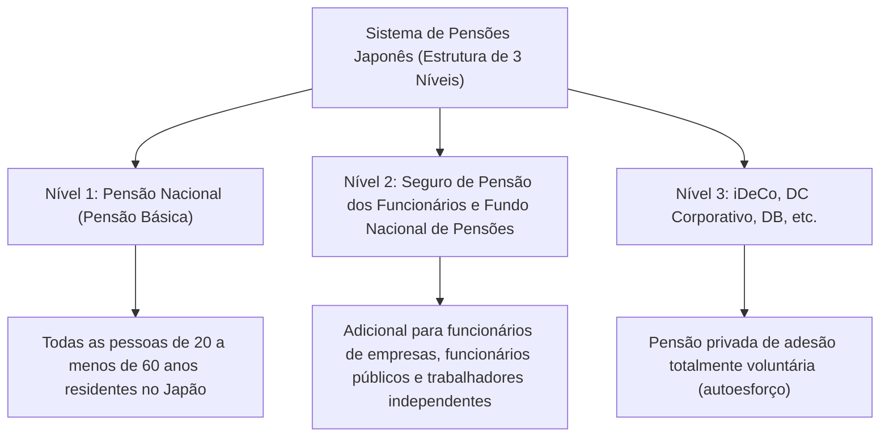

## Introdução: Por que o iDeCo (Plano de Pensão de Contribuição Definida Individual) agora?

No Japão moderno, com o avanço da baixa taxa de natalidade, envelhecimento da população e aumento da longevidade (a chamada "era dos 100 anos de vida"), a ansiedade sobre as pensões futuras e a falta de fundos para a aposentadoria tornaram-se grandes problemas sociais. A era em que se podia "viver uma aposentadoria rica apenas com a pensão pública fornecida pelo Estado" chegou ao fim, e entramos em uma era onde a formação de patrimônio através do autoesforço é indispensável. Nesse contexto, o "iDeCo" (Plano de Pensão de Contribuição Definida Individual) é o principal sistema fortemente apoiado pelo governo.

O iDeCo não é um simples sistema de investimento. Devido ao design institucional do Estado, é a "ferramenta mais forte de formação de fundos de aposentadoria", incorporando benefícios fiscais incrivelmente poderosos e sem precedentes. No entanto, por trás desse poderoso efeito de economia de impostos, existe um mecanismo complexo em relação a impostos e pensões. Neste artigo, desvendaremos o mecanismo do iDeCo a partir da visão geral do sistema de pensões japonês e explicaremos de forma extremamente detalhada e sistemática a base teórica dos "três efeitos de economia fiscal" que podem ser desfrutados nos momentos de contribuição, investimento e recebimento, o impacto na taxa marginal de imposto, o significado da restrição de fundos até os 60 anos e a estratégia de saída ideal.

---

## 1. A Posição do iDeCo no Sistema de Pensões Japonês (Estrutura de Três Níveis)

Para entender com precisão o mecanismo do iDeCo, primeiro é necessário compreender a estrutura geral dos sistemas de pensão pública e privada do Japão, a chamada "estrutura de pensão de três níveis".

### Nível 1: Pensão Nacional (Pensão Básica)
A base do sistema de pensões japonês é a "Pensão Nacional". É obrigatório para todos os residentes no Japão com idade entre 20 e menos de 60 anos (segurados de categoria 1 a 3). Isso é chamado de "Nível 1" e serve como base para apoiar o meio de vida básico na aposentadoria, mas é difícil manter um padrão de vida adequado apenas com isso.

### Nível 2: Seguro de Pensão dos Funcionários e Fundo Nacional de Pensões
Construído sobre o Nível 1, temos o "Nível 2". Funcionários de empresas e funcionários públicos (segurados de categoria 2) aderem ao "Seguro de Pensão dos Funcionários" através de seus empregadores. Esta pensão é proporcional à remuneração, portanto, os prêmios de seguro e os benefícios futuros variam de acordo com a renda durante os anos de trabalho. Por outro lado, trabalhadores independentes e freelancers (segurados de categoria 1) não podem aderir ao Seguro de Pensão dos Funcionários, então eles podem usar o "Fundo Nacional de Pensões" para construir o Nível 2.

### Nível 3: Pensões Privadas Voluntárias (iDeCo e Pensões Corporativas)
Para complementar os fundos de aposentadoria que são insuficientes apenas com as pensões públicas (Níveis 1 e 2), existe o "Nível 3", que são as pensões privadas. Aqui estão posicionados o Plano de Pensão de Contribuição Definida Corporativa (DC Corporativo) e a Pensão Corporativa de Benefício Definido (DB), introduzidos pelas empresas para seus funcionários, bem como o "iDeCo (Plano de Pensão de Contribuição Definida Individual)", ao qual os indivíduos aderem por conta própria. Como regra geral, qualquer pessoa entre 20 e menos de 65 anos pode aderir ao iDeCo, independentemente da sua profissão ou se a empresa tem um sistema próprio. Tornou-se uma infraestrutura para o Estado apoiar fortemente a "formação de patrimônio através do autoesforço dos cidadãos" sob o aspecto fiscal.

---

## 2. O Maior Atrativo do iDeCo: 3 Mecanismos de Benefícios Fiscais

O iDeCo oferece "três benefícios de economia fiscal" extremamente poderosos que fundos de investimento regulares e investimentos em ações não possuem. Ao combiná-los, maximiza-se o efeito dos juros compostos e o efeito fiscal na formação de patrimônio.

### Número 1: O Mecanismo Onde as Contribuições se Tornam "Totalmente Dedutíveis da Renda"
O benefício mais imediato e certo do iDeCo é a "dedução total da renda das contribuições". A dedução de renda é um sistema em que um valor específico pode ser subtraído da "renda tributável", que é a base para o cálculo dos impostos.

O imposto de renda do Japão adota um "sistema de tributação progressiva", onde a taxa aplicável (taxa marginal de imposto) aumenta quanto maior a renda. As contribuições feitas para o iDeCo são totalmente deduzidas da renda daquele ano como "Dedução de Prêmios de Ajuda Mútua para Pequenas Empresas".

#### Mecanismo de Cálculo da Taxa Marginal de Imposto e do Efeito de Economia Fiscal
Como exemplo, vamos considerar um funcionário de empresa com uma renda tributável de 5 milhões de ienes (taxa de imposto de renda 20%, taxa de imposto de residência 10%) que contribui com 23.000 ienes por mês (276.000 ienes por ano).

1. **Economia no Imposto de Renda**: 276.000 ienes × 20% = 55.200 ienes
2. **Economia no Imposto de Residência**: 276.000 ienes × 10% = 27.600 ienes
3. **Economia Total (Anual)**: 82.800 ienes

Essa economia de 82.800 ienes por ano é sinônimo de dizer que "para um investimento anual de 276.000 ienes, você certamente está recebendo um reembolso em dinheiro de cerca de 30% (82.800 ienes)". Embora não exista um "retorno garantido" em investimentos, este efeito de economia fiscal devido à dedução de renda pode ser considerado um "rendimento sem risco" obtido de forma garantida todos os anos simplesmente usando o sistema. Especialmente para pessoas com alta renda e uma alta taxa marginal de imposto, esse benefício fiscal se torna dramaticamente maior.

### Número 2: O Mecanismo Onde os Ganhos de Investimento se Tornam "Totalmente Isentos de Impostos"
Normalmente, os lucros obtidos de ações ou fundos de investimento (dividendos ou ganhos de capital) estão sujeitos a um imposto de 20,315% (15,315% de imposto de renda e 5% de imposto de residência). No entanto, os lucros obtidos operando dentro de uma conta iDeCo são "isentos de impostos" durante todo o período.

O verdadeiro poder dessa isenção de impostos sobre os ganhos de investimento reside na "maximização do efeito dos juros compostos". Ao operar em uma conta normal, cada vez que o lucro é gerado (ou dividendos são recebidos), cerca de 20% são deduzidos como imposto, diminuindo o valor que pode ser reinvestido. No entanto, no iDeCo, os aproximadamente 20% que seriam deduzidos como imposto são diretamente incorporados ao principal e reinvestidos. Ao longo de um longo período (20, 30 anos), o efeito dos juros compostos trazido por esse "diferimento de impostos (reinvestimento isento de impostos)" cria uma diferença esmagadora de milhões de ienes no valor final do patrimônio.

### Número 3: Poderosas Deduções no Recebimento (Dedução de Imposto sobre Renda de Aposentadoria e Dedução de Pensão Pública)
Quando você recebe os ativos acumulados e aumentados no iDeCo a partir dos 60 anos, também são oferecidos poderosos benefícios fiscais. O método de recebimento é amplamente dividido em "montante fixo (pagamento único)" e "pensão (pagamento em parcelas)", e deduções diferentes se aplicam a cada um.

*   **No caso de Recebimento em Montante Fixo: "Dedução de Imposto sobre Renda de Aposentadoria"**
    Ao receber como um montante fixo, é tratado fiscalmente como "renda de aposentadoria". A dedução de imposto sobre renda de aposentadoria está estruturada de forma que o valor da dedução aumenta quanto mais longo for o período de contribuição (anos de serviço), e a fórmula de cálculo é a seguinte:
    *   Período de contribuição de 20 anos ou menos: 400.000 ienes × anos de contribuição
    *   Período de contribuição superior a 20 anos: 8.000.000 ienes + 700.000 ienes × (anos de contribuição - 20 anos)
    Nenhum imposto é cobrado desde que permaneça dentro deste limite de dedução. Além disso, mesmo que exceda o limite de dedução, aplica-se um método de cálculo extremamente preferencial, onde apenas a "metade" do excesso é tributada.

*   **No caso de Recebimento de Pensão: "Dedução de Pensão Pública, etc."**
    Ao receber em parcelas, é tratado como "renda diversa", mas aplica-se a "Dedução de Pensão Pública, etc.". Isso é calculado em conjunto com pensões públicas, como a Pensão Nacional e o Seguro de Pensão dos Funcionários, e se você tem 65 anos ou mais, até 1,1 milhão de ienes por ano (se a receita for apenas de pensões públicas) fica isento de impostos.

---

## 3. O Dilema da Restrição de Fundos: O Significado de Não Poder Sacar até os 60 Anos em Princípio

A desvantagem mais frequentemente citada do iDeCo é a regra de restrição de fundos de que, "em princípio, os ativos não podem ser sacados até os 60 anos de idade". Mesmo que uma grande quantia de dinheiro seja necessária para um evento da vida, como fundos para educação ou para a compra de uma casa, os ativos do iDeCo não podem ser tocados.

No entanto, essa "restrição de fundos" não é apenas uma desvantagem, mas contém uma importante intenção do design institucional.

### O Mecanismo Forçado de "Investimento a Longo Prazo e Garantia de Fundos de Aposentadoria"
Da perspectiva da economia comportamental humana, as pessoas tendem a priorizar "pequenos lucros imediatos (ou desejos)" sobre "grandes lucros futuros" (viés do presente). Se você fizer contribuições para uma conta da qual pode sacar livremente, quando o mercado quebrar e você entrar em pânico, ou quando precisar de um pouco de dinheiro, é provável que você cancele a conta facilmente.

A restrição de fundos do iDeCo até os 60 anos atua como uma poderosa função de bloqueio para conter fisicamente esse "viés do presente". É um dispositivo de segurança que reforça compulsoriamente o propósito de que "são fundos para a aposentadoria", garantindo que o efeito dos juros compostos funcione por décadas.

### O Bloqueio como Preço Pelos Benefícios Fiscais
A razão pela qual o governo fornece benefícios fiscais tão generosos (dedução de renda, isenção de imposto sobre os ganhos de investimento, dedução de imposto sobre renda de aposentadoria) é "para que os cidadãos construam de forma independente fundos para a aposentadoria". Se fosse um sistema do qual se pudesse sacar livremente, poderia ser abusado como uma mera ferramenta de economia fiscal a curto prazo. A restrição de fundos até os 60 anos deve ser compreendida como uma "condição de troca" para atingir o objetivo da política governamental de formar fundos de aposentadoria.

---

## 4. A Solução Ideal da Estratégia de Saída: Montante Fixo, Pensão ou uma Combinação de Ambos

Depois de construir dezenas de milhões em ativos com o iDeCo, o mais importante se torna "como recebê-los (estratégia de saída)". O valor que você finalmente terá em mãos (após impostos) mudará significativamente dependendo do método de recebimento, portanto, uma simulação prévia e cuidadosa é essencial.

### Opção 1: Mecanismo e Estratégia do Montante Fixo (Pagamento Único)
Na maioria dos casos, a opção que provavelmente será a mais vantajosa do ponto de vista fiscal é o "recebimento em montante fixo". Como mencionado acima, a dedução de imposto sobre renda de aposentadoria é muito poderosa. Por exemplo, se o período de contribuição for de 30 anos, o valor da dedução será "8.000.000 ienes + 700.000 ienes × 10 anos = 15.000.000 ienes". Se o valor recebido, incluindo ganhos de investimento, for de 15.000.000 ienes ou menos, o imposto é zero.

**Atenção (Regra de soma com o pagamento de rescisão da empresa):**
No entanto, é necessário ter cuidado se você for um funcionário e receber um grande pagamento de rescisão do seu empregador. Se você receber o montante fixo do iDeCo e o pagamento de rescisão da empresa no mesmo ano (ou anos próximos), o limite de dedução do imposto sobre a renda de aposentadoria será compartilhado (somado) entre os dois para o cálculo. Para evitar isso, técnicas avançadas (como a utilização da chamada "regra dos 5 anos de dedução de imposto sobre renda de aposentadoria") são necessárias para escalonar estrategicamente os períodos de recebimento, como "receber o iDeCo primeiro aos 60 anos, e receber o pagamento de rescisão da empresa aos 65 anos (regra de deixar uma lacuna de 5 anos)".

### Opção 2: Mecanismo e Estratégia da Pensão (Pagamento em Parcelas)
Quando você escolhe receber em parcelas, tem a vantagem de prolongar a vida útil de seus ativos, pois eles continuam a ser investidos enquanto você os saca. No entanto, em termos fiscais, é somado à pensão pública (Pensão Nacional / Seguro de Pensão dos Funcionários), portanto, pessoas que recebem uma grande quantia de pensão pública correm o risco de ultrapassar o limite da dedução da pensão pública devido à adição da pensão do iDeCo e de serem tributadas como renda diversa.

Além disso, se você optar pelo recebimento da pensão, ocorrerá uma "taxa de pagamento (taxa de transferência)" cobrada pelos bancos fiduciários etc. a cada vez, portanto, você também deve considerar a possibilidade de perder dinheiro para as taxas se receber pequenas quantias em parcelas frequentes.

### Opção 3: Combinação de Montante Fixo e Pensão
Muitas instituições financeiras permitem que você escolha uma "combinação" de montante fixo e pensão. É uma estratégia híbrida em que você usa totalmente a cota isenta de impostos da dedução de imposto sobre renda de aposentadoria para receber um montante fixo, e a parte que excede a cota é recebida em parcelas como pensão, mantendo-a dentro da cota de dedução de pensão pública. Otimizar esse equilíbrio de acordo com a situação do indivíduo (presença ou ausência de pagamento de rescisão, valor recebido da pensão pública, outras rendas, etc.) é o objetivo final na estratégia de saída.

---

## Conclusão: iDeCo é um Sistema Onde a "Diferença de Conhecimento" Leva Diretamente à Diferença de Patrimônio

O iDeCo (Plano de Pensão de Contribuição Definida Individual) é a infraestrutura de formação de patrimônio mais forte liderada pelo Estado, responsável pelo terceiro nível do sistema de pensões japonês. O "benefício fiscal triplo" da dedução total da renda sobre as contribuições garantindo uma economia de impostos de acordo com a taxa marginal de imposto, a maximização do efeito dos juros compostos através da isenção de impostos sobre os lucros do investimento e a poderosa dedução no recebimento, possui uma vantagem esmagadora inigualável por qualquer outro produto financeiro.

Por outro lado, a menos que você entenda corretamente todo o sistema e o utilize estrategicamente, incluindo a regra estrita de restrição de fundos até os 60 anos e o complexo cálculo de impostos para a dedução de imposto sobre renda de aposentadoria e dedução de pensão pública no recebimento, você não será capaz de extrair totalmente seu verdadeiro valor.

No Japão moderno, utilizar ou não o iDeCo, e como utilizá-lo, não é mais uma simples "escolha de investimento", mas é a própria "estratégia tributária vitalícia" e "estratégia de sobrevivência na velhice". Melhorar a literacia financeira e aproveitar ao máximo o sistema nacional será sem dúvida o primeiro e mais seguro passo para sobreviver a uma rica era de 100 anos de vida.
